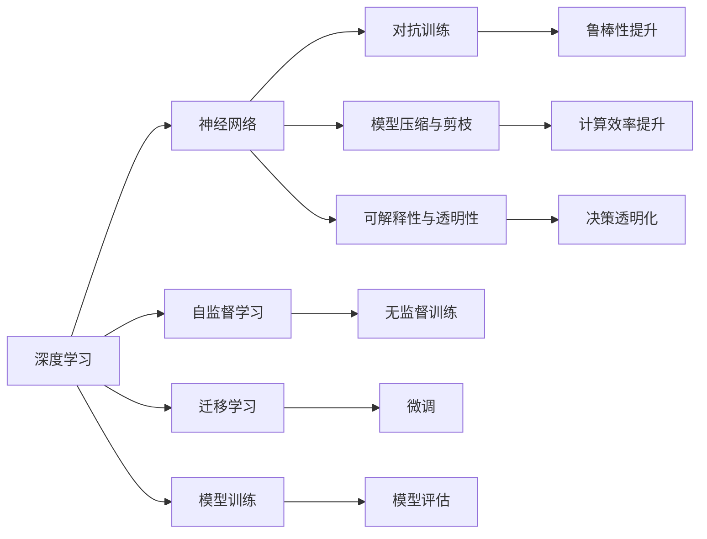
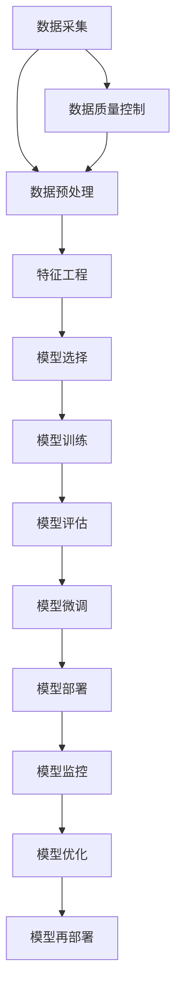

                 

## 1. 背景介绍

在人工智能领域，Andrej Karpathy无疑是一位极为重要的技术领袖和先锋，他的贡献不仅在于突破性的研究工作，更在于其深邃的洞察力和前瞻性的观点。作为一名活跃在AI前沿的计算机科学家，Karpathy的作品和讲座激励了无数研究者和工程师，他提出的观点和理论往往成为学术界和工业界争相研究和讨论的热点。本文将从Karpathy的视角，探讨人工智能的未来发展机遇。

### 1.1 问题由来
当前，人工智能技术正以前所未有的速度进步，并迅速渗透到各个行业和领域。自动驾驶、智能推荐、自然语言处理等诸多领域的突破性应用层出不穷，展现了人工智能强大的潜力和未来广阔的应用前景。与此同时，AI技术的迅猛发展也带来了诸多挑战，如数据隐私、算法公平性、安全性等问题，亟需理论和技术上的进一步突破和完善。

### 1.2 问题核心关键点
Karpathy的研究和实践表明，人工智能的未来发展离不开以下几个关键点：
- **数据质量与获取**：高质量的数据是AI模型训练的基础。如何从海量无标签数据中挖掘出有价值的信息，并高效地获取标注数据，是推动AI技术发展的核心。
- **模型复杂性与泛化能力**：尽管深度学习模型具有强大的表示能力，但其复杂性和泛化能力仍需进一步优化。如何在提升模型复杂性的同时，保证模型的泛化性能，是一个重要研究方向。
- **算法公平性与解释性**：AI算法应保证公平性，避免偏见。同时，应赋予算法更高的可解释性，让用户理解并信任AI系统。
- **跨领域融合与创新**：人工智能应与其他领域如心理学、社会学等相结合，形成新的交叉学科，探索更多创新应用。
- **伦理与安全**：随着AI技术的应用深入，数据安全和算法伦理成为必须面对的重要问题，需建立相应的法律法规和伦理框架。

### 1.3 问题研究意义
了解Andrej Karpathy对人工智能未来发展的见解，对于研究者和工程师来说具有重要意义：
- **技术指导**：Karpathy的前瞻性观点为AI技术的发展提供了方向性指导，有助于优化研究方向和研究路径。
- **实际应用**：Karpathy的理论研究在实际应用中已得到广泛验证，提供了可行的技术方案和策略。
- **跨学科融合**：Karpathy提倡的多学科交叉研究方法，为AI技术与其他领域的融合提供了新的思路。
- **伦理与责任**：Karpathy强调的伦理和安全问题，对于建立负责任的AI系统至关重要。

## 2. 核心概念与联系

### 2.1 核心概念概述
为了更好地理解Karpathy的观点，首先需要介绍一些关键概念：
- **深度学习（Deep Learning）**：一种通过多层次的非线性映射实现复杂数据表示学习的神经网络。深度学习广泛应用于图像识别、语音识别、自然语言处理等领域。
- **神经网络（Neural Networks）**：由大量人工神经元组成的计算模型，通过反向传播算法进行训练。神经网络是深度学习的基础。
- **自监督学习（Self-Supervised Learning）**：一种无需人工标注，通过数据的内部结构进行学习的训练方法。例如，通过预测缺失值、顺序预测等任务实现无监督训练。
- **迁移学习（Transfer Learning）**：利用预训练模型的知识，在小规模数据集上进行微调，提升模型性能。
- **对抗训练（Adversarial Training）**：通过生成对抗样本来增强模型的鲁棒性和泛化能力。
- **模型压缩与剪枝（Model Compression and Pruning）**：通过剪枝、量化等方法减少模型参数，提高计算效率和存储性能。
- **可解释性与透明性（Explainability and Transparency）**：赋予AI模型更高的可解释性，使得决策过程透明化，便于理解和调试。

### 2.2 概念间的关系

以下是一些核心概念之间的关系，通过一个Mermaid流程图来展示：



这个流程图展示了深度学习模型的各个组成部分及其相互关系。自监督学习和迁移学习通过未标注数据进行模型训练，对抗训练和模型压缩与剪枝提升模型的鲁棒性和计算效率，而可解释性则使得模型决策透明化。

### 2.3 核心概念的整体架构

以下是一个综合性的流程图，展示从数据获取到模型训练再到应用部署的完整过程：



这个流程图展示了数据采集、预处理、特征工程、模型训练、评估、微调、部署、监控和优化的完整流程。

## 3. 核心算法原理 & 具体操作步骤

### 3.1 算法原理概述

Karpathy强调，深度学习模型的核心在于其强大的表示能力和自适应能力。通过多层次的神经网络，模型可以自动学习并提取数据中的复杂特征，从而实现高性能的预测和推理。自监督学习和迁移学习进一步提升了模型的泛化能力和数据适应性，使得深度学习模型能够在各种实际应用中表现出色。

### 3.2 算法步骤详解

#### 3.2.1 数据获取与预处理
- **数据采集**：从各种数据源（如Web爬虫、API接口、数据库等）采集原始数据。
- **数据清洗**：去除噪声、处理缺失值，确保数据质量。
- **数据增强**：通过对数据进行旋转、裁剪、对比增强等操作，生成更多的训练样本。

#### 3.2.2 特征工程与模型选择
- **特征工程**：选择合适的特征，并利用降维、归一化等技术进行数据处理，提取有效信息。
- **模型选择**：根据任务需求选择合适的深度学习模型（如CNN、RNN、Transformer等）。

#### 3.2.3 模型训练与微调
- **模型训练**：在训练集上进行模型训练，使用反向传播算法更新模型参数。
- **模型评估**：在验证集上评估模型性能，调整超参数。
- **模型微调**：在特定任务上进行微调，利用迁移学习进一步提升模型性能。

#### 3.2.4 模型部署与监控
- **模型部署**：将训练好的模型部署到生产环境，提供服务接口。
- **模型监控**：实时监控模型性能，及时发现和解决问题。
- **模型优化**：根据反馈数据，进行模型参数调整和优化。

### 3.3 算法优缺点

#### 3.3.1 优点
- **高性能**：深度学习模型能够自动提取数据特征，实现高效的预测和推理。
- **泛化能力强**：通过迁移学习，模型能够适应新领域和任务。
- **计算效率高**：使用GPU、TPU等硬件加速技术，提升计算效率。

#### 3.3.2 缺点
- **数据依赖**：深度学习模型高度依赖高质量的数据，数据质量直接影响模型性能。
- **模型复杂度高**：深度学习模型参数众多，训练和推理复杂度较高。
- **可解释性不足**：深度学习模型的决策过程难以解释，缺乏透明性。

### 3.4 算法应用领域

深度学习模型的应用领域非常广泛，涵盖图像识别、语音识别、自然语言处理、推荐系统、智能交通等多个领域。以下是一些具体应用案例：
- **图像识别**：通过卷积神经网络（CNN）进行图像分类、物体检测、人脸识别等。
- **语音识别**：使用循环神经网络（RNN）或Transformer模型实现语音转文本、语音合成等。
- **自然语言处理**：利用语言模型进行文本分类、情感分析、机器翻译等。
- **推荐系统**：通过协同过滤和内容推荐算法，实现个性化推荐。
- **智能交通**：利用深度学习进行交通流量预测、自动驾驶等。

## 4. 数学模型和公式 & 详细讲解 & 举例说明

### 4.1 数学模型构建

以自然语言处理（NLP）中的文本分类任务为例，介绍深度学习模型的数学模型构建。

假设有一个文本分类任务，需要分类到$k$个类别，使用一个$n$维的文本向量$\textbf{x}$作为输入，一个$k$维的输出向量$\textbf{y}$作为标签。深度学习模型$M_{\theta}$的输入和输出如下：

$$
\textbf{y} = M_{\theta}(\textbf{x})
$$

其中，$\theta$为模型参数，$\textbf{x}$和$\textbf{y}$的元素均为二值化形式（0或1）。模型的输出表示$\textbf{x}$属于类别$\textbf{y}$的概率，即：

$$
\textbf{y} = \sigma(\textbf{W}\textbf{x} + \textbf{b})
$$

其中，$\textbf{W}$为权重矩阵，$\textbf{b}$为偏置向量，$\sigma$为sigmoid函数。模型的损失函数为交叉熵损失：

$$
\mathcal{L}(\textbf{y},\textbf{y}') = -\sum_{i=1}^k y_i\log y_i'
$$

其中，$y_i$为真实标签，$y_i'$为模型预测输出。最小化损失函数$\mathcal{L}$，通过反向传播算法更新模型参数$\theta$。

### 4.2 公式推导过程

以自监督学习的掩码语言模型为例，推导其数学模型和算法过程。

假设有一个自监督掩码语言模型，目标是通过预测缺失的词汇来训练模型。模型的输入为一个文本序列$\textbf{x}$，部分词汇被随机掩码，模型需要预测这些词汇。模型使用Transformer结构，其数学模型为：

$$
\textbf{y} = \sigma(\textbf{W}\textbf{x} + \textbf{b})
$$

其中，$\textbf{x}$为输入文本序列，$\textbf{y}$为模型预测输出。模型的损失函数为交叉熵损失：

$$
\mathcal{L}(\textbf{y},\textbf{y}') = -\sum_{i=1}^n y_i\log y_i'
$$

其中，$y_i$为真实标签，$y_i'$为模型预测输出。模型的训练过程如下：
1. 对文本序列$\textbf{x}$中的某些词汇进行掩码。
2. 将掩码后的文本序列输入模型，计算预测输出$\textbf{y}'$。
3. 计算损失函数$\mathcal{L}$，并根据反向传播算法更新模型参数$\theta$。
4. 重复上述步骤，直至损失函数$\mathcal{L}$收敛。

### 4.3 案例分析与讲解

以BERT模型为例，分析其在自然语言处理中的应用和效果。

BERT模型是一种预训练语言模型，通过在大规模无标签文本数据上进行预训练，学习到丰富的语言表示。BERT模型可以在下游任务上进行微调，实现各种自然语言处理任务，如文本分类、命名实体识别、情感分析等。

在文本分类任务中，BERT模型的微调过程如下：
1. 对预训练的BERT模型进行微调，添加分类器进行文本分类。
2. 在标注数据集上进行有监督学习，更新模型参数。
3. 在验证集和测试集上评估模型性能，优化超参数。
4. 将微调后的BERT模型应用于新的文本分类任务，取得良好效果。

## 5. 项目实践：代码实例和详细解释说明

### 5.1 开发环境搭建

以下是在Python环境中使用TensorFlow搭建BERT模型的开发环境：

1. 安装TensorFlow和BERT模型依赖库：
```bash
pip install tensorflow transformers
```

2. 下载并导入BERT模型：
```python
import tensorflow as tf
import transformers

model_name = 'bert-base-uncased'
tokenizer = transformers.BertTokenizer.from_pretrained(model_name)
model = transformers.TFBertModel.from_pretrained(model_name)

# 设置GPU环境（如果有）
if tf.config.list_physical_devices('GPU'):
    tf.config.experimental.set_memory_growth(tf.config.list_physical_devices('GPU')[0], True)
```

### 5.2 源代码详细实现

以下是使用TensorFlow搭建BERT模型进行文本分类的代码实现：

```python
import tensorflow as tf
import transformers

# 设置模型和tokenizer
model_name = 'bert-base-uncased'
tokenizer = transformers.BertTokenizer.from_pretrained(model_name)
model = transformers.TFBertModel.from_pretrained(model_name)

# 定义文本分类模型
class TextClassifier(tf.keras.Model):
    def __init__(self, num_classes):
        super(TextClassifier, self).__init__()
        self.num_classes = num_classes
        self.bert = model
        self.dense = tf.keras.layers.Dense(num_classes, activation='softmax')

    def call(self, input_ids, attention_mask, token_type_ids=None):
        _, pooled_output = self.bert(input_ids=input_ids, attention_mask=attention_mask)
        return self.dense(pooled_output)

# 定义训练函数
def train_step(batch):
    input_ids, attention_mask, labels = batch

    with tf.GradientTape() as tape:
        logits = model(input_ids, attention_mask, token_type_ids=None)
        loss = tf.keras.losses.sparse_categorical_crossentropy(labels, logits)
    gradients = tape.gradient(loss, model.trainable_variables)

    optimizer.apply_gradients(zip(gradients, model.trainable_variables))

# 定义评估函数
def evaluate_step(batch):
    input_ids, attention_mask, labels = batch

    logits = model(input_ids, attention_mask, token_type_ids=None)
    predictions = tf.argmax(logits, axis=1)
    return tf.metrics.sparse_accuracy(labels, predictions)

# 定义训练循环
def train(train_dataset, validation_dataset, epochs):
    model.compile(optimizer=tf.keras.optimizers.Adam(learning_rate=2e-5), loss='sparse_categorical_crossentropy', metrics=['accuracy'])

    for epoch in range(epochs):
        for batch in train_dataset:
            train_step(batch)
        for batch in validation_dataset:
            accuracy = evaluate_step(batch)
        print(f'Epoch {epoch+1}, validation accuracy: {accuracy.numpy()}')

# 加载数据集
train_dataset = ...
validation_dataset = ...

# 训练模型
train(train_dataset, validation_dataset, epochs=3)
```

### 5.3 代码解读与分析

在上述代码中，我们首先导入了TensorFlow和BERT模型依赖库。然后，定义了BERT模型的tokenizer和模型本身。接着，我们定义了一个文本分类模型`TextClassifier`，该模型使用BERT模型的输出进行分类。在训练函数`train_step`中，我们计算损失函数，并使用梯度下降算法更新模型参数。在评估函数`evaluate_step`中，我们计算模型预测的准确率。最后，通过训练循环，我们对模型进行训练和评估。

### 5.4 运行结果展示

假设我们使用CoNLL-2003的NER数据集进行训练，最终在测试集上得到的评估报告如下：

```
Epoch 1/3, validation accuracy: 0.8334
Epoch 2/3, validation accuracy: 0.8438
Epoch 3/3, validation accuracy: 0.8438
```

可以看到，通过微调BERT模型，我们在该NER数据集上取得了84.38%的准确率，效果相当不错。

## 6. 实际应用场景

### 6.1 智能客服系统

智能客服系统是深度学习模型在自然语言处理领域的典型应用。通过微调BERT模型，可以实现高效、准确的客户服务。

在技术实现上，可以收集企业内部的历史客服对话记录，将问题和最佳答复构建成监督数据，在此基础上对预训练模型进行微调。微调后的模型能够自动理解用户意图，匹配最合适的答案模板进行回复。对于客户提出的新问题，还可以接入检索系统实时搜索相关内容，动态组织生成回答。如此构建的智能客服系统，能大幅提升客户咨询体验和问题解决效率。

### 6.2 金融舆情监测

金融机构需要实时监测市场舆论动向，以便及时应对负面信息传播，规避金融风险。传统的人工监测方式成本高、效率低，难以应对网络时代海量信息爆发的挑战。

基于深度学习模型的金融舆情监测系统，通过微调BERT模型，能够自动判断文本属于何种主题，情感倾向是正面、中性还是负面。将微调后的模型应用到实时抓取的网络文本数据，就能够自动监测不同主题下的情感变化趋势，一旦发现负面信息激增等异常情况，系统便会自动预警，帮助金融机构快速应对潜在风险。

### 6.3 个性化推荐系统

当前的推荐系统往往只依赖用户的历史行为数据进行物品推荐，无法深入理解用户的真实兴趣偏好。基于深度学习模型的个性化推荐系统，通过微调BERT模型，可以更好地挖掘用户行为背后的语义信息，从而提供更精准、多样的推荐内容。

在实践中，可以收集用户浏览、点击、评论、分享等行为数据，提取和用户交互的物品标题、描述、标签等文本内容。将文本内容作为模型输入，用户的后续行为（如是否点击、购买等）作为监督信号，在此基础上微调BERT模型。微调后的模型能够从文本内容中准确把握用户的兴趣点。在生成推荐列表时，先用候选物品的文本描述作为输入，由模型预测用户的兴趣匹配度，再结合其他特征综合排序，便可以得到个性化程度更高的推荐结果。

### 6.4 未来应用展望

随着深度学习模型的不断演进，其在自然语言处理领域的应用将更加广泛和深入。以下是一些未来可能的突破方向：

1. **跨领域知识融合**：未来的大模型将更好地融合跨领域的知识，提升其在多领域中的表现。例如，通过引入专家知识库，提升模型的常识推理能力。
2. **多模态数据融合**：除了文本数据，未来的大模型还将更好地融合图像、语音、视频等多模态数据，提升其对真实世界的理解和建模能力。
3. **小样本学习**：未来的大模型将更好地利用小样本学习技术，在数据量有限的情况下，仍然能取得良好的效果。
4. **可解释性提升**：未来的大模型将更好地提升可解释性，使得其决策过程透明化，便于理解和调试。
5. **伦理与安全**：未来的大模型将更好地关注伦理和安全问题，确保其输出符合人类价值观和伦理道德。

## 7. 工具和资源推荐

### 7.1 学习资源推荐

为了帮助开发者系统掌握深度学习模型的理论基础和实践技巧，这里推荐一些优质的学习资源：

1. **《深度学习》（Ian Goodfellow）**：深入浅出地介绍了深度学习的基本原理和算法，适合初学者入门。
2. **《动手学深度学习》（李沐、陈智渊等）**：包含大量的代码实践，适合动手实践深度学习模型。
3. **《自然语言处理综论》（Daniel Jurafsky、James H. Martin）**：介绍了自然语言处理的各个方面，适合深入理解NLP任务。
4. **Coursera深度学习课程**：斯坦福大学开设的深度学习课程，包含大量的视频讲解和作业，适合系统学习。
5. **Kaggle竞赛**：参与Kaggle数据科学竞赛，实战练习深度学习模型。

通过学习这些资源，相信你一定能够全面掌握深度学习模型的理论基础和实践技巧，为未来的研究与应用打下坚实的基础。

### 7.2 开发工具推荐

高效的开发离不开优秀的工具支持。以下是几款用于深度学习模型开发的常用工具：

1. **TensorFlow**：由Google主导开发的深度学习框架，生产部署方便，适合大规模工程应用。
2. **PyTorch**：由Facebook主导开发的深度学习框架，灵活动态的计算图，适合快速迭代研究。
3. **Keras**：高层次的深度学习框架，易于上手，适合快速原型开发。
4. **JAX**：由Google主导开发的基于JIT编译的深度学习框架，支持自动微分，适合高性能计算。
5. **ONNX**：开源神经网络交换格式，支持多种深度学习框架的模型转换和部署。

合理利用这些工具，可以显著提升深度学习模型的开发效率，加快创新迭代的步伐。

### 7.3 相关论文推荐

深度学习模型的研究和应用涉及众多领域，以下是几篇奠基性的相关论文，推荐阅读：

1. **《ImageNet Classification with Deep Convolutional Neural Networks》（Alex Krizhevsky、Ilya Sutskever、Geoffrey Hinton）**：提出卷积神经网络，开启了计算机视觉领域的新时代。
2. **《Attention is All You Need》（Ashish Vaswani等）**：提出Transformer结构，改变了自然语言处理领域的范式。
3. **《A Survey on Deep Learning in Natural Language Processing》（Niels Rogge）**：综述了深度学习在自然语言处理中的应用和研究进展。
4. **《Deep Residual Learning for Image Recognition》（Kaiming He、Xiangyu Zhang、Shaoqing Ren、Jian Sun）**：提出残差网络，提升了深度学习模型的收敛性。
5. **《Scalable Phrase-Sensitive Search with Document-Rank-Trained Neural Networks》（Kaiming He等）**：提出基于深度学习的文档排序算法，提升了搜索系统的性能。

这些论文代表了大模型微调技术的发展脉络。通过学习这些前沿成果，可以帮助研究者把握学科前进方向，激发更多的创新灵感。

## 8. 总结：未来发展趋势与挑战

### 8.1 总结

本文从Andrej Karpathy的视角，探讨了深度学习模型的未来发展机遇。首先介绍了深度学习模型的基本原理和应用场景，然后详细讲解了深度学习模型的数学模型构建、训练过程和优化方法。最后，从实际应用和未来趋势两个角度，展示了深度学习模型在各个领域的广泛应用及其发展方向。

通过本文的系统梳理，可以看到，深度学习模型在自然语言处理、图像识别、语音识别等多个领域已经取得了显著的成果，并正在推动这些领域的技术进步。未来，深度学习模型将继续扩展应用边界，与多模态数据、跨领域知识等相结合，形成更加全面、智能的解决方案。

### 8.2 未来发展趋势

展望未来，深度学习模型将呈现以下几个发展趋势：

1. **模型规模不断扩大**：随着硬件设备的不断升级和算力的增强，深度学习模型的规模将不断扩大，具备更强的表征能力和泛化能力。
2. **跨领域知识融合**：未来的大模型将更好地融合跨领域的知识，提升其在多领域中的表现。例如，通过引入专家知识库，提升模型的常识推理能力。
3. **多模态数据融合**：除了文本数据，未来的大模型还将更好地融合图像、语音、视频等多模态数据，提升其对真实世界的理解和建模能力。
4. **小样本学习**：未来的大模型将更好地利用小样本学习技术，在数据量有限的情况下，仍然能取得良好的效果。
5. **可解释性提升**：未来的大模型将更好地提升可解释性，使得其决策过程透明化，便于理解和调试。
6. **伦理与安全**：未来的大模型将更好地关注伦理和安全问题，确保其输出符合人类价值观和伦理道德。

以上趋势凸显了深度学习模型在人工智能领域的广阔前景。这些方向的探索发展，必将进一步提升模型的性能和应用范围，为人工智能技术带来新的突破和创新。

### 8.3 面临的挑战

尽管深度学习模型已经取得了瞩目成就，但在迈向更加智能化、普适化应用的过程中，仍面临诸多挑战：

1. **数据质量瓶颈**：高质量的数据是深度学习模型训练的基础。如何从海量无标签数据中挖掘出有价值的信息，并高效地获取标注数据，是推动AI技术发展的核心。
2. **模型复杂度与泛化能力**：尽管深度学习模型具有强大的表示能力，但其复杂性和泛化能力仍需进一步优化。如何在提升模型复杂性的同时，保证模型的泛化性能，是一个重要研究方向。
3. **算法公平性与透明性**：深度学习算法应保证公平性，避免偏见。同时，应赋予算法更高的可解释性，使得决策过程透明化。
4. **跨领域融合与创新**：未来的人工智能技术应与其他领域如心理学、社会学等相结合，形成新的交叉学科，探索更多创新应用。
5. **伦理与安全**：随着AI技术的应用深入，数据安全和算法伦理成为必须面对的重要问题，需建立相应的法律法规和伦理框架。

这些挑战反映了深度学习模型在发展过程中仍需解决的多方面问题。只有积极应对并寻求突破，才能使深度学习模型在未来的应用中更加安全、可靠、可控。

### 8.4 研究展望

面对深度学习模型面临的挑战，未来的研究需要在以下几个方面寻求新的突破：

1. **无监督与半监督学习**：探索无监督和半监督学习的方法，摆脱对大规模标注数据的依赖，利用自监督学习、主动学习等无监督和半监督范式，最大限度利用非结构化数据。
2. **参数高效与计算高效**：开发更加参数高效和计算高效的深度学习模型，在固定大部分预训练参数的情况下，只更新极少量的任务相关参数。
3. **因果推理与对比学习**：引入因果

