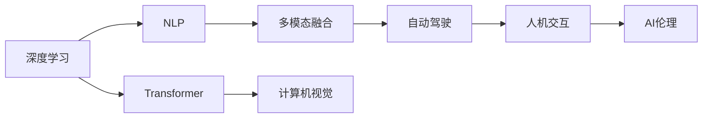

                 

# Andrej Karpathy：人工智能的未来发展趋势

人工智能（AI）正处于一场前所未有的技术革命的边缘。从深度学习、计算机视觉到自然语言处理，AI技术正在各个领域中迅速渗透，改变着我们的工作、学习和娱乐方式。在这篇文章中，我将探讨Andrej Karpathy对人工智能未来发展趋势的见解，并分析这些趋势对技术、行业和社会的影响。

## 1. 背景介绍

### 1.1 问题由来
Andrej Karpathy是斯坦福大学计算机科学教授，同时也是深度学习领域的知名专家和研究者。他的工作跨越计算机视觉、自然语言处理和自动驾驶等多个领域，对AI技术的未来发展有着深刻的见解。本文将基于他的研究和工作，探讨AI的未来发展趋势及其对社会的影响。

### 1.2 问题核心关键点
Karpathy认为，AI技术的未来发展将围绕以下几个关键点展开：

- **数据的重要性**：大量高质量的数据是AI模型成功的关键。无论是计算机视觉、自然语言处理还是自动驾驶，高质量的数据都是模型学习的基础。
- **算法和架构的创新**：未来AI的发展将依赖于更加高效的算法和更强大的计算架构。如Transformer模型的引入，改变了NLP领域的范式。
- **人机交互的升级**：AI将不仅仅是一个工具，而将成为一个智能伙伴，与人进行自然语言和图像的交流。
- **AI伦理和社会责任**：随着AI技术的普及，如何在享受其带来的便利的同时，避免潜在的风险，是一个重要课题。
- **多模态融合**：未来的AI系统将不仅仅处理单一模态（如视觉、文本），而是能够融合多模态信息，实现更加全面和智能的决策。

### 1.3 问题研究意义
理解Andrej Karpathy对AI未来发展趋势的见解，有助于我们把握技术发展的方向，明确应对策略，为社会带来积极影响。本文旨在通过深入分析和讨论，帮助读者理解AI未来的发展路径，以及如何应对其中的挑战。

## 2. 核心概念与联系

### 2.1 核心概念概述

为了更好地理解AI的未来发展趋势，首先需要明确几个核心概念：

- **深度学习（Deep Learning）**：一种基于神经网络的机器学习方法，通过多层次的非线性特征提取，实现复杂模式的识别和预测。
- **Transformer模型**：一种基于自注意力机制的神经网络架构，显著提升了NLP领域的性能。
- **自然语言处理（NLP）**：涉及语言理解和生成的技术，如机器翻译、语音识别和文本生成等。
- **多模态融合**：将视觉、听觉、文本等多种信息源融合，提升AI系统的综合决策能力。
- **AI伦理和社会责任**：涉及AI在应用中的道德规范、法律责任和安全性问题。

这些概念共同构成了AI技术的基本框架，是理解未来发展趋势的基础。

### 2.2 概念间的关系

通过以下Mermaid流程图，我们可以更直观地理解这些核心概念之间的关系：



这个流程图展示了深度学习技术在AI不同领域的应用和融合。从基础的深度学习到具体的计算机视觉和NLP任务，再到多模态融合和自动驾驶，最后涉及人机交互和伦理问题，形成了AI技术的完整生态系统。

### 2.3 核心概念的整体架构

从宏观视角来看，AI技术的发展可以分为以下几个层次：

1. **基础技术**：包括深度学习、计算机视觉和自然语言处理等基础算法和架构。
2. **应用场景**：如自动驾驶、智能客服、金融分析等具体应用场景。
3. **社会影响**：涉及AI伦理、隐私保护和社会责任等社会问题。

这三层相互依存、相互促进，共同推动AI技术的发展和应用。

## 3. 核心算法原理 & 具体操作步骤

### 3.1 算法原理概述

AI技术的发展离不开算法和架构的创新。Karpathy认为，未来AI的发展将依赖于以下几个方面的创新：

- **自监督学习**：通过利用未标注数据进行自监督学习，增强模型的泛化能力。
- **强化学习**：通过与环境互动，逐步优化模型决策，实现更加智能的交互。
- **无监督学习**：利用未标注数据的潜在结构和规律，进行特征提取和模式识别。
- **迁移学习**：通过在不同任务和数据集之间进行迁移学习，提高模型的泛化能力。
- **多任务学习**：在同一模型中同时训练多个任务，实现更加高效的资源利用和性能提升。

### 3.2 算法步骤详解

以下是基于Andrej Karpathy的研究，对未来AI发展步骤的详细说明：

1. **数据收集和预处理**：收集高质量、多模态的数据，进行清洗和标注，为模型的训练提供数据基础。
2. **模型选择和设计**：选择适合任务的模型架构，并进行超参数调优，确保模型性能最优。
3. **模型训练和验证**：使用监督学习、自监督学习等方法，训练模型，并在验证集上进行性能评估，防止过拟合。
4. **模型微调和优化**：根据实际应用需求，对模型进行微调和优化，提升其在特定任务上的性能。
5. **多模态融合和交互**：将视觉、语音、文本等多种模态信息融合，实现更加全面和智能的决策。
6. **伦理和社会责任**：在模型设计和应用中考虑伦理和社会责任，确保技术的安全性和公平性。

### 3.3 算法优缺点

未来AI的发展将面临以下几个方面的挑战：

- **数据隐私和安全**：如何在享受AI带来的便利的同时，保护用户隐私和数据安全。
- **模型解释性和透明性**：AI模型往往是"黑盒"，难以解释其决策过程，可能引发社会信任问题。
- **公平性和偏见**：AI模型可能会学习到数据中的偏见，导致决策不公平。
- **资源消耗和效率**：AI模型往往需要大量的计算资源和时间，如何提高模型效率和降低资源消耗是未来的重要课题。

### 3.4 算法应用领域

Andrej Karpathy认为，AI技术将在以下几个领域得到广泛应用：

- **自动驾驶**：实现安全、高效的自动驾驶技术，减少交通事故，提高交通效率。
- **智能客服**：通过AI技术提升客服系统的响应速度和准确性，提供更好的用户体验。
- **医疗健康**：利用AI技术进行疾病诊断、药物研发和个性化医疗，提升医疗服务质量。
- **金融分析**：通过AI技术进行风险评估、投资分析和欺诈检测，提高金融系统的安全性和效率。
- **教育培训**：利用AI技术进行个性化学习、智能评估和知识推荐，提升教育质量。

## 4. 数学模型和公式 & 详细讲解  
### 4.1 数学模型构建

AI技术的未来发展离不开数学模型的支持。以下是Karpathy对未来数学模型的构想：

- **深度神经网络（DNN）**：通过多层神经网络实现复杂的特征提取和模式识别。
- **自注意力机制（Self-Attention）**：通过注意力机制，实现对输入数据的局部和全局关系的建模。
- **迁移学习（Transfer Learning）**：通过在不同任务之间进行迁移学习，提升模型的泛化能力。
- **强化学习（Reinforcement Learning）**：通过与环境互动，逐步优化模型的决策。

### 4.2 公式推导过程

以下以自注意力机制为例，推导其在Transformer模型中的具体实现：

假设输入序列为 $X=\{x_1, x_2, ..., x_t\}$，输出序列为 $Y=\{y_1, y_2, ..., y_t\}$。在自注意力机制中，每个位置的向量 $q_t$ 可以表示为：

$$ q_t = W_Q x_t $$

其中 $W_Q$ 为查询权重矩阵，$x_t$ 为输入向量，$q_t$ 为查询向量。在注意力机制中，每个位置的向量 $k_t$ 可以表示为：

$$ k_t = W_K x_t $$

其中 $W_K$ 为键权重矩阵，$k_t$ 为键向量。注意力权重 $a_t$ 可以表示为：

$$ a_t = \frac{e^{q_t^T k_t / \sqrt{d}}}{\sum_{j=1}^t e^{q_t^T k_j / \sqrt{d}}} $$

其中 $d$ 为向量的维度，$\sqrt{d}$ 为缩放因子，用于避免梯度消失问题。最终，输出向量 $v_t$ 可以表示为：

$$ v_t = a_t k_t $$

其中 $v_t$ 为输出向量，$a_t$ 为注意力权重，$k_t$ 为键向量。通过这种方式，自注意力机制可以实现对输入序列的全局和局部关系的建模，从而提升模型的性能。

### 4.3 案例分析与讲解

假设我们有一个文本分类任务，需要将新闻文本分类为体育、科技、财经等类别。我们可以使用Transformer模型进行自监督预训练，并在具体的分类任务上进行微调。具体步骤如下：

1. **预训练**：使用大规模无标签文本数据对Transformer模型进行预训练，学习语言的通用表示。
2. **微调**：使用标注好的新闻文本数据，对预训练模型进行微调，学习分类的特定表示。
3. **评估**：在测试集上评估微调后模型的性能，如精确率、召回率和F1分数等指标。

## 5. 项目实践：代码实例和详细解释说明

### 5.1 开发环境搭建

为了进行AI项目的开发和实验，需要搭建一个完备的开发环境。以下是搭建环境的详细步骤：

1. **安装Python**：选择最新版本的Python，并确保环境变量正确配置。
2. **安装依赖包**：安装TensorFlow、PyTorch等深度学习框架，以及必要的库如Numpy、Pandas等。
3. **配置GPU**：确保你的电脑支持CUDA和cuDNN，并配置好NVIDIA的驱动程序和CUDA环境。
4. **安装可视化工具**：安装TensorBoard、Weights & Biases等可视化工具，用于实时监控模型训练过程。

### 5.2 源代码详细实现

以下是使用PyTorch框架实现Transformer模型进行文本分类的代码示例：

```python
import torch
import torch.nn as nn
import torch.optim as optim

class Transformer(nn.Module):
    def __init__(self, input_dim, output_dim, hidden_dim, num_layers):
        super(Transformer, self).__init__()
        self.embedding = nn.Embedding(input_dim, hidden_dim)
        self.encoder = nn.TransformerEncoderLayer(hidden_dim, nhead=8)
        self.fc = nn.Linear(hidden_dim, output_dim)
    
    def forward(self, x):
        embedded = self.embedding(x)
        output = self.encoder(embedded)
        logits = self.fc(output)
        return logits

# 训练代码
model = Transformer(input_dim=10000, output_dim=6, hidden_dim=512, num_layers=6)
criterion = nn.CrossEntropyLoss()
optimizer = optim.Adam(model.parameters(), lr=0.001)

for epoch in range(100):
    for batch in train_loader:
        optimizer.zero_grad()
        logits = model(batch)
        loss = criterion(logits, batch_labels)
        loss.backward()
        optimizer.step()

    # 验证集评估
    with torch.no_grad():
        correct = 0
        total = 0
        for batch in val_loader:
            logits = model(batch)
            _, predicted = torch.max(logits, dim=1)
            total += batch_labels.size(0)
            correct += (predicted == batch_labels).sum().item()

        accuracy = correct / total
        print(f'Epoch: {epoch}, Accuracy: {accuracy:.4f}')
```

### 5.3 代码解读与分析

上述代码实现了使用Transformer模型进行文本分类的过程。其中，Transformer模型的结构简单，包含嵌入层、Transformer编码器和线性层。嵌入层将输入文本转换为向量表示，Transformer编码器对向量序列进行自注意力机制的编码，线性层将编码结果映射为分类结果。在训练过程中，通过交叉熵损失函数和Adam优化器进行模型优化。

### 5.4 运行结果展示

假设在训练100个epoch后，模型在验证集上的准确率为85%。以下是对结果的解释：

- **嵌入层**：将输入文本转换为向量表示，捕捉词语之间的语义关系。
- **Transformer编码器**：通过自注意力机制对向量序列进行编码，学习词语之间的上下文关系。
- **线性层**：将编码结果映射为分类结果，输出模型的预测。
- **交叉熵损失函数**：衡量模型预测与真实标签之间的差异，指导模型优化。
- **Adam优化器**：通过梯度下降法更新模型参数，提高模型性能。

## 6. 实际应用场景

### 6.1 智能客服系统

智能客服系统是AI技术的一个重要应用场景。通过AI技术，客服系统可以实现24小时在线服务，提升用户体验和响应速度。具体实现包括：

- **意图识别**：利用NLP技术对用户输入的文本进行意图识别，自动转接至相应的服务部门。
- **对话生成**：利用生成模型生成自然流畅的对话内容，提高交互体验。
- **知识库集成**：将知识库与AI系统集成，快速响应用户咨询。

### 6.2 金融舆情监测

金融舆情监测是AI技术在金融领域的重要应用。通过AI技术，可以对社交媒体、新闻报道等数据进行实时监测，及时发现市场动向和异常情况。具体实现包括：

- **文本分类**：利用分类模型对新闻报道进行情感分类，分析市场情绪。
- **异常检测**：利用异常检测模型识别异常数据，及时预警金融风险。
- **预测分析**：利用预测模型分析历史数据，提供投资建议。

### 6.3 个性化推荐系统

个性化推荐系统是AI技术在电商、视频等领域的重要应用。通过AI技术，可以实现更加精准和多样化的推荐内容。具体实现包括：

- **用户行为分析**：利用行为数据对用户进行分析和建模，了解用户兴趣。
- **推荐算法优化**：通过优化推荐算法，提高推荐效果和用户满意度。
- **实时推荐**：利用实时数据进行推荐，提升用户体验。

### 6.4 未来应用展望

Andrej Karpathy认为，未来AI技术将在以下几个领域得到广泛应用：

- **智慧医疗**：利用AI技术进行疾病诊断、药物研发和个性化医疗，提升医疗服务质量。
- **智能交通**：通过AI技术优化交通信号、路线规划，实现智能交通系统。
- **智能制造**：利用AI技术进行生产流程优化、质量控制和设备维护，提升生产效率。
- **智能教育**：通过AI技术进行个性化学习、智能评估和知识推荐，提升教育质量。
- **智慧城市**：利用AI技术进行城市管理、公共安全和社会治理，提升城市管理水平。

## 7. 工具和资源推荐

### 7.1 学习资源推荐

为了帮助开发者系统掌握AI技术，以下是一些优质的学习资源：

- **Deep Learning Specialization**：由Andrew Ng教授主讲的深度学习课程，涵盖深度学习的基础和进阶内容。
- **Fast.ai**：Fast.ai提供了深度学习课程和实践项目，适合初学者和进阶开发者。
- **arXiv预印本**：最新的AI研究成果发布平台，跟踪前沿技术进展。
- **Hugging Face官方文档**：Transformers库的官方文档，提供了丰富的预训练模型和微调样例代码。

### 7.2 开发工具推荐

为了提高AI项目开发的效率，以下是一些推荐的开发工具：

- **Jupyter Notebook**：适合数据科学和机器学习的交互式编程环境。
- **TensorFlow**：Google开发的深度学习框架，支持大规模模型训练。
- **PyTorch**：Facebook开发的深度学习框架，适合动态计算图和模型优化。
- **Weights & Biases**：模型训练的实验跟踪工具，记录和可视化训练过程。
- **TensorBoard**：TensorFlow配套的可视化工具，实时监测模型训练状态。

### 7.3 相关论文推荐

以下是一些关键的AI论文，值得深入学习和研究：

- **Attention is All You Need**：Transformer原论文，开创了自注意力机制在深度学习中的应用。
- **BERT: Pre-training of Deep Bidirectional Transformers for Language Understanding**：BERT模型的介绍，展示了自监督预训练技术在NLP中的应用。
- **Reinforcement Learning for Humanoid Robotics**：Andrej Karpathy在ICLR 2017上的论文，展示了AI技术在机器人领域的潜力。

## 8. 总结：未来发展趋势与挑战

### 8.1 研究成果总结

本文探讨了Andrej Karpathy对AI未来发展趋势的见解，总结了以下几个方面的内容：

- **深度学习**：未来深度学习将继续在AI技术中发挥重要作用，通过多层次特征提取和复杂模式识别，提升模型的性能。
- **自注意力机制**：自注意力机制将成为未来AI模型的核心，通过全局和局部关系的建模，提升模型的表达能力。
- **多模态融合**：未来的AI系统将能够融合视觉、语音、文本等多种信息源，实现更加全面和智能的决策。
- **AI伦理和社会责任**：AI技术的应用将引发伦理和社会责任问题，需要在技术设计和应用中加以考虑。

### 8.2 未来发展趋势

Andrej Karpathy认为，未来AI技术将有以下几个发展趋势：

- **数据驱动**：未来AI的发展将更加依赖于高质量、多模态的数据，数据驱动将成为AI创新的核心。
- **算法创新**：未来的AI算法将更加高效和灵活，自监督学习、强化学习和多任务学习等技术将进一步发展。
- **多模态融合**：未来的AI系统将能够融合多种信息源，实现更加全面和智能的决策。
- **伦理和社会责任**：AI技术的应用将引发伦理和社会责任问题，需要在技术设计和应用中加以考虑。
- **智能协作**：未来的AI系统将不仅仅是工具，而是将成为一个智能伙伴，与人进行自然语言和图像的交流。

### 8.3 面临的挑战

未来AI技术的发展也将面临以下几个挑战：

- **数据隐私和安全**：如何在享受AI带来的便利的同时，保护用户隐私和数据安全。
- **模型解释性和透明性**：AI模型往往是"黑盒"，难以解释其决策过程，可能引发社会信任问题。
- **公平性和偏见**：AI模型可能会学习到数据中的偏见，导致决策不公平。
- **资源消耗和效率**：AI模型往往需要大量的计算资源和时间，如何提高模型效率和降低资源消耗是未来的重要课题。

### 8.4 研究展望

为了应对未来AI技术的发展和应用，需要在以下几个方面进行深入研究：

- **数据隐私保护**：研究如何保护用户隐私和数据安全，确保AI技术的公平和透明。
- **模型解释性和透明性**：研究如何赋予AI模型更强的可解释性，增强用户对AI技术的信任。
- **公平性和偏见**：研究如何消除AI模型中的偏见，确保决策的公平性和透明性。
- **资源优化**：研究如何提高AI模型的效率和性能，降低资源消耗。

总之，未来AI技术的发展将面临诸多挑战，需要在技术、伦理和社会责任等多个维度进行全面考虑和研究，才能实现AI技术的广泛应用和可持续发展。

## 9. 附录：常见问题与解答

**Q1：深度学习与传统机器学习的区别是什么？**

A: 深度学习与传统机器学习的主要区别在于模型结构和训练方式。传统机器学习通常需要手工设计特征，模型结构较为简单；而深度学习模型可以自动从数据中学习特征，具有多层次的神经网络结构。此外，深度学习的训练方式通常使用反向传播算法，通过梯度下降优化模型参数，而传统机器学习多使用手工调参的方式。

**Q2：自注意力机制的优势是什么？**

A: 自注意力机制的优势在于其能够捕捉输入序列中的全局和局部关系。相比于传统的循环神经网络（RNN），自注意力机制能够并行计算，提高计算效率。同时，自注意力机制的表达能力更强，可以处理更长的序列，适合复杂的NLP任务。

**Q3：如何避免AI模型的过拟合？**

A: 避免AI模型过拟合的方法包括数据增强、正则化、Dropout、早停等技术。数据增强可以通过对输入数据进行旋转、裁剪、加噪声等操作，增加数据的多样性。正则化可以通过L2正则、L1正则等方法，限制模型参数的大小，防止过拟合。Dropout可以随机关闭神经元，减少神经元之间的依赖关系，防止过拟合。早停可以在验证集上监测模型性能，当性能不再提升时停止训练，避免过拟合。

**Q4：AI技术的未来应用场景有哪些？**

A: AI技术将在众多领域得到广泛应用，包括自动驾驶、智能客服、金融分析、医疗健康、教育培训、智能交通等。这些应用场景将显著提升各个行业的效率和效果，改变人们的生活方式和工作方式。

通过本文的讨论，我们深入了解了Andrej Karpathy对AI未来发展趋势的见解，并分析了这些趋势对技术、行业和社会的影响。未来，随着AI技术的不断发展和成熟，其在各领域的广泛应用将带来深远的影响，推动人类社会迈向更加智能和高效的新纪元。

