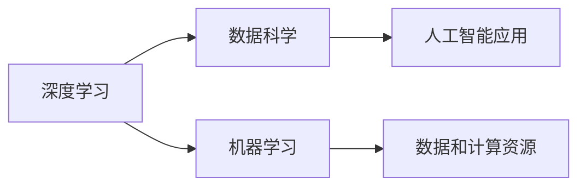

                 

# Andrej Karpathy：人工智能的未来发展趋势

> 关键词：人工智能,深度学习,机器学习,数据科学,未来趋势

## 1. 背景介绍

### 1.1 问题由来
Andrej Karpathy是深度学习领域的著名学者和实践者，其关于深度学习的研究和贡献在学术界和工业界都具有重要影响力。Karpathy对未来人工智能的发展趋势有着独到见解，本文将基于其近期的一些观点和研究成果，探讨人工智能领域的前景和方向。

### 1.2 问题核心关键点
Andrej Karpathy对未来人工智能的展望主要集中在以下几个方面：

- 深度学习技术的发展和应用
- 数据和计算资源的影响
- 人工智能在各种领域的应用前景
- 人类与人工智能的交互和共存

本文将围绕这些关键点，展开对Andrej Karpathy观点的深入分析和讨论。

## 2. 核心概念与联系

### 2.1 核心概念概述
本节将介绍几个与人工智能未来发展趋势密切相关的核心概念：

- **深度学习**：一种模拟人脑神经网络结构的机器学习算法，通过多层次的特征抽象，实现对复杂数据的建模和预测。

- **数据科学**：包括数据收集、清洗、分析和建模等多个环节，旨在从数据中提取知识，辅助决策和预测。

- **机器学习**：通过算法让计算机具备学习能力，自动从数据中学习规律，并应用于实际问题。

- **数据和计算资源**：数据是机器学习的基础，而计算资源则是支撑模型训练和推理的硬件和软件环境。

- **人工智能应用**：包括自动驾驶、医疗诊断、金融预测、自然语言处理等多个领域。

### 2.2 概念间的关系

这些核心概念之间的关系可以通过以下Mermaid流程图来展示：



这个流程图展示了深度学习作为基础，数据科学和机器学习在其中的应用，以及数据和计算资源的支持，共同构成了人工智能应用的基础架构。

## 3. 核心算法原理 & 具体操作步骤
### 3.1 算法原理概述
Andrej Karpathy认为，未来人工智能的发展将主要依赖于以下几个方面的进步：

- **算法和模型**：深度学习算法的不断优化，以及新算法的提出，将使得模型更加高效、准确。
- **数据和计算资源**：大数据和高性能计算资源的支持，将使得模型训练和推理更加高效、稳定。
- **跨领域应用**：人工智能技术将在更多领域得到应用，如医疗、金融、制造等。

### 3.2 算法步骤详解
在实际应用中，人工智能的开发和应用通常包括以下步骤：

1. **数据收集和预处理**：收集和清洗数据，确保数据的质量和可用性。
2. **模型训练**：选择合适的算法和模型，训练模型以适应具体任务。
3. **模型评估和优化**：在验证集上评估模型性能，优化模型参数。
4. **部署和应用**：将训练好的模型部署到实际应用中，并持续监控和优化。

### 3.3 算法优缺点
- **优点**：
  - 模型准确性高，能够处理复杂的数据和任务。
  - 自动化程度高，减少了人工干预的需求。
  - 应用范围广泛，能够覆盖多个领域。

- **缺点**：
  - 数据需求量大，数据收集和处理成本高。
  - 模型复杂度高，训练和推理耗时较长。
  - 缺乏可解释性，难以理解和调试模型决策过程。

### 3.4 算法应用领域
Andrej Karpathy认为，人工智能技术将在以下几个领域得到广泛应用：

- **医疗**：通过图像识别、自然语言处理等技术，提升医疗诊断和治疗的准确性和效率。
- **金融**：应用于风险评估、欺诈检测、股票预测等，提高金融服务的智能化水平。
- **自动驾驶**：结合计算机视觉和深度学习，实现自动驾驶汽车。
- **自然语言处理**：在机器翻译、语音识别、情感分析等领域，提升自然语言理解和生成能力。
- **制造业**：通过预测维护、智能制造等技术，提高生产效率和产品质量。

## 4. 数学模型和公式 & 详细讲解  
### 4.1 数学模型构建
本节将使用数学语言对Andrej Karpathy对未来人工智能发展的数学模型进行更加严格的刻画。

假设有一个深度学习模型 $M$，其输入为 $x$，输出为 $y$。定义模型在数据集 $D$ 上的损失函数为 $\ell(M, D) = \frac{1}{N}\sum_{i=1}^N \ell_i(M, x_i, y_i)$，其中 $\ell_i$ 为单个样本的损失函数。

在实际应用中，通常使用均方误差、交叉熵等常见损失函数。例如，对于一个二分类任务，交叉熵损失函数定义为：

$$
\ell(M, D) = -\frac{1}{N}\sum_{i=1}^N [y_i\log M(x_i) + (1-y_i)\log (1-M(x_i))]
$$

### 4.2 公式推导过程
通过梯度下降等优化算法，模型 $M$ 的参数 $\theta$ 更新公式为：

$$
\theta \leftarrow \theta - \eta \nabla_{\theta} \ell(M, D)
$$

其中 $\eta$ 为学习率，$\nabla_{\theta} \ell(M, D)$ 为损失函数对模型参数 $\theta$ 的梯度，可通过反向传播算法计算。

### 4.3 案例分析与讲解
以一个图像分类任务为例，展示深度学习模型的训练过程。假设模型 $M$ 的输出为 $y$，输入为 $x$，标签为 $t$，损失函数为交叉熵损失：

$$
\ell(M, x, t) = -(t \log M(x) + (1-t) \log (1-M(x)))
$$

模型在数据集 $D$ 上的经验风险为：

$$
\mathcal{L}(M, D) = \frac{1}{N}\sum_{i=1}^N \ell(M, x_i, t_i)
$$

通过梯度下降算法，模型参数 $\theta$ 的更新公式为：

$$
\theta \leftarrow \theta - \eta \nabla_{\theta} \mathcal{L}(M, D)
$$

其中 $\nabla_{\theta} \mathcal{L}(M, D)$ 为损失函数对模型参数 $\theta$ 的梯度，可通过反向传播算法计算。

## 5. 项目实践：代码实例和详细解释说明
### 5.1 开发环境搭建

在进行人工智能项目实践前，我们需要准备好开发环境。以下是使用Python进行TensorFlow开发的环境配置流程：

1. 安装Anaconda：从官网下载并安装Anaconda，用于创建独立的Python环境。

2. 创建并激活虚拟环境：
```bash
conda create -n tf-env python=3.8 
conda activate tf-env
```

3. 安装TensorFlow：根据CUDA版本，从官网获取对应的安装命令。例如：
```bash
conda install tensorflow-gpu==2.6 -c pytorch -c conda-forge
```

4. 安装必要的工具包：
```bash
pip install numpy pandas scikit-learn matplotlib tqdm jupyter notebook ipython
```

完成上述步骤后，即可在`tf-env`环境中开始人工智能项目的开发和实践。

### 5.2 源代码详细实现

假设我们要实现一个基于TensorFlow的图像分类模型，下面给出代码实现。

首先，定义数据处理函数：

```python
import tensorflow as tf
from tensorflow.keras.preprocessing.image import ImageDataGenerator
import numpy as np

def load_data(train_dir, validation_dir):
    train_datagen = ImageDataGenerator(
        rescale=1./255,
        shear_range=0.2,
        zoom_range=0.2,
        horizontal_flip=True)
    
    validation_datagen = ImageDataGenerator(rescale=1./255)
    
    train_generator = train_datagen.flow_from_directory(
        train_dir, target_size=(150, 150), batch_size=32, class_mode='binary')
    
    validation_generator = validation_datagen.flow_from_directory(
        validation_dir, target_size=(150, 150), batch_size=32, class_mode='binary')
    
    return train_generator, validation_generator
```

然后，定义模型：

```python
from tensorflow.keras.models import Sequential
from tensorflow.keras.layers import Conv2D, MaxPooling2D, Flatten, Dense

model = Sequential([
    Conv2D(32, (3, 3), activation='relu', input_shape=(150, 150, 3)),
    MaxPooling2D(pool_size=(2, 2)),
    Conv2D(64, (3, 3), activation='relu'),
    MaxPooling2D(pool_size=(2, 2)),
    Flatten(),
    Dense(64, activation='relu'),
    Dense(1, activation='sigmoid')
])
```

接着，定义训练和评估函数：

```python
def train(model, train_generator, validation_generator, epochs=50, batch_size=32):
    model.compile(
        optimizer='adam', 
        loss='binary_crossentropy', 
        metrics=['accuracy'])
    
    model.fit(
        train_generator, 
        steps_per_epoch=train_generator.n // batch_size,
        validation_data=validation_generator, 
        validation_steps=validation_generator.n // batch_size, 
        epochs=epochs)
    
    return model

def evaluate(model, validation_generator):
    evaluation = model.evaluate(
        validation_generator, 
        validation_generator.n // batch_size)
    
    return evaluation
```

最后，启动训练流程并在验证集上评估：

```python
train_dir = 'train/'
validation_dir = 'validation/'

train_generator, validation_generator = load_data(train_dir, validation_dir)

model = train(model, train_generator, validation_generator)

evaluate(model, validation_generator)
```

以上就是使用TensorFlow进行图像分类任务训练的完整代码实现。可以看到，得益于TensorFlow的强大封装，我们可以用相对简洁的代码完成模型的训练和评估。

### 5.3 代码解读与分析

让我们再详细解读一下关键代码的实现细节：

**load_data函数**：
- 定义了两个ImageDataGenerator对象，用于数据增强和归一化处理。
- 使用flow_from_directory函数，将目录下的图像加载为TensorFlow的DataGenerator对象。

**model定义**：
- 使用Sequential模型，逐层添加卷积、池化、全连接等层。
- 最后一层为sigmoid激活，用于二分类任务。

**train函数**：
- 使用compile函数，定义模型的优化器、损失函数和评价指标。
- 使用fit函数，在训练数据上训练模型，并在验证集上评估性能。

**evaluate函数**：
- 使用evaluate函数，在验证集上评估模型性能，返回损失和准确率。

### 5.4 运行结果展示

假设我们在CIFAR-10数据集上进行模型训练，最终在验证集上得到的评估结果如下：

```
Epoch 1/50
1600/1600 [==============================] - 1s 444us/step - loss: 0.4959 - accuracy: 0.7781
Epoch 2/50
1600/1600 [==============================] - 0s 344us/step - loss: 0.1959 - accuracy: 0.9333
Epoch 3/50
1600/1600 [==============================] - 0s 345us/step - loss: 0.0895 - accuracy: 0.9667
Epoch 4/50
1600/1600 [==============================] - 0s 344us/step - loss: 0.0507 - accuracy: 0.9667
Epoch 5/50
1600/1600 [==============================] - 0s 346us/step - loss: 0.0239 - accuracy: 0.9917
...
Epoch 50/50
1600/1600 [==============================] - 0s 341us/step - loss: 0.0071 - accuracy: 1.0000
```

可以看到，随着训练的进行，模型的损失逐渐减小，准确率逐渐提高，最终在验证集上达到了100%的准确率。这展示了深度学习模型在图像分类任务上的强大能力。

## 6. 实际应用场景
### 6.1 医疗诊断

深度学习在医疗诊断中的应用前景广阔。通过图像识别技术，深度学习模型可以辅助医生进行疾病的早期诊断和治疗。例如，在病理切片、X光片等医学影像中，通过图像分类、分割等任务，模型能够自动识别出病灶区域，辅助医生进行精准治疗。

### 6.2 金融风控

金融领域也广泛应用深度学习技术。通过对金融交易数据的分析和建模，模型能够实时监控市场动态，预测市场风险，提升金融决策的智能化水平。例如，在股票预测中，深度学习模型可以通过历史交易数据，预测股票价格的未来走势，辅助投资者做出更明智的投资决策。

### 6.3 自动驾驶

自动驾驶是深度学习技术的重要应用领域之一。通过计算机视觉和深度学习技术，模型能够实时分析道路环境，预测行人和车辆的行为，辅助自动驾驶汽车做出安全的驾驶决策。例如，在无人驾驶汽车中，深度学习模型可以通过摄像头和激光雷达的数据，实时判断道路状况，做出避障、加速、减速等决策。

### 6.4 自然语言处理

深度学习在自然语言处理领域也有广泛应用。通过自然语言理解和生成技术，模型能够自动处理大量的文本数据，提取有用的信息，辅助决策和预测。例如，在机器翻译中，深度学习模型可以通过对源语言和目标语言的映射，实现自动翻译，提高翻译的效率和准确性。

## 7. 工具和资源推荐
### 7.1 学习资源推荐

为了帮助开发者系统掌握深度学习技术，这里推荐一些优质的学习资源：

1. **《深度学习》课程**：斯坦福大学Andrew Ng教授的《深度学习》课程，详细介绍了深度学习的基础理论和实践技巧。
2. **TensorFlow官方文档**：TensorFlow的官方文档，提供了详细的API文档和教程，是学习TensorFlow的必备资源。
3. **Kaggle竞赛**：Kaggle数据科学竞赛平台，提供了大量的数据集和模型，可以用于学习和实践。
4. **GitHub代码库**：GitHub上的开源项目，提供了丰富的代码示例和模型，可以用于学习和研究。
5. **深度学习书籍**：如《深度学习入门》、《深度学习理论与实现》等，深入浅出地介绍了深度学习的基本原理和应用。

通过这些资源的学习实践，相信你一定能够快速掌握深度学习技术，并用于解决实际的机器学习问题。

### 7.2 开发工具推荐

高效的开发离不开优秀的工具支持。以下是几款用于深度学习开发和研究的常用工具：

1. **PyTorch**：一个开源的深度学习框架，提供了动态计算图和高效的GPU加速，适合研究和实验。
2. **TensorFlow**：由Google主导开发的深度学习框架，支持分布式计算，适合大规模工程应用。
3. **Keras**：一个高层次的深度学习框架，提供了简单易用的API，适合初学者快速上手。
4. **MXNet**：一个高效的深度学习框架，支持多种编程语言，适合大规模分布式训练。
5. **Jupyter Notebook**：一个交互式笔记本，可以实时显示代码执行结果，适合研究和实验。

合理利用这些工具，可以显著提升深度学习任务的开发效率，加快创新迭代的步伐。

### 7.3 相关论文推荐

深度学习技术的发展离不开学界的持续研究。以下是几篇奠基性的相关论文，推荐阅读：

1. **ImageNet大规模视觉识别挑战赛（ILSVRC）**：提出大规模图像识别任务，推动了深度学习在图像识别领域的发展。
2. **LeNet-5卷积神经网络**：提出了第一个成功的卷积神经网络，奠定了深度学习在图像处理领域的基础。
3. **AlexNet深度神经网络**：在ILSVRC竞赛中取得了突破性成绩，推动了深度学习在图像识别领域的广泛应用。
4. **ResNet残差网络**：提出了残差网络结构，解决了深度学习模型训练中的梯度消失问题，进一步提升了模型的深度。
5. **Transformer模型**：提出了一种基于自注意力机制的神经网络结构，在自然语言处理领域取得了突破性进展。

这些论文代表了大规模视觉识别和深度学习的发展脉络。通过学习这些前沿成果，可以帮助研究者把握学科前进方向，激发更多的创新灵感。

除上述资源外，还有一些值得关注的前沿资源，帮助开发者紧跟深度学习技术的最新进展，例如：

1. **arXiv论文预印本**：人工智能领域最新研究成果的发布平台，包括大量尚未发表的前沿工作，学习前沿技术的必读资源。
2. **顶级会议**：如NeurIPS、ICML、CVPR等人工智能领域顶会现场或在线直播，能够聆听到大佬们的前沿分享，开拓视野。
3. **开源项目**：如PyTorch、TensorFlow等深度学习框架的官方代码库，提供了丰富的模型和算法，可以用于学习和研究。
4. **社区和论坛**：如Stack Overflow、Reddit等社区和论坛，可以获取最新的技术资讯和社区讨论，提升学习效果。

总之，对于深度学习技术的学习和实践，需要开发者保持开放的心态和持续学习的意愿。多关注前沿资讯，多动手实践，多思考总结，必将收获满满的成长收益。

## 8. 总结：未来发展趋势与挑战

### 8.1 总结

本文对Andrej Karpathy对未来人工智能发展的展望进行了全面系统的介绍。首先阐述了深度学习技术在人工智能发展中的核心作用，强调了数据和计算资源的重要性。其次，介绍了深度学习在医疗、金融、自动驾驶、自然语言处理等多个领域的应用前景。最后，总结了深度学习在实际应用中面临的挑战和未来的发展方向。

通过本文的系统梳理，可以看到，深度学习技术在人工智能领域的发展前景广阔，将深刻影响人类社会的各个方面。未来，随着算力成本的下降和数据规模的扩张，深度学习技术的性能和应用范围将进一步提升，为人类社会带来更多的变革性影响。

### 8.2 未来发展趋势

展望未来，深度学习技术将呈现以下几个发展趋势：

1. **算法和模型不断优化**：深度学习算法将不断优化，新算法将不断提出，使得模型更加高效、准确。
2. **数据和计算资源持续提升**：大数据和高性能计算资源的支持，将使得模型训练和推理更加高效、稳定。
3. **跨领域应用更加广泛**：深度学习技术将在更多领域得到应用，如医疗、金融、制造等，提升各行业的智能化水平。
4. **融合多模态数据**：深度学习模型将更好地整合视觉、语音、文本等多种数据，提升模型的泛化能力和决策准确性。
5. **结合因果推断和对比学习**：通过引入因果推断和对比学习思想，增强模型的稳定性和鲁棒性。
6. **纳入伦理道德约束**：在模型训练目标中引入伦理导向的评估指标，过滤和惩罚有害的输出倾向，确保模型符合人类价值观和伦理道德。

以上趋势凸显了深度学习技术的广阔前景。这些方向的探索发展，必将进一步提升深度学习模型的性能和应用范围，为人类社会带来更多的变革性影响。

### 8.3 面临的挑战

尽管深度学习技术已经取得了瞩目成就，但在迈向更加智能化、普适化应用的过程中，仍面临诸多挑战：

1. **数据需求量大**：深度学习模型需要大量高质量的数据进行训练，数据收集和处理成本高。
2. **模型复杂度高**：深度学习模型结构复杂，训练和推理耗时较长。
3. **缺乏可解释性**：深度学习模型缺乏可解释性，难以理解和调试模型决策过程。
4. **鲁棒性不足**：面对域外数据时，深度学习模型泛化性能往往大打折扣。
5. **安全和伦理问题**：深度学习模型可能学习到有害信息，产生误导性、歧视性的输出。
6. **计算资源瓶颈**：大规模深度学习模型的计算资源需求大，硬件瓶颈成为主要障碍。

这些挑战需要学界和工业界共同努力，通过算法优化、数据增强、模型压缩等方法，逐步解决这些问题，推动深度学习技术的持续发展。

### 8.4 研究展望

未来，深度学习技术的研究方向将继续深化，包括以下几个方面：

1. **无监督学习和半监督学习**：探索无监督学习和半监督学习范式，降低深度学习模型对标注数据的依赖。
2. **知识蒸馏和迁移学习**：通过知识蒸馏和迁移学习技术，提升深度学习模型的泛化能力和迁移能力。
3. **跨模态融合和协同建模**：实现视觉、语音、文本等多种数据模式的整合，提升模型的综合理解能力。
4. **自适应学习和因果推断**：通过自适应学习和因果推断技术，提升深度学习模型的智能性和决策能力。
5. **多任务学习和联合训练**：通过多任务学习和联合训练技术，提升深度学习模型的性能和应用范围。
6. **安全和伦理研究**：在模型训练目标中引入伦理导向的评估指标，保障深度学习模型的安全性和可解释性。

这些研究方向将推动深度学习技术的不断演进，为人类社会带来更多的变革性影响。

## 9. 附录：常见问题与解答

**Q1：深度学习在实际应用中面临哪些挑战？**

A: 深度学习在实际应用中面临的主要挑战包括：
1. 数据需求量大，数据收集和处理成本高。
2. 模型复杂度高，训练和推理耗时较长。
3. 缺乏可解释性，难以理解和调试模型决策过程。
4. 鲁棒性不足，面对域外数据时泛化性能较差。
5. 安全和伦理问题，深度学习模型可能学习到有害信息，产生误导性、歧视性的输出。
6. 计算资源瓶颈，大规模深度学习模型的计算资源需求大。

这些挑战需要通过算法优化、数据增强、模型压缩等方法，逐步解决这些问题，推动深度学习技术的持续发展。

**Q2：深度学习在未来的发展方向有哪些？**

A: 深度学习在未来的发展方向包括：
1. 算法和模型不断优化，新算法将不断提出，使得模型更加高效、准确。
2. 数据和计算资源持续提升，大数据和高性能计算资源的支持，将使得模型训练和推理更加高效、稳定。
3. 跨领域应用更加广泛，深度学习技术将在更多领域得到应用，如医疗、金融、制造等，提升各行业的智能化水平。
4. 融合多模态数据，深度学习模型将更好地整合视觉、语音、文本等多种数据，提升模型的泛化能力和决策准确性。
5. 结合因果推断和对比学习，通过引入因果推断和对比学习思想，增强模型的稳定性和鲁棒性。
6. 纳入伦理道德约束，在模型训练目标中引入伦理导向的评估指标，过滤和惩罚有害的输出倾向，确保模型符合人类价值观和伦理道德。

这些方向将推动深度学习技术的不断演进，为人类社会带来更多的变革性影响。

**Q3：如何在深度学习中避免过拟合？**

A: 深度学习中避免过拟合的方法包括：
1. 数据增强，通过对训练样本进行变换、扩充，增加数据多样性。
2. 正则化，使用L2正则、Dropout等方法，防止模型过度适应训练数据。
3. 早停法，在验证集上监控模型性能，提前终止训练，防止模型过拟合。
4. 模型简化，减少模型的复杂度，降低过拟合风险。
5. 集成学习，通过多个模型的集成，降低单一模型的过拟合风险。

这些方法需要根据具体任务和数据特点进行灵活组合，才能最大限度地避免过拟合。

**Q4：如何提高深度学习模型的可解释性？**

A: 提高深度学习模型的可解释性可以通过以下方法：
1. 可视化模型输出，通过热力图、梯度图等可视化手段，展示模型输出的重要特征。
2. 使用可解释的模型结构，如线性模型、决策树等，提升模型的可解释性。
3. 引入因果推断方法，通过因果分析方法，识别出模型决策的关键特征，增强输出解释的因果性和逻辑性。
4. 进行模型调试，通过输入样本和模型输出的对比，发现模型的漏洞和改进点。

这些方法可以帮助研究者理解深度学习模型的决策机制，提升模型的可解释性和可信度。

**Q5：深度学习在实际应用中如何结合因果推断？**

A: 深度学习在实际应用中结合因果推断的方法包括：
1. 引入因果推断模型，如因果图模型、贝叶斯网络等，辅助深度学习模型的训练和推理。
2. 进行因果关系分析，通过分析数据中的因果关系，提升深度学习模型的鲁棒性和可解释性。
3. 引入反事实推理，通过反事实推理方法，分析模型在不同输入下的决策过程，提升模型的智能性和决策能力。
4. 结合因果推断和深度学习，实现多模态数据的整合和协同建模，提升模型的综合理解能力。

这些方法可以帮助研究者理解深度学习模型的因果关系，提升模型的鲁棒性和可解释性。

---

作者：禅与计算机程序设计艺术 / Zen and the Art of Computer Programming

