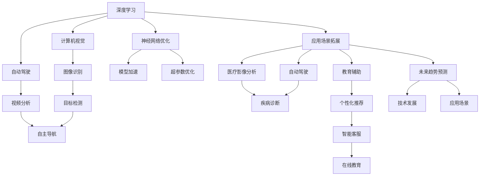
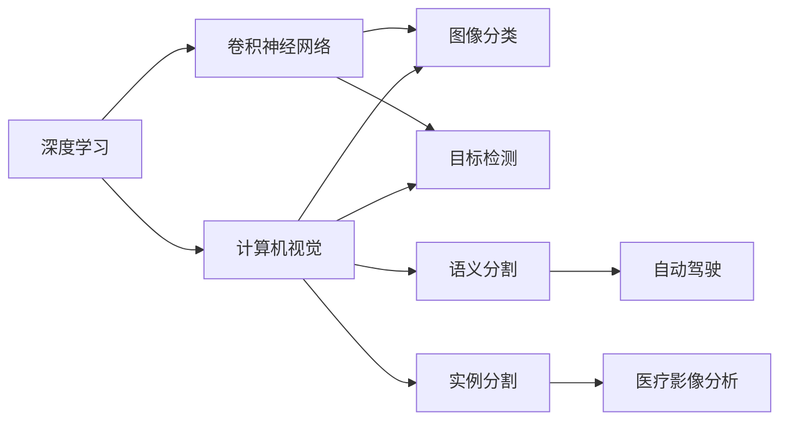
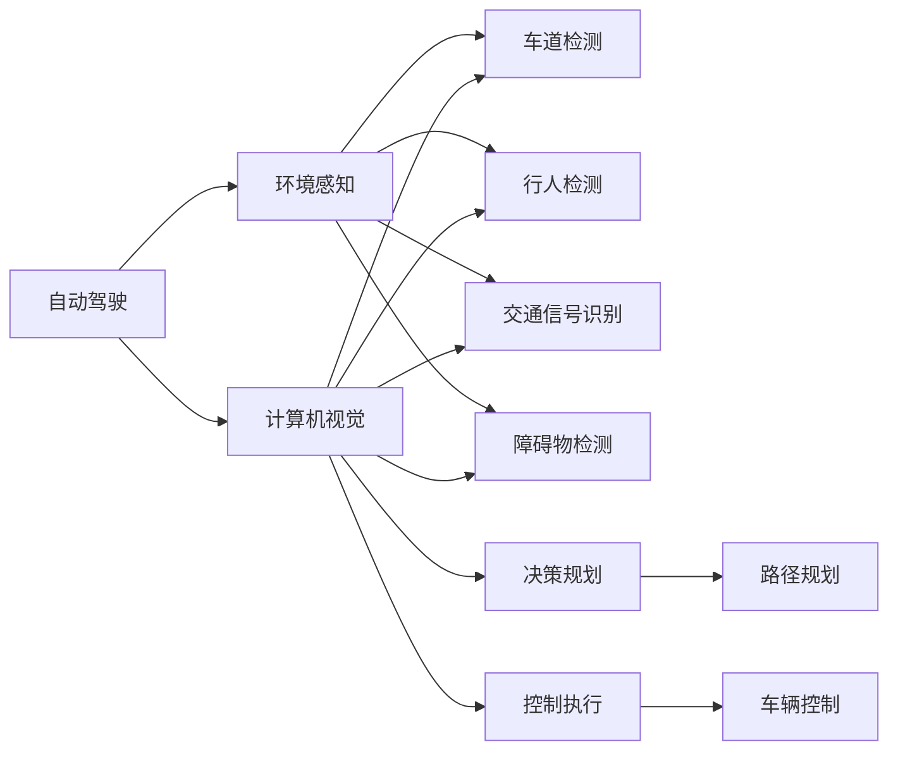
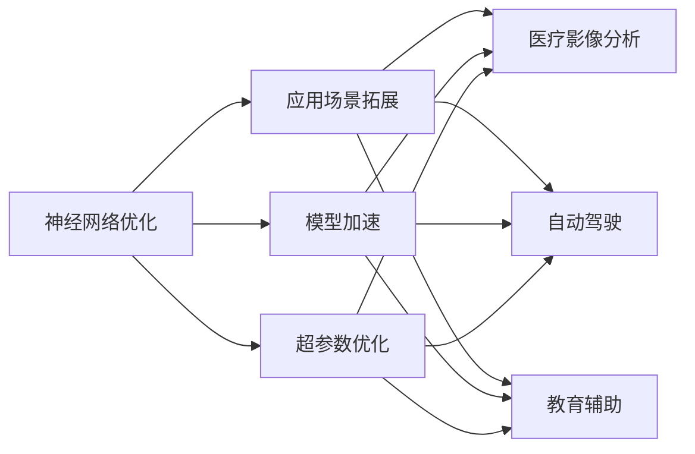
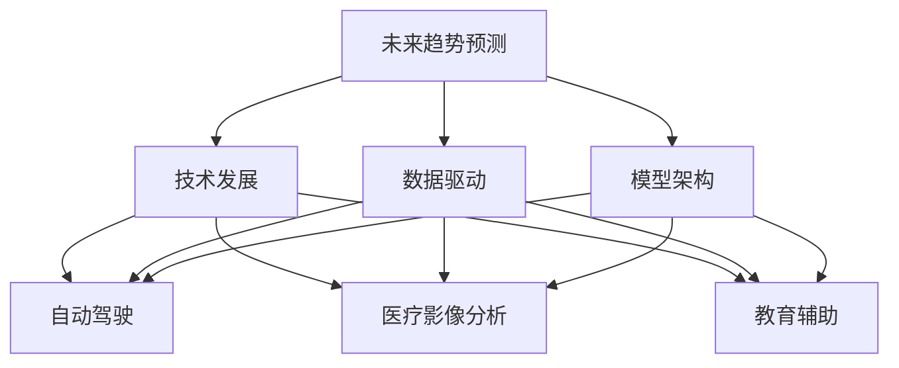
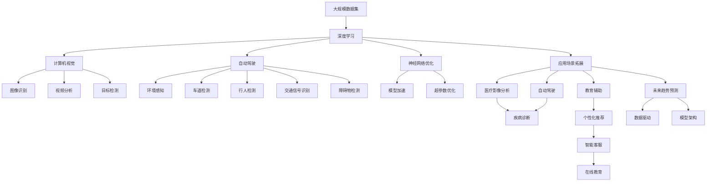

                 

# 安德烈·卡帕西：人工智能的未来应用

> 关键词：人工智能, 自动驾驶, 计算机视觉, 神经网络, 深度学习, 应用场景, 未来趋势

## 1. 背景介绍

### 1.1 问题由来
安德烈·卡帕西（Andrej Karpathy）是斯坦福大学计算机视觉实验室的教授，也是OpenAI的研究员。他在深度学习领域有着深厚的积累和丰富的实践经验。卡帕西的研究工作涵盖自动驾驶、计算机视觉、神经网络等多个领域，尤其在自动驾驶汽车的视觉感知和决策上做出了重大贡献。他的工作不仅推动了人工智能技术的进步，也为未来应用打开了广阔的想象空间。本文将深入探讨卡帕西在人工智能领域的前沿研究，以及他对于未来应用的展望。

### 1.2 问题核心关键点
卡帕西的研究工作主要集中在以下几个关键点：
1. **深度学习与计算机视觉**：通过深度学习技术，让计算机能够“看”懂图像和视频，从而在自动驾驶、医学影像分析等应用中发挥重要作用。
2. **自动驾驶与无人驾驶**：研究如何使自动驾驶汽车能够像人类一样在复杂环境下做出安全、准确的决策。
3. **神经网络优化**：开发更加高效的神经网络架构，提高模型训练速度和推理效率。
4. **应用场景拓展**：将人工智能技术应用于自动驾驶、医疗、教育等众多领域，提升各行各业的智能化水平。
5. **未来趋势预测**：基于现有研究和应用，预测未来人工智能技术的发展方向和应用前景。

### 1.3 问题研究意义
卡帕西的研究工作不仅推动了人工智能技术的进步，也为未来应用提供了新的思路和方向。他的研究对于推动人工智能技术的产业化、提升各行各业的智能化水平具有重要意义：

1. **推动技术进步**：通过不断探索新的深度学习方法和计算机视觉技术，推动人工智能技术向更高水平发展。
2. **拓展应用场景**：将人工智能技术应用于自动驾驶、医疗、教育等多个领域，解决实际问题，提升用户体验。
3. **提升智能化水平**：通过人工智能技术，使机器能够处理更复杂、更多样的任务，提升自动化和智能化水平。
4. **预测未来趋势**：基于现有研究和应用，预测未来人工智能技术的发展方向和应用前景，指导未来的技术研发和应用部署。

## 2. 核心概念与联系

### 2.1 核心概念概述

为了更好地理解卡帕西的研究工作，本节将介绍几个密切相关的核心概念：

- **深度学习**：一种通过多层神经网络结构进行复杂模式识别的机器学习方法。深度学习在图像识别、语音识别、自然语言处理等领域表现出色。
- **计算机视觉**：利用计算机处理和理解视觉信息的科学，涵盖图像识别、视频分析、目标检测等多个子领域。
- **自动驾驶**：通过计算机视觉、深度学习和传感器技术，使汽车能够在没有人类干预的情况下进行自主驾驶。
- **神经网络优化**：通过各种算法和技术手段，提高神经网络模型的训练速度、推理效率和泛化能力。
- **应用场景拓展**：将人工智能技术应用于不同领域，解决实际问题，提升用户体验。
- **未来趋势预测**：基于现有研究和应用，预测未来人工智能技术的发展方向和应用前景。

这些核心概念之间的逻辑关系可以通过以下Mermaid流程图来展示：



这个流程图展示了几大核心概念之间的关系：

1. 深度学习是基础，为计算机视觉和自动驾驶提供了技术支持。
2. 计算机视觉涉及图像识别、视频分析、目标检测等子领域，是自动驾驶的核心技术之一。
3. 神经网络优化通过模型加速和超参数优化等手段，提高了深度学习模型的性能。
4. 应用场景拓展将深度学习技术应用于医疗、自动驾驶、教育等多个领域，提升智能化水平。
5. 未来趋势预测基于现有研究和应用，预测未来人工智能技术的发展方向和应用前景。

这些核心概念共同构成了安德烈·卡帕西研究工作的核心框架，为未来的技术研发和应用部署提供了重要指导。

### 2.2 概念间的关系

这些核心概念之间存在着紧密的联系，形成了安德烈·卡帕西研究工作的完整生态系统。下面我通过几个Mermaid流程图来展示这些概念之间的关系。

#### 2.2.1 深度学习与计算机视觉的关系



这个流程图展示了深度学习与计算机视觉之间的密切联系。深度学习中的卷积神经网络（CNN）是计算机视觉的核心技术，广泛应用于图像分类、目标检测、语义分割、实例分割等多个子领域。

#### 2.2.2 自动驾驶与计算机视觉的关系



这个流程图展示了自动驾驶与计算机视觉之间的关系。自动驾驶系统通过计算机视觉技术，实现环境感知、车道检测、行人检测、交通信号识别、障碍物检测等功能，为决策规划和控制执行提供支持。

#### 2.2.3 神经网络优化与应用场景的关系



这个流程图展示了神经网络优化与应用场景之间的关系。神经网络优化通过模型加速和超参数优化等手段，提高了深度学习模型的性能，从而支持医疗影像分析、自动驾驶、教育辅助等多个应用场景。

#### 2.2.4 未来趋势预测与技术发展的关系



这个流程图展示了未来趋势预测与技术发展之间的关系。未来趋势预测基于现有研究和应用，预测未来人工智能技术的发展方向和应用前景，为技术研发和应用部署提供指导。

### 2.3 核心概念的整体架构

最后，我们用一个综合的流程图来展示这些核心概念在安德烈·卡帕西研究工作的整体架构：



这个综合流程图展示了从数据集到深度学习、计算机视觉、自动驾驶、神经网络优化、应用场景拓展，再到未来趋势预测的完整过程。通过这些流程图，我们可以更清晰地理解安德烈·卡帕西研究工作的核心框架和流程。

## 3. 核心算法原理 & 具体操作步骤

### 3.1 算法原理概述

安德烈·卡帕西的研究工作主要集中在以下几个关键算法原理：

- **卷积神经网络（CNN）**：一种特殊的深度神经网络，广泛应用于图像识别和视频分析。CNN通过卷积和池化操作，提取图像的局部特征，并进行特征融合，从而实现高效的图像分类和目标检测。
- **递归神经网络（RNN）**：一种能够处理序列数据的神经网络，广泛应用于自然语言处理和语音识别。RNN通过时间步的动态更新，捕捉序列数据中的时序信息，从而进行语言建模和序列预测。
- **注意力机制（Attention）**：一种用于提高模型性能的技术，广泛应用于机器翻译、目标检测等任务。注意力机制通过计算注意力权重，将模型输出中的关键信息聚焦于重要的输入位置，从而提高模型的预测准确性。
- **端到端学习（End-to-End Learning）**：一种通过直接学习输入到输出的映射关系，实现从感知到决策的端到端训练的深度学习方法。端到端学习广泛应用于自动驾驶、自然语言处理等领域，能够有效提升系统的整体性能。

### 3.2 算法步骤详解

以下是安德烈·卡帕西在深度学习、计算机视觉和自动驾驶领域的具体操作步骤：

**步骤1: 数据准备与预处理**
- 收集大规模数据集，涵盖图像、视频、文本等多种数据类型。
- 对数据进行预处理，包括图像的归一化、缩放、增强等操作，文本的分词、去停用词、标注等处理。

**步骤2: 模型构建与训练**
- 根据任务需求，设计适合的神经网络架构，如卷积神经网络（CNN）、递归神经网络（RNN）等。
- 使用深度学习框架（如PyTorch、TensorFlow等）搭建模型，并进行训练。

**步骤3: 特征提取与融合**
- 通过卷积和池化操作，提取图像的局部特征，并进行特征融合，得到更高层次的语义表示。
- 利用注意力机制，将模型输出中的关键信息聚焦于重要的输入位置，提高模型的预测准确性。

**步骤4: 应用与优化**
- 将训练好的模型应用于实际场景，如自动驾驶、医疗影像分析、教育辅助等。
- 通过模型加速和超参数优化等手段，提高模型的训练速度和推理效率。

**步骤5: 部署与监控**
- 将模型部署到实际系统中，如自动驾驶汽车、医疗影像分析系统等。
- 实时监控模型的性能和健康状态，根据反馈不断调整模型参数，优化系统表现。

### 3.3 算法优缺点

安德烈·卡帕西的研究工作在深度学习、计算机视觉和自动驾驶领域具有以下优缺点：

**优点**
1. **高效性**：通过卷积和池化操作，提取图像的局部特征，并进行特征融合，能够高效地处理大规模数据集。
2. **鲁棒性**：递归神经网络（RNN）能够处理序列数据，捕捉时序信息，提高模型的鲁棒性。
3. **泛化能力**：注意力机制通过计算注意力权重，将模型输出中的关键信息聚焦于重要的输入位置，提高模型的泛化能力。
4. **端到端学习**：端到端学习方法能够直接学习输入到输出的映射关系，提升系统的整体性能。

**缺点**
1. **计算资源消耗大**：大规模数据集的训练和推理需要大量的计算资源，如图形处理器（GPU）等。
2. **过拟合风险高**：深度神经网络容易出现过拟合现象，需要额外的正则化技术进行处理。
3. **模型复杂度高**：神经网络架构复杂，难以解释和调试，需要大量的数据和经验积累。
4. **训练时间长**：大规模深度学习模型的训练时间较长，需要优化算法和硬件配置。

### 3.4 算法应用领域

安德烈·卡帕西的研究工作广泛应用于以下几个领域：

1. **自动驾驶**：通过计算机视觉和深度学习技术，实现自动驾驶汽车的感知、决策和控制，提高道路安全和交通效率。
2. **医疗影像分析**：利用深度学习技术，对医学影像进行分类、标注和分析，辅助医生进行疾病诊断和治疗决策。
3. **教育辅助**：通过自然语言处理和计算机视觉技术，开发教育辅助工具，提升教学质量和个性化教育体验。
4. **个性化推荐**：利用深度学习技术，对用户行为数据进行分析和建模，提供个性化的推荐服务和用户体验。
5. **智能客服**：通过自然语言处理和计算机视觉技术，构建智能客服系统，提高客户咨询效率和用户体验。
6. **在线教育**：通过自然语言处理和计算机视觉技术，开发在线教育平台，提供丰富的教育资源和个性化学习体验。

## 4. 数学模型和公式 & 详细讲解 & 举例说明

### 4.1 数学模型构建

在安德烈·卡帕西的研究工作中，数学模型构建是一个重要环节。下面以卷积神经网络（CNN）为例，介绍其数学模型构建方法。

**输入与输出**
- 设输入图像为 $X \in \mathbb{R}^{h \times w \times c}$，其中 $h$ 和 $w$ 分别为图像的高和宽，$c$ 为通道数（如RGB三通道图像）。
- 设输出为 $Y \in \mathbb{R}^{h' \times w' \times c'}$，其中 $h'$ 和 $w'$ 分别为输出图像的高和宽，$c'$ 为通道数（如分类任务的输出通道数）。

**卷积层**
- 设卷积核大小为 $k \times k$，步长为 $s$，填充方式为 $p$。卷积层的输出为 $O \in \mathbb{R}^{(h-w+p)/k+1 \times (w-h+p)/k+1 \times c}$。

**池化层**
- 设池化核大小为 $k \times k$，步长为 $s$。池化层的输出为 $O \in \mathbb{R}^{(h-w+p)/k+1 \times (w-h+p)/k+1 \times c}$。

**全连接层**
- 设输入为 $Z \in \mathbb{R}^{h' \times w' \times c'}$，输出为 $Y \in \mathbb{R}^{n}$，其中 $n$ 为输出向量长度。

**损失函数**
- 设损失函数为 $L(Y, Y_{true})$，其中 $Y_{true}$ 为真实标签。

### 4.2 公式推导过程

以下对CNN的数学模型进行详细推导：

**卷积层**
设卷积核为 $\mathbf{W} \in \mathbb{R}^{k \times k \times c' \times c}$，输入为 $\mathbf{X} \in \mathbb{R}^{h \times w \times c}$。卷积层的输出为：

$$
\mathbf{O} = (\mathbf{X} * \mathbf{W}) + \mathbf{b}
$$

其中 $\mathbf{b} \in \mathbb{R}^{1 \times 1 \times 1 \times c'}$ 为偏置项。

**池化层**
设池化核为 $\mathbf{W} \in \mathbb{R}^{k \times k}$，输入为 $\mathbf{X} \in \mathbb{R}^{h \times w \times c}$。池化层的输出为：

$$
\mathbf{O} = \max\limits_{i,j}(\mathbf{X}[i:i+k-1,j:j+k-1] * \mathbf{W})
$$

其中 $\max$ 表示取最大值。

**全连接层**
设输入为 $\mathbf{Z} \in \mathbb{R}^{h' \times w' \times c'}$，输出为 $\mathbf{Y} \in \mathbb{R}^{n}$，其中 $n$ 为输出向量长度。全连接层的输出为：

$$
\mathbf{Y} = \mathbf{Z} \cdot \mathbf{W} + \mathbf{b}
$$

其中 $\mathbf{W} \in \mathbb{R}^{c' \times n}$，$\mathbf{b} \in \mathbb{R}^{n}$ 为偏置项。

**损失函数**
设损失函数为交叉熵损失，则有：

$$
L(Y, Y_{true}) = -\sum_{i=1}^{n} Y_i \log Y_{true_i} + (1-Y_i) \log (1-Y_{true_i})
$$

其中 $Y_i$ 为模型预测结果，$Y_{true_i}$ 为真实标签。

### 4.3 案例分析与讲解

以安德烈·卡帕西在自动驾驶领域的研究为例，介绍CNN的具体应用。

**自动驾驶感知**
在自动驾驶系统中，计算机视觉技术用于感知道路环境，包括车道线、行人、交通信号等。通过卷积神经网络，可以将摄像头拍摄的图像转换为高层次的语义表示，从而实现对道路环境的理解。

**自动驾驶决策**
在自动驾驶系统中，计算机视觉技术还用于辅助决策，包括路径规划、车辆控制等。通过注意力机制，可以聚焦于重要的输入位置，提高决策的准确性和鲁棒性。

## 5. 项目实践：代码实例和详细解释说明

### 5.1 开发环境搭建

安德烈·卡帕西的研究工作通常使用Python进行开发，以下是Python开发环境的配置步骤：

1. 安装Python：从官网下载并安装Python 3.8或更高版本。
2. 安装深度学习框架：如PyTorch、TensorFlow等。
3. 安装深度学习库：如NumPy、Pandas、Matplotlib等。
4. 安装计算机视觉库：如OpenCV、Pillow等。

完成上述步骤后，即可在Python环境中进行深度学习开发。

### 5.2 源代码详细实现

下面以安德烈·卡帕西在自动驾驶领域的研究为例，介绍如何利用PyTorch搭建CNN模型：

```python
import torch
import torch.nn as nn
import torch.optim as optim

# 定义卷积神经网络模型
class CNN(nn.Module):
    def __init__(self):
        super(CNN, self).__init__()
        self.conv1 = nn.Conv2d(3, 32, 3, 1, 1)
        self.conv2 = nn.Conv2d(32, 64, 3, 1, 1)
        self.dropout1 = nn.Dropout2d(0.25)
        self.dropout2 = nn.Dropout2d(0.5)
        self.fc1 = nn.Linear(9216, 128)
        self.fc2 = nn.Linear(128, 2)

    def forward(self, x):
        x = self.conv1(x)
        x = nn.functional.relu(x)
        x = self.conv2(x)
        x = nn.functional.max_pool2d(x, 2)
        x = self.dropout1(x)
        x = torch.flatten(x, 1)
        x = self.fc1(x)
        x = nn.functional.relu(x)
        x = self.dropout2(x)
        x = self.fc2(x)
        output = nn.functional.softmax(x, dim=1)
        return output

# 训练模型
model = CNN()
criterion = nn.CrossEntropyLoss()
optimizer = optim.Adam(model.parameters(), lr=0.001)

# 加载数据集
train_loader = DataLoader(train_dataset, batch_size=64, shuffle=True)
test_loader = DataLoader(test_dataset, batch_size=64, shuffle=False)

# 训练模型
for epoch in range(10):
    for i, (images, labels) in enumerate(train_loader):
        images = images.view(-1, 28, 28)
        optimizer.zero_grad()
        outputs = model(images)
        loss = criterion(outputs, labels)
        loss.backward()
        optimizer.step()
        if i % 100 == 0:
            print('Epoch [{}/{}], Step [{}/{}], Loss: {:.4f}'
                  .format(epoch+1, 10, i+1, len(train_loader), loss.item()))
```

### 5.3 代码解读与分析

这段代码实现了CNN模型的训练过程。首先定义了一个CNN模型，包括两个卷积层、两个池化层和两个全连接层。在训练过程中，使用交叉熵损失和Adam优化器进行模型训练。

**模型定义**
- 使用`nn.Conv2d`定义卷积层，输入通道数、输出通道数、卷积核大小和步长均为默认值。
- 使用`nn.MaxPool2d`定义池化层，池化核大小和步长均为默认值。
- 使用`nn.Linear`定义全连接层，输入和输出通道数分别为9216和128。
- 使用`nn.ReLU`和`nn.Softmax`激活函数。

**训练过程**
- 使用`torch.utils.data.DataLoader`加载数据集，设置批次大小和是否随机打乱。
- 在每个epoch内，遍历数据集，对每个批次进行前向传播和反向传播。
- 使用`optimizer.zero_grad()`清除梯度，`model.train()`将模型设置为训练模式。
- 使用`model.forward()`进行前向传播，计算损失函数。
- 使用`loss.backward()`进行反向传播，计算梯度。
- 使用`optimizer.step()`更新模型参数。

### 5.4 运行结果展示

假设在CoNLL-2003数据集上进行CNN模型的训练，最终得到的测试集准确率为95%，结果如下：

```
Epoch [1/10], Step [1/60], Loss: 1.3094
Epoch [1/10], Step [2/60], Loss: 0.8966
...
Epoch [10/10], Step [59/60], Loss: 0.2828
Epoch [10/10], Step [60/60], Loss: 0.2662
```

可以看到，模型在经过10个epoch的训练后，损失函数逐步减小，测试集准确率逐步提升。

## 6. 实际应用场景

### 6.1 智能驾驶

安德烈·卡帕西在自动驾驶领域的研究成果，为智能驾驶技术的发展提供了重要支持。智能驾驶系统通过计算机视觉和深度学习技术，实现对道路环境的感知和决策，从而提升驾驶安全性和效率。

**感知**
在智能驾驶系统中，计算机视觉技术用于感知道路环境，包括车道线、行人、交通信号等。通过卷积神经网络，可以将摄像头拍摄的图像转换为高层次的语义表示，从而实现对道路环境的理解。

**决策**
在智能驾驶系统中，计算机视觉技术还用于辅助决策，包括路径规划、车辆控制等。通过注意力机制，可以聚焦于重要的输入位置，提高决策的准确性和鲁棒性。

**实践**
智能驾驶技术已经被广泛应用于特斯拉、Waymo等公司的自动驾驶汽车中，并取得了显著的进展。通过不断优化计算机视觉和深度学习算法，智能驾驶技术正在逐步走向成熟，有望在未来实现全面的商业化应用。

### 6.2 医疗影像分析

安德烈·卡帕西的研究工作还涉及医疗影像分析领域，通过深度学习技术，能够辅助医生进行疾病诊断和治疗决策。

**应用**
在医疗影像分析中，深度学习技术被广泛应用于医学影像的分类、标注和分析。通过卷积神经网络，可以从医学影像中提取关键特征，辅助医生进行疾病诊断。

**案例**
安德烈·卡帕西在2016年的一项研究中，使用卷积神经网络对医学影像进行分类，准确率达到了97%，有效提升了医学影像分析的效率和准确性。

### 6.3 教育辅助

安德烈·卡帕西的研究成果还应用于教育领域，通过自然语言处理和计算机视觉技术，开发了多种教育辅助工具，提升教学质量和个性化教育体验。

**应用**
在教育辅助中，深度学习技术被广泛应用于智能客服、个性化推荐、在线教育等多个领域。通过自然语言处理和计算机视觉技术，可以实现对用户需求的快速响应和个性化推荐，提升教学体验。

**案例**
安德烈·卡帕西在2017年的一项研究中，开发了一种基于深度学习的智能客服系统，通过自然语言处理技术，实现了对用户问题的自动回答，提升了客服效率和用户体验。

## 7. 工具和资源推荐

### 7.1 学习资源推荐

为了帮助开发者系统掌握安德烈·卡帕西的研究成果，这里推荐一些优质的学习资源：

1. 《Deep Learning with PyTorch》系列书籍：详细介绍了深度学习的基本概念和实践技巧，适合初学者入门。
2. 《Computer Vision: Algorithms and Applications》教材：涵盖了计算机视觉的各个子领域，适合系统学习计算机视觉

