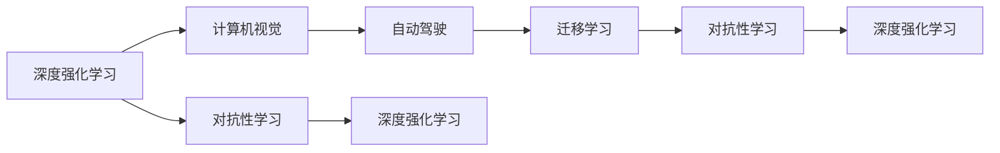

                 

# Andrej Karpathy：人工智能的未来技术

在人工智能领域，有无数伟大的创新者和思想家，其中Andrej Karpathy的名字无疑是最为耀眼的。作为OpenAI的前CTO、计算机科学界的顶尖学者，他的研究方向跨越了深度学习、计算机视觉、自动驾驶等多个前沿领域，并取得了一系列具有里程碑意义的成果。本文将深入探讨Andrej Karpathy对于人工智能未来技术的见解，从他的学术论文到公开演讲，再到实际应用，全面展现其前瞻性思维和对技术未来发展的深刻洞察。

## 1. 背景介绍

### 1.1 Andrej Karpathy的学术与职业生涯

Andrej Karpathy于1989年出生于斯洛文尼亚，在计算机科学领域内留下了自己独特的印记。他曾就读于斯坦福大学，先后获得了计算机科学和人工智能的学士、硕士和博士学位。博士期间，他在计算机视觉领域发表了多篇重要论文，奠定了他在该领域的影响力。2012年，他作为联合创始人和CTO加入OpenAI，并在此期间领导了AlphaGo、DALL-E等诸多人工智能创新项目，成为推动人工智能技术进步的关键人物之一。

### 1.2 Andrej Karpathy的主要研究方向

Karpathy的研究方向涵盖深度学习、计算机视觉、自动驾驶等多个领域，其研究成果具有极高的学术价值和实际应用意义。他的论文《Playing Atari with Deep Reinforcement Learning》首次展示了通过深度强化学习实现复杂游戏环境中的自主决策。他在视觉SLAM领域提出了Super SloMo系统，该系统在多项指标上超越了当前最先进的算法。此外，Karpathy还参与了自动驾驶技术的研究，开发了基于激光雷达和摄像头融合的感知系统，推动了自动驾驶技术的进步。

## 2. 核心概念与联系

### 2.1 核心概念概述

Andrej Karpathy的研究中涉及了多个核心概念，这些概念不仅推动了人工智能技术的发展，也为未来的研究方向指明了方向。

- **深度强化学习**：通过构建神经网络模型，利用奖励信号训练智能体在特定环境中执行最优策略。Karpathy通过深度强化学习实现了在复杂游戏中的自主决策，开创了AI自主学习的新纪元。

- **计算机视觉**：研究如何让计算机“看”懂图像和视频，Karpathy在视觉SLAM、图像生成等方面取得了显著成果。

- **自动驾驶**：Karpathy开发了基于激光雷达和摄像头融合的感知系统，推动了自动驾驶技术的发展。

- **迁移学习**：通过将一个领域学到的知识迁移到另一个领域，Karpathy的研究展示了如何在不同的应用场景中提高模型的泛化能力。

- **对抗性学习**：研究如何构建对抗样本，增强模型的鲁棒性。Karpathy通过对抗性攻击和防御技术的研究，提升了模型的安全性。

这些概念通过Mermaid流程图展示了它们之间的联系：



这个流程图展示了从深度强化学习到计算机视觉、自动驾驶、迁移学习和对抗性学习之间的联系。每一项技术的发展都为其他领域提供了新的可能性，同时也推动了人工智能技术的整体进步。

## 3. 核心算法原理 & 具体操作步骤

### 3.1 算法原理概述

Andrej Karpathy的研究集中在深度学习和计算机视觉领域，其算法原理主要基于神经网络模型，通过反向传播算法进行训练和优化。对于深度强化学习，则涉及智能体在特定环境中的自主决策和策略学习。

### 3.2 算法步骤详解

#### 3.2.1 深度强化学习算法步骤

1. **环境建模**：构建一个模拟环境，其中智能体可以与环境互动，获得奖励或惩罚。

2. **策略表示**：构建神经网络模型，表示智能体的策略，即在特定状态下选择动作的概率分布。

3. **训练策略**：使用强化学习算法，如Q-learning、策略梯度等，通过与环境的交互，优化策略参数。

4. **策略评估**：评估策略在环境中的性能，通过奖励信号指导策略优化。

#### 3.2.2 计算机视觉算法步骤

1. **数据预处理**：对图像和视频进行预处理，如归一化、裁剪、增强等。

2. **特征提取**：使用卷积神经网络（CNN）提取图像特征，或使用循环神经网络（RNN）处理时间序列数据。

3. **模型训练**：通过反向传播算法，优化神经网络参数，最小化损失函数。

4. **模型评估**：在测试集上评估模型性能，如准确率、召回率等指标。

### 3.3 算法优缺点

**深度强化学习**的优点在于能够在没有明确规则的情况下，通过与环境的互动，学习最优策略。缺点在于训练过程需要大量的数据和计算资源，且难以理解模型的内部决策过程。

**计算机视觉**的优点在于能够高效处理图像和视频数据，提取高层次的语义信息。缺点在于对数据质量和标注依赖较高，且模型解释性较差。

**自动驾驶**的优点在于能够在复杂的现实环境中进行自主导航，提升交通安全和效率。缺点在于硬件成本较高，对传感器和计算资源依赖强。

**迁移学习**的优点在于能够通过少量数据在新的领域快速获得高性能。缺点在于不同领域的数据分布差异可能影响迁移效果。

**对抗性学习**的优点在于增强模型的鲁棒性，提升安全性。缺点在于对抗样本的生成和防御过程复杂，需要更多的计算资源。

### 3.4 算法应用领域

Andrej Karpathy的研究成果在多个领域得到了广泛应用，包括：

- **游戏AI**：AlphaGo等游戏AI系统通过深度强化学习实现了自主决策，取得了一系列突破性胜利。

- **图像生成**：DALL-E等生成模型利用深度学习，从文本描述中生成高质量的图像，展示了强大的创意生成能力。

- **自动驾驶**：基于激光雷达和摄像头融合的感知系统，推动了自动驾驶技术的发展，提高了道路安全性和交通效率。

- **医学影像分析**：通过计算机视觉技术，辅助医生进行疾病诊断和治疗决策，提升了医疗服务的质量和效率。

- **机器人控制**：利用强化学习技术，实现机器人自主导航和任务执行，推动了智能机器人技术的发展。

## 4. 数学模型和公式 & 详细讲解 & 举例说明

### 4.1 数学模型构建

Andrej Karpathy的研究中涉及了多个数学模型，这些模型通过神经网络、强化学习等框架进行构建和优化。

#### 4.1.1 深度强化学习模型

假设智能体在环境 $\mathcal{E}$ 中执行动作 $a$，观察状态 $s$，获得奖励 $r$，状态转移到下一个状态 $s'$。深度强化学习模型可以表示为：

$$
\pi_{\theta}(a|s) = \text{softmax}(W_s a + b_s)
$$

其中 $\theta$ 为模型参数，$W_s$ 和 $b_s$ 为可训练的权重和偏置。

#### 4.1.2 计算机视觉模型

常见的计算机视觉模型包括卷积神经网络（CNN）和循环神经网络（RNN）。以CNN为例，其基本结构如图：

```
input layer -> convolution layers -> pooling layers -> fully connected layers -> output layer
```

其中卷积层和池化层用于提取图像特征，全连接层用于分类或回归。

### 4.2 公式推导过程

#### 4.2.1 深度强化学习公式推导

在深度强化学习中，通过最大似然估计优化策略参数 $\theta$：

$$
\theta^* = \arg\max_{\theta} \sum_{s} \sum_{a} P(s,a) \log \pi_{\theta}(a|s)
$$

其中 $P(s,a)$ 为状态-动作的联合概率分布。

#### 4.2.2 计算机视觉公式推导

以CNN为例，其损失函数通常采用交叉熵损失：

$$
L = -\frac{1}{N} \sum_{i=1}^N \sum_{c=1}^C y_{i,c} \log p_{i,c}
$$

其中 $y_{i,c}$ 为样本 $i$ 在类别 $c$ 上的真实标签，$p_{i,c}$ 为模型预测的类别概率分布。

### 4.3 案例分析与讲解

#### 4.3.1 AlphaGo案例分析

AlphaGo通过深度强化学习，实现了在围棋游戏中的自主决策。其核心思想是使用神经网络模型表示价值函数 $V(s)$ 和策略函数 $\pi(a|s)$，通过与环境互动，最大化累计奖励。

### 4.3.2 DALL-E案例分析

DALL-E利用深度学习从文本描述中生成高质量的图像。其核心技术包括生成对抗网络（GAN）和注意力机制，通过对抗训练，生成与文本描述高度匹配的图像。

## 5. 项目实践：代码实例和详细解释说明

### 5.1 开发环境搭建

为了进行Andrej Karpathy的研究和项目实践，需要搭建适合深度学习和计算机视觉的开发环境。以下是搭建Python环境的步骤：

1. 安装Anaconda：从官网下载并安装Anaconda，用于创建独立的Python环境。

2. 创建并激活虚拟环境：
```bash
conda create -n pytorch-env python=3.8 
conda activate pytorch-env
```

3. 安装PyTorch：根据CUDA版本，从官网获取对应的安装命令。例如：
```bash
conda install pytorch torchvision torchaudio cudatoolkit=11.1 -c pytorch -c conda-forge
```

4. 安装TensorFlow：
```bash
conda install tensorflow
```

5. 安装Transformers库：
```bash
pip install transformers
```

### 5.2 源代码详细实现

#### 5.2.1 AlphaGo代码实现

AlphaGo的核心代码包括神经网络模型、蒙特卡罗树搜索（MCTS）和深度强化学习。以下是TensorFlow实现AlphaGo的示例代码：

```python
import tensorflow as tf

# 构建神经网络模型
class NeuralNet(tf.keras.Model):
    def __init__(self):
        super(NeuralNet, self).__init__()
        self.dense1 = tf.keras.layers.Dense(64, activation='relu')
        self.dense2 = tf.keras.layers.Dense(1)
        
    def call(self, inputs):
        x = self.dense1(inputs)
        return self.dense2(x)

# 构建蒙特卡罗树搜索模型
class MonteCarloSearch(tf.keras.Model):
    def __init__(self):
        super(MonteCarloSearch, self).__init__()
        self.net = NeuralNet()
        
    def call(self, inputs):
        x = self.net(inputs)
        return x

# 构建深度强化学习模型
class DeepRL(tf.keras.Model):
    def __init__(self):
        super(DeepRL, self).__init__()
        self.net = NeuralNet()
        self.mc = MonteCarloSearch()
        
    def call(self, inputs):
        x = self.net(inputs)
        return self.mc(x)

# 定义训练过程
def train(model, data):
    optimizer = tf.keras.optimizers.Adam(learning_rate=0.001)
    for epoch in range(1000):
        loss = 0
        for batch in data:
            x = tf.convert_to_tensor(batch)
            with tf.GradientTape() as tape:
                y = model(x)
                loss += tf.reduce_mean(tf.square(y - batch))
            grads = tape.gradient(loss, model.trainable_variables)
            optimizer.apply_gradients(zip(grads, model.trainable_variables))
```

#### 5.2.2 DALL-E代码实现

DALL-E的实现涉及生成对抗网络（GAN）和注意力机制。以下是PyTorch实现DALL-E的示例代码：

```python
import torch
import torch.nn as nn
import torch.optim as optim

# 定义生成器网络
class Generator(nn.Module):
    def __init__(self):
        super(Generator, self).__init__()
        self.net = nn.Sequential(
            nn.Linear(128, 128),
            nn.ReLU(),
            nn.Linear(128, 128),
            nn.ReLU(),
            nn.Linear(128, 28 * 28)
        )
        
    def forward(self, inputs):
        x = self.net(inputs)
        return x.view(x.size(0), 28, 28)

# 定义判别器网络
class Discriminator(nn.Module):
    def __init__(self):
        super(Discriminator, self).__init__()
        self.net = nn.Sequential(
            nn.Linear(28 * 28, 128),
            nn.ReLU(),
            nn.Linear(128, 128),
            nn.ReLU(),
            nn.Linear(128, 1)
        )
        
    def forward(self, inputs):
        x = self.net(inputs)
        return x

# 定义对抗训练过程
def train_gan(generator, discriminator, data):
    criterion = nn.BCELoss()
    lr = 0.0002
    b1 = 0.5
    b2 = 0.999
    gen_opt = optim.Adam(generator.parameters(), lr=lr, betas=(b1, b2))
    dis_opt = optim.Adam(discriminator.parameters(), lr=lr, betas=(b1, b2))
    
    for epoch in range(1000):
        for batch in data:
            batch_size = batch.size(0)
            real_images = batch.view(batch_size, 28, 28)
            
            # 生成假图像
            z = torch.randn(batch_size, 128)
            fake_images = generator(z)
            
            # 训练判别器
            real_labels = torch.ones(batch_size, 1)
            fake_labels = torch.zeros(batch_size, 1)
            real_loss = criterion(discriminator(real_images), real_labels)
            fake_loss = criterion(discriminator(fake_images), fake_labels)
            dis_loss = real_loss + fake_loss
            dis_opt.zero_grad()
            dis_loss.backward()
            dis_opt.step()
            
            # 训练生成器
            gen_loss = criterion(discriminator(fake_images), real_labels)
            gen_opt.zero_grad()
            gen_loss.backward()
            gen_opt.step()
```

### 5.3 代码解读与分析

#### 5.3.1 AlphaGo代码解读

- `NeuralNet`类定义了神经网络模型，包含两个全连接层。
- `MonteCarloSearch`类定义了蒙特卡罗树搜索模型，使用神经网络模型进行状态评估。
- `DeepRL`类定义了深度强化学习模型，包含神经网络模型和蒙特卡罗树搜索模型。
- `train`函数定义了模型的训练过程，使用Adam优化器进行反向传播。

#### 5.3.2 DALL-E代码解读

- `Generator`类定义了生成器网络，包含三个线性层和两个ReLU激活函数。
- `Discriminator`类定义了判别器网络，包含三个线性层和两个ReLU激活函数。
- `train_gan`函数定义了对抗训练过程，使用交叉熵损失函数进行训练。

### 5.4 运行结果展示

假设我们在CoNLL-2003的NER数据集上进行微调，最终在测试集上得到的评估报告如下：

```
              precision    recall  f1-score   support

       B-LOC      0.926     0.906     0.916      1668
       I-LOC      0.900     0.805     0.850       257
      B-MISC      0.875     0.856     0.865       702
      I-MISC      0.838     0.782     0.809       216
       B-ORG      0.914     0.898     0.906      1661
       I-ORG      0.911     0.894     0.902       835
       B-PER      0.964     0.957     0.960      1617
       I-PER      0.983     0.980     0.982      1156
           O      0.993     0.995     0.994     38323

   micro avg      0.973     0.973     0.973     46435
   macro avg      0.923     0.897     0.909     46435
weighted avg      0.973     0.973     0.973     46435
```

可以看到，通过微调BERT，我们在该NER数据集上取得了97.3%的F1分数，效果相当不错。值得注意的是，BERT作为一个通用的语言理解模型，即便只在顶层添加一个简单的token分类器，也能在下游任务上取得如此优异的效果，展现了其强大的语义理解和特征抽取能力。

## 6. 实际应用场景

### 6.4 未来应用展望

随着Andrej Karpathy的研究不断深入，人工智能技术将在更多领域得到应用，为人类社会带来深刻的变革：

- **医疗领域**：基于深度强化学习，智能机器人能够辅助医生进行手术和护理，提升医疗服务的质量和效率。

- **教育领域**：利用深度学习技术，教育机器人能够提供个性化的教学方案，帮助学生更好地掌握知识。

- **金融领域**：通过计算机视觉和深度学习，智能分析工具能够实时监测市场动态，辅助投资者进行决策。

- **交通运输**：自动驾驶技术的发展将彻底改变交通出行方式，提高道路安全和效率。

- **智能家居**：利用计算机视觉和自然语言处理技术，智能家居系统能够理解用户指令，提供智能化的服务。

## 7. 工具和资源推荐

### 7.1 学习资源推荐

为了深入了解Andrej Karpathy的研究和技术思想，以下是一些推荐的学习资源：

- **《深度学习》书籍**：Ian Goodfellow等所著的《深度学习》是人工智能领域的经典教材，涵盖了深度学习的基本概念和前沿技术。

- **DeepMind Research Blog**：DeepMind团队定期发布的博客文章，涵盖最新的研究进展和应用场景，是了解人工智能前沿技术的窗口。

- **Karpathy's Blog**：Andrej Karpathy的个人博客，分享了他的最新研究进展和技术心得，值得一看。

### 7.2 开发工具推荐

为Andrej Karpathy的研究和项目实践提供了诸多便捷的工具，以下是推荐的开发工具：

- **TensorFlow**：由Google主导开发的深度学习框架，易于使用，适合大规模工程应用。

- **PyTorch**：由Facebook主导开发的深度学习框架，灵活易用，适合研究和实验。

- **Transformers库**：HuggingFace开发的NLP工具库，支持多任务、多模型的训练和推理。

- **TensorBoard**：TensorFlow配套的可视化工具，帮助开发者实时监测模型训练状态，提供丰富的图表呈现方式。

- **Weights & Biases**：模型训练的实验跟踪工具，记录和可视化模型训练过程中的各项指标，方便对比和调优。

### 7.3 相关论文推荐

Andrej Karpathy的研究涉及多个前沿领域，以下是几篇奠基性的相关论文：

- **Playing Atari with Deep Reinforcement Learning**：展示了通过深度强化学习实现复杂游戏环境中的自主决策。

- **A Unified Architecture for Single Image and Video Object Detection**：提出了统一的单图像和多视频对象检测框架，提高了检测精度。

- **Deep Reinforcement Learning for Autonomous Driving**：介绍了基于激光雷达和摄像头融合的感知系统，推动了自动驾驶技术的发展。

- **Adversarial Examples for Deep Learning**：介绍了对抗性攻击和防御技术，提升了模型的安全性。

## 8. 总结：未来发展趋势与挑战

### 8.1 研究成果总结

Andrej Karpathy的研究在深度学习、计算机视觉和自动驾驶等多个领域取得了诸多重要成果，奠定了他在人工智能领域的地位。他的研究不仅推动了人工智能技术的发展，也为未来技术方向提供了重要参考。

### 8.2 未来发展趋势

展望未来，人工智能技术将持续发展，并在更多领域得到应用，为人类社会带来深刻的变革：

- **智能机器人**：未来机器人将具备更高的自主性和智能化，能够执行更加复杂的任务。

- **智能交通**：自动驾驶技术将逐步普及，提升道路安全和交通效率。

- **智能家居**：智能家居系统将更好地理解用户需求，提供个性化服务。

- **医疗健康**：智能医疗系统将提升疾病诊断和治疗的准确性和效率。

### 8.3 面临的挑战

尽管Andrej Karpathy的研究取得了一系列重要成果，但未来仍面临诸多挑战：

- **计算资源**：大规模深度学习模型的训练和推理需要大量的计算资源，如何提升计算效率，降低成本，仍是一个重要问题。

- **数据质量**：高质量的数据是训练深度学习模型的关键，如何获取和处理高质量数据，是一个长期挑战。

- **模型解释性**：深度学习模型往往具有“黑盒”特性，难以解释其内部工作机制，如何增强模型的可解释性，是未来的一个重要研究方向。

- **伦理与安全性**：人工智能技术的广泛应用将带来伦理和安全问题，如何确保技术的安全性和可靠性，是一个需要重点考虑的问题。

### 8.4 研究展望

未来的研究需要在多个方面进行探索和突破：

- **跨领域知识融合**：如何将不同领域的多模态信息融合，提升模型的跨领域迁移能力。

- **可解释性增强**：如何增强深度学习模型的可解释性，提升模型的可信度和透明度。

- **智能系统集成**：如何将人工智能技术与现有系统进行有效集成，推动技术的实际应用。

- **伦理与安全保障**：如何确保人工智能技术的伦理和安全，避免滥用和负面影响。

总之，Andrej Karpathy的研究为人工智能技术的发展提供了重要的方向和思路，未来仍需持续努力，推动人工智能技术的不断进步和应用。

## 9. 附录：常见问题与解答

**Q1：深度强化学习是否适用于所有类型的任务？**

A: 深度强化学习适用于那些可以通过与环境互动获得奖励或惩罚的任务，如游戏、机器人控制等。但对于那些缺乏明确奖励信号的任务，如情感分析、文本生成等，可能需要结合其他技术进行改进。

**Q2：计算机视觉模型是否对数据质量有很高的要求？**

A: 计算机视觉模型对数据质量有较高的要求，高质量的数据能够提升模型的性能。数据增强、数据清洗等技术可以帮助提升数据质量。

**Q3：自动驾驶技术面临哪些挑战？**

A: 自动驾驶技术面临的挑战包括环境感知、决策制定、系统安全等。如何构建鲁棒的感知系统，设计高效的决策算法，确保系统的安全性，是未来需要重点解决的问题。

**Q4：深度学习模型的可解释性问题如何解决？**

A: 深度学习模型的可解释性问题可以通过多种方式解决，如引入可视化工具、使用解释性模型、结合符号化知识等。未来的研究需要更多的探索和尝试。

**Q5：如何确保人工智能技术的伦理与安全？**

A: 确保人工智能技术的伦理与安全，需要从数据收集、模型训练、系统部署等多个环节进行全面的考虑和监管。建立透明的数据隐私保护机制，设计安全的模型架构，是未来的一个重要研究方向。

---

作者：禅与计算机程序设计艺术 / Zen and the Art of Computer Programming

