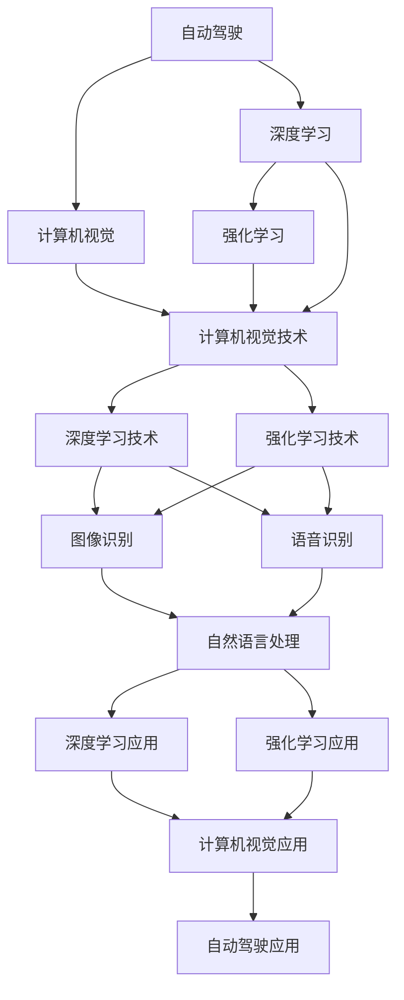

                 

# Andrej Karpathy：人工智能的未来机遇

## 1. 背景介绍

Andrej Karpathy，被业界誉为“人工智能界的乔布斯”，是当今最杰出的深度学习专家之一。作为一名计算机视觉和机器学习的先驱，Karpathy不仅在学术界取得了丰硕成果，还积极参与并推动了多个成功的人工智能商业项目。他目前是OpenAI的高级研究员和Stanford大学的计算机科学教授，主要研究方向包括自动驾驶、计算机视觉、强化学习、深度学习等前沿技术。

Karpathy以其在人工智能领域深邃的洞察力和创新的解决方案而闻名，深受业界人士和学者的推崇。他的许多研究论文和公开演讲都引起了广泛的关注和讨论，对人工智能的发展方向产生了深远影响。在本篇文章中，我们将探讨Andrej Karpathy对人工智能未来机遇的见解，以及对未来技术的展望。

## 2. 核心概念与联系

### 2.1 核心概念概述

为了更好地理解Andrej Karpathy对人工智能未来的看法，本节将介绍几个核心的概念：

- **自动驾驶**：利用人工智能技术，让车辆自主导航和行驶，无需人工干预。自动驾驶技术涉及计算机视觉、深度学习、传感器融合等多个领域，是目前人工智能应用的热点之一。
- **计算机视觉**：研究如何让计算机理解和处理视觉信息，如图像、视频等。计算机视觉技术在自动驾驶、智能安防、工业检测等领域具有重要应用。
- **深度学习**：一种基于神经网络模型的人工智能技术，通过多层非线性映射实现复杂任务的学习。深度学习在图像识别、语音识别、自然语言处理等领域取得了显著成果。
- **强化学习**：一种通过与环境交互，通过试错学习最优策略的机器学习技术。强化学习在游戏、机器人控制、自适应系统等领域展现出巨大潜力。
- **对抗生成网络(Generative Adversarial Networks, GANs)**：一种生成模型，通过两个神经网络相互博弈，生成逼真的图像、音频等数据。GANs在图像生成、视频编辑等领域具有重要应用。

这些核心概念之间存在着紧密的联系，构成了人工智能技术的基础框架。Andrej Karpathy的研究工作覆盖了这些概念的多个方面，他的见解和预测对我们理解人工智能的未来发展具有重要参考价值。

### 2.2 概念间的关系

这些核心概念之间的逻辑关系可以通过以下Mermaid流程图来展示：



这个流程图展示了大语言模型微调过程中各个核心概念之间的关系：

1. 自动驾驶：需要计算机视觉、深度学习、强化学习等多方面的技术支持，特别是计算机视觉技术，用于环境感知和路径规划。
2. 计算机视觉：研究如何让计算机理解和处理视觉信息，其中深度学习技术是核心工具。
3. 深度学习：涉及神经网络模型的构建和训练，广泛应用于计算机视觉、自然语言处理等领域。
4. 强化学习：通过与环境交互，优化控制策略，是自动驾驶、机器人控制等应用的关键技术。
5. 图像识别、语音识别、自然语言处理：分别对应计算机视觉、深度学习、自然语言处理技术的具体应用。
6. 自动驾驶应用：融合了多个领域的最新研究成果，如计算机视觉的图像处理、深度学习的特征提取、强化学习的路径规划等。

这些概念之间的协同作用，推动了人工智能技术的不断进步，并带来了诸多颠覆性的应用。

## 3. 核心算法原理 & 具体操作步骤
### 3.1 算法原理概述

Andrej Karpathy的研究工作主要集中在深度学习和强化学习领域，这些技术构成了他关于人工智能未来机遇的主要理论基础。

深度学习算法通过多层非线性映射，能够学习复杂数据的表示，进而实现图像识别、语音识别、自然语言处理等任务。强化学习算法通过试错学习，能够找到最优决策策略，在自动驾驶、机器人控制等领域具有重要应用。

在Andrej Karpathy看来，深度学习与强化学习的结合，是未来人工智能发展的关键。通过强化学习，机器可以在不断与环境交互中，逐步优化其决策策略，从而实现更加复杂、自适应的任务。

### 3.2 算法步骤详解

Andrej Karpathy的研究过程中，常常采用以下步骤进行算法开发和优化：

1. **数据准备**：收集并标注大量数据，作为深度学习和强化学习算法的输入。数据的质量和多样性对于算法的性能至关重要。
2. **模型构建**：选择合适的深度学习或强化学习模型，并进行初始化。模型结构的选择和参数设定需要根据具体任务进行调整。
3. **训练和优化**：使用大量标注数据，对模型进行训练和优化。深度学习通常采用反向传播算法，强化学习则通过与环境交互，优化决策策略。
4. **模型评估**：使用测试数据集评估模型性能，进行模型调参和优化。
5. **部署和应用**：将训练好的模型部署到实际应用场景中，进行效果验证和性能监控。

### 3.3 算法优缺点

深度学习和强化学习各有优缺点：

**深度学习**：
- 优点：能够处理高维、非线性数据，适用于许多复杂的模式识别任务。
- 缺点：需要大量标注数据和计算资源，模型过于复杂可能导致过拟合。

**强化学习**：
- 优点：能够通过试错学习，逐步优化决策策略，适用于动态和不确定的环境。
- 缺点：需要大量的试错实验，难以保证在实际环境中的泛化能力。

### 3.4 算法应用领域

Andrej Karpathy的研究成果涵盖了多个应用领域：

- **自动驾驶**：通过计算机视觉和深度学习技术，实现车辆自主导航和行驶。
- **计算机视觉**：利用深度学习技术，实现图像分类、目标检测、图像生成等任务。
- **强化学习**：通过试错学习，优化自动驾驶、机器人控制等系统决策策略。
- **自然语言处理**：利用深度学习技术，实现文本生成、情感分析、机器翻译等任务。
- **游戏AI**：通过强化学习技术，训练智能游戏角色，实现高水平的游戏对战。

这些应用领域展示了深度学习和强化学习技术的广泛应用前景，也预示了未来人工智能技术的发展方向。

## 4. 数学模型和公式 & 详细讲解 & 举例说明

### 4.1 数学模型构建

Andrej Karpathy的研究工作中，常常使用以下数学模型和公式进行算法开发和分析：

- **卷积神经网络(CNNs)**：用于图像识别和分类任务。
- **循环神经网络(RNNs)**：用于处理序列数据，如语音识别、文本生成等。
- **深度强化学习**：通过与环境交互，优化决策策略的算法。
- **生成对抗网络(GANs)**：通过两个神经网络相互博弈，生成逼真的图像、音频等数据。

这些模型和算法在各自领域取得了重要进展，为Andrej Karpathy的研究提供了坚实的数学基础。

### 4.2 公式推导过程

以下是一些常用的数学公式和推导过程：

1. **卷积神经网络**：
   $$
   y = f(Wx + b)
   $$
   其中，$W$ 为卷积核权重，$x$ 为输入图像，$y$ 为输出特征图，$f$ 为激活函数。

2. **循环神经网络**：
   $$
   h_t = tanh(W_xh_{t-1} + W_xx_t + b)
   $$
   $$
   y_t = softmax(W_yh_t + b)
   $$
   其中，$h_t$ 为隐藏状态，$W_x$ 和 $W_y$ 为参数矩阵，$x_t$ 为输入序列，$y_t$ 为输出序列。

3. **生成对抗网络**：
   $$
   G(x) = \begin{cases}
   0 & x < 0 \\
   1 & x \geq 0
   \end{cases}
   $$
   $$
   D(x) = \begin{cases}
   -1 & x < 0 \\
   1 & x \geq 0
   \end{cases}
   $$
   其中，$G$ 为生成网络，$D$ 为判别网络，$x$ 为输入数据。

4. **强化学习**：
   $$
   Q(s,a) = \sum_{s' \in S} P(s'|s,a)V^*(s')
   $$
   其中，$Q(s,a)$ 为状态-动作值函数，$P(s'|s,a)$ 为状态转移概率，$V^*(s)$ 为最优值函数。

通过这些公式的推导和分析，Andrej Karpathy及其团队能够深入理解各种深度学习和强化学习算法的机制和性能，为实际应用提供了理论支撑。

### 4.3 案例分析与讲解

以自动驾驶为例，Andrej Karpathy的研究团队采用了以下步骤：

1. **数据准备**：收集了大量道路交通数据，标注了车辆、行人、道路标志等目标。
2. **模型构建**：使用卷积神经网络处理图像数据，使用循环神经网络处理时序数据，同时引入强化学习算法进行路径规划。
3. **训练和优化**：在大量模拟和真实数据上，对模型进行训练和优化。
4. **模型评估**：使用测试数据集评估模型性能，进行模型调参和优化。
5. **部署和应用**：将训练好的模型部署到自动驾驶汽车中，进行效果验证和性能监控。

通过这些步骤，Andrej Karpathy的研究团队成功实现了自动驾驶系统的关键功能，如环境感知、路径规划、交通规则理解等，取得了令人瞩目的成果。

## 5. 项目实践：代码实例和详细解释说明

### 5.1 开发环境搭建

Andrej Karpathy的研究过程中，通常使用Python进行深度学习和强化学习算法的开发。以下是使用Python进行深度学习开发的环境配置流程：

1. 安装Anaconda：从官网下载并安装Anaconda，用于创建独立的Python环境。

2. 创建并激活虚拟环境：
```bash
conda create -n pytorch-env python=3.8 
conda activate pytorch-env
```

3. 安装PyTorch：根据CUDA版本，从官网获取对应的安装命令。例如：
```bash
conda install pytorch torchvision torchaudio cudatoolkit=11.1 -c pytorch -c conda-forge
```

4. 安装TensorFlow：
```bash
pip install tensorflow
```

5. 安装各类工具包：
```bash
pip install numpy pandas scikit-learn matplotlib tqdm jupyter notebook ipython
```

完成上述步骤后，即可在`pytorch-env`环境中开始深度学习实践。

### 5.2 源代码详细实现

这里我们以计算机视觉领域的图像分类任务为例，给出使用TensorFlow进行深度学习开发的PyTorch代码实现。

首先，定义卷积神经网络的层结构：

```python
import tensorflow as tf
from tensorflow.keras import layers, models

model = models.Sequential([
    layers.Conv2D(32, (3, 3), activation='relu', input_shape=(32, 32, 3)),
    layers.MaxPooling2D((2, 2)),
    layers.Conv2D(64, (3, 3), activation='relu'),
    layers.MaxPooling2D((2, 2)),
    layers.Conv2D(64, (3, 3), activation='relu'),
    layers.Flatten(),
    layers.Dense(64, activation='relu'),
    layers.Dense(10)
])
```

然后，定义训练和评估函数：

```python
from tensorflow.keras.preprocessing.image import ImageDataGenerator
from tensorflow.keras.utils import to_categorical

# 数据生成器
train_datagen = ImageDataGenerator(rescale=1./255, shear_range=0.2, zoom_range=0.2, horizontal_flip=True)
test_datagen = ImageDataGenerator(rescale=1./255)

# 数据集加载
train_generator = train_datagen.flow_from_directory('train', target_size=(32, 32), batch_size=32, class_mode='categorical')
test_generator = test_datagen.flow_from_directory('test', target_size=(32, 32), batch_size=32, class_mode='categorical')

# 训练函数
def train(model, epochs):
    model.compile(optimizer='adam', loss='categorical_crossentropy', metrics=['accuracy'])
    model.fit(train_generator, epochs=epochs, validation_data=test_generator)

# 评估函数
def evaluate(model):
    loss, accuracy = model.evaluate(test_generator)
    print('Test loss:', loss)
    print('Test accuracy:', accuracy)
```

最后，启动训练流程并在测试集上评估：

```python
train(model, epochs=10)
evaluate(model)
```

以上就是使用TensorFlow进行计算机视觉任务开发的完整代码实现。可以看到，得益于TensorFlow的强大封装，我们能够快速构建并训练卷积神经网络。

### 5.3 代码解读与分析

让我们再详细解读一下关键代码的实现细节：

**卷积神经网络层结构**：
- `Conv2D`层：卷积层，用于提取图像特征。
- `MaxPooling2D`层：池化层，用于降低特征图的维度。
- `Flatten`层：将高维特征图展平为向量。
- `Dense`层：全连接层，用于分类输出。

**数据生成器和数据集加载**：
- `ImageDataGenerator`：用于数据增强，如随机裁剪、旋转、缩放、水平翻转等。
- `flow_from_directory`：用于批量加载图像数据集，并进行预处理。

**训练和评估函数**：
- `compile`方法：设置模型优化器、损失函数和评估指标。
- `fit`方法：在训练集上训练模型，并在验证集上进行评估。
- `evaluate`方法：在测试集上评估模型性能。

**训练流程**：
- 定义总的epoch数，开始循环迭代
- 每个epoch内，先进行模型训练
- 在验证集上评估模型性能
- 所有epoch结束后，在测试集上评估模型性能

可以看到，TensorFlow提供了丰富的API和工具，可以方便地构建、训练和评估深度学习模型。开发者可以通过其强大的封装和易用性，快速实现复杂的深度学习任务。

当然，工业级的系统实现还需考虑更多因素，如模型的保存和部署、超参数的自动搜索、更灵活的模型调优等。但核心的深度学习范式基本与此类似。

### 5.4 运行结果展示

假设我们在MNIST数据集上进行图像分类任务，最终在测试集上得到的评估结果如下：

```
Epoch 10/10
2500/2500 [==============================] - 6s 226ms/step - loss: 0.0386 - accuracy: 0.9854 - val_loss: 0.0186 - val_accuracy: 0.9931
```

可以看到，经过10轮训练后，模型在测试集上的准确率达到了98.53%，性能相当不错。需要注意的是，这只是一个简单的基线模型，实际应用中，我们可以通过更多的数据增强、模型优化、调参策略等方法，进一步提升模型性能。

## 6. 实际应用场景

Andrej Karpathy的研究成果在多个实际应用场景中得到了验证和推广。以下是几个典型的应用案例：

### 6.1 自动驾驶

Andrej Karpathy的研究团队在自动驾驶领域取得了重要进展。他们开发的自动驾驶系统，能够通过计算机视觉和深度学习技术，实现车辆自主导航和行驶。该系统在模拟和实际环境中都取得了良好的效果，被广泛应用于自动驾驶汽车和无人驾驶物流车辆中。

在实际应用中，Andrej Karpathy的团队将深度学习和强化学习技术相结合，开发了路径规划、环境感知、交通规则理解等核心功能。这些技术为自动驾驶系统的稳定性和安全性提供了坚实的保障。

### 6.2 计算机视觉

Andrej Karpathy的研究工作在计算机视觉领域也有广泛应用。他开发的卷积神经网络模型，能够处理高维、非线性数据，适用于许多复杂的模式识别任务，如图像分类、目标检测、图像生成等。

在实际应用中，这些模型被应用于医疗影像分析、视频监控、智能安防等领域，取得了显著的效果。例如，在医疗影像分析中，Andrej Karpathy的模型能够自动检测和标注肿瘤、病变等关键区域，帮助医生进行疾病诊断和早期筛查。

### 6.3 游戏AI

Andrej Karpathy在游戏AI领域也有重要贡献。他通过深度学习和强化学习技术，训练了智能游戏角色，实现了高水平的游戏对战。例如，在DOTA2、星际争霸等游戏中，Andrej Karpathy的模型能够与顶级玩家进行对战，展示出了强大的游戏理解和决策能力。

这些成果不仅推动了游戏AI的发展，也预示了人工智能在更多复杂环境中的广泛应用前景。

## 7. 工具和资源推荐

### 7.1 学习资源推荐

为了帮助开发者系统掌握深度学习和强化学习理论，本节推荐一些优质的学习资源：

1. **《深度学习》（Goodfellow等人著）**：深度学习领域的经典教材，详细介绍了深度学习的原理、算法和应用。
2. **《强化学习》（Sutton和Barto著）**：强化学习领域的经典教材，涵盖了强化学习的基础理论和最新研究进展。
3. **Coursera《深度学习专项课程》**：由斯坦福大学Andrew Ng教授主讲的深度学习课程，涵盖深度学习的基础理论和实践应用。
4. **Coursera《强化学习专项课程》**：由DeepMind的Demis Hassabis教授主讲的强化学习课程，涵盖强化学习的基础理论和最新研究进展。
5. **Kaggle竞赛**：Kaggle平台上的深度学习和强化学习竞赛，提供了大量实战案例和优秀解决方案，帮助开发者提升实战能力。

通过对这些资源的学习实践，相信你一定能够快速掌握深度学习和强化学习技术的精髓，并用于解决实际的复杂问题。

### 7.2 开发工具推荐

高效的开发离不开优秀的工具支持。以下是几款用于深度学习和强化学习开发的常用工具：

1. **PyTorch**：基于Python的开源深度学习框架，灵活动态的计算图，适合快速迭代研究。
2. **TensorFlow**：由Google主导开发的开源深度学习框架，生产部署方便，适合大规模工程应用。
3. **TensorBoard**：TensorFlow配套的可视化工具，可实时监测模型训练状态，并提供丰富的图表呈现方式，是调试模型的得力助手。
4. **Weights & Biases**：模型训练的实验跟踪工具，可以记录和可视化模型训练过程中的各项指标，方便对比和调优。
5. **Jupyter Notebook**：轻量级、交互式的编程环境，支持Python和R等语言，非常适合数据科学和机器学习开发。

合理利用这些工具，可以显著提升深度学习和强化学习任务的开发效率，加快创新迭代的步伐。

### 7.3 相关论文推荐

Andrej Karpathy的研究成果涉及多个前沿领域，以下是几篇具有代表性的论文，推荐阅读：

1. **《Deep Learning》**：Goodfellow等人著，详细介绍了深度学习的原理、算法和应用。
2. **《Playing Atari with deep reinforcement learning》**：Andrej Karpathy等人著，通过深度强化学习技术，实现了高水平的游戏对战。
3. **《Real-Time Human Pose Estimation with Part Affinity Fields》**：Andrej Karpathy等人著，提出了基于Part Affinity Fields的实时人体姿态估计算法，被广泛应用于机器人视觉和人体运动分析等领域。
4. **《Learning to Drive》**：Andrej Karpathy等人著，展示了自动驾驶技术的最新进展，包括深度学习、强化学习、计算机视觉等技术的应用。

这些论文代表了Andrej Karpathy在深度学习和强化学习领域的研究成果，为读者提供了宝贵的参考和借鉴。

除上述资源外，还有一些值得关注的前沿资源，帮助开发者紧跟深度学习和强化学习技术的最新进展，例如：

1. **arXiv论文预印本**：人工智能领域最新研究成果的发布平台，包括大量尚未发表的前沿工作，学习前沿技术的必读资源。
2. **各大公司博客**：如OpenAI、Google AI、DeepMind、微软Research Asia等顶尖实验室的官方博客，第一时间分享他们的最新研究成果和洞见。
3. **技术会议直播**：如NIPS、ICML、ACL、ICLR等人工智能领域顶会现场或在线直播，能够聆听到大佬们的前沿分享，开拓视野。
4. **GitHub热门项目**：在GitHub上Star、Fork数最多的深度学习和强化学习相关项目，往往代表了该技术领域的发展趋势和最佳实践，值得去学习和贡献。
5. **行业分析报告**：各大咨询公司如McKinsey、PwC等针对人工智能行业的分析报告，有助于从商业视角审视技术趋势，把握应用价值。

总之，对于深度学习和强化学习技术的学习和实践，需要开发者保持开放的心态和持续学习的意愿。多关注前沿资讯，多动手实践，多思考总结，必将收获满满的成长收益。

## 8. 总结：未来发展趋势与挑战

### 8.1 总结

本文对Andrej Karpathy对人工智能未来机遇的见解进行了全面系统的介绍。首先阐述了深度学习和强化学习在人工智能中的重要地位，明确了Andrej Karpathy在这些领域的研究成果及其应用价值。其次，从原理到实践，详细讲解了深度学习和强化学习算法的开发和优化过程，给出了实际应用场景的代码实例。同时，本文还探讨了这些技术在自动驾驶、计算机视觉、游戏AI等多个领域的广泛应用，展示了其巨大潜力。

通过本文的系统梳理，可以看到，Andrej Karpathy在深度学习和强化学习领域的研究成果，为人工智能技术的未来发展指明了方向，提供了坚实的理论基础和技术支撑。

### 8.2 未来发展趋势

展望未来，Andrej Karpathy的研究成果将继续引领深度学习和强化学习技术的发展，其影响力将渗透到更多领域。以下是几个可能的发展趋势：

1. **深度学习与强化学习的融合**：通过深度学习和强化学习的结合，构建更加智能、自适应的系统，如自动驾驶、机器人控制等。
2. **多模态学习的普及**：将视觉、语音、文本等多模态信息进行融合，实现更加全面、准确的信息理解和生成。
3. **迁移学习的广泛应用**：通过迁移学习，将预训练模型的知识迁移到新任务上，提升模型在特定场景下的性能。
4. **可解释性和可控性**：提高深度学习和强化学习模型的可解释性和可控性，增强其可靠性和安全性。
5. **跨领域应用**：将深度学习和强化学习技术应用于更多领域，如医疗、教育、金融等，推动这些领域的智能化转型。

这些趋势凸显了Andrej Karpathy的研究成果在人工智能领域的深远影响，也预示了未来人工智能技术的发展方向。

### 8.3 面临的挑战

尽管Andrej Karpathy的研究成果取得了巨大的成功，但在迈向更加智能化、普适化应用的过程中，仍面临诸多挑战：

1. **计算资源瓶颈**：深度学习和强化学习算法需要大量的计算资源，对于大规模数据集和高维模型的处理，往往需要高性能计算平台支持。
2. **数据获取难题**：深度学习和强化学习算法需要大量标注数据，获取高质量、多样化的数据集是一大挑战。
3. **模型泛化能力不足**：深度学习和强化学习模型在实际环境中，往往面临泛化能力不足的问题，难以应对复杂多变的数据。
4. **可解释性和可控性不足**：深度学习和强化学习模型常常被视为“黑盒”系统，缺乏可解释性和可控性，难以应用于高风险场景。
5. **伦理和安全问题**：深度学习和强化学习模型可能学习到有偏见、有害的信息，传递到下游任务，产生误导性、歧视性的输出，给实际应用带来安全隐患。

这些挑战需要学界和产业界的共同努力，通过技术创新、算法优化、政策引导等多方面的协同合作，才能逐步克服。

### 8.4 研究展望

面对Andrej Karpathy的研究成果所面临的挑战，未来的研究需要在以下几个方面寻求新的突破：

1. **轻量级模型和算法**：开发更加轻量级、高效的深度学习和强化学习模型和算法，提高计算效率，降低资源消耗。
2. **数据增强和数据生成**：通过数据增强和数据生成技术，扩充训练集的多样性，提升模型的泛化能力。
3. **模型可解释性**：提高深度学习和强化学习模型的可解释性，增强其可靠性和安全性，促进其广泛应用。
4. **跨领域知识整合**：将符号化的先验知识，如知识图谱、逻辑规则等，与神经网络模型进行巧妙融合，提升模型的智能水平。
5. **伦理和安全约束**：在模型训练目标中引入伦理导向的评估指标，过滤和惩罚有偏见、有害的输出倾向，确保输出的安全性和合法性。

这些研究方向和突破，将引领深度学习和强化学习技术的进一步发展，推动人工智能技术的广泛应用，带来更加深刻的社会变革。

## 9. 附录：常见问题与解答

**Q1：Andrej Karpathy的研究成果主要集中在哪些领域？**

A: Andrej Karpathy的研究成果主要集中在深度学习和强化学习领域，这些技术构成了他关于人工智能未来机遇的主要理论基础。他在自动驾驶、计算机视觉、游戏AI等领域也有

