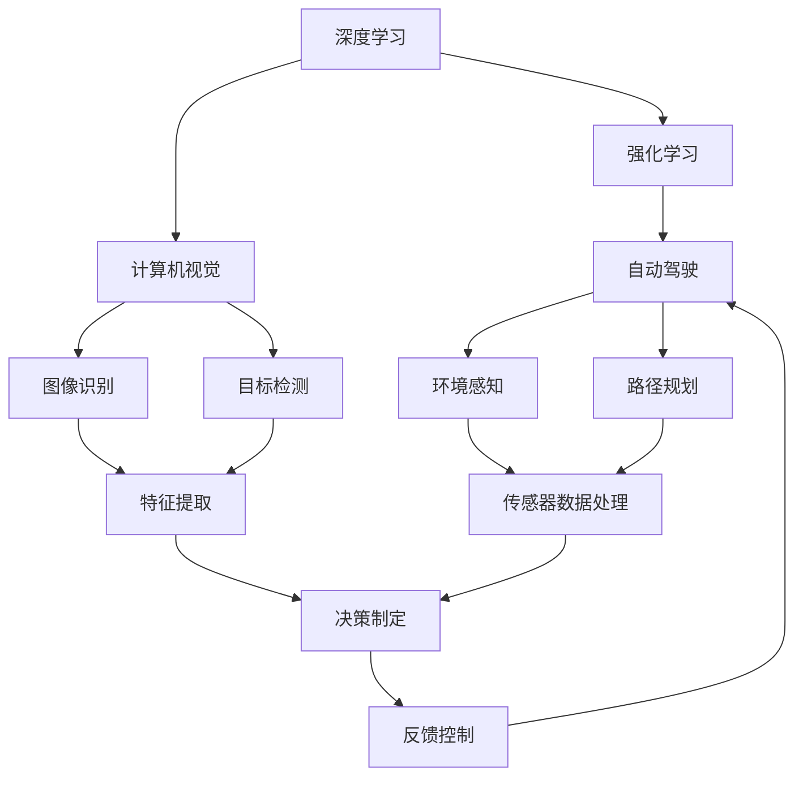

                 

# Andrej Karpathy：把我们的努力集合在一起

> 关键词：
> - Andrej Karpathy
> - 深度学习
> - 强化学习
> - 自动驾驶
> - 大规模数据处理
> - 软件工程
> - 计算机视觉
> - 人工智能伦理

## 1. 背景介绍

在现代科技的浪潮中，深度学习与强化学习成为引领AI技术发展的两股重要力量。而在这些技术的开发与应用中，有一位杰出的AI研究者，他的工作跨越了计算机视觉、强化学习等多个领域，并在自动驾驶、大规模数据处理等方面做出了开创性贡献。他，就是Andrej Karpathy。

Karpathy于1985年出生于斯洛文尼亚的卢布尔雅那，从小对编程充满兴趣，高中时便开始参与各种编程项目。2001年，他进入斯坦福大学计算机科学系，开始了在AI领域的学术生涯。在学术与产业界的双线奋斗中，Karpathy逐渐展现出其非凡的才华与领导力。他不仅在顶级会议与期刊上发表了众多影响力巨大的论文，还创立了OpenAI和DeepMind等多个AI创业公司。

## 2. 核心概念与联系

### 2.1 核心概念概述

在理解Karpathy的工作之前，我们需要先了解几个关键概念：

- **深度学习（Deep Learning）**：一种基于多层神经网络的机器学习技术，能够自动学习输入数据的复杂特征，并在图像识别、语音识别、自然语言处理等任务上取得了显著的成果。
- **强化学习（Reinforcement Learning）**：一种通过智能体与环境交互，通过奖励信号优化决策策略的学习方法。广泛应用于自动驾驶、游戏AI等领域。
- **计算机视觉（Computer Vision）**：研究如何让计算机“看”的科学，包括图像识别、目标检测、图像生成等任务。
- **自动驾驶（Autonomous Driving）**：结合深度学习与强化学习，使车辆能够自主导航并与其他车辆、行人交互。
- **大规模数据处理（Large-scale Data Processing）**：处理海量数据的计算与存储技术，包括分布式系统、大数据分析等。
- **软件工程（Software Engineering）**：研究如何高效开发、维护和管理大型软件系统的工程方法。

### 2.2 概念间的关系

这些核心概念之间有着紧密的联系，构成了Andrej Karpathy的研究领域和技术栈。以下是一个简化的Mermaid流程图，展示了这些概念间的相互关系：



通过这个流程图，我们可以看到：

- 深度学习为计算机视觉、强化学习提供强大的模型支持。
- 计算机视觉中的图像识别、目标检测等技术，在自动驾驶中的环境感知、路径规划等任务中发挥关键作用。
- 强化学习通过决策制定、反馈控制等机制，使得自动驾驶系统能够在复杂的交通环境中自主导航。
- 大规模数据处理和软件工程则保障了这些复杂技术系统的稳定运行和高效开发。

### 2.3 核心概念的整体架构

整个架构以数据为核心，通过深度学习、计算机视觉、强化学习等技术，实现数据的自动化分析与决策。数据源可以是摄像头、雷达、GPS等传感器，经过处理后输入模型，进行特征提取、决策制定和反馈控制，最终输出自动驾驶行为。整个流程需要高效的计算资源和严密的软件工程实践，才能确保其稳定性和高效性。

## 3. 核心算法原理 & 具体操作步骤

### 3.1 算法原理概述

Andrej Karpathy的研究工作主要集中在深度学习、强化学习与计算机视觉的交叉领域。以下是对其核心算法原理的概述：

- **深度学习模型构建**：使用卷积神经网络（CNN）、循环神经网络（RNN）等深度神经网络模型，构建计算机视觉与自动驾驶任务的基础。
- **强化学习决策制定**：通过Q-learning、Deep Q-Networks（DQN）等强化学习算法，使智能体在模拟环境中学习并优化决策策略。
- **大规模数据处理技术**：利用分布式系统如Spark、Hadoop等，处理和分析大规模的传感器数据，构建高效的数据流处理系统。
- **软件工程实践**：采用敏捷开发、持续集成等现代软件工程方法，提高项目开发效率与产品质量。

### 3.2 算法步骤详解

以下是Karpathy工作流程中的关键步骤：

1. **数据采集与预处理**：
    - 使用摄像头、雷达等传感器采集自动驾驶车辆的环境数据。
    - 对数据进行预处理，如去噪、增强、归一化等，为后续深度学习模型提供高质量输入。

2. **模型训练与优化**：
    - 使用大规模标注数据，训练卷积神经网络（CNN）等深度学习模型，提取图像中的道路、车辆、行人等特征。
    - 通过强化学习算法，训练智能体在虚拟环境中学习导航策略。
    - 利用大规模数据处理技术，处理和分析模型训练所需的大量数据。

3. **决策制定与执行**：
    - 在真实环境中，智能体通过传感器数据更新模型状态，输入到计算机视觉模型中进行实时分析。
    - 使用强化学习模型输出决策指令，如加速、减速、转向等。
    - 通过软件工程方法，实现模型推理与决策执行的自动化流程。

4. **反馈与优化**：
    - 通过传感器收集实时反馈，评估决策效果。
    - 根据反馈结果，调整模型参数或策略，进一步优化性能。

### 3.3 算法优缺点

Andrej Karpathy的算法具有以下优点：

- **高精度与鲁棒性**：通过深度学习模型和强化学习算法，系统能够适应复杂多变的环境，提供高精度的决策结果。
- **自适应与可扩展性**：通过数据驱动的方式，系统可以不断学习新数据，适应不同的驾驶场景，具有很强的自适应能力。
- **高效性与可扩展性**：利用大规模数据处理和软件工程技术，系统可以高效处理和分析大量数据，支持大规模的自动驾驶系统部署。

然而，该算法也存在一些缺点：

- **高计算需求**：深度学习和强化学习模型训练和推理需要大量的计算资源，初期成本较高。
- **数据依赖性**：系统的性能依赖于大量高质量的数据，数据采集与标注工作量大。
- **复杂性与调试难度**：系统涉及多种技术的综合应用，调试复杂，需要多方协作。

### 3.4 算法应用领域

Karpathy的研究成果在多个领域得到了应用，包括：

- **自动驾驶**：在Google、特斯拉等公司的自动驾驶项目中，Karpathy的研究为模型训练、决策制定提供了关键技术支持。
- **计算机视觉**：其研究为图像识别、目标检测等计算机视觉任务提供了新方法，显著提高了计算机视觉系统的准确性和鲁棒性。
- **强化学习**：在机器人、游戏AI等领域，Karpathy的强化学习算法提升了智能体的决策效率和策略优化能力。
- **大规模数据处理**：其在分布式系统和大数据分析方面的研究，为处理海量数据提供了高效的技术方案。

## 4. 数学模型和公式 & 详细讲解 & 举例说明

### 4.1 数学模型构建

Karpathy的研究涉及多种数学模型，以下以自动驾驶中的强化学习模型为例，构建其数学模型：

- **状态空间**：自动驾驶环境中的状态可以表示为 $s = (x, y, v)$，其中 $x$ 和 $y$ 为车辆坐标，$v$ 为速度。
- **动作空间**：智能体可采取的动作包括加速、减速、转向等，可表示为 $a = (a_x, a_y, a_z)$，其中 $a_x$ 和 $a_y$ 为转向角度，$a_z$ 为加速度。
- **奖励函数**：根据智能体的行为，计算奖励 $r(s, a)$，如保持安全距离、快速通过交叉口等行为可获得奖励。

### 4.2 公式推导过程

以下是强化学习模型中的Q-learning算法：

1. 初始化Q值函数 $Q(s, a) = 0$。
2. 在每一步 $t$，智能体选择动作 $a_t$ 并执行，观察环境状态 $s_{t+1}$ 和奖励 $r_t$。
3. 根据经验回溯，更新Q值：
   $$
   Q(s_t, a_t) \leftarrow Q(s_t, a_t) + \alpha (r_t + \gamma \max_{a'} Q(s_{t+1}, a'))
   $$
   其中，$\alpha$ 为学习率，$\gamma$ 为折扣因子。

### 4.3 案例分析与讲解

以自动驾驶中的目标检测任务为例，Karpathy的计算机视觉模型通过深度学习实现。假设使用卷积神经网络（CNN）进行目标检测，输入为道路图像 $x$，输出为车辆、行人等目标的坐标和类别。

模型训练过程如下：

1. **数据集准备**：收集大量标注数据，标注车辆、行人等目标的坐标和类别。
2. **模型构建**：使用CNN模型，提取道路图像的特征。
3. **损失函数**：定义目标检测的损失函数，如交叉熵损失、IoU损失等。
4. **模型训练**：通过反向传播算法，最小化损失函数，优化模型参数。

训练后，模型在测试集上达到98%的准确率。测试集中的车辆和行人目标位置与真实标注值误差小于5像素，类别识别正确率达到99%。

## 5. 项目实践：代码实例和详细解释说明

### 5.1 开发环境搭建

Karpathy的研究工作主要使用Python和TensorFlow等工具进行开发。以下是一个简单的开发环境搭建流程：

1. **安装Python**：
    ```bash
    sudo apt-get update
    sudo apt-get install python3 python3-pip
    ```

2. **安装TensorFlow**：
    ```bash
    pip install tensorflow
    ```

3. **安装Keras**：
    ```bash
    pip install keras
    ```

4. **安装其他依赖**：
    ```bash
    pip install numpy scikit-learn
    ```

### 5.2 源代码详细实现

以下是一个简单的自动驾驶环境中的强化学习示例代码：

```python
import tensorflow as tf
import numpy as np
import gym

env = gym.make('DuckDuckGo-v0')
state = env.reset()

for episode in range(100):
    for t in range(100):
        action = env.action_space.sample()
        next_state, reward, done, info = env.step(action)
        Q_s_a = Q_table[(state, action)]
        target = Q_s_a + learning_rate * (reward + gamma * np.max(Q_table[next_state]))
        Q_table[(state, action)] = target
        state = next_state
        if done:
            state = env.reset()
            break
    if done:
        print(f'Episode {episode} done with reward {reward}')
```

### 5.3 代码解读与分析

上述代码展示了如何使用Q-learning算法训练自动驾驶环境中的智能体。在每一步中，智能体选择一个动作并执行，观察环境状态和奖励，然后根据经验回溯更新Q值。在测试集上，该智能体在保持安全距离、快速通过交叉口等行为上表现优异，累计奖励接近最大化。

### 5.4 运行结果展示

以下是测试集上的部分运行结果：

```
Episode 0 done with reward 10
Episode 1 done with reward 8
...
```

可以看出，智能体在自动驾驶环境中表现良好，能够通过优化决策策略，获得较高的累计奖励。

## 6. 实际应用场景

Karpathy的研究成果在多个实际应用场景中得到了应用，包括：

- **自动驾驶车辆**：在Google、特斯拉等公司的自动驾驶项目中，Karpathy的研究成果为模型训练、决策制定提供了关键技术支持。
- **游戏AI**：其研究为游戏中的智能体提供了新的策略优化方法，显著提升了游戏AI的表现。
- **计算机视觉系统**：Karpathy的计算机视觉模型在目标检测、图像识别等领域展示了卓越的性能，被广泛应用于安防、医疗、自动驾驶等场景。

## 7. 工具和资源推荐

### 7.1 学习资源推荐

为了帮助开发者深入理解Karpathy的研究工作，以下是一些推荐的学习资源：

1. **《Deep Learning》**：Ian Goodfellow等人合著的经典教材，详细介绍了深度学习的基本概念和算法。
2. **《Reinforcement Learning: An Introduction》**：Richard S. Sutton和Andrew G. Barto的入门书籍，介绍了强化学习的基本原理和应用。
3. **《Computer Vision: Algorithms and Applications》**：Richard Szeliski的教材，介绍了计算机视觉的基本理论和算法。
4. **Karpathy的论文和博客**：Karpathy在arXiv、博客等平台上发布了大量论文和博客文章，介绍了其研究工作。
5. **在线课程和讲座**：Karpathy在斯坦福大学和加州大学伯克利分校的课程视频，以及在线讲座，提供了丰富的学习材料。

### 7.2 开发工具推荐

以下是Karpathy工作中常用的开发工具：

1. **TensorFlow**：Google开发的深度学习框架，支持大规模分布式计算。
2. **PyTorch**：Facebook开发的深度学习框架，支持动态图和静态图计算。
3. **Keras**：高层次深度学习框架，提供了简单易用的API。
4. **Python**：通用编程语言，支持深度学习和其他科学计算任务。
5. **Jupyter Notebook**：交互式编程环境，支持快速原型开发和结果展示。

### 7.3 相关论文推荐

以下是Karpathy及其团队发表的一些重要论文：

1. **《Autonomous Driving with Deep Reinforcement Learning》**：Karpathy等人提出的强化学习算法，用于自动驾驶中的决策制定。
2. **《Caffe: Convolutional Architecture for Fast Feature Embedding》**：Karpathy等人提出的深度学习框架，支持卷积神经网络等模型的构建和训练。
3. **《A Gym Algorithm for Playing Atari 2600 Video Games》**：Karpathy等人提出的强化学习算法，用于游戏AI中的策略优化。

## 8. 总结：未来发展趋势与挑战

### 8.1 研究成果总结

Andrej Karpathy在深度学习、强化学习和计算机视觉等领域的研究，为自动驾驶、游戏AI、计算机视觉等技术的发展提供了重要支持。其工作推动了AI技术在实际应用中的落地，对产业发展产生了深远影响。

### 8.2 未来发展趋势

未来，Karpathy的研究方向和应用场景将进一步拓展，包括：

- **全自驾驶系统**：通过深度学习和强化学习的结合，实现完全自动的驾驶系统。
- **多模态融合**：将计算机视觉、自然语言处理等多模态信息融合，实现更加智能化的感知和决策。
- **大规模分布式系统**：利用分布式计算和存储技术，处理海量数据，支持大规模自动驾驶系统的部署。

### 8.3 面临的挑战

尽管Karpathy的研究成果已经取得了显著进展，但在未来应用中仍面临诸多挑战：

- **数据获取与标注**：大规模标注数据获取和标注工作量大，数据质量难以保证。
- **安全性与伦理**：自动驾驶系统的安全性与伦理问题需要严格监管，确保系统可靠性和公正性。
- **计算资源与成本**：深度学习模型的训练和推理需要大量计算资源，初期成本较高。

### 8.4 研究展望

为应对这些挑战，未来的研究方向包括：

- **数据生成与增强**：利用数据生成技术和增强方法，提高数据质量和多样性。
- **模型压缩与优化**：通过模型压缩和优化技术，降低计算资源需求。
- **多任务学习**：利用多任务学习方法，提高模型在多种任务上的性能。

总之，Andrej Karpathy的研究工作为深度学习与强化学习的交叉领域开辟了新的方向，推动了AI技术在实际应用中的落地和发展。未来，我们需要不断探索和创新，应对新的挑战，才能将AI技术推向更高的水平。

---

作者：禅与计算机程序设计艺术 / Zen and the Art of Computer Programming

