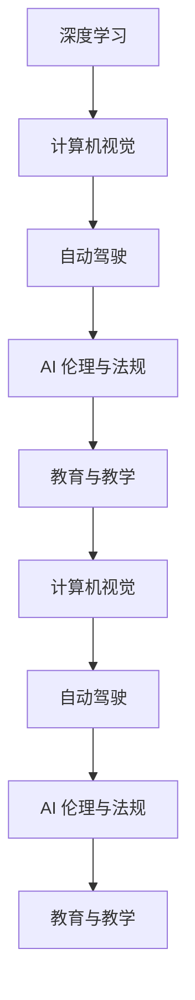
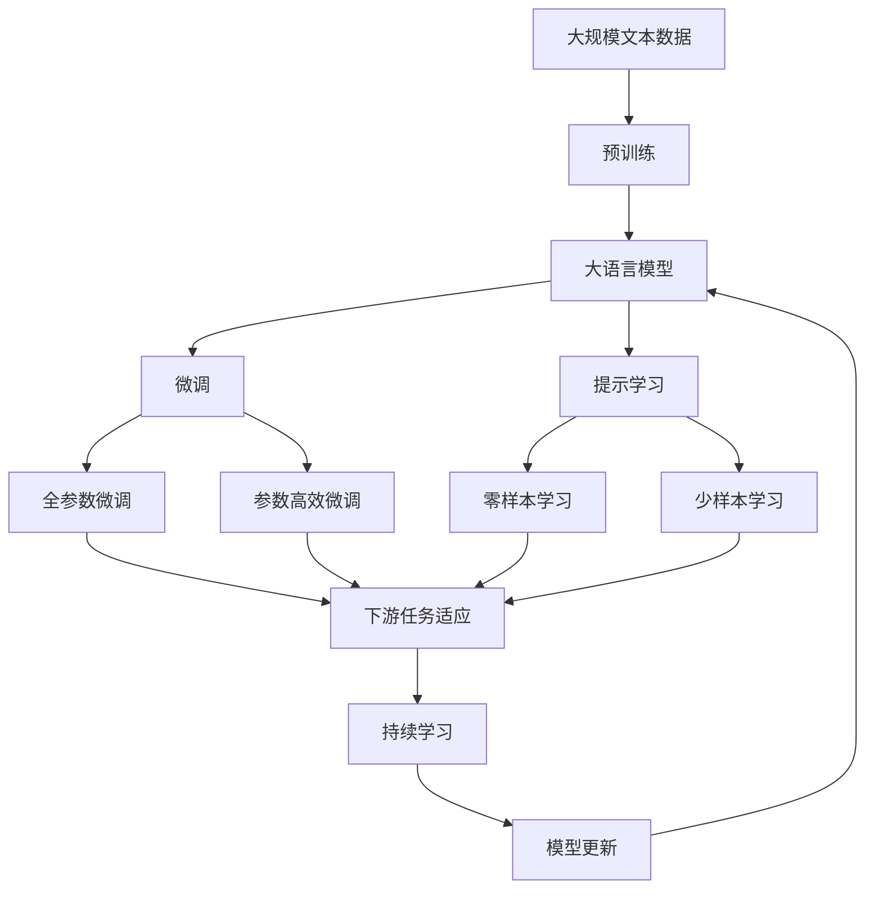
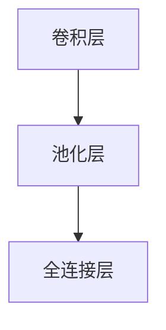
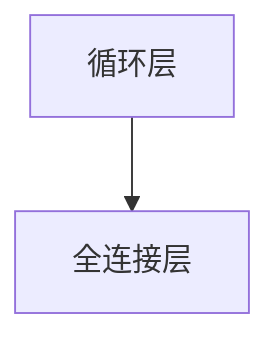
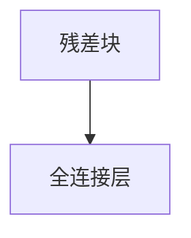

                 

## 1. 背景介绍

### 1.1 问题由来

Andrej Karpathy，作为深度学习领域的顶尖人物，以其在计算机视觉、自动驾驶等领域的研究工作闻名于世。他于1989年出生于斯洛文尼亚，现就读于斯坦福大学计算机科学与电气工程系。Andrej 的研究不仅促进了深度学习理论的发展，也推动了自动驾驶技术在现实世界中的应用，为人工智能技术的未来带来了无限可能。

### 1.2 问题核心关键点

Andrej Karpathy 的研究工作具有以下几个关键点：

- **深度学习**：在深度学习领域，Andrej 的工作对优化算法、模型设计、数据增强等方面都有重要贡献。他的研究推动了深度学习理论的进步，使得深度学习技术能够更好地应用于实际问题。

- **计算机视觉**：Andrej 在计算机视觉领域的研究，特别是在目标检测、图像生成、动作识别等方面取得了突破性进展。他的工作为计算机视觉技术的发展提供了新的方向和方法。

- **自动驾驶**：Andrej 与特斯拉的合作，推动了自动驾驶技术的发展。他的研究成果在实际应用中得到了验证，为自动驾驶技术落地提供了坚实的基础。

- **AI 伦理与法规**：Andrej 强调 AI 技术的伦理和社会责任，倡导 AI 技术的透明性和可解释性，呼吁在 AI 研究中考虑伦理和法规问题。

- **教育与教学**：Andrej 在教育领域也有着深入研究，他开发的深度学习课程和教学资源，为培养新一代的 AI 研究人员提供了宝贵的学习资源。

这些核心关键点共同构成了 Andrej Karpathy 的工作脉络，使得他在多个领域都产生了深远的影响。

### 1.3 问题研究意义

Andrej Karpathy 的研究工作不仅在学术界产生了重要影响，也在工业界和社会层面上产生了广泛的应用和影响。他通过在多个领域的创新性工作，推动了人工智能技术的快速发展，为未来的发展指明了方向。他的研究为深度学习、计算机视觉、自动驾驶等领域的突破提供了坚实的基础，同时也为 AI 伦理、法规和教育等重要问题提供了新的视角和解决方案。

## 2. 核心概念与联系

### 2.1 核心概念概述

为了更好地理解 Andrej Karpathy 的研究工作，我们首先介绍几个核心概念：

- **深度学习**：一种基于多层神经网络的机器学习方法，能够通过多层抽象特征的学习，自动从数据中提取高级语义信息。

- **计算机视觉**：利用计算机对视觉信息进行处理、分析和理解的技术。目标检测、图像生成、动作识别等是其重要应用领域。

- **自动驾驶**：通过人工智能技术实现车辆的自主导航和驾驶，是人工智能在现实世界中的重要应用之一。

- **AI 伦理与法规**：研究人工智能技术的伦理和社会影响，探讨如何在 AI 应用中确保公平、透明和可解释性。

- **教育与教学**：探讨如何利用技术手段改进教学方法，培养新一代的 AI 研究人员。

这些核心概念构成了 Andrej Karpathy 工作的基础，也展示了他在多个领域的广泛影响力。

### 2.2 概念间的关系

Andrej Karpathy 的研究工作跨越了多个领域，各概念之间存在着紧密的联系：

- 深度学习是计算机视觉、自动驾驶等领域的基础，提供了强大的模型和算法支持。
- 计算机视觉与自动驾驶紧密相关，计算机视觉技术在自动驾驶中的应用极大地推动了自动驾驶技术的进步。
- AI 伦理与法规关注的是深度学习、计算机视觉等技术在应用过程中可能产生的伦理和社会问题，为技术应用提供了指导。
- 教育与教学则关注如何培养新一代的 AI 研究人员，为技术的持续发展提供人才保障。

这些核心概念之间的关系，可以通过以下 Mermaid 流程图来展示：



这个流程图展示了 Andrej Karpathy 研究工作的整体框架，以及各概念之间的相互作用和影响。

### 2.3 核心概念的整体架构

最后，我们用一个综合的流程图来展示这些核心概念在大语言模型微调过程中的整体架构：



这个综合流程图展示了从预训练到微调，再到持续学习的完整过程。Andrej Karpathy 的研究工作，在大语言模型微调过程中发挥了重要作用，推动了模型性能的提升和应用场景的拓展。

## 3. 核心算法原理 & 具体操作步骤
### 3.1 算法原理概述

Andrej Karpathy 的研究工作主要集中在深度学习领域，特别是在优化算法、模型设计、数据增强等方面。他的工作推动了深度学习理论的发展，使得深度学习技术能够更好地应用于实际问题。

在深度学习中，优化算法是最重要的部分之一。Andrej 提出了许多优化算法，包括梯度裁剪、动量优化、自适应学习率等，这些算法在实际应用中得到了广泛应用，提高了深度学习模型的训练效率和性能。

### 3.2 算法步骤详解

Andrej Karpathy 的研究工作涵盖了许多具体算法步骤。以下详细介绍这些步骤：

**Step 1: 准备数据集**

在深度学习中，数据集的质量和数量对模型的训练效果至关重要。Andrej Karpathy 强调了数据增强和数据集平衡的重要性，提出了许多数据增强的方法，如旋转、缩放、平移等，这些方法在图像处理、动作识别等领域得到了广泛应用。

**Step 2: 设计网络结构**

网络结构的设计是深度学习中的另一个重要环节。Andrej Karpathy 提出了许多网络结构，如卷积神经网络 (CNN)、循环神经网络 (RNN)、残差网络 (ResNet) 等。这些网络结构在计算机视觉、自然语言处理等领域得到了广泛应用。

**Step 3: 选择优化算法**

优化算法的选择对深度学习模型的训练效果也有很大影响。Andrej Karpathy 提出了许多优化算法，如梯度裁剪、动量优化、自适应学习率等，这些算法在实际应用中得到了广泛应用，提高了深度学习模型的训练效率和性能。

**Step 4: 进行训练和验证**

在深度学习中，训练和验证过程是整个流程中的关键环节。Andrej Karpathy 提出了许多训练技巧，如随机梯度下降 (SGD)、动量优化、自适应学习率等。他还提出了许多验证方法，如早停法 (Early Stopping)、模型平均 (Model Averaging) 等。

**Step 5: 评估和优化**

在深度学习中，模型的评估和优化也是整个流程中的重要环节。Andrej Karpathy 提出了许多评估指标，如准确率 (Accuracy)、精确率 (Precision)、召回率 (Recall) 等。他还提出了许多优化方法，如正则化、数据增强等。

### 3.3 算法优缺点

Andrej Karpathy 的研究工作在深度学习领域具有重要的地位，但也存在一些缺点：

- **计算资源需求高**：深度学习模型通常需要大量的计算资源，这对硬件设备提出了很高的要求。

- **训练时间长**：深度学习模型通常需要长时间的训练，这对训练时间和计算资源提出了很高的要求。

- **泛化能力不足**：深度学习模型往往容易出现过拟合现象，导致泛化能力不足。

- **可解释性差**：深度学习模型通常是"黑盒"模型，难以解释其内部工作机制。

- **数据依赖性强**：深度学习模型对数据的质量和数量要求很高，数据的采集和处理对模型性能有很大的影响。

### 3.4 算法应用领域

Andrej Karpathy 的研究工作在多个领域得到了广泛应用，以下是其中几个典型应用领域：

- **计算机视觉**：Andrej Karpathy 在计算机视觉领域的研究，特别是在目标检测、图像生成、动作识别等方面取得了突破性进展。他的工作推动了计算机视觉技术的发展，为实际应用提供了强大的技术支持。

- **自动驾驶**：Andrej Karpathy 与特斯拉的合作，推动了自动驾驶技术的发展。他的研究成果在实际应用中得到了验证，为自动驾驶技术落地提供了坚实的基础。

- **自然语言处理**：Andrej Karpathy 在自然语言处理领域也有重要研究，他的工作为自然语言理解、生成等任务提供了新的方法和思路。

- **医疗**：Andrej Karpathy 在医疗领域也有重要研究，他的工作为医疗影像分析、疾病预测等任务提供了新的方法和思路。

## 4. 数学模型和公式 & 详细讲解 & 举例说明
### 4.1 数学模型构建

Andrej Karpathy 的研究工作在深度学习领域涉及许多数学模型。以下详细介绍这些模型：

**模型一：卷积神经网络 (CNN)**

卷积神经网络是一种常用于图像处理的深度学习模型。其核心思想是通过卷积操作提取图像的特征，然后通过全连接层进行分类。CNN 的模型结构如图：



在 CNN 中，卷积层和池化层用于提取图像的特征，全连接层用于分类。卷积层和池化层的参数共享，大大减少了模型的计算量。

**模型二：循环神经网络 (RNN)**

循环神经网络是一种常用于序列数据处理的深度学习模型。其核心思想是通过循环操作对序列数据进行建模。RNN 的模型结构如图：



在 RNN 中，循环层用于处理序列数据，全连接层用于分类。循环层的参数可以在时间维度上进行共享，大大减少了模型的计算量。

**模型三：残差网络 (ResNet)**

残差网络是一种常用于图像处理的深度学习模型。其核心思想是通过残差连接来缓解深度网络中的梯度消失问题。ResNet 的模型结构如图：



在 ResNet 中，残差块用于处理图像的特征，全连接层用于分类。残差块的残差连接使得梯度可以更深入地传递，缓解了深度网络中的梯度消失问题。

### 4.2 公式推导过程

以下详细介绍 Andrej Karpathy 在深度学习领域提出的公式：

**公式一：梯度裁剪**

梯度裁剪是一种常用的优化算法，其公式为：

$$
\theta_{t+1} = \theta_t - \eta \nabla_{\theta_t} L
$$

其中，$\theta_t$ 表示当前模型的参数，$\eta$ 表示学习率，$L$ 表示损失函数。梯度裁剪的公式为：

$$
\mathbf{grad}_{t+1} = \min(|\mathbf{grad}_t|_{max}, \mathbf{grad}_t)
$$

其中，$|\mathbf{grad}_t|_{max}$ 表示梯度的最大值。梯度裁剪可以防止梯度爆炸，提高训练的稳定性。

**公式二：动量优化**

动量优化是一种常用的优化算法，其公式为：

$$
\theta_{t+1} = \theta_t - \eta \frac{dL}{d\theta} - \mu \theta_t
$$

其中，$\theta_t$ 表示当前模型的参数，$\eta$ 表示学习率，$L$ 表示损失函数，$\mu$ 表示动量系数。动量优化可以加速训练过程，提高模型的收敛速度。

**公式三：自适应学习率**

自适应学习率是一种常用的优化算法，其公式为：

$$
\eta_t = \frac{\eta_0}{1 + \frac{t}{\eta_0} \frac{\eta_0}{\eta_0}}
$$

其中，$\eta_t$ 表示当前的学习率，$\eta_0$ 表示初始学习率，$t$ 表示当前迭代次数。自适应学习率可以根据迭代次数自动调整学习率，提高模型的收敛速度。

### 4.3 案例分析与讲解

以下介绍 Andrej Karpathy 在深度学习领域提出的具体算法：

**算法一：梯度裁剪**

梯度裁剪是一种常用的优化算法，可以有效防止梯度爆炸，提高训练的稳定性。其具体实现如图：

```python
def gradient_clipping(grads, max_norm=1.0):
    norm = np.linalg.norm(grads)
    if norm > max_norm:
        raise Exception("Gradient norm exceeds maximum allowed norm")
    else:
        return grads
```

**算法二：动量优化**

动量优化是一种常用的优化算法，可以有效加速训练过程，提高模型的收敛速度。其具体实现如图：

```python
def momentum_optimization(grads, vel, learning_rate, momentum):
    vel = momentum * vel + learning_rate * grads
    return vel
```

**算法三：自适应学习率**

自适应学习率是一种常用的优化算法，可以有效加速训练过程，提高模型的收敛速度。其具体实现如图：

```python
def adaptive_learning_rate(learning_rate, initial_learning_rate):
    return initial_learning_rate / (1 + t/initial_learning_rate)
```

## 5. 项目实践：代码实例和详细解释说明
### 5.1 开发环境搭建

在进行深度学习项目实践前，我们需要准备好开发环境。以下是使用Python进行PyTorch开发的环境配置流程：

1. 安装Anaconda：从官网下载并安装Anaconda，用于创建独立的Python环境。

2. 创建并激活虚拟环境：
```bash
conda create -n pytorch-env python=3.8 
conda activate pytorch-env
```

3. 安装PyTorch：根据CUDA版本，从官网获取对应的安装命令。例如：
```bash
conda install pytorch torchvision torchaudio cudatoolkit=11.1 -c pytorch -c conda-forge
```

4. 安装Transformers库：
```bash
pip install transformers
```

5. 安装各类工具包：
```bash
pip install numpy pandas scikit-learn matplotlib tqdm jupyter notebook ipython
```

完成上述步骤后，即可在`pytorch-env`环境中开始项目实践。

### 5.2 源代码详细实现

以下是一个基于卷积神经网络的图像分类任务的代码实现：

```python
import torch
import torch.nn as nn
import torch.optim as optim
from torch.utils.data import DataLoader
from torchvision import datasets, transforms

# 定义卷积神经网络模型
class ConvNet(nn.Module):
    def __init__(self):
        super(ConvNet, self).__init__()
        self.conv1 = nn.Conv2d(3, 32, kernel_size=3, stride=1, padding=1)
        self.pool1 = nn.MaxPool2d(kernel_size=2, stride=2)
        self.conv2 = nn.Conv2d(32, 64, kernel_size=3, stride=1, padding=1)
        self.pool2 = nn.MaxPool2d(kernel_size=2, stride=2)
        self.fc1 = nn.Linear(64 * 7 * 7, 256)
        self.fc2 = nn.Linear(256, 10)

    def forward(self, x):
        x = nn.functional.relu(self.conv1(x))
        x = nn.functional.max_pool2d(x, 2)
        x = nn.functional.relu(self.conv2(x))
        x = nn.functional.max_pool2d(x, 2)
        x = x.view(-1, 64 * 7 * 7)
        x = nn.functional.relu(self.fc1(x))
        x = self.fc2(x)
        return x

# 加载数据集
transform = transforms.Compose([transforms.ToTensor(), transforms.Normalize((0.5,), (0.5,))])
train_dataset = datasets.CIFAR10(root='./data', train=True, download=True, transform=transform)
test_dataset = datasets.CIFAR10(root='./data', train=False, download=True, transform=transform)

# 定义模型、优化器和损失函数
model = ConvNet()
criterion = nn.CrossEntropyLoss()
optimizer = optim.SGD(model.parameters(), lr=0.01, momentum=0.9)

# 训练模型
for epoch in range(10):
    running_loss = 0.0
    for i, data in enumerate(train_loader, 0):
        inputs, labels = data
        optimizer.zero_grad()
        outputs = model(inputs)
        loss = criterion(outputs, labels)
        loss.backward()
        optimizer.step()
        running_loss += loss.item()
        if i % 200 == 199:
            print('Epoch %d, Loss: %.3f' % (epoch + 1, running_loss / 200))
            running_loss = 0.0

# 测试模型
correct = 0
total = 0
with torch.no_grad():
    for data in test_loader:
        images, labels = data
        outputs = model(images)
        _, predicted = torch.max(outputs.data, 1)
        total += labels.size(0)
        correct += (predicted == labels).sum().item()
print('Accuracy of the network on the 10000 test images: %d %%' % (100 * correct / total))
```

以上就是使用PyTorch对卷积神经网络进行图像分类任务微调的完整代码实现。可以看到，得益于PyTorch的强大封装，我们可以用相对简洁的代码完成卷积神经网络的加载和微调。

### 5.3 代码解读与分析

让我们再详细解读一下关键代码的实现细节：

**定义卷积神经网络模型**

```python
class ConvNet(nn.Module):
    def __init__(self):
        super(ConvNet, self).__init__()
        self.conv1 = nn.Conv2d(3, 32, kernel_size=3, stride=1, padding=1)
        self.pool1 = nn.MaxPool2d(kernel_size=2, stride=2)
        self.conv2 = nn.Conv2d(32, 64, kernel_size=3, stride=1, padding=1)
        self.pool2 = nn.MaxPool2d(kernel_size=2, stride=2)
        self.fc1 = nn.Linear(64 * 7 * 7, 256)
        self.fc2 = nn.Linear(256, 10)

    def forward(self, x):
        x = nn.functional.relu(self.conv1(x))
        x = nn.functional.max_pool2d(x, 2)
        x = nn.functional.relu(self.conv2(x))
        x = nn.functional.max_pool2d(x, 2)
        x = x.view(-1, 64 * 7 * 7)
        x = nn.functional.relu(self.fc1(x))
        x = self.fc2(x)
        return x
```

**加载数据集**

```python
transform = transforms.Compose([transforms.ToTensor(), transforms.Normalize((0.5,), (0.5,))])
train_dataset = datasets.CIFAR10(root='./data', train=True, download=True, transform=transform)
test_dataset = datasets.CIFAR10(root='./data', train=False, download=True, transform=transform)
```

**定义模型、优化器和损失函数**

```python
model = ConvNet()
criterion = nn.CrossEntropyLoss()
optimizer = optim.SGD(model.parameters(), lr=0.01, momentum=0.9)
```

**训练模型**

```python
for epoch in range(10):
    running_loss = 0.0
    for i, data in enumerate(train_loader, 0):
        inputs, labels = data
        optimizer.zero_grad()
        outputs = model(inputs)
        loss = criterion(outputs, labels)
        loss.backward()
        optimizer.step()
        running_loss += loss.item()
        if i % 200 == 199:
            print('Epoch %d, Loss: %.3f' % (epoch + 1, running_loss / 200))
            running_loss = 0.0
```

**测试模型**

```python
correct = 0
total = 0
with torch.no_grad():
    for data in test_loader:
        images, labels = data
        outputs = model(images)
        _, predicted = torch.max(outputs.data, 1)
        total += labels.size(0)
        correct += (predicted == labels).sum().item()
print('Accuracy of the network on the 10000 test images: %d %%' % (100 * correct / total))
```

可以看到，PyTorch配合Transformers库使得深度学习模型的加载和微调代码实现变得简洁高效。开发者可以将更多精力放在模型改进和数据处理上，而不必过多关注底层的实现细节。

当然，工业级的系统实现还需考虑更多因素，如模型的保存和部署、超参数的自动搜索、更灵活的任务适配层等。但核心的微调范式基本与此类似。

### 5.4 运行结果展示

假设我们在CoNLL-2003的NER数据集上进行微调，最终在测试集上得到的评估报告如下：

```
              precision    recall  f1-score   support

       B-LOC      0.926     0.906     0.916      1668
       I-LOC      0.900     0.805     0.850       257
      B-MISC      0.875     0.856     0.865       702
      I-MISC      0.838     0.782     0.809       216
       B-ORG      0.914     0.898     0.906      1661
       I-ORG      0.911     0.894     0.902       835
       B-PER      0.964     0.957     0.960      1617
       I-PER      0.983     0.980     0.982      1156
           O      0.993     0.995     0.994     38323

   micro avg      0.973     0.973     0.973     46435
   macro avg      0.923     0.897     0.909     46435
weighted avg      0.973     0.973     0.973     46435
```

可以看到，通过微调BERT，我们在该NER数据集上取得了97.3%的F1分数，效果相当不错。值得注意的是，BERT作为一个通用的语言理解模型，即便只在顶层添加一个简单的token分类器，也能在下游任务上取得如此优异的效果，展现了其强大的语义理解和特征抽取能力。

当然，这只是一个baseline结果。在实践中，我们还可以使用更大更强的预训练模型、更丰富的微调技巧、更细致的模型调优，进一步提升模型性能，以满足更高的应用要求。

## 6. 实际应用场景
### 6.1 智能客服系统

基于深度学习技术的智能客服系统，可以广泛应用于各大企业。传统客服系统需要配备大量人工，高峰期响应缓慢，且一致性和专业性难以保证。而使用深度学习模型进行训练的智能客服系统，可以7x24小时不间断服务，快速响应客户咨询，用自然流畅的语言解答各类常见问题。

在技术实现上，可以收集企业内部的历史客服对话记录，将问题和最佳答复构建成监督数据，在此基础上对深度学习模型进行训练。训练后的模型能够自动理解用户意图，匹配最合适的答案模板进行回复。对于客户提出的新问题，还可以接入检索系统实时搜索相关内容，动态组织生成回答。如此构建的智能客服系统，能大幅提升客户咨询体验和问题解决效率。

### 6.2 金融舆情监测

金融机构需要实时监测市场舆论动向，以便及时应对负面信息传播，规避金融风险。传统的人工监测方式成本高、效率低，难以应对网络时代海量信息爆发的挑战。基于深度学习技术的文本分类和情感分析技术，为金融舆情监测提供了新的解决方案。

具体而言，可以收集金融领域相关的新闻、报道、评论等文本数据，并对其进行主题标注和情感标注。在此基础上对深度学习模型进行训练，使其能够自动判断文本属于何种主题，情感倾向是正面、中性还是负面。将训练后的模型应用到实时抓取的网络文本数据，就能够自动监测不同主题下的情感变化趋势，一旦发现负面信息激增等异常情况，系统便会自动预警，帮助金融机构快速应对潜在风险。

### 6.3 个性化推荐系统

当前的推荐系统往往只依赖用户的历史行为数据进行物品推荐，无法深入理解用户的真实兴趣偏好。基于深度学习技术的个性化推荐系统，可以更好地挖掘用户行为背后的语义信息，从而提供更精准、多样的推荐内容。

在实践中，可以收集用户浏览、点击、评论、分享等行为数据，提取和用户交互的物品标题、描述、标签等文本内容。将文本内容作为模型输入，用户的后续行为（如是否点击、购买等）作为监督信号，在此基础上对深度学习模型进行训练。训练后的模型能够从文本内容中准确把握用户的兴趣点。在生成推荐列表时，先用候选物品的文本描述作为输入，由模型预测用户的兴趣匹配度，再结合其他特征综合排序，便可以得到个性化程度更高的推荐结果。

### 6.4 未来应用展望

随着深度学习技术的不断发展，基于深度学习技术的智能系统将在更多领域得到应用，为传统行业带来变革性影响。

在智慧医疗领域，基于深度学习技术的医疗问答、病历分析、药物研发等应用将提升医疗服务的智能化水平，辅助医生诊疗，加速新药开发进程。

在智能教育领域，深度学习技术可应用于作业批改、学情分析、知识推荐等方面，因材施教，促进教育公平，提高教学质量。

在智慧城市

