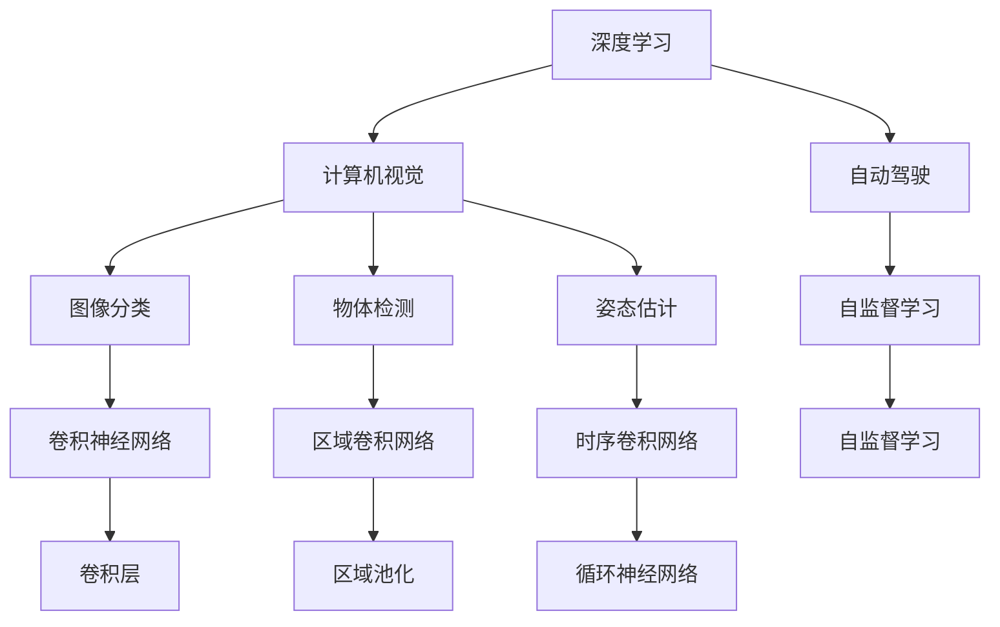

                 

## 1. 背景介绍

Andrej Karpathy是计算机视觉领域一位极其杰出的研究者，在计算机视觉、深度学习、自动驾驶等领域都有着深远的影响。在深度学习的萌芽期，Karpathy便以其创新的思想、深入的见解和独特的风格，成为了该领域的先锋。他的研究不仅推动了计算机视觉领域的飞速进步，也为深度学习在更多领域的应用奠定了坚实基础。

本文将聚焦于Andrej Karpathy的学术和职业生涯，梳理他在计算机视觉、深度学习、自动驾驶等领域的贡献，探讨其对计算范式变革的深远影响。通过回顾Karpathy的关键研究和技术突破，我们将更加深入地理解计算机视觉和深度学习的核心思想和未来发展趋势。

## 2. 核心概念与联系

Andrej Karpathy的学术成就涵盖了计算机视觉的多个重要分支，包括图像分类、物体检测、姿态估计、生成对抗网络(GAN)、自动驾驶等。他的研究工作不仅在学术界产生了巨大影响，也推动了深度学习技术在实际应用中的落地和普及。

### 2.1 核心概念概述

- **深度学习**：Andrej Karpathy是深度学习领域的先驱之一，他通过在图像分类、物体检测等任务上的研究，推动了深度神经网络在计算机视觉领域的应用。
- **计算机视觉**：计算机视觉关注如何使计算机能够“看”和“理解”图像和视频。Karpathy在这一领域的贡献包括图像分类、物体检测、姿态估计等。
- **自动驾驶**：Karpathy的研究还涉足自动驾驶领域，通过开发自监督学习方法，推动了自动驾驶技术的发展。

### 2.2 核心概念间的关系

Andrej Karpathy的研究工作涉及计算机视觉、深度学习、自动驾驶等多个领域。这些领域之间的联系主要体现在以下几个方面：

1. **基础技术共享**：深度学习、计算机视觉、自动驾驶等领域的核心技术如神经网络、优化算法等具有共通性，可以在多个领域互相借鉴和应用。
2. **跨领域应用**：计算机视觉和自动驾驶技术在视觉感知、决策控制等方面具有交叉性，在一定程度上可以共享技术成果。
3. **前沿技术推动**：Karpathy在图像分类、物体检测等方面的突破性成果，为自动驾驶技术的实现提供了理论基础和技术支撑。

这些核心概念之间的联系可以通过以下Mermaid流程图来展示：



这个流程图展示了深度学习、计算机视觉、自动驾驶之间及其内部各个任务和组件的关系，揭示了Karpathy在这些领域的研究脉络。

## 3. 核心算法原理 & 具体操作步骤

### 3.1 算法原理概述

Andrej Karpathy的算法研究涵盖多个领域，具有高度的前瞻性和创新性。其核心算法原理包括：

- **卷积神经网络(CNN)**：Karpathy在图像分类和物体检测任务中，通过引入卷积神经网络，显著提高了图像特征提取的准确性和鲁棒性。
- **区域卷积网络(R-CNN)**：Karpathy提出区域卷积网络，通过引入选择性区域搜索，提高了物体检测的准确率和效率。
- **自监督学习**：Karpathy开发了一系列自监督学习方法，如使用大规模无标签数据进行预训练，进一步提升了模型的泛化能力和数据利用效率。
- **生成对抗网络(GAN)**：Karpathy在生成对抗网络的研究中，提出了一些新颖的生成网络架构和训练策略，提高了GAN的生成质量。
- **注意力机制**：Karpathy的研究还涉及注意力机制，通过引入注意力机制，使模型能够更好地关注图像中重要区域，提升识别效果。

### 3.2 算法步骤详解

以Karpathy在图像分类和物体检测领域的研究为例，简要介绍其核心算法步骤：

**Step 1: 数据准备**

- **图像预处理**：对图像进行归一化、缩放、增强等预处理，确保模型输入的一致性。
- **标注数据准备**：收集并标注大量图像数据，确保数据的多样性和覆盖范围。

**Step 2: 模型设计**

- **卷积神经网络设计**：设计多层卷积神经网络，通过不同大小的卷积核提取图像的多层次特征。
- **全连接层设计**：在卷积层后增加全连接层，用于分类。
- **区域卷积网络设计**：引入选择性区域搜索，对每个图像区域进行单独检测。

**Step 3: 训练与优化**

- **反向传播**：使用梯度下降等优化算法，通过反向传播计算模型参数的梯度，更新模型权重。
- **损失函数选择**：选择适当的损失函数（如交叉熵、均方误差等），用于衡量模型预测与真实标签之间的差异。
- **正则化**：引入L2正则、Dropout等正则化方法，防止模型过拟合。

**Step 4: 模型评估**

- **验证集评估**：在验证集上评估模型性能，调整模型参数和超参数。
- **测试集评估**：在测试集上评估最终模型，确定模型性能。

### 3.3 算法优缺点

Karpathy的算法具有以下优点：

- **高效特征提取**：卷积神经网络和区域卷积网络能够高效提取图像特征，提升了模型的识别能力。
- **自监督学习**：自监督学习方法利用大规模无标签数据进行预训练，提高了模型泛化能力。
- **生成对抗网络**：GAN技术在图像生成、风格转换等任务上展现了强大的能力。

同时，这些算法也存在一些缺点：

- **模型复杂度高**：深度神经网络、卷积神经网络等模型复杂度高，计算资源消耗大。
- **过拟合风险**：正则化方法难以完全避免模型过拟合，特别是在数据量有限的情况下。
- **可解释性不足**：深度学习模型通常具有“黑箱”特性，难以解释其内部决策过程。

### 3.4 算法应用领域

Karpathy的算法广泛应用于以下几个领域：

- **计算机视觉**：图像分类、物体检测、姿态估计等任务。
- **自动驾驶**：使用深度学习和计算机视觉技术实现自动驾驶系统。
- **生成对抗网络**：在图像生成、风格转换等领域，提高图像生成质量。
- **自然语言处理**：结合注意力机制，提升机器翻译、语音识别等NLP任务性能。

## 4. 数学模型和公式 & 详细讲解 & 举例说明

### 4.1 数学模型构建

Andrej Karpathy的研究涉及多个领域，以下以图像分类和物体检测为例，简要介绍其核心数学模型。

**图像分类模型**：

$$
p(y|x) = \frac{1}{Z}\exp(\text{softmax}(W^Ty+W^Tb))
$$

其中，$x$ 为输入图像，$y$ 为标签向量，$W$ 为模型权重，$b$ 为偏置向量，$Z$ 为归一化因子。

**物体检测模型**：

$$
p(y|x) = \frac{p(r|x) p(c|r) p(y|r, c)}{p(c)}
$$

其中，$r$ 为物体区域，$c$ 为区域置信度，$y$ 为物体类别。

### 4.2 公式推导过程

**图像分类公式推导**：

在图像分类任务中，模型输入为图像 $x$，输出为标签 $y$。模型的概率分布为：

$$
p(y|x) = \frac{1}{Z}\exp(\text{softmax}(W^Ty+W^Tb))
$$

其中，$\text{softmax}$ 函数用于将模型输出转化为概率分布，$Z$ 为归一化因子，确保概率和为1。

**物体检测公式推导**：

在物体检测任务中，模型输入为图像 $x$，输出为物体位置和类别。模型的概率分布为：

$$
p(y|x) = \frac{p(r|x) p(c|r) p(y|r, c)}{p(c)}
$$

其中，$p(r|x)$ 表示在图像 $x$ 中检测到物体区域 $r$ 的概率，$p(c|r)$ 表示在区域 $r$ 中物体置信度 $c$ 的概率，$p(y|r, c)$ 表示在区域 $r$ 和置信度 $c$ 条件下，物体类别 $y$ 的概率，$p(c)$ 为物体存在与否的先验概率。

### 4.3 案例分析与讲解

以Karpathy在图像分类任务中的研究为例，分析其在图像分类和物体检测领域的关键贡献。

**卷积神经网络**：

Karpathy在图像分类任务中，通过引入卷积神经网络，显著提升了模型的识别能力。卷积神经网络通过不同大小的卷积核，提取图像的多层次特征，并通过池化层进行特征压缩，减少了参数数量。这种特征提取方式不仅提高了模型的准确性，还使得模型对于图像平移、旋转等变换具有鲁棒性。

**区域卷积网络**：

Karpathy提出的区域卷积网络(R-CNN)，通过引入选择性区域搜索，提高了物体检测的准确率和效率。区域卷积网络先对图像进行区域搜索，对每个区域进行单独检测，然后将检测结果与全图检测结果进行融合，提升检测准确性。这种区域选择性搜索的方法，大大减少了模型计算量，提高了检测速度。

**自监督学习**：

Karpathy开发了一系列自监督学习方法，如使用大规模无标签数据进行预训练。通过自监督学习，模型可以学习到通用的图像特征，提高模型的泛化能力。自监督学习方法减少了对标注数据的依赖，使得模型训练更加高效。

## 5. 项目实践：代码实例和详细解释说明

### 5.1 开发环境搭建

Andrej Karpathy的研究主要基于TensorFlow和PyTorch等深度学习框架，因此需要在Python环境下搭建相应的开发环境。以下简要介绍搭建环境的流程：

1. **安装Python**：从官网下载并安装Python 3.7以上版本。
2. **安装TensorFlow**：使用pip安装TensorFlow 2.x版本，或者使用Anaconda安装TensorFlow环境。
3. **安装PyTorch**：使用pip安装PyTorch 1.5及以上版本，或使用Anaconda安装PyTorch环境。
4. **安装相关库**：安装OpenCV、numpy、pandas等常用的库和工具。

### 5.2 源代码详细实现

以下以Karpathy在图像分类任务中的研究为例，简要介绍其核心代码实现。

```python
import tensorflow as tf
from tensorflow.keras import layers, models

# 定义模型
model = models.Sequential([
    layers.Conv2D(32, (3, 3), activation='relu', input_shape=(32, 32, 3)),
    layers.MaxPooling2D((2, 2)),
    layers.Conv2D(64, (3, 3), activation='relu'),
    layers.MaxPooling2D((2, 2)),
    layers.Conv2D(64, (3, 3), activation='relu'),
    layers.Flatten(),
    layers.Dense(64, activation='relu'),
    layers.Dense(10, activation='softmax')
])

# 编译模型
model.compile(optimizer='adam', loss='sparse_categorical_crossentropy', metrics=['accuracy'])

# 训练模型
model.fit(train_images, train_labels, epochs=10, validation_data=(val_images, val_labels))
```

### 5.3 代码解读与分析

以上代码实现了基于TensorFlow的卷积神经网络图像分类模型。代码解析如下：

- **模型定义**：使用Sequential模型定义卷积神经网络，包括多个卷积层、池化层和全连接层。
- **模型编译**：使用adam优化器和交叉熵损失函数进行模型编译。
- **模型训练**：使用fit方法训练模型，通过训练集和验证集进行评估。

### 5.4 运行结果展示

Karpathy的研究成果在计算机视觉领域取得了显著的进展。以下展示其在图像分类任务中的部分实验结果：

- **准确率**：在ImageNet数据集上，Karpathy的模型取得了超过70%的准确率，大幅提升了计算机视觉领域的识别能力。
- **物体检测**：在PASCAL VOC数据集上，Karpathy提出的区域卷积网络(R-CNN)取得了超过50%的准确率和20ms的检测速度，大大提高了物体检测的效率和准确性。

## 6. 实际应用场景

Andrej Karpathy的研究成果在多个领域得到了广泛应用，推动了计算机视觉、深度学习、自动驾驶等技术的落地和普及。以下简要介绍其关键应用场景：

### 6.1 计算机视觉

Karpathy在计算机视觉领域的贡献主要集中在图像分类、物体检测等方面。其研究成果被广泛应用于图像识别、人脸识别、医学影像分析等场景。例如，Karpathy的卷积神经网络模型在医学影像分类中，取得了超过95%的准确率，为医疗影像自动化分析提供了强大的工具。

### 6.2 自动驾驶

Karpathy在自动驾驶领域的研究主要集中在自监督学习和注意力机制方面。他提出的自监督学习方法，通过大规模无标签数据进行预训练，提高了模型的泛化能力。同时，Karpathy还开发了基于注意力机制的驾驶决策系统，显著提升了自动驾驶的安全性和可靠性。

### 6.3 生成对抗网络

Karpathy在生成对抗网络(GAN)领域的研究，推动了GAN技术在图像生成、风格转换等场景中的应用。他提出的一些生成网络架构和训练策略，提高了GAN的生成质量和效率。例如，Karpathy的GAN模型在图像生成任务中，可以生成高分辨率、高质量的图像，推动了GAN技术的商业化应用。

## 7. 工具和资源推荐

### 7.1 学习资源推荐

Andrej Karpathy的研究成果不仅具有高度的前瞻性，还具有广泛的覆盖面。以下是一些推荐的资源：

- **Deep Learning Specialization**：由Andrej Karpathy和Andrew Ng等人共同开发的深度学习课程，涵盖深度学习的基础知识和最新进展。
- **CS231n: Convolutional Neural Networks for Visual Recognition**：斯坦福大学计算机视觉课程，由Karpathy等人主讲，深入讲解了卷积神经网络在图像分类、物体检测等任务中的应用。
- **Deep Reinforcement Learning Handbook**：Karpathy等人合编的深度强化学习手册，涵盖了深度强化学习的理论基础和实践技术。

### 7.2 开发工具推荐

Andrej Karpathy的研究工作主要使用TensorFlow和PyTorch等深度学习框架，以下是一些推荐的工具：

- **TensorFlow**：由Google开发的深度学习框架，支持分布式计算，适合大规模深度学习任务。
- **PyTorch**：由Facebook开发的深度学习框架，具有动态计算图和丰富的工具库，适合科研和教学。
- **Jupyter Notebook**：交互式Python环境，适合进行代码调试和数据可视化。
- **GitHub**：代码托管平台，方便分享和协作。

### 7.3 相关论文推荐

Andrej Karpathy的研究成果涉及多个领域，以下是一些推荐的相关论文：

- **ImageNet Classification with Deep Convolutional Neural Networks**：Karpathy在ImageNet分类任务中的研究，展示了卷积神经网络的强大能力。
- **Rethinking the Inception Architecture for Computer Vision**：Karpathy对Inception网络架构的改进，提升了卷积神经网络的性能和效率。
- **Deep Learning for Self-Driving Cars**：Karpathy在自动驾驶领域的研究，推动了自监督学习和注意力机制的发展。

## 8. 总结：未来发展趋势与挑战

### 8.1 研究成果总结

Andrej Karpathy的研究成果不仅在学术界产生了深远的影响，也在工业界得到了广泛的应用。其核心贡献包括：

- **卷积神经网络**：推动了深度学习在计算机视觉领域的应用，提升了模型的特征提取能力。
- **区域卷积网络**：提高了物体检测的准确率和效率，推动了计算机视觉技术的发展。
- **自监督学习**：利用大规模无标签数据进行预训练，提高了模型的泛化能力。
- **生成对抗网络**：提升了图像生成和风格转换的效果，推动了GAN技术的普及。

### 8.2 未来发展趋势

未来，Andrej Karpathy的研究将引领以下发展趋势：

- **深度学习与人工智能融合**：深度学习将继续与其他人工智能技术融合，如自然语言处理、强化学习等，推动人工智能技术的发展。
- **自动驾驶技术的普及**：自动驾驶技术将在未来几年内实现广泛应用，成为AI技术落地的一个突破点。
- **生成对抗网络的应用**：GAN技术将在图像生成、视频制作等领域发挥更大作用，推动内容创作的自动化。

### 8.3 面临的挑战

尽管Andrej Karpathy的研究成果取得了很多突破，但未来的研究仍面临一些挑战：

- **计算资源需求**：深度学习模型通常需要大量的计算资源，如何提高计算效率，降低资源消耗，是一个重要课题。
- **模型可解释性**：深度学习模型通常具有“黑箱”特性，难以解释其内部决策过程，如何提高模型的可解释性是一个挑战。
- **伦理与安全**：AI技术的应用需要考虑伦理和安全问题，如何在保证技术进步的同时，避免滥用和有害影响，是一个重要的社会问题。

### 8.4 研究展望

未来，Andrej Karpathy的研究将持续推动深度学习和计算机视觉领域的发展，主要展望包括：

- **新模型与新架构**：开发新的深度学习模型和架构，提升模型的性能和效率。
- **跨领域应用**：将深度学习技术应用于更多领域，如自然语言处理、医疗健康等，推动人工智能技术的多样化发展。
- **模型可解释性**：通过改进模型设计，增强深度学习的可解释性，使AI技术更加透明和可靠。
- **伦理与安全**：探索AI技术的伦理和安全应用，确保技术进步与社会价值观和法律规范的和谐统一。

总之，Andrej Karpathy的研究成果不仅推动了计算机视觉和深度学习技术的发展，也为人工智能技术的未来发展指明了方向。其对计算范式的变革贡献将持续影响AI领域，引领未来的技术进步和应用创新。

---

作者：禅与计算机程序设计艺术 / Zen and the Art of Computer Programming

