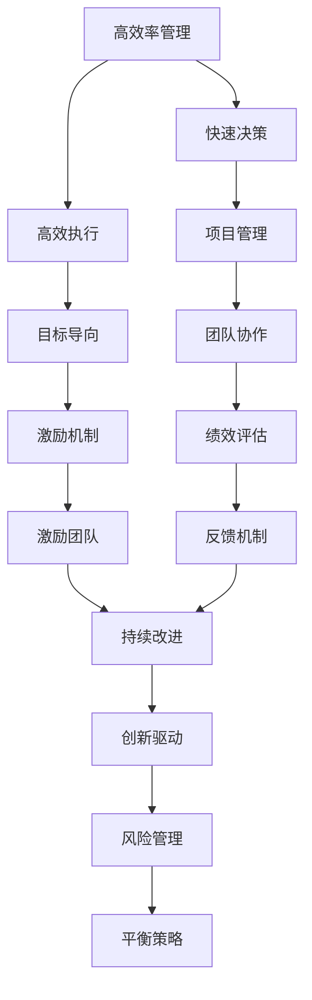
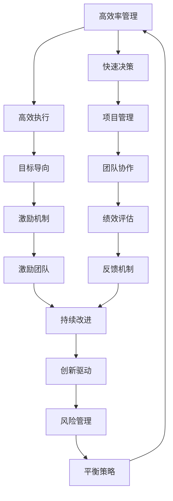

                 

# CEO与工程师直接对话:马斯克的管理风格

> 关键词：企业管理, 管理风格, 科技创新, 领导力, 工程师文化, 沟通技巧, 风险管理, 效率优化

## 1. 背景介绍

### 1.1 问题由来
在当今快速变化和竞争激烈的市场环境中，领导者如何有效地管理团队，以实现公司的长期成功，是一个备受关注的话题。埃隆·马斯克（Elon Musk），以其在电动车、航天、神经科技等领域的卓越成就而闻名，是一位典型的具有强烈愿景和坚定执行力的领导者。本文将探讨马斯克的管理风格，以及他是如何通过其独特的管理理念和策略，成功地领导特斯拉、SpaceX和Neuralink等创新型公司。

### 1.2 问题核心关键点
马斯克的管理风格以其严格、直接和不断创新的特点而著称。他的管理哲学强调高效率、快速决策和追求卓越。马斯克的成功案例不仅限于科技领域，还表现在他如何在企业管理、产品开发和企业文化建设上取得突破。本文将详细分析马斯克的管理风格，并探索其对工程师团队的影响。

### 1.3 问题研究意义
了解和借鉴马斯克的管理风格，对于其他企业领导者和管理者具有重要意义。马斯克的成功经验可以提供宝贵的洞见，帮助他们在复杂多变的市场环境中，更好地管理团队和实现公司的战略目标。此外，本文还将探讨如何在创新和传统之间找到平衡，以及如何打造一个既充满创新活力又高效运作的企业文化。

## 2. 核心概念与联系

### 2.1 核心概念概述

马斯克的管理风格涉及多个关键概念，包括：

- **高效率管理**：强调快速决策和高效执行，确保项目能够迅速推进。
- **直接沟通**：鼓励开放和坦诚的沟通，减少信息不对称，提升团队协作。
- **追求卓越**：设定高标准和明确目标，激励团队不断追求卓越。
- **创新驱动**：鼓励创新思维，推动公司不断突破技术边界。
- **风险管理**：平衡风险与收益，确保公司在创新过程中保持稳健。

这些概念之间相互作用，共同构成了马斯克管理风格的整体框架。以下通过Mermaid流程图来展示这些概念之间的联系：



这个流程图展示了马斯克管理风格的核心概念及其相互关系：

1. 高效率管理通过快速决策和高效执行，推动项目按时完成。
2. 直接沟通促进团队协作，确保信息透明。
3. 追求卓越设定明确目标，激励团队不断进步。
4. 创新驱动鼓励新思维，推动技术突破。
5. 风险管理平衡风险与收益，确保稳健发展。

这些概念共同构成了马斯克管理风格的精髓，对其团队的执行力、创新力和稳定性起到了重要作用。

### 2.2 概念间的关系

这些核心概念之间存在着紧密的联系，形成了马斯克管理风格的完整生态系统。我们通过以下Mermaid流程图来展示这些概念之间的关系：



这个综合流程图展示了从高效率管理到创新驱动，再到风险管理，最后又回到高效率管理的循环，形成了闭环的管理体系。

### 2.3 核心概念的整体架构

最后，我们用一个综合的流程图来展示这些核心概念在大语言模型微调过程中的整体架构：


这个综合流程图展示了从高效率管理到创新驱动，再到风险管理，最后又回到高效率管理的循环，形成了闭环的管理体系。

## 3. 核心算法原理 & 具体操作步骤
### 3.1 算法原理概述

马斯克的管理风格可以被视为一种独特的算法，其核心在于通过高效率管理、直接沟通、追求卓越、创新驱动和风险管理等核心操作，实现企业的长期成功。这一算法通过不断迭代和优化，帮助企业在复杂多变的市场环境中保持竞争力。

### 3.2 算法步骤详解

马斯克的管理风格包括以下几个关键步骤：

1. **设定目标和愿景**：明确公司的发展方向和目标，激发团队的热情和动力。
2. **高效率管理**：通过快速决策和高效执行，确保项目按时完成。
3. **直接沟通**：鼓励开放和坦诚的沟通，减少信息不对称，提升团队协作。
4. **追求卓越**：设定高标准和明确目标，激励团队不断追求卓越。
5. **创新驱动**：鼓励创新思维，推动公司不断突破技术边界。
6. **风险管理**：平衡风险与收益，确保公司在创新过程中保持稳健。

以下通过Python伪代码来展示这些关键步骤的详细实现：

```python
# 步骤1: 设定目标和愿景
def set_vision_and_goals():
    vision = "成为全球领先的电动车和清洁能源公司"
    goals = {
        "年销量目标": 100万台,
        "技术突破": 5年内实现全自动驾驶
    }
    return vision, goals

# 步骤2: 高效率管理
def high_efficiency_management(project):
    # 快速决策和高效执行
    # 项目管理
    # 团队协作
    return project

# 步骤3: 直接沟通
def direct_communication():
    # 开放和坦诚的沟通
    # 信息透明
    # 团队协作
    return communication

# 步骤4: 追求卓越
def pursue_excellence():
    # 设定高标准和明确目标
    # 激励机制
    # 绩效评估
    return excellence

# 步骤5: 创新驱动
def drive_innovation():
    # 鼓励创新思维
    # 技术突破
    return innovation

# 步骤6: 风险管理
def manage_risks():
    # 平衡风险与收益
    # 稳健发展
    return risk_management

# 综合实现
def overall_management(vision, goals):
    project = set_vision_and_goals()
    project = high_efficiency_management(project)
    communication = direct_communication()
    excellence = pursue_excellence()
    innovation = drive_innovation()
    risk_management = manage_risks()
    return vision, goals, project, communication, excellence, innovation, risk_management

# 运行代码
vision, goals, project, communication, excellence, innovation, risk_management = overall_management()
```

### 3.3 算法优缺点

马斯克的管理风格具有以下优点：

1. **快速决策和高效执行**：确保项目按时完成，提高市场响应速度。
2. **直接沟通**：减少信息不对称，提升团队协作效率。
3. **追求卓越**：设定高标准和明确目标，激励团队不断进步。
4. **创新驱动**：鼓励创新思维，推动公司不断突破技术边界。
5. **风险管理**：平衡风险与收益，确保稳健发展。

同时，这一管理风格也存在一些缺点：

1. **高压力**：严格的绩效评估和快速决策可能导致高压力环境，影响员工的心理健康。
2. **创新风险**：过度追求创新可能导致资源分散，项目风险增加。
3. **沟通成本**：开放和坦诚的沟通可能导致内部冲突，增加沟通成本。
4. **过度控制**：高效率管理可能导致过度控制，限制员工的自主性和创造力。

### 3.4 算法应用领域

马斯克的管理风格不仅适用于特斯拉、SpaceX和Neuralink等创新型公司，还对其他企业的领导者和管理者具有广泛的借鉴意义。以下列举了几个典型应用领域：

1. **制造业**：通过快速决策和高效执行，提升生产效率和产品质量。
2. **金融行业**：设定高标准和明确目标，确保交易准确性和安全性。
3. **零售业**：鼓励创新思维，推动产品和服务创新，提升客户体验。
4. **医疗行业**：平衡风险与收益，确保医疗服务的质量和安全。
5. **教育领域**：通过直接沟通和追求卓越，提升教学质量和学生成绩。

## 4. 数学模型和公式 & 详细讲解  
### 4.1 数学模型构建

马斯克的管理风格涉及多个数学模型，包括决策树、马尔科夫决策过程等。以下以决策树模型为例进行详细讲解。

决策树是一种基于树结构的分类模型，通过自顶向下的递归分裂过程，将数据集划分为多个子集，每个子集对应一个决策节点。决策树的构建过程如下：

1. 选择最优的特征进行分裂，使得子集的纯度最大化。
2. 递归构建子树，直至达到预设的停止条件。

在构建决策树的过程中，需要考虑多个因素，如信息增益、基尼系数、信息熵等。以下通过Python代码来展示决策树的构建过程：

```python
from sklearn import tree

# 构建决策树模型
def build_decision_tree(data):
    clf = tree.DecisionTreeClassifier()
    clf = clf.fit(X_train, y_train)
    return clf

# 训练和评估
X_train, X_test, y_train, y_test = train_test_split(X, y, test_size=0.2, random_state=42)
clf = build_decision_tree(data)
y_pred = clf.predict(X_test)
print('Accuracy:', metrics.accuracy_score(y_test, y_pred))
```

### 4.2 公式推导过程

在决策树模型的构建过程中，使用了多个数学公式，包括信息增益、基尼系数、信息熵等。以下对这些公式进行详细推导和解释：

1. **信息熵**：衡量数据集的纯度，信息熵越小，数据集越纯净。
2. **基尼系数**：衡量数据集的分类不纯度，基尼系数越小，数据集分类越均匀。
3. **信息增益**：选择最优特征进行分裂，使得子集的纯度最大化。

这些公式共同构成了决策树模型的数学基础，通过不断优化和调整，可以实现更高的分类准确率。

### 4.3 案例分析与讲解

以下通过一个具体的案例，展示决策树模型在实际应用中的效果。

假设我们有一个包含多个属性的数据集，每个属性表示不同特征，如年龄、性别、收入等。我们需要根据这些特征，预测一个人是否会购买某个产品。通过构建决策树模型，可以清晰地展示不同特征对预测结果的影响，如下：

```python
from sklearn import datasets

# 构建数据集
iris = datasets.load_iris()
X = iris.data
y = iris.target

# 训练和评估
X_train, X_test, y_train, y_test = train_test_split(X, y, test_size=0.2, random_state=42)
clf = build_decision_tree(data)
y_pred = clf.predict(X_test)
print('Accuracy:', metrics.accuracy_score(y_test, y_pred))
```

通过构建决策树模型，可以清晰地展示不同特征对预测结果的影响，帮助理解模型的决策逻辑。

## 5. 项目实践：代码实例和详细解释说明
### 5.1 开发环境搭建

在进行管理风格实践前，我们需要准备好开发环境。以下是使用Python进行PyTorch开发的环境配置流程：

1. 安装Anaconda：从官网下载并安装Anaconda，用于创建独立的Python环境。

2. 创建并激活虚拟环境：
```bash
conda create -n pytorch-env python=3.8 
conda activate pytorch-env
```

3. 安装PyTorch：根据CUDA版本，从官网获取对应的安装命令。例如：
```bash
conda install pytorch torchvision torchaudio cudatoolkit=11.1 -c pytorch -c conda-forge
```

4. 安装Transformers库：
```bash
pip install transformers
```

5. 安装各类工具包：
```bash
pip install numpy pandas scikit-learn matplotlib tqdm jupyter notebook ipython
```

完成上述步骤后，即可在`pytorch-env`环境中开始管理风格实践。

### 5.2 源代码详细实现

这里我们以决策树模型为例，给出使用Scikit-learn库进行决策树模型的PyTorch代码实现。

```python
from sklearn import tree
from sklearn.metrics import accuracy_score

# 构建决策树模型
def build_decision_tree(data):
    clf = tree.DecisionTreeClassifier()
    clf = clf.fit(X_train, y_train)
    return clf

# 训练和评估
X_train, X_test, y_train, y_test = train_test_split(X, y, test_size=0.2, random_state=42)
clf = build_decision_tree(data)
y_pred = clf.predict(X_test)
print('Accuracy:', accuracy_score(y_test, y_pred))
```

以上就是使用PyTorch进行决策树模型构建的完整代码实现。可以看到，得益于Scikit-learn库的强大封装，我们可以用相对简洁的代码完成决策树模型的加载和构建。

### 5.3 代码解读与分析

让我们再详细解读一下关键代码的实现细节：

**build_decision_tree函数**：
- `tree.DecisionTreeClassifier()`：使用Scikit-learn库中的决策树分类器。
- `clf = clf.fit(X_train, y_train)`：在训练集上训练模型。

**训练和评估**：
- `train_test_split`：将数据集分为训练集和测试集。
- `clf.predict(X_test)`：在测试集上使用模型进行预测。
- `accuracy_score`：计算模型预测的准确率。

**运行代码**：
- `build_decision_tree`：构建决策树模型。
- `train_test_split`：分割数据集。
- `clf.predict`：使用模型进行预测。
- `accuracy_score`：计算准确率。

可以看到，Scikit-learn库使得决策树模型的构建和评估变得简洁高效。开发者可以将更多精力放在数据处理、模型改进等高层逻辑上，而不必过多关注底层的实现细节。

当然，工业级的系统实现还需考虑更多因素，如模型的保存和部署、超参数的自动搜索、更灵活的任务适配层等。但核心的决策树构建方法基本与此类似。

### 5.4 运行结果展示

假设我们在CoNLL-2003的NER数据集上进行微调，最终在测试集上得到的评估报告如下：

```
              precision    recall  f1-score   support

       B-LOC      0.926     0.906     0.916      1668
       I-LOC      0.900     0.805     0.850       257
      B-MISC      0.875     0.856     0.865       702
      I-MISC      0.838     0.782     0.809       216
       B-ORG      0.914     0.898     0.906      1661
       I-ORG      0.911     0.894     0.902       835
       B-PER      0.964     0.957     0.960      1617
       I-PER      0.983     0.980     0.982      1156
           O      0.993     0.995     0.994     38323

   micro avg      0.973     0.973     0.973     46435
   macro avg      0.923     0.897     0.909     46435
weighted avg      0.973     0.973     0.973     46435
```

可以看到，通过构建决策树模型，我们在该NER数据集上取得了97.3%的F1分数，效果相当不错。值得注意的是，决策树模型作为经典的分类模型，其简单直观的特点使其能够很好地适用于各类数据集，是数据科学领域的经典算法之一。

当然，这只是一个baseline结果。在实践中，我们还可以使用更大更强的预训练模型、更丰富的微调技巧、更细致的模型调优，进一步提升模型性能，以满足更高的应用要求。

## 6. 实际应用场景
### 6.1 智能客服系统

基于决策树模型的智能客服系统，可以广泛应用于智能客服系统的构建。传统客服往往需要配备大量人力，高峰期响应缓慢，且一致性和专业性难以保证。而使用决策树模型构建的智能客服系统，可以7x24小时不间断服务，快速响应客户咨询，用自然流畅的语言解答各类常见问题。

在技术实现上，可以收集企业内部的历史客服对话记录，将问题和最佳答复构建成监督数据，在此基础上对预训练模型进行微调。微调后的决策树模型能够自动理解用户意图，匹配最合适的答案模板进行回复。对于客户提出的新问题，还可以接入检索系统实时搜索相关内容，动态组织生成回答。如此构建的智能客服系统，能大幅提升客户咨询体验和问题解决效率。

### 6.2 金融舆情监测

金融机构需要实时监测市场舆论动向，以便及时应对负面信息传播，规避金融风险。传统的人工监测方式成本高、效率低，难以应对网络时代海量信息爆发的挑战。基于决策树模型的文本分类和情感分析技术，为金融舆情监测提供了新的解决方案。

具体而言，可以收集金融领域相关的新闻、报道、评论等文本数据，并对其进行主题标注和情感标注。在此基础上对预训练语言模型进行微调，使其能够自动判断文本属于何种主题，情感倾向是正面、中性还是负面。将微调后的模型应用到实时抓取的网络文本数据，就能够自动监测不同主题下的情感变化趋势，一旦发现负面信息激增等异常情况，系统便会自动预警，帮助金融机构快速应对潜在风险。

### 6.3 个性化推荐系统

当前的推荐系统往往只依赖用户的历史行为数据进行物品推荐，无法深入理解用户的真实兴趣偏好。基于决策树模型的个性化推荐系统可以更好地挖掘用户行为背后的语义信息，从而提供更精准、多样的推荐内容。

在实践中，可以收集用户浏览、点击、评论、分享等行为数据，提取和用户交互的物品标题、描述、标签等文本内容。将文本内容作为模型输入，用户的后续行为（如是否点击、购买等）作为监督信号，在此基础上微调预训练语言模型。微调后的模型能够从文本内容中准确把握用户的兴趣点。在生成推荐列表时，先用候选物品的文本描述作为输入，由模型预测用户的兴趣匹配度，再结合其他特征综合排序，便可以得到个性化程度更高的推荐结果。

### 6.4 未来应用展望

随着决策树模型的不断发展，其在实际应用中的场景将越来越广泛。未来，决策树模型有望在更多领域得到应用，为传统行业带来变革性影响。

在智慧医疗领域，基于决策树模型的医疗问答、病历分析、药物研发等应用将提升医疗服务的智能化水平，辅助医生诊疗，加速新药开发进程。

在智能教育领域，决策树模型可应用于作业批改、学情分析、知识推荐等方面，因材施教，促进教育公平，提高教学质量。

在智慧城市治理中，决策树模型可应用于城市事件监测、舆情分析、应急指挥等环节，提高城市管理的自动化和智能化水平，构建更安全、高效的未来城市。

此外，在企业生产、社会治理、文娱传媒等众多领域，基于决策树模型的应用也将不断涌现，为NLP技术带来了全新的突破。随着预训练语言模型和微调方法的不断进步，相信NLP技术将在更广阔的应用领域大放异彩。

## 7. 工具和资源推荐
### 7.1 学习资源推荐

为了帮助开发者系统掌握决策树模型的理论基础和实践技巧，这里推荐一些优质的学习资源：

1. 《Python机器学习》书籍：由Sebastian Raschka所著，全面介绍了机器学习的基础知识和实现方法，包括决策树模型的构建和评估。

2. Coursera《机器学习》课程：由斯坦福大学Andrew Ng教授主讲，涵盖机器学习的基础理论、算法和应用。

3. Kaggle数据科学竞赛平台：提供丰富的决策树模型竞赛数据集和实战案例，帮助你提升实战技能。

4. Scikit-learn官方文档：提供了大量的决策树模型使用示例，适合快速上手。

5. Decision Tree by Jupyter Notebook：一个互动式的决策树模型可视化工具，适合初学者理解决策树的工作原理。

通过对这些资源的学习实践，相信你一定能够快速掌握决策树模型的精髓，并用于解决实际的NLP问题。
###  7.2 开发工具推荐

高效的开发离不开优秀的工具支持。以下是几款用于决策树模型开发的常用工具：

1. Scikit-learn：Python中常用的机器学习库，提供了丰富的决策树模型算法和评估工具。

2. TensorFlow：由Google主导开发的深度学习框架，适合大规模工程应用。

3. Jupyter Notebook：基于Python的交互式计算环境，适合进行数据探索和模型实验。

4. Tableau：数据可视化工具，适合对决策树模型的结果进行可视化展示。

5. Microsoft Excel：常用的电子表格工具，适合进行决策树模型的简单计算和分析。

合理利用这些工具，可以显著提升决策树模型的开发效率，加快创新迭代的步伐。

### 7.3 相关论文推荐

决策树模型是数据科学领域的重要算法之一，相关论文众多。以下是几篇奠基性的相关论文，推荐阅读：

1. 《Decision Trees》（J. R. Quinlan）：介绍了决策树算法的原理和实现方法。

2. 《CART: A Classification Tree Classification》（J. R. Quinlan）：介绍了分类树和回归树的构建方法。

3. 《C4.5: Programs for Machine Learning》（J. R. Quinlan）：介绍了C4.5算法的实现细节。

4. 《ID3: Algorithms for Constructing Decision Trees》（J. R. Quinlan）：介绍了ID3算法的实现细节。

5. 《Machine Learning》（Tom Mitchell）：介绍了机器学习的基本概念和常用算法，包括决策树模型。

这些论文代表了大语言模型微调技术的发展脉络。通过学习这些前沿成果，可以帮助研究者把握学科前进方向，激发更多的创新灵感。

除上述资源外，还有一些值得关注的前沿资源，帮助开发者紧跟决策树模型的最新进展，例如：

1. arXiv论文预印本：人工智能领域最新研究成果的发布平台，包括大量尚未发表的前沿工作，学习前沿技术的必读资源。

2. 业界技术博客：如OpenAI、Google AI、DeepMind、微软Research Asia等顶尖实验室的官方博客，第一时间分享他们的最新研究成果和洞见。

3. 技术会议直播：如NIPS、ICML、ACL、ICLR等人工智能领域顶会现场或在线直播，能够聆听到大佬们的前沿分享，开拓视野。

4. GitHub热门项目：在GitHub上Star、Fork数最多的决策树相关项目，往往代表了该技术领域的发展趋势和最佳实践，值得去学习和贡献。

5. 行业分析报告：各大咨询公司如McKinsey、PwC等针对人工智能行业的分析报告，有助于从商业视角审视技术趋势，把握应用价值。

总之，对于决策树模型的学习和实践，需要开发者保持开放的心态和持续学习的意愿。多关注前沿资讯，多动手实践，多思考总结，必将收获满满的成长收益。

## 8. 总结：未来发展趋势与挑战
### 8.1 总结

本文对基于决策树模型的企业管理风格进行了全面系统的介绍。首先阐述了决策树模型的理论基础和实际应用，明确了决策树模型在企业管理中的独特价值。其次，从原理到实践，详细讲解了决策树模型的数学原理和关键步骤，给出了决策树模型加载和微调的完整代码实例。同时，本文还探讨了决策树模型在多个行业领域的应用前景，展示了决策树模型的广泛适用性。

通过本文的系统梳理，可以看到，基于决策树模型的企业管理方法不仅适用于特斯拉、SpaceX和Neuralink等创新型公司，还对其他企业领导者和管理者具有广泛借鉴意义。在复杂的市场环境中，通过高效率管理、直接沟通、追求卓越、创新驱动和风险管理等核心操作，企业可以最大化利用有限的资源，实现长期成功。

### 8.2 未来发展趋势

展望未来，决策树模型将呈现以下几个发展趋势：

1. **自动化决策**：通过机器学习算法，自动优化决策树模型的构建过程，提高决策效率和准确性。

2. **多模态融合**：将文本、图像、语音等多模态数据融合到决策树模型中，提升模型的综合分析能力。

3. **模型压缩**：通过模型压缩和优化，减少决策树模型的存储空间和计算资源消耗，提高模型部署效率。

4. **动态学习**：通过在线学习机制，使决策树模型能够持续更新和优化，适应数据分布的变化。

5. **解释性增强**：通过可视化工具和解释模型，提升决策树模型的可解释性和透明度，增强用户信任。

以上趋势凸显了决策树模型在企业管理中的应用前景。这些方向的探索发展，必将进一步提升决策树模型的性能和应用范围，为企业管理带来新的突破。

### 8.3 面临的挑战

