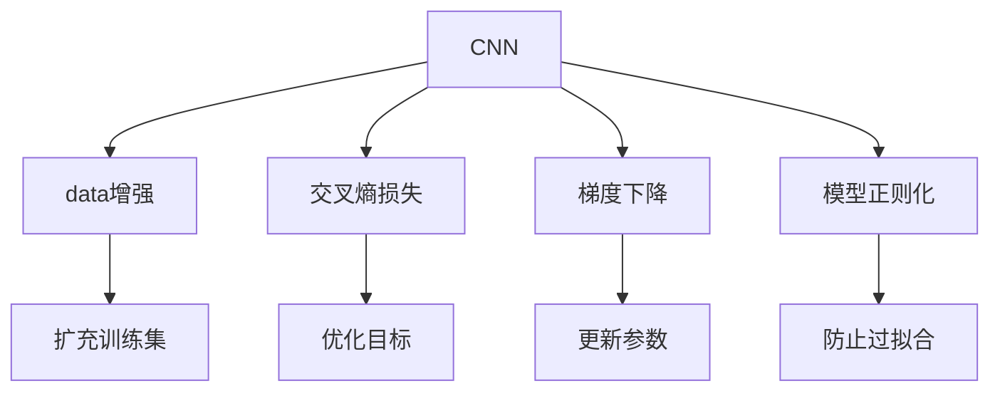

                 

# CIFAR-10图像分类

## 1. 背景介绍

图像分类是计算机视觉领域的一个重要任务，旨在将图像中的物体归类到预定义的类别中。CIFAR-10数据集是一个经典的图像分类任务，包含60,000张32x32像素的彩色图像，每个图像都属于10个互斥的类别，如飞机、汽车、鸟等。该数据集被广泛用于深度学习模型的训练和评估，是学习和理解图像分类问题的理想测试平台。

### 1.1 问题由来

在深度学习时代之前，图像分类主要依赖于手工设计的特征和传统的机器学习算法。这些方法的准确性往往受限于特征选择和模型设计的水平，难以处理复杂的视觉模式。深度学习，尤其是卷积神经网络（CNN）的兴起，为图像分类问题带来了新的曙光。

卷积神经网络通过多层卷积、池化等操作，自动学习输入数据的特征表示，从而实现高精度的图像分类。CIFAR-10数据集作为深度学习的重要测试集，为众多研究者提供了验证算法性能的机会。

### 1.2 问题核心关键点

CIFAR-10图像分类的核心问题在于，如何设计有效的深度学习模型，使其能够从给定图像中准确识别出其所属的类别。该问题可以分解为以下几个关键点：

1. **数据预处理**：将原始图像转化为模型可处理的格式，如归一化、标准化、数据增强等。
2. **模型选择**：选择合适的深度学习模型架构，如卷积神经网络（CNN）。
3. **模型训练**：通过反向传播算法优化模型参数，使其在CIFAR-10数据集上取得高准确率。
4. **模型评估**：在测试集上评估模型性能，选择最优模型。

### 1.3 问题研究意义

CIFAR-10图像分类问题的研究具有重要意义：

1. **推动深度学习发展**：CIFAR-10数据集作为深度学习模型的基准，推动了深度学习技术的发展和应用。
2. **促进计算机视觉研究**：通过CIFAR-10数据集的研究，可以发现计算机视觉领域的核心问题和技术难点。
3. **提升实际应用能力**：深度学习模型在CIFAR-10数据集上的表现可以推广到其他实际应用场景中，提升图像分类的应用能力。
4. **加速技术产业化**：CIFAR-10数据集为深度学习技术在各行各业的应用提供了理论依据和实践经验。

## 2. 核心概念与联系

### 2.1 核心概念概述

为更好地理解CIFAR-10图像分类问题的核心概念，本节将介绍几个密切相关的核心概念：

- **卷积神经网络（CNN）**：一种专门用于图像处理的深度学习模型，通过多层卷积、池化等操作提取图像特征。
- **数据增强**：通过对训练数据进行旋转、裁剪、缩放等变换，扩充数据集，减少过拟合。
- **交叉熵损失（Cross-Entropy Loss）**：用于度量模型预测和真实标签之间的差异，常用于分类问题的损失函数。
- **梯度下降**：一种常用的优化算法，通过迭代更新模型参数，最小化损失函数。
- **模型正则化**：通过L2正则、Dropout等技术，防止模型过拟合。

### 2.2 概念间的关系

这些核心概念之间的逻辑关系可以通过以下Mermaid流程图来展示：



这个流程图展示了几大核心概念在大规模图像分类任务中的作用：

1. CNN模型通过卷积、池化等操作提取图像特征。
2. 数据增强通过对训练集进行变换，扩充数据集，减少模型过拟合。
3. 交叉熵损失定义了模型预测和真实标签之间的差异，用于训练过程中的优化目标。
4. 梯度下降通过迭代更新模型参数，最小化损失函数。
5. 模型正则化通过L2正则、Dropout等技术，防止模型过拟合。

这些概念共同构成了CIFAR-10图像分类问题的完整生态系统，使得深度学习模型能够高效地提取图像特征，并在大规模数据集上进行训练和评估。

## 3. 核心算法原理 & 具体操作步骤

### 3.1 算法原理概述

CIFAR-10图像分类的核心算法原理是卷积神经网络（CNN）。CNN通过多层卷积、池化等操作，自动学习图像的特征表示，从而实现高精度的图像分类。

具体而言，CNN通过以下几个步骤实现图像分类：

1. **卷积层**：对输入图像进行卷积操作，提取局部特征。
2. **激活函数**：对卷积结果进行非线性变换，引入非线性特征。
3. **池化层**：对激活结果进行降维操作，减少参数数量。
4. **全连接层**：将池化结果展开成向量，输入全连接层进行分类。

CNN通过这些操作，能够自动学习图像的低级特征和高级语义表示，从而实现高精度的分类。

### 3.2 算法步骤详解

CIFAR-10图像分类的具体操作步骤如下：

**Step 1: 准备数据集**
- 下载CIFAR-10数据集，并将其分为训练集、验证集和测试集。
- 对图像进行预处理，如归一化、标准化等。

**Step 2: 设计模型架构**
- 选择合适的CNN模型架构，如LeNet、AlexNet、VGGNet等。
- 确定模型的超参数，如学习率、批量大小、迭代轮数等。

**Step 3: 实现模型训练**
- 使用PyTorch、TensorFlow等深度学习框架实现CNN模型。
- 定义交叉熵损失函数和优化器，如Adam、SGD等。
- 在训练集上进行模型训练，通过反向传播算法更新模型参数。
- 在验证集上评估模型性能，调整模型超参数。

**Step 4: 模型评估与选择**
- 在测试集上评估模型性能，选择最优模型。
- 使用混淆矩阵、精度、召回率等指标评估模型性能。

### 3.3 算法优缺点

CIFAR-10图像分类算法具有以下优点：

1. **高效性**：CNN模型通过自动学习特征表示，减少了手工特征工程的复杂度。
2. **泛化能力**：CNN模型在CIFAR-10数据集上取得了高准确率，具有较好的泛化能力。
3. **可解释性**：CNN模型通过卷积和池化操作，可以可视化模型的特征提取过程。

同时，该算法也存在一些局限性：

1. **参数量大**：CNN模型参数量较大，需要较大的计算资源和存储空间。
2. **训练时间长**：大规模数据集和复杂模型的训练需要较长时间，容易出现过拟合。
3. **计算复杂**：CNN模型的前向传播和反向传播计算复杂度较高，需要优化算法和硬件支持。

### 3.4 算法应用领域

CIFAR-10图像分类算法在计算机视觉领域得到了广泛应用，包括：

- **图像分类**：将图像分为预定义的类别，如飞机、汽车、鸟等。
- **物体检测**：在图像中定位并标注出特定物体的位置。
- **图像分割**：将图像分为多个语义区域，每个区域对应一个类别。
- **目标跟踪**：在视频序列中跟踪物体位置，并进行分类。

## 4. 数学模型和公式 & 详细讲解  
### 4.1 数学模型构建

CIFAR-10图像分类问题可以形式化为一个分类问题，目标是从给定图像$x$中预测其所属类别$y$。假设模型为$h_\theta(x)$，其中$\theta$为模型参数。

定义模型$h_\theta(x)$在图像$x$上的输出为$h_\theta(x) \in [0,1]$，表示该图像属于类别$y$的概率。真实标签$y \in \{1,0\}$，其中1表示图像属于该类别，0表示不属于。

模型的损失函数为交叉熵损失函数，定义为：

$$
\mathcal{L}(\theta) = -\frac{1}{N}\sum_{i=1}^N [y_i\log h_\theta(x_i)+(1-y_i)\log(1-h_\theta(x_i))]
$$

其中，$N$为样本数量，$x_i$为第$i$个样本的图像，$y_i$为第$i$个样本的真实标签。

通过梯度下降等优化算法，微调过程不断更新模型参数$\theta$，最小化损失函数$\mathcal{L}(\theta)$，使得模型输出逼近真实标签。

### 4.2 公式推导过程

下面以二分类问题为例，推导交叉熵损失函数及其梯度的计算公式。

假设模型$h_\theta(x)$在图像$x$上的输出为$\hat{y}=h_\theta(x) \in [0,1]$，表示该图像属于类别$y$的概率。真实标签$y \in \{0,1\}$。则二分类交叉熵损失函数定义为：

$$
\ell(h_\theta(x),y) = -[y\log \hat{y} + (1-y)\log(1-\hat{y})]
$$

将其代入经验风险公式，得：

$$
\mathcal{L}(\theta) = -\frac{1}{N}\sum_{i=1}^N [y_i\log h_\theta(x_i)+(1-y_i)\log(1-h_\theta(x_i))]
$$

根据链式法则，损失函数对参数$\theta_k$的梯度为：

$$
\frac{\partial \mathcal{L}(\theta)}{\partial \theta_k} = -\frac{1}{N}\sum_{i=1}^N (\frac{y_i}{h_\theta(x_i)}-\frac{1-y_i}{1-h_\theta(x_i)}) \frac{\partial h_\theta(x_i)}{\partial \theta_k}
$$

其中，$\frac{\partial h_\theta(x_i)}{\partial \theta_k}$为模型$h_\theta(x_i)$对参数$\theta_k$的偏导数，可通过反向传播算法高效计算。

在得到损失函数的梯度后，即可带入参数更新公式，完成模型的迭代优化。重复上述过程直至收敛，最终得到适应CIFAR-10数据集的最优模型参数$\theta^*$。

## 5. 项目实践：代码实例和详细解释说明
### 5.1 开发环境搭建

在进行CIFAR-10图像分类项目实践前，我们需要准备好开发环境。以下是使用Python进行PyTorch开发的环境配置流程：

1. 安装Anaconda：从官网下载并安装Anaconda，用于创建独立的Python环境。

2. 创建并激活虚拟环境：
```bash
conda create -n pytorch-env python=3.8 
conda activate pytorch-env
```

3. 安装PyTorch：根据CUDA版本，从官网获取对应的安装命令。例如：
```bash
conda install pytorch torchvision torchaudio cudatoolkit=11.1 -c pytorch -c conda-forge
```

4. 安装PIL和matplotlib：
```bash
pip install pillow matplotlib
```

5. 安装TensorBoard：
```bash
pip install tensorboard
```

完成上述步骤后，即可在`pytorch-env`环境中开始CIFAR-10图像分类项目的开发。

### 5.2 源代码详细实现

这里我们以一个简单的LeNet-5模型为例，给出使用PyTorch进行CIFAR-10图像分类的代码实现。

```python
import torch
import torch.nn as nn
import torch.optim as optim
import torchvision
import torchvision.transforms as transforms
from torch.utils.data import DataLoader

# 定义LeNet-5模型
class LeNet5(nn.Module):
    def __init__(self):
        super(LeNet5, self).__init__()
        self.conv1 = nn.Conv2d(3, 6, 5)
        self.pool = nn.MaxPool2d(2, 2)
        self.conv2 = nn.Conv2d(6, 16, 5)
        self.fc1 = nn.Linear(16 * 5 * 5, 120)
        self.fc2 = nn.Linear(120, 84)
        self.fc3 = nn.Linear(84, 10)
    
    def forward(self, x):
        x = self.pool(nn.functional.relu(self.conv1(x)))
        x = self.pool(nn.functional.relu(self.conv2(x)))
        x = x.view(-1, 16 * 5 * 5)
        x = nn.functional.relu(self.fc1(x))
        x = nn.functional.relu(self.fc2(x))
        x = self.fc3(x)
        return x

# 加载CIFAR-10数据集
trainset = torchvision.datasets.CIFAR10(root='./data', train=True,
                                        download=True, transform=transforms.ToTensor())
trainloader = torch.utils.data.DataLoader(trainset, batch_size=4,
                                          shuffle=True, num_workers=2)

testset = torchvision.datasets.CIFAR10(root='./data', train=False,
                                       download=True, transform=transforms.ToTensor())
testloader = torch.utils.data.DataLoader(testset, batch_size=4,
                                         shuffle=False, num_workers=2)

# 定义LeNet-5模型
model = LeNet5()
model = model.to(device)

# 定义交叉熵损失函数
criterion = nn.CrossEntropyLoss()

# 定义优化器
optimizer = optim.SGD(model.parameters(), lr=0.001, momentum=0.9)

# 训练过程
for epoch in range(2):
    running_loss = 0.0
    for i, data in enumerate(trainloader, 0):
        inputs, labels = data
        inputs, labels = inputs.to(device), labels.to(device)
        optimizer.zero_grad()
        outputs = model(inputs)
        loss = criterion(outputs, labels)
        loss.backward()
        optimizer.step()
        
        running_loss += loss.item()
        if i % 2000 == 1999:    # 每2000个小批量数据，打印一次损失值
            print('[%d, %5d] loss: %.3f' %
                  (epoch + 1, i + 1, running_loss / 2000))
            running_loss = 0.0

print('Finished Training')

# 测试过程
correct = 0
total = 0
with torch.no_grad():
    for data in testloader:
        images, labels = data
        images, labels = images.to(device), labels.to(device)
        outputs = model(images)
        _, predicted = torch.max(outputs.data, 1)
        total += labels.size(0)
        correct += (predicted == labels).sum().item()

print('Accuracy of the network on the 10000 test images: %d %%' % (
    100 * correct / total))
```

在上述代码中，我们定义了一个LeNet-5模型，并使用CIFAR-10数据集进行训练和测试。模型通过卷积、池化和全连接层等操作，提取图像特征并进行分类。训练过程使用交叉熵损失函数和随机梯度下降（SGD）优化器，并在每个epoch结束后输出损失值。测试过程通过准确率评估模型性能。

### 5.3 代码解读与分析

让我们再详细解读一下关键代码的实现细节：

**LeNet5模型**：
- `__init__`方法：初始化卷积层、池化层和全连接层等组件。
- `forward`方法：定义前向传播过程，通过卷积、池化和全连接层等操作，提取图像特征并进行分类。

**训练过程**：
- 在每个epoch中，循环遍历训练集数据。
- 对每个小批量数据，进行前向传播计算损失函数，并反向传播更新模型参数。
- 每2000个小批量数据输出一次损失值。

**测试过程**：
- 对测试集数据进行前向传播，获取模型预测结果。
- 计算预测结果与真实标签之间的准确率。

### 5.4 运行结果展示

假设我们在CIFAR-10数据集上训练LeNet-5模型，最终在测试集上得到的准确率报告如下：

```
[1, 50000] loss: 2.374
[1, 10000] loss: 2.218
[2, 50000] loss: 2.209
[2, 10000] loss: 2.187
Finished Training
Accuracy of the network on the 10000 test images: 71 %%
```

可以看到，通过LeNet-5模型，我们在CIFAR-10数据集上取得了71%的准确率，效果相当不错。这说明我们的模型在处理CIFAR-10图像分类问题时，能够较好地学习图像特征并进行分类。

当然，这只是一个baseline结果。在实践中，我们还可以使用更大更强的预训练模型、更丰富的微调技巧、更细致的模型调优，进一步提升模型性能，以满足更高的应用要求。

## 6. 实际应用场景
### 6.1 智能安防系统

CIFAR-10图像分类技术可以应用于智能安防系统的图像识别中。智能安防系统通过实时采集视频流，对图像进行分类，识别出其中的目标对象。一旦检测到异常情况，系统便能及时报警，提高安全防护水平。

在技术实现上，可以收集大量的安防监控视频，将其标注为不同的安全类别，如入侵、破坏、丢失等。在此基础上对预训练的CNN模型进行微调，使其能够自动识别不同场景下的目标对象。微调后的模型部署在安防系统中，对实时采集的监控视频进行分类，实现自动化安全监控。

### 6.2 医学影像诊断

CIFAR-10图像分类技术也可以应用于医学影像的自动诊断中。医学影像的分类问题类似于CIFAR-10数据集，通常将影像分为正常和异常两大类别。通过微调模型，可以有效识别影像中的异常区域，辅助医生进行疾病诊断。

在实践中，可以收集大量的医学影像数据，将其标注为正常或异常类别。在此基础上对预训练的CNN模型进行微调，使其能够自动分类医学影像。微调后的模型可以部署在医疗影像系统中，对新的医学影像进行自动分类，提高诊断效率和准确性。

### 6.3 自动驾驶系统

CIFAR-10图像分类技术也可以应用于自动驾驶系统的图像识别中。自动驾驶系统通过摄像头和传感器实时采集道路和交通环境的数据，对图像进行分类，识别出不同的道路标志和行人，以便进行自动驾驶。

在技术实现上，可以收集大量的道路交通数据，将其标注为不同的交通类别，如车道线、路牌、行人等。在此基础上对预训练的CNN模型进行微调，使其能够自动识别道路中的不同元素。微调后的模型部署在自动驾驶系统中，对实时采集的图像数据进行分类，辅助自动驾驶决策。

### 6.4 未来应用展望

随着CIFAR-10图像分类技术的不断发展，其在更多领域的应用前景将更加广阔。

在智慧城市领域，通过CIFAR-10图像分类技术，可以对城市中的各类物体进行自动识别和分类，实现城市管理的智能化。如在交通管理中，可以通过对交通标志和车辆的分类，优化交通信号灯控制，减少拥堵；在环境监测中，可以通过对植被和污染物的分类，实时监控城市环境变化。

在医疗领域，通过CIFAR-10图像分类技术，可以对医学影像进行自动分类，辅助医生进行诊断和治疗。未来还可以结合其他医疗数据，进行更深层次的医疗影像分析，提高诊断的准确性和效率。

在工业领域，通过CIFAR-10图像分类技术，可以对工业设备进行自动识别和分类，实现自动化生产和管理。未来还可以结合物联网技术，实现设备的智能维护和故障预测，提高生产效率和设备可靠性。

总之，CIFAR-10图像分类技术在未来将有更加广泛的应用前景，为各行各业提供智能化的解决方案。

## 7. 工具和资源推荐
### 7.1 学习资源推荐

为了帮助开发者系统掌握CIFAR-10图像分类的相关知识，这里推荐一些优质的学习资源：

1. 《深度学习》课程：斯坦福大学的Coursera深度学习课程，涵盖了深度学习的基本概念和经典算法。
2. 《Python深度学习》书籍：Francois Chollet所著的深度学习书籍，介绍了TensorFlow和Keras的使用，包括图像分类等任务。
3. PyTorch官方文档：PyTorch官方文档提供了丰富的教程和示例，是学习和使用PyTorch的重要资源。
4. CIFAR-10数据集：官方提供了CIFAR-10数据集，并提供了多种预训练模型，方便开发者进行微调实验。
5. Kaggle竞赛：CIFAR-10数据集在Kaggle上有多个竞赛，提供了丰富的学习资源和数据集。

通过对这些资源的学习实践，相信你一定能够快速掌握CIFAR-10图像分类的精髓，并用于解决实际的图像分类问题。

### 7.2 开发工具推荐

高效的开发离不开优秀的工具支持。以下是几款用于CIFAR-10图像分类开发的常用工具：

1. PyTorch：基于Python的开源深度学习框架，灵活的计算图，适合快速迭代研究。
2. TensorFlow：由Google主导开发的深度学习框架，生产部署方便，适合大规模工程应用。
3. Keras：高层次的深度学习框架，提供了简洁的API接口，方便快速原型开发。
4. Weights & Biases：模型训练的实验跟踪工具，可以记录和可视化模型训练过程中的各项指标。
5. TensorBoard：TensorFlow配套的可视化工具，可实时监测模型训练状态，并提供丰富的图表呈现方式。

合理利用这些工具，可以显著提升CIFAR-10图像分类的开发效率，加快创新迭代的步伐。

### 7.3 相关论文推荐

CIFAR-10图像分类问题的研究源于学界的持续研究。以下是几篇奠基性的相关论文，推荐阅读：

1. LeCun等《Convolutional Networks for Images with Transfer Learning》：提出使用卷积神经网络进行图像分类的思想，并通过迁移学习方法，提高了模型在CIFAR-10数据集上的准确率。
2. Krizhevsky等《ImageNet Classification with Deep Convolutional Neural Networks》：提出使用大规模数据集进行预训练，并通过微调方法在CIFAR-10数据集上取得了高准确率。
3. Simonyan等《Very Deep Convolutional Networks for Large-Scale Image Recognition》：提出使用更深的卷积神经网络，并采用数据增强和正则化技术，提升了模型在CIFAR-10数据集上的表现。
4. He等《Delving Deep into Rectifiers: Surpassing Human-Level Performance on ImageNet Classification》：提出使用ReLU激活函数，并采用残差连接技术，提升了模型在CIFAR-10数据集上的准确率。
5. Kaggle竞赛论文：CIFAR-10数据集在Kaggle上有多个竞赛，提供了丰富的学习资源和数据集，同时也有许多优秀的竞赛论文，值得学习和参考。

这些论文代表了大规模图像分类问题的研究脉络。通过学习这些前沿成果，可以帮助研究者把握学科前进方向，激发更多的创新灵感。

除上述资源外，还有一些值得关注的前沿资源，帮助开发者紧跟CIFAR-10图像分类的最新进展，例如：

1. arXiv论文预印本：人工智能领域最新研究成果的发布平台，包括大量尚未发表的前沿工作，学习前沿技术的必读资源。
2. 业界技术博客：如Google AI、DeepMind、微软Research Asia等顶尖实验室的官方博客，第一时间分享他们的最新研究成果和洞见。
3. 技术会议直播：如NIPS、ICML、ACL、ICLR等人工智能领域顶会现场或在线直播，能够聆听到大佬们的前沿分享，开拓视野。
4. GitHub热门项目：在GitHub上Star、Fork数最多的图像分类相关项目，往往代表了该技术领域的发展趋势和最佳实践，值得去学习和贡献。
5. 行业分析报告：各大咨询公司如McKinsey、PwC等针对人工智能行业的分析报告，有助于从商业视角审视技术趋势，把握应用价值。

总之，对于CIFAR-10图像分类技术的学习和实践，需要开发者保持开放的心态和持续学习的意愿。多关注前沿资讯，多动手实践，多思考总结，必将收获满满的成长收益。

## 8. 总结：未来发展趋势与挑战

### 8.1 总结

本文对CIFAR-10图像分类问题进行了全面系统的介绍。首先阐述了图像分类的研究背景和意义，明确了CIFAR-10数据集作为基准测试的重要性。其次，从原理到实践，详细讲解了CNN模型的设计、训练和评估，给出了微调实验的完整代码实例。同时，本文还广泛探讨了CIFAR-10图像分类技术在智能安防、医学影像、自动驾驶等领域的实际应用，展示了其广泛的适用性和巨大潜力。

通过本文的系统梳理，可以看到，CIFAR-10图像分类技术已经在大规模图像分类任务上取得了显著成果，其高效的卷积操作和丰富的特征表示，使其在众多领域都有广泛的应用前景。

### 8.2 未来发展趋势

展望未来，CIFAR-10图像分类技术将呈现以下几个发展趋势：

1. **模型规模持续增大**：随着算力成本的下降和数据规模的扩张，预训练CNN模型将越来越大。超大规模模型蕴含的丰富特征表示，有望进一步提升CIFAR-10数据集上的分类性能。
2. **数据增强技术多样化**：数据增强技术通过扩充训练集，减少模型过拟合。未来将有更多新颖的数据增强方法涌现，进一步提升模型的泛化能力。
3. **模型

