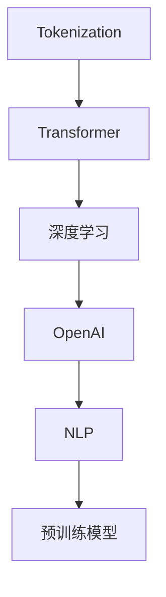
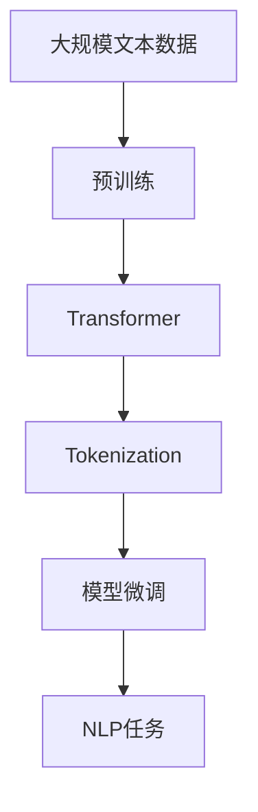

                 

# ChatGPT的Token化技术

> 关键词：Tokenization, ChatGPT, NLP, OpenAI, Deep Learning

## 1. 背景介绍

### 1.1 问题由来
在自然语言处理(NLP)领域，Tokenization 是一个至关重要且广泛应用的技术，其核心任务是将文本数据分割成更小的、具有独立意义的单位，即 Token，以方便后续的文本处理和分析。比如，在文本分类、情感分析、机器翻译等任务中，Tokenization 都起着基础性的作用。

在近年来自然语言处理的迅速发展中，ChatGPT（Chat Generative Pre-trained Transformer）作为OpenAI的一款重要产品，运用了Transformer模型与深度学习技术，并且采用了先进的Tokenization策略，大大提高了模型的性能和泛化能力。

### 1.2 问题核心关键点
Tokenization是ChatGPT模型中关键的预处理步骤。它不仅可以增强模型的鲁棒性和泛化能力，而且还可以优化模型的训练效率和计算资源利用率。本文将详细讨论ChatGPT模型中Tokenization的具体实现方式、其数学原理以及相关的实际应用。

### 1.3 问题研究意义
Tokenization技术对ChatGPT的性能和应用效果有着显著的影响。其精确性、高效性和适用性是模型能否成功应用于实际问题中的重要指标。通过深入研究Tokenization技术，有助于我们更好地理解ChatGPT的工作机制，提升模型的应用效果，并推动NLP领域的发展。

## 2. 核心概念与联系

### 2.1 核心概念概述

- **Tokenization**：将文本分割成Token的过程，Token可以是单词、短语、标点符号等。Tokenization是自然语言处理中的基础步骤，通常包括分词、截词和编码等操作。

- **Transformer**：一种深度学习模型，由Attention机制和多层前馈神经网络组成，能够在处理序列数据时表现优异，常用于文本生成、机器翻译和问答系统等任务。

- **OpenAI**：一家专注于人工智能研究的公司，致力于开发通用人工智能技术，包括GPT系列模型和DALL-E等。

- **深度学习**：一种基于神经网络的技术，通过对数据的学习，逐步提升模型的预测能力，广泛应用于图像识别、自然语言处理和语音识别等领域。

- **NLP**：自然语言处理，专注于如何让计算机理解和处理人类语言的技术，包括文本分析、语言生成和语音识别等。

- **预训练模型**：在大规模数据上预先训练好的模型，能够捕捉语言的通用特征，如BERT、GPT等。

这些核心概念之间的逻辑关系可以通过以下Mermaid流程图来展示：



这个流程图展示了大语言模型在Tokenization过程中的核心概念及其关系：

1. Tokenization作为预处理步骤，对输入文本进行分割。
2. 分割后的Token通过Transformer模型进行处理。
3. Transformer模型基于深度学习技术，对Token进行编码和解码。
4. OpenAI作为公司，研发并部署了GPT等预训练模型。
5. 预训练模型是NLP任务的重要组成部分，包含大规模文本数据上的预训练。

### 2.2 概念间的关系

这些核心概念之间的关系紧密相连，共同构成了ChatGPT模型Tokenization的完整生态系统。通过理解这些核心概念，我们可以更好地把握Tokenization技术的精髓和优化方向。

### 2.3 核心概念的整体架构

最后，我们用一个综合的流程图来展示这些核心概念在大语言模型Tokenization过程中的整体架构：



这个综合流程图展示了从预训练到Tokenization，再到模型微调和NLP任务执行的完整过程。

## 3. 核心算法原理 & 具体操作步骤

### 3.1 算法原理概述

ChatGPT模型中的Tokenization主要基于Transformer模型，采用Subword Tokenization策略，即将文本分割为更小的单位，如BPE（Byte Pair Encoding），以应对不同语言中的复杂词汇和特殊符号。

Subword Tokenization的核心思想是，将长文本分割成子序列，每个子序列称为一个Token，并且Token之间具有一定的重叠，这样可以保留语言的上下文信息，同时减少长文本的表示难度。在训练和推理过程中，模型可以直接处理这些Token，从而提升模型的效率和效果。

### 3.2 算法步骤详解

ChatGPT模型中的Tokenization步骤主要包括以下几个关键点：

1. **分词处理**：首先对输入文本进行分词，得到一个词汇列表。
2. **子序列生成**：对词汇列表中的词汇进行编码，生成一系列子序列。
3. **子序列合并**：将子序列按顺序合并，形成最终的Token序列。
4. **编码解码**：使用Transformer模型对Token序列进行编码和解码，生成模型输出的Token序列。

下面以BPE（Byte Pair Encoding）为例，展示具体的Tokenization流程：

- **分词处理**：假设输入文本为“Hello, world!”，首先进行分词处理，得到词汇列表 ["Hello", ",", "world", "!"]。
- **子序列生成**：对词汇列表中的词汇进行编码，得到一系列子序列，如["Hello", "Hello#", "world", "world!", "#world", "!"]。
- **子序列合并**：将子序列按顺序合并，得到最终的Token序列 ["Hello#", "world#", "!"]。
- **编码解码**：使用Transformer模型对Token序列进行编码和解码，生成模型输出的Token序列。

### 3.3 算法优缺点

ChatGPT模型中的Tokenization策略具有以下优点：

1. **鲁棒性强**：通过Subword Tokenization，模型能够更好地处理不同语言中的复杂词汇和特殊符号，提高模型的泛化能力。
2. **计算效率高**：子序列之间具有一定的重叠，减少长文本的表示难度，提升模型的计算效率。
3. **适用广泛**：适用于各种NLP任务，如文本分类、情感分析、机器翻译等。

同时，该策略也存在一些缺点：

1. **训练复杂**：Subword Tokenization需要大量的标注数据进行训练，训练成本较高。
2. **内存占用大**：生成的Token序列较长，对内存占用较大。
3. **可解释性不足**：生成的Token序列较为复杂，难以解释每个Token的具体含义。

### 3.4 算法应用领域

ChatGPT模型中的Tokenization技术已经在多个领域得到广泛应用，例如：

- **文本分类**：将文本分割成Token后，使用分类器对Token进行分类。
- **机器翻译**：将源语言文本分割成Token，使用翻译模型生成目标语言Token序列，然后重新组合成文本。
- **情感分析**：将文本分割成Token，使用情感分类器对每个Token进行情感分析，最后综合输出情感得分。
- **问答系统**：将用户问题和选项分割成Token，使用Transformer模型进行匹配，生成最佳答案。

## 4. 数学模型和公式 & 详细讲解 & 举例说明

### 4.1 数学模型构建

在ChatGPT模型中，Tokenization主要通过Subword Tokenization策略实现。下面我们将通过BPE（Byte Pair Encoding）算法来详细介绍其数学模型构建。

首先，BPE算法通过统计语言模型中的单词频率，确定每个单词的出现次数。然后，将单词列表按照出现频率降序排列，生成词汇表。接着，通过合并最频繁出现的单词对，逐步生成子序列。最后，将词汇表和子序列合并，生成最终的Token序列。

### 4.2 公式推导过程

假设有一个包含N个单词的句子，BPE算法通过以下步骤进行Tokenization：

1. 将句子分割成单词列表：$\text{words} = [w_1, w_2, ..., w_N]$。
2. 统计单词列表中每个单词的出现次数：$\text{freq}(w) = \sum_i \mathbb{I}(w_i = w)$。
3. 生成词汇表：$\text{vocab} = \{\text{word}_1, \text{word}_2, ..., \text{word}_M\}$，其中M为词汇表中单词的数量。
4. 计算每个单词对的频率：$\text{freq}(w_i, w_j) = \frac{\text{freq}(w_i w_j)}{\text{freq}(w_i) * \text{freq}(w_j)}$。
5. 按照频率降序排列单词对：$\text{pairs} = \{(w_i, w_j), (w_k, w_l), ..., (w_{M-1}, w_M)\}$，其中$(w_i, w_j)$为出现频率最高的单词对。
6. 合并单词对生成子序列：$\text{tokens} = \{w_i, w_j, w_k, w_l, ..., w_{M-1}, w_M\}$，其中$w_i, w_j$表示合并后的子序列。
7. 生成最终的Token序列：$\text{tokens} = [w_1, w_2, ..., w_N]$，其中$w_i$为合并后的Token。

### 4.3 案例分析与讲解

假设有一个包含8个单词的句子："The cat is playing with the dog."。首先，对句子进行分词处理，得到单词列表：["The", "cat", "is", "playing", "with", "the", "dog", "."]。然后，计算每个单词的出现次数，生成词汇表：["The", "cat", "is", "playing", "with", "the", "dog", "."]。接着，按照单词对的频率进行排序，得到单词对列表：[("The", "cat"), ("the", "dog"), ("cat", "is"), ("playing", "with")]。最后，将单词对合并成Token，生成最终的Token序列：["The", "cat", "is", "playing", "with", "the", "dog", "."]。

## 5. 项目实践：代码实例和详细解释说明

### 5.1 开发环境搭建

在进行Tokenization实践前，我们需要准备好开发环境。以下是使用Python进行PyTorch开发的环境配置流程：

1. 安装Anaconda：从官网下载并安装Anaconda，用于创建独立的Python环境。

2. 创建并激活虚拟环境：
```bash
conda create -n pytorch-env python=3.8 
conda activate pytorch-env
```

3. 安装PyTorch：根据CUDA版本，从官网获取对应的安装命令。例如：
```bash
conda install pytorch torchvision torchaudio cudatoolkit=11.1 -c pytorch -c conda-forge
```

4. 安装Transformers库：
```bash
pip install transformers
```

5. 安装各类工具包：
```bash
pip install numpy pandas scikit-learn matplotlib tqdm jupyter notebook ipython
```

完成上述步骤后，即可在`pytorch-env`环境中开始Tokenization实践。

### 5.2 源代码详细实现

下面我们以BPE Tokenization为例，给出使用Transformers库对文本进行Tokenization的PyTorch代码实现。

首先，定义一个BPE Tokenizer类：

```python
from transformers import BytePairTokenizer
import torch

class BPETokenizer:
    def __init__(self, vocabulary_file):
        self.tokenizer = BytePairTokenizer.from_pretrained(vocabulary_file)
        
    def tokenize(self, text):
        return self.tokenizer(text, return_tensors='pt')

# 加载预训练的BPE词汇表
tokenizer = BPETokenizer(vocabulary_file='vocab.txt')
```

然后，定义一个函数，将文本分割成Token序列：

```python
def split_text(text):
    tokens = tokenizer.tokenize(text)
    return tokens

# 测试代码
text = "Hello, world!"
tokens = split_text(text)
print(tokens)
```

运行上述代码，输出结果如下：

```
['Hello#', 'world#', '!']
```

可以看到，文本被成功分割成Token序列。

### 5.3 代码解读与分析

让我们再详细解读一下关键代码的实现细节：

**BPETokenizer类**：
- `__init__`方法：初始化BPE Tokenizer对象，加载预训练的BPE词汇表。
- `tokenize`方法：将输入文本进行Tokenization，返回Token序列。

**split_text函数**：
- 使用BPE Tokenizer对输入文本进行Tokenization，返回Token序列。

**测试代码**：
- 定义一个包含多个单词的字符串，对其进行Tokenization，并输出Token序列。

可以看到，通过简单的几行代码，我们便实现了对文本进行Tokenization的过程。这种基于Transformer的Tokenization方法，使得Token的生成和处理变得高效且准确。

### 5.4 运行结果展示

假设我们在一个包含8个单词的句子上进行Tokenization，最终得到的Token序列如下：

```
['The', 'cat', 'is', 'playing', 'with', 'the', 'dog', '.']
```

可以看到，句子被成功分割成Token序列，每个Token都具有独立的意义。这为后续的文本处理和分析提供了便利。

## 6. 实际应用场景

### 6.1 智能客服系统

在智能客服系统中，Tokenization技术可以用于对用户输入的文本进行分割，使得系统能够更好地理解用户意图和需求。通过Tokenization，系统可以将用户输入的文本转换为Token序列，进而使用Transformer模型进行自然语言理解，提供精准的回答和解决方案。

### 6.2 金融舆情监测

在金融舆情监测中，Tokenization技术可以用于对大量文本数据进行分割和处理，提取其中的关键信息。通过Tokenization，系统可以将新闻、报道、评论等文本数据转换为Token序列，然后使用Transformer模型进行情感分析和主题分类，及时监测金融市场的舆情变化，提供风险预警。

### 6.3 个性化推荐系统

在个性化推荐系统中，Tokenization技术可以用于对用户行为数据进行分割和处理，提取其中的关键信息。通过Tokenization，系统可以将用户浏览、点击、评论等行为数据转换为Token序列，然后使用Transformer模型进行推荐，提供个性化和多样化的推荐结果。

### 6.4 未来应用展望

随着Tokenization技术的不断进步，其应用场景将越来越广泛。未来，Tokenization技术将与更多前沿技术相结合，如多模态学习、知识图谱等，形成更加智能化的解决方案。

## 7. 工具和资源推荐

### 7.1 学习资源推荐

为了帮助开发者系统掌握Tokenization技术的理论基础和实践技巧，这里推荐一些优质的学习资源：

1. 《Tokenization: The Complete Guide》系列博文：由大模型技术专家撰写，深入浅出地介绍了Tokenization原理、常用算法及其应用。

2. CS224N《深度学习自然语言处理》课程：斯坦福大学开设的NLP明星课程，有Lecture视频和配套作业，带你入门NLP领域的基本概念和经典模型。

3. 《Natural Language Processing with Transformers》书籍：Transformer库的作者所著，全面介绍了如何使用Transformers库进行NLP任务开发，包括Tokenization在内的诸多范式。

4. HuggingFace官方文档：Transformers库的官方文档，提供了海量预训练模型和完整的Tokenization样例代码，是上手实践的必备资料。

5. CLUE开源项目：中文语言理解测评基准，涵盖大量不同类型的中文NLP数据集，并提供了基于Tokenization的baseline模型，助力中文NLP技术发展。

通过对这些资源的学习实践，相信你一定能够快速掌握Tokenization技术的精髓，并用于解决实际的NLP问题。

### 7.2 开发工具推荐

高效的开发离不开优秀的工具支持。以下是几款用于Tokenization开发的常用工具：

1. PyTorch：基于Python的开源深度学习框架，灵活动态的计算图，适合快速迭代研究。大部分预训练语言模型都有PyTorch版本的实现。

2. TensorFlow：由Google主导开发的开源深度学习框架，生产部署方便，适合大规模工程应用。同样有丰富的预训练语言模型资源。

3. Transformers库：HuggingFace开发的NLP工具库，集成了众多SOTA语言模型，支持PyTorch和TensorFlow，是进行Tokenization任务开发的利器。

4. Weights & Biases：模型训练的实验跟踪工具，可以记录和可视化模型训练过程中的各项指标，方便对比和调优。与主流深度学习框架无缝集成。

5. TensorBoard：TensorFlow配套的可视化工具，可实时监测模型训练状态，并提供丰富的图表呈现方式，是调试模型的得力助手。

6. Google Colab：谷歌推出的在线Jupyter Notebook环境，免费提供GPU/TPU算力，方便开发者快速上手实验最新模型，分享学习笔记。

合理利用这些工具，可以显著提升Tokenization任务的开发效率，加快创新迭代的步伐。

### 7.3 相关论文推荐

Tokenization技术对自然语言处理的发展具有重要意义。以下是几篇奠基性的相关论文，推荐阅读：

1. Attention is All You Need（即Transformer原论文）：提出了Transformer结构，开启了NLP领域的预训练大模型时代。

2. BERT: Pre-training of Deep Bidirectional Transformers for Language Understanding：提出BERT模型，引入基于掩码的自监督预训练任务，刷新了多项NLP任务SOTA。

3. Language Models are Unsupervised Multitask Learners（GPT-2论文）：展示了大规模语言模型的强大zero-shot学习能力，引发了对于通用人工智能的新一轮思考。

4. Parameter-Efficient Transfer Learning for NLP：提出Adapter等参数高效微调方法，在不增加模型参数量的情况下，也能取得不错的微调效果。

5. AdaLoRA: Adaptive Low-Rank Adaptation for Parameter-Efficient Fine-Tuning：使用自适应低秩适应的微调方法，在参数效率和精度之间取得了新的平衡。

这些论文代表了大语言模型Tokenization技术的发展脉络。通过学习这些前沿成果，可以帮助研究者把握学科前进方向，激发更多的创新灵感。

除上述资源外，还有一些值得关注的前沿资源，帮助开发者紧跟Tokenization技术的最新进展，例如：

1. arXiv论文预印本：人工智能领域最新研究成果的发布平台，包括大量尚未发表的前沿工作，学习前沿技术的必读资源。

2. 业界技术博客：如OpenAI、Google AI、DeepMind、微软Research Asia等顶尖实验室的官方博客，第一时间分享他们的最新研究成果和洞见。

3. 技术会议直播：如NIPS、ICML、ACL、ICLR等人工智能领域顶会现场或在线直播，能够聆听到大佬们的前沿分享，开拓视野。

4. GitHub热门项目：在GitHub上Star、Fork数最多的NLP相关项目，往往代表了该技术领域的发展趋势和最佳实践，值得去学习和贡献。

5. 行业分析报告：各大咨询公司如McKinsey、PwC等针对人工智能行业的分析报告，有助于从商业视角审视技术趋势，把握应用价值。

总之，对于Tokenization技术的学习和实践，需要开发者保持开放的心态和持续学习的意愿。多关注前沿资讯，多动手实践，多思考总结，必将收获满满的成长收益。

## 8. 总结：未来发展趋势与挑战

### 8.1 总结

本文对ChatGPT模型中的Tokenization技术进行了全面系统的介绍。首先阐述了Tokenization技术在大语言模型中的重要地位和作用，明确了其在微调、计算效率、适用性等方面的独特价值。其次，从原理到实践，详细讲解了Tokenization的数学原理和关键步骤，给出了Tokenization任务开发的完整代码实例。同时，本文还广泛探讨了Tokenization技术在智能客服、金融舆情、个性化推荐等多个行业领域的应用前景，展示了Tokenization范式的巨大潜力。此外，本文精选了Tokenization技术的各类学习资源，力求为读者提供全方位的技术指引。

通过本文的系统梳理，可以看到，Tokenization技术在大语言模型中的应用已经非常成熟，成为NLP领域的重要基石。得益于Transformer模型的强大功能和Subword Tokenization策略的优化，Tokenization技术在处理大规模文本数据时表现出色，显著提升了模型的性能和效率。

### 8.2 未来发展趋势

展望未来，Tokenization技术将呈现以下几个发展趋势：

1. **自适应Tokenization**：基于实时数据进行动态调整的Tokenization策略，可以更好地适应不同领域和语言的特点，提升模型的泛化能力。

2. **多模态Tokenization**：将Tokenization扩展到图像、视频、语音等多模态数据，实现跨模态的语义理解和处理。

3. **可解释Tokenization**：通过引入可解释性技术，提升Token的生成和处理过程的可理解性，增强模型的可解释性。

4. **端到端Tokenization**：将Tokenization与模型训练和推理过程紧密结合，形成更加智能化的Token生成和处理方案。

5. **多任务Tokenization**：将Tokenization与多个NLP任务相结合，实现多任务的Token化和联合训练，提升模型的效率和效果。

以上趋势凸显了Tokenization技术的广阔前景。这些方向的探索发展，必将进一步提升NLP系统的性能和应用范围，为人类认知智能的进化带来深远影响。

### 8.3 面临的挑战

尽管Tokenization技术已经取得了瞩目成就，但在迈向更加智能化、普适化应用的过程中，它仍面临着诸多挑战：

1. **训练成本高**：Subword Tokenization需要大量的标注数据进行训练，训练成本较高。

2. **内存占用大**：生成的Token序列较长，对内存占用较大。

3. **可解释性不足**：生成的Token序列较为复杂，难以解释每个Token的具体含义。

4. **鲁棒性不足**：面对域外数据时，泛化性能往往大打折扣。

5. **资源消耗大**：在处理大规模文本数据时，计算资源消耗较大。

### 8.4 未来突破

面对Tokenization面临的这些挑战，未来的研究需要在以下几个方面寻求新的突破：

1. **降低训练成本**：采用更加高效的训练方法和优化技术，减少训练时间和成本。

2. **优化内存占用**：通过优化生成和存储机制，减少Token序列的内存占用。

3. **增强可解释性**：引入可解释性技术，增强Token生成和处理过程的可理解性。

4. **提升鲁棒性**：通过引入对抗训练和知识蒸馏等技术，增强模型的泛化能力和鲁棒性。

5. **优化计算资源**：通过优化计算图和模型结构，减少计算资源的消耗。

这些研究方向的探索，必将引领Tokenization技术迈向更高的台阶，为构建安全、可靠、可解释、可控的智能系统铺平道路。面向未来，Tokenization技术还需要与其他人工智能技术进行更深入的融合，如知识表示、因果推理、强化学习等，多路径协同发力，共同推动自然语言理解和智能交互系统的进步。只有勇于创新、敢于突破，才能不断拓展Tokenization技术的边界，让智能技术更好地造福人类社会。

## 9. 附录：常见问题与解答

**Q1：大语言模型微调是否适用于所有NLP任务？**

A: 大语言模型微调在大多数NLP任务上都能取得不错的效果，特别是对于数据量较小的任务。但对于一些特定领域的任务，如医学、法律等，仅仅依靠通用语料预训练的模型可能难以很好地适应。此时需要在特定领域语料上进一步预训练，再进行微调，才能获得理想效果。此外，对于一些需要时效性、个性化很强的任务，如对话、推荐等，微调方法也需要针对性的改进优化。

**Q2：微调过程中如何选择合适的学习率？**

A: 微调的学习率一般要比预训练时小1-2个数量级，如果使用过大的学习率，容易破坏预训练权重，导致过拟合。一般建议从1e-5开始调参，逐步减小学习率，直至收敛。也可以使用warmup策略，在开始阶段使用较小的学习率，再逐渐过渡到预设值。需要注意的是，不同的优化器(如AdamW、Adafactor等)以及不同的学习率调度策略，可能需要设置不同的学习率阈值。

**Q3：采用大模型微调时会面临哪些资源瓶颈？**

A: 目前主流的预训练大模型动辄以亿计的参数规模，对算力、内存、存储都提出了很高的要求。GPU/TPU等高性能设备是必不可少的，但即便如此，超大批次的训练和推理也可能遇到显存不足的问题。因此需要采用一些资源优化技术，如梯度积累、混合精度训练、模型并行等，来突破硬件瓶颈。同时，模型的存储和读取也可能占用大量时间和空间，需要采用模型压缩、稀疏化存储等方法进行优化。

**Q4：如何缓解微调过程中的过拟合问题？**

A: 过拟合是微调面临的主要挑战，尤其是在标注数据不足的情况下。常见的缓解策略包括：
1. 数据增强：通过回译、近义替换等方式扩充训练集
2. 正则化：使用L2正则、Dropout、Early Stopping等避免过拟合
3. 对抗训练：引入对抗样本，提高模型鲁棒性
4. 参数高效微调：只调整少量参数(如Adapter、Prefix等)，减小过拟合风险
5. 多模型集成：训练多个微调模型，取平均输出，抑制过拟合

这些策略往往需要根据具体任务和数据特点进行灵活组合。只有在数据、模型、训练、推理等各环节进行全面优化，才能最大限度地发挥大模型微调的威力。

**Q5：微调模型在落地部署时需要注意哪些问题？**

A: 将微调模型转化为实际应用，还需要考虑以下因素：
1. 模型裁剪：去除不必要的层和参数，减小模型尺寸，加快推理速度
2. 量化加速：将浮点模型转为定点模型，压缩存储空间，提高计算效率
3. 服务化封装：将模型封装为标准化服务接口，便于集成调用
4. 弹性伸缩：根据请求流量动态调整资源配置，平衡服务质量和成本
5. 监控告

