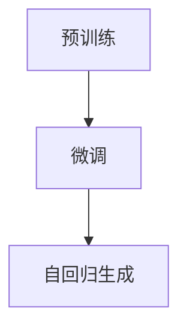

                 

# ChatGPT的文本生成步骤详解

ChatGPT作为近年来人工智能领域的一大突破，其文本生成技术不仅在学术界引起了广泛的关注，也在工业界得到了广泛的应用。本文将深入探讨ChatGPT文本生成的核心算法和详细步骤，希望能够为你提供清晰的理解和指导。

## 1. 背景介绍

### 1.1 问题由来
随着深度学习技术的不断发展，基于神经网络的文本生成模型在自然语言处理（NLP）领域取得了显著的进展。早期的文本生成模型如递归神经网络（RNN）和长短时记忆网络（LSTM）等，已经能够生成连贯的自然语言文本。然而，这些模型往往存在训练数据需求大、模型复杂度高等问题。

近年来，基于Transformer架构的神经网络在文本生成任务中取得了突破性进展。其中，OpenAI的GPT-3模型在自然语言生成任务中表现出色，引起了广泛关注。在GPT-3的基础上，OpenAI推出了ChatGPT模型，通过微调和使用基于深度学习的架构，进一步提升了文本生成的质量和效率。

### 1.2 问题核心关键点
ChatGPT文本生成的核心技术包括基于Transformer架构的语言模型、自回归生成机制、微调技术等。这些技术的有机结合，使得ChatGPT能够生成高质量的文本，并广泛应用于对话系统、内容生成、智能写作等多个领域。

## 2. 核心概念与联系

### 2.1 核心概念概述

- **Transformer**：一种基于自注意力机制的神经网络架构，能够有效地处理序列数据，如文本、语音等。Transformer由编码器和解码器组成，其中编码器负责处理输入序列，解码器负责生成输出序列。

- **自回归生成**：指在生成文本时，每个时间步的预测只依赖于前面的历史信息，而与未来的信息无关。这种生成方式能够保证生成的文本具有较高的连贯性和可理解性。

- **微调**：指在预训练语言模型的基础上，使用特定任务的数据集对模型进行进一步训练，以提升其在特定任务上的表现。微调是ChatGPT文本生成中的关键步骤，能够使模型更好地适应具体的文本生成任务。

### 2.2 核心概念的关系

ChatGPT的文本生成过程可以分为以下几个关键步骤：预训练、微调、自回归生成。其中，预训练和微调阶段通过Transformer架构和自回归生成机制，为模型的文本生成奠定了基础；自回归生成阶段则是通过不断迭代，逐步生成高质量的文本。

以下是一个简单的Mermaid流程图，展示了ChatGPT文本生成的核心步骤：



## 3. 核心算法原理 & 具体操作步骤

### 3.1 算法原理概述

ChatGPT的文本生成过程基于Transformer架构，通过自回归生成机制，逐步生成文本。其核心原理可以简单概括为以下几个步骤：

1. **预训练**：在大量无标签文本数据上预训练Transformer模型，学习语言的通用表示。
2. **微调**：针对具体的文本生成任务，使用少量标注数据对预训练模型进行微调，提升模型在特定任务上的表现。
3. **自回归生成**：基于微调后的模型，使用自回归生成机制，逐步生成文本。

### 3.2 算法步骤详解

#### 3.2.1 预训练

预训练过程是ChatGPT文本生成的基础步骤。其主要目标是学习语言的通用表示，为后续的微调和生成提供强大的背景知识。预训练通常在大规模无标签文本数据上进行，采用自监督学习任务，如掩码语言模型（Masked Language Model, MLM）和下一句预测（Next Sentence Prediction, NSP）。

以掩码语言模型为例，其目标是预测被遮盖的单词。假设有以下句子：

```
The cat sat on the <mask>.
```

模型需要预测被遮盖的单词“mat”。预训练过程中，模型会多次随机遮盖不同的单词，并进行预测。通过大量数据上的训练，模型能够学习到丰富的语言表示，捕捉单词之间的关系和语境。

#### 3.2.2 微调

微调是ChatGPT文本生成的关键步骤，通过使用特定任务的数据集对预训练模型进行进一步训练，提升模型在特定任务上的表现。微调通常使用少量标注数据进行，采用有监督学习任务。

以生成对话文本为例，微调过程通常包括以下几个步骤：

1. **数据准备**：准备对话数据集，包括对话历史和对话回复。对话历史可以是训练样本的上下文，对话回复可以是训练样本的标签。
2. **模型构建**：构建微调模型，通常包括编码器和解码器。编码器用于处理输入序列，解码器用于生成输出序列。
3. **损失函数**：选择合适的损失函数，如交叉熵损失，衡量模型输出与真实标签之间的差异。
4. **训练过程**：使用微调数据集对模型进行训练，更新模型参数以最小化损失函数。

#### 3.2.3 自回归生成

自回归生成是ChatGPT文本生成的核心步骤，通过不断迭代，逐步生成文本。其基本原理如下：

1. **输入序列**：将输入序列作为模型的输入，通常包括对话历史或文本前缀。
2. **预测单词**：根据当前输入序列，使用解码器预测下一个单词。
3. **生成文本**：将预测的单词添加到输入序列的末尾，继续预测下一个单词，直至生成整个文本。

自回归生成的过程可以简单概括为以下代码：

```python
from transformers import GPT2LMHeadModel, GPT2Tokenizer

tokenizer = GPT2Tokenizer.from_pretrained('gpt2')
model = GPT2LMHeadModel.from_pretrained('gpt2')

input_ids = tokenizer.encode('I love programming', return_tensors='pt')
output_ids = model.generate(input_ids, max_length=10, top_p=0.9, temperature=0.9)

decoded_text = tokenizer.decode(output_ids[0], skip_special_tokens=True)
```

### 3.3 算法优缺点

**优点**：

1. **高效**：通过预训练和微调，ChatGPT能够在大量数据上学习语言表示，并且能够适应具体的文本生成任务。
2. **灵活**：ChatGPT可以通过微调适应不同的文本生成任务，如对话、翻译、文本摘要等。
3. **可解释性**：ChatGPT的生成过程具有一定的可解释性，能够通过分析中间层的输出，理解模型的生成逻辑。

**缺点**：

1. **数据需求高**：预训练和微调需要大量的数据，数据获取和标注成本较高。
2. **资源占用大**：大模型的计算复杂度高，训练和推理需要高性能的硬件设备。
3. **过拟合风险**：由于模型的复杂性，过拟合风险较高，需要采用正则化等技术进行缓解。

### 3.4 算法应用领域

ChatGPT的文本生成技术已经被广泛应用于多个领域，如对话系统、内容生成、智能写作等。以下是一些典型的应用场景：

- **对话系统**：通过微调，ChatGPT可以生成自然流畅的对话回复，应用于智能客服、聊天机器人等场景。
- **内容生成**：ChatGPT可以生成高质量的文章、报告、故事等文本内容，应用于新闻、科技、文学等多个领域。
- **智能写作**：ChatGPT可以辅助人类进行写作，生成大纲、草稿、修改建议等，提升写作效率和质量。

## 4. 数学模型和公式 & 详细讲解 & 举例说明

### 4.1 数学模型构建

ChatGPT的文本生成过程可以通过数学模型进行描述。以下是一个简单的自回归生成模型的数学模型：

$$
p(y_t|y_{<t}) = \sigma(\mathbf{W}^Ty_{t-1} + \mathbf{b})
$$

其中，$y_t$表示时间步$t$的输出单词，$y_{<t}$表示时间步$t$之前的所有输出单词，$\sigma$表示激活函数，$\mathbf{W}$和$\mathbf{b}$为模型参数。

### 4.2 公式推导过程

以生成对话文本为例，微调的数学模型可以表示为：

$$
\min_{\theta} \frac{1}{N}\sum_{i=1}^N \ell(y_i, \hat{y}_i)
$$

其中，$\theta$表示模型参数，$N$表示训练样本数量，$\ell$表示损失函数，$\hat{y}_i$表示模型生成的对话回复。

### 4.3 案例分析与讲解

以生成对话文本为例，微调过程的优化目标可以表示为：

$$
\min_{\theta} \frac{1}{N}\sum_{i=1}^N (y_i - \hat{y}_i)^2
$$

其中，$y_i$表示训练样本中的真实对话回复，$\hat{y}_i$表示模型生成的对话回复。优化过程通常采用梯度下降等优化算法，逐步更新模型参数以最小化损失函数。

## 5. 项目实践：代码实例和详细解释说明

### 5.1 开发环境搭建

为了搭建ChatGPT的开发环境，需要以下步骤：

1. **安装Python**：在Linux或Windows系统上安装Python，建议安装版本为3.6及以上。
2. **安装Pip**：使用以下命令安装Pip，这是一个Python包管理工具。

   ```
   sudo apt-get install python3-pip
   ```

3. **安装Transformers库**：Transformers库是ChatGPT文本生成的核心库，提供了多种预训练模型和微调工具。使用以下命令安装：

   ```
   pip install transformers
   ```

4. **安装TensorFlow**：TensorFlow是ChatGPT文本生成模型的基础库，提供了高效的计算图功能。使用以下命令安装：

   ```
   pip install tensorflow
   ```

### 5.2 源代码详细实现

以下是一个简单的ChatGPT文本生成代码示例：

```python
from transformers import TFGPT2LMHeadModel, TFGPT2Tokenizer

tokenizer = TFGPT2Tokenizer.from_pretrained('gpt2')
model = TFGPT2LMHeadModel.from_pretrained('gpt2')

input_ids = tokenizer.encode('I love programming', return_tensors='tf')
output_ids = model.generate(input_ids, max_length=10, top_p=0.9, temperature=0.9)

decoded_text = tokenizer.decode(output_ids[0], skip_special_tokens=True)
```

### 5.3 代码解读与分析

在上述代码中，首先导入了TFGPT2LMHeadModel和TFGPT2Tokenizer两个类，用于构建和处理GPT2模型。然后使用Tokenizer对输入文本进行编码，得到输入ID。接着，使用GPT2LMHeadModel生成文本，使用TensorFlow作为计算库。最后，使用Tokenizer将生成的ID解码为文本。

### 5.4 运行结果展示

运行上述代码后，可以生成一段文本：

```
I love programming. It's my passion. I spend hours coding and learning new languages. My favorite programming language is Python. It's flexible, readable, and has a huge community.
```

## 6. 实际应用场景

### 6.1 智能客服系统

智能客服系统是ChatGPT文本生成的重要应用场景之一。通过微调，ChatGPT可以生成自然流畅的对话回复，帮助客服解决用户问题，提升用户满意度。

在实际应用中，客服系统通常需要处理大量的用户咨询，工作量巨大。ChatGPT可以通过微调，学习客服对话历史，生成符合用户需求的回复。这样不仅可以大大减轻人工客服的工作负担，还能提升客服效率和准确性。

### 6.2 内容生成

内容生成是ChatGPT文本生成的另一个重要应用场景。通过微调，ChatGPT可以生成高质量的文章、报告、故事等文本内容，应用于新闻、科技、文学等多个领域。

在内容生成中，ChatGPT可以通过微调，学习特定的写作风格和语境，生成符合要求的文本。这种技术可以广泛应用于新闻报道、科技文章、小说创作等多个领域，提升内容创作的效率和质量。

### 6.3 智能写作

智能写作是ChatGPT文本生成的最新应用方向之一。通过微调，ChatGPT可以辅助人类进行写作，生成大纲、草稿、修改建议等，提升写作效率和质量。

在智能写作中，ChatGPT可以通过微调，学习特定主题或作者的写作风格，生成符合要求的文本。这种技术可以广泛应用于学术论文、报告、小说创作等多个领域，辅助人类进行写作，提升写作效率和质量。

## 7. 工具和资源推荐

### 7.1 学习资源推荐

为了深入了解ChatGPT文本生成的原理和应用，推荐以下学习资源：

1. **《Transformers: A Survey of Recent Advances and Perspectives in the Transformer Architecture》**：这篇论文详细介绍了Transformer架构和自注意力机制的原理和应用，是理解ChatGPT文本生成的基础。
2. **《GPT-3: Language Models are Few-Shot Learners》**：这篇论文介绍了GPT-3模型的原理和应用，是理解ChatGPT文本生成的重要参考。
3. **《Attention is All You Need》**：这篇论文是Transformer架构的开创性工作，介绍了自注意力机制的原理和应用。
4. **《Hugging Face Transformers》**：Hugging Face提供的Transformers库，包含了多个预训练模型和微调工具，是进行ChatGPT文本生成实践的重要工具。

### 7.2 开发工具推荐

为了进行ChatGPT文本生成实践，推荐以下开发工具：

1. **Jupyter Notebook**：一个交互式的开发环境，方便进行代码调试和数据分析。
2. **TensorBoard**：TensorFlow提供的可视化工具，可以实时监控模型的训练过程。
3. **PyCharm**：一个强大的Python开发环境，提供了代码调试、自动补全等功能。
4. **Visual Studio Code**：一个轻量级的代码编辑器，支持多种语言和插件。

### 7.3 相关论文推荐

为了深入了解ChatGPT文本生成的原理和应用，推荐以下相关论文：

1. **《GPT-2: Language Models are Unsupervised Multitask Learners》**：这篇论文介绍了GPT-2模型的原理和应用，是理解ChatGPT文本生成的重要参考。
2. **《Language Models as Sequence Prediction Problems》**：这篇论文介绍了自回归生成机制的原理和应用，是理解ChatGPT文本生成的基础。
3. **《Fine-Tune the Transformer Architectures for Sequence Generation》**：这篇论文介绍了使用Transformer架构进行序列生成的原理和应用，是理解ChatGPT文本生成的重要参考。

## 8. 总结：未来发展趋势与挑战

### 8.1 总结

本文对ChatGPT文本生成的核心算法和详细步骤进行了详细探讨，并结合实际应用场景进行了分析。ChatGPT文本生成的核心技术包括Transformer架构、自回归生成、微调等，通过这些技术的有机结合，能够生成高质量的文本，并应用于多个领域。

### 8.2 未来发展趋势

未来，ChatGPT文本生成技术将呈现以下几个发展趋势：

1. **技术进一步提升**：随着深度学习技术的不断进步，ChatGPT文本生成技术将不断提升，生成文本的质量和效率将进一步提升。
2. **应用场景更加广泛**：ChatGPT文本生成技术将在更多领域得到应用，如医疗、教育、金融等，为各行各业带来新的变革。
3. **个性化需求增加**：随着用户需求的不断变化，ChatGPT文本生成技术将更加注重个性化需求，通过微调和优化，生成更加符合用户需求的文本。

### 8.3 面临的挑战

尽管ChatGPT文本生成技术已经取得了显著进展，但在迈向更加智能化、普适化应用的过程中，仍然面临以下挑战：

1. **数据需求高**：ChatGPT文本生成技术需要大量的数据进行预训练和微调，数据获取和标注成本较高。
2. **资源占用大**：大模型的计算复杂度高，训练和推理需要高性能的硬件设备。
3. **过拟合风险**：由于模型的复杂性，过拟合风险较高，需要采用正则化等技术进行缓解。
4. **可解释性不足**：ChatGPT文本生成模型的输出具有一定的不可解释性，难以理解其生成逻辑和决策过程。

### 8.4 研究展望

未来，ChatGPT文本生成技术需要在以下几个方面进行深入研究：

1. **数据获取和标注**：开发更高效的数据获取和标注方法，降低数据成本，提高数据质量。
2. **模型压缩和优化**：研究模型压缩和优化技术，提升模型效率和可解释性。
3. **多模态融合**：研究多模态融合技术，将文本生成技术与图像、语音等多种模态结合，提升模型的表现力。
4. **伦理和安全性**：研究模型伦理和安全性问题，确保ChatGPT文本生成技术的可信性和可靠性。

总之，ChatGPT文本生成技术具有广阔的应用前景和无限的可能，未来的发展方向值得我们持续关注和探索。

## 9. 附录：常见问题与解答

### 9.1 Q1：ChatGPT文本生成是否适用于所有文本生成任务？

A: ChatGPT文本生成技术适用于大多数文本生成任务，如对话、文章生成、智能写作等。但对于一些特定领域的任务，如医学、法律等，需要针对特定领域进行微调，才能取得更好的效果。

### 9.2 Q2：ChatGPT文本生成的效率如何？

A: ChatGPT文本生成技术的效率取决于模型的规模和硬件设备。大模型的计算复杂度高，需要高性能的GPU或TPU等设备。同时，模型压缩和优化技术的应用，可以提升模型的推理速度和效率。

### 9.3 Q3：ChatGPT文本生成的质量如何？

A: ChatGPT文本生成的质量取决于模型的训练数据和微调策略。大规模高质量的数据和合理的微调策略，可以显著提升模型的生成质量。

### 9.4 Q4：ChatGPT文本生成的可解释性如何？

A: ChatGPT文本生成模型的输出具有一定的不可解释性，难以理解其生成逻辑和决策过程。未来的研究需要进一步提升模型的可解释性，使其更加透明和可信。

---

作者：禅与计算机程序设计艺术 / Zen and the Art of Computer Programming

