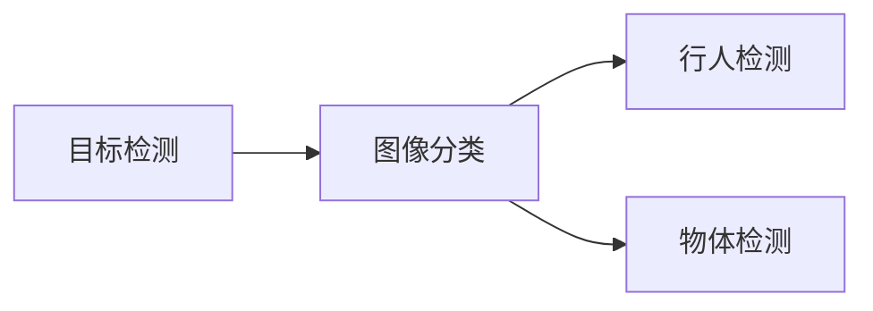

                 

# Computer Vision Techniques 原理与代码实战案例讲解

> 关键词：计算机视觉,卷积神经网络,图像分类,目标检测,图像分割,生成对抗网络

## 1. 背景介绍

计算机视觉(Computer Vision, CV)作为人工智能的一个重要分支，涉及从图像和视频中提取、处理和理解信息的技术。其应用广泛，涵盖了自动驾驶、医疗影像分析、安防监控、社交媒体、机器人视觉、增强现实等众多领域。

近年来，随着深度学习技术的快速发展，计算机视觉领域取得了巨大的突破。尤其是基于卷积神经网络(Convolutional Neural Network, CNN)的方法，极大地提升了图像处理和分析的性能，推动了计算机视觉技术的实际应用。

然而，尽管深度学习在计算机视觉领域取得了显著的成就，但在实际应用中仍面临诸多挑战，包括算法效率、模型可解释性、计算资源等。因此，如何高效、准确地处理图像数据，同时保证模型的可解释性和计算效率，成为计算机视觉研究的重要课题。

本文将系统介绍计算机视觉领域的核心技术和应用案例，并详细讲解其数学原理和代码实现，为计算机视觉技术的工程实践提供参考。

## 2. 核心概念与联系

### 2.1 核心概念概述

为更好地理解计算机视觉的原理和应用，本节将介绍几个密切相关的核心概念：

- **卷积神经网络(CNN)**：以卷积层和池化层为代表的深度神经网络架构，在图像识别和分类任务中表现出色。CNN通过卷积操作提取图像的局部特征，并通过池化操作进行特征压缩，最后通过全连接层进行分类或回归。

- **图像分类**：将输入的图像归为预定义的多个类别之一。图像分类是计算机视觉的基础任务，广泛应用于物体识别、人脸识别等领域。

- **目标检测**：不仅对图像进行分类，还需定位出具体目标的位置。目标检测常用于自动驾驶、安防监控、无人机等场景，识别出车辆、行人、物体等关键对象。

- **图像分割**：将图像划分成若干个区域，每个区域对应一个特定的类别。图像分割常用于医疗影像分析、自然灾害监测、自动驾驶等领域，提高视觉信息的准确性和精细度。

- **生成对抗网络(GAN)**：由生成器和判别器组成的两层神经网络，生成器学习生成逼真的图像，判别器学习判别生成图像与真实图像的区别。GAN被广泛应用于图像生成、数据增强、图像修复等任务。

这些核心概念之间的逻辑关系可以通过以下Mermaid流程图来展示：

```mermaid
graph TB
    A[卷积神经网络(CNN)] --> B[图像分类]
    A --> C[目标检测]
    A --> D[图像分割]
    A --> E[生成对抗网络(GAN)]
    B --> F[物体识别]
    C --> G[行人检测]
    D --> H[医学影像分析]
    E --> I[图像生成]
```

这个流程图展示了几大核心概念及其之间的关系：

1. 卷积神经网络是图像分类、目标检测、图像分割和图像生成的基础。
2. 图像分类常用于物体识别、人脸识别等任务。
3. 目标检测常用于自动驾驶、安防监控、无人机等场景，识别出车辆、行人、物体等关键对象。
4. 图像分割常用于医疗影像分析、自然灾害监测、自动驾驶等领域，提高视觉信息的准确性和精细度。
5. 生成对抗网络被广泛应用于图像生成、数据增强、图像修复等任务。

### 2.2 概念间的关系

这些核心概念之间存在着紧密的联系，形成了计算机视觉技术的完整生态系统。下面我们通过几个Mermaid流程图来展示这些概念之间的关系。

#### 2.2.1 计算机视觉的学习范式

```mermaid
graph TB
    A[深度学习] --> B[卷积神经网络(CNN)]
    B --> C[图像分类]
    C --> D[物体识别]
    A --> E[生成对抗网络(GAN)]
    E --> F[图像生成]
    F --> G[数据增强]
    C --> H[目标检测]
    C --> I[图像分割]
    A --> J[半监督学习]
    C --> K[多任务学习]
    C --> L[跨模态学习]
```

这个流程图展示了计算机视觉的学习范式，包括卷积神经网络、图像分类、目标检测、图像分割、生成对抗网络等。

#### 2.2.2 目标检测与图像分类



这个流程图展示了目标检测和图像分类之间的关系。目标检测通常需要分类任务的支持，用于识别和定位多个物体。

#### 2.2.3 生成对抗网络与图像生成

```mermaid
graph TB
    A[生成对抗网络(GAN)] --> B[图像生成]
    B --> C[超分辨率]
    B --> D[风格迁移]
    B --> E[图像修复]
    A --> F[数据增强]
```

这个流程图展示了生成对抗网络在图像生成、数据增强、图像修复等任务中的应用。

### 2.3 核心概念的整体架构

最后，我们用一个综合的流程图来展示这些核心概念在大规模图像数据处理中的整体架构：

```mermaid
graph TB
    A[大规模图像数据] --> B[预处理]
    B --> C[卷积神经网络(CNN)]
    C --> D[图像分类]
    C --> E[目标检测]
    C --> F[图像分割]
    D --> G[物体识别]
    E --> H[行人检测]
    F --> I[医学影像分析]
    C --> J[生成对抗网络(GAN)]
    J --> K[图像生成]
    J --> L[数据增强]
    J --> M[图像修复]
```

这个综合流程图展示了从大规模图像数据预处理到生成对抗网络应用的完整过程。计算机视觉技术通过多层次的特征提取、分类、检测、分割和生成，逐步提升图像处理和分析的精度和广度。

## 3. 核心算法原理 & 具体操作步骤

### 3.1 算法原理概述

计算机视觉的核心算法主要是基于深度学习的方法，包括卷积神经网络、循环神经网络、生成对抗网络等。这些算法通过多层次的特征提取、分类、检测、分割和生成，逐步提升图像处理和分析的精度和广度。

#### 3.1.1 卷积神经网络(CNN)

卷积神经网络是计算机视觉领域的基础算法。其核心思想是通过卷积层和池化层提取图像的局部特征，并通过全连接层进行分类或回归。卷积层通过卷积核对图像进行特征提取，池化层用于特征压缩和降维，全连接层将特征映射到输出类别。

#### 3.1.2 图像分类

图像分类是最基础的计算机视觉任务，通过训练一个分类器，将输入的图像归为预定义的多个类别之一。常用的图像分类方法包括卷积神经网络、残差网络、注意力机制等。

#### 3.1.3 目标检测

目标检测不仅对图像进行分类，还需定位出具体目标的位置。目标检测常用于自动驾驶、安防监控、无人机等场景，识别出车辆、行人、物体等关键对象。常用的目标检测方法包括区域提议网络(RPN)、单阶段目标检测器(Faster R-CNN)、YOLO等。

#### 3.1.4 图像分割

图像分割是将图像划分成若干个区域，每个区域对应一个特定的类别。图像分割常用于医疗影像分析、自然灾害监测、自动驾驶等领域，提高视觉信息的准确性和精细度。常用的图像分割方法包括全卷积网络(FCN)、U-Net、Mask R-CNN等。

#### 3.1.5 生成对抗网络(GAN)

生成对抗网络由生成器和判别器组成的两层神经网络，生成器学习生成逼真的图像，判别器学习判别生成图像与真实图像的区别。GAN被广泛应用于图像生成、数据增强、图像修复等任务。常用的生成对抗网络包括DCGAN、WGAN、CycleGAN等。

### 3.2 算法步骤详解

#### 3.2.1 卷积神经网络(CNN)

1. **网络结构设计**：根据任务需求设计卷积神经网络的结构，包括卷积层、池化层、全连接层等。
2. **网络初始化**：使用随机权重或预训练权重初始化网络。
3. **数据准备**：将图像数据进行预处理，如归一化、裁剪、缩放等。
4. **训练过程**：使用随机梯度下降等优化算法，最小化损失函数，更新网络参数。
5. **评估测试**：在测试集上评估模型性能，调整网络结构和超参数。

#### 3.2.2 图像分类

1. **网络结构设计**：设计卷积神经网络的结构，添加分类层和全连接层。
2. **数据准备**：将图像数据进行预处理，如归一化、裁剪、缩放等。
3. **训练过程**：使用随机梯度下降等优化算法，最小化损失函数，更新网络参数。
4. **评估测试**：在测试集上评估模型性能，调整网络结构和超参数。

#### 3.2.3 目标检测

1. **网络结构设计**：设计单阶段或多阶段目标检测网络，如Faster R-CNN、YOLO等。
2. **数据准备**：将图像数据和标注数据进行预处理，如归一化、裁剪、缩放等。
3. **训练过程**：使用随机梯度下降等优化算法，最小化损失函数，更新网络参数。
4. **评估测试**：在测试集上评估模型性能，调整网络结构和超参数。

#### 3.2.4 图像分割

1. **网络结构设计**：设计卷积神经网络的结构，添加分割层和全连接层。
2. **数据准备**：将图像数据和标注数据进行预处理，如归一化、裁剪、缩放等。
3. **训练过程**：使用随机梯度下降等优化算法，最小化损失函数，更新网络参数。
4. **评估测试**：在测试集上评估模型性能，调整网络结构和超参数。

#### 3.2.5 生成对抗网络(GAN)

1. **网络结构设计**：设计生成器和判别器的网络结构，如DCGAN、WGAN等。
2. **数据准备**：准备生成器和判别器的训练数据。
3. **训练过程**：使用对抗训练等优化算法，最小化损失函数，更新网络参数。
4. **评估测试**：在测试集上评估生成图像的质量，调整网络结构和超参数。

### 3.3 算法优缺点

#### 3.3.1 卷积神经网络(CNN)

- **优点**：
  - 局部连接和参数共享：有效降低参数量，减少计算复杂度。
  - 平移不变性：不同位置的局部特征具有相同的表示。
  - 端到端训练：易于构建复杂的特征提取和分类模块。

- **缺点**：
  - 计算资源需求高：需要较大的GPU或TPU设备。
  - 对数据量要求高：需要大量标注数据进行预训练。
  - 模型可解释性差：难以解释网络内部的推理过程。

#### 3.3.2 图像分类

- **优点**：
  - 适用于小规模数据：训练速度快，计算资源需求低。
  - 可解释性高：通过简单的分类层和全连接层实现。

- **缺点**：
  - 精度受限于网络结构：模型过于复杂可能导致过拟合。
  - 数据偏差：训练数据的选择和标注对模型性能影响较大。

#### 3.3.3 目标检测

- **优点**：
  - 适用于复杂场景：同时处理分类和定位任务。
  - 适应性强：可以处理多种目标和复杂背景。

- **缺点**：
  - 计算资源需求高：需要较大的GPU或TPU设备。
  - 训练复杂度高：需要更多的标注数据和超参数调整。

#### 3.3.4 图像分割

- **优点**：
  - 提供像素级别的分类：提高视觉信息的准确性。
  - 适用于高精度要求的任务：如医疗影像分析。

- **缺点**：
  - 计算资源需求高：需要较大的GPU或TPU设备。
  - 对数据量要求高：需要大量标注数据进行预训练。

#### 3.3.5 生成对抗网络(GAN)

- **优点**：
  - 生成高质量的图像：生成逼真的图像样本。
  - 数据增强：通过生成对抗网络扩充训练数据。

- **缺点**：
  - 训练复杂度高：需要调整生成器和判别器的网络结构和超参数。
  - 生成图像的多样性不足：易产生模式崩溃等问题。

### 3.4 算法应用领域

计算机视觉技术在各个领域都有广泛的应用，包括但不限于：

- **自动驾驶**：通过图像分类、目标检测和图像分割等技术，实现环境感知和决策支持。
- **安防监控**：通过目标检测和图像分割技术，实现行为分析和异常检测。
- **医疗影像**：通过图像分类和图像分割技术，实现疾病诊断和影像分析。
- **社交媒体**：通过图像分类和目标检测技术，实现用户行为分析和内容审核。
- **增强现实**：通过图像生成和数据增强技术，实现虚拟物体和实物的融合。

## 4. 数学模型和公式 & 详细讲解 & 举例说明

### 4.1 数学模型构建

本节将通过几个核心算法的数学模型构建，来详细讲解其原理和应用。

#### 4.1.1 卷积神经网络(CNN)

卷积神经网络的核心思想是通过卷积层和池化层提取图像的局部特征，并通过全连接层进行分类或回归。

卷积神经网络的结构可以表示为：

$$
h = \sigma(W_2 \cdot h^{(1)} + b_2)
$$

其中，$h$为卷积层的输出，$h^{(1)}$为前一层的输出，$W_2$为卷积核权重，$b_2$为偏置项，$\sigma$为激活函数。

池化层用于特征压缩和降维，常用的池化操作包括最大池化和平均池化：

$$
h = \max(W_3 \cdot h^{(2)} + b_3) \quad \text{或} \quad h = \frac{1}{N} \sum_{i=1}^N W_3 \cdot h^{(2)} + b_3
$$

其中，$h$为池化层的输出，$h^{(2)}$为前一层的输出，$W_3$为池化核权重，$b_3$为偏置项。

全连接层用于将特征映射到输出类别：

$$
z = W_O \cdot h^{(n)} + b_O
$$

其中，$z$为全连接层的输出，$h^{(n)}$为卷积层的输出，$W_O$为权重矩阵，$b_O$为偏置项。

#### 4.1.2 图像分类

图像分类任务的目标是将输入的图像归为预定义的多个类别之一。常用的分类模型包括LeNet、AlexNet、VGG、ResNet等。

以AlexNet模型为例，其结构如图：

```
   +-------------+      +---------+
   | Input Image | ->  |  Layer1  |
   +-------------+      +---------+
                |           |
                |         |  |
                |       +  |  |
                |    |    |  |
                |  +---+---+  |
                |  |    |    |
                |  |    |    |
   +-------------+      +---------+
                |           |
                |         |  |
                |       +  |  |
                |    |    |  |
                |  +---+---+  |
                |  |    |    |
                |  |    |    |
   +-------------+      +---------+
```

其中，Layer1为卷积层，Layer2为池化层，Layer3和Layer4为卷积层，Layer5为全连接层。

#### 4.1.3 目标检测

目标检测任务不仅对图像进行分类，还需定位出具体目标的位置。常用的目标检测模型包括Faster R-CNN、YOLO等。

以Faster R-CNN模型为例，其结构如图：

```
   +-------------+      +---------+      +---------+
   | Input Image | ->  |  Layer1  |      | Region Proposal | -> | RoI Pooling |
   +-------------+      +---------+      +---------+      +---------+
                |           |           |           |           |           |
                |         |           |           |           |           |
                |       +  |  |  Layer2  |           |           |           |
                |    |    |           |           |           |           |
                |  +---+---+           |           |           |           |
                |  |    |    |           |           |           |           |
                |  |    |    |           |           |           |           |
   +-------------+      +---------+      +---------+      +---------+
                |           |           |           |           |           |
                |         |           |           |           |           |
                |       +  |  |  Layer3  |           |           |           |
                |    |    |           |           |           |           |
                |  +---+---+           |           |           |           |
                |  |    |    |           |           |           |           |
                |  |    |    |           |           |           |           |
   +-------------+      +---------+      +---------+      +---------+
```

其中，Layer1为卷积层，Layer2为池化层，Layer3为卷积层，Layer4为全连接层，RoI Pooling用于将区域内图像提取为固定大小的特征图。

#### 4.1.4 图像分割

图像分割任务是将图像划分成若干个区域，每个区域对应一个特定的类别。常用的分割模型包括U-Net、FCN等。

以U-Net模型为例，其结构如图：

```
   +-------------+      +---------+      +---------+
   | Input Image | ->  |  Layer1  |      |  Layer2  |
   +-------------+      +---------+      +---------+
                |           |           |           |
                |         |           |           |
                |       +  |  |  Layer3  |           |
                |    |    |           |           |
                |  +---+---+           |           |
                |  |    |    |           |           |
                |  |    |    |           |           |
   +-------------+      +---------+      +---------+
                |           |           |           |
                |         |           |           |
                |       +  |  |  Layer4  |           |
                |    |    |           |           |
                |  +---+---+           |           |
                |  |    |    |           |           |
                |  |    |    |           |           |
   +-------------+      +---------+      +---------+
```

其中，Layer1和Layer2为卷积层，Layer3和Layer4为卷积层和全连接层。

#### 4.1.5 生成对抗网络(GAN)

生成对抗网络由生成器和判别器组成的两层神经网络，生成器学习生成逼真的图像，判别器学习判别生成图像与真实图像的区别。

以DCGAN模型为例，其结构如图：

```
  +-------------------+      +--------------+      +--------------+
  |   Generator       |      |   Discriminator  |      |   Generator  |
  +-------------------+      +--------------+      +--------------+
          |             |        |               |        |             |
          |    +--------+  |        |     +--------+  |            |
          |    |        |  |        |     |        |  |            |
          |    |        |  |        |     |        |  |            |
  +---------------+   |        |  +---------------+        +---------------+
  |               |   |        |  |               |        |               |
  |  Convolution   |   |        |  |  Convolution   |        |  Convolution  |
  |               |   |        |  |               |        |               |
  +---------------+   |        |  +---------------+        +---------------+
          |             |        |               |        |             |
          |    +--------+  |        |     +--------+  |            |
          |    |        |  |        |     |        |  |            |
          |    |        |  |        |     |        |  |            |
  +-------------------+      +--------------+      +--------------+
```

其中，Generator用于生成逼真的图像，Discriminator用于判别生成图像与真实图像的区别。

### 4.2 公式推导过程

#### 4.2.1 卷积神经网络(CNN)

卷积神经网络的核心思想是通过卷积层和池化层提取图像的局部特征，并通过全连接层进行分类或回归。

以AlexNet模型为例，其前向传播过程如图：

```
   +-------------+      +---------+      +---------+
   | Input Image | ->  |  Layer1  |      | Region Proposal |
   +-------------+      +---------+      +---------+
                |           |           |           |           |
                |         |           |           |           |           |
                |       +  |  |  Layer2  |           |           |           |
                |    |    |           |           |           |           |
                |  +---+---+           |           |           |           |
                |  |    |    |           |           |           |           |
                |  |    |    |           |           |           |           |
   +-------------+      +---------+      +---------+
                |           |           |           |           |           |
                |         |           |           |           |           |
                |       +  |  |  Layer3  |           |           |           |
                |    |    |           |           |           |           |
                |  +---+---+           |           |           |           |
                |  |    |    |           |           |           |           |
                |  |    |    |           |           |           |           |
   +-------------+      +---------+      +---------+
                |           |           |           |           |           |
                |         |           |           |           |           |
                |       +  |  |  Layer4  |           |           |           |
                |    |    |           |           |           |           |
                |  +---+---+           |           |           |           |
                |  |    |    |           |           |           |           |
                |  |    |    |           |           |           |           |
   +-------------+      +---------+      +---------+
                |           |           |           |           |           |
                |         |           |           |           |           |
                |       +  |  |  Layer5  |           |           |           |
                |    |    |           |           |           |           |
                |  +---+---+           |           |           |           |
                |  |    |    |           |           |           |           |
                |  |    |    |           |           |           |           |
   +-------------+      +---------+      +---------+
                |           |           |           |           |           |
                |         |           |           |           |           |
                |       +  |  | Output  |           |           |           |
                |    |    |           |           |           |           |
                |  +---+---+           |           |           |           |
                |  |    |    |           |           |           |           |
                |  |    |    |           |           |           |           |
   +-------------+      +---------+      +---------+
```

其中，Layer1为卷积层，Layer2为池化层，Layer3为卷积层，Layer4为全连接层，Layer5为分类层。

#### 4.2.2 图像分类

图像分类任务的目标是将输入的图像归为预定义的多个类别之一。常用的分类模型包括LeNet、AlexNet、VGG、ResNet等。

以LeNet模型为例，其前向传播过程如图：

```
   +-------------+      +---------+      +---------+
   | Input Image | ->  |  Layer1  |      |  Layer2  |
   +-------------+      +---------+      +---------+
                |           |           |           |           |
                |         |           |           |           |
                |       +  |  |  Layer3  |           |           |
                |    |    |           |           |           |
                |  +---+---+           |           |           |
                |  |    |    |           |           |           |
                |  |    |    |           |           |           |
   +-------------+      +---------+      +---------+
                |           |           |           |           |
                |         |           |           |           |
                |       +  |  |  Layer4  |           |           |
                |    |    |           |           |           |
                |  +---+---+           |           |           |
                |  |    |    |           |           |           |
                |  |    |    |           |           |           |
   +-------------+      +---------+      +---------+
                |           |           |           |           |
                |         |           |           |           |
                |       +  |  | Output  |

