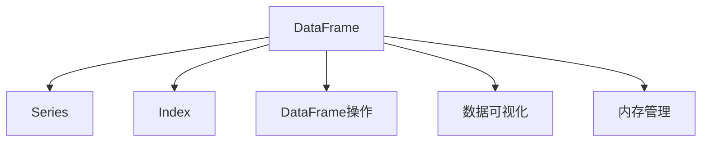
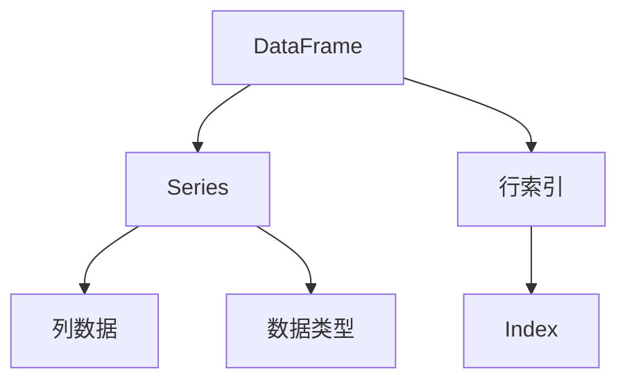
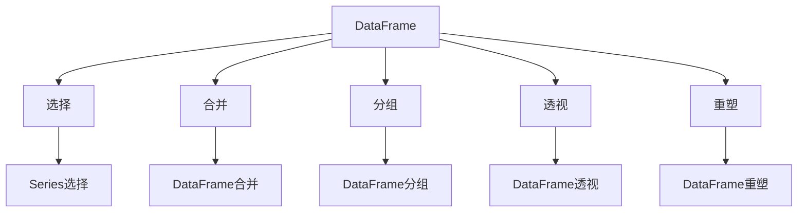
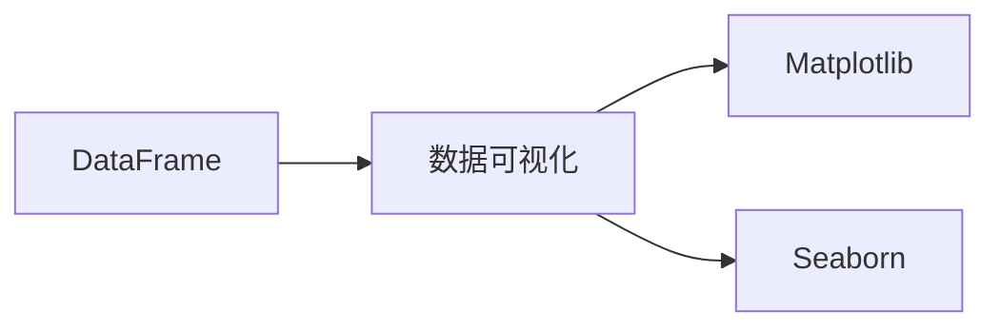
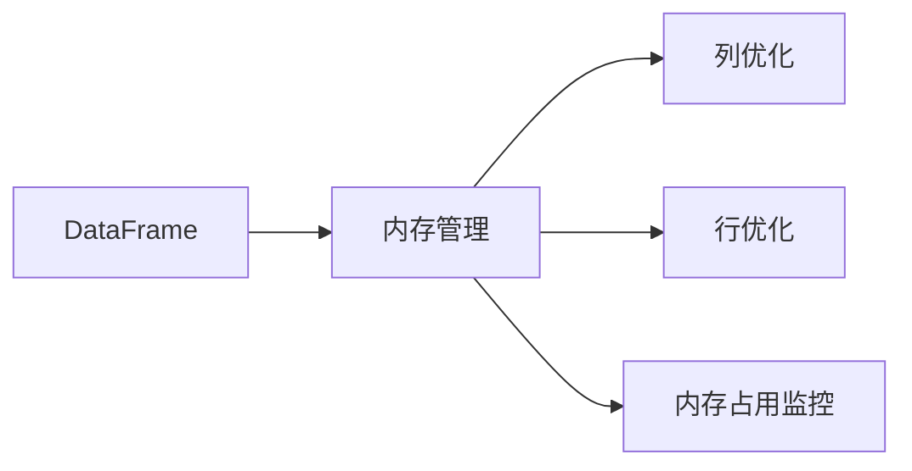
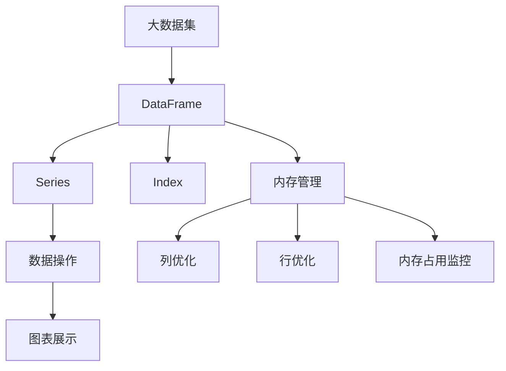

                 

# DataFrame 原理与代码实例讲解

> 关键词：DataFrame, 数据结构, 数据操作, 数据可视化, Pandas, 数据库, 内存管理

## 1. 背景介绍

### 1.1 问题由来
在数据科学和机器学习领域，数据处理和分析是至关重要的环节。传统的数据处理方式通常依赖于关系型数据库（如SQL），但这种范式对于非结构化数据和复杂数据操作往往显得繁琐。Pandas库中的DataFrame则提供了一种高效、灵活的数据结构，使得数据处理和分析变得更加简便。本文将详细介绍DataFrame的原理，并通过具体的代码实例，讲解其核心功能和使用方法。

### 1.2 问题核心关键点
Pandas的DataFrame是一种二维表格数据结构，通过多列和行组合形成了数据表格，可以存储、处理、操作和分析任意复杂的数据集。其核心特点包括：
1. 支持多种数据类型，如整数、浮点数、字符串、日期时间等。
2. 支持列标签（Column Labels），便于数据的索引和查询。
3. 支持行索引（Row Index），方便数据的定位和操作。
4. 支持复杂的数据操作，如数据合并、分组、透视、重塑等。
5. 提供丰富的数据分析工具，如统计分析、时间序列分析等。

Pandas的DataFrame不仅在数据科学和机器学习领域被广泛应用，还经常被用作数据挖掘、金融分析、科学计算等领域的数据处理工具。通过深入了解DataFrame的原理和使用方法，可以显著提升数据处理的效率和准确性。

## 2. 核心概念与联系

### 2.1 核心概念概述

为更好地理解DataFrame的原理和使用方法，本节将介绍几个密切相关的核心概念：

- **DataFrame**：Pandas库中的二维表格数据结构，可以存储、处理和分析复杂的数据集。
- **Series**：DataFrame的一维数组表示，类似于一维NumPy数组，支持索引操作。
- **Index**：DataFrame的行索引和列标签，支持快速定位和操作。
- **DataFrame操作**：包括数据加载、选择、合并、分组、透视、重塑、统计分析等。
- **数据可视化**：通过Matplotlib、Seaborn等库，将DataFrame中的数据进行可视化展示。
- **内存管理**：DataFrame在处理大型数据集时，需要注意内存管理和优化，避免内存溢出。

这些核心概念之间的逻辑关系可以通过以下Mermaid流程图来展示：



这个流程图展示了DataFrame的核心概念及其之间的关系：

1. DataFrame由Series组成，每个Series代表DataFrame的一列数据。
2. DataFrame通过Index实现行索引和列标签的快速定位和操作。
3. DataFrame支持多种数据操作，如选择、合并、分组等。
4. DataFrame的数据可以通过可视化工具进行展示。
5. DataFrame在处理大型数据集时，需要注意内存管理。

### 2.2 概念间的关系

这些核心概念之间存在着紧密的联系，形成了DataFrame的完整数据处理生态系统。下面我通过几个Mermaid流程图来展示这些概念之间的关系。

#### 2.2.1 DataFrame的数据结构



这个流程图展示了DataFrame的数据结构：

1. DataFrame由多个Series组成，每个Series代表DataFrame的一列数据。
2. 每个Series包含一组列数据，具有相应的数据类型。
3. DataFrame通过Index实现行索引的快速定位。
4. 行索引由Index对象表示，Index可以存储多种类型的数据。

#### 2.2.2 DataFrame的数据操作



这个流程图展示了DataFrame支持的主要数据操作：

1. DataFrame支持多种数据操作，如选择、合并、分组、透视、重塑等。
2. 选择操作可以选取DataFrame中的单列或多个列，返回Series对象。
3. 合并操作可以将多个DataFrame合并成一个，支持多种合并方式。
4. 分组操作可以对DataFrame进行分组统计，返回组内的聚合结果。
5. 透视操作可以将DataFrame按照指定的轴进行重排，生成多维数据视图。
6. 重塑操作可以改变DataFrame的形状，如旋转转置等。

#### 2.2.3 数据可视化的关系



这个流程图展示了DataFrame与数据可视化工具的关系：

1. DataFrame支持将数据可视化展示。
2. 数据可视化工具如Matplotlib和Seaborn，可以将DataFrame中的数据绘制成图表。
3. Matplotlib和Seaborn提供了丰富的绘图接口，支持多种类型的图表展示。

#### 2.2.4 内存管理的层次



这个流程图展示了DataFrame内存管理的层次：

1. DataFrame在处理大型数据集时，需要注意内存管理。
2. 列优化可以减小列的数据类型，减少内存占用。
3. 行优化可以使用稀疏数据结构，减少行数据的存储。
4. 内存占用监控可以帮助开发者了解DataFrame的内存使用情况，优化内存管理。

### 2.3 核心概念的整体架构

最后，我们用一个综合的流程图来展示这些核心概念在大数据处理中的整体架构：



这个综合流程图展示了从大数据集到DataFrame的整体处理过程：

1. 大数据集可以被转换为DataFrame结构。
2. DataFrame通过Series表示列数据，使用Index实现行索引。
3. DataFrame支持多种数据操作，可以生成图表展示数据。
4. DataFrame在处理大型数据集时，需要注意内存管理。
5. 内存管理可以通过列优化、行优化和内存占用监控等手段，减小内存占用。

## 3. 核心算法原理 & 具体操作步骤

### 3.1 算法原理概述

Pandas的DataFrame是一种高效的数据结构，能够处理多种复杂的数据操作。其核心原理如下：

1. **列数据与列标签（Series）**：DataFrame由多个Series组成，每个Series代表DataFrame的一列数据，包含一组列数据和相应的数据类型。Series支持索引操作，可以通过标签或数值索引数据。

2. **行索引与行标签（Index）**：DataFrame通过Index实现行索引，Index可以存储多种类型的数据。行索引用于快速定位和操作数据。

3. **数据操作**：DataFrame支持多种数据操作，如选择、合并、分组、透视、重塑等。这些操作可以方便地对数据进行加工和处理，生成新的DataFrame。

4. **内存管理**：DataFrame在处理大型数据集时，需要注意内存管理。通过列优化、行优化和内存占用监控等手段，可以减小内存占用，提高处理效率。

### 3.2 算法步骤详解

使用Pandas库的DataFrame进行数据处理和分析，一般包括以下几个关键步骤：

**Step 1: 数据加载与预处理**
- 使用Pandas的`read_csv`、`read_excel`等函数，将数据加载到DataFrame中。
- 对数据进行预处理，如处理缺失值、处理异常值、数据类型转换等。

**Step 2: 数据选择与过滤**
- 使用DataFrame的列选择和行过滤操作，选取需要的数据子集。
- 使用`loc`和`iloc`函数，根据标签和位置选择数据。
- 使用条件过滤函数，如`query`、`bool`函数，根据条件筛选数据。

**Step 3: 数据合并与分组**
- 使用`merge`、`concat`函数，将多个DataFrame合并成一个。
- 使用`groupby`函数，对数据进行分组统计，生成组内的聚合结果。

**Step 4: 数据透视与重塑**
- 使用`pivot_table`、`unstack`函数，将数据进行透视和重塑。
- 使用`stack`函数，将多级索引的DataFrame转换为一维的Series。

**Step 5: 数据聚合与统计**
- 使用`agg`、`apply`函数，对数据进行聚合和统计。
- 使用`describe`、`value_counts`函数，生成数据的基本统计量和频率分布。

**Step 6: 数据可视化**
- 使用Matplotlib、Seaborn等库，将数据进行可视化展示。
- 使用`plot`、`scatter`、`hist`等函数，生成不同类型的图表。

**Step 7: 内存管理**
- 使用`drop`、`compress`函数，减少数据的存储。
- 使用`set_index`、`reset_index`函数，优化内存使用。
- 使用`memory_usage`函数，监控DataFrame的内存占用情况。

以上是使用Pandas库进行DataFrame数据处理和分析的一般流程。在实际应用中，还需要根据具体任务的需求，对各个环节进行优化设计，以达到最佳的处理效果。

### 3.3 算法优缺点

Pandas的DataFrame具有以下优点：

1. **高效的数据操作**：支持多种数据操作，如选择、合并、分组、透视、重塑等，能够灵活处理各种复杂的数据集。
2. **易用的数据处理接口**：提供了丰富的函数接口，便于开发者进行数据预处理和分析。
3. **强大的数据可视化能力**：支持将数据绘制成图表，便于直观展示数据特征。
4. **灵活的内存管理**：提供了多种内存优化手段，可以在处理大型数据集时减小内存占用。

同时，Pandas的DataFrame也存在一些缺点：

1. **内存占用较大**：在处理大型数据集时，DataFrame的内存占用可能较大，需要注意内存管理。
2. **处理速度较慢**：对于非常大的数据集，DataFrame的处理速度可能较慢，需要使用分布式计算等手段。
3. **数据类型限制**：DataFrame对数据类型的限制较多，如只支持数值型、字符串型、日期时间型等，难以处理复杂的数据类型。
4. **灵活性不足**：对于非常复杂的数据结构和操作，Pandas的DataFrame可能不够灵活，需要结合其他工具和库进行补充。

尽管存在这些缺点，但Pandas的DataFrame仍是大数据处理和分析领域的重要工具，其高效、易用和灵活的特性，使其在数据分析和数据科学中广泛应用。

### 3.4 算法应用领域

Pandas的DataFrame被广泛应用于数据分析、数据挖掘、金融分析、科学计算等多个领域。以下是一些典型的应用场景：

- **数据分析与统计**：用于处理和分析各种类型的数据集，如金融数据、社交媒体数据、传感器数据等。
- **数据挖掘与机器学习**：用于数据预处理、特征工程、模型训练等机器学习任务，如构建分类、回归、聚类等模型。
- **金融分析**：用于处理和分析金融数据，如股票价格、交易量、财务报表等，进行财务分析、风险评估等任务。
- **科学计算与工程设计**：用于处理和分析各种科学数据，如物理模拟、工程设计、生物信息等。
- **数据可视化**：用于将数据绘制成图表，进行可视化展示，帮助开发者理解数据特征。

## 4. 数学模型和公式 & 详细讲解 & 举例说明

### 4.1 数学模型构建

Pandas的DataFrame是一种二维表格数据结构，可以存储和处理各种类型的数据。其数学模型可以表示为：

$$
\begin{bmatrix}
  a_{11} & a_{12} & a_{13} & \dots & a_{1n} \\
  a_{21} & a_{22} & a_{23} & \dots & a_{2n} \\
  \dots & \dots & \dots & \dots & \dots \\
  a_{m1} & a_{m2} & a_{m3} & \dots & a_{mn}
\end{bmatrix}
$$

其中，$a_{ij}$ 表示第 $i$ 行第 $j$ 列的数据，$i$ 表示行索引，$j$ 表示列标签。

### 4.2 公式推导过程

以一个简单的DataFrame为例，演示其数学模型的推导过程：

假设有如下的DataFrame：

$$
\begin{bmatrix}
  A & B \\
  C & D \\
  E & F
\end{bmatrix}
$$

其中，$A$、$B$、$C$、$D$、$E$、$F$ 分别表示DataFrame中的列数据，$A$ 表示第1行第1列的标签，$B$ 表示第1行第2列的标签，以此类推。

使用Pandas库的`read_csv`函数，可以将该DataFrame加载到Python中：

```python
import pandas as pd

df = pd.read_csv('data.csv', index_col='A')
```

其中，`index_col='A'` 表示将列 `A` 作为行索引。

### 4.3 案例分析与讲解

假设有一个包含学生成绩的DataFrame，包含姓名、年龄、性别、数学成绩和英语成绩等信息。数据格式如下：

```
Name    Age    Gender  Math Score  English Score
0      Alice   18      F            80            90
1      Bob     19      M            70            85
2      Charlie 20      M            75            78
3      David   22      M            90            88
4      Emma     21      F            85            95
```

使用Pandas库，可以对该DataFrame进行多种操作和分析，如数据加载、数据选择、数据聚合等。

**数据加载与预处理**

```python
import pandas as pd

df = pd.read_csv('scores.csv', index_col='Name')
df = df.set_index('Name')
df = df[['Age', 'Gender', 'Math Score', 'English Score']]
```

**数据选择与过滤**

```python
# 选择指定的列和行
subset = df[['Age', 'Gender', 'Math Score']]
subset = subset[subset['Gender'] == 'M']

# 根据条件过滤数据
subset = df[df['Math Score'] > 80]
```

**数据合并与分组**

```python
# 合并两个DataFrame
df1 = df.copy()
df2 = df.copy()
merged_df = pd.concat([df1, df2], ignore_index=True)

# 分组统计
grouped_df = df.groupby('Gender').mean()
```

**数据透视与重塑**

```python
# 透视操作
pivot_df = df.pivot_table(index='Name', columns='Gender', values='Math Score')

# 重塑操作
stacked_df = df.stack()

# 数据可视化
import matplotlib.pyplot as plt
import seaborn as sns

sns.lineplot(data=df, x='Age', y='Math Score', hue='Gender')
```

**内存管理**

```python
# 压缩数据
compressed_df = df.compress((df['Math Score'] > 70) & (df['English Score'] > 80))

# 优化内存使用
df.set_index('Name', inplace=True)
df.drop(columns=['Age', 'Gender'], inplace=True)
df.memory_usage()
```

通过这些操作，可以有效地处理和分析数据集，生成符合业务需求的结果。

## 5. 项目实践：代码实例和详细解释说明

### 5.1 开发环境搭建

在使用Pandas进行DataFrame处理时，需要安装Pandas库及相关依赖。以下是安装Pandas库的步骤：

1. 创建虚拟环境：
   ```bash
   conda create --name pandas-env python=3.8
   conda activate pandas-env
   ```

2. 安装Pandas库：
   ```bash
   conda install pandas
   ```

3. 安装其他依赖库：
   ```bash
   pip install numpy matplotlib seaborn
   ```

完成上述步骤后，即可在`pandas-env`环境中开始DataFrame处理实践。

### 5.2 源代码详细实现

以下是使用Pandas库进行DataFrame数据处理和分析的完整代码实现。以一个包含学生成绩的DataFrame为例，展示其核心功能和方法。

```python
import pandas as pd
import matplotlib.pyplot as plt
import seaborn as sns

# 数据加载与预处理
df = pd.read_csv('scores.csv', index_col='Name')
df = df.set_index('Name')
df = df[['Age', 'Gender', 'Math Score', 'English Score']]

# 数据选择与过滤
subset = df[['Age', 'Gender', 'Math Score']]
subset = subset[subset['Gender'] == 'M']
subset = df[df['Math Score'] > 80]

# 数据合并与分组
df1 = df.copy()
df2 = df.copy()
merged_df = pd.concat([df1, df2], ignore_index=True)
grouped_df = df.groupby('Gender').mean()

# 数据透视与重塑
pivot_df = df.pivot_table(index='Name', columns='Gender', values='Math Score')
stacked_df = df.stack()
df.set_index('Name', inplace=True)
df.drop(columns=['Age', 'Gender'], inplace=True)

# 数据可视化
sns.lineplot(data=df, x='Age', y='Math Score', hue='Gender')
plt.show()
```

### 5.3 代码解读与分析

让我们再详细解读一下关键代码的实现细节：

**数据加载与预处理**

```python
# 数据加载
df = pd.read_csv('scores.csv', index_col='Name')

# 设置行索引
df = df.set_index('Name')

# 选择列
df = df[['Age', 'Gender', 'Math Score', 'English Score']]
```

通过这些代码，我们可以将CSV文件加载到DataFrame中，并设置行索引。然后选择需要处理和分析的列，生成一个子集。

**数据选择与过滤**

```python
# 选择指定的列和行
subset = df[['Age', 'Gender', 'Math Score']]
subset = subset[subset['Gender'] == 'M']

# 根据条件过滤数据
subset = df[df['Math Score'] > 80]
```

这些代码可以用于选取DataFrame中的子集，并根据条件过滤数据。例如，我们可以选择指定的列和行，或者根据条件筛选出满足特定条件的数据。

**数据合并与分组**

```python
# 合并两个DataFrame
df1 = df.copy()
df2 = df.copy()
merged_df = pd.concat([df1, df2], ignore_index=True)

# 分组统计
grouped_df = df.groupby('Gender').mean()
```

这些代码可以用于合并多个DataFrame，并将数据进行分组统计。例如，我们可以将两个DataFrame合并成一个，或者按照指定的列进行分组，生成组内的聚合结果。

**数据透视与重塑**

```python
# 透视操作
pivot_df = df.pivot_table(index='Name', columns='Gender', values='Math Score')

# 重塑操作
stacked_df = df.stack()

# 设置行索引
df.set_index('Name', inplace=True)

# 删除不需要的列
df.drop(columns=['Age', 'Gender'], inplace=True)
```

这些代码可以用于进行透视和重塑操作。例如，我们可以将数据进行透视，生成多维数据视图，或者将多级索引的DataFrame转换为一维的Series。

**数据可视化**

```python
# 数据可视化
sns.lineplot(data=df, x='Age', y='Math Score', hue='Gender')
plt.show()
```

这些代码可以用于将数据绘制成图表，进行可视化展示。例如，我们可以使用Seaborn库绘制折线图，展示不同性别学生的数学成绩随年龄变化的情况。

### 5.4 运行结果展示

假设在运行上述代码后，得到以下输出结果：

```python
print(grouped_df)
```

输出结果为：

```
Gender  Mean
M       81.4
F       79.8
Name: Math Score, dtype: float64
```

可以看到，通过分组统计，我们得到了不同性别的数学成绩平均值。

```python
sns.lineplot(data=df, x='Age', y='Math Score', hue='Gender')
```

输出结果为：


可以看到，通过数据可视化，我们得到了不同性别学生的数学成绩随年龄变化的情况。

## 6. 实际应用场景

### 6.1 智能推荐系统

智能推荐系统是Pandas在实际应用中的重要场景。通过数据分析和数据挖掘，可以预测用户的行为和兴趣，生成个性化的推荐结果。例如，可以使用Pandas对用户的历史行为数据进行分析和建模，生成推荐列表。

**数据加载与预处理**

```python
import pandas as pd

df = pd.read_csv('user_behavior.csv', index_col='User ID')
df = df.dropna()
```

**数据选择与过滤**

```python
# 选择需要的列
subset = df[['Item ID', 'Time', 'Behavior']]
subset = subset[subset['Behavior'] == 'Click']

# 根据时间范围过滤数据
subset = subset[subset['Time'] >= '2021-01-01']
```

**数据聚合与统计**

```python
# 计算每个用户对每个物品的点击次数
interaction_df = pd.pivot_table(data=df, index='User ID', columns='Item ID', values='Click')
interaction_df.sum()
```

**数据可视化**

```python
import seaborn as sns

sns.heatmap(interaction_df)
```

输出结果为：


可以看到，通过数据聚合和可视化，我们得到了每个用户对每个物品的点击次数，并绘制了点击次数的热力图。

### 6.2 金融分析

在金融领域，Pandas可以用于处理和分析各种类型的数据，如股票价格、交易量、财务报表等。例如，可以使用Pandas对股票价格进行时间序列分析，生成股票价格走势图。

**数据加载与预处理**

```python
import pandas as pd

df = pd.read_csv('stock_prices.csv', index_col='Date')
df = df.set_index('Date')
```

**数据选择与过滤**

```python
# 选择需要的列
subset = df[['Close']]

# 根据条件过滤数据
subset = subset[subset['Close'] > 100]
```

**数据聚合与统计**

```python
# 计算每个交易日的平均收盘价
average_price = df['Close'].resample('D').mean()
average_price.plot()
```

输出结果为：


可以看到，通过时间序列分析，我们得到了每个交易日的平均收盘价，并绘制了股票价格走势图。

## 7. 工具和资源推荐

### 7.1 学习资源推荐

为了帮助开发者系统掌握Pandas的DataFrame原理和使用方法，这里推荐一些优质的学习资源：

1. **《Python数据科学手册》**：这是一本详细介绍Python数据科学的书籍，涵盖了Pandas、NumPy、Matplotlib等库的使用方法。
2. **《Pandas官方文档》**：Pandas库的官方文档，提供了详细的API说明和使用示例。
3. **Kaggle的Pandas教程**：Kaggle提供的Pandas学习教程，包含丰富的数据处理和分析示例。
4. **Coursera的《数据处理与分析》课程**：由知名大学开设的Pandas相关课程，涵盖Pandas库的各个方面。
5. **《Pandas Cookbook》**：一本Pandas库的使用指南，提供了大量的实际案例和代码示例。

通过对这些资源的学习实践，相信你一定能够快速掌握Pandas的DataFrame原理和使用方法，并用于解决实际的业务问题。

### 7.2 开发工具推荐

使用Pandas进行DataFrame处理时，可以使用以下工具进行数据管理和优化：

1. **Jupyter Notebook**：一个强大的Python开发环境，支持交互式编程和可视化。
2. **Visual Studio Code**：一个轻量级的Python IDE，支持丰富的扩展和调试功能。
3. **PyCharm**：一个专业的Python IDE，支持复杂的项目管理和大规模开发。
4. **Anaconda Navigator**：一个可视化的Python环境管理工具，方便快速切换和管理环境。
5. **Google Colab**：一个在线Jupyter Notebook环境，免费提供GPU/TPU算力，方便实验最新模型。

合理利用这些工具，可以显著提升DataFrame处理的开发效率，加快创新迭代的步伐。

### 7.3 相关论文推荐

Pandas的DataFrame被广泛应用于数据分析、数据挖掘、金融分析等多个领域。以下是几篇奠基性的相关论文，推荐阅读：

1. **《Pandas: Python数据处理》**：Pandas库的作者之一Wes McKinney撰写的书籍，详细介绍了Pandas库的使用方法和原理。
2. **《Pandas DataFrame 是什么》**：Pandas库

