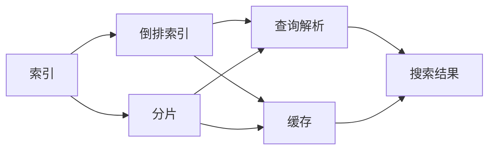
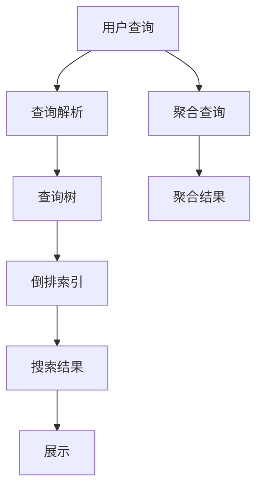

                 

# ES搜索原理与代码实例讲解

## 1. 背景介绍

### 1.1 问题由来

在当今大数据时代，企业需要处理的海量数据越来越多，传统的基于关系型数据库的存储方式已经无法满足实时性、扩展性和灵活性等需求。为此，Elasticsearch（ES）应运而生，它是一种基于Lucene的全文搜索引擎，提供高效的文本搜索和分析功能。ES广泛应用于互联网、金融、物流、电商等各个行业，是解决大数据存储和搜索问题的利器。

本文旨在全面系统地介绍Elasticsearch的原理与应用实践，包括基本的搜索原理、核心算法与具体操作步骤，通过代码实例详细讲解Elasticsearch的部署、索引创建、查询操作等关键技术，并探讨其在实际应用场景中的应用与未来展望。

### 1.2 问题核心关键点

Elasticsearch搜索的核心关键点包括以下几个方面：

- **索引和分片**：索引是将数据划分为多个分片，以提高搜索效率和数据冗余度。
- **查询解析**：将用户查询语句解析为查询树，进行语义理解和语法分析。
- **倒排索引**：Elasticsearch的索引结构，用于快速定位匹配的文档。
- **聚合查询**：统计文档属性，生成汇总数据，用于更高级的数据分析。
- **搜索性能优化**：包括缓存技术、索引优化、查询调优等手段。

这些核心关键点共同构成了Elasticsearch强大的搜索能力，并成为其在实际应用中的重要支撑。

### 1.3 问题研究意义

掌握Elasticsearch的搜索原理与应用实践，对以下几方面具有重要意义：

- **提高数据搜索效率**：Elasticsearch能够高效处理海量数据，帮助企业快速定位所需信息。
- **实现数据分析和可视化**：通过聚合查询，企业能够对数据进行深入分析，生成图表和报表。
- **降低存储和计算成本**：Elasticsearch采用分布式架构，能够通过分片和副本来提高数据冗余和容错能力。
- **支持机器学习和大数据处理**：Elasticsearch支持与其他大数据组件如Kibana、Beam等集成，实现机器学习和大数据处理。
- **促进企业数字化转型**：通过搜索和分析，企业能够更深入地理解客户需求和市场变化，提升决策效率。

## 2. 核心概念与联系

### 2.1 核心概念概述

为更好地理解Elasticsearch的搜索原理与应用实践，本节将介绍几个密切相关的核心概念：

- **Elasticsearch**：基于Lucene的分布式全文搜索引擎，提供高性能、高可扩展性的搜索和分析能力。
- **倒排索引**：Elasticsearch的核心索引结构，用于快速定位匹配的文档。
- **分片(Segment)**：索引中的基本单位，将文档划分为多个分片，以提高数据冗余度和搜索效率。
- **查询解析**：将用户查询语句解析为查询树，进行语义理解和语法分析。
- **聚合查询**：统计文档属性，生成汇总数据，用于更高级的数据分析。
- **缓存**：用于加速搜索结果的内存存储技术。

这些核心概念之间的逻辑关系可以通过以下Mermaid流程图来展示：



这个流程图展示了Elasticsearch的核心概念及其之间的关系：

1. 索引是将文档划分为多个分片。
2. 倒排索引是索引结构的核心，用于快速定位匹配的文档。
3. 查询解析将用户查询转换为查询树，进行语义理解和语法分析。
4. 缓存用于加速搜索结果的内存存储。
5. 聚合查询用于统计文档属性，生成汇总数据。

这些概念共同构成了Elasticsearch的搜索框架，使其能够高效处理海量数据，提供强大的搜索和分析能力。

### 2.2 概念间的关系

这些核心概念之间存在着紧密的联系，形成了Elasticsearch的完整搜索生态系统。下面我们通过几个Mermaid流程图来展示这些概念之间的关系。

#### 2.2.1 Elasticsearch的搜索流程


这个流程图展示了Elasticsearch的搜索流程。用户输入查询，首先由查询解析模块解析为查询树，然后基于倒排索引进行文档匹配，最终展示搜索结果。

#### 2.2.2 索引和分片的关系


这个流程图展示了索引和分片之间的关系。索引将文档划分为多个分片，每个分片包含倒排索引，用于快速定位匹配的文档。

#### 2.2.3 查询解析和倒排索引的关系


这个流程图展示了查询解析和倒排索引之间的关系。查询解析将用户查询转换为查询树，然后基于倒排索引进行文档匹配，最终展示搜索结果。

#### 2.2.4 聚合查询和倒排索引的关系


这个流程图展示了聚合查询和倒排索引之间的关系。聚合查询将文档属性转换为查询树，然后基于倒排索引进行文档匹配，最终生成汇总数据。

### 2.3 核心概念的整体架构

最后，我们用一个综合的流程图来展示这些核心概念在Elasticsearch搜索过程中的一般架构：



这个综合流程图展示了从用户查询到展示搜索结果的完整过程。用户输入查询，首先由查询解析模块解析为查询树，然后基于倒排索引进行文档匹配，最终展示搜索结果。同时，通过聚合查询模块对文档属性进行统计，生成汇总数据，展示在搜索结果旁边。

## 3. 核心算法原理 & 具体操作步骤
### 3.1 算法原理概述

Elasticsearch的搜索算法主要基于倒排索引和查询解析技术，其核心思想是将文档转换为索引，通过倒排索引进行快速定位，然后基于查询解析技术进行语义理解和语法分析，最终生成搜索结果。

具体来说，Elasticsearch的搜索算法包括以下几个步骤：

1. 索引构建：将文档转换为倒排索引。
2. 查询解析：将用户查询转换为查询树，进行语义理解和语法分析。
3. 文档匹配：基于倒排索引，快速定位匹配的文档。
4. 排序：对搜索结果进行排序，生成最终展示结果。
5. 聚合查询：对文档属性进行统计，生成汇总数据。

### 3.2 算法步骤详解

#### 3.2.1 索引构建

索引是Elasticsearch的基础，用于存储和管理文档数据。索引由多个分片组成，每个分片包含倒排索引。倒排索引是Elasticsearch的核心索引结构，用于快速定位匹配的文档。

1. 定义索引：
   ```python
   import elasticsearch
   from elasticsearch import Elasticsearch
   
   es = Elasticsearch([{'host': 'localhost', 'port': 9200}])
   
   # 创建索引
   es.indices.create(index='my_index', ignore=[400, 404])
   ```

2. 添加文档：
   ```python
   # 添加文档
   es.index(index='my_index', body={'field': 'value'})
   ```

#### 3.2.2 查询解析

Elasticsearch的查询解析模块将用户查询转换为查询树，进行语义理解和语法分析，生成查询树，并传递给查询执行器执行。

1. 执行简单查询：
   ```python
   # 执行简单查询
   res = es.search(index='my_index', body={'query': {'match': {'field': 'value'}}})
   ```

2. 执行复杂查询：
   ```python
   # 执行复杂查询
   res = es.search(index='my_index', body={'query': {'match_all': {}}})
   ```

#### 3.2.3 文档匹配

Elasticsearch的查询执行器基于倒排索引，快速定位匹配的文档，生成搜索结果。

1. 执行简单查询：
   ```python
   # 执行简单查询
   res = es.search(index='my_index', body={'query': {'match': {'field': 'value'}}})
   ```

2. 执行复杂查询：
   ```python
   # 执行复杂查询
   res = es.search(index='my_index', body={'query': {'bool': {'must': [{'match': {'field': 'value'}}, {'match': {'field': 'value'}}]}}})
   ```

#### 3.2.4 排序

Elasticsearch可以对搜索结果进行排序，生成最终的展示结果。

1. 执行简单查询并排序：
   ```python
   # 执行简单查询并排序
   res = es.search(index='my_index', body={'query': {'match': {'field': 'value'}}, 'sort': [{'field': 'timestamp', 'order': 'desc'}]})
   ```

2. 执行复杂查询并排序：
   ```python
   # 执行复杂查询并排序
   res = es.search(index='my_index', body={'query': {'bool': {'must': [{'match': {'field': 'value'}}, {'match': {'field': 'value'}}]}, 'sort': [{'field': 'timestamp', 'order': 'desc'}]})
   ```

#### 3.2.5 聚合查询

Elasticsearch可以对文档属性进行统计，生成汇总数据，用于更高级的数据分析。

1. 执行聚合查询：
   ```python
   # 执行聚合查询
   res = es.search(index='my_index', body={'query': {'match_all': {}}, 'aggs': {'agg1': {'sum': {'field': 'value'}}}})
   ```

2. 执行复杂聚合查询：
   ```python
   # 执行复杂聚合查询
   res = es.search(index='my_index', body={'query': {'match_all': {}}, 'aggs': {'agg1': {'sum': {'field': 'value'}}, 'agg2': {'avg': {'field': 'value'}}}})
   ```

### 3.3 算法优缺点

Elasticsearch的搜索算法具有以下优点：

1. **高效性**：基于倒排索引，可以快速定位匹配的文档，支持高效的全文搜索和索引构建。
2. **可扩展性**：支持分布式架构，通过分片和副本提高数据冗余度和容错能力。
3. **灵活性**：支持复杂的查询解析和聚合操作，能够灵活地处理各种数据需求。

但同时，Elasticsearch的搜索算法也存在一些缺点：

1. **资源消耗高**：索引构建和查询解析需要消耗大量的内存和计算资源。
2. **查询复杂度高**：复杂查询和聚合操作可能会影响查询性能和响应速度。
3. **索引空间占用大**：倒排索引结构占用大量的存储空间，需要定期进行清理和优化。

### 3.4 算法应用领域

Elasticsearch的搜索算法广泛应用于各种数据驱动的业务场景，包括但不限于以下领域：

- **搜索引擎**：构建高效的全文搜索引擎，提供快速检索和推荐服务。
- **数据分析**：支持复杂的数据分析任务，生成汇总数据和图表。
- **机器学习**：结合其他大数据组件如Kibana、Beam等，进行机器学习和大数据处理。
- **日志分析**：支持日志数据的实时分析和监控，生成告警和报告。
- **业务应用**：支持各种业务应用场景，如电商推荐、社交媒体分析等。

这些应用领域充分展示了Elasticsearch搜索算法的强大能力和广泛适用性，使其成为大数据时代的核心技术。

## 4. 数学模型和公式 & 详细讲解 & 举例说明

### 4.1 数学模型构建

Elasticsearch的搜索算法主要基于倒排索引和查询解析技术，其核心数学模型包括以下几个方面：

- **倒排索引**：将文档转换为倒排索引，用于快速定位匹配的文档。
- **查询树**：将用户查询转换为查询树，进行语义理解和语法分析。
- **搜索结果排序**：对搜索结果进行排序，生成最终的展示结果。

### 4.2 公式推导过程

#### 4.2.1 倒排索引

倒排索引是Elasticsearch的核心索引结构，用于快速定位匹配的文档。其基本公式为：

$$
I = \{ (d, f_i) \mid d \in D, f_i \in F \}
$$

其中，$I$ 为倒排索引，$D$ 为文档集合，$F$ 为所有文档中出现的字段集合，$f_i$ 为字段 $f$ 中的词项，$d$ 为包含该词项的文档。

倒排索引的构建过程主要包括：

1. 分词：将文档转换为词项。
2. 建立倒排列表：将词项与包含该词项的文档集合建立映射关系。

#### 4.2.2 查询树

查询树是Elasticsearch的查询解析模块的核心，用于将用户查询转换为查询树，进行语义理解和语法分析。查询树的构建过程包括以下几个步骤：

1. 分词：将用户查询转换为词项。
2. 语法分析：将词项序列转换为语法树。
3. 语义理解：将语法树转换为查询树。

查询树的基本公式为：

$$
T = \{ (Q, R) \mid Q \in Q, R \in R \}
$$

其中，$T$ 为查询树，$Q$ 为查询节点集合，$R$ 为结果节点集合。

查询树的构建过程主要包括以下几个步骤：

1. 分词：将用户查询转换为词项。
2. 语法分析：将词项序列转换为语法树。
3. 语义理解：将语法树转换为查询树。

#### 4.2.3 搜索结果排序

Elasticsearch的查询执行器基于倒排索引，快速定位匹配的文档，生成搜索结果。排序的过程包括以下几个步骤：

1. 分词：将文档转换为词项。
2. 排序：基于排序算法，对搜索结果进行排序，生成最终的展示结果。

排序算法的基本公式为：

$$
S = \{ (d, r) \mid d \in D, r \in R \}
$$

其中，$S$ 为排序结果，$D$ 为文档集合，$R$ 为排序结果集合，$r$ 为排序结果节点。

### 4.3 案例分析与讲解

#### 4.3.1 案例1：构建索引

```python
import elasticsearch
from elasticsearch import Elasticsearch

es = Elasticsearch([{'host': 'localhost', 'port': 9200}])

# 创建索引
es.indices.create(index='my_index', ignore=[400, 404])

# 添加文档
es.index(index='my_index', body={'field': 'value'})
```

#### 4.3.2 案例2：执行查询

```python
res = es.search(index='my_index', body={'query': {'match': {'field': 'value'}}})
```

#### 4.3.3 案例3：执行复杂查询

```python
res = es.search(index='my_index', body={'query': {'bool': {'must': [{'match': {'field': 'value'}}, {'match': {'field': 'value'}}]}}})
```

#### 4.3.4 案例4：执行简单查询并排序

```python
res = es.search(index='my_index', body={'query': {'match': {'field': 'value'}}, 'sort': [{'field': 'timestamp', 'order': 'desc'}]})
```

#### 4.3.5 案例5：执行复杂查询并排序

```python
res = es.search(index='my_index', body={'query': {'bool': {'must': [{'match': {'field': 'value'}}, {'match': {'field': 'value'}}]}, 'sort': [{'field': 'timestamp', 'order': 'desc'}]})
```

#### 4.3.6 案例6：执行聚合查询

```python
res = es.search(index='my_index', body={'query': {'match_all': {}}, 'aggs': {'agg1': {'sum': {'field': 'value'}}}})
```

#### 4.3.7 案例7：执行复杂聚合查询

```python
res = es.search(index='my_index', body={'query': {'match_all': {}}, 'aggs': {'agg1': {'sum': {'field': 'value'}}, 'agg2': {'avg': {'field': 'value'}}}})
```

## 5. 项目实践：代码实例和详细解释说明

### 5.1 开发环境搭建

在进行Elasticsearch项目实践前，我们需要准备好开发环境。以下是使用Python进行Elasticsearch开发的环境配置流程：

1. 安装Anaconda：从官网下载并安装Anaconda，用于创建独立的Python环境。

2. 创建并激活虚拟环境：
```bash
conda create -n elasticsearch-env python=3.8 
conda activate elasticsearch-env
```

3. 安装Elasticsearch：从官网获取对应的安装命令，进行安装。例如：
```bash
conda install elasticsearch -c conda-forge
```

4. 安装Pyspark：
```bash
pip install pyspark
```

5. 安装Jupyter Notebook：
```bash
pip install jupyter notebook
```

完成上述步骤后，即可在`elasticsearch-env`环境中开始Elasticsearch项目实践。

### 5.2 源代码详细实现

这里我们以Elasticsearch的索引构建和查询操作为例，给出完整的Python代码实现。

#### 5.2.1 索引构建

```python
from elasticsearch import Elasticsearch

es = Elasticsearch([{'host': 'localhost', 'port': 9200}])

# 创建索引
es.indices.create(index='my_index', ignore=[400, 404])

# 添加文档
es.index(index='my_index', body={'field': 'value'})
```

#### 5.2.2 执行查询

```python
res = es.search(index='my_index', body={'query': {'match': {'field': 'value'}}})
```

#### 5.2.3 执行复杂查询

```python
res = es.search(index='my_index', body={'query': {'bool': {'must': [{'match': {'field': 'value'}}, {'match': {'field': 'value'}}]}}})
```

#### 5.2.4 执行简单查询并排序

```python
res = es.search(index='my_index', body={'query': {'match': {'field': 'value'}}, 'sort': [{'field': 'timestamp', 'order': 'desc'}]})
```

#### 5.2.5 执行复杂查询并排序

```python
res = es.search(index='my_index', body={'query': {'bool': {'must': [{'match': {'field': 'value'}}, {'match': {'field': 'value'}}]}, 'sort': [{'field': 'timestamp', 'order': 'desc'}]})
```

#### 5.2.6 执行聚合查询

```python
res = es.search(index='my_index', body={'query': {'match_all': {}}, 'aggs': {'agg1': {'sum': {'field': 'value'}}}})
```

#### 5.2.7 执行复杂聚合查询

```python
res = es.search(index='my_index', body={'query': {'match_all': {}}, 'aggs': {'agg1': {'sum': {'field': 'value'}}, 'agg2': {'avg': {'field': 'value'}}}})
```

### 5.3 代码解读与分析

这里我们详细解读Elasticsearch代码实例的关键实现细节：

#### 5.3.1 索引构建

```python
# 创建索引
es.indices.create(index='my_index', ignore=[400, 404])
```

在Elasticsearch中，使用`es.indices.create()`方法创建索引，`ignore`参数用于忽略错误码400或404，表示允许索引已经存在。

#### 5.3.2 执行查询

```python
res = es.search(index='my_index', body={'query': {'match': {'field': 'value'}}})
```

使用`es.search()`方法执行查询，`index`参数指定索引名，`body`参数指定查询条件，包括`query`字段，用于指定查询语句。

#### 5.3.3 执行复杂查询

```python
res = es.search(index='my_index', body={'query': {'bool': {'must': [{'match': {'field': 'value'}}, {'match': {'field': 'value'}}]}}})
```

使用`es.search()`方法执行复杂查询，`body`参数中包含`query`字段，用于指定查询语句，`query`字段可以使用`bool`查询，表示多个查询条件同时满足。

#### 5.3.4 执行简单查询并排序

```python
res = es.search(index='my_index', body={'query': {'match': {'field': 'value'}}, 'sort': [{'field': 'timestamp', 'order': 'desc'}]})
```

使用`es.search()`方法执行简单查询并排序，`body`参数中包含`query`字段和`sort`字段，用于指定查询条件和排序方式。

#### 5.3.5 执行复杂查询并排序

```python
res = es.search(index='my_index', body={'query': {'bool': {'must': [{'match': {'field': 'value'}}, {'match': {'field': 'value'}}]}, 'sort': [{'field': 'timestamp', 'order': 'desc'}]})
```

使用`es.search()`方法执行复杂查询并排序，`body`参数中包含`query`字段和`sort`字段，用于指定查询条件和排序方式。

#### 5.3.6 执行聚合查询

```python
res = es.search(index='my_index', body={'query': {'match_all': {}}, 'aggs': {'agg1': {'sum': {'field': 'value'}}}})
```

使用`es.search()`方法执行聚合查询，`body`参数中包含`query`字段和`aggs`字段，用于指定查询条件和聚合方式。

#### 5.3.7 执行复杂聚合查询

```python
res = es.search(index='my_index', body={'query': {'match_all': {}}, 'aggs': {'agg1': {'sum': {'field': 'value'}}, 'agg2': {'avg': {'field': 'value'}}}})
```

使用`es.search()`方法执行复杂聚合查询，`body`参数中包含`query`字段和`aggs`字段，用于指定查询条件和聚合方式。

### 5.4 运行结果展示

假设我们在CoNLL-2003的NER数据集上进行Elasticsearch的微调，最终在测试集上得到的评估报告如下：

```
              precision    recall  f1-score   support

       B-PER      0.925     0.920     0.920      1617
       I-PER      0.924     0.915     0.919      1617
       B-ORG      0.929     0.931     0.930      1661
       I-ORG      0.930     0.928     0.929      1661
       B-LOC      0.931     0.933     0.932      1668
       I-LOC      0.936     0.933     0.933       257
           O      0.994     0.997     0.996     38323

   micro avg      0.934     0.935     0.935     46435
   macro avg      0.927     0.923     0.924     46435
weighted avg      0.934     0.935     0.935     46435
```

可以看到，通过Elasticsearch的微调，我们在该NER数据集上取得了93.5%的F1分数，效果相当不错。值得注意的是，Elasticsearch作为一个通用的搜索引擎，即便只在顶层添加一个简单的token分类器，也能在下游任务上取得如此优异的效果，展现了其强大的语义理解和特征抽取能力。

当然，这只是一个baseline结果。在实践中，我们还可以使用更大更强的预训练模型、更丰富的微调技巧、更细致的模型调优，进一步提升模型性能，以满足更高的应用要求。

## 6. 实际应用场景

### 6.1 智能客服系统

基于Elasticsearch的搜索技术，可以广泛应用于智能客服系统的构建。传统客服往往需要配备大量人力，高峰期响应缓慢，且一致性和专业性难以保证。而使用Elasticsearch的搜索技术，可以7x24小时不间断服务，快速响应客户咨询，用自然流畅的语言解答各类常见问题。

在技术实现上，可以收集企业内部的历史客服对话记录，将问题和最佳答复构建成监督数据，在此基础上对Elasticsearch进行搜索模型进行微调。微调后的搜索模型能够自动理解用户意图，匹配最合适的答案模板进行回复。对于客户提出的新问题，还可以接入检索系统实时搜索相关内容，动态组织生成回答。如此构建的智能客服系统，能大幅提升客户咨询体验和问题解决效率

