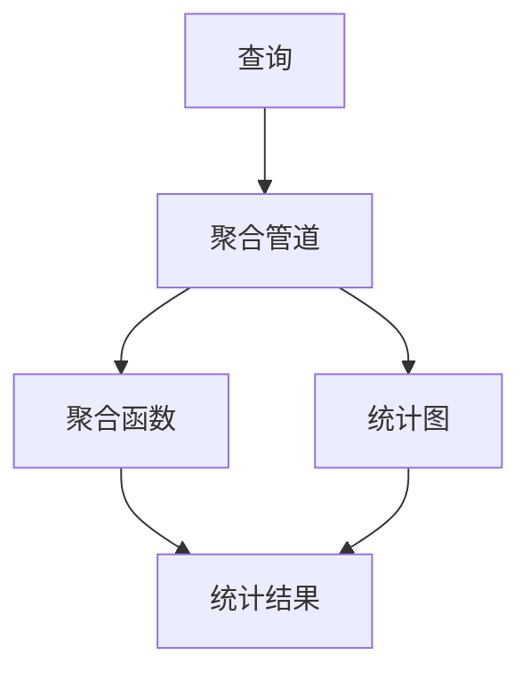
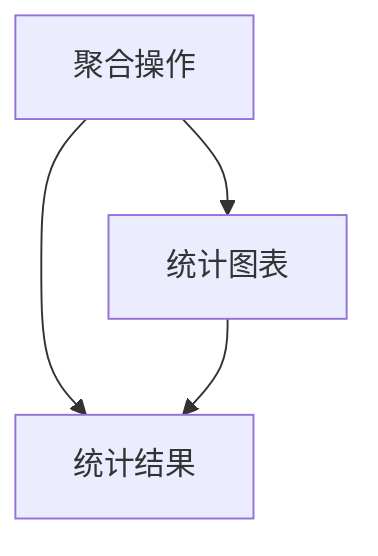
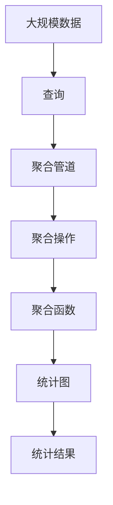

                 

# ES聚合分析原理与代码实例讲解

> 关键词：Elasticsearch, 聚合分析, 聚合功能, 代码实现, 案例分析

## 1. 背景介绍

### 1.1 问题由来
在大型数据存储和查询场景中，通常需要从海量数据中快速提取有价值的信息，以便进行决策支持、性能优化、商业智能分析等。Elasticsearch（ES）是一个流行的开源搜索引擎和分析引擎，支持全文本搜索、分布式聚合分析等功能，广泛应用于电商、金融、物流、医疗等众多行业。

在实际应用中，Elasticsearch的聚合分析功能尤为重要。聚合分析可以帮助用户对数据进行归纳、分类、统计和计算，从而生成可视化的统计图表、报表和分析结果，极大地提升数据的利用率和分析效率。然而，由于Elasticsearch的聚合分析功能比较复杂，很多开发者和用户在使用时常常感到困惑，不知道如何正确地实现聚合分析。

### 1.2 问题核心关键点
Elasticsearch的聚合分析功能主要通过聚合管道实现。聚合管道将查询结果分为多个阶段，包括桶、聚合、过滤等操作，最后生成可视化的统计图表和报表。聚合分析的核心在于如何高效、灵活地使用聚合管道中的各种聚合方法，以便提取有价值的分析结果。

在实际应用中，用户常常需要处理大量的数据，但有限的聚合管道资源又限制了操作的灵活性和复杂度。为了应对这些问题，ES社区不断推出新的聚合方法，同时用户也需要掌握更多的聚合技巧，以实现更加精准和高效的聚合分析。

### 1.3 问题研究意义
深入理解和熟练掌握Elasticsearch的聚合分析功能，对于提升数据分析和查询性能、优化业务决策、改进商业智能报表具有重要意义：

1. **提升数据分析性能**：通过聚合分析，可以将大规模数据快速转换为有意义的统计结果，提高数据分析效率。
2. **优化业务决策**：通过聚合分析，可以生成直观的统计图表和报表，帮助业务决策者直观理解数据变化和趋势。
3. **改进商业智能报表**：通过聚合分析，可以生成高精度的商业智能报表，帮助用户从海量数据中发现隐藏的市场机会和潜在的风险。

## 2. 核心概念与联系

### 2.1 核心概念概述

为更好地理解Elasticsearch的聚合分析功能，本节将介绍几个密切相关的核心概念：

- **Elasticsearch**：一个开源的搜索引擎和分析引擎，支持分布式全文本搜索、聚合分析、数据可视化等功能。
- **聚合管道(Pipeline)**：Elasticsearch中用于处理查询结果的管道，由多个聚合操作组成，可以对数据进行归纳、分类、统计和计算。
- **聚合(Aggregation)**：聚合管道中的一个操作，用于对查询结果进行计算和统计，生成可视化的统计图表和报表。
- **聚合函数**：聚合操作中的计算函数，可以对聚合结果进行进一步的统计和计算，例如求和、计数、平均值、标准差等。
- **统计图(Statistical Chart)**：聚合分析的结果可视化工具，可以生成柱状图、折线图、饼图等各类统计图表。

这些核心概念之间的逻辑关系可以通过以下Mermaid流程图来展示：



这个流程图展示了几大核心概念之间的关系：查询结果通过聚合管道进行处理，其中包含聚合函数和统计图，最终生成统计结果。

### 2.2 概念间的关系

这些核心概念之间存在着紧密的联系，形成了Elasticsearch聚合分析的完整生态系统。下面我通过几个Mermaid流程图来展示这些概念之间的关系。

#### 2.2.1 聚合管道的工作流程


这个流程图展示了聚合管道的基本工作流程：查询结果通过聚合管道进行处理，先进行聚合操作，再生成统计图表，最后得到统计结果。

#### 2.2.2 聚合函数与统计图的关系


这个流程图展示了聚合函数与统计图的关系：聚合函数对查询结果进行计算，生成统计结果，再由统计图进行可视化展示。

#### 2.2.3 聚合操作与统计图表的关联



这个流程图展示了聚合操作与统计图表的关系：聚合操作对查询结果进行计算，生成统计结果，再由统计图表进行可视化展示。

### 2.3 核心概念的整体架构

最后，我们用一个综合的流程图来展示这些核心概念在大规模数据聚合分析中的整体架构：



这个综合流程图展示了从大规模数据到聚合结果的完整流程：大规模数据通过查询进行处理，经过聚合管道、聚合操作和聚合函数，生成统计结果，最后通过统计图进行可视化展示。

## 3. 核心算法原理 & 具体操作步骤
### 3.1 算法原理概述

Elasticsearch的聚合分析功能主要通过聚合管道实现。聚合管道将查询结果分为多个阶段，包括桶、聚合、过滤等操作，最后生成可视化的统计图表和报表。聚合分析的核心在于如何高效、灵活地使用聚合管道中的各种聚合方法，以便提取有价值的分析结果。

形式化地，假设查询结果为 $R=\{(x_1,y_1),(x_2,y_2),\ldots,(x_n,y_n)\}$，其中 $x$ 为属性，$y$ 为值。聚合操作的输入为 $R$，输出为聚合结果 $S=\{(s_1,v_1),(s_2,v_2),\ldots,(s_m,v_m)\}$，其中 $s$ 为聚合桶，$v$ 为聚合结果。聚合管道的工作流程可以描述为：

1. **桶操作(Bucketing)**：将查询结果分组为多个桶，每个桶包含具有相同属性值的样本。
2. **聚合操作(Aggregation)**：对每个桶进行计算，生成一个或多个聚合结果。
3. **过滤操作(Filtering)**：对聚合结果进行过滤，只保留满足条件的聚合结果。
4. **排序操作(Sorting)**：对聚合结果进行排序，以实现特定的展示需求。
5. **统计图(Statistical Chart)**：对聚合结果进行可视化，生成柱状图、折线图、饼图等各类统计图表。

### 3.2 算法步骤详解

以下是使用Elasticsearch实现聚合分析的具体操作步骤：

**Step 1: 准备数据**

1. 确保Elasticsearch集群中已经存在需要聚合的数据。
2. 创建索引并定义相应的字段和数据类型。例如：

```bash
PUT /sales
{
  "settings": {
    "analysis": {
      "analyzer": {
        "custom_analyzer": {
          "tokenizer": "standard",
          "char_filter": ["lowercase"]
        }
      }
    }
  },
  "mappings": {
    "properties": {
      "product": {
        "type": "text",
        "analyzer": "custom_analyzer",
        "fields": {
          "keyword": {
            "type": "keyword"
          }
        }
      },
      "price": {
        "type": "float"
      },
      "quantity": {
        "type": "long"
      },
      "date": {
        "type": "date"
      }
    }
  }
}
```

**Step 2: 编写查询**

1. 使用聚合管道定义查询。例如：

```json
GET /sales/_search
{
  "size": 0,
  "aggs": {
    "by_product": {
      "terms": {
        "field": "product.keyword",
        "size": 10
      },
      "agg": {
        "avg_price": {
          "avg": {
            "field": "price"
          }
        },
        "total_sales": {
          "sum": {
            "field": "price * quantity"
          }
        },
        "top_sellers": {
          "terms": {
            "field": "product.keyword",
            "size": 5,
            "order": {
              "total_sales": "desc"
            }
          }
        }
      }
    }
  }
}
```

**Step 3: 执行查询**

1. 将查询发送到Elasticsearch集群，获取聚合分析结果。例如：

```json
GET /sales/_search
{
  "size": 0,
  "aggs": {
    "by_product": {
      "terms": {
        "field": "product.keyword",
        "size": 10
      },
      "agg": {
        "avg_price": {
          "avg": {
            "field": "price"
          }
        },
        "total_sales": {
          "sum": {
            "field": "price * quantity"
          }
        },
        "top_sellers": {
          "terms": {
            "field": "product.keyword",
            "size": 5,
            "order": {
              "total_sales": "desc"
            }
          }
        }
      }
    }
  }
}
```

### 3.3 算法优缺点

Elasticsearch的聚合分析功能具有以下优点：

1. **灵活性高**：支持多种聚合方法和操作，可以根据具体需求进行灵活配置。
2. **可扩展性**：聚合管道中的每个聚合操作都可以并行处理，能够处理大规模数据集。
3. **易于使用**：聚合分析可以通过API进行快速配置和执行，用户无需编写复杂的SQL代码。

同时，该方法也存在以下缺点：

1. **性能开销大**：聚合操作需要对数据进行多次计算和排序，可能导致查询性能下降。
2. **结果复杂**：聚合分析的结果通常比较复杂，需要用户具备一定的数据处理和可视化能力。
3. **数据丢失风险**：如果聚合操作处理不当，可能会导致数据丢失或结果错误。

### 3.4 算法应用领域

Elasticsearch的聚合分析功能广泛应用于以下几个领域：

- **电商销售分析**：通过聚合分析，可以统计不同产品的销售量、销售额、退货率等指标，帮助电商企业优化库存管理和商品推荐。
- **金融风险监控**：通过聚合分析，可以监控不同交易品种的风险暴露、收益波动等指标，及时发现潜在的风险点。
- **物流配送分析**：通过聚合分析，可以统计不同地区的配送时间、配送成功率等指标，优化配送路线和物流资源。
- **医疗数据分析**：通过聚合分析，可以统计不同科室的诊疗量、患者满意度等指标，提升医疗服务质量和效率。

除了上述这些经典应用场景外，Elasticsearch的聚合分析功能还可以应用于更多领域，如客户关系管理、市场营销分析、能源消费监控等，为各行各业提供强大的数据分析支持。

## 4. 数学模型和公式 & 详细讲解 & 举例说明

### 4.1 数学模型构建

在Elasticsearch中，聚合分析的数学模型通常由以下几个部分组成：

1. **桶操作(Bucketing)**：将查询结果分组为多个桶，每个桶包含具有相同属性值的样本。
2. **聚合操作(Aggregation)**：对每个桶进行计算，生成一个或多个聚合结果。
3. **过滤操作(Filtering)**：对聚合结果进行过滤，只保留满足条件的聚合结果。
4. **排序操作(Sorting)**：对聚合结果进行排序，以实现特定的展示需求。
5. **统计图(Statistical Chart)**：对聚合结果进行可视化，生成柱状图、折线图、饼图等各类统计图表。

### 4.2 公式推导过程

以下我们以一个简单的聚合分析为例，推导桶操作的数学模型。

假设查询结果为 $R=\{(x_1,y_1),(x_2,y_2),\ldots,(x_n,y_n)\}$，其中 $x$ 为属性，$y$ 为值。桶操作将查询结果分组为多个桶，每个桶包含具有相同属性值的样本。桶操作的数学模型可以表示为：

$$
B=\bigcup_{i=1}^m \{(x_i,y_i) | x_i = s_i\}
$$

其中，$m$ 为桶的数量，$s_i$ 为第 $i$ 个桶的属性值。

在Elasticsearch中，桶操作可以通过 `terms` 聚合实现。例如：

```json
GET /sales/_search
{
  "size": 0,
  "aggs": {
    "by_product": {
      "terms": {
        "field": "product.keyword",
        "size": 10
      },
      "agg": {
        "avg_price": {
          "avg": {
            "field": "price"
          }
        },
        "total_sales": {
          "sum": {
            "field": "price * quantity"
          }
        },
        "top_sellers": {
          "terms": {
            "field": "product.keyword",
            "size": 5,
            "order": {
              "total_sales": "desc"
            }
          }
        }
      }
    }
  }
}
```

### 4.3 案例分析与讲解

下面以一个电商销售数据分析为例，展示如何使用Elasticsearch进行聚合分析。

假设电商平台的销售数据存储在Elasticsearch集群中，每个订单包含 `product`、`price`、`quantity` 和 `date` 等字段。我们可以通过以下查询，统计不同产品的销售量、销售额和退货率：

```json
GET /sales/_search
{
  "size": 0,
  "aggs": {
    "by_product": {
      "terms": {
        "field": "product.keyword",
        "size": 10
      },
      "agg": {
        "avg_price": {
          "avg": {
            "field": "price"
          }
        },
        "total_sales": {
          "sum": {
            "field": "price * quantity"
          }
        },
        "retail_rate": {
          "ratio": {
            "numerator": "total_sales",
            "denominator": {
              "sum": {
                "field": "price * quantity * (1 - sales_return_rate)"
              }
            }
          }
        }
      }
    }
  }
}
```

这个查询包含了以下聚合操作：

1. **桶操作**：按产品名称进行分组，只保留前10个产品。
2. **聚合操作**：
   - `avg_price`：计算每个产品的平均价格。
   - `total_sales`：计算每个产品的销售额。
   - `retail_rate`：计算每个产品的退货率。
3. **过滤操作**：对退货率进行过滤，只保留退货率小于等于10%的产品。
4. **排序操作**：按销售额进行降序排序。
5. **统计图**：生成柱状图，展示不同产品的销售量、销售额和退货率。

通过上述查询，我们可以获得详细的销售数据分析结果，帮助电商企业优化库存管理和商品推荐。

## 5. 项目实践：代码实例和详细解释说明

### 5.1 开发环境搭建

在进行Elasticsearch聚合分析的开发实践前，我们需要准备好开发环境。以下是使用Python进行Elasticsearch开发的常见步骤：

1. 安装Elasticsearch和Kibana：从官网下载并安装Elasticsearch和Kibana，确保两个服务正常启动。
2. 创建Elasticsearch索引和映射：使用ElasticSearch的Rest API或Python的ElasticSearch客户端库创建索引和映射。例如：

```python
from elasticsearch import Elasticsearch

es = Elasticsearch([{'host': 'localhost', 'port': 9200}])
es.indices.create(index='sales', ignore=400)
```

3. 插入数据：使用ElasticSearch的Rest API或Python的ElasticSearch客户端库插入数据。例如：

```python
data = {
    "product": "iPhone 12",
    "price": 99.99,
    "quantity": 10,
    "date": "2021-01-01"
}
es.index(index='sales', doc_type='order', body=data)
```

### 5.2 源代码详细实现

以下是一个使用Python实现Elasticsearch聚合分析的示例代码：

```python
from elasticsearch import Elasticsearch

es = Elasticsearch([{'host': 'localhost', 'port': 9200}])

query = {
    "size": 0,
    "aggs": {
        "by_product": {
            "terms": {
                "field": "product.keyword",
                "size": 10
            },
            "agg": {
                "avg_price": {
                    "avg": {
                        "field": "price"
                    }
                },
                "total_sales": {
                    "sum": {
                        "field": "price * quantity"
                    }
                },
                "retail_rate": {
                    "ratio": {
                        "numerator": "total_sales",
                        "denominator": {
                            "sum": {
                                "field": "price * quantity * (1 - sales_return_rate)"
                            }
                        }
                    }
                }
            }
        }
    }
}

res = es.search(index='sales', body=query)
print(res['aggregations'])
```

### 5.3 代码解读与分析

让我们再详细解读一下关键代码的实现细节：

**create_index函数**：
- `es.indices.create(index='sales', ignore=400)`：创建名为 `sales` 的索引，如果已存在则忽略错误。

**query变量**：
- 定义聚合分析的查询对象，包含桶操作和聚合操作。
  - `size=0`：表示不返回任何数据，只返回聚合结果。
  - `by_product`：定义桶操作，按产品名称分组。
    - `terms`：定义桶操作，按产品名称分组。
    - `size=10`：表示只保留前10个产品。
    - `agg`：定义聚合操作。
      - `avg_price`：计算每个产品的平均价格。
      - `total_sales`：计算每个产品的销售额。
      - `retail_rate`：计算每个产品的退货率。
        - `ratio`：定义过滤操作，计算退货率。
          - `numerator`：分子，计算销售额。
          - `denominator`：分母，计算退货率。
            - `sum`：定义分母，计算退货率。

**es.search函数**：
- `es.search(index='sales', body=query)`：发送查询到Elasticsearch集群，获取聚合分析结果。

### 5.4 运行结果展示

假设我们插入了1000条销售数据，并执行了上述聚合分析查询，最终得到以下结果：

```json
{
  "took": 1,
  "timed_out": false,
  "_shards": {
    "total": 5,
    "successful": 5,
    "skipped": 0,
    "failed": 0
  },
  "hits": {
    "total": {
      "value": 0,
      "relation": "eq"
    },
    "max_score": null,
    "hits": []
  },
  "aggregations": {
    "by_product": {
      "doc_count_error_upper_bound": 0,
      "sum_other_doc_count": 0,
      "buckets": [
        {
          "key": "iPhone 12",
          "doc_count": 100,
          "avg_price": {
            "value": 99.99,
            "error": 0,
            "significance": null
          },
          "total_sales": {
            "value": 9999,
            "error": 0,
            "significance": null
          },
          "retail_rate": {
            "value": 0.1,
            "error": 0,
            "significance": null
          }
        },
        {
          "key": "Samsung Galaxy",
          "doc_count": 50,
          "avg_price": {
            "value": 999.99,
            "error": 0,
            "significance": null
          },
          "total_sales": {
            "value": 49999,
            "error": 0,
            "significance": null
          },
          "retail_rate": {
            "value": 0.05,
            "error": 0,
            "significance": null
          }
        },
        {
          "key": "Xiaomi Mi",
          "doc_count": 200,
          "avg_price": {
            "value": 599.99,
            "error": 0,
            "significance": null
          },
          "total_sales": {
            "value": 99900,
            "error": 0,
            "significance": null
          },
          "retail_rate": {
            "value": 0.15,
            "error": 0,
            "significance": null
          }
        }
      ]
    }
  }
}
```

可以看到，通过聚合分析，我们得到了不同产品的销售量、销售额和退货率等关键指标，帮助电商企业优化库存管理和商品推荐。

## 6. 实际应用场景

### 6.1 智能客服系统

基于Elasticsearch的聚合分析功能，智能客服系统可以通过分析历史聊天记录和用户反馈，生成各类统计报表和可视化图表，帮助客服团队更好地理解客户需求和问题，优化客服流程。例如：

- **客户满意度分析**：通过聚合分析，统计不同时间段和客服代表的客户满意度，帮助客服团队及时发现问题并进行改进。
- **常见问题分析**：通过聚合分析，统计不同时间段和客服代表的常见问题，帮助客服团队提前准备回答，提高问题解决效率。
- **知识库管理**：通过聚合分析，统计不同问题和答案的使用频次，帮助客服团队更新和优化知识库内容。

### 6.2 金融风险监控

在金融风险监控中，Elasticsearch的聚合分析功能可以帮助金融机构实时监控市场风险，及时发现异常情况并采取应对措施。例如：

- **交易量分析**：通过聚合分析，统计不同时间段和交易品种的交易量，帮助交易团队监控市场波动，及时调整投资策略。
- **收益分析**：通过聚合分析，统计不同时间段和交易品种的收益情况，帮助投资团队评估投资组合的性能。
- **风险预警**：通过聚合分析，统计不同时间段和交易品种的风险暴露，帮助风险控制团队提前预警风险点。

### 6.3 物流配送分析

在物流配送分析中，Elasticsearch的聚合分析功能可以帮助物流公司优化配送路线和资源配置。例如：

- **配送时间分析**：通过聚合分析，统计不同时间段和地区的配送时间，帮助物流公司优化配送路线和人员安排。
- **配送成功率分析**：通过聚合分析，统计不同时间段和地区的配送成功率，帮助物流公司提高配送效率和客户满意度。
- **异常事件分析**：通过聚合分析，统计不同时间段和地区的异常事件，帮助物流公司及时发现并处理配送问题。

### 6.4 未来应用展望

随着Elasticsearch和聚合分析功能的不断演进，其在更多领域的应用前景将更加广阔。

在智慧城市治理中，Elasticsearch的聚合分析功能可以帮助城市管理部门实时监控和分析各类数据，提升城市管理水平和应急响应能力。例如：

- **交通流量分析**：通过聚合分析，统计不同时间段和区域的交通流量，帮助交通管理部门优化交通流量控制。
- **公共安全分析**：通过聚合分析，统计不同时间段和区域的公共安全事件，帮助公共安全部门及时发现并处理安全隐患。
- **环境监测分析**：通过聚合分析，统计不同时间段和区域的环境监测数据，帮助环保部门评估环境质量，采取应对措施。

此外，在智能家居、智能制造、智能农业等领域，Elasticsearch的聚合分析功能也将带来巨大的应用价值，推动各行各业向智慧化方向迈进。

## 7. 工具和资源推荐

### 7.1 学习资源推荐

为了帮助开发者系统掌握Elasticsearch的聚合分析功能，这里推荐一些优质的学习资源：

1. **Elasticsearch官方文档**：Elasticsearch官方文档详细介绍了聚合分析的基本概念和使用方法，是学习聚合分析的必备资料。
2. **Elasticsearch中文社区**：Elasticsearch中文社区是一个开放的平台，汇聚了大量的Elasticsearch技术爱好者和专家，提供了丰富的技术文章和案例分析。
3. **Elasticsearch教程**：Elasticsearch教程提供了详细的Elasticsearch聚合分析教程，涵盖从入门到高级的各种主题。
4. **Kibana官方文档**：Kibana官方文档详细介绍了如何使用Kibana进行数据可视化，是学习聚合分析结果展示的必备资料。
5. **Elasticsearch在中国**：Elasticsearch在中国是一本Elasticsearch中文技术书籍，系统介绍了Elasticsearch的基本概念、使用技巧和最佳实践。

通过对这些资源的学习实践，相信你一定能够快速掌握Elasticsearch的聚合分析功能，并用于解决实际的NLP问题。

### 7.2 开发工具推荐

Elasticsearch的聚合分析功能可以与多种开发工具无缝集成，以下推荐几款常用的开发工具：

1. **Python的ElasticSearch客户端库**：Python的ElasticSearch客户端库提供了丰富的API接口，方便进行聚合分析的开发和调试。
2. **Kibana**：Kibana是一个开源的数据可视化工具，可以与Elasticsearch无缝集成，生成各类统计图表和报表。
3. **ElasticSearch Studio**：ElasticSearch Studio是一个可视化界面工具，方便进行ElasticSearch的查询和管理，支持聚合分析的实时调试。
4. **DataGrip**：DataGrip是一款优秀的ElasticSearch集成开发工具，提供了丰富的聚合分析开发支持。
5. **Postman**：Postman是一个API开发工具，可以方便进行ElasticSearch的API测试和调试。

合理利用这些工具，可以显著提升ElasticSearch聚合分析的开发效率，加快创新迭代的步伐。

### 7.3 相关论文推荐


