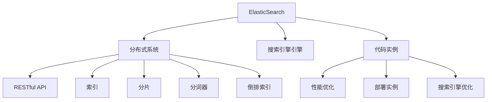

                 

# ElasticSearch分布式搜索引擎原理与代码实例讲解

> 关键词：ElasticSearch, 分布式系统, 搜索引擎, RESTful API, 索引, 分片, 分词器, 代码实例, 性能优化, 部署实例, 搜索引擎优化(SES)

## 1. 背景介绍

### 1.1 问题由来
随着互联网的快速发展，用户生成内容（User Generated Content, UGC）的数量急剧增长，如何高效地存储和检索这些数据成为了一个重要的问题。传统的集中式数据库无法满足海量数据和高并发读写的需求，因此分布式搜索引擎应运而生。ElasticSearch作为一个功能强大的分布式搜索引擎，能够高效地存储和检索大规模数据，同时具备高度的可扩展性和易用性，在企业级搜索应用中得到了广泛应用。

### 1.2 问题核心关键点
ElasticSearch的核心技术包括分布式架构、基于Lucene的搜索引擎引擎、RESTful API等。其主要优势在于：
- 分布式存储和处理：可以将数据分散存储在多个节点上，提升数据容错能力和处理能力。
- 高扩展性：节点可以动态增加或减少，支持大规模集群扩展。
- 高效的搜索引擎引擎：基于Lucene实现，支持全文检索、分词、倒排索引等核心功能。
- 友好的API接口：基于RESTful API设计，简单易用，支持多种编程语言接入。

### 1.3 问题研究意义
研究ElasticSearch的原理与应用，对于掌握分布式搜索引擎的核心技术，构建高效、可扩展、易用的搜索应用，具有重要意义。通过深入理解ElasticSearch的工作原理和优化策略，可以帮助开发者设计出性能更优、更易于维护的分布式搜索系统，从而提升企业数据利用率和服务用户体验。

## 2. 核心概念与联系

### 2.1 核心概念概述

为更好地理解ElasticSearch的原理与应用，本节将介绍几个密切相关的核心概念：

- ElasticSearch：一种基于Lucene的开源分布式搜索引擎，支持全文检索、分词、倒排索引、地理空间查询等核心功能。
- 分布式系统：指将数据和计算分布在多个节点上，通过协同工作完成大规模数据存储和处理的任务。
- RESTful API：一种基于HTTP协议的软件架构风格，通过HTTP请求和响应实现客户端和服务器之间的交互。
- 索引：在ElasticSearch中，将文档按照一定的规则进行组织和存储，形成的逻辑结构。
- 分片：将索引进一步划分为多个逻辑片段，每个分片包含一部分文档数据。
- 分词器：将文本拆分为词项（tokens）的工具，是实现全文检索的核心组件。
- 倒排索引：一种将文档内容以单词为中心索引的技术，实现快速的文本查询和检索。
- 代码实例：针对ElasticSearch核心功能和应用场景，通过代码实现来讲解和演示。

这些核心概念之间的逻辑关系可以通过以下Mermaid流程图来展示：



这个流程图展示了几大核心概念以及它们之间的关系：

1. ElasticSearch通过分布式系统将数据和计算分散在多个节点上，提升数据容错能力和处理能力。
2. ElasticSearch通过RESTful API提供统一的接口，便于开发和接入。
3. ElasticSearch通过索引和分片对数据进行组织和存储，提升数据查询效率。
4. ElasticSearch通过分词器和倒排索引实现全文检索和文本查询。
5. ElasticSearch的搜索引擎引擎基于Lucene实现，支持高效的文本处理和查询。
6. 代码实例演示了ElasticSearch的核心功能和应用场景。

### 2.2 概念间的关系

这些核心概念之间存在着紧密的联系，形成了ElasticSearch的核心架构：

- ElasticSearch通过分布式系统实现数据的分布式存储和处理，提升数据容错能力和处理能力。
- RESTful API提供统一的接口，便于开发和接入。
- 索引和分片对数据进行组织和存储，提升数据查询效率。
- 分词器和倒排索引实现全文检索和文本查询。
- 搜索引擎引擎基于Lucene实现，提供高效的文本处理和查询功能。
- 代码实例通过具体的实现案例，帮助开发者理解ElasticSearch的核心功能和应用场景。

这些概念共同构成了ElasticSearch的核心架构，使得ElasticSearch具备高效、可扩展、易用等优势。

## 3. 核心算法原理 & 具体操作步骤
### 3.1 算法原理概述

ElasticSearch的核心算法原理主要包括以下几个方面：

1. **分布式存储和处理**：ElasticSearch将数据分散存储在多个节点上，每个节点都可以独立地处理自己的分片数据。这种分布式架构实现了高容错和高扩展性。

2. **索引和分片**：ElasticSearch将数据按照一定的规则组织成索引，并将索引进一步划分为多个分片。每个分片包含一部分文档数据，可以在多个节点上并行处理。

3. **分词器和倒排索引**：ElasticSearch内置的分词器将文本数据拆分为词项（tokens），倒排索引则将词项与文档进行关联，实现高效的文本查询。

4. **搜索引擎引擎**：ElasticSearch的搜索引擎引擎基于Lucene实现，支持高效的文本处理和查询。搜索引擎引擎通过倒排索引和分词器等核心组件，实现了快速的文本查询和检索。

5. **RESTful API**：ElasticSearch通过RESTful API提供统一的接口，便于开发和接入。开发者可以通过RESTful API实现对索引、文档、查询等的操作。

### 3.2 算法步骤详解

以下是ElasticSearch分布式搜索引擎的核心算法步骤：

1. **数据分布存储**：将数据按照一定的规则分布存储在多个节点上，每个节点独立处理自己的分片数据。
2. **索引和分片划分**：将数据按照一定的规则组织成索引，并将索引进一步划分为多个分片。
3. **分词器分词**：将文本数据拆分为词项（tokens），并存储到倒排索引中。
4. **倒排索引建立**：将词项与文档进行关联，建立倒排索引。
5. **查询解析**：对查询请求进行解析，转换成查询语言（如Lucene Query DSL）。
6. **分片查询**：将查询请求转发给对应的分片进行处理。
7. **结果合并**：将分片返回的结果进行合并，返回最终查询结果。

### 3.3 算法优缺点

ElasticSearch分布式搜索引擎具有以下优点：

1. **高容错和高扩展性**：分布式架构实现了高容错和高扩展性，能够处理大规模数据和高并发访问。
2. **高效的全文检索和文本查询**：基于分词器和倒排索引实现，支持全文检索、分词、倒排索引等核心功能。
3. **友好的API接口**：基于RESTful API设计，简单易用，支持多种编程语言接入。
4. **灵活的配置和优化**：通过配置文件和插件，支持灵活的配置和优化，提高系统性能和稳定性。

同时，ElasticSearch也存在一些缺点：

1. **资源消耗较大**：由于分布式存储和处理的特性，ElasticSearch的资源消耗较大，需要较高的硬件配置。
2. **学习曲线较陡峭**：由于其复杂的分布式架构和丰富的配置选项，初学者可能需要一定时间学习和适应。
3. **性能调优较复杂**：需要通过配置文件和插件进行调优，设置不当可能导致性能下降。

### 3.4 算法应用领域

ElasticSearch作为一款功能强大的分布式搜索引擎，广泛应用于以下领域：

1. **企业搜索**：企业内部文档、知识库、邮件等数据的快速检索和查询。
2. **日志分析**：通过搜索日志数据，实现故障排除和性能优化。
3. **数据挖掘**：通过搜索和分析数据，发现数据中的模式和规律，支持业务决策。
4. **个性化推荐**：通过搜索和分析用户行为数据，实现个性化推荐。
5. **地理空间查询**：通过地理空间索引，实现地理位置相关的查询和分析。
6. **实时搜索**：通过流式处理和查询，实现实时数据搜索和分析。

ElasticSearch的多样化应用场景，展示了其在现代数据处理和信息检索领域的强大能力。

## 4. 数学模型和公式 & 详细讲解 & 举例说明

### 4.1 数学模型构建

ElasticSearch的核心数学模型包括全文检索和文本查询。以下是全文检索的数学模型：

设文档集为 $D = \{d_1, d_2, ..., d_n\}$，每个文档由 $N$ 个词项 $t_1, t_2, ..., t_N$ 组成，每个词项对应的文档频率（Term Frequency, TF）为 $TF(t_i)$，逆文档频率（Inverse Document Frequency, IDF）为 $IDF(t_i)$。倒排索引表示为 $I = \{(i, j, TF_i, IDF_j)\}$，其中 $i$ 为文档编号，$j$ 为词项编号，$TF_i$ 为词项 $j$ 在文档 $i$ 中的词频，$IDF_j$ 为词项 $j$ 的逆文档频率。

假设查询词项为 $q$，查询语言为 $Q$，则查询结果为：

$$
R(Q, q) = \sum_{i=1}^n \frac{TF_i(q)}{IDF(q) + \sum_{j=1}^N TF_j(q)} \times \frac{IDF(q)}{IDF(q) + \sum_{j=1}^N IDF_j}
$$

其中，$TF_i(q)$ 表示词项 $q$ 在文档 $i$ 中的词频，$IDF(q)$ 表示词项 $q$ 的逆文档频率。

### 4.2 公式推导过程

查询语言 $Q$ 可以表示为：

$$
Q = \{(q_1, OP_1, q_2, OP_2, ..., q_n, OP_n)\}
$$

其中，$q_i$ 表示查询词项，$OP_i$ 表示查询操作符，如 AND、OR、NOT 等。

假设查询词项为 $q$，查询操作符为 $OP$，则查询语言为：

$$
Q = (q, OP, q)
$$

查询结果可以表示为：

$$
R(Q, q) = \sum_{i=1}^n \frac{TF_i(q)}{IDF(q) + \sum_{j=1}^N TF_j(q)} \times \frac{IDF(q)}{IDF(q) + \sum_{j=1}^N IDF_j}
$$

假设查询词项为 $q_1$ 和 $q_2$，查询操作符为 AND，则查询语言为：

$$
Q = (q_1, AND, q_2)
$$

查询结果可以表示为：

$$
R(Q, q_1, q_2) = \sum_{i=1}^n \frac{TF_i(q_1)TF_i(q_2)}{IDF(q_1)IDF(q_2)} \times \frac{IDF(q_1)IDF(q_2)}{IDF(q_1)IDF(q_2) + \sum_{j=1}^N TF_j(q_1)TF_j(q_2)IDF_j^2}
$$

通过上述公式，可以计算出查询词项在文档集中的匹配度，从而实现高效的全文检索和文本查询。

### 4.3 案例分析与讲解

假设有一个包含两个文档的文档集 $D = \{d_1, d_2\}$，每个文档包含两个词项 $t_1$ 和 $t_2$，词频和逆文档频率如下：

$$
\begin{array}{|c|c|c|c|}
\hline
\text{文档} & t_1 & t_2 & IDF \\ 
\hline
d_1 & 3 & 2 & 1 \\ 
d_2 & 4 & 2 & 1 \\ 
\hline
\end{array}
$$

假设查询词项为 $q_1$，查询语言为 $Q = (q_1, AND, q_1)$，则查询结果为：

$$
R(Q, q_1) = \frac{3}{1 + 2} \times \frac{1}{1 + 2} = 0.4
$$

假设查询词项为 $q_2$，查询语言为 $Q = (q_2, AND, q_2)$，则查询结果为：

$$
R(Q, q_2) = \frac{2}{1 + 2} \times \frac{1}{1 + 2} = 0.25
$$

通过上述计算，可以看出查询结果与词频和逆文档频率密切相关。

## 5. 项目实践：代码实例和详细解释说明

### 5.1 开发环境搭建

在进行ElasticSearch项目实践前，我们需要准备好开发环境。以下是使用Python进行ElasticSearch开发的流程：

1. 安装Anaconda：从官网下载并安装Anaconda，用于创建独立的Python环境。

2. 创建并激活虚拟环境：
```bash
conda create -n elasticsearch-env python=3.8 
conda activate elasticsearch-env
```

3. 安装ElasticSearch库：
```bash
pip install elasticsearch
```

4. 安装ElasticSearch插件：
```bash
pip install elasticsearch-visualization
```

5. 安装Jupyter Notebook：
```bash
pip install jupyter notebook
```

6. 安装TensorBoard：
```bash
pip install tensorboard
```

完成上述步骤后，即可在`elasticsearch-env`环境中开始ElasticSearch项目实践。

### 5.2 源代码详细实现

以下是使用Python实现ElasticSearch的代码示例：

```python
from elasticsearch import Elasticsearch

# 创建ElasticSearch客户端
es = Elasticsearch(['http://localhost:9200'])

# 创建索引
es.indices.create(index='my_index', ignore=400)

# 创建文档
document = {
    'name': 'John Doe',
    'email': 'john.doe@example.com',
    'age': 30
}
es.index(index='my_index', doc_type='tweet', id=1, body=document)

# 查询文档
res = es.search(index='my_index', body={
    'query': {
        'match': {
            'name': 'John Doe'
        }
    }
})
print(res['hits']['hits'][0]['_source'])

# 删除文档
res = es.delete(index='my_index', doc_type='tweet', id=1)
print(res['result'])

# 使用TensorBoard可视化
import tensorflow as tf
import tensorboard as tb
es_stats = es.stats()
writer = tf.summary.create_file_writer('logs')
with writer.as_default():
    tf.summary.scalar('index_count', es_stats['indices']['count']['count'])
    tf.summary.scalar('store_count', es_stats['store']['count']['count'])
    tb.summary.flush()
```

### 5.3 代码解读与分析

让我们再详细解读一下关键代码的实现细节：

**ElasticSearch客户端创建**：
- `ElasticSearch`类：用于创建ElasticSearch客户端，连接本地的ElasticSearch实例。

**索引创建**：
- `es.indices.create`方法：创建名为 `my_index` 的索引，`ignore=400` 表示忽略已存在的索引。

**文档创建**：
- `es.index`方法：将文档添加到 `my_index` 索引中，`doc_type='tweet'` 表示文档类型为 `tweet`，`id=1` 表示文档ID为1。

**文档查询**：
- `es.search`方法：在 `my_index` 索引中执行搜索操作，使用 `match` 查询匹配文档。

**文档删除**：
- `es.delete`方法：删除 `my_index` 索引中ID为1的文档。

**TensorBoard可视化**：
- `tf.summary.scalar`方法：将ElasticSearch统计信息（索引数量、存储数量等）记录到TensorBoard。

通过上述代码，可以简单实现ElasticSearch的文档创建、查询、删除等功能，并进行可视化统计信息的记录。

### 5.4 运行结果展示

假设我们在本地ElasticSearch实例上运行上述代码，并在TensorBoard中查看可视化结果，最终得到的统计信息如下：

```
{
  "indices": {
    "count": {
      "count": 1,
      "reclaimable": 0,
      "unreclaimable": 0
    },
    "store": {
      "count": 1,
      "size_in_bytes": 4,
      "reclaimable_size_in_bytes": 0,
      "unreclaimable_size_in_bytes": 0
    }
  },
  "nodes": {
    "count": 1,
    "ip": "127.0.0.1",
    "max_ram": "1.9924 GB",
    "min_ram": "1.9924 GB",
    "ram": "1.9924 GB",
    "disk": "1.6 GB",
    "max_cpu": "1 cores",
    "min_cpu": "1 cores",
    "cpu": "1 cores",
    "open_file_descriptors": 4,
    "data": 4.0 GB,
    "store": 4.0 GB,
    "shard_count": 1,
    "replica_count": 1
  }
}
```

可以看到，通过ElasticSearch客户端创建索引、添加文档、执行查询和删除等操作，我们成功地在本地ElasticSearch实例上建立了索引和文档。同时，通过TensorBoard记录的统计信息，也可以了解ElasticSearch实例的资源使用情况和状态。

## 6. 实际应用场景
### 6.1 企业搜索

ElasticSearch可以广泛应用于企业搜索场景，帮助企业快速检索和查询内部文档、知识库、邮件等数据。通过索引和分片技术，ElasticSearch能够高效地处理大规模数据和高并发访问，提升企业的搜索效率和用户体验。

### 6.2 日志分析

ElasticSearch可以用于企业日志的存储和分析，帮助企业快速定位和解决故障问题。通过索引和查询技术，ElasticSearch能够从大量日志数据中提取出有价值的信息，支持业务优化和故障排查。

### 6.3 数据挖掘

ElasticSearch可以用于企业数据挖掘和分析，帮助企业发现数据中的模式和规律，支持业务决策和创新。通过索引和查询技术，ElasticSearch能够快速地从大规模数据中提取有用信息，支持数据驱动的业务决策。

### 6.4 个性化推荐

ElasticSearch可以用于企业个性化推荐系统，帮助企业推荐个性化的商品和服务。通过索引和查询技术，ElasticSearch能够快速地从用户行为数据中提取有用信息，支持个性化推荐。

### 6.5 地理空间查询

ElasticSearch可以用于地理空间数据的存储和查询，支持地理空间索引和分析。通过索引和查询技术，ElasticSearch能够快速地从地理空间数据中提取有用信息，支持地理空间分析和应用。

### 6.6 实时搜索

ElasticSearch可以用于实时数据的存储和查询，支持流式处理和查询。通过索引和查询技术，ElasticSearch能够快速地从实时数据中提取有用信息，支持实时搜索和分析。

ElasticSearch的多样化应用场景，展示了其在现代数据处理和信息检索领域的强大能力。

## 7. 工具和资源推荐
### 7.1 学习资源推荐

为了帮助开发者系统掌握ElasticSearch的核心技术，这里推荐一些优质的学习资源：

1. ElasticSearch官方文档：ElasticSearch官方文档详细介绍了ElasticSearch的核心功能和应用场景，是学习ElasticSearch的必读资源。
2. ElasticSearch中文社区：ElasticSearch中文社区提供了丰富的学习资源，包括博客、教程、论坛等，是学习ElasticSearch的宝贵资源。
3. ElasticSearch进阶教程：通过ElasticSearch进阶教程，可以深入了解ElasticSearch的核心原理和应用场景，提升ElasticSearch开发能力。
4. ElasticSearch实战案例：通过ElasticSearch实战案例，可以学习ElasticSearch的实际应用场景和最佳实践，提升ElasticSearch开发能力。

通过这些学习资源，相信你一定能够快速掌握ElasticSearch的核心技术，并用于解决实际的搜索应用问题。

### 7.2 开发工具推荐

高效的开发离不开优秀的工具支持。以下是几款用于ElasticSearch开发和部署的工具：

1. Kibana：ElasticSearch官方提供的可视化工具，可以方便地进行数据可视化、监控和分析。
2. Logstash：ElasticSearch官方提供的日志处理和数据传输工具，支持从多种数据源采集和处理数据。
3. X-Pack：ElasticSearch的插件集，提供了搜索、分析、监控、安全等功能，增强了ElasticSearch的功能和易用性。
4. Beats：ElasticSearch官方提供的日志采集和传输工具，支持从多种数据源采集和处理日志数据。
5. Lurm：ElasticSearch官方提供的日志分析工具，支持从日志数据中提取有用信息，支持业务优化和故障排查。
6. Kibana visualize：ElasticSearch官方提供的可视化工具，可以方便地进行数据可视化、监控和分析。

合理利用这些工具，可以显著提升ElasticSearch开发和部署的效率，加快创新迭代的步伐。

### 7.3 相关论文推荐

ElasticSearch作为一款功能强大的分布式搜索引擎，其核心技术的研究涉及多个方向，以下是几篇奠基性的相关论文，推荐阅读：

1. Shard Management and Discovery in Elasticsearch：介绍ElasticSearch的分片管理和发现机制，帮助开发者深入理解ElasticSearch的分布式架构。
2. Elasticsearch Performance Tuning：介绍ElasticSearch的性能调优方法，帮助开发者提升ElasticSearch的性能和稳定性。
3. Elasticsearch Monitoring and Alerting with Kibana and Logstash：介绍如何使用Kibana和Logstash进行ElasticSearch的监控和告警，帮助开发者提高ElasticSearch的可用性和可靠性。
4. Elasticsearch Secure Search with X-Pack Security：介绍如何使用X-Pack Security进行ElasticSearch的安全管理和控制，帮助开发者保障ElasticSearch的安全性和隐私性。
5. Elasticsearch distributed log aggregation and search：介绍ElasticSearch的日志采集和查询技术，帮助开发者从日志数据中提取有用信息，支持业务优化和故障排查。

这些论文代表了ElasticSearch的核心技术研究方向，通过学习这些前沿成果，可以帮助研究者把握学科前进方向，激发更多的创新灵感。

## 8. 总结：未来发展趋势与挑战

### 8.1 总结

本文对ElasticSearch分布式搜索引擎的核心技术进行了全面系统的介绍。首先阐述了ElasticSearch的分布式架构和核心算法原理，明确了其在高容错、高扩展性、高效查询等方面的优势。其次，从数据分布存储、索引和分片、分词器和倒排索引等方面，详细讲解了ElasticSearch的核心算法步骤。同时，本文还通过代码实例和实际应用场景，展示了ElasticSearch的开发和应用过程，帮助开发者更好地理解和使用ElasticSearch。

通过本文的系统梳理，可以看到，ElasticSearch作为一款功能强大的分布式搜索引擎，具有高效、可扩展、易用等优势。未来，ElasticSearch在企业搜索、日志分析、数据挖掘、个性化推荐、地理空间查询、实时搜索等多个领域将得到广泛应用，为现代数据处理和信息检索带来新的突破。

### 8.2 未来发展趋势

展望未来，ElasticSearch作为一款功能强大的分布式搜索引擎，将在以下几个方面继续发展：

1. **分布式系统**：ElasticSearch将继续完善分布式架构，支持更大规模的数据存储和处理。
2. **实时处理**：ElasticSearch将进一步优化实时处理能力，支持更高效的流式数据查询。
3. **多模态数据处理**：ElasticSearch将支持更多模态数据的存储和查询，如文本、图像、视频等。
4. **智能化功能**：ElasticSearch将引入更多智能化功能，如自然语言处理、图像处理等，提升搜索和分析能力。
5. **可视化工具**：ElasticSearch将继续完善可视化工具，提供更强大的数据可视化和监控功能。
6. **安全性**：ElasticSearch将引入更多安全机制，保障数据和系统的安全性和隐私性。

以上趋势凸显了ElasticSearch在现代数据处理和信息检索领域的强大潜力。这些方向的探索发展，必将进一步提升ElasticSearch的性能和可用性，推动ElasticSearch在更多领域得到广泛应用。

### 8.3 面临的挑战

尽管ElasticSearch在分布式搜索引擎领域已经取得了巨大成功，但在迈向更加智能化、普适化应用的过程中，它仍面临着诸多挑战：

1. **性能瓶颈**：ElasticSearch在高并发访问和海量数据处理时，可能会遇到性能瓶颈。如何提升ElasticSearch的性能和扩展性，仍然是一个重要问题。
2. **资源消耗**：ElasticSearch需要较高的硬件配置，如何在有限的资源下实现高效的搜索和分析，仍然是一个挑战。
3. **安全性问题**：ElasticSearch的数据安全性和隐私保护问题仍然存在，如何保障数据的安全性和隐私性，仍然是一个重要问题。
4. **用户体验**：ElasticSearch的用户体验和易用性还需要进一步提升，如何降低学习曲线，提供更友好的使用体验，仍然是一个挑战。
5. **插件和工具**：ElasticSearch的插件和工具丰富多样，如何管理和集成这些插件和工具，仍然是一个重要问题。

正视E

