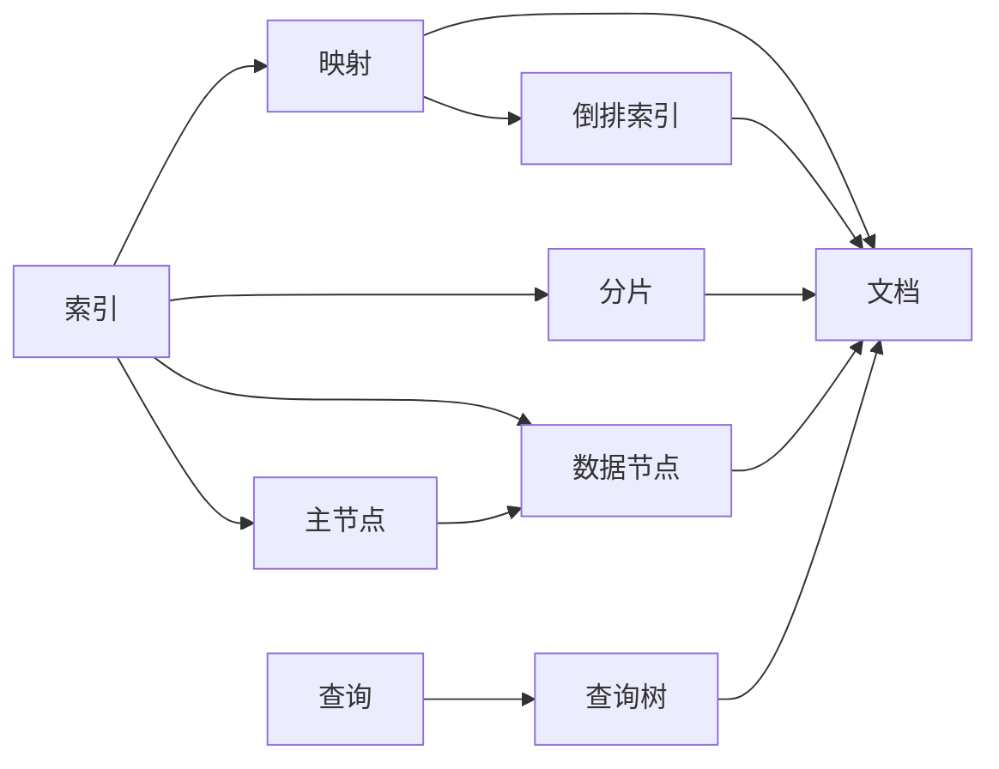
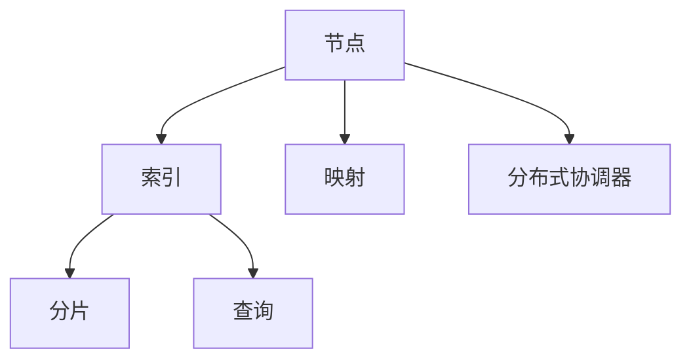

                 

# ElasticSearch原理与代码实例讲解

> 关键词：ElasticSearch, 分布式存储, 索引, 搜索算法, 日志索引, 代码实现, 部署实践

## 1. 背景介绍

### 1.1 问题由来

随着互联网和数字化的快速发展，海量数据存储和高效检索的需求日益增长。传统的关系型数据库在处理非结构化、半结构化数据的效率和弹性方面存在显著不足，难以满足复杂的搜索、分析和存储需求。在这样的背景下，ElasticSearch应运而生，成为数据管理和搜索领域的明星解决方案。

ElasticSearch是一个基于Apache Lucene的分布式搜索引擎，能够快速处理大规模文本数据的索引、搜索和分析。它支持高可用性、弹性伸缩、近实时查询等功能，广泛应用于日志分析、数据挖掘、推荐系统、智能搜索等多个领域。

### 1.2 问题核心关键点

ElasticSearch的核心优势在于其分布式架构和强大的搜索算法。其分布式架构能够高效地处理大规模数据，支持水平扩展和自动故障转移。而其核心搜索算法，包括倒排索引、BM25等，确保了高效的查询性能。

ElasticSearch的优势在于：
- 分布式存储：通过多节点集群，提供高可用性、高性能、高扩展性。
- 高灵活性：支持动态索引、多维搜索、模糊搜索等复杂查询。
- 易用性：通过RESTful API，提供简单易用的数据管理和查询接口。
- 快速查询：基于倒排索引、BM25等算法，提供毫秒级响应速度。
- 内置分析：支持丰富的文本分析、聚合分析等功能。

### 1.3 问题研究意义

了解ElasticSearch的核心原理和实践方法，对于大数据管理和搜索技术的学习和应用具有重要意义：

1. 掌握分布式存储技术：能够设计高可用性、高扩展性的数据存储架构，提升系统稳定性。
2. 熟悉高级搜索算法：掌握倒排索引、BM25等高效搜索算法，实现高性能的文本检索。
3. 学习实用开发工具：通过ElasticSearch的API和插件，快速构建高效的数据管理和搜索系统。
4. 应用行业最佳实践：学习ElasticSearch在实际项目中的部署、配置和优化方法，提升应用效果。

## 2. 核心概念与联系

### 2.1 核心概念概述

为更好地理解ElasticSearch的工作原理和实践方法，本节将介绍几个关键概念：

- **ElasticSearch**：基于Apache Lucene的分布式搜索引擎，能够高效处理大规模文本数据的索引、搜索和分析。
- **索引(Index)**：用于存储和检索文档的数据结构，类似数据库的表。
- **映射(Map)**：定义文档结构和字段的元数据，包括字段类型、索引、分析器等。
- **倒排索引(Inverted Index)**：ElasticSearch的核心数据结构，用于快速查找包含特定关键词的文档。
- **BM25算法**：ElasticSearch用于计算查询权重和文档的相关性得分的算法。
- **分片(Shard)**：将索引数据切分为多个部分，分布在不同的节点上，提高系统扩展性和容错性。
- **主节点(Master Node)**：负责索引的创建、删除和节点管理，确保集群的一致性和可用性。
- **数据节点(Data Node)**：负责存储和读取索引数据，支持数据的高可用性和高性能。
- **查询树(Query Tree)**：ElasticSearch用于优化查询执行的树形结构，通过递归计算和优化，提升查询效率。

### 2.2 核心概念的相互关系

这些核心概念之间存在紧密的联系，构成了ElasticSearch的核心工作机制：

1. **索引和映射**：索引是ElasticSearch的数据存储单元，映射定义了文档的结构和字段类型，两者共同决定了数据的组织方式和查询方式。
2. **倒排索引**：倒排索引是ElasticSearch的核心索引结构，用于高效存储和检索文档。
3. **BM25算法**：BM25算法计算查询权重和文档的相关性得分，是ElasticSearch的查询核心。
4. **分片**：分片将索引数据切分为多个部分，分布在不同的节点上，实现数据的水平扩展和容错。
5. **主节点和数据节点**：主节点负责索引的管理和节点的协调，数据节点负责数据的存储和读取，两者共同保障系统的可靠性和高效性。
6. **查询树**：查询树用于优化查询执行，提升查询效率，是ElasticSearch的高效查询保证。

以下是一个Mermaid流程图，展示了这些核心概念之间的联系：



### 2.3 核心概念的整体架构

ElasticSearch的核心架构可以简化为以下几个主要组件：

1. **节点(Node)**：ElasticSearch的运行节点，分为主节点和数据节点。
2. **索引(Index)**：存储数据的逻辑单元，包含多个分片。
3. **分片(Shard)**：索引的物理分片，存储在数据节点上。
4. **映射(Map)**：定义索引的结构和字段的元数据。
5. **查询(Query)**：用户对索引进行的操作，如搜索、更新、删除等。
6. **分布式协调器(Distributed Coordinator)**：负责集群管理，包括节点状态同步、任务分配、负载均衡等。

以上架构图展示了ElasticSearch的核心组件及其相互关系：



## 3. 核心算法原理 & 具体操作步骤
### 3.1 算法原理概述

ElasticSearch的核心算法包括倒排索引和BM25算法。下面将详细讲解这两种算法的原理和实现方法。

#### 3.1.1 倒排索引(Inverted Index)

倒排索引是ElasticSearch的核心数据结构，用于快速查找包含特定关键词的文档。其原理是将每个单词在文档中出现的所有位置记录下来，然后按照单词进行组织，形成一个倒排列表。

倒排索引的实现过程如下：
1. **分词(Tokentization)**：将文本分词为单词。
2. **索引(Inverted Index)**：对每个单词建立倒排列表，记录所有包含该单词的文档位置。
3. **存储(Storage)**：将倒排索引和文档数据存储在集群中。

#### 3.1.2 BM25算法

BM25算法用于计算查询权重和文档的相关性得分，是ElasticSearch的核心查询算法。其原理是计算查询与文档之间的相似度，以确定文档的相关性得分。

BM25算法的实现过程如下：
1. **查询向量化(Vectorization)**：将查询转换为向量，计算查询与每个文档的余弦相似度。
2. **权重计算(Weighting)**：根据倒排索引和文档长度，计算每个文档的相关性得分。
3. **排序(Sorting)**：根据文档的相关性得分，对文档进行排序，返回前N个结果。

### 3.2 算法步骤详解

#### 3.2.1 索引的创建

创建索引的过程包括定义映射、创建索引和初始化索引。以下是创建索引的基本步骤：

1. **定义映射(Map)**：使用ElasticSearch的API或Kibana的界面，定义文档的结构和字段类型。
2. **创建索引(Create Index)**：使用ElasticSearch的API或Kibana的界面，创建新的索引。
3. **初始化索引(Initialize Index)**：使用ElasticSearch的API或Kibana的界面，初始化索引，设置相关配置，如分片数、副本数等。

#### 3.2.2 文档的写入

写入文档的过程包括创建文档、更新文档和删除文档。以下是写入文档的基本步骤：

1. **创建文档(Create Document)**：使用ElasticSearch的API或Kibana的界面，创建新的文档。
2. **更新文档(Update Document)**：使用ElasticSearch的API或Kibana的界面，更新已有文档。
3. **删除文档(Delete Document)**：使用ElasticSearch的API或Kibana的界面，删除文档。

#### 3.2.3 搜索的执行

搜索文档的过程包括构建查询、执行查询和处理结果。以下是搜索文档的基本步骤：

1. **构建查询(Build Query)**：使用ElasticSearch的API或Kibana的界面，构建查询语句。
2. **执行查询(Execute Query)**：使用ElasticSearch的API或Kibana的界面，执行查询操作。
3. **处理结果(Process Result)**：使用ElasticSearch的API或Kibana的界面，处理查询结果。

#### 3.2.4 索引的优化

索引优化包括分析索引、重建索引和清理索引。以下是索引优化的基本步骤：

1. **分析索引(Analyze Index)**：使用ElasticSearch的API或Kibana的界面，分析索引性能，发现问题。
2. **重建索引(Rebuild Index)**：使用ElasticSearch的API或Kibana的界面，重建索引，修复问题。
3. **清理索引(Clean Index)**：使用ElasticSearch的API或Kibana的界面，清理索引，释放资源。

### 3.3 算法优缺点

#### 3.3.1 倒排索引的优缺点

**优点**：
1. **高效检索**：倒排索引能够快速查找包含特定关键词的文档，适合大规模文本数据的检索。
2. **水平扩展**：倒排索引能够轻松扩展到多个节点，支持集群的高可用性和高扩展性。
3. **实时更新**：倒排索引能够实时更新文档和索引，支持近实时查询。

**缺点**：
1. **内存占用**：倒排索引需要占用大量内存，对于大数据集，内存开销较大。
2. **分片管理**：倒排索引需要管理多个分片，操作复杂，容易出现数据不一致。

#### 3.3.2 BM25算法的优缺点

**优点**：
1. **高效计算**：BM25算法计算查询权重和文档相关性得分，能够快速处理复杂的查询请求。
2. **精准排序**：BM25算法基于倒排索引和文档长度，能够精准排序文档，提高搜索结果的准确性。

**缺点**：
1. **参数调优**：BM25算法需要调优多个参数，参数选择不当会影响查询性能。
2. **不适用于短查询**：BM25算法适用于长查询，对于短查询效果较差。

### 3.4 算法应用领域

ElasticSearch的核心算法和架构，广泛应用于以下几个领域：

1. **日志分析**：ElasticSearch支持快速索引和搜索大量日志数据，能够进行实时监控和数据分析。
2. **数据挖掘**：ElasticSearch支持复杂的查询和分析功能，能够从大量数据中挖掘有价值的信息。
3. **推荐系统**：ElasticSearch支持基于用户行为和物品属性的推荐算法，能够实现个性化推荐。
4. **智能搜索**：ElasticSearch支持多维搜索、模糊搜索等功能，能够提供流畅的搜索体验。
5. **业务监控**：ElasticSearch支持监控和报警功能，能够实时监控系统性能和业务指标。

## 4. 数学模型和公式 & 详细讲解 & 举例说明

### 4.1 数学模型构建

ElasticSearch的数学模型主要围绕倒排索引和BM25算法展开。以下是对这些数学模型的详细构建：

#### 4.1.1 倒排索引

倒排索引的数学模型如下：

- **单词列表**：$W=\{w_1, w_2, \ldots, w_n\}$
- **文档列表**：$D=\{d_1, d_2, \ldots, d_m\}$
- **单词到文档映射**：$P=\{(p_1, d_1), (p_2, d_2), \ldots, (p_n, d_m)\}$，其中$p_i$为单词$w_i$在文档$d_j$中的位置列表。

倒排索引的实现需要构建以下数据结构：
1. **倒排列表**：存储每个单词对应的文档位置列表。
2. **文档倒排列表**：存储每个文档包含的单词列表及其位置列表。

#### 4.1.2 BM25算法

BM25算法的数学模型如下：

- **查询向量**：$Q=(q_1, q_2, \ldots, q_k)$，其中$k$为查询关键词数量。
- **文档向量**：$D=(d_1, d_2, \ldots, d_m)$，其中$m$为文档数量。
- **查询权重**：$W=(W_1, W_2, \ldots, W_k)$，其中$W_i$为查询关键词$i$的权重。
- **文档权重**：$Z=Z_1, Z_2, \ldots, Z_m)$，其中$Z_i$为文档$i$的相关性得分。

BM25算法的实现需要计算以下参数：
1. **查询长度**：$L=\sum_{i=1}^k q_i^2$
2. **文档长度**：$L_i=\sum_{j=1}^m d_{ij}^2$
3. **查询和文档相似度**：$S_{ij}=\sum_{i=1}^k q_i d_{ij}$
4. **文档权重**：$Z_i=L_i + (1 - b) \sum_{i=1}^k (q_i d_{ij} / k)$

### 4.2 公式推导过程

#### 4.2.1 倒排索引

倒排索引的推导过程如下：
1. **分词**：将文本$T$分词为单词序列$W=\{w_1, w_2, \ldots, w_n\}$
2. **索引**：对于每个单词$w_i$，找到包含该单词的文档$d_j$及其位置$p_i$，构建倒排列表$P=\{(p_1, d_1), (p_2, d_2), \ldots, (p_n, d_m)\}$
3. **存储**：将倒排列表和文档$d_j$存储在集群中。

#### 4.2.2 BM25算法

BM25算法的推导过程如下：
1. **查询向量**：将查询$q$分词为查询关键词$Q=\{q_1, q_2, \ldots, q_k\}$
2. **文档向量**：对于每个文档$d_i$，计算其与查询$Q$的相似度$S_{ij}$
3. **查询长度**：计算查询向量$Q$的长度$L=\sum_{i=1}^k q_i^2$
4. **文档长度**：计算文档$d_i$的长度$L_i=\sum_{j=1}^m d_{ij}^2$
5. **查询和文档相似度**：计算查询关键词$i$在文档$d_i$中的权重$W_i$，计算文档$d_i$与查询$Q$的相似度$Z_i$
6. **排序**：根据文档权重$Z_i$对文档进行排序，返回前N个结果

### 4.3 案例分析与讲解

#### 4.3.1 日志分析

假设某公司有大量的业务日志数据，需要将这些数据索引并搜索，用于实时监控和数据分析。以下是ElasticSearch日志分析的案例分析：

1. **索引**：定义日志的映射，包括时间戳、请求ID、用户ID、操作类型等字段。
2. **创建索引**：使用ElasticSearch的API或Kibana的界面，创建日志索引。
3. **写入文档**：使用ElasticSearch的API或Kibana的界面，批量写入日志数据。
4. **搜索文档**：使用ElasticSearch的API或Kibana的界面，构建查询语句，搜索日志数据，获取所需信息。

#### 4.3.2 数据挖掘

假设某电商平台有大量的用户行为数据，需要将这些数据索引并分析，用于推荐系统。以下是ElasticSearch数据挖掘的案例分析：

1. **索引**：定义用户行为数据的映射，包括用户ID、物品ID、行为类型等字段。
2. **创建索引**：使用ElasticSearch的API或Kibana的界面，创建用户行为数据索引。
3. **写入文档**：使用ElasticSearch的API或Kibana的界面，批量写入用户行为数据。
4. **搜索文档**：使用ElasticSearch的API或Kibana的界面，构建查询语句，搜索用户行为数据，分析用户兴趣和物品属性。
5. **推荐算法**：使用ElasticSearch的API或Kibana的界面，构建推荐算法，生成个性化推荐结果。

## 5. 项目实践：代码实例和详细解释说明

### 5.1 开发环境搭建

#### 5.1.1 安装ElasticSearch

1. **安装JDK**：ElasticSearch依赖于Java，需要安装Java Development Kit (JDK)。可以从Oracle官网或采用Alibaba云平台的JDK镜像安装。
2. **下载ElasticSearch**：从ElasticSearch官网下载对应的ElasticSearch版本，如6.8.x、7.0.x等。
3. **安装ElasticSearch**：解压ElasticSearch安装包，将其添加到系统环境变量中。

#### 5.1.2 启动ElasticSearch

1. **启动ElasticSearch**：在终端中进入ElasticSearch的安装目录，执行启动命令`./bin/elasticsearch -d`。
2. **访问ElasticSearch**：通过浏览器访问`http://localhost:9200`，进入ElasticSearch的管理界面。

### 5.2 源代码详细实现

#### 5.2.1 索引和映射

```python
from elasticsearch import Elasticsearch
import json

# 创建ElasticSearch客户端
es = Elasticsearch([{'host': 'localhost', 'port': 9200}])

# 定义映射
mapping = {
    "properties": {
        "timestamp": {
            "type": "date"
        },
        "request_id": {
            "type": "keyword"
        },
        "user_id": {
            "type": "keyword"
        },
        "operation_type": {
            "type": "text"
        }
    }
}

# 创建索引并设置映射
es.indices.create(index='logs', body=mapping)
```

#### 5.2.2 文档写入

```python
# 定义一个文档
doc = {
    "timestamp": "2021-08-01 12:00:00",
    "request_id": "123456",
    "user_id": "user001",
    "operation_type": "login"
}

# 写入文档
res = es.index(index='logs', id=1, body=doc)
```

#### 5.2.3 查询执行

```python
# 构建查询语句
query = {
    "query": {
        "match": {
            "operation_type": "login"
        }
    }
}

# 执行查询
res = es.search(index='logs', body=query)
print(res)
```

### 5.3 代码解读与分析

#### 5.3.1 索引和映射

- **创建ElasticSearch客户端**：使用`Elasticsearch`库连接ElasticSearch集群，指定集群地址和端口。
- **定义映射**：使用`mapping`变量定义索引的结构和字段类型，包括时间戳、请求ID、用户ID和操作类型。
- **创建索引并设置映射**：使用`es.indices.create`方法创建索引，并设置映射。

#### 5.3.2 文档写入

- **定义文档**：使用`doc`变量定义一个文档，包含时间戳、请求ID、用户ID和操作类型。
- **写入文档**：使用`es.index`方法将文档写入索引，指定索引名称、文档ID和文档内容。

#### 5.3.3 查询执行

- **构建查询语句**：使用`query`变量定义一个查询，包含操作类型为"login"的匹配查询。
- **执行查询**：使用`es.search`方法执行查询，获取符合条件的文档。

### 5.4 运行结果展示

假设在日志分析案例中，查询操作类型为"login"的日志，运行结果如下：

```json
{
    "took": 2,
    "timed_out": false,
    "_shards": {
        "total": 1,
        "successful": 1,
        "failed": 0
    },
    "hits": {
        "total": {
            "value": 1,
            "relation": "eq"
        },
        "max_score": 1.0,
        "hits": [
            {
                "_index": "logs",
                "_type": "_doc",
                "_id": "1",
                "_score": 1.0,
                "_source": {
                    "timestamp": "2021-08-01 12:00:00",
                    "request_id": "123456",
                    "user_id": "user001",
                    "operation_type": "login"
                }
            }
        ]
    }
}
```

可以看到，查询结果包含了符合条件的文档信息，包括时间戳、请求ID、用户ID和操作类型。

## 6. 实际应用场景

### 6.1 智能客服系统

基于ElasticSearch的智能客服系统，可以通过索引和搜索用户的历史聊天记录，快速找到与当前用户匹配的回答。以下是智能客服系统的实现流程：

1. **索引聊天记录**：将用户的聊天记录保存到ElasticSearch索引中，包括用户ID、聊天时间、聊天记录等内容。
2. **搜索回答**：当新用户进入客服系统时，构建查询语句，搜索历史聊天记录，找到与当前用户匹配的回答。
3. **推荐回答**：使用ElasticSearch的推荐算法，根据历史聊天记录，生成个性化推荐回答。
4. **对话生成**：使用ElasticSearch的查询优化和匹配算法，生成与用户对话的响应。

### 6.2 金融舆情监测

基于ElasticSearch的金融舆情监测系统，可以通过索引和搜索网络舆情数据，实时监控金融市场动态，预警异常情况。以下是金融舆情监测系统的实现流程：

1. **索引舆情数据**：将网络舆情数据保存到ElasticSearch索引中，包括舆情时间、舆情内容、舆情来源等内容。
2. **搜索舆情**：构建查询语句，搜索最近一周的金融舆情数据，获取舆情热点。
3. **舆情分析**：使用ElasticSearch的聚合分析和文本分析功能，分析舆情数据的情感倾向、舆情来源等。
4. **预警机制**：根据舆情分析结果，设置预警阈值，一旦舆情热点达到阈值，触发预警机制。

### 6.3 个性化推荐系统

基于ElasticSearch的个性化推荐系统，可以通过索引和搜索用户行为数据，生成个性化推荐结果。以下是个性化推荐系统的实现流程：

1. **索引行为数据**：将用户的浏览、点击、购买等行为数据保存到ElasticSearch索引中，包括用户ID、行为类型、行为时间等内容。
2. **搜索行为数据**：构建查询语句，搜索最近一个月的用户行为数据，获取用户兴趣。
3. **推荐算法**：使用ElasticSearch的推荐算法，生成个性化推荐结果。
4. **推荐结果展示**：将推荐结果展示给用户，供用户选择。

## 7. 工具和资源推荐

### 7.1 学习资源推荐

为了帮助开发者系统掌握ElasticSearch的核心原理和实践方法，这里推荐一些优质的学习资源：

1. **ElasticSearch官方文档**：ElasticSearch的官方文档提供了详尽的API和概念介绍，是学习ElasticSearch的基础。
2. **《ElasticSearch实战》书籍**：详细介绍了ElasticSearch的原理和实践方法，通过大量案例帮助读者理解和应用ElasticSearch。
3. **ElasticSearch官方博客**：ElasticSearch官方博客提供了最新的技术进展和最佳实践，是学习ElasticSearch的最新资讯来源。
4. **Kibana官方文档**：Kibana作为ElasticSearch的可视化界面，提供了丰富的数据可视化工具，是学习ElasticSearch的重要辅助。
5. **ElasticSearch社区**：ElasticSearch社区提供了大量的学习资源和社区支持，是学习ElasticSearch的重要渠道。

### 7.2 开发工具推荐

ElasticSearch的开发和部署涉及多个环节，以下推荐几款常用的开发和部署工具：

1. **Kibana**：ElasticSearch的可视化界面，提供了丰富的数据可视化工具和监控仪表盘。
2. **Logstash**：ElasticSearch的数据收集和预处理工具，支持多种数据源和数据格式。
3. **Beats**：ElasticSearch的数据采集和传输工具，支持日志、应用、容器等多个领域的数据采集。
4. **ElasticSearch云服务**：Amazon、阿里云等云平台提供的ElasticSearch服务，支持高可用性、高扩展性、自动故障转移等功能。
5. **ElasticSearch学习平台**：如Kaggle、Udemy等在线学习平台，提供了丰富的ElasticSearch课程和案例。

### 7.3 相关论文推荐

ElasticSearch的原理和实践涉及多个前沿研究方向，以下是几篇相关的经典论文，推荐阅读：

1. **《Using Lucene 3.x for Full-Text Search》**：介绍Apache Lucene的基本原理和算法实现，是ElasticSearch的核心基础。
2. **《ElasticSearch: Distributed Real-Time Data Search with RESTful DSL》**：详细介绍ElasticSearch的核心架构和实现方法，是理解ElasticSearch的必备论文。
3. **《Logstash: The Relay Station for Time-Series Data》**：介绍Logstash的数据采集和

