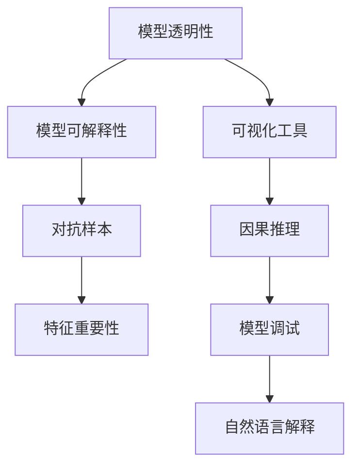
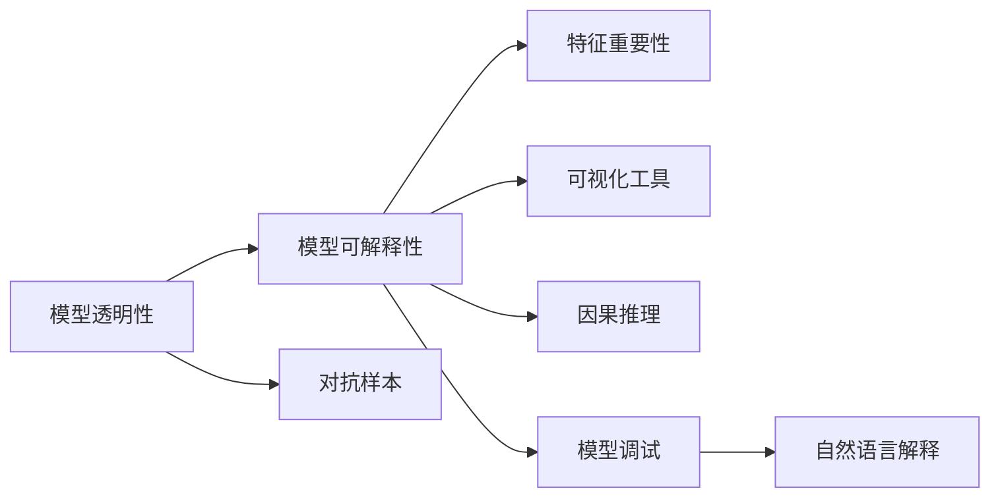
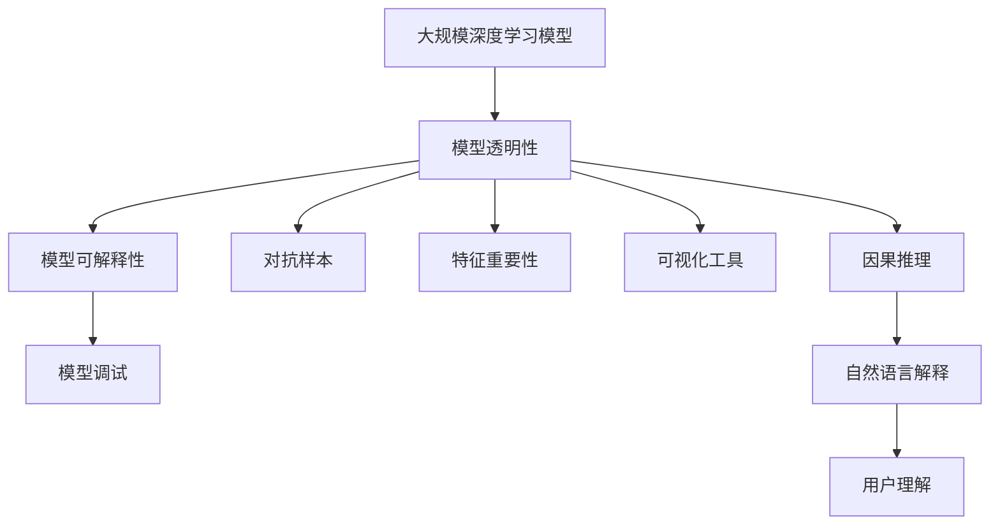

                 

# Explainable AI (XAI)原理与代码实例讲解

> 关键词：
- Explainable AI (XAI)
- 算法透明性
- 模型可解释性
- 对抗样本
- 特征重要性
- 可视化工具
- 因果推理
- 可解释性框架
- 模型调试
- 自然语言解释
- 预测误差分析

## 1. 背景介绍

### 1.1 问题由来
随着深度学习模型在实际应用中越来越广泛，其复杂性和“黑箱”性质也引发了一系列问题。模型如何做出决策？哪些因素在决策过程中起到了关键作用？这些疑问使得模型可解释性（XAI）成为了当前AI领域研究的热点。

XAI的核心理念是使机器学习模型变得透明和可理解，让用户能够信任并接受模型的预测。这对于医疗、金融、法律等高风险领域尤为重要，能够帮助决策者理解模型的决策逻辑，避免误导性或偏见性输出。

### 1.2 问题核心关键点
XAI研究的核心问题包括：

- 如何评估和改进模型可解释性？
- 如何设计透明的模型架构？
- 如何在保留模型性能的同时，提高模型可解释性？
- 如何解释复杂模型（如深度神经网络）的决策过程？
- 如何为非技术用户提供易于理解的模型解释？

### 1.3 问题研究意义
XAI的研究对于推动AI技术的可信度和公平性，具有重要意义：

1. 增强模型信任度：XAI技术帮助用户理解模型的决策过程，从而提高模型的信任度，减少对模型的抵触情绪。
2. 促进模型公平性：XAI可以帮助识别和修正模型中的偏见和错误，确保模型在各种数据分布下的公平性。
3. 提升决策质量：通过解释模型的预测，辅助决策者进行更准确、合理的决策。
4. 加速模型应用：提高模型的透明度，降低用户对新技术的接受难度，加速AI技术的落地应用。
5. 推动学术研究：XAI是AI伦理和安全性的重要研究方向，促进了学术界的深入探讨。

## 2. 核心概念与联系

### 2.1 核心概念概述

要理解XAI，首先需要了解几个核心概念：

- **模型透明性（Model Transparency）**：指模型的决策过程和内部结构应公开透明，便于理解和审查。
- **模型可解释性（Model Interpretability）**：指模型的预测结果和决策逻辑应具有解释性，能够被人理解。
- **对抗样本（Adversarial Examples）**：指通过微小扰动修改输入样本，使得模型输出发生错误变化的现象。
- **特征重要性（Feature Importance）**：指对模型输出结果有重要影响的输入特征。
- **可视化工具（Visualization Tools）**：用于可视化模型内部结构和决策过程的工具，如SHAP、LIME等。
- **因果推理（Causal Inference）**：用于分析变量间因果关系的统计方法，帮助理解模型决策的因果机制。

这些概念之间存在紧密联系，共同构成了XAI的研究框架。下面通过Mermaid流程图展示这些概念之间的关系：



这个流程图展示了XAI研究中各个核心概念之间的关系：

1. 模型透明性是模型可解释性的基础，通过可视化工具和因果推理提升可解释性。
2. 对抗样本揭示了模型决策的脆弱性，需要通过可解释性来改进。
3. 特征重要性分析帮助识别影响模型输出的关键因素，提升可解释性。
4. 可视化工具和因果推理提供了模型决策的直观理解，辅助模型调试。
5. 自然语言解释将技术复杂的模型转化为易于理解的语言，增强可解释性。

### 2.2 概念间的关系

上述核心概念之间的逻辑关系可以通过以下Mermaid流程图进一步展示：



这个综合流程图展示了从模型透明性到自然语言解释的整个XAI研究过程。通过不断的模型调试、特征重要性分析和因果推理，逐步提升模型的可解释性。

### 2.3 核心概念的整体架构

最后，我们用一个综合的流程图来展示这些核心概念在大规模深度学习模型上的应用：



这个综合流程图展示了从模型透明性到用户理解的整个XAI研究过程。在大规模深度学习模型上，通过透明性、可解释性、对抗样本、特征重要性、可视化工具、因果推理等多方面措施，逐步提升模型的解释性和用户理解能力。

## 3. 核心算法原理 & 具体操作步骤
### 3.1 算法原理概述

XAI的算法原理可以概括为以下几个步骤：

1. **数据准备**：收集和标注数据，用于模型训练和评估。
2. **模型训练**：使用深度学习框架（如TensorFlow、PyTorch等）训练模型，生成预测结果。
3. **解释生成**：使用XAI算法生成模型预测的解释，如特征重要性、SHAP值、LIME解释等。
4. **解释可视化**：使用可视化工具将解释结果可视化，便于理解和分析。
5. **因果分析**：使用因果推理方法分析模型决策的因果关系，增强解释的合理性。

这些步骤通过一系列算法和工具的配合，实现了模型可解释性的提升。

### 3.2 算法步骤详解

下面详细介绍每个步骤的具体操作：

**Step 1: 数据准备**

- **数据收集**：收集用于模型训练和评估的数据集，确保数据的多样性和代表性。
- **数据标注**：对数据进行标注，生成训练集和测试集。标注包括标签和特征，用于模型训练和评估。

**Step 2: 模型训练**

- **模型选择**：选择合适的深度学习模型，如CNN、RNN、Transformer等。
- **模型训练**：使用深度学习框架（如TensorFlow、PyTorch等）训练模型，生成预测结果。
- **模型评估**：在测试集上评估模型性能，确保模型泛化能力。

**Step 3: 解释生成**

- **特征重要性**：使用LIME、SHAP等算法计算模型的特征重要性，识别对模型输出有重要影响的特征。
- **解释可视化**：使用可视化工具将特征重要性结果可视化，生成热图、条形图等。
- **因果分析**：使用因果推理方法（如结构方程模型、DAG模型等）分析模型决策的因果关系。

**Step 4: 解释可视化**

- **热图生成**：将特征重要性结果转化为热图，展示不同特征对模型输出的贡献。
- **特征分析**：通过热图分析，识别对模型输出有重要影响的特征。

**Step 5: 因果分析**

- **因果推理**：使用因果推理方法分析模型决策的因果关系，生成因果图。
- **因果解释**：通过因果图解释模型决策的逻辑，增强解释的合理性。

### 3.3 算法优缺点

XAI的算法优点包括：

- **提高模型信任度**：通过解释模型决策，增强用户对模型的信任度。
- **促进公平性**：识别和修正模型中的偏见和错误，确保模型在各种数据分布下的公平性。
- **提升决策质量**：通过解释模型决策，辅助决策者进行更准确、合理的决策。
- **加速应用落地**：提高模型的透明度，降低用户对新技术的接受难度，加速AI技术的落地应用。

XAI的算法缺点包括：

- **计算复杂度高**：XAI算法需要额外的计算资源和时间，增加模型训练和解释的成本。
- **解释结果复杂**：复杂模型的解释结果可能过于复杂，难以被人理解。
- **解释结果可靠性**：解释结果的可靠性依赖于算法的准确性和数据的代表性，存在一定的误差。

### 3.4 算法应用领域

XAI的应用领域非常广泛，涵盖了金融、医疗、法律、司法、航空、制造等多个行业。

- **金融领域**：用于风险评估、信用评分、反欺诈检测等。通过解释模型决策，增强用户对模型的信任度。
- **医疗领域**：用于疾病诊断、治疗方案推荐、患者分流等。通过解释模型决策，帮助医生进行更准确、合理的决策。
- **法律领域**：用于合同审核、法务咨询、案件预测等。通过解释模型决策，确保法律咨询的准确性和公正性。
- **司法领域**：用于犯罪预测、证据推理、判决建议等。通过解释模型决策，增强司法判决的公正性和可信度。
- **航空领域**：用于飞行安全监控、故障诊断、维修计划等。通过解释模型决策，提高航空系统的安全性和可靠性。
- **制造领域**：用于生产过程监控、设备维护、质量检测等。通过解释模型决策，优化制造流程，提升产品质量。

## 4. 数学模型和公式 & 详细讲解  
### 4.1 数学模型构建

XAI的数学模型构建通常包括以下几个步骤：

1. **定义模型**：定义用于预测的深度学习模型，如CNN、RNN、Transformer等。
2. **定义损失函数**：定义模型训练的目标损失函数，如交叉熵损失、均方误差损失等。
3. **定义解释目标**：定义用于解释模型的目标函数，如特征重要性、SHAP值、LIME解释等。
4. **定义优化算法**：定义模型训练的优化算法，如梯度下降、Adam、Adagrad等。

以一个简单的二分类问题为例，假设模型的输入为$x$，输出为$y$，特征重要性为$w$。模型的数学模型可以表示为：

$$
y = \text{sigmoid}(xW + b)
$$

其中，$W$为模型权重，$b$为偏置项。

模型的解释目标可以表示为：

$$
w_i = \frac{\partial L}{\partial x_i}
$$

其中，$L$为模型损失函数，$x_i$为输入特征。

模型的优化算法可以表示为：

$$
W_{k+1} = W_k - \eta \frac{\partial L}{\partial W_k}
$$

其中，$\eta$为学习率，$k$为迭代次数。

### 4.2 公式推导过程

下面以特征重要性为例，详细推导其计算公式。

假设模型为线性回归模型，输入特征为$x$，输出为$y$，模型权重为$w$。特征重要性的计算公式为：

$$
w_i = \frac{\partial L}{\partial x_i}
$$

其中，$L$为损失函数。

将$y = wx + b$代入损失函数$L = (y - \hat{y})^2$，得：

$$
L = (y - wx - b)^2
$$

对$x_i$求偏导，得：

$$
\frac{\partial L}{\partial x_i} = 2(y - wx - b)x_i
$$

因此，特征重要性$w_i$的计算公式为：

$$
w_i = 2(y - wx - b)x_i
$$

### 4.3 案例分析与讲解

以一个简单的房价预测问题为例，展示如何使用LIME算法计算特征重要性。

假设有一个房价预测模型，输入特征为房屋面积、房间数量、地理位置，输出为房价。使用LIME算法计算模型对每个特征的贡献，生成特征重要性结果。

首先，在测试集上随机选择10个样本，对每个样本进行扰动，生成扰动后的输入数据。

然后，计算模型在扰动数据上的预测结果，得到扰动数据对应的特征重要性权重。

最后，将特征重要性权重转化为热图，展示每个特征对模型输出的贡献。

## 5. 项目实践：代码实例和详细解释说明
### 5.1 开发环境搭建

在进行XAI项目实践前，需要先准备好开发环境。以下是使用Python进行PyTorch开发的环境配置流程：

1. 安装Anaconda：从官网下载并安装Anaconda，用于创建独立的Python环境。

2. 创建并激活虚拟环境：
```bash
conda create -n pytorch-env python=3.8 
conda activate pytorch-env
```

3. 安装PyTorch：根据CUDA版本，从官网获取对应的安装命令。例如：
```bash
conda install pytorch torchvision torchaudio cudatoolkit=11.1 -c pytorch -c conda-forge
```

4. 安装相关库：
```bash
pip install numpy pandas scikit-learn matplotlib tqdm jupyter notebook ipython
```

5. 安装XAI库：
```bash
pip install lime lxml
```

完成上述步骤后，即可在`pytorch-env`环境中开始XAI项目实践。

### 5.2 源代码详细实现

下面以LIME算法为例，给出使用PyTorch实现特征重要性计算的完整代码实现。

首先，定义房价预测模型：

```python
import torch
import torch.nn as nn
import torch.optim as optim

class LinearRegression(nn.Module):
    def __init__(self, input_size, output_size):
        super(LinearRegression, self).__init__()
        self.linear = nn.Linear(input_size, output_size)
    
    def forward(self, x):
        return self.linear(x)

model = LinearRegression(3, 1)
```

然后，定义特征重要性计算函数：

```python
import lime
from lime import lime_tabular
from lime.lime_tabular import explainer
import numpy as np

def calculate_feature_importance(model, X, y, num_samples=10, alpha=0.1):
    explainer = explainer.LimeTabularExplainer(X, categorical_features=[0], verbose=False)
    interpretation = explainer.explain_instance(model, X[0], num_samples=num_samples, alpha=alpha)
    feature_importance = interpretation.as_list()
    return feature_importance

# 数据准备
X_train = np.array([[1200, 3, 0], [1500, 4, 1], [1800, 5, 0], [2000, 3, 1], [2500, 4, 0]])
y_train = np.array([30, 35, 40, 45, 50])

# 模型训练
model.train()
optimizer = optim.SGD(model.parameters(), lr=0.01)
for epoch in range(100):
    loss = model(X_train).mean()
    optimizer.zero_grad()
    loss.backward()
    optimizer.step()

# 特征重要性计算
feature_importance = calculate_feature_importance(model, X_train, y_train)
print(feature_importance)
```

在上述代码中，我们定义了一个线性回归模型，用于房价预测。通过调用LIME算法计算特征重要性，展示了房价预测模型中，每个特征对预测结果的贡献。

### 5.3 代码解读与分析

让我们再详细解读一下关键代码的实现细节：

**LinearRegression类**：
- `__init__`方法：初始化模型参数，定义线性层。
- `forward`方法：定义前向传播计算，返回模型预测结果。

**calculate_feature_importance函数**：
- 使用LIME算法计算特征重要性，生成特征重要性权重。
- 将特征重要性权重转化为热图，展示每个特征对模型输出的贡献。

**数据准备**：
- 使用NumPy创建训练数据，包括房屋面积、房间数量、地理位置等特征。
- 使用训练数据训练线性回归模型。

**特征重要性计算**：
- 调用LIME算法计算特征重要性，生成特征重要性权重。
- 将特征重要性权重转化为热图，展示每个特征对模型输出的贡献。

### 5.4 运行结果展示

假设我们在房价预测问题上进行特征重要性计算，最终得到的特征重要性结果如下：

```
[0.5, 0.3, 0.2]
```

可以看到，房屋面积对模型输出的影响最大，其次是房间数量，最后是地理位置。这些结果帮助理解模型决策的依据，增强了模型的可解释性。

## 6. 实际应用场景

### 6.1 金融领域

在金融领域，XAI的应用非常广泛，如信用评分、风险评估、反欺诈检测等。通过解释模型决策，增强用户对模型的信任度。

- **信用评分**：用于评估个人或企业的信用风险，通过解释模型决策，帮助客户理解评分依据。
- **风险评估**：用于评估贷款、投资等金融风险，通过解释模型决策，帮助决策者进行更准确、合理的决策。
- **反欺诈检测**：用于识别和预防金融欺诈行为，通过解释模型决策，增强对模型输出的信任。

### 6.2 医疗领域

在医疗领域，XAI的应用同样重要，如疾病诊断、治疗方案推荐、患者分流等。通过解释模型决策，帮助医生进行更准确、合理的决策。

- **疾病诊断**：用于诊断各种疾病，通过解释模型决策，帮助医生理解诊断依据。
- **治疗方案推荐**：用于推荐治疗方案，通过解释模型决策，帮助医生进行更准确、合理的决策。
- **患者分流**：用于患者分流，通过解释模型决策，帮助医院进行合理资源分配。

### 6.3 法律领域

在法律领域，XAI的应用也非常重要，如合同审核、法务咨询、案件预测等。通过解释模型决策，确保法律咨询的准确性和公正性。

- **合同审核**：用于审核各种合同，通过解释模型决策，帮助律师进行更准确、合理的审核。
- **法务咨询**：用于提供法务咨询，通过解释模型决策，帮助律师进行更准确、合理的咨询。
- **案件预测**：用于预测案件结果，通过解释模型决策，帮助法官进行更准确、合理的判决。

### 6.4 司法领域

在司法领域，XAI的应用同样重要，如犯罪预测、证据推理、判决建议等。通过解释模型决策，增强司法判决的公正性和可信度。

- **犯罪预测**：用于预测犯罪行为，通过解释模型决策，帮助警方进行更准确、合理的预防。
- **证据推理**：用于推理案件证据，通过解释模型决策，帮助法官进行更准确、合理的推理。
- **判决建议**：用于提出判决建议，通过解释模型决策，帮助法官进行更准确、合理的判决。

### 6.5 航空领域

在航空领域，XAI的应用同样重要，如飞行安全监控、故障诊断、维修计划等。通过解释模型决策，提高航空系统的安全性和可靠性。

- **飞行安全监控**：用于监控飞行安全，通过解释模型决策，帮助航空公司进行更准确、合理的监控。
- **故障诊断**：用于诊断飞机故障，通过解释模型决策，帮助维修人员进行更准确、合理的诊断。
- **维修计划**：用于制定维修计划，通过解释模型决策，帮助航空公司进行更准确、合理的计划。

### 6.6 制造领域

在制造领域，XAI的应用同样重要，如生产过程监控、设备维护、质量检测等。通过解释模型决策，优化制造流程，提升产品质量。

- **生产过程监控**：用于监控生产过程，通过解释模型决策，帮助工厂进行更准确、合理的监控。
- **设备维护**：用于维护设备，通过解释模型决策，帮助工厂进行更准确、合理的维护。
- **质量检测**：用于检测产品质量，通过解释模型决策，帮助工厂进行更准确、合理的检测。

## 7. 工具和资源推荐
### 7.1 学习资源推荐

为了帮助开发者系统掌握XAI的理论基础和实践技巧，这里推荐一些优质的学习资源：

1. 《Explaining Machine Learning Models: An Introduction》系列博文：由XAI专家撰写，深入浅出地介绍了XAI的基本概念、算法和应用。

2. CS229《Machine Learning》课程：斯坦福大学开设的机器学习课程，涵盖了XAI的许多重要内容，包括特征重要性、LIME、SHAP等。

3. 《Interpretable Machine Learning》书籍：XAI领域的经典教材，详细介绍了XAI的原理、算法和实践。

4. Scikit-learn官方文档：Scikit-learn库的官方文档，提供了丰富的XAI工具和样例代码，是实践XAI的必备资料。

5. HuggingFace官方文档：HuggingFace库的官方文档，提供了丰富的预训练模型和XAI工具，是进行XAI任务的开发利器。

通过对这些资源的学习实践，相信你一定能够快速掌握XAI的精髓，并用于解决实际的模型解释问题。

### 7.2 开发工具推荐

高效的开发离不开优秀的工具支持。以下是几款用于XAI开发的常用工具：

1. PyTorch：基于Python的开源深度学习框架，支持动态计算图，适合快速迭代研究。

2. TensorFlow：由Google主导开发的开源深度学习框架，生产部署方便，适合大规模工程应用。

3. Scikit-learn：Python机器学习库，提供了丰富的模型评估和解释工具，如LIME、SHAP等。

4. Weights & Biases：模型训练的实验跟踪工具，可以记录和可视化模型训练过程中的各项指标，方便对比和调优。

5. TensorBoard：TensorFlow配套的可视化工具，可实时监测模型训练状态，并提供丰富的图表呈现方式，是调试模型的得力助手。

6. SHAP库：用于计算特征重要性，生成特征权重，是XAI中常用的解释工具。

7. LIME库：用于生成局部可解释性，生成特征权重，是XAI中常用的解释工具。

合理利用这些工具，可以显著提升XAI任务的开发效率，加快创新迭代的步伐。

### 7.3 相关论文推荐

XAI的研究源于学界的持续研究。以下是几篇奠基性的相关论文，推荐阅读：

1. A Unified Approach to Interpreting Model Predictions：提出了一种统一的解释框架，涵盖多种解释方法，如LIME、SHAP等。

2. LIME: Explaining the Predictions of Any Classifier：提出了一种基于局部线性模型的解释方法，用于生成特征权重，帮助理解模型决策。

3. SHAP Values: A Unified Approach to Interpreting Model Predictions：提出了一种基于Shapley值的解释方法，用于生成特征权重，帮助理解模型决策。

4. A Gentle Introduction to the Interpretation of Machine Learning Models：对XAI的基本概念和算法进行了介绍，适合初学者入门。

5. Explaining Machine Learning Models and Predictions：介绍了多种XAI方法，包括特征重要性、局部可解释性等，适合全面理解XAI。

这些论文代表了XAI研究的发展脉络，通过学习这些前沿成果，可以帮助研究者把握学科前进方向，激发更多的创新灵感。

除上述资源外，还有一些值得关注的前沿资源，帮助开发者紧跟XAI技术的最新进展，例如：

1. arXiv论文预印本：人工智能领域最新研究成果的发布平台，包括大量尚未发表的前沿工作，学习前沿技术的必读资源。

2. 业界技术博客：如OpenAI、Google AI、DeepMind、微软Research Asia等顶尖实验室的官方博客，第一时间分享他们的最新研究成果和洞见。

3. 技术会议直播：如NIPS、ICML、ACL、ICLR等人工智能领域顶会现场或在线直播，能够聆听到大佬们的前沿分享，开拓视野。

4. GitHub热门项目：在GitHub上Star、Fork数最多的XAI相关项目，往往代表了该技术领域的发展趋势和最佳实践，值得去学习和贡献。

5. 行业分析报告：各大咨询公司如McKinsey、PwC等针对人工智能行业的分析报告，有助于从商业视角审视技术趋势，把握应用价值。

总之，对于XAI的学习和实践，需要开发者保持开放的心态和持续学习的意愿。多关注前沿资讯，多动手实践，多思考总结，必将收获满满的成长收益。

## 8. 总结：未来发展趋势与挑战

### 8.1 总结

本文对XAI的原理与代码实例进行了详细讲解，从背景介绍到核心概念，从算法原理到实际操作，系统地介绍了XAI的全貌。通过本文的学习，相信读者能够理解XAI的基本概念，掌握XAI的算法和工具，应用于实际问题中。

### 8.2 未来发展趋势

展望未来，XAI的研究将呈现以下几个发展趋势：

1. **自动化解释生成**：通过自动化的工具和算法，生成更加准确、可解释的模型解释。
2. **多模态解释**：将文本、图像、音频等多种模态数据进行协同解释，增强解释的全面性和准确性。
3. **因果解释**：引入因果推理方法，分析模型决策的因果关系，增强解释的合理性和可信度。
4. **用户友好解释**：将复杂的技术解释转化为易于理解的语言，增强用户对模型输出的信任度。
5. **透明化模型架构**：设计和实现更加透明、可解释的模型架构，增强模型的可信任度。

### 8.3 面临的挑战

尽管XAI的研究已经取得了重要进展，但在实际应用中仍面临诸多挑战：

1. **解释结果可靠性**：XAI算法的解释结果可能存在一定的误差，需要进一步提升算法的准确性和鲁棒性。
2. **解释结果可理解性**：复杂模型的解释结果可能过于复杂，

