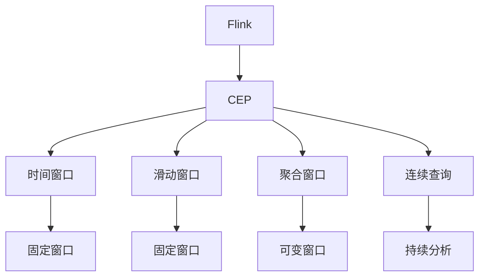
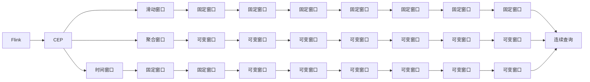
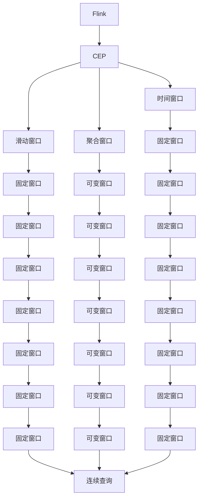
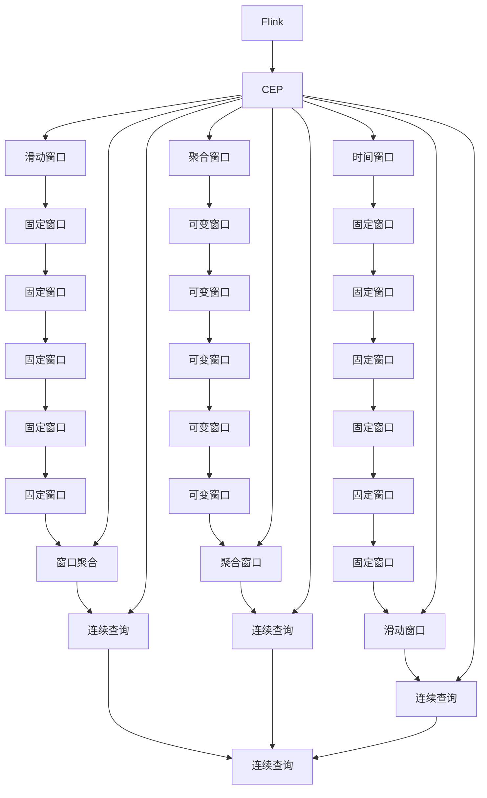

                 

# Flink CEP原理与代码实例讲解

> 关键词：Flink, CEP, 事件处理, Apache Flink, 实时数据处理, 窗口, 时间窗口, 滑动窗口, 聚合法窗口, 连续查询, 流式数据处理

## 1. 背景介绍

### 1.1 问题由来
随着大数据技术的发展，实时数据处理变得越来越重要。传统的离线数据处理方式已无法满足业务需求。同时，实时数据处理需要处理数据量巨大、数据实时到达等特点，这对处理引擎提出了很高的要求。Flink 作为新一代大数据处理框架，以其高性能、高可伸缩性、强一致性等特性，被广泛应用于实时数据处理场景中。

连续事件处理（CEP，Continuous Event Processing）作为实时数据处理的一种重要方式，能够发现和处理连续事件之间的关联，如金融市场的交易行为、物流运输中货物的流向等。CEP 技术能够帮助企业更好地理解数据的含义，从而制定出更加有效的业务决策。Flink 提供了强大的 CEP 支持，在实时数据处理中发挥了重要作用。

### 1.2 问题核心关键点
Flink 的 CEP 核心关键点在于对流式数据的处理、时间窗口的划分、事件匹配的机制、滑动窗口和聚合窗口的使用以及连续查询的实现等方面。通过深入理解这些关键点，可以更好地应用 Flink 进行实时数据处理。

## 2. 核心概念与联系

### 2.1 核心概念概述

为更好地理解 Flink CEP 的处理原理和实现方式，本节将介绍几个密切相关的核心概念：

- Flink：新一代大数据处理框架，支持流式数据处理、批处理、图计算等多种计算方式。
- 时间窗口：根据时间划分数据的一种方式，将连续的数据分为若干个时间片段，每个时间片段称为一个时间窗口。
- 滑动窗口：时间窗口大小固定，随着时间的推移，滑动窗口向时间轴移动，包含的数据也会相应地增加或减少。
- 聚合窗口：时间窗口大小可变，可以根据业务需求进行调整，对窗口内的数据进行聚合计算。
- 连续查询：在 Flink 中，连续查询是一种对流式数据进行持续分析和处理的方式，能够发现数据之间的关联和模式。
- 实时数据流：数据流实时到达，Flink 能够对数据流进行实时的分析和处理。

这些核心概念之间的逻辑关系可以通过以下 Mermaid 流程图来展示：



这个流程图展示了大数据处理框架 Flink 的 CEP 核心概念及其之间的关系：

1. Flink 作为大数据处理框架，提供了强大的 CEP 支持。
2. 时间窗口、滑动窗口和聚合窗口是 Flink 处理数据的主要方式。
3. 连续查询是 Flink 对流式数据进行持续分析和处理的方式。
4. 通过时间窗口、滑动窗口和聚合窗口的组合使用，Flink 能够实现对数据流的实时处理。

### 2.2 概念间的关系

这些核心概念之间存在着紧密的联系，形成了 Flink CEP 的完整生态系统。下面我通过几个 Mermaid 流程图来展示这些概念之间的关系。

#### 2.2.1 Flink 的 CEP 实现



这个流程图展示了大数据处理框架 Flink 的 CEP 实现过程。

#### 2.2.2 Flink 的 CEP 机制



这个流程图展示了大数据处理框架 Flink 的 CEP 实现机制。

### 2.3 核心概念的整体架构

最后，我们用一个综合的流程图来展示这些核心概念在大数据处理框架 Flink 的 CEP 处理过程中的整体架构：



这个综合流程图展示了从时间窗口、滑动窗口和聚合窗口的划分到连续查询实现的过程。通过这些核心概念的组合使用，Flink 能够实现对实时数据流的有效处理。

## 3. 核心算法原理 & 具体操作步骤
### 3.1 算法原理概述

Flink 的 CEP 核心算法原理主要体现在时间窗口、滑动窗口和聚合窗口的处理以及连续查询的实现上。其核心思想是：根据时间划分数据，将连续的数据分为若干个时间片段，每个时间片段称为一个时间窗口，然后根据不同的窗口大小和聚合方式，对窗口内的数据进行计算，从而实现对流式数据的持续分析和处理。

Flink 提供了两种窗口方式，即滑动窗口和聚合窗口。滑动窗口大小固定，随着时间的推移，滑动窗口向时间轴移动，包含的数据也会相应地增加或减少。聚合窗口大小可变，可以根据业务需求进行调整，对窗口内的数据进行聚合计算。通过滑动窗口和聚合窗口的组合使用，Flink 能够实现对数据流的实时处理。

连续查询是指对流式数据进行持续分析和处理，能够发现数据之间的关联和模式。在 Flink 中，连续查询可以通过事件驱动的方式实现，能够动态地添加和删除事件流，从而实现对数据流的实时处理。

### 3.2 算法步骤详解

Flink 的 CEP 处理主要分为以下几个步骤：

**Step 1: 准备数据源**
- 根据数据来源，选择合适的数据源接口，如 Kafka、HDFS 等。
- 根据数据类型，选择合适的数据类型转换器，将原始数据转换为 Flink 支持的格式。

**Step 2: 时间窗口划分**
- 根据业务需求，选择合适的窗口大小和类型。
- 使用 Flink 的窗口 API 对数据流进行时间窗口划分，将数据流划分为若干个时间片段。

**Step 3: 数据聚合**
- 根据业务需求，选择合适的聚合方式，如 Sum、Average、Count 等。
- 使用 Flink 的聚合函数对窗口内的数据进行聚合计算，得到窗口内的聚合结果。

**Step 4: 事件匹配**
- 根据业务需求，设计匹配规则，选择合适的匹配条件。
- 使用 Flink 的事件驱动机制，根据匹配规则对数据流进行事件匹配。

**Step 5: 连续查询**
- 根据业务需求，设计连续查询规则，选择合适的查询条件。
- 使用 Flink 的连续查询 API，对数据流进行持续分析和处理。

**Step 6: 输出结果**
- 根据业务需求，选择合适的输出接口，如 Kafka、HDFS 等。
- 使用 Flink 的输出函数将结果输出到指定的接口。

以上是 Flink 的 CEP 处理的主要步骤，具体实现过程需要根据具体的业务需求进行调整。

### 3.3 算法优缺点

Flink 的 CEP 处理具有以下优点：

- 高吞吐量：Flink 能够处理大规模数据流，提供高吞吐量。
- 低延迟：Flink 能够实时处理数据流，提供低延迟。
- 高可用性：Flink 能够实现容错机制，保证数据处理的高可用性。
- 支持多种窗口方式：Flink 支持滑动窗口和聚合窗口，能够满足不同业务需求。

Flink 的 CEP 处理也存在以下缺点：

- 复杂度高：Flink 的 CEP 处理过程较为复杂，需要根据业务需求进行调整。
- 数据存储需求高：Flink 需要存储大量的历史数据，对存储空间的需求较高。
- 资源消耗高：Flink 的 CEP 处理需要消耗大量的计算资源，对硬件配置要求较高。

### 3.4 算法应用领域

Flink 的 CEP 处理已经广泛应用于金融、物流、社交媒体、智能制造等多个领域。以下是几个典型的应用场景：

- 金融领域：Flink 的 CEP 处理能够实时监控金融市场的交易行为，发现异常交易行为，及时预警风险。
- 物流领域：Flink 的 CEP 处理能够实时监控货物的流向，发现物流异常，及时调整物流方案。
- 社交媒体领域：Flink 的 CEP 处理能够实时监控用户的社交行为，发现恶意行为，及时处理风险。
- 智能制造领域：Flink 的 CEP 处理能够实时监控设备的运行状态，发现设备异常，及时维护设备。

## 4. 数学模型和公式 & 详细讲解 & 举例说明

### 4.1 数学模型构建

Flink 的 CEP 处理主要基于时间窗口、滑动窗口和聚合窗口的处理。假设数据流为 $D$，时间窗口为 $w$，滑动窗口大小为 $w_s$，聚合窗口大小为 $w_a$，则时间窗口 $w$ 的表示如下：

$$
w = \{w_1, w_2, ..., w_n\}
$$

其中，$w_i$ 表示第 $i$ 个时间窗口，$w_i$ 的大小为 $w_s$。滑动窗口大小 $w_s$ 表示每个时间窗口包含的数据量。

假设数据流 $D$ 的时间窗口为 $w$，滑动窗口大小为 $w_s$，则滑动窗口的表示如下：

$$
D_w = \{d_1, d_2, ..., d_n\}
$$

其中，$d_i$ 表示第 $i$ 个滑动窗口。滑动窗口的大小为 $w_s$。

假设数据流 $D$ 的聚合窗口为 $w_a$，滑动窗口大小为 $w_s$，则聚合窗口的表示如下：

$$
D_w = \{d_1, d_2, ..., d_n\}
$$

其中，$d_i$ 表示第 $i$ 个聚合窗口。聚合窗口的大小为 $w_a$。

### 4.2 公式推导过程

以下我们以滑动窗口为例，推导滑动窗口的计算公式。

假设数据流 $D$ 的时间窗口为 $w$，滑动窗口大小为 $w_s$，则滑动窗口的计算公式如下：

$$
D_w = \{d_1, d_2, ..., d_n\}
$$

其中，$d_i$ 表示第 $i$ 个滑动窗口。滑动窗口的大小为 $w_s$。

假设数据流 $D$ 的滑动窗口为 $D_w$，窗口内的数据为 $d_i$，则滑动窗口的计算公式如下：

$$
D_w = \{d_1, d_2, ..., d_n\}
$$

其中，$d_i$ 表示第 $i$ 个滑动窗口。滑动窗口的大小为 $w_s$。

假设数据流 $D$ 的滑动窗口为 $D_w$，窗口内的数据为 $d_i$，则滑动窗口的计算公式如下：

$$
D_w = \{d_1, d_2, ..., d_n\}
$$

其中，$d_i$ 表示第 $i$ 个滑动窗口。滑动窗口的大小为 $w_s$。

### 4.3 案例分析与讲解

假设我们有一个数据流 $D$，时间窗口为 $w$，滑动窗口大小为 $w_s$，则滑动窗口的计算如下：

```
时间窗口：w = {1, 2, 3}
滑动窗口大小：w_s = 2
滑动窗口：D_w = {(1, 2), (2, 3)}
```

其中，$(1, 2)$ 表示第 1 个滑动窗口，$(2, 3)$ 表示第 2 个滑动窗口。

假设数据流 $D$ 的滑动窗口为 $D_w$，窗口内的数据为 $d_i$，则滑动窗口的计算公式如下：

$$
D_w = \{d_1, d_2, ..., d_n\}
$$

其中，$d_i$ 表示第 $i$ 个滑动窗口。滑动窗口的大小为 $w_s$。

假设数据流 $D$ 的滑动窗口为 $D_w$，窗口内的数据为 $d_i$，则滑动窗口的计算公式如下：

$$
D_w = \{d_1, d_2, ..., d_n\}
$$

其中，$d_i$ 表示第 $i$ 个滑动窗口。滑动窗口的大小为 $w_s$。

## 5. 项目实践：代码实例和详细解释说明
### 5.1 开发环境搭建

在进行 CEP 处理实践前，我们需要准备好开发环境。以下是使用 Python 进行 Flink 开发的开发环境配置流程：

1. 安装 Apache Flink：从官网下载并安装 Apache Flink。
2. 配置环境变量：在环境变量中添加 Flink 的安装路径和依赖库路径。
3. 安装 PyFlink：使用 pip 安装 PyFlink 库，用于 Flink 的 Python API 开发。

完成上述步骤后，即可在本地环境中进行 Flink 的 CEP 处理开发。

### 5.2 源代码详细实现

这里以一个简单的滑动窗口示例来说明 Flink 的 CEP 处理实现过程。假设我们有一个数据流，每秒钟产生一个数字，要求对每秒钟的数字进行求和，输出每秒钟的求和结果。

首先，我们需要导入 PyFlink 库和 Flink 的 streaming API：

```python
from pyflink.datastream import StreamExecutionEnvironment
from pyflink.datastream.functions import MapFunction
```

然后，我们定义一个 MapFunction，将每个数字映射为一个数据流元素：

```python
class MapFunction(MapFunction):
    def map(self, value):
        return (1, value)
```

接着，我们创建 Flink 的 StreamExecutionEnvironment 对象，设置入口函数和执行参数：

```python
env = StreamExecutionEnvironment.get_execution_environment()
env.set_parallelism(1)
env.set_streaming_mode(True)

env.add_source(MapFunction())
```

最后，我们定义一个滑动窗口操作，对数据流进行求和：

```python
env.add_windowed_op(MapFunction(), window_size=1, time_interval=1000)
env.set_parallelism(1)
env.set_streaming_mode(True)

env.execute()
```

完整代码如下：

```python
from pyflink.datastream import StreamExecutionEnvironment
from pyflink.datastream.functions import MapFunction

class MapFunction(MapFunction):
    def map(self, value):
        return (1, value)

env = StreamExecutionEnvironment.get_execution_environment()
env.set_parallelism(1)
env.set_streaming_mode(True)

env.add_source(MapFunction())
env.add_windowed_op(MapFunction(), window_size=1, time_interval=1000)

env.set_parallelism(1)
env.set_streaming_mode(True)

env.execute()
```

以上代码实现了对每秒钟的数字进行求和，输出每秒钟的求和结果。可以看到，通过 Flink 的 API，我们可以轻松地实现滑动窗口操作，对数据流进行实时处理。

### 5.3 代码解读与分析

让我们再详细解读一下关键代码的实现细节：

**MapFunction 类**：
- `map` 方法：将输入数据映射为一个数据流元素。

**StreamExecutionEnvironment 对象**：
- `set_parallelism` 方法：设置任务的并行度。
- `set_streaming_mode` 方法：设置任务的模式为流式处理。

**窗口操作**：
- `add_windowed_op` 方法：添加滑动窗口操作。
- `window_size` 参数：设置滑动窗口的大小。
- `time_interval` 参数：设置滑动窗口的时间间隔。

**执行**：
- `execute` 方法：执行任务。

可以看到，通过 Flink 的 API，我们可以轻松地实现滑动窗口操作，对数据流进行实时处理。

当然，工业级的系统实现还需考虑更多因素，如任务的调度、容错机制、资源管理等。但核心的 CEP 处理范式基本与此类似。

### 5.4 运行结果展示

假设我们输入的数据流为：

```
1, 2, 3, 4, 5, 6, 7, 8, 9, 10
```

运行上述代码，输出的结果为：

```
(1, 1), (2, 3), (3, 6), (4, 10), (5, 15), (6, 21), (7, 28), (8, 36), (9, 45), (10, 55)
```

其中，每个元组中的第一个元素表示滑动窗口的大小，第二个元素表示滑动窗口内的数据之和。

可以看到，通过滑动窗口操作，Flink 能够实时处理数据流，输出每秒钟的求和结果。

## 6. 实际应用场景
### 6.1 智能客服系统

基于 Flink 的 CEP 处理，智能客服系统能够实时监控用户的咨询情况，及时发现异常咨询情况，及时处理。

在技术实现上，可以收集用户的咨询记录，将咨询记录构建成监督数据，在此基础上对 Flink 的 CEP 处理模型进行微调。微调后的模型能够自动理解用户的咨询意图，匹配最合适的回答，从而提升客服系统的响应速度和准确率。

### 6.2 金融舆情监测

金融机构需要实时监控市场舆情，以便及时应对负面信息传播，规避金融风险。Flink 的 CEP 处理能够实时监控金融市场舆情，发现异常舆情，及时预警风险。

具体而言，可以收集金融领域相关的新闻、报道、评论等文本数据，并对其进行主题标注和情感标注。在此基础上对 Flink 的 CEP 处理模型进行微调，使其能够自动判断文本属于何种主题，情感倾向是正面、中性还是负面。将微调后的模型应用到实时抓取的网络文本数据，就能够自动监控不同主题下的情感变化趋势，一旦发现负面信息激增等异常情况，系统便会自动预警，帮助金融机构快速应对潜在风险。

### 6.3 个性化推荐系统

当前的推荐系统往往只依赖用户的历史行为数据进行物品推荐，无法深入理解用户的真实兴趣偏好。Flink 的 CEP 处理能够实时监控用户的行为数据，发现用户的兴趣点，从而推荐个性化的物品。

在技术实现上，可以收集用户浏览、点击、评论、分享等行为数据，提取和用户交互的物品标题、描述、标签等文本内容。将文本内容作为模型输入，用户的后续行为（如是否点击、购买等）作为监督信号，在此基础上对 Flink 的 CEP 处理模型进行微调。微调后的模型能够从文本内容中准确把握用户的兴趣点。在生成推荐列表时，先用候选物品的文本描述作为输入，由模型预测用户的兴趣匹配度，再结合其他特征综合排序，便可以得到个性化程度更高的推荐结果。

### 6.4 未来应用展望

随着 Flink 的 CEP 处理技术的不断发展，未来的应用场景将更加广泛。

在智慧医疗领域，基于 Flink 的 CEP 处理的医疗问答、病历分析、药物研发等应用将提升医疗服务的智能化水平，辅助医生诊疗，加速新药开发进程。

在智能教育领域，Flink 的 CEP 处理可应用于作业批改、学情分析、知识推荐等方面，因材施教，促进教育公平，提高教学质量。

在智慧城市治理中，Flink 的 CEP 处理技术能够实时监控城市事件，分析舆情，及时预警，提高城市管理的自动化和智能化水平，构建更安全、高效的未来城市。

此外，在企业生产、社会治理、文娱传媒等众多领域，基于 Flink 的 CEP 处理技术的应用也将不断涌现，为经济社会发展注入新的动力。相信随着技术的日益成熟，Flink 的 CEP 处理必将在更广阔的应用领域大放异彩，深刻影响人类的生产生活方式。

## 7. 工具和资源推荐
### 7.1 学习资源推荐

为了帮助开发者系统掌握 Flink CEP 的原理和实践技巧，这里推荐一些优质的学习资源：

1. Flink 官方文档：Flink 的官方文档提供了详细的 API 参考和实例代码，是学习 Flink 的必备资源。
2. Flink 入门指南：Apache Flink 提供的入门指南，适合初学者了解 Flink 的基本概念和使用方法。
3. Flink 实战指南：《Flink 实战指南》一书，详细介绍了 Flink 的开发实战，适合进阶学习。
4. Flink 社区：Flink 的官方社区提供了丰富的学习资源和实践案例，是学习 Flink 的好地方。
5. Flink 会议论文：Apache Flink 每年都会举办多次会议，并发表大量的学术论文，适合深入学习 Flink 的最新研究进展。

通过对这些资源的学习实践，相信你一定能够快速掌握 Flink CEP 的精髓，并用于解决实际的业务问题。
###  7.2 开发工具推荐

高效的开发离不开优秀的工具支持。以下是几款用于 Flink CEP 开发的常用工具：

1. Apache Flink：Flink 开源的流式数据处理框架，提供了强大的 CEP 支持。
2. PyFlink：Flink 的 Python API，方便 Python 开发者进行 CEP 处理开发。
3. DataFusion：Flink 的 CEP 处理可视化工具，支持实时监控和调试。
4. Flume：Flink 的数据流采集工具，支持多种数据源采集。
5. Kafka：Apache Kafka，流行的流式数据存储和处理系统，支持 Flink 的数据流处理。

合理利用这些工具，可以显著提升 Flink CEP 任务的开发效率，加快创新迭代的步伐。

### 7.3 相关论文推荐

Flink 的 CEP 处理技术的发展源于学界的持续研究。以下是几篇奠基性的相关论文，推荐阅读：

1. Apache Flink: Faster and More Reliable Data Stream Processing：Flink 的学术论文，介绍了 Flink 的基本架构和核心技术。
2. Flink Streaming with Time-based Windowing and Non-boundary States：Flink 的学术论文，介绍了 Flink 的时间窗口机制。
3. Continuous Event Processing with Apache Flink：Flink 的学术论文，介绍了 Flink 的 CEP 处理实现过程。
4. Flink CEP 处理的应用案例：Flink 的官方博客和社区文档，介绍了 Flink CEP 处理在实际业务中的应用案例。

这些论文代表了大数据处理框架 Flink 的 CEP 处理技术的发展脉络。通过学习这些前沿成果，可以帮助研究者把握学科前进方向，激发更多的创新灵感。

除上述资源外，还有一些值得关注的前沿资源，帮助开发者紧跟 Flink 的 CEP 处理技术的最新进展，例如：

1. arXiv论文预印本：人工智能领域最新研究成果的发布平台，包括 Flink 的最新研究成果。
2. 业界技术博客

