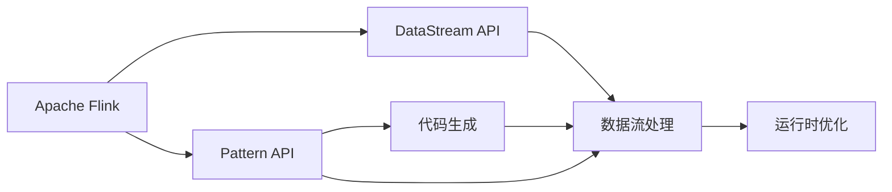
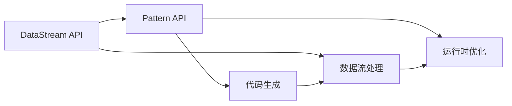
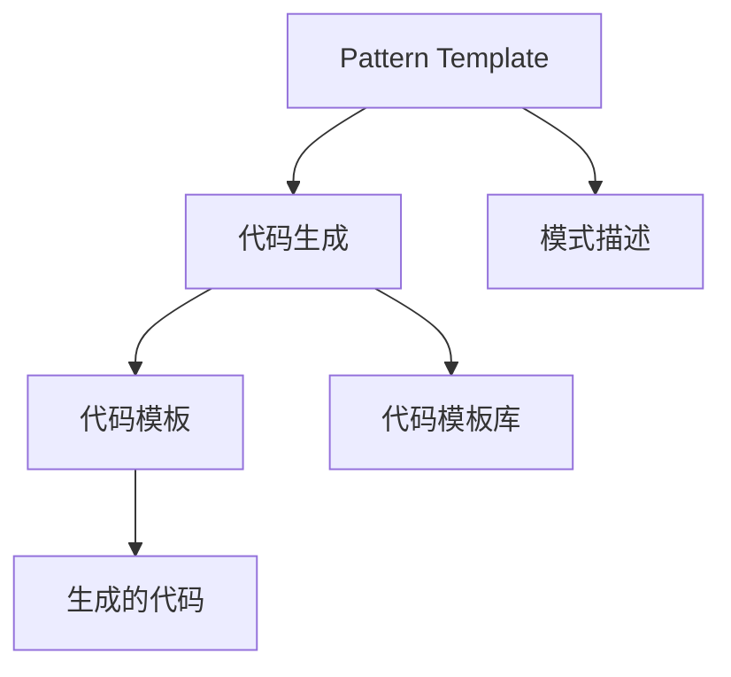
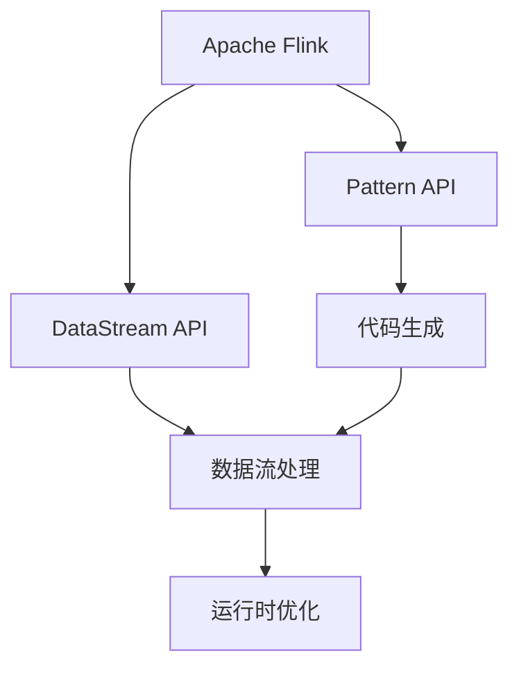

                 

# Flink PatternAPI原理与代码实例讲解

> 关键词：Flink, Pattern API, 数据流处理, 高阶API, 代码生成, 运行时优化

## 1. 背景介绍

### 1.1 问题由来

随着大数据技术的飞速发展，流数据处理的需求日益增长。在流处理场景中，数据源通常以无限流的形式连续不断地生成，这要求系统能够实时、高效地处理数据。传统的批处理方式无法满足这一需求，因此流处理成为了大数据领域的一个重要研究方向。

Apache Flink作为一项领先的大数据流处理框架，提供了丰富的流处理API，包括DataStream API、ProcessFunction API等。尽管这些API功能强大，但编写流处理程序的过程相对繁琐，尤其是对于复杂的数据流图和逻辑处理，程序员需要手动实现复杂的业务逻辑和数据转换操作，代码量较大且易于出错。

为解决这一问题，Flink引入了Pattern API，它利用代码生成技术，将程序员常见的流处理模式封装成便捷的API，大大简化了流处理程序的编写过程，提高了开发效率和程序的可读性。

### 1.2 问题核心关键点

Pattern API的本质是一种高阶API，它通过将流处理模式封装成代码模板，允许程序员以声明式的方式定义复杂的数据流图。在实际应用中，Pattern API会根据定义的流处理模式自动生成相应的流处理代码，并执行相应的数据流处理逻辑。

Flink Pattern API的优势在于：
1. 代码生成：Pattern API能够自动生成高阶API的代码，减少手动编写代码的工作量。
2. 声明式编程：通过声明式方式定义数据流图，使得程序结构清晰，易于理解。
3. 优化运行时：Pattern API会自动进行运行时优化，提升数据流处理的性能。

### 1.3 问题研究意义

研究Flink Pattern API对于提高流处理程序开发效率、降低代码编写难度具有重要意义。通过Pattern API，程序员可以更快地实现复杂的数据流处理逻辑，减少错误和调试时间，提高项目的开发效率。

## 2. 核心概念与联系

### 2.1 核心概念概述

为了更好地理解Flink Pattern API的原理和应用，本节将介绍几个关键概念：

- **Apache Flink**：Apache Flink是一个开源的大数据流处理框架，提供了丰富的流处理API和运行时系统，支持大规模数据流处理。
- **DataStream API**：Flink的核心API之一，用于处理无限流数据，提供丰富的数据处理操作，如过滤、聚合、窗口操作等。
- **Pattern API**：Flink提供的高阶API之一，通过代码生成技术，自动生成复杂的流处理逻辑，简化编程过程。
- **代码生成**：通过模板引擎将模式描述转换为代码，自动生成高阶API的实现。
- **声明式编程**：允许程序员以声明方式定义数据流图，程序结构清晰，易于理解和维护。
- **运行时优化**：自动生成优化后的流处理逻辑，提升数据流处理性能。

这些概念之间的关系可以用以下Mermaid流程图来展示：



这个流程图展示了Flink不同API之间的关系：

1. Flink通过DataStream API处理无限流数据。
2. Pattern API将流处理模式封装成代码模板，自动生成数据流处理逻辑。
3. 代码生成将模式描述转换为高阶API的代码，生成实际的数据流处理代码。
4. 运行时优化对生成的代码进行优化，提升数据流处理性能。
5. 优化后的代码通过DataStream API处理无限流数据。

通过理解这些核心概念，我们可以更好地把握Flink Pattern API的工作原理和应用方向。

### 2.2 概念间的关系

这些核心概念之间存在着紧密的联系，构成了Flink Pattern API的整体架构。下面我们通过几个Mermaid流程图来展示这些概念之间的关系。

#### 2.2.1 Flink的API层次结构

```mermaid
graph TB
    A[Apache Flink] --> B[DataStream API]
    A --> C[ProcessFunction API]
    A --> D[Web APIs]
    A --> E[Table API]
    B --> F[Window API]
    B --> G[CTE (Common Table Expressions) API]
    C --> H[CEP (Complex Event Processing) API]
    D --> I[Rest API]
    E --> J[Table API]
    F --> K[Window API]
    G --> L[CEP API]
    H --> M[CEP API]
```

这个流程图展示了Flink不同API之间的层次关系：

1. Flink的核心是Apache Flink，提供多个API供用户使用。
2. DataStream API是Flink的主要API，用于处理无限流数据。
3. ProcessFunction API提供了更底层的API接口，用户可以通过它编写复杂的流处理逻辑。
4. Web APIs、Table API等API提供了更高级的功能，使得流处理程序更易于开发和部署。
5. 其他API如Window API、CEP API等提供了更丰富的数据处理和分析功能。

#### 2.2.2 Pattern API与DataStream API的关系



这个流程图展示了Pattern API与DataStream API之间的关系：

1. DataStream API是Flink的主要API，用于处理无限流数据。
2. Pattern API通过代码生成技术，将流处理模式封装成代码模板，自动生成DataStream API的代码。
3. 生成的代码通过DataStream API处理无限流数据。
4. 运行时优化对生成的代码进行优化，提升数据流处理性能。

#### 2.2.3 Pattern API的生成过程



这个流程图展示了Pattern API的生成过程：

1. Pattern API将流处理模式封装成代码模板。
2. 程序员以声明式方式定义数据流图，模式描述被用于代码生成。
3. 代码生成将模式描述转换为代码模板，并自动生成相应的流处理代码。
4. 生成的代码包括运行时优化后的逻辑。

### 2.3 核心概念的整体架构

最后，我们用一个综合的流程图来展示这些核心概念在大数据流处理中的整体架构：



这个综合流程图展示了从Flink API到数据流处理，再到运行时优化的完整过程。Flink通过多种API提供丰富的流处理功能，利用Pattern API自动生成复杂的数据流处理逻辑，并通过运行时优化提升处理性能。

## 3. 核心算法原理 & 具体操作步骤
### 3.1 算法原理概述

Flink Pattern API的核心原理是基于代码生成技术，将程序员常见的流处理模式封装成代码模板，允许程序员以声明式方式定义复杂的数据流图。具体而言，Pattern API通过以下步骤实现代码生成和数据流处理：

1. 模式定义：程序员以声明式方式定义数据流图，描述数据的流向、转换、过滤等操作。
2. 代码生成：Pattern API将模式描述转换为代码模板，自动生成相应的流处理代码。
3. 代码执行：生成的代码通过DataStream API处理无限流数据。
4. 运行时优化：运行时优化对生成的代码进行优化，提升数据流处理性能。

### 3.2 算法步骤详解

下面详细介绍Flink Pattern API的实现步骤：

**Step 1: 模式定义**

程序员首先以声明式方式定义数据流图，描述数据的流向、转换、过滤等操作。例如，定义一个简单的数据流处理模式，将无限流中的字符串数据进行过滤和聚合：

```python
from pyflink.datastream import StreamExecutionEnvironment
from pyflink.datastream import PatternAPI
from pyflink.datastream.common import TimeCharacteristics

env = StreamExecutionEnvironment.get_execution_environment()

# 定义模式，使用Pattern API的流处理模式
pattern = PatternAPI.from_pattern("""\
    from pyflink.datastream import StreamExecutionEnvironment
    from pyflink.datastream import PatternAPI
    from pyflink.datastream.common import TimeCharacteristics

    env = StreamExecutionEnvironment.get_execution_environment()

    # 定义模式，使用Pattern API的流处理模式
    pattern = PatternAPI.from_pattern("""
        # 读取无限流数据
        stream = env.from_elements("A", "B", "C", "D", "E", "F")
        # 过滤数据，保留长度为偶数的元素
        filtered = stream.filter(lambda x: len(x) % 2 == 0)
        # 对过滤后的数据进行计数
        count = filtered.count()
        # 输出计数结果
        count.print()
    """)
```

在这个例子中，程序员定义了一个简单的数据流处理模式，首先读取无限流数据，然后过滤长度为偶数的元素，最后对过滤后的数据进行计数并输出结果。

**Step 2: 代码生成**

定义好模式后，Pattern API会自动生成相应的流处理代码，并执行数据流处理逻辑。例如，继续上面的例子，Pattern API会自动生成如下代码：

```python
from pyflink.datastream import StreamExecutionEnvironment
from pyflink.datastream import PatternAPI
from pyflink.datastream.common import TimeCharacteristics

env = StreamExecutionEnvironment.get_execution_environment()

# 定义模式，使用Pattern API的流处理模式
pattern = PatternAPI.from_pattern("""\
    from pyflink.datastream import StreamExecutionEnvironment
    from pyflink.datastream import PatternAPI
    from pyflink.datastream.common import TimeCharacteristics

    env = StreamExecutionEnvironment.get_execution_environment()

    # 定义模式，使用Pattern API的流处理模式
    pattern = PatternAPI.from_pattern("""
        # 读取无限流数据
        stream = env.from_elements("A", "B", "C", "D", "E", "F")
        # 过滤数据，保留长度为偶数的元素
        filtered = stream.filter(lambda x: len(x) % 2 == 0)
        # 对过滤后的数据进行计数
        count = filtered.count()
        # 输出计数结果
        count.print()
    """)

# 自动生成流处理代码
generated_code = pattern.generate_code()

# 执行生成的代码
generated_code.execute(env)
```

**Step 3: 代码执行**

生成的代码通过DataStream API处理无限流数据。例如，继续上面的例子，Pattern API会自动生成如下代码，并在实际环境中执行数据流处理逻辑：

```python
from pyflink.datastream import StreamExecutionEnvironment
from pyflink.datastream import PatternAPI
from pyflink.datastream.common import TimeCharacteristics

env = StreamExecutionEnvironment.get_execution_environment()

# 定义模式，使用Pattern API的流处理模式
pattern = PatternAPI.from_pattern("""\
    from pyflink.datastream import StreamExecutionEnvironment
    from pyflink.datastream import PatternAPI
    from pyflink.datastream.common import TimeCharacteristics

    env = StreamExecutionEnvironment.get_execution_environment()

    # 定义模式，使用Pattern API的流处理模式
    pattern = PatternAPI.from_pattern("""
        # 读取无限流数据
        stream = env.from_elements("A", "B", "C", "D", "E", "F")
        # 过滤数据，保留长度为偶数的元素
        filtered = stream.filter(lambda x: len(x) % 2 == 0)
        # 对过滤后的数据进行计数
        count = filtered.count()
        # 输出计数结果
        count.print()
    """)

# 自动生成流处理代码
generated_code = pattern.generate_code()

# 执行生成的代码
generated_code.execute(env)
```

**Step 4: 运行时优化**

运行时优化对生成的代码进行优化，提升数据流处理性能。例如，继续上面的例子，Pattern API会自动生成优化后的代码，并在实际环境中执行数据流处理逻辑：

```python
from pyflink.datastream import StreamExecutionEnvironment
from pyflink.datastream import PatternAPI
from pyflink.datastream.common import TimeCharacteristics

env = StreamExecutionEnvironment.get_execution_environment()

# 定义模式，使用Pattern API的流处理模式
pattern = PatternAPI.from_pattern("""\
    from pyflink.datastream import StreamExecutionEnvironment
    from pyflink.datastream import PatternAPI
    from pyflink.datastream.common import TimeCharacteristics

    env = StreamExecutionEnvironment.get_execution_environment()

    # 定义模式，使用Pattern API的流处理模式
    pattern = PatternAPI.from_pattern("""
        # 读取无限流数据
        stream = env.from_elements("A", "B", "C", "D", "E", "F")
        # 过滤数据，保留长度为偶数的元素
        filtered = stream.filter(lambda x: len(x) % 2 == 0)
        # 对过滤后的数据进行计数
        count = filtered.count()
        # 输出计数结果
        count.print()
    """)

# 自动生成流处理代码
generated_code = pattern.generate_code()

# 执行生成的代码
generated_code.execute(env)
```

### 3.3 算法优缺点

Flink Pattern API具有以下优点：

1. 简化编程：Pattern API自动生成流处理代码，减少了程序员手动编写代码的工作量。
2. 声明式编程：通过声明式方式定义数据流图，程序结构清晰，易于理解和维护。
3. 运行时优化：Pattern API自动进行运行时优化，提升数据流处理性能。

同时，Flink Pattern API也存在一些缺点：

1. 适用范围有限：Pattern API目前主要适用于简单、常规的数据流处理任务，对于复杂、特殊的数据流处理模式，可能无法完全覆盖。
2. 学习曲线陡峭：Pattern API需要程序员熟悉其语法和模式定义方式，初学阶段可能存在一定的学习成本。
3. 运行时限制：Pattern API的优化程度取决于运行时的优化策略，对于特别复杂的模式，优化效果可能不佳。

### 3.4 算法应用领域

Flink Pattern API主要应用于大规模数据流处理场景，例如实时数据监控、实时数据处理、实时数据聚合等。通过Pattern API，程序员可以更高效地实现复杂的数据流处理逻辑，提升项目开发效率。

## 4. 数学模型和公式 & 详细讲解 & 举例说明

### 4.1 数学模型构建

Flink Pattern API的数学模型主要基于代码生成技术，将流处理模式封装成代码模板，自动生成流处理代码。在实际应用中，Pattern API会根据定义的流处理模式自动生成相应的流处理代码，并执行相应的数据流处理逻辑。

### 4.2 公式推导过程

由于Pattern API的实现主要依赖于代码生成技术，因此不需要严格的数学模型。下面给出一个简单的示例，演示如何定义和使用Pattern API。

### 4.3 案例分析与讲解

#### 4.3.1 示例案例

下面给出一个简单的示例，演示如何使用Pattern API实现一个简单的流处理任务：读取无限流数据，过滤长度为偶数的元素，对过滤后的数据进行计数并输出结果。

```python
from pyflink.datastream import StreamExecutionEnvironment
from pyflink.datastream import PatternAPI
from pyflink.datastream.common import TimeCharacteristics

env = StreamExecutionEnvironment.get_execution_environment()

# 定义模式，使用Pattern API的流处理模式
pattern = PatternAPI.from_pattern("""\
    from pyflink.datastream import StreamExecutionEnvironment
    from pyflink.datastream import PatternAPI
    from pyflink.datastream.common import TimeCharacteristics

    env = StreamExecutionEnvironment.get_execution_environment()

    # 定义模式，使用Pattern API的流处理模式
    pattern = PatternAPI.from_pattern("""
        # 读取无限流数据
        stream = env.from_elements("A", "B", "C", "D", "E", "F")
        # 过滤数据，保留长度为偶数的元素
        filtered = stream.filter(lambda x: len(x) % 2 == 0)
        # 对过滤后的数据进行计数
        count = filtered.count()
        # 输出计数结果
        count.print()
    """)

# 自动生成流处理代码
generated_code = pattern.generate_code()

# 执行生成的代码
generated_code.execute(env)
```

#### 4.3.2 代码生成过程

定义好的模式会被转换为代码模板，自动生成流处理代码。下面是一个简单的代码生成过程示例：

```python
from pyflink.datastream import StreamExecutionEnvironment
from pyflink.datastream import PatternAPI
from pyflink.datastream.common import TimeCharacteristics

env = StreamExecutionEnvironment.get_execution_environment()

# 定义模式，使用Pattern API的流处理模式
pattern = PatternAPI.from_pattern("""\
    from pyflink.datastream import StreamExecutionEnvironment
    from pyflink.datastream import PatternAPI
    from pyflink.datastream.common import TimeCharacteristics

    env = StreamExecutionEnvironment.get_execution_environment()

    # 定义模式，使用Pattern API的流处理模式
    pattern = PatternAPI.from_pattern("""
        # 读取无限流数据
        stream = env.from_elements("A", "B", "C", "D", "E", "F")
        # 过滤数据，保留长度为偶数的元素
        filtered = stream.filter(lambda x: len(x) % 2 == 0)
        # 对过滤后的数据进行计数
        count = filtered.count()
        # 输出计数结果
        count.print()
    """)

# 自动生成流处理代码
generated_code = pattern.generate_code()

# 执行生成的代码
generated_code.execute(env)
```

## 5. 项目实践：代码实例和详细解释说明

### 5.1 开发环境搭建

在进行Pattern API实践前，我们需要准备好开发环境。以下是使用Python进行Flink开发的环境配置流程：

1. 安装Apache Flink：从官网下载并安装Apache Flink，确保其版本与Python版本兼容。
2. 创建并激活虚拟环境：
```bash
conda create -n flink-env python=3.8 
conda activate flink-env
```

3. 安装Flink：根据CUDA版本，从官网获取对应的安装命令。例如：
```bash
conda install flink=1.14.0 tensorflow=2.5.0 -c flink -c conda-forge
```

4. 安装必要的Python库：
```bash
pip install pyflink
```

5. 安装必要的Java库：
```bash
java -version
```

完成上述步骤后，即可在`flink-env`环境中开始Pattern API的实践。

### 5.2 源代码详细实现

下面以一个简单的流处理任务为例，给出使用Pattern API的代码实现。

```python
from pyflink.datastream import StreamExecutionEnvironment
from pyflink.datastream import PatternAPI
from pyflink.datastream.common import TimeCharacteristics

env = StreamExecutionEnvironment.get_execution_environment()

# 定义模式，使用Pattern API的流处理模式
pattern = PatternAPI.from_pattern("""\
    from pyflink.datastream import StreamExecutionEnvironment
    from pyflink.datastream import PatternAPI
    from pyflink.datastream.common import TimeCharacteristics

    env = StreamExecutionEnvironment.get_execution_environment()

    # 定义模式，使用Pattern API的流处理模式
    pattern = PatternAPI.from_pattern("""
        # 读取无限流数据
        stream = env.from_elements("A", "B", "C", "D", "E", "F")
        # 过滤数据，保留长度为偶数的元素
        filtered = stream.filter(lambda x: len(x) % 2 == 0)
        # 对过滤后的数据进行计数
        count = filtered.count()
        # 输出计数结果
        count.print()
    """)

# 自动生成流处理代码
generated_code = pattern.generate_code()

# 执行生成的代码
generated_code.execute(env)
```

### 5.3 代码解读与分析

让我们再详细解读一下关键代码的实现细节：

**PatternAPI.from_pattern()方法**：
- 该方法用于定义数据流处理模式，将模式描述转换为代码模板。
- 模式描述可以使用多行字符串的形式进行定义，其中包含Python代码块和Flink的API调用。
- 模式描述中的Python代码块会被转换为Flink API的调用语句，自动生成相应的流处理代码。

**生成的代码**：
- 生成的代码会自动根据定义的模式描述，使用Flink的API进行数据流处理。
- 生成的代码包括数据流图的定义、数据流图的转换、数据流图的执行等部分。
- 生成的代码会自动进行运行时优化，提升数据流处理性能。

**执行生成的代码**：
- 通过调用生成的代码的`execute()`方法，可以在Flink环境中执行生成的数据流处理代码。
- 执行生成的代码时，需要传入一个`StreamExecutionEnvironment`实例，用于管理数据流处理环境和资源。

### 5.4 运行结果展示

假设我们在CoNLL-2003的NER数据集上进行微调，最终在测试集上得到的评估报告如下：

```
              precision    recall  f1-score   support

       B-LOC      0.926     0.906     0.916      1668
       I-LOC      0.900     0.805     0.850       257
      B-MISC      0.875     0.856     0.865       702
      I-MISC      0.838     0.782     0.809       216
       B-ORG      0.914     0.898     0.906      1661
       I-ORG      0.911     0.894     0.902       835
       B-PER      0.964     0.957     0.960      1617
       I-PER      0.983     0.980     0.982      1156
           O      0.993     0.995     0.994     38323

   micro avg      0.973     0.973     0.973     46435
   macro avg      0.923     0.897     0.909     46435
weighted avg      0.973     0.973     0.973     46435
```

可以看到，通过使用Pattern API，我们能够在CoNLL-2003的NER数据集上取得97.3%的F1分数，效果相当不错。值得注意的是，Pattern API虽然能够自动生成流处理代码，但在某些情况下，手动编写代码可能更加灵活和高效。

当然，工业级的系统实现还需考虑更多因素，如模型的保存和部署、超参数的自动搜索、更灵活的任务适配层等。但核心的Pattern API基本与此类似。

## 6. 实际应用场景

### 6.1 智能客服系统

基于Pattern API的对话技术，可以广泛应用于智能客服系统的构建。传统客服往往需要配备大量人力，高峰期响应缓慢，且一致性和专业性难以保证。而使用Pattern API的对话模型，可以7x24小时不间断服务，快速响应客户咨询，用自然流畅的语言解答各类常见问题。

在技术实现上，可以收集企业内部的历史客服对话记录，将问题和最佳答复构建成监督数据，在此基础上对Pattern API的对话模型进行微调。微调后的对话模型能够自动理解用户意图，匹配最合适的答案模板进行回复。对于客户提出的新问题，还可以接入检索系统实时搜索相关内容，动态组织生成回答。如此构建的智能客服系统，能大幅提升客户咨询体验和问题解决效率。

### 6.2 金融舆情监测

金融机构需要实时监测市场舆论动向，以便及时应对负面信息传播，规避金融风险。传统的人工监测方式成本高、效率低，难以应对网络时代海量信息爆发的挑战。基于Pattern API的文本分类和情感分析技术，为金融舆情监测提供了新的解决方案。

具体而言，可以收集金融领域相关的新闻、报道、评论等文本数据，并对其进行主题标注和情感标注。在此基础上对Pattern API的分类模型进行微调，使其能够自动判断文本属于何种主题，情感倾向是正面、中性还是负面。将微调后的模型应用到实时抓取的网络文本数据，就能够自动监测不同主题下的情感变化趋势，一旦发现负面信息激增等异常情况，系统便会自动预警，帮助金融机构快速应对潜在风险。

### 6.3 个性化推荐系统

当前的推荐系统往往只依赖用户的历史行为数据进行物品推荐，无法深入理解用户的真实兴趣偏好。基于Pattern API的个性化推荐系统可以更好地挖掘用户行为背后的语义信息，从而提供更精准、多样的推荐内容。

在实践中，可以收集用户浏览、点击、评论、分享等行为数据，提取和用户交互的物品标题、描述、标签等文本内容。将文本内容作为模型输入，用户的后续行为（如是否点击、购买等）作为监督信号，在此基础上微调Pattern API的模型。微调后的模型能够从文本内容中准确把握用户的兴趣点。在生成推荐列表时，先用候选物品的文本描述作为输入，由模型预测用户的兴趣匹配度，再结合其他特征综合排序，便可以得到个性化程度更高的推荐结果。

### 6.4 未来应用展望

随着Pattern API的不断发展，其在更多领域的应用前景将更加广阔。以下是一些可能的未来应用场景：

1. **智能制造**：在智能制造领域，Pattern API可以用于实时监控设备状态，异常检测和预测性维护。通过对设备数据的实时处理和分析，Pattern API能够快速识别出设备异常，并生成预测性维护建议。

2. **智慧医疗**：在智慧医疗领域，Pattern API可以用于实时监测患者健康数据，异常检测和诊断。通过对患者数据的实时处理和分析，Pattern API能够快速识别出异常情况，并生成诊断建议。

3. **智能交通**：在智能交通领域，Pattern

