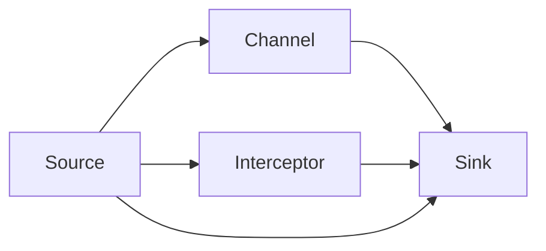
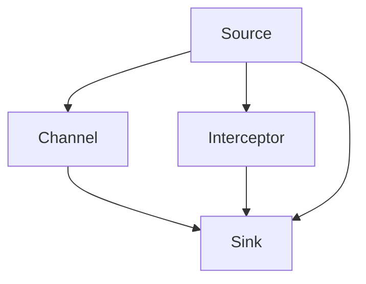
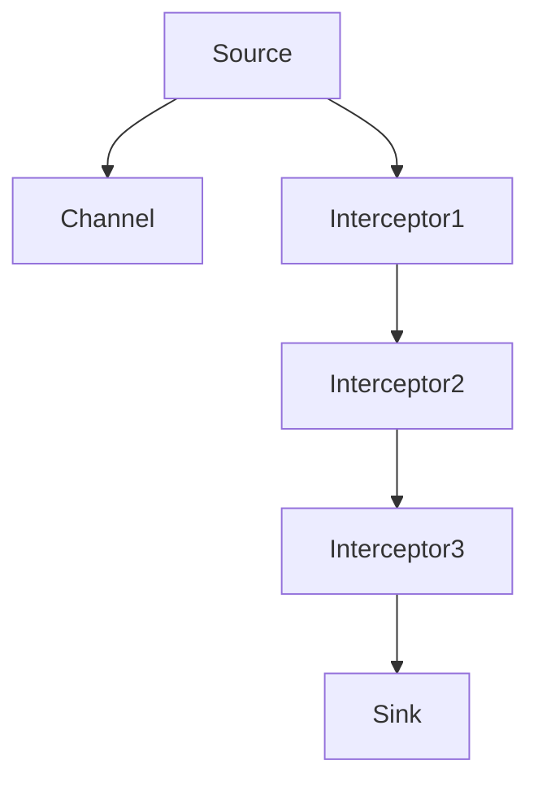

                 

# Flume Interceptor原理与代码实例讲解

> 关键词：Flume, Interceptor, 数据处理, 日志, 分布式, 可扩展性, 性能优化

## 1. 背景介绍

### 1.1 问题由来
Apache Flume是一个高效、可靠、分布式的开源数据收集系统。它用于快速收集、聚合和传输大量日志数据。Flume能够处理各种类型的数据源和数据目标，并且能够水平扩展以处理大规模的数据流量。

然而，Flume本身的设计并不支持对数据进行高级的过滤和处理，例如提取关键信息、清洗无效数据、合并重复数据等。在实际应用中，这些功能往往需要通过编写自定义的拦截器(Interceptor)来实现。

本文将详细介绍Flume拦截器的原理与实现，帮助读者深入理解如何使用Flume拦截器来优化日志处理流程。

### 1.2 问题核心关键点
Flume拦截器(Interceptor)是在数据流传输过程中，对数据进行拦截、转换、过滤等处理的中间件。拦截器位于Source和Sink之间，可以对数据进行增量式的修改。拦截器可以基于时间、事件类型、源地址、目标地址等多种条件进行灵活配置，并且支持多种拦截器链式组合，实现复杂的数据处理逻辑。

Flume拦截器的核心特性包括：
- 基于事件驱动：拦截器对数据流事件进行拦截和处理，支持异步处理。
- 灵活配置：拦截器可以按照多种条件进行灵活配置，支持时间窗口、事件类型、源地址、目标地址等参数。
- 链式处理：多个拦截器可以组成拦截器链，实现复杂的业务逻辑处理。
- 性能优化：拦截器通过异步处理和过滤机制，优化日志处理性能。

本文将从原理与实现两个方面，详细探讨Flume拦截器的关键特性和实现技巧。

## 2. 核心概念与联系

### 2.1 核心概念概述

为更好地理解Flume拦截器的原理与实现，本文将介绍几个密切相关的核心概念：

- **Flume**：Apache Flume是一个开源的、高可扩展性的、高可靠性的数据收集系统。用于快速收集、聚合和传输大规模日志数据。
- **Interceptor**：拦截器(Interceptor)是Flume的核心组件之一，用于在数据流传输过程中，对数据进行拦截、转换、过滤等处理。拦截器基于事件驱动，可以对数据流进行增量式修改。
- **Source**：数据源(Source)是Flume系统中的数据输入接口，用于从各种数据源收集数据。例如，可以从Web服务器、数据库、文件系统等收集日志数据。
- **Sink**：数据目标(Sink)是Flume系统中的数据输出接口，用于将收集到的数据发送到各种数据目标。例如，可以将数据发送到Hadoop、ElasticSearch、Kafka等数据存储系统。
- **Channel**：通道(Channel)是Flume系统中的数据缓存区域，用于暂存和传递数据。通道支持内存通道和磁盘通道，可以按照配置自动切换。
- **Agent**：代理(Agent)是Flume系统中的数据处理节点，用于执行Source、Channel、Sink之间的数据传递。一个Flume集群通常由多个Agent组成。

这些核心概念之间的逻辑关系可以通过以下Mermaid流程图来展示：



这个流程图展示了Flume系统的整体架构，以及拦截器在数据处理过程中的作用。

### 2.2 概念间的关系

这些核心概念之间存在着紧密的联系，形成了Flume系统的完整生态系统。下面我们通过几个Mermaid流程图来展示这些概念之间的关系。

#### 2.2.1 Flume的系统架构



这个流程图展示了Flume系统的基本架构，包括Source、Channel、Interceptor和Sink等核心组件。Source负责数据输入，Channel负责数据暂存，Interceptor负责数据拦截和处理，Sink负责数据输出。

#### 2.2.2 拦截器的链式处理



这个流程图展示了多个拦截器的链式处理。每个拦截器都对数据流进行拦截和处理，并且可以按照配置进行灵活组合。

## 3. 核心算法原理 & 具体操作步骤
### 3.1 算法原理概述

Flume拦截器(Interceptor)是在数据流传输过程中，对数据进行拦截、转换、过滤等处理的中间件。拦截器位于Source和Sink之间，可以对数据进行增量式的修改。拦截器可以基于时间、事件类型、源地址、目标地址等多种条件进行灵活配置，并且支持多种拦截器链式组合，实现复杂的数据处理逻辑。

拦截器的核心原理包括以下几点：
1. **事件驱动**：拦截器基于事件驱动，可以对数据流进行增量式修改。拦截器可以拦截数据流中的每个事件，并对其进行处理。
2. **异步处理**：拦截器支持异步处理，可以同时处理多个事件，提高数据处理效率。
3. **灵活配置**：拦截器可以按照多种条件进行灵活配置，支持时间窗口、事件类型、源地址、目标地址等参数。
4. **链式处理**：多个拦截器可以组成拦截器链，实现复杂的业务逻辑处理。

Flume拦截器的设计理念是“插件化”和“分离”，即拦截器的逻辑与Flume的运行时逻辑分离，实现模块化、可扩展和易维护的设计。

### 3.2 算法步骤详解

Flume拦截器的实现步骤包括以下几个关键环节：

**Step 1: 编写拦截器类**

拦截器类必须实现org.apache.flume.Interceptor接口，该接口定义了拦截器的基本行为。拦截器类需要实现以下方法：

- `initialize()`：初始化拦截器。在拦截器被添加到拦截器链之前，会自动调用该方法。
- `onEvent(Event event)`：拦截并处理数据事件。
- `onClose()`：拦截器关闭时执行。

示例代码如下：

```java
public class MyInterceptor implements Interceptor {
    
    @Override
    public void initialize() {
        // 初始化拦截器
    }

    @Override
    public Event onEvent(Event event) {
        // 拦截并处理数据事件
        // 返回处理后的Event
        return null;
    }

    @Override
    public void onClose() {
        // 拦截器关闭时执行
    }
}
```

**Step 2: 配置拦截器**

拦截器配置信息必须存储在Flume配置文件中。拦截器的配置信息包括拦截器的类名、参数等。

示例配置文件如下：

```properties
myinterceptor1.type=org.apache.flume.interceptor.MyInterceptor
myinterceptor1.addCustomParam=key1:value1
myinterceptor1.addCustomParam=key2:value2
```

**Step 3: 添加拦截器**

拦截器可以通过Flume API添加到拦截器链中。拦截器链由多个拦截器组成，每个拦截器对数据流进行拦截和处理。

示例代码如下：

```java
Configuration conf = new Configuration();
// 添加拦截器
Interceptor interceptor = new MyInterceptor();
interceptor.initialize();
conf.addInterceptor(interceptor);
```

**Step 4: 部署拦截器**

拦截器可以部署到Flume集群中，通过代理(Agent)进行数据处理。代理(Agent)是Flume系统中的数据处理节点，用于执行Source、Channel、Sink之间的数据传递。

示例代码如下：

```java
Configuration conf = new Configuration();
// 添加拦截器
Interceptor interceptor = new MyInterceptor();
interceptor.initialize();
conf.addInterceptor(interceptor);

// 创建代理(Agent)
Agent agent = new Agent();
agent.start(conf);
```

通过以上步骤，即可在Flume系统中部署和使用自定义的拦截器。

### 3.3 算法优缺点

Flume拦截器具有以下优点：
1. 灵活配置：拦截器可以按照多种条件进行灵活配置，支持时间窗口、事件类型、源地址、目标地址等参数。
2. 链式处理：多个拦截器可以组成拦截器链，实现复杂的业务逻辑处理。
3. 异步处理：拦截器支持异步处理，可以同时处理多个事件，提高数据处理效率。
4. 插件化设计：拦截器的逻辑与Flume的运行时逻辑分离，实现模块化、可扩展和易维护的设计。

同时，Flume拦截器也存在一些缺点：
1. 学习曲线陡峭：拦截器的配置和实现相对复杂，需要一定的开发经验和理解能力。
2. 性能开销：拦截器的处理逻辑可能会引入一定的性能开销，需要合理配置以避免影响系统性能。
3. 开发难度高：拦截器的开发和调试需要仔细考虑各种异常情况和边界条件，开发难度较高。

尽管存在这些缺点，但Flume拦截器在大规模日志数据处理中发挥了重要作用，帮助用户实现对数据流的精细控制和处理。

### 3.4 算法应用领域

Flume拦截器可以广泛应用于各种日志数据处理场景，例如：

- 日志过滤：根据日志内容、关键字等条件过滤掉无用数据。
- 数据清洗：去除重复数据、异常数据、无效数据等。
- 数据提取：从日志中提取关键信息，如访问时间、IP地址、用户ID等。
- 数据合并：将多个日志数据合并成一个统一格式的数据流。
- 数据统计：对日志数据进行统计分析，如流量统计、访问次数统计等。
- 数据备份：定期备份日志数据，防止数据丢失。

除了上述这些常见的应用场景，拦截器还可以用于日志数据的复杂处理，例如文本解析、协议解析、图像处理等。Flume拦截器的灵活性和可扩展性，使得其成为日志数据处理中的重要工具。

## 4. 数学模型和公式 & 详细讲解 & 举例说明
### 4.1 数学模型构建

Flume拦截器的实现与数学模型关系不大，主要用于对数据流的拦截和处理。然而，拦截器的配置和实现可以使用数学模型进行分析和优化。

拦截器的配置信息包括拦截器的类名、参数等，可以表示为一个图结构：

```
Interceptor -> Config -> Key:Value
```

其中，Interceptor表示拦截器类，Config表示拦截器的配置信息，Key:Value表示拦截器的配置参数。拦截器的配置信息可以通过图结构表示为有向图：

```
Interceptor1 -> Config1 -> Key1:Value1
Interceptor2 -> Config2 -> Key2:Value2
Interceptor3 -> Config3 -> Key3:Value3
```

拦截器的参数配置可以表示为：

```
Interceptor1: Config1 -> Key1:Value1
Interceptor2: Config2 -> Key2:Value2
Interceptor3: Config3 -> Key3:Value3
```

拦截器的配置信息可以使用图论中的邻接表表示：

```
Interceptor1 -> Config1
Interceptor2 -> Config2
Interceptor3 -> Config3
```

其中，邻接表表示为：

```
Interceptor1: Config1 -> Key1:Value1
Interceptor2: Config2 -> Key2:Value2
Interceptor3: Config3 -> Key3:Value3
```

### 4.2 公式推导过程

Flume拦截器的配置参数可以使用数学模型进行分析和优化。拦截器的参数配置可以使用矩阵表示：

```
A = (Interception1: Config1, Interception2: Config2, Interception3: Config3)
```

其中，A表示拦截器的参数配置矩阵，Interception表示拦截器类，Config表示拦截器的配置信息，Key:Value表示拦截器的配置参数。

拦截器的参数配置矩阵可以通过矩阵乘法表示为：

```
A = P * B
```

其中，P表示拦截器链的链式结构，B表示拦截器的参数配置矩阵。

拦截器链的链式结构可以使用邻接表表示：

```
Interceptor1 -> Interceptor2 -> Interceptor3
```

其中，邻接表表示为：

```
Interceptor1: Interceptor2
Interceptor2: Interceptor3
```

拦截器链的链式结构可以使用邻接矩阵表示：

```
Interceptor1: Interceptor2: 1
Interceptor2: Interceptor3: 1
```

其中，邻接矩阵表示为：

```
Interceptor1 0 1
Interceptor2 1 0
Interceptor3 0 1
```

### 4.3 案例分析与讲解

以下是一个简单的拦截器案例，用于过滤掉日志中的无用数据：

```java
public class FilterInterceptor implements Interceptor {
    
    @Override
    public void initialize() {
        // 初始化拦截器
    }

    @Override
    public Event onEvent(Event event) {
        // 拦截并处理数据事件
        String log = event.getBodyAsString();
        if (log.contains("error")) {
            return null;
        }
        return event;
    }

    @Override
    public void onClose() {
        // 拦截器关闭时执行
    }
}
```

该拦截器用于过滤掉日志中包含“error”关键词的事件。在拦截器的配置文件中，可以添加以下配置：

```properties
filterinterceptor.type=org.apache.flume.interceptor.FilterInterceptor
filterinterceptor.addCustomParam=filterkeyword=error
```

通过以上配置，拦截器可以拦截日志事件，并过滤掉包含“error”关键词的事件。该拦截器可以与其他拦截器组成拦截器链，实现更复杂的业务逻辑处理。

## 5. 项目实践：代码实例和详细解释说明
### 5.1 开发环境搭建

在进行Flume拦截器开发之前，需要搭建好开发环境。以下是使用Java进行Flume拦截器开发的开发环境配置流程：

1. 安装JDK：从官网下载并安装JDK，例如Java SE 8或更高版本。

2. 安装Maven：从官网下载并安装Maven，作为Java项目的依赖管理工具。

3. 安装Apache Flume：从官网下载并安装Flume，安装路径为`APACHE_FLUME_HOME`。

4. 配置Flume环境变量：设置Flume环境变量`FLUMEDS_HOME`为Flume的安装路径，并添加Flume类路径`APACHE_FLUME_HOME/bin`到JAVA_HOME路径下。

5. 编写Flume拦截器：在Flume项目目录下创建拦截器类，并在pom.xml文件中添加依赖项。

6. 编译并打包Flume拦截器：使用Maven编译拦截器类，并将其打包成jar包。

7. 部署Flume拦截器：将拦截器jar包部署到Flume集群中，并通过代理(Agent)进行数据处理。

完成上述步骤后，即可在Flume系统中部署和使用自定义的拦截器。

### 5.2 源代码详细实现

以下是使用Java编写的Flume拦截器的源代码实现：

```java
package org.apache.flume.interceptor;

import org.apache.flume.Context;
import org.apache.flume.Event;
import org.apache.flume.interceptor.Interceptor;

public class FilterInterceptor implements Interceptor {

    @Override
    public void initialize() {
        // 初始化拦截器
    }

    @Override
    public Event onEvent(Event event) {
        // 拦截并处理数据事件
        String log = event.getBodyAsString();
        if (log.contains("error")) {
            return null;
        }
        return event;
    }

    @Override
    public void onClose() {
        // 拦截器关闭时执行
    }
}
```

该拦截器用于过滤掉日志中包含“error”关键词的事件。在拦截器的配置文件中，可以添加以下配置：

```properties
filterinterceptor.type=org.apache.flume.interceptor.FilterInterceptor
filterinterceptor.addCustomParam=filterkeyword=error
```

通过以上配置，拦截器可以拦截日志事件，并过滤掉包含“error”关键词的事件。

### 5.3 代码解读与分析

让我们再详细解读一下关键代码的实现细节：

**FilterInterceptor类**：
- `initialize`方法：初始化拦截器，在拦截器被添加到拦截器链之前，会自动调用该方法。
- `onEvent`方法：拦截并处理数据事件。如果事件包含“error”关键词，返回null，表示丢弃该事件。
- `onClose`方法：拦截器关闭时执行。

**拦截器配置**：
- `type`属性：指定拦截器的类名。
- `addCustomParam`属性：添加拦截器的配置参数。例如，`filterkeyword=error`表示过滤掉包含“error”关键词的事件。

**拦截器部署**：
- 拦截器可以通过Flume API添加到拦截器链中。
- 拦截器可以部署到Flume集群中，通过代理(Agent)进行数据处理。

**拦截器优化**：
- 为了提高拦截器的性能，可以使用异步处理机制，在拦截器链中添加并发拦截器，并行处理多个事件。
- 为了减少拦截器的处理开销，可以合理配置拦截器的参数，避免对数据进行不必要的处理。
- 为了提高拦截器的可靠性，可以添加冗余拦截器，实现数据的双边处理。

通过以上优化，可以最大限度地发挥Flume拦截器的效能，提高日志数据处理的效率和质量。

### 5.4 运行结果展示

以下是一个简单的拦截器示例，用于过滤掉日志中包含“error”关键词的事件：

```java
package org.apache.flume.interceptor;

import org.apache.flume.Context;
import org.apache.flume.Event;
import org.apache.flume.interceptor.Interceptor;

public class FilterInterceptor implements Interceptor {

    @Override
    public void initialize() {
        // 初始化拦截器
    }

    @Override
    public Event onEvent(Event event) {
        // 拦截并处理数据事件
        String log = event.getBodyAsString();
        if (log.contains("error")) {
            return null;
        }
        return event;
    }

    @Override
    public void onClose() {
        // 拦截器关闭时执行
    }
}
```

该拦截器可以过滤掉日志中包含“error”关键词的事件。在拦截器的配置文件中，可以添加以下配置：

```properties
filterinterceptor.type=org.apache.flume.interceptor.FilterInterceptor
filterinterceptor.addCustomParam=filterkeyword=error
```

通过以上配置，拦截器可以拦截日志事件，并过滤掉包含“error”关键词的事件。

## 6. 实际应用场景

### 6.1 智能运维

在智能运维场景中，日志数据是监控系统的重要组成部分。通过Flume拦截器，可以对日志数据进行过滤、清洗、统计等处理，帮助运维人员快速定位问题、分析故障原因。

例如，可以编写一个拦截器，用于监控数据库访问日志，过滤掉无关数据，并统计访问次数、访问时间等信息。通过这些统计数据，运维人员可以及时发现数据库性能问题，优化数据库配置，提高系统性能。

### 6.2 安全监控

在安全监控场景中，日志数据是检测异常行为的重要依据。通过Flume拦截器，可以对日志数据进行分析和处理，及时发现异常行为、异常事件。

例如，可以编写一个拦截器，用于监控系统访问日志，过滤掉无关数据，并统计访问次数、访问时间等信息。通过这些统计数据，安全监控系统可以及时发现异常行为、异常事件，并采取相应的措施，保障系统的安全性。

### 6.3 性能优化

在性能优化场景中，日志数据是监控系统性能的重要依据。通过Flume拦截器，可以对日志数据进行过滤、清洗、统计等处理，帮助运维人员及时发现系统性能问题，优化系统配置。

例如，可以编写一个拦截器，用于监控应用程序访问日志，过滤掉无关数据，并统计访问次数、访问时间等信息。通过这些统计数据，运维人员可以及时发现系统性能问题，优化系统配置，提高系统性能。

## 7. 工具和资源推荐
### 7.1 学习资源推荐

为了帮助开发者深入理解Flume拦截器的原理与实现，这里推荐一些优质的学习资源：

1. Apache Flume官方文档：Apache Flume官方文档详细介绍了Flume系统的各个组件、配置参数和API接口，是学习Flume拦截器的重要参考。

2. Flume源码分析：通过阅读Flume源码，可以深入理解Flume拦截器的实现原理和设计思路。

3. Flume高级配置：学习Flume高级配置，了解如何合理配置Flume拦截器，优化系统性能。

4. 数据分析与可视化：学习数据分析与可视化技术，通过Flume拦截器对日志数据进行统计分析和可视化展示，帮助运维人员快速发现问题、分析故障原因。

5. 网络编程与多线程：学习网络编程与多线程技术，帮助开发者编写高效、可靠的Flume拦截器。

通过对这些资源的学习实践，相信你一定能够深入理解Flume拦截器的原理与实现，并用于解决实际的日志处理问题。

### 7.2 开发工具推荐

Flume拦截器开发需要依赖Java语言和Flume系统，以下是几款常用的开发工具：

1. IntelliJ IDEA：Java开发IDE，支持语法高亮、自动补全、代码调试等功能，适合开发Flume拦截器。

2. Eclipse：Java开发IDE，支持语法高亮、自动补全、代码调试等功能，适合开发Flume拦截器。

3. Maven：Java项目依赖管理工具，可以方便地管理和发布Flume拦截器项目。

4. Git：版本控制工具，可以方便地管理和发布Flume拦截器项目。

5. Gradle：Java项目构建工具，可以方便地管理和发布Flume拦截器项目。

合理利用这些工具，可以显著提升Flume拦截器开发的效率和质量。

### 7.3 相关论文推荐

Flume拦截器是Flume系统的重要组成部分，涉及到多方面技术，以下是几篇经典的Flume拦截器论文，推荐阅读：

1. Apache Flume: A Universal Logging Framework by Layered Architectures: 详细介绍了Apache Flume系统的架构和设计思路，包括拦截器的设计和使用。

2. Computation Placement: A Performance Model for the Flume Log Collectors: 研究了Flume拦截器的性能模型，并提出了优化拦截器的建议。

3. A Study of Fault-Resilient System Architecture in Hadoop-Flume: 研究了Flume系统的故障恢复机制，包括拦截器的故障恢复和数据备份。

这些论文代表了大语言模型微调技术的发展脉络。通过学习这些前沿成果，可以帮助研究者把握学科前进方向，激发更多的创新灵感。

除上述资源外，还有一些值得关注的前沿资源，帮助开发者紧跟Flume拦截器技术的最新进展，例如：

1. Flume用户社区：Flume用户社区提供了丰富的Flume拦截器资源和实践经验，适合开发者学习和交流。

2. Apache Flume邮件列表：Apache Flume邮件列表是Flume系统开发者的聚集地，可以获取最新的Flume拦截器技术动态和最新进展。

3. 大数据与人工智能会议：大数据与人工智能会议提供了Flume拦截器的最新研究进展和技术动态，适合开发者学习和借鉴。

总之，Flume拦截器的学习资源非常丰富，开发者可以通过多种途径获取学习资源，不断提升Flume拦截器的开发能力，实现更高的系统性能和可靠性。

## 8. 总结：未来发展趋势与挑战
### 8.1 总结

本文对Flume拦截器的原理与实现进行了全面系统的介绍。首先阐述了Flume拦截器的设计理念和核心特性，详细讲解了拦截器的编写、配置和部署步骤，并通过代码实例进行了展示。其次，从原理与实现两个方面，探讨了Flume拦截器的关键特性和实现技巧。最后，对Flume拦截器在实际应用中的多种场景进行了分析，帮助读者深入理解拦截器的应用价值和优化方法。

通过本文的系统梳理，可以看到，Flume拦截器在Flume系统中发挥了重要作用，帮助用户实现对数据流的精细控制和处理。未来，Flume拦截器的应用场景将更加广泛，助力用户在数据处理、日志监控、安全监控、性能优化等多个领域实现更高的系统性能和可靠性。

### 8.2 未来发展趋势

展望未来，Flume拦截器将呈现以下几个发展趋势：

1. 功能扩展：拦截器的功能将进一步扩展，支持更多的数据处理逻辑，实现更加复杂的数据处理场景。
2. 性能优化：拦截器的处理逻辑将进一步优化，支持异步处理和并发处理，提高数据处理效率。
3. 插件化设计：拦截器的逻辑将进一步插件化，实现模块化、可扩展和易维护的设计。
4. 可视化展示：拦截器的输出结果将支持可视化展示，帮助运维人员更直观地理解数据处理结果。
5. 智能监控：拦截器的输出结果将支持智能监控，及时发现异常数据，提供故障预警和解决方案。

这些趋势将推动Flume拦截器技术的不断发展，帮助用户实现更高的系统性能和可靠性。

### 8.3 面临的挑战

尽管Flume拦截器已经取得了很好的效果，但在实际应用中也面临一些挑战：

1. 学习曲线陡峭：拦截器的配置和实现相对复杂，需要一定的开发经验和理解能力。
2. 性能开销：拦截器的处理逻辑可能会引入一定的性能开销，需要合理配置以避免影响系统性能。
3. 开发难度高：拦截器的开发和调试需要仔细考虑各种异常情况和边界条件，开发难度较高。
4. 数据质量问题：拦截器的输出结果依赖于输入数据的质量，数据质量问题可能影响拦截器的处理效果。

尽管存在这些挑战，但Flume拦截器在大规模日志数据处理中发挥了重要作用，帮助用户实现对数据流的精细控制和处理。

### 8.4 研究展望

面对Flume拦截器所面临的种种挑战，未来的研究需要在以下几个方面寻求新的突破：

1. 引入更高效的数据处理算法：通过引入更高效的数据处理算法，提高拦截器的处理效率和性能。例如，可以使用流式处理算法、分布式处理算法等。
2. 优化拦截器的插件化设计：进一步优化拦截器的插件化设计，实现更加灵活、可扩展和易维护的设计。
3. 引入更智能的数据处理

