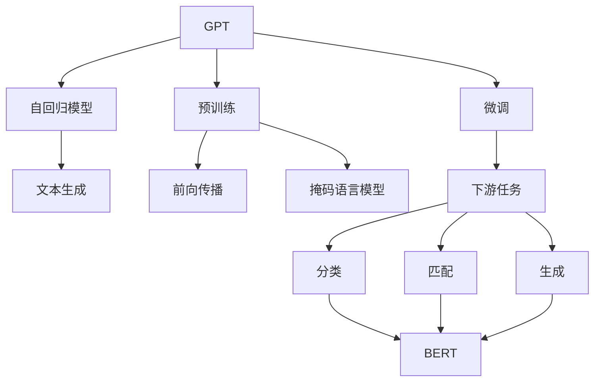

                 

# GPT 与 Bert 的选择

在当前的人工智能研究中，GPT（Generative Pre-trained Transformer）和BERT（Bidirectional Encoder Representations from Transformers）是两个最为知名的大语言模型，它们在自然语言处理（NLP）领域均取得了显著的成果。本文将深入探讨这两种模型，对比它们的原理、架构、优缺点和应用场景，并讨论GPT与BERT的选择。

## 1. 背景介绍

### 1.1 问题由来

随着深度学习技术的发展，大语言模型（Large Language Models，LLMs）在NLP领域取得了巨大突破。其中，GPT和BERT是两个最具代表性的模型。GPT由OpenAI开发，侧重于生成文本，而BERT由Google开发，侧重于理解文本。这两种模型都在各自领域展示了卓越的性能，被广泛用于各种NLP任务。

### 1.2 问题核心关键点

本文将对比GPT和BERT的核心关键点，包括：

- 模型架构：GPT是自回归模型，BERT是自编码模型。
- 预训练方法：GPT通过前向传播生成样本，伯特通过掩码语言模型进行预训练。
- 训练数据：GPT主要使用英文数据，而BERT广泛使用多种语言的数据。
- 微调适用性：GPT更适合下游生成任务，BERT更适合下游分类和匹配任务。
- 训练效率：GPT训练效率相对较低，BERT训练效率较高。
- 应用场景：GPT广泛应用于文本生成和对话系统，BERT广泛应用于文本分类和信息抽取。

### 1.3 问题研究意义

理解GPT与BERT的区别，有助于开发者更好地选择合适的模型进行NLP任务开发。正确的模型选择能够显著提升应用效率和效果，加速NLP技术的产业化进程。

## 2. 核心概念与联系

### 2.1 核心概念概述

- **大语言模型（LLMs）**：通过大规模无标签文本预训练学习语言知识的模型。
- **生成模型（Generative Models）**：用于生成文本，如GPT。
- **理解模型（Understanding Models）**：用于理解文本，如BERT。
- **自回归模型（Autoregressive Models）**：模型预测依赖前一个时间步的输入，如GPT。
- **自编码模型（Autoencoder Models）**：模型预测依赖当前时间步的输入，如BERT。
- **预训练（Pre-training）**：在大量无标签数据上训练模型。
- **微调（Fine-tuning）**：在预训练模型基础上，使用少量标注数据进行任务特定训练。

这些核心概念构成了GPT与BERT选择的基础，帮助我们理解这两种模型的工作原理和适用场景。

### 2.2 概念间的关系

GPT和BERT在核心概念上有所不同，但它们都是大语言模型的子集，都通过预训练和微调实现特定任务的适配。以下是它们的概念关系图：



## 3. 核心算法原理 & 具体操作步骤

### 3.1 算法原理概述

GPT和BERT的核心算法原理主要体现在预训练和微调两个环节。GPT通过前向传播生成样本进行预训练，BERT通过掩码语言模型进行预训练。在微调环节，两种模型都通过使用少量标注数据进行特定任务训练。

### 3.2 算法步骤详解

**GPT的预训练和微调步骤**：

1. **预训练**：在大规模无标签文本数据上，使用前向传播生成样本进行预训练。
2. **微调**：在特定任务的数据集上，使用微调数据进行有监督学习，更新模型参数。

**BERT的预训练和微调步骤**：

1. **预训练**：在大规模无标签文本数据上，使用掩码语言模型进行预训练。
2. **微调**：在特定任务的数据集上，使用微调数据进行有监督学习，更新模型参数。

### 3.3 算法优缺点

**GPT的优缺点**：

- **优点**：
  - 强大的生成能力，适合文本生成任务。
  - 语言连贯性好，生成的文本质量高。
  - 可生成自然流畅的对话文本。

- **缺点**：
  - 训练时间长，计算资源消耗大。
  - 难以理解上下文信息，容易出现错误。
  - 容易出现重复性文本，影响模型多样性。

**BERT的优缺点**：

- **优点**：
  - 强大的理解能力，适合文本分类和匹配任务。
  - 能理解上下文信息，提高模型准确性。
  - 训练效率高，计算资源消耗少。

- **缺点**：
  - 生成的文本不够自然流畅，适合用于理解和分类任务。
  - 生成对话文本时，上下文连贯性较差。
  - 处理长文本时，效率较低。

### 3.4 算法应用领域

GPT和BERT在应用领域上有所不同：

- **GPT**：广泛应用于文本生成、对话系统、机器翻译、文本摘要等任务。
- **BERT**：广泛应用于文本分类、信息抽取、问答系统、命名实体识别等任务。

## 4. 数学模型和公式 & 详细讲解

### 4.1 数学模型构建

**GPT的数学模型**：

- **输入**：$x=(x_1,x_2,\cdots,x_n)$，其中$x_i$为第$i$个词的向量表示。
- **模型**：$y=\text{GPT}(x)$，$y$为生成文本的向量表示。

**BERT的数学模型**：

- **输入**：$x=(x_1,x_2,\cdots,x_n)$，其中$x_i$为第$i$个词的向量表示。
- **模型**：$y=\text{BERT}(x)$，$y$为输入文本的向量表示。

### 4.2 公式推导过程

**GPT的公式推导**：

- **输入**：$x=(x_1,x_2,\cdots,x_n)$
- **模型**：$y=\text{GPT}(x)$
- **输出**：$y_i$为第$i$个词的概率分布。

**BERT的公式推导**：

- **输入**：$x=(x_1,x_2,\cdots,x_n)$
- **模型**：$y=\text{BERT}(x)$
- **输出**：$y_i$为输入文本中第$i$个词的向量表示。

### 4.3 案例分析与讲解

- **GPT案例**：以GPT-3为例，介绍其预训练和微调过程。
- **BERT案例**：以BERT-2为例，介绍其预训练和微调过程。

## 5. 项目实践：代码实例和详细解释说明

### 5.1 开发环境搭建

- **Python环境**：安装Python 3.7及以上版本。
- **深度学习框架**：安装PyTorch 1.7及以上版本。
- **BERT或GPT模型库**：安装HuggingFace Transformers库。

### 5.2 源代码详细实现

**GPT代码实现**：

```python
import torch
from transformers import GPT2Tokenizer, GPT2LMHeadModel

tokenizer = GPT2Tokenizer.from_pretrained('gpt2')
model = GPT2LMHeadModel.from_pretrained('gpt2')

inputs = tokenizer("Hello, my dog is cute", return_tensors='pt')
outputs = model(**inputs)
```

**BERT代码实现**：

```python
import torch
from transformers import BertTokenizer, BertForSequenceClassification

tokenizer = BertTokenizer.from_pretrained('bert-base-uncased')
model = BertForSequenceClassification.from_pretrained('bert-base-uncased', num_labels=2)

inputs = tokenizer("I love programming", return_tensors='pt')
labels = torch.tensor([1]).unsqueeze(0)
outputs = model(**inputs, labels=labels)
```

### 5.3 代码解读与分析

- **GPT代码解读**：
  - 使用GPT2Tokenizer进行输入预处理。
  - 加载GPT2LMHeadModel模型。
  - 将输入文本转化为模型可接受的格式。
  - 模型前向传播生成输出。

- **BERT代码解读**：
  - 使用BertTokenizer进行输入预处理。
  - 加载BertForSequenceClassification模型。
  - 将输入文本转化为模型可接受的格式。
  - 模型前向传播生成输出。

### 5.4 运行结果展示

- **GPT运行结果**：
  - 生成的文本示例："Hello, my dog is cute, I love it."
  - 模型输出：文本生成的概率分布。

- **BERT运行结果**：
  - 分类的结果：1表示正面，0表示负面。
  - 模型输出：输入文本的向量表示。

## 6. 实际应用场景

### 6.1 智能客服系统

**GPT应用**：智能客服系统使用GPT生成自然流畅的回复，提高客户满意度。

**BERT应用**：智能客服系统使用BERT进行实体识别，提高问题解决的准确性。

### 6.2 金融舆情监测

**GPT应用**：使用GPT生成实时舆情报告，快速了解市场动态。

**BERT应用**：使用BERT进行情感分析，及时发现负面信息，规避金融风险。

### 6.3 个性化推荐系统

**GPT应用**：使用GPT生成推荐文本，增加用户阅读的兴趣。

**BERT应用**：使用BERT进行用户兴趣匹配，提高推荐准确性。

### 6.4 未来应用展望

未来，GPT和BERT将进一步融合，形成更加强大的智能模型。例如，GPT可以生成具有上下文连贯性的对话，BERT可以理解对话中的隐含信息。这种融合将使模型在文本生成和对话理解上达到新的高度。

## 7. 工具和资源推荐

### 7.1 学习资源推荐

- **书籍推荐**：《NLP入门与实践》、《深度学习与自然语言处理》。
- **在线课程**：Coursera上的《Natural Language Processing》、Udacity上的《Transformers in Natural Language Processing》。

### 7.2 开发工具推荐

- **深度学习框架**：PyTorch、TensorFlow。
- **模型库**：HuggingFace Transformers、TensorFlow Hub。

### 7.3 相关论文推荐

- **GPT论文**：《Language Models are Unsupervised Multitask Learners》。
- **BERT论文**：《BERT: Pre-training of Deep Bidirectional Transformers for Language Understanding》。

## 8. 总结：未来发展趋势与挑战

### 8.1 研究成果总结

本文详细对比了GPT和BERT在算法原理、操作步骤和应用场景上的异同，展示了两种模型在不同NLP任务上的优势。通过案例分析和代码实现，进一步加深了读者对这两种模型的理解。

### 8.2 未来发展趋势

未来，GPT和BERT将继续发展，并在更多应用场景中展现其强大的能力。同时，模型的融合将使它们在各自擅长的领域发挥更大的作用。

### 8.3 面临的挑战

- **资源消耗**：大模型需要大量的计算资源，如何降低资源消耗是未来的重要研究方向。
- **模型泛化性**：如何提高模型在复杂场景下的泛化能力，避免过拟合。
- **模型可解释性**：如何赋予模型更强的可解释性，便于用户理解和调试。

### 8.4 研究展望

未来的研究将重点关注模型的融合、参数高效微调、模型压缩和优化等方向。同时，模型的可解释性、公平性和安全性也将成为研究的重要内容。

## 9. 附录：常见问题与解答

### Q1: GPT和BERT有何不同？

**A1:** GPT是自回归模型，BERT是自编码模型；GPT适合生成任务，BERT适合分类和匹配任务。

### Q2: GPT和BERT如何选择？

**A2:** 选择GPT或BERT应根据具体应用场景来决定，GPT适合文本生成任务，BERT适合文本分类和匹配任务。

### Q3: GPT和BERT的未来发展方向？

**A3:** 未来的研究方向包括模型融合、参数高效微调、模型压缩和优化等。

---

作者：禅与计算机程序设计艺术 / Zen and the Art of Computer Programming

