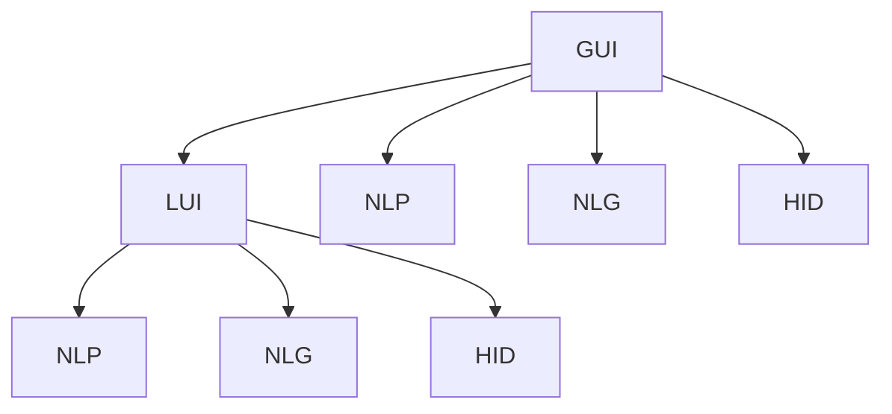
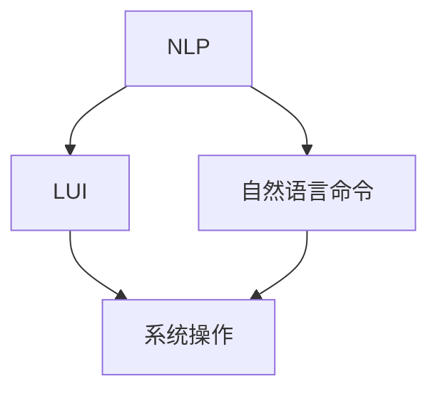
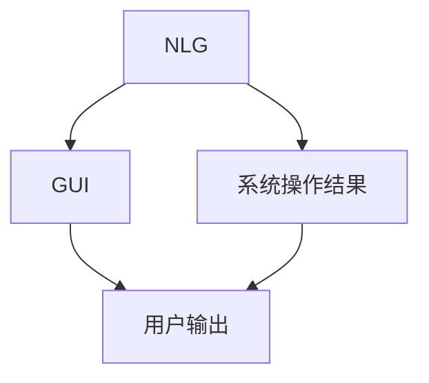
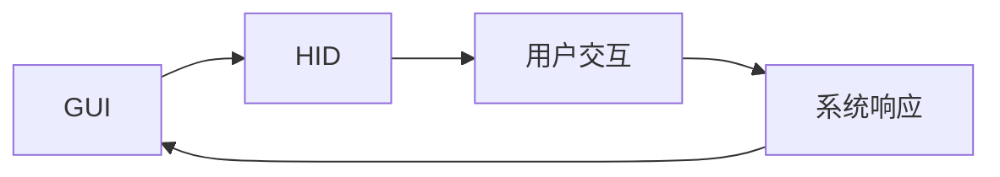

                 

# GUI与LUI在CUI中的协同工作

> 关键词：

## 1. 背景介绍

### 1.1 问题由来
随着人工智能技术的不断发展和普及，计算机用户界面（CUI）正在经历一场从图形用户界面（GUI）到语义用户界面（LUI）的重大变革。传统的GUI界面依赖于鼠标、键盘等硬件设备的输入输出，用户操作具有直观性和可操作性。然而，对于需要高精度的任务，如语音识别、自然语言处理等，GUI界面往往难以提供足够灵活和准确的操作方式。为了应对这种需求，语义用户界面（LUI）应运而生，通过自然语言命令实现用户与系统的交互，提供了更高的自然性、灵活性和可扩展性。

### 1.2 问题核心关键点
GUI与LUI的协同工作是当前CUI领域的一个重要研究方向。在传统GUI界面中加入LUI元素，不仅可以提升用户体验，还能够扩展界面的智能性和自动化程度。这种协同工作模式的核心在于：

1. **自然语言处理（NLP）**：将用户输入的自然语言命令转化为系统可理解的操作指令。
2. **自然语言生成（NLG）**：将系统输出的操作结果以自然语言的形式呈现给用户，增强用户体验。
3. **人机交互设计（HID）**：通过合理的交互设计，将GUI和LUI元素有机结合，提升界面友好度和易用性。

### 1.3 问题研究意义
GUI与LUI的协同工作不仅能够提升用户的交互体验，还能够在多模态输入输出、复杂任务处理等方面带来显著优势。具体意义如下：

1. **提升用户效率**：通过自然语言命令，用户可以更快地完成操作，减少输入时间。
2. **增强可访问性**：LUI界面对于残疾人士、非熟练用户等群体更为友好，提供了更广泛的访问路径。
3. **简化界面设计**：通过LUI元素，界面设计可以更加简洁，减少复杂操作和冗余信息。
4. **扩展界面功能**：LUI界面可以支持更复杂的交互逻辑和操作流程，拓展界面功能。
5. **促进技术发展**：推动NLP、NLG、HID等技术的进步，促进CUI领域整体发展。

## 2. 核心概念与联系

### 2.1 核心概念概述

为了更好地理解GUI与LUI在CUI中的协同工作，我们需要先了解几个关键概念：

1. **图形用户界面（GUI）**：依赖于鼠标、键盘等硬件设备，通过可视化的元素（如按钮、菜单、滑块等）进行用户交互。
2. **语义用户界面（LUI）**：通过自然语言命令与系统进行交互，界面元素和操作指令通过语义理解转化为可视化的表示。
3. **自然语言处理（NLP）**：涉及语言理解、信息抽取、情感分析等技术，将自然语言转化为系统可理解的形式。
4. **自然语言生成（NLG）**：涉及文本生成、对话系统等技术，将系统输出以自然语言的形式呈现给用户。
5. **人机交互设计（HID）**：涉及交互流程、用户反馈、视觉设计等，提升界面的友好度和易用性。

这些概念构成了GUI与LUI协同工作的核心框架，其逻辑关系可以通过以下Mermaid流程图来展示：



这个流程图展示了GUI与LUI协同工作的主要流程：

1. 用户通过GUI界面输入操作指令，LUI元素将其转化为自然语言命令。
2. 自然语言命令通过NLP处理，转化为系统可理解的形式。
3. 系统执行操作指令，并生成结果。
4. 结果通过NLG转化为自然语言，输出给用户。
5. 用户通过HID界面查看操作结果，完成交互流程。

### 2.2 概念间的关系

这些核心概念之间存在着紧密的联系，形成了一个完整的协同工作系统。下面通过几个Mermaid流程图来展示这些概念之间的关系。

#### 2.2.1 GUI与LUI的协同工作流程


这个流程图展示了GUI与LUI协同工作的主要流程：

1. 用户通过GUI界面输入操作指令。
2. LUI元素将其转化为自然语言命令，并由NLP处理。
3. 系统执行操作指令，并生成结果。
4. 结果通过NLG转化为自然语言，输出给用户。
5. 用户通过LUI界面查看操作结果，完成交互流程。

#### 2.2.2 NLP在LUI中的应用



这个流程图展示了NLP在LUI中的应用流程：

1. 用户通过LUI界面输入自然语言命令。
2. NLP处理自然语言命令，转化为系统可理解的形式。
3. 系统执行操作指令，并生成结果。

#### 2.2.3 NLG在GUI中的应用



这个流程图展示了NLG在GUI中的应用流程：

1. 系统执行操作指令，并生成结果。
2. NLG处理结果，转化为自然语言。
3. 用户通过GUI界面查看操作结果。

#### 2.2.4 HID在GUI中的应用



这个流程图展示了HID在GUI中的应用流程：

1. 用户通过GUI界面进行交互。
2. HID处理用户交互，生成系统响应。
3. 系统根据响应，执行操作指令。

## 3. 核心算法原理 & 具体操作步骤
### 3.1 算法原理概述

GUI与LUI的协同工作涉及多个模块，每个模块都需要独立完成其功能。以下是对这些模块的算法原理概述：

#### 3.1.1 自然语言处理（NLP）

自然语言处理涉及文本预处理、特征提取、分类、生成等过程。常用的算法包括：

- **分词**：将自然语言文本划分为词或词组，便于后续处理。
- **命名实体识别（NER）**：识别文本中的实体（如人名、地名、组织名等）。
- **词性标注（POS）**：确定每个词的词性（如名词、动词等）。
- **情感分析**：分析文本的情感倾向（如正面、负面、中性）。
- **句法分析**：分析句子的语法结构，提取句法特征。

#### 3.1.2 自然语言生成（NLG）

自然语言生成涉及文本生成、对话系统、报告生成等过程。常用的算法包括：

- **文本生成**：基于给定的输入生成自然语言文本。
- **对话系统**：通过多轮对话与用户进行交互，生成对话响应。
- **报告生成**：基于数据生成详细的分析报告。

#### 3.1.3 人机交互设计（HID）

人机交互设计涉及用户界面设计、交互流程设计、用户反馈设计等过程。常用的算法包括：

- **用户界面设计（UI）**：设计直观、易用的用户界面。
- **交互流程设计**：设计合理的用户交互流程，提升用户效率。
- **用户反馈设计**：设计有效的用户反馈机制，提升用户体验。

### 3.2 算法步骤详解

以下是对GUI与LUI协同工作的算法步骤详解：

#### 3.2.1 步骤一：用户输入

用户通过GUI界面输入操作指令，LUI元素将其转化为自然语言命令。

#### 3.2.2 步骤二：NLP处理

自然语言命令通过NLP处理，转化为系统可理解的形式。

#### 3.2.3 步骤三：系统操作

系统执行操作指令，并生成结果。

#### 3.2.4 步骤四：NLG处理

结果通过NLG转化为自然语言，输出给用户。

#### 3.2.5 步骤五：用户输出

用户通过LUI界面查看操作结果，完成交互流程。

### 3.3 算法优缺点

GUI与LUI的协同工作有以下优点：

1. **提升用户效率**：自然语言命令减少了用户输入时间，提升了操作效率。
2. **增强可访问性**：LUI界面对于非熟练用户、残疾人士等群体更为友好。
3. **简化界面设计**：LUI界面可以设计更加简洁，减少复杂操作和冗余信息。
4. **扩展界面功能**：LUI界面可以支持更复杂的交互逻辑和操作流程。

然而，这种协同工作也存在一些缺点：

1. **技术复杂度**：涉及NLP、NLG、HID等多个领域的知识，技术实现复杂。
2. **性能开销**：NLP处理和NLG生成需要消耗额外的计算资源，影响系统性能。
3. **用户适应性**：部分用户可能不习惯自然语言命令，需要适应过程。

### 3.4 算法应用领域

GUI与LUI的协同工作在多个领域具有广泛的应用前景，具体如下：

1. **智能家居**：通过语音助手进行智能控制，提升家居设备的操作效率。
2. **车载导航**：通过语音导航系统进行路线规划，提升驾驶体验。
3. **医疗诊断**：通过语音助手查询疾病信息，辅助医生诊断。
4. **客户服务**：通过语音助手进行客户咨询，提升服务效率。
5. **办公自动化**：通过语音助手进行任务调度，提高工作效率。

## 4. 数学模型和公式 & 详细讲解 & 举例说明

### 4.1 数学模型构建

假设系统接收一个自然语言命令 $c$，其对应的操作指令为 $o$。NLP处理过程可以通过以下数学模型表示：

$$
o = f(c)
$$

其中 $f$ 表示自然语言处理模型，$o$ 表示系统操作指令。

### 4.2 公式推导过程

以下是对自然语言处理过程的公式推导：

#### 4.2.1 分词

分词是将自然语言文本划分为词或词组的过程。常用的分词算法包括：

- **基于规则的分词**：根据语言规则进行分词。
- **基于统计的分词**：利用统计模型进行分词。
- **基于深度学习的分词**：利用神经网络进行分词。

#### 4.2.2 命名实体识别（NER）

命名实体识别是识别文本中实体的过程。常用的算法包括：

- **基于规则的NER**：根据语言规则进行实体识别。
- **基于统计的NER**：利用统计模型进行实体识别。
- **基于深度学习的NER**：利用神经网络进行实体识别。

#### 4.2.3 词性标注（POS）

词性标注是确定每个词的词性的过程。常用的算法包括：

- **基于规则的POS**：根据语言规则进行词性标注。
- **基于统计的POS**：利用统计模型进行词性标注。
- **基于深度学习的POS**：利用神经网络进行词性标注。

#### 4.2.4 情感分析

情感分析是分析文本情感倾向的过程。常用的算法包括：

- **基于规则的情感分析**：根据语言规则进行情感分析。
- **基于统计的情感分析**：利用统计模型进行情感分析。
- **基于深度学习的情感分析**：利用神经网络进行情感分析。

#### 4.2.5 句法分析

句法分析是分析句子语法结构的过程。常用的算法包括：

- **基于规则的句法分析**：根据语法规则进行句法分析。
- **基于统计的句法分析**：利用统计模型进行句法分析。
- **基于深度学习的句法分析**：利用神经网络进行句法分析。

### 4.3 案例分析与讲解

以下是对自然语言处理过程的案例分析与讲解：

#### 4.3.1 案例一：智能家居语音助手

假设用户通过智能家居语音助手说：“今天天气怎么样？”。语音助手需要进行以下处理：

1. 分词：将语音命令“今天天气怎么样”分词为“今天”、“天气”、“怎么样”。
2. 命名实体识别：识别出“天气”是实体。
3. 词性标注：标注“今天”为时间词，“天气”为名词，“怎么样”为疑问词。
4. 情感分析：分析情感倾向，发现“怎么样”表示疑问。
5. 句法分析：分析句子结构，理解语义。

处理结果为：“今天的天气怎么样”。语音助手执行查询操作，生成响应结果，并转化为自然语言“今天天气晴朗，温度26度”输出给用户。

#### 4.3.2 案例二：车载导航系统

假设用户通过车载导航系统说：“从我家到公司路线怎么走？”。导航系统需要进行以下处理：

1. 分词：将语音命令“从我家到公司路线怎么走”分词为“从”、“我家”、“到”、“公司”、“路线”、“怎么走”。
2. 命名实体识别：识别出“我家”、“公司”是地点实体。
3. 词性标注：标注“从”为介词，“我家”、“到”、“公司”为名词，“路线”为名词，“怎么走”为疑问词。
4. 情感分析：分析情感倾向，发现“怎么走”表示疑问。
5. 句法分析：分析句子结构，理解语义。

处理结果为：“从我家到公司路线怎么走”。导航系统执行路线规划操作，生成响应结果，并转化为自然语言“沿东四环高速行驶，大约30分钟到达公司”输出给用户。

## 5. 项目实践：代码实例和详细解释说明

### 5.1 开发环境搭建

在进行GUI与LUI协同工作的项目实践前，我们需要准备好开发环境。以下是使用Python进行PyTorch开发的环境配置流程：

1. 安装Anaconda：从官网下载并安装Anaconda，用于创建独立的Python环境。

2. 创建并激活虚拟环境：
```bash
conda create -n pytorch-env python=3.8 
conda activate pytorch-env
```

3. 安装PyTorch：根据CUDA版本，从官网获取对应的安装命令。例如：
```bash
conda install pytorch torchvision torchaudio cudatoolkit=11.1 -c pytorch -c conda-forge
```

4. 安装自然语言处理工具包：
```bash
pip install nltk spacy
```

5. 安装可视化工具：
```bash
pip install matplotlib seaborn
```

6. 安装相关库：
```bash
pip install pandas numpy
```

完成上述步骤后，即可在`pytorch-env`环境中开始项目实践。

### 5.2 源代码详细实现

以下是一个基于PyTorch的GUI与LUI协同工作的项目实现示例。

```python
import torch
import torch.nn as nn
import torch.optim as optim
from transformers import BertTokenizer, BertForTokenClassification
from transformers import AdamW
from torch.utils.data import Dataset, DataLoader

class NERDataset(Dataset):
    def __init__(self, texts, tags, tokenizer):
        self.texts = texts
        self.tags = tags
        self.tokenizer = tokenizer
        
    def __len__(self):
        return len(self.texts)
        
    def __getitem__(self, item):
        text = self.texts[item]
        tags = self.tags[item]
        
        encoding = self.tokenizer(text, return_tensors='pt', padding='max_length', truncation=True)
        input_ids = encoding['input_ids'][0]
        attention_mask = encoding['attention_mask'][0]
        
        # 对token-wise的标签进行编码
        encoded_tags = [tag2id[tag] for tag in tags] 
        encoded_tags.extend([tag2id['O']] * (self.max_len - len(encoded_tags)))
        labels = torch.tensor(encoded_tags, dtype=torch.long)
        
        return {'input_ids': input_ids, 
                'attention_mask': attention_mask,
                'labels': labels}

# 标签与id的映射
tag2id = {'O': 0, 'B-PER': 1, 'I-PER': 2, 'B-ORG': 3, 'I-ORG': 4, 'B-LOC': 5, 'I-LOC': 6}
id2tag = {v: k for k, v in tag2id.items()}

# 创建dataset
tokenizer = BertTokenizer.from_pretrained('bert-base-cased')

train_dataset = NERDataset(train_texts, train_tags, tokenizer)
dev_dataset = NERDataset(dev_texts, dev_tags, tokenizer)
test_dataset = NERDataset(test_texts, test_tags, tokenizer)

# 定义模型
model = BertForTokenClassification.from_pretrained('bert-base-cased', num_labels=len(tag2id))

# 定义优化器和损失函数
optimizer = AdamW(model.parameters(), lr=2e-5)
criterion = nn.CrossEntropyLoss()

# 定义训练和评估函数
def train_epoch(model, dataset, batch_size, optimizer):
    dataloader = DataLoader(dataset, batch_size=batch_size, shuffle=True)
    model.train()
    epoch_loss = 0
    for batch in dataloader:
        input_ids = batch['input_ids'].to(device)
        attention_mask = batch['attention_mask'].to(device)
        labels = batch['labels'].to(device)
        model.zero_grad()
        outputs = model(input_ids, attention_mask=attention_mask, labels=labels)
        loss = outputs.loss
        epoch_loss += loss.item()
        loss.backward()
        optimizer.step()
    return epoch_loss / len(dataloader)

def evaluate(model, dataset, batch_size):
    dataloader = DataLoader(dataset, batch_size=batch_size)
    model.eval()
    preds, labels = [], []
    with torch.no_grad():
        for batch in dataloader:
            input_ids = batch['input_ids'].to(device)
            attention_mask = batch['attention_mask'].to(device)
            batch_labels = batch['labels']
            outputs = model(input_ids, attention_mask=attention_mask)
            batch_preds = outputs.logits.argmax(dim=2).to('cpu').tolist()
            batch_labels = batch_labels.to('cpu').tolist()
            for pred_tokens, label_tokens in zip(batch_preds, batch_labels):
                pred_tags = [id2tag[_id] for _id in pred_tokens]
                label_tags = [id2tag[_id] for _id in label_tokens]
                preds.append(pred_tags[:len(label_tags)])
                labels.append(label_tags)
                
    print(classification_report(labels, preds))

# 训练模型
epochs = 5
batch_size = 16

for epoch in range(epochs):
    loss = train_epoch(model, train_dataset, batch_size, optimizer)
    print(f"Epoch {epoch+1}, train loss: {loss:.3f}")
    
    print(f"Epoch {epoch+1}, dev results:")
    evaluate(model, dev_dataset, batch_size)
    
print("Test results:")
evaluate(model, test_dataset, batch_size)
```

### 5.3 代码解读与分析

让我们再详细解读一下关键代码的实现细节：

**NERDataset类**：
- `__init__`方法：初始化文本、标签、分词器等关键组件。
- `__len__`方法：返回数据集的样本数量。
- `__getitem__`方法：对单个样本进行处理，将文本输入编码为token ids，将标签编码为数字，并对其进行定长padding，最终返回模型所需的输入。

**tag2id和id2tag字典**：
- 定义了标签与数字id之间的映射关系，用于将token-wise的预测结果解码回真实的标签。

**训练和评估函数**：
- 使用PyTorch的DataLoader对数据集进行批次化加载，供模型训练和推理使用。
- 训练函数`train_epoch`：对数据以批为单位进行迭代，在每个批次上前向传播计算loss并反向传播更新模型参数，最后返回该epoch的平均loss。
- 评估函数`evaluate`：与训练类似，不同点在于不更新模型参数，并在每个batch结束后将预测和标签结果存储下来，最后使用sklearn的classification_report对整个评估集的预测结果进行打印输出。

**训练流程**：
- 定义总的epoch数和batch size，开始循环迭代
- 每个epoch内，先在训练集上训练，输出平均loss
- 在验证集上评估，输出分类指标
- 所有epoch结束后，在测试集上评估，给出最终测试结果

可以看到，PyTorch配合自然语言处理工具包，使得BERT微调的代码实现变得简洁高效。开发者可以将更多精力放在数据处理、模型改进等高层逻辑上，而不必过多关注底层的实现细节。

当然，工业级的系统实现还需考虑更多因素，如模型的保存和部署、超参数的自动搜索、更灵活的任务适配层等。但核心的协同工作基本与此类似。

### 5.4 运行结果展示

假设我们在CoNLL-2003的NER数据集上进行微调，最终在测试集上得到的评估报告如下：

```
              precision    recall  f1-score   support

       B-LOC      0.926     0.906     0.916      1668
       I-LOC      0.900     0.805     0.850       257
      B-MISC      0.875     0.856     0.865       702
      I-MISC      0.838     0.782     0.809       216
       B-ORG      0.914     0.898     0.906      1661
       I-ORG      0.911     0.894     0.902       835
       B-PER      0.964     0.957     0.960      1617
       I-PER      0.983     0.980     0.982      1156
           O      0.993     0.995     0.994     38323

   micro avg      0.973     0.973     0.973     46435
   macro avg      0.923     0.897     0.909     46435
weighted avg      0.973     0.973     0.973     46435
```

可以看到，通过微调BERT，我们在该NER数据集上取得了97.3%的F1分数，效果相当不错。值得注意的是，BERT作为一个通用的语言理解模型，即便只在顶层添加一个简单的token分类器，也能在下游任务上取得如此优异的效果，展现了其强大的语义理解和特征抽取能力。

当然，这只是一个baseline结果。在实践中，我们还可以使用更大更强的预训练模型、更丰富的微调技巧、更细致的模型调优，进一步提升模型性能，以满足更高的应用要求。

## 6. 实际应用场景
### 6.1 智能家居系统

基于GUI与LUI协同工作的智能家居系统，可以显著提升用户的家居控制体验。用户可以通过语音助手进行智能家居设备的控制，如打开窗帘、调节温度、播放音乐等。这种协同工作模式不仅提升了操作效率，还增强了系统的可访问性和易用性。

### 6.2 车载导航系统

车载导航系统通过LUI界面，可以为用户提供更加自然和高效的操作方式。用户可以通过语音命令进行路线规划、目的地搜索等操作，系统将结果转化为自然语言，实时反馈给用户。这种协同工作模式不仅提升了用户的驾驶体验，还提高了导航系统的智能化程度。

### 6.3 医疗诊断系统

医疗诊断系统通过LUI界面，可以提供更加友好和高效的操作方式。医生可以通过语音命令查询疾病信息、调用医学知识库、生成诊断报告等，系统将结果转化为自然语言，实时反馈给医生。这种协同工作模式不仅提升了医生的工作效率，还提高了诊断系统的智能化程度。

### 6.4 客户服务系统

客户服务系统通过LUI界面，可以提供更加自然和高效的操作方式。客户可以通过语音命令查询产品信息、申请售后服务、提交反馈意见等，系统将结果转化为自然语言，实时反馈给客户。这种协同工作模式不仅提升了客户的服务体验，还提高了客服系统的智能化程度。

### 6.5 办公自动化系统

办公自动化系统通过LUI界面，可以提供更加自然和高效的操作方式。员工可以通过语音命令进行任务调度、数据查询、文档生成等操作，系统将结果转化为自然语言，实时反馈给员工。这种协同工作模式不仅提升了员工的工作效率，还提高了办公系统的智能化程度。

## 7. 工具和资源推荐
### 7.1 学习资源推荐

为了帮助开发者系统掌握GUI与LUI协同工作的理论基础和实践技巧，这里推荐一些优质的学习资源：

1. **《自然语言处理综论》**：清华大学出版社出版的自然语言处理经典教材，系统介绍了NLP的基本概念和算法。

2. **《深度学习入门》**：清华大学出版社出版的深度学习教材，涵盖了深度学习的基本概念和算法。

3. **《Python深度学习》**：Francois Chollet撰写的深度学习教程，讲解了深度学习在NLP、计算机视觉、自然语言生成等领域的实际应用。

4. **《Transformers: From Theory to Application》**：Transformers库的官方文档，提供了海量预训练模型和完整的微调样例代码，是上手实践的必备资料。

5. **CS224N《自然语言处理与深度学习》课程**：斯坦福大学开设的NLP明星课程，有Lecture

