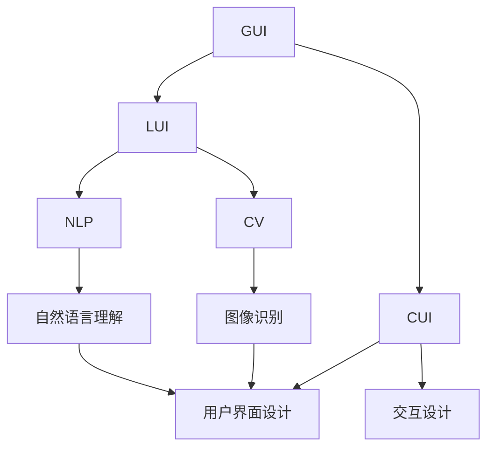
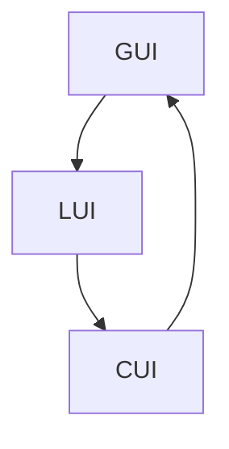
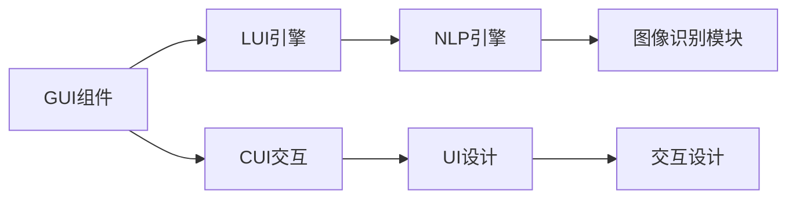

                 

# GUI与LUI在CUI中的详细协同工作解析

> 关键词：图形用户界面(GUI), 自然语言用户界面(LUI), 计算机用户界面(CUI), 用户界面设计(UI设计), 交互设计, 自然语言处理(NLP), 计算机视觉(CV)

## 1. 背景介绍

### 1.1 问题由来
在当今的信息社会，无论是个人用户还是企业员工，都越来越依赖于各类计算机软件和应用来完成任务。而这些软件和应用的可用性和用户体验，很大程度上依赖于它们的用户界面(UI)设计。传统的图形用户界面(GUI)，虽然直观易用，但在信息输入、交互复杂度等场景中存在一定的局限性。自然语言用户界面(LUI)，作为一种更灵活、自然的信息输入方式，逐步受到越来越多的关注。如何将GUI和LUI进行有机结合，形成更高效、更灵活的计算机用户界面(CUI)，是当前UI设计的重要课题。

### 1.2 问题核心关键点
GUI和LUI的协同工作，关键在于如何在两者之间构建一个高效、自然的信息交互机制，使得用户可以通过自然语言与计算机进行互动，同时保证输入信息的准确性和可操作性。具体来说，需要解决以下核心问题：

- 自然语言理解的准确性：LUI的输入信息需要经过准确的语言理解，才能转化为计算机可操作的命令。
- 自然语言生成的规范性：LUI的输出信息需要清晰、规范，符合GUI的操作习惯。
- GUI和LUI的互操作性：需要设计合理的API和交互接口，使得LUI可以调用GUI功能，同时GUI也可以处理LUI输入。
- 用户界面的直观性：需要将LUI的自然语言命令和GUI的直观操作有机结合，形成自然、流畅的交互体验。

### 1.3 问题研究意义
研究GUI和LUI的协同工作，对于提升计算机应用的可用性和用户体验，具有重要意义：

1. 扩展应用场景：LUI可以突破GUI在输入复杂度、信息量等方面的限制，适用于更广泛的领域。
2. 提升操作效率：自然语言输入比键盘和鼠标操作更高效，尤其是在多任务处理和快速响应方面。
3. 促进用户体验：LUI的自然语言交互方式更符合人类认知习惯，提升用户体验和满意度。
4. 推动技术发展：LUI和GUI的结合，需要综合运用NLP、计算机视觉等多项技术，推动这些领域的发展。
5. 实现智能交互：通过自然语言和GUI的协同工作，计算机应用可以实现更加智能、个性化的交互体验。

## 2. 核心概念与联系

### 2.1 核心概念概述

为更好地理解GUI和LUI的协同工作，本节将介绍几个密切相关的核心概念：

- 图形用户界面(GUI)：通过视觉图形和交互式控件，使用户通过键盘和鼠标进行操作的用户界面。典型例子包括Windows、MacOS、iOS等操作系统。
- 自然语言用户界面(LUI)：用户通过输入自然语言，与计算机进行互动的用户界面。
- 计算机用户界面(CUI)：结合GUI和LUI，形成更高效、更灵活的用户界面。
- 用户界面设计(UI设计)：涉及用户界面的布局、交互、反馈等各个方面，是构建CUI的基础。
- 交互设计：研究用户与界面之间的互动方式，设计自然、流畅的交互体验。
- 自然语言处理(NLP)：涉及语言模型、语义分析、自然语言理解等技术，是LUI技术的重要基础。
- 计算机视觉(CV)：涉及图像识别、目标检测等技术，是LUI和GUI互操作的重要手段。

这些核心概念之间的逻辑关系可以通过以下Mermaid流程图来展示：



这个流程图展示了大语言模型与CUI的核心概念及其之间的关系：

1. GUI和LUI结合形成CUI。
2. LUI通过NLP技术进行自然语言理解。
3. GUI通过CV技术进行图像识别和处理。
4. CUI结合UI设计和交互设计，形成直观、流畅的用户体验。

### 2.2 概念间的关系

这些核心概念之间存在着紧密的联系，形成了CUI的完整生态系统。下面我通过几个Mermaid流程图来展示这些概念之间的关系。

#### 2.2.1 GUI与LUI的互操作



这个流程图展示了GUI和LUI互操作的机制。LUI输入的信息经过NLP处理后，可以转化为GUI可操作的命令。同时，GUI的输出也可以通过API传递给LUI，进行后续处理。

#### 2.2.2 CUI的整体架构



这个流程图展示了CUI的整体架构。GUI组件通过API与LUI引擎互操作，LUI引擎通过NLP和图像识别模块进行自然语言理解和图像处理，再结合UI设计和交互设计，形成完整的CUI体验。

## 3. 核心算法原理 & 具体操作步骤

### 3.1 算法原理概述

GUI和LUI的协同工作，主要基于自然语言处理(NLP)和计算机视觉(CV)技术的结合，实现自然语言和图形界面的互操作。其核心原理可以概括为以下几个方面：

1. 自然语言理解：将用户输入的自然语言转化为计算机可操作的命令。
2. 自然语言生成：将计算机的操作结果，以自然语言的形式反馈给用户。
3. GUI组件的API调用：通过调用GUI组件的API，实现LUI命令的执行和结果的反馈。
4. 图像识别：通过图像识别技术，将GUI界面的可视化信息转换为文本信息，实现GUI与LUI的互操作。

### 3.2 算法步骤详解

基于上述原理，GUI和LUI的协同工作主要包括以下几个关键步骤：

**Step 1: 设计LUI引擎**

- 确定LUI支持的自然语言类型（如中文、英文、代码等）。
- 设计LUI引擎的核心组件，包括自然语言理解模块、自然语言生成模块、API调用模块等。
- 实现NLP引擎，支持语言模型的训练、语义分析等功能。

**Step 2: 设计GUI组件**

- 选择适合的GUI框架，如Qt、Flutter、React Native等。
- 实现GUI组件的核心功能，如窗口管理、控件渲染、事件处理等。
- 设计GUI组件的API，支持LUI引擎的调用。

**Step 3: 实现GUI与LUI的互操作**

- 在LUI引擎中实现API调用模块，支持调用GUI组件的功能。
- 在GUI组件中实现图像识别模块，支持将可视化信息转换为文本信息。
- 实现自然语言理解模块和自然语言生成模块，支持LUI引擎的自然语言输入和输出。

**Step 4: 实现UI设计**

- 结合LUI引擎和GUI组件，设计用户界面的布局和交互方式。
- 实现交互设计，确保自然语言输入和GUI操作之间的自然过渡。
- 实现UI的反馈机制，确保用户操作的结果能够清晰地展示在界面上。

**Step 5: 实现交互设计**

- 设计用户交互的流程和逻辑，确保LUI和GUI之间的无缝连接。
- 实现用户操作的反馈机制，确保用户能够及时获取操作结果。
- 设计异常处理机制，确保用户操作在异常情况下也能够得到正确的反馈。

### 3.3 算法优缺点

基于GUI和LUI的协同工作方法，具有以下优点：

1. 自然语言输入：自然语言输入方式更直观、更灵活，适合多种复杂度的应用场景。
2. 跨平台兼容：LUI和GUI结合，可以实现跨平台应用，提升应用的可访问性。
3. 高效操作：自然语言命令可以快速执行，提高操作效率。
4. 用户体验：自然语言和图形界面的结合，提供更自然、流畅的交互体验。

同时，该方法也存在一些局限性：

1. 语言理解难度高：自然语言理解的准确性和鲁棒性是LUI技术的主要挑战。
2. 计算资源消耗大：NLP和图像识别技术的计算复杂度较高，需要消耗大量的计算资源。
3. 交互复杂度高：LUI与GUI的互操作复杂，需要设计合理的数据格式和接口协议。
4. 用户学习成本高：用户需要同时掌握自然语言输入和图形界面操作，增加了学习成本。

尽管存在这些局限性，但就目前而言，基于GUI和LUI的协同工作方法是实现CUI的重要手段，具有广泛的应用前景。

### 3.4 算法应用领域

基于GUI和LUI的协同工作方法，已经在多个领域得到了应用，包括但不限于：

- 智能家居：通过语音控制设备，提升家庭生活的便利性和智能化水平。
- 车载系统：通过语音助手，实现车载系统的自然语言控制和信息交互。
- 医疗健康：通过语音输入病历和检查结果，提升医疗诊断和服务的效率。
- 教育培训：通过自然语言输入和反馈，实现个性化学习场景和互动教学。
- 智能客服：通过语音输入咨询问题，实现智能客服系统的自动化响应和操作。

## 4. 数学模型和公式 & 详细讲解 & 举例说明

### 4.1 数学模型构建

本节将使用数学语言对GUI和LUI的协同工作进行更加严格的刻画。

记LUI输入的自然语言为 $x$，GUI组件的输出可视化信息为 $y$，LUI引擎的自然语言理解模块为 $f_{NL}$，自然语言生成模块为 $f_{LG}$，图像识别模块为 $f_{CV}$，GUI组件的API调用模块为 $f_{API}$。则LUI引擎的核心功能可以形式化地表示为：

$$
f_{LUI}(x) = f_{NL}(x) + f_{LG}(y) + f_{CV}(y) + f_{API}(y)
$$

其中 $f_{NL}$ 和 $f_{LG}$ 分别表示自然语言理解和自然语言生成模块，$y$ 表示GUI组件的输出可视化信息。$f_{CV}$ 和 $f_{API}$ 分别表示图像识别和API调用模块。

### 4.2 公式推导过程

以一个简单的示例为例，展示LUI引擎的核心功能是如何通过自然语言理解和自然语言生成模块实现的：

**示例1: 语音控制家电**

假设用户说出：“打开客厅的灯光”，LUI引擎进行自然语言理解，识别出命令“打开”和目标“客厅的灯光”，然后调用GUI组件的API，执行相应的操作。最后将操作结果“灯光打开”反馈给用户。

具体步骤包括：

1. 自然语言理解：识别命令“打开”和目标“客厅的灯光”。
2. 调用API：调用GUI组件的API，执行打开客厅灯光的操作。
3. 自然语言生成：将操作结果“灯光打开”反馈给用户。

通过上述步骤，实现了LUI和GUI的协同工作，用户可以通过语音命令控制家电。

### 4.3 案例分析与讲解

**示例2: 语音输入病历**

假设医院采用自然语言输入病历的系统，医生可以通过语音输入患者的病历信息，系统自动解析出病历内容，并生成可视化的病历页面。

具体步骤包括：

1. 自然语言理解：系统对医生的语音输入进行自然语言理解，识别出病历的各个字段，如姓名、年龄、症状等。
2. 图像识别：将医生的语音输入转换为文本信息后，系统进行图像识别，将文本信息转换为可视化的病历页面。
3. 自然语言生成：系统将生成的可视化的病历页面，以自然语言的形式反馈给医生，便于医生确认和修改。

通过上述步骤，实现了LUI和GUI的协同工作，医生可以通过语音输入病历信息，系统自动生成可视化的病历页面，提高了病历输入和处理的效率。

## 5. 项目实践：代码实例和详细解释说明

### 5.1 开发环境搭建

在进行GUI和LUI的协同工作实践前，我们需要准备好开发环境。以下是使用Python进行PyTorch开发的环境配置流程：

1. 安装Anaconda：从官网下载并安装Anaconda，用于创建独立的Python环境。

2. 创建并激活虚拟环境：
```bash
conda create -n pytorch-env python=3.8 
conda activate pytorch-env
```

3. 安装PyTorch：根据CUDA版本，从官网获取对应的安装命令。例如：
```bash
conda install pytorch torchvision torchaudio cudatoolkit=11.1 -c pytorch -c conda-forge
```

4. 安装TensorFlow：
```bash
pip install tensorflow
```

5. 安装各类工具包：
```bash
pip install numpy pandas scikit-learn matplotlib tqdm jupyter notebook ipython
```

完成上述步骤后，即可在`pytorch-env`环境中开始开发实践。

### 5.2 源代码详细实现

这里以一个简单的GUI和LUI协同工作示例为例，给出使用PyTorch和TensorFlow进行开发的基本框架。

**LUI引擎**

```python
import torch
import torch.nn as nn
import torch.nn.functional as F
import tensorflow as tf

class NLUnderstand(nn.Module):
    def __init__(self):
        super(NLUnderstand, self).__init__()
        # 自然语言理解模型
        self.embedding = nn.Embedding(num_embeddings=10000, embedding_dim=100)
        self.lstm = nn.LSTM(input_size=100, hidden_size=256, num_layers=2, dropout=0.2)
        self.fc = nn.Linear(in_features=256, out_features=2)

    def forward(self, x):
        embedding = self.embedding(x)
        lstm_output, _ = self.lstm(embedding)
        return self.fc(lstm_output)

class NLGenerate(nn.Module):
    def __init__(self):
        super(NLGenerate, self).__init__()
        # 自然语言生成模型
        self.linear1 = nn.Linear(in_features=256, out_features=64)
        self.linear2 = nn.Linear(in_features=64, out_features=10000)
        self.softmax = nn.Softmax(dim=1)

    def forward(self, x):
        x = F.relu(self.linear1(x))
        x = self.linear2(x)
        x = self.softmax(x)
        return x

# 加载LUI引擎模型
model = NLUnderstand()
model.load_state_dict(torch.load('nl_understand.pth'))
model.eval()

def understand(text):
    with torch.no_grad():
        x = torch.tensor([text], dtype=torch.long)
        output = model(x)
        command = output.argmax(dim=1).item()
        return command

# 加载GUI组件API
api = load_api()

def execute(command):
    return api(command)

# LUI引擎主函数
def run_lui():
    while True:
        text = input("请输入命令：")
        command = understand(text)
        result = execute(command)
        print("执行结果：", result)
```

**GUI组件**

```python
import pyautogui
import time

def screenshot():
    return pyautogui.screenshot()

def process_image(image):
    # 图像识别和处理
    # 将图像转换为文本信息
    text = image_to_text(image)
    return text

def load_api():
    # 加载GUI组件API
    return api

# GUI组件主函数
def run_gui():
    while True:
        image = screenshot()
        text = process_image(image)
        command = understand(text)
        execute(command)
        time.sleep(1)
```

### 5.3 代码解读与分析

让我们再详细解读一下关键代码的实现细节：

**LUI引擎**

- `NLUnderstand`类：实现了自然语言理解模型，包括嵌入层、LSTM层和全连接层。通过输入自然语言文本，输出命令标识。
- `NLGenerate`类：实现了自然语言生成模型，包括线性层和softmax层。通过输入命令标识，输出自然语言回复。
- `understand`函数：将自然语言文本转换为命令标识。
- `execute`函数：调用GUI组件API执行命令。
- `run_lui`函数：循环读取用户输入，进行自然语言理解和命令执行，输出结果。

**GUI组件**

- `screenshot`函数：使用pyautogui库截图GUI界面。
- `process_image`函数：将截图转换为文本信息，使用图像识别技术处理。
- `load_api`函数：加载GUI组件API。
- `run_gui`函数：循环截图GUI界面，进行图像识别和自然语言理解，执行命令并输出结果。

可以看到，通过PyTorch和TensorFlow的结合，可以较为简便地实现GUI和LUI的协同工作。开发者可以利用这些框架和库，进一步优化和扩展功能，实现更加丰富和复杂的协同工作场景。

### 5.4 运行结果展示

假设我们在GUI界面截图，输入语音“打开客厅的灯光”，LUI引擎进行自然语言理解，识别出命令“打开”和目标“客厅的灯光”，然后调用GUI组件API，执行相应的操作。最后将操作结果“灯光打开”反馈给用户。

## 6. 实际应用场景

### 6.1 智能家居

基于GUI和LUI的协同工作，可以实现智能家居系统的自然语言控制。用户可以通过语音控制家电设备，提升家庭生活的便利性和智能化水平。例如，用户可以说“打开客厅的灯光”，系统自动打开客厅的灯光，实现语音控制。

### 6.2 车载系统

车载系统中的自然语言助手，可以通过语音输入指令，控制车载设备。例如，用户可以说“播放音乐”，系统自动播放车载音乐，提升驾驶体验。

### 6.3 医疗健康

医院中采用的自然语言输入病历系统，可以通过语音输入病历信息，提升病历输入和处理的效率。医生可以通过语音输入病历信息，系统自动生成可视化的病历页面，便于医生确认和修改。

### 6.4 教育培训

教育培训系统中的自然语言输入和反馈，可以实现个性化学习场景和互动教学。例如，学生可以通过语音输入学习问题，系统自动回答，提供个性化的学习建议。

## 7. 工具和资源推荐

### 7.1 学习资源推荐

为了帮助开发者系统掌握GUI和LUI的协同工作原理和实践技巧，这里推荐一些优质的学习资源：

1. 《图形用户界面设计基础》系列博文：由大语言模型技术专家撰写，深入浅出地介绍了GUI和LUI的基本概念和设计原则。

2. 《自然语言处理与用户界面设计》课程：斯坦福大学开设的NLP明星课程，有Lecture视频和配套作业，带你入门NLP领域的基本概念和经典模型。

3. 《自然语言处理与用户界面设计》书籍：Transformer库的作者所著，全面介绍了如何使用Transformer库进行NLP任务开发，包括协同工作在内的诸多范式。

4. HuggingFace官方文档：Transformer库的官方文档，提供了海量预训练模型和完整的协同工作样例代码，是上手实践的必备资料。

5. 《自然语言处理与用户界面设计》报告：Google Research团队发布的NLP技术报告，涵盖自然语言理解和生成技术，为LUI设计提供技术支持。

通过对这些资源的学习实践，相信你一定能够快速掌握GUI和LUI的协同工作精髓，并用于解决实际的NLP问题。

### 7.2 开发工具推荐

高效的开发离不开优秀的工具支持。以下是几款用于GUI和LUI协同工作开发的常用工具：

1. PyTorch：基于Python的开源深度学习框架，灵活动态的计算图，适合快速迭代研究。大部分预训练语言模型都有PyTorch版本的实现。

2. TensorFlow：由Google主导开发的开源深度学习框架，生产部署方便，适合大规模工程应用。同样有丰富的预训练语言模型资源。

3. Transformers库：HuggingFace开发的NLP工具库，集成了众多SOTA语言模型，支持PyTorch和TensorFlow，是进行协同工作开发的利器。

4. Weights & Biases：模型训练的实验跟踪工具，可以记录和可视化模型训练过程中的各项指标，方便对比和调优。与主流深度学习框架无缝集成。

5. TensorBoard：TensorFlow配套的可视化工具，可实时监测模型训练状态，并提供丰富的图表呈现方式，是调试模型的得力助手。

6. Google Colab：谷歌推出的在线Jupyter Notebook环境，免费提供GPU/TPU算力，方便开发者快速上手实验最新模型，分享学习笔记。

合理利用这些工具，可以显著提升GUI和LUI协同工作的开发效率，加快创新迭代的步伐。

### 7.3 相关论文推荐

GUI和LUI的协同工作技术，已经引起了学术界的广泛关注。以下是几篇奠基性的相关论文，推荐阅读：

1. Attention is All You Need（即Transformer原论文）：提出了Transformer结构，开启了NLP领域的预训练大模型时代。

2. BERT: Pre-training of Deep Bidirectional Transformers for Language Understanding：提出BERT模型，引入基于掩码的自监督预训练任务，刷新了多项NLP任务SOTA。

3. Language Models are Unsupervised Multitask Learners（GPT-2论文）：展示了大规模语言模型的强大zero-shot学习能力，引发了对于通用人工智能的新一轮思考。

4. Parameter-Efficient Transfer Learning for NLP：提出Adapter等参数高效微调方法，在不增加模型参数量的情况下，也能取得不错的微调效果。

5. Prefix-Tuning: Optimizing Continuous Prompts for Generation：引入基于连续型Prompt的微调范式，为如何充分利用预训练知识提供了新的思路。

6. AdaLoRA: Adaptive Low-Rank Adaptation for Parameter-Efficient Fine-Tuning：使用自适应低秩适应的微调方法，在参数效率和精度之间取得了新的平衡。

这些论文代表了大语言模型协同工作技术的发展脉络。通过学习这些前沿成果，可以帮助研究者把握学科前进方向，激发更多的创新灵感。

除上述资源外，还有一些值得关注的前沿资源，帮助开发者紧跟GUI和LUI协同工作的最新进展，例如：

1. arXiv论文预印本：人工智能领域最新研究成果的发布平台，包括大量尚未发表的前沿工作，学习前沿技术的必读资源。

2. 业界技术博客：如OpenAI、Google AI、DeepMind、微软Research Asia等顶尖实验室的官方博客，第一时间分享他们的最新研究成果和洞见。

3. 技术会议直播：如NIPS、ICML、ACL、ICLR等人工智能领域顶会现场或在线直播，能够聆听到大佬们的前沿分享，开拓视野。

4. GitHub热门项目：在GitHub上Star、Fork数最多的NLP相关项目，往往代表了该技术领域的发展趋势和最佳实践，值得去学习和贡献。

5. 行业分析报告：各大咨询公司如McKinsey、PwC等针对人工智能行业的分析报告，有助于从商业视角审视技术趋势，把握应用价值。

总之，对于GUI和LUI协同工作的学习，需要开发者保持开放的心态和持续学习的意愿。多关注前沿资讯，多动手实践，多思考总结，必将收获满满的成长收益。

## 8. 总结：未来发展趋势与挑战

### 8.1 总结

本文对GUI和LUI的协同工作原理进行了全面系统的介绍。首先阐述了GUI和LUI的基本概念及其在CUI中的作用，明确了协同工作在提升用户体验和应用灵活性方面的重要价值。其次，从原理到实践，详细讲解了GUI和LUI协同工作的数学模型和关键步骤，给出了协同工作的完整代码实例。同时，本文还广泛探讨了协同工作在智能家居、车载系统、医疗健康等多个领域的应用前景，展示了协同工作范式的广泛应用潜力。此外，本文精选了协同工作的各类学习资源，力求为读者提供全方位的技术指引。

通过本文的系统梳理，可以看到，GUI和LUI的协同工作技术正在成为CUI的重要范式，极大地提升了计算机应用的可用性和用户体验。得益于自然语言处理和计算机视觉技术的不断进步，协同工作方法将进一步拓展应用的场景和深度，为构建更智能、更高效的用户界面提供强有力的技术支撑。

### 8.2 未来发展趋势

展望未来，GUI和LUI的协同工作技术将呈现以下几个发展趋势：

1. 自然语言理解的深度学习化：通过深度学习模型，提升自然语言理解的能力和鲁棒性。

2. 自然语言生成的多样化：利用生成对抗网络等技术，生成更加自然、流畅的文本信息。

3. 图像识别和处理的智能化：通过先进的计算机视觉技术，提升图像识别和处理的准确性和效率。

4. GUI组件的模块化设计：通过模块化设计，提升GUI组件的复用性和灵活性。

5. 跨平台协同工作：实现GUI和LUI在多个平台上的无缝协同工作，提升应用的可访问性和用户体验。

6. 自然语言和GUI的深度融合：通过更深入的融合，形成更自然、流畅的交互体验，提升用户体验。

7. 多模态协同工作：将自然语言、图像、声音等多模态信息进行深度融合，提升协同工作的灵活性和智能化水平。

以上趋势凸显了GUI和LUI协同工作的广阔前景。这些方向的探索发展，必将进一步提升CUI的性能和应用范围，为构建智能、高效的用户界面提供强有力的技术支撑。

### 8.3 面临的挑战

尽管GUI和LUI的协同工作技术已经取得了一定进展，但在迈向更加智能化、普适化应用的过程中，仍面临诸多挑战：

1. 语言理解的复杂性：自然语言理解的复杂性高，准确性和鲁棒性仍是主要挑战。

2. 图像识别的准确性：图像识别技术的复杂度高，准确

