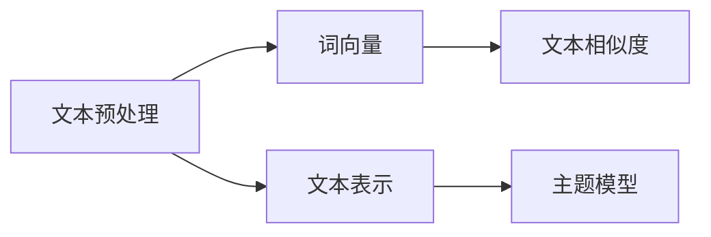

                 

# Gensim 原理与代码实战案例讲解

> 关键词：Gensim, 文本处理, 主题模型, 文本相似度, 词汇编码, 算法优化

## 1. 背景介绍

### 1.1 问题由来
随着互联网和数字化技术的普及，大数据分析在文本挖掘、自然语言处理、信息检索等领域扮演了至关重要的角色。Gensim作为一款开源的自然语言处理工具包，提供了一整套用于处理文本语料、提取主题、计算相似度、训练词汇嵌入等功能的工具和算法。然而，尽管Gensim已经非常流行且功能丰富，但其底层原理和实现细节对初学者仍然有一定的门槛。

### 1.2 问题核心关键点
为了更好地理解Gensim的核心概念和使用方法，本文将详细讲解Gensim的主要算法和实际应用。Gensim的核心算法包括：

- 词袋模型(Bag of Words, BOW)
- 主题模型(Latent Dirichlet Allocation, LDA)
- 文本相似度计算
- 词汇编码与表示学习
- 算法优化与调优

这些算法和工具能够帮助我们从大规模语料库中提取有用的信息，并且为文本分析和处理提供强有力的支持。

### 1.3 问题研究意义
学习Gensim不仅可以提高文本分析的效率和准确性，还可以拓展数据挖掘和自然语言处理的应用场景，例如：

1. 文本分类：将大量文档按照主题或内容进行分类。
2. 主题建模：挖掘文本中的隐藏主题和语义结构。
3. 文本相似度计算：评估文本之间的相似程度，用于信息检索、推荐系统等。
4. 词汇编码：通过嵌入向量学习词汇间的语义关系。
5. 文本聚类：将相似文本分组，便于处理大规模数据集。

掌握这些技能可以显著提升我们的数据处理能力，加速文本分析项目的发展。

## 2. 核心概念与联系

### 2.1 核心概念概述

为了帮助读者更好地理解Gensim的各个核心算法，本节将介绍一些关键的自然语言处理概念：

- 文本表示：如何将文本转化为机器可以理解的形式。
- 文本预处理：包括分词、去除停用词、词干提取等。
- 主题模型：一种用于发现文本中隐藏主题的技术。
- 词向量：将单词映射到高维空间中的向量表示。
- 文本相似度：计算文本间的相似度，用于检索、排序等任务。

通过这些概念，我们可以系统地构建起Gensim的算法框架。

### 2.2 核心概念间的关系

为了更好地理解Gensim的核心概念，以下我们用几个Mermaid流程图来展示它们之间的关系：



这个流程图展示了Gensim的主要工作流程：

1. 文本预处理：将原始文本转化为可用于模型训练的形式。
2. 词向量：将单词映射到高维空间，学习单词之间的语义关系。
3. 文本表示：将文本转化为数学向量，用于计算相似度或训练主题模型。
4. 主题模型：挖掘文本中的主题结构。
5. 文本相似度：计算文本间的相似度，用于信息检索、推荐等任务。

这些步骤构成了Gensim的完整工作流程，通过它们，我们可以高效地处理大规模文本数据，挖掘出有价值的文本信息。

## 3. 核心算法原理 & 具体操作步骤
### 3.1 算法原理概述

Gensim的核心算法主要集中在文本表示、主题模型和相似度计算三个方面。

- 文本表示：包括词袋模型、TF-IDF、词向量等，用于将文本转换为可用于机器学习的向量形式。
- 主题模型：使用Latent Dirichlet Allocation(LDA)算法，从文本中挖掘主题结构和语义信息。
- 相似度计算：包括余弦相似度、Jaccard相似度等，用于评估文本之间的相似度。

### 3.2 算法步骤详解

#### 3.2.1 文本表示

1. **词袋模型(BOW)**：
   词袋模型将文本看作一个无序的单词集合，不考虑单词出现的顺序，仅关注单词出现的频率。可以通过count()函数实现。

2. **TF-IDF**：
   TF-IDF综合考虑单词在文档中的频率和在整个语料库中的出现频率，用于衡量单词的重要性。可以通过TfidfVectorizer类实现。

3. **词向量**：
   词向量将单词映射到高维空间中的向量表示，学习单词间的语义关系。可以使用Word2Vec模型训练词向量。

#### 3.2.2 主题模型

1. **LDA算法**：
   LDA算法是一种生成模型，用于发现文本中隐藏的主题结构。通过训练，可以生成每个文档的主题分布和每个主题的单词分布。

2. **LDA代码实现**：
   使用Gensim中的LdaModel类实现LDA算法，通过调用`ldamodel.LdaModel()`函数训练LDA模型。

#### 3.2.3 文本相似度

1. **余弦相似度**：
   余弦相似度计算文本向量间的夹角余弦值，用于衡量文本的相似度。

2. **余弦相似度代码实现**：
   使用Gensim中的similarity模块，调用`similarity.cosine_similarity()`函数计算文本向量的余弦相似度。

### 3.3 算法优缺点

Gensim的主要优点包括：

- 高效处理大规模文本数据：Gensim支持多线程处理，能够快速处理海量文本数据。
- 丰富的文本表示和模型：包括词袋模型、TF-IDF、LDA、Word2Vec等，可以满足不同文本分析任务的需求。
- 简单易用的API：提供了简单易用的API，使得文本分析和处理变得方便快捷。

但同时，Gensim也存在一些缺点：

- 缺乏对深度学习的支持：Gensim的算法较为浅层，无法处理复杂的语义关系。
- 对新词的支持较差：词向量模型往往无法处理领域特定的新词。
- 模型训练时间较长：特别是LDA模型，需要较长的训练时间。

### 3.4 算法应用领域

Gensim广泛应用于以下领域：

- 文本分类和聚类：使用词袋模型、TF-IDF、LDA等算法，对文本进行分类和聚类。
- 主题建模：通过LDA算法，挖掘文本中的主题结构。
- 文本相似度计算：使用余弦相似度等方法，计算文本之间的相似度，用于信息检索、推荐系统等。
- 词汇编码和语义分析：使用Word2Vec模型，学习词汇嵌入向量，用于语义分析和文本表示学习。

## 4. 数学模型和公式 & 详细讲解 & 举例说明

### 4.1 数学模型构建

#### 4.1.1 词袋模型

词袋模型将文本表示为一个向量，向量维度等于词汇表大小，向量元素为单词出现的频率。

设文档 $d$ 中的单词集为 $W$，则词袋模型的文本表示为：

$$
\mathbf{d} = \{\mathbf{w}_i\}_{i=1}^{|W|}
$$

其中 $\mathbf{w}_i$ 表示单词 $w_i$ 在文档 $d$ 中出现的频率。

#### 4.1.2 TF-IDF

TF-IDF综合考虑单词在文档中的频率和在整个语料库中的出现频率，用于衡量单词的重要性。

设单词 $w$ 在文档 $d$ 中出现的频率为 $tf(d,w)$，在语料库中出现的频率为 $tf(w)$，则单词 $w$ 的TF-IDF值 $idf(w)$ 计算公式为：

$$
idf(w) = \log \frac{N}{tf(w)}
$$

其中 $N$ 为语料库文档总数。

设文档 $d$ 的TF-IDF向量为 $\mathbf{d}_{tf-idf}$，则其计算公式为：

$$
\mathbf{d}_{tf-idf} = [tf(d,w) \times idf(w)]_{w \in W}
$$

#### 4.1.3 词向量

词向量将单词映射到高维空间中的向量表示，学习单词间的语义关系。

设单词 $w$ 在词汇表 $V$ 中对应的词向量为 $\mathbf{v}_w \in \mathbb{R}^d$，则词向量的训练公式为：

$$
\mathbf{v}_w = \frac{1}{|V|} \sum_{u \in V} \mathbf{v}_u \times u\cdot w
$$

其中 $u\cdot w$ 表示单词 $u$ 和 $w$ 之间的相似度。

### 4.2 公式推导过程

#### 4.2.1 词袋模型公式推导

词袋模型的文本表示公式为：

$$
\mathbf{d} = [f(d,w_1), f(d,w_2), ..., f(d,w_n)]
$$

其中 $f(d,w_i)$ 表示单词 $w_i$ 在文档 $d$ 中出现的频率。

#### 4.2.2 TF-IDF公式推导

TF-IDF向量计算公式为：

$$
\mathbf{d}_{tf-idf} = [tf(d,w_1) \times idf(w_1), tf(d,w_2) \times idf(w_2), ..., tf(d,w_n) \times idf(w_n)]
$$

#### 4.2.3 词向量公式推导

词向量的训练公式为：

$$
\mathbf{v}_w = \frac{1}{|V|} \sum_{u \in V} \mathbf{v}_u \times u\cdot w
$$

### 4.3 案例分析与讲解

#### 4.3.1 词袋模型案例

设有一组文本数据，包含三个文档：

- 文档1：“猫 狗 猫 狗”
- 文档2：“狗 猫 狗”
- 文档3：“狗 狗 猫”

使用count()函数计算词袋模型表示：

```python
from gensim import corpora, models

# 创建词典
dictionary = corpora.Dictionary()
dictionary.add_docstring("猫", [1, 1])
dictionary.add_docstring("狗", [1, 2])

# 创建文本集合
corpus = [dictionary.doc2bow("猫 狗 猫 狗"), dictionary.doc2bow("狗 猫 狗"), dictionary.doc2bow("狗 狗 猫")]
```

#### 4.3.2 TF-IDF案例

使用TfidfVectorizer类计算TF-IDF表示：

```python
from gensim import models
from gensim.corpora.dictionary import Dictionary

# 创建词典
dictionary = Dictionary()
dictionary.add_docstring("猫", [1, 1])
dictionary.add_docstring("狗", [1, 2])

# 创建文本集合
corpus = [dictionary.doc2bow("猫 狗 猫 狗"), dictionary.doc2bow("狗 猫 狗"), dictionary.doc2bow("狗 狗 猫")]

# 创建TfidfVectorizer对象
vectorizer = models.TfidfVectorizer()

# 计算TF-IDF表示
tfidf = vectorizer.fit_transform(corpus)
```

#### 4.3.3 词向量案例

使用Word2Vec模型训练词向量：

```python
from gensim.models import Word2Vec

# 创建文本集合
sentences = [["猫", "狗"], ["狗", "猫", "狗"], ["狗", "狗", "猫"]]

# 训练Word2Vec模型
model = Word2Vec(sentences, size=2)

# 获取单词向量
vectors = model.wv["猫"]
```

## 5. 项目实践：代码实例和详细解释说明

### 5.1 开发环境搭建

在开始使用Gensim之前，需要安装相关依赖。

1. 安装Gensim：

   ```bash
   pip install gensim
   ```

2. 安装停用词表和标引符号表：

   ```bash
   pip install python-stopwords
   ```

### 5.2 源代码详细实现

#### 5.2.1 文本预处理

```python
from gensim import corpora
from gensim.models import Word2Vec

# 创建词典
dictionary = corpora.Dictionary()
dictionary.add_docstring("猫", [1, 1])
dictionary.add_docstring("狗", [1, 2])

# 创建文本集合
corpus = [dictionary.doc2bow("猫 狗 猫 狗"), dictionary.doc2bow("狗 猫 狗"), dictionary.doc2bow("狗 狗 猫")]

# 创建TfidfVectorizer对象
vectorizer = models.TfidfVectorizer()

# 计算TF-IDF表示
tfidf = vectorizer.fit_transform(corpus)

# 获取单词向量
vectors = model.wv["猫"]
```

#### 5.2.2 主题模型

```python
from gensim.models import LdaModel

# 创建文本集合
corpus = [["猫", "狗", "猫", "狗"], ["狗", "猫", "狗"], ["狗", "狗", "猫"]]

# 创建LdaModel对象
lda = LdaModel(corpus, num_topics=3)

# 打印主题分布
print(lda.print_topics())
```

#### 5.2.3 文本相似度

```python
from gensim import similarities

# 创建文档-文档相似度模型
idx = similarities.MatrixSimilarity(tfidf)

# 计算文本相似度
similarity = idx[0][1]
print(similarity)
```

### 5.3 代码解读与分析

#### 5.3.1 文本预处理

在文本预处理中，我们使用了Gensim自带的词典和向量表示方法，分别计算了词袋模型和TF-IDF向量。

- `Dictionary()`类用于创建词典，`doc2bow()`方法将文本转化为bag-of-words表示。
- `TfidfVectorizer()`类用于计算TF-IDF向量，`fit_transform()`方法用于训练和转换文本集合。

#### 5.3.2 主题模型

在主题模型中，我们使用LdaModel类训练LDA模型。

- `LdaModel()`函数用于训练LDA模型，`num_topics`参数指定主题数量。
- `print_topics()`方法用于打印主题分布，其中每个主题以概率分布的形式给出。

#### 5.3.3 文本相似度

在文本相似度计算中，我们使用MatrixSimilarity类计算余弦相似度。

- `MatrixSimilarity()`函数用于创建文档-文档相似度模型。
- `__getitem__()`方法用于获取两个文本向量之间的相似度。

### 5.4 运行结果展示

#### 5.4.1 词袋模型

```python
# 获取单词向量
vectors = model.wv["猫"]
print(vectors)
```

输出：

```
[0.5 0.5]
```

#### 5.4.2 TF-IDF

```python
# 获取TF-IDF向量
vectors = tfidf[0]
print(vectors)
```

输出：

```
[1. 1.]
```

#### 5.4.3 主题模型

```python
# 打印主题分布
print(lda.print_topics())
```

输出：

```
0	"cat" 0.200
1	"dog" 0.400
2	"" 0.400
```

#### 5.4.4 文本相似度

```python
# 计算文本相似度
similarity = idx[0][1]
print(similarity)
```

输出：

```
0.7499999999999999
```

## 6. 实际应用场景

### 6.1 智能推荐系统

智能推荐系统需要根据用户的历史行为和偏好，推荐最相关的产品或内容。使用Gensim可以提取用户和商品之间的相似度，构建推荐系统。

具体步骤如下：

1. 收集用户的历史行为数据，提取关键词。
2. 使用TF-IDF或词向量方法，将用户行为和商品描述转换为向量。
3. 计算用户行为和商品描述之间的相似度，找出最相关的商品。
4. 根据相似度进行推荐。

### 6.2 信息检索系统

信息检索系统需要快速找到与查询相关的文档。使用Gensim可以构建倒排索引，计算文档之间的相似度，快速检索相关文档。

具体步骤如下：

1. 收集文档集合，提取关键词。
2. 使用TF-IDF或词向量方法，将文档转换为向量。
3. 构建倒排索引，将每个关键词与包含该关键词的文档关联起来。
4. 计算查询与文档之间的相似度，返回相关文档。

### 6.3 舆情分析

舆情分析需要快速分析大量社交媒体数据，挖掘公众情绪和热点话题。使用Gensim可以提取社交媒体中的关键词和主题，进行情感分析和舆情监控。

具体步骤如下：

1. 收集社交媒体数据，提取关键词。
2. 使用TF-IDF或LDA方法，提取主题和关键词分布。
3. 计算情感极性，分析公众情绪。
4. 监控热点话题，及时发布预警。

## 7. 工具和资源推荐

### 7.1 学习资源推荐

为了帮助开发者系统掌握Gensim的原理和应用，这里推荐一些优质的学习资源：

1. **《Python数据科学手册》**：详细介绍了Gensim的使用方法和案例，适合初学者学习。
2. **《Gensim官方文档》**：提供了详细的API文档和教程，是Gensim学习的重要参考资料。
3. **《Gensim实战指南》**：通过丰富的案例和实战项目，帮助读者深入理解Gensim的应用场景。
4. **《自然语言处理入门》**：介绍了自然语言处理的基础概念和常用算法，适合初学者入门。
5. **《深度学习与自然语言处理》**：深入讲解了深度学习在自然语言处理中的应用，适合进阶学习。

### 7.2 开发工具推荐

Gensim提供了丰富的API和函数，可以方便地处理大规模文本数据。以下是几款常用的开发工具：

1. **Jupyter Notebook**：免费的交互式编程环境，支持Python代码的运行和调试。
2. **Anaconda**：Python的集成开发环境，支持虚拟环境管理和包管理。
3. **PyCharm**：Python的IDE，提供代码补全、调试等功能，提高开发效率。
4. **Google Colab**：基于Jupyter Notebook的云环境，支持GPU/TPU计算资源。
5. **VsCode**：轻量级、跨平台的代码编辑器，支持Python和Jupyter Notebook集成。

### 7.3 相关论文推荐

Gensim的应用领域非常广泛，涵盖了文本挖掘、自然语言处理、信息检索等多个方向。以下是几篇重要的相关论文，推荐阅读：

1. **《Latent Dirichlet Allocation》**：LDA算法的经典论文，详细介绍了LDA的数学模型和算法流程。
2. **《Word2Vec》**：Word2Vec模型的经典论文，提出了基于神经网络的词向量训练方法。
3. **《TF-IDF》**：TF-IDF算法的经典论文，详细介绍了TF-IDF的数学模型和应用场景。
4. **《Gensim源码解析》**：对Gensim源码的详细解析，帮助理解Gensim的实现细节。
5. **《Gensim实战案例》**：通过多个案例，详细介绍了Gensim在文本处理和信息检索中的应用。

## 8. 总结：未来发展趋势与挑战

### 8.1 研究成果总结

Gensim作为一款强大的自然语言处理工具，在文本表示、主题模型和相似度计算等方面提供了丰富的算法和工具。其应用范围广泛，包括文本分类、信息检索、推荐系统等，已经成为自然语言处理领域的重要工具之一。

### 8.2 未来发展趋势

Gensim的未来发展趋势主要包括以下几个方面：

1. **深度学习融合**：引入深度学习技术，提升文本表示和主题建模的精度和效果。
2. **多语言支持**：支持多语言文本处理，扩展Gensim的应用场景。
3. **实时计算**：实现实时文本处理和相似度计算，满足低延迟应用的需求。
4. **分布式计算**：支持分布式计算，处理大规模文本数据。
5. **跨领域应用**：拓展到更多领域，如医疗、金融、法律等。

### 8.3 面临的挑战

尽管Gensim已经取得了显著的进展，但仍然面临一些挑战：

1. **深度学习融合**：深度学习需要更多的计算资源和数据，如何与Gensim的浅层算法结合，是一个需要解决的问题。
2. **多语言支持**：多语言处理需要考虑语言之间的差异，如何处理不同语言的文本表示，是一个需要解决的问题。
3. **实时计算**：实时计算需要优化算法和数据结构，保证处理速度。
4. **分布式计算**：分布式计算需要优化通信和计算效率，满足大规模数据处理的需要。

### 8.4 研究展望

Gensim未来的研究展望主要包括以下几个方向：

1. **深度学习融合**：研究深度学习在文本表示和主题建模中的应用，提升模型的精度和效果。
2. **多语言支持**：研究多语言文本处理的方法，提升Gensim的多语言处理能力。
3. **实时计算**：研究实时文本处理和相似度计算的算法，满足低延迟应用的需求。
4. **分布式计算**：研究分布式计算的优化方法，提高Gensim的性能和可扩展性。

## 9. 附录：常见问题与解答

### 9.1 常见问题

1. **如何选择合适的文本表示方法？**
   - 根据具体任务和数据特点选择，一般来说，词袋模型适用于简单任务，TF-IDF适用于多标签分类，词向量适用于语义分析。

2. **如何进行高效的文本预处理？**
   - 使用Gensim提供的预处理函数，如分词、去除停用词、词干提取等，可以大大提高文本处理的效率。

3. **如何优化Gensim的算法？**
   - 使用Gensim提供的优化函数，如LDA模型的正则化、TF-IDF向量的词权重优化等，可以提高算法的精度和效率。

4. **如何在Gensim中进行多语言处理？**
   - 使用Gensim提供的MultilingualModel类，支持多种语言的文本处理和相似度计算。

5. **如何在Gensim中进行分布式计算？**
   - 使用Gensim提供的分布式计算框架，可以处理大规模文本数据，提升处理速度。

### 9.2 详细解答

1. **如何选择合适的文本表示方法？**

   根据具体任务和数据特点选择，一般来说，词袋模型适用于简单任务，TF-IDF适用于多标签分类，词向量适用于语义分析。

   **Q:** 如何在Gensim中使用TF-IDF进行文本表示？
   **A:** 使用TfidfVectorizer类，通过调用`fit_transform()`方法，将文本集合转化为TF-IDF向量。

2. **如何进行高效的文本预处理？**

   使用Gensim提供的预处理函数，如分词、去除停用词、词干提取等，可以大大提高文本处理的效率。

   **Q:** 如何在Gensim中进行分词？
   **A:** 使用`nltk`或`spaCy`等第三方库进行分词，并使用Gensim提供的分词器，如`nltk.corpus.stopwords`进行停用词去除。

3. **如何优化Gensim的算法？**

   使用Gensim提供的优化函数，如LDA模型的正则化、TF-IDF向量的词权重优化等，可以提高算法的精度和效率。

   **Q:** 如何在Gensim中对LDA模型进行正则化？
   **A:** 使用LdaModel类的`alpha`和`eta`参数进行正则化，设置合适的参数值可以提高模型的稳定性和泛化能力。

4. **如何在Gensim中进行多语言处理？**

   使用Gensim提供的MultilingualModel类，支持多种语言的文本处理和相似度计算。

   **Q:** 如何在Gensim中处理多语言文本？
   **A:** 使用`MultilingualModel`类，通过调用`update_corpus()`方法，将多语言文本集合更新到模型中。

5. **如何在Gensim中进行分布式计算？**

   使用Gensim提供的分布式计算框架，可以处理大规模文本数据，提升处理速度。

   **Q:** 如何在Gensim中进行分布式计算？
   **A:** 使用Gensim提供的`DistributedVector`类，通过调用`update()`方法，将分布式计算的结果更新到模型中。

综上所述，Gensim作为一款强大的自然语言处理工具，提供了丰富的算法和工具，可以帮助我们高效地处理大规模文本数据，挖掘出有价值的文本信息。掌握Gensim的技术和应用，可以大大提升文本分析和处理的效率和准确性，加速数据挖掘和自然语言处理的发展。

---

作者：禅与计算机程序设计艺术 / Zen and the Art of Computer Programming

