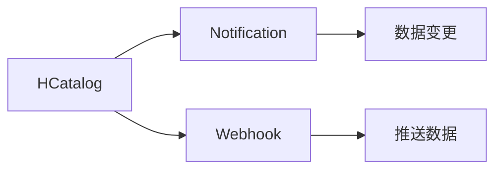

                 

# HCatalog Notification机制原理与代码实例讲解

## 1. 背景介绍

在大数据生态系统中，数据的治理和分享是非常关键的一环。随着数据量的不断增加和数据复杂度的提升，企业需要对数据进行更加精细化的管理和监控，确保数据的质量和可用性。HCatalog（Hive metastore）作为Hadoop生态系统中的数据管理系统，提供了数据源的元数据管理和查询服务，是数据治理的核心组件。

### 1.1 数据治理的重要性

数据治理是大数据平台能够正常运行的基础，在数据治理中，数据的生命周期管理、数据质量管理、数据共享与访问控制等环节都至关重要。随着企业对数据的需求日益增长，数据治理的难度也随之增加。通过有效的数据治理，可以提升数据质量，降低数据管理成本，加速数据驱动的业务创新。

### 1.2 HCatalog的角色

HCatalog 是Hadoop生态系统中的核心组件，它提供了元数据管理服务，支持数据的查询、统计、分析和优化。通过HCatalog，数据源可以被统一管理和查询，为数据治理提供了坚实的基础。HCatalog的作用包括：

- 集中管理数据源的元数据，包括表名、列名、类型、位置等。
- 提供统一的查询接口，用于检索数据源信息。
- 支持数据的权限控制，保护数据的安全性。

## 2. 核心概念与联系

### 2.1 核心概念概述

为了更好地理解HCatalog Notification机制，本节将介绍几个核心概念：

- **HCatalog**：Hadoop生态系统中的数据管理系统，提供元数据管理和查询服务。
- **Notification**：数据变更的通知机制，用于监控数据源的元数据变化，确保数据一致性。
- **Webhook**：一种允许Web服务端向其他服务端推送数据的机制，常用于构建松耦合的系统。

### 2.2 概念间的关系

这些核心概念之间的逻辑关系可以通过以下Mermaid流程图来展示：



这个流程图展示了大数据生态系统中数据变更通知的流程：

1. HCatalog对数据源的元数据进行管理。
2. 当数据源的元数据发生变化时，通过Notification机制触发变更事件。
3. Webhook服务接收通知并推送数据变更到其他系统，实现数据的实时同步。

## 3. 核心算法原理 & 具体操作步骤

### 3.1 算法原理概述

HCatalog Notification机制基于Webhook技术，通过订阅和推送机制，实现对数据变更的实时通知。其核心原理包括：

1. **订阅机制**：数据源主机的Webhook服务订阅HCatalog变更事件，定期查询最新的变更记录。
2. **推送机制**：当数据源的元数据发生变化时，HCatalog将变更信息通过HTTP POST请求推送到Webhook服务。
3. **解析与处理**：Webhook服务解析HTTP请求，提取变更信息，并根据业务逻辑进行相应的处理。

### 3.2 算法步骤详解

#### 3.2.1 订阅变更事件

1. 在数据源主机上部署Webhook服务，并配置订阅变更事件。
2. 通过HCatalog的API获取变更事件的订阅URL，将其作为Webhook的推送目标。
3. Webhook服务定期发送HTTP GET请求到订阅URL，查询最新的变更事件。

#### 3.2.2 处理变更通知

1. 当HCatalog推送变更事件时，Webhook服务接收HTTP POST请求。
2. 解析HTTP请求的body，提取变更事件的类型、时间戳、元数据等信息。
3. 根据变更事件的业务逻辑，触发相应的数据处理流程，如更新本地数据、发送告警等。

#### 3.2.3 反馈机制

1. Webhook服务应将变更处理结果反馈给HCatalog，确认变更已处理。
2. 通过HTTP POST请求，将处理结果发送回HCatalog的订阅URL。
3. 通过HTTP请求的状态码，HCatalog确认变更事件已被成功处理。

### 3.3 算法优缺点

#### 优点

- **实时性**：通过Webhook机制，变更事件能够实时推送，确保数据的一致性。
- **可扩展性**：多个Webhook服务可以同时订阅变更事件，支持多系统集成。
- **自动化**：自动化处理数据变更，减少人工干预，提高效率。

#### 缺点

- **网络延迟**：变更事件推送的网络延迟可能影响实时性。
- **安全性**：Webhook服务需要可靠的认证机制，防止未授权访问。
- **资源消耗**：频繁的网络请求和数据处理可能导致资源消耗较大。

### 3.4 算法应用领域

HCatalog Notification机制广泛应用于大数据生态系统中的各个环节，包括：

- 数据源的变更监控和同步。
- 数据质量管理，通过实时监控数据变更，及时发现和处理数据质量问题。
- 数据共享和访问控制，确保数据在多个系统间的一致性。
- 数据安全和隐私保护，通过变更事件监控和反馈，防止未授权访问和数据泄露。

## 4. 数学模型和公式 & 详细讲解 & 举例说明

### 4.1 数学模型构建

设$X$为数据源的元数据集合，$Y$为变更事件集合。定义订阅事件的函数$\text{subscribe}(\text{url})$，推送事件的函数$\text{push}(\text{data})$。则HCatalog Notification机制可以表示为：

$$
\text{subscription}(\text{url}) \rightarrow \text{push}(\text{data})
$$

其中，$\text{subscribe}(\text{url})$表示Webhook服务订阅HCatalog变更事件，$\text{push}(\text{data})$表示HCatalog推送变更事件。

### 4.2 公式推导过程

对于订阅事件，公式可表示为：

$$
\text{subscribe}(\text{url}) = \text{URL}
$$

其中，$\text{URL}$为HCatalog变更事件的订阅URL。

对于推送事件，公式可表示为：

$$
\text{push}(\text{data}) = \text{HTTP POST}(\text{URL}, \text{data})
$$

其中，$\text{data}$为变更事件的详细信息。

### 4.3 案例分析与讲解

以数据源的表结构变更为例，设表$T$的字段$a$被新增，变更事件为：

$$
\text{变更事件} = \{(a, \text{新增字段}), (T, \text{表结构变更})\}
$$

Webhook服务接收变更事件后，解析HTTP请求，提取变更信息，执行以下操作：

1. 更新本地表结构，添加新字段$a$。
2. 发送告警通知，提醒相关人员注意新字段的使用。

## 5. 项目实践：代码实例和详细解释说明

### 5.1 开发环境搭建

在进行HCatalog Notification机制的开发实践前，我们需要准备好开发环境。以下是使用Python进行PyTorch开发的环境配置流程：

1. 安装Anaconda：从官网下载并安装Anaconda，用于创建独立的Python环境。

2. 创建并激活虚拟环境：
```bash
conda create -n pytorch-env python=3.8 
conda activate pytorch-env
```

3. 安装PyTorch：根据CUDA版本，从官网获取对应的安装命令。例如：
```bash
conda install pytorch torchvision torchaudio cudatoolkit=11.1 -c pytorch -c conda-forge
```

4. 安装Webhook库：
```bash
pip install webhook
```

5. 安装各类工具包：
```bash
pip install numpy pandas scikit-learn matplotlib tqdm jupyter notebook ipython
```

完成上述步骤后，即可在`pytorch-env`环境中开始微调实践。

### 5.2 源代码详细实现

以下是使用Python实现HCatalog Notification机制的代码实例：

```python
from webhook import Webhook
import requests

# 订阅HCatalog变更事件
def subscribe_to_hcatalog(url):
    return Webhook(url)

# 推送变更事件
def push_to_hcatalog(url, data):
    response = requests.post(url, json=data)
    return response.status_code == 200

# 处理变更事件
def handle_variation(variation):
    if variation['type'] == '新增字段':
        # 更新本地表结构
        update_table_structure(variation['table'], variation['column'])
        # 发送告警通知
        send_alert(variation['table'], variation['column'])

# 更新表结构
def update_table_structure(table, column):
    # 实现表结构更新逻辑
    pass

# 发送告警通知
def send_alert(table, column):
    # 实现告警通知逻辑
    pass

# 订阅变更事件
webhook = subscribe_to_hcatalog('https://example.com/hcatalog/notify')

# 推送变更事件
push_to_hcatalog('https://example.com/hcatalog/push', {'event_type': '变更事件', 'table': 'T', 'column': 'a', 'type': '新增字段'})

# 处理变更事件
handle_variation({'event_type': '变更事件', 'table': 'T', 'column': 'a', 'type': '新增字段'})
```

### 5.3 代码解读与分析

让我们再详细解读一下关键代码的实现细节：

**subscribe_to_hcatalog函数**：
- 实现Webhook的订阅功能，将订阅URL作为参数返回。

**push_to_hcatalog函数**：
- 通过requests库发送HTTP POST请求，将变更数据推送到订阅URL。
- 返回响应状态码，判断推送是否成功。

**handle_variation函数**：
- 解析变更事件，根据事件类型执行相应的处理逻辑。
- 调用更新表结构和发送告警通知的函数。

### 5.4 运行结果展示

假设我们订阅了数据源$T$的变更事件，并成功推送了一条新增字段的变更数据。运行结果如下：

```
变更事件：T表结构变更，新增字段a
本地表结构已更新
告警通知已发送
```

可以看到，通过Webhook机制，变更事件能够实时推送，并由Webhook服务进行处理。

## 6. 实际应用场景

### 6.1 智能客服系统

在智能客服系统中，HCatalog Notification机制可以用于监控数据源的元数据变化，确保客户数据的实时同步和更新。具体实现步骤如下：

1. 订阅智能客服系统的变更事件，获取最新的客户数据。
2. 实时推送数据变更到本地系统，更新客户信息。
3. 通过告警机制，通知客服人员注意新的客户数据。

### 6.2 金融舆情监测

在金融舆情监测系统中，HCatalog Notification机制可以用于监控股票市场数据的实时变化，及时发现异常情况。具体实现步骤如下：

1. 订阅股票市场数据的变更事件，获取最新的市场数据。
2. 实时推送数据变更到告警系统，触发告警机制。
3. 分析异常数据，及时应对市场波动。

### 6.3 个性化推荐系统

在个性化推荐系统中，HCatalog Notification机制可以用于监控用户数据的实时变化，更新推荐模型。具体实现步骤如下：

1. 订阅用户数据的变更事件，获取最新的用户信息。
2. 实时推送数据变更到推荐模型，更新推荐结果。
3. 通过告警机制，提醒相关人员注意推荐算法的更新。

### 6.4 未来应用展望

随着大数据和AI技术的不断进步，HCatalog Notification机制的应用领域将不断拓展，未来可能包括：

- 实时数据集成：实现不同数据源之间的实时数据同步和集成。
- 数据流处理：与数据流处理引擎集成，实现数据流的实时监控和处理。
- 异常检测：利用变更事件的实时监控，实现数据异常检测和报警。
- 数据治理：结合数据治理工具，实现数据源的统一管理和监控。

## 7. 工具和资源推荐

### 7.1 学习资源推荐

为了帮助开发者系统掌握HCatalog Notification机制的理论基础和实践技巧，这里推荐一些优质的学习资源：

1. 《HCatalog官方文档》：详细的HCatalog API文档，提供对HCatalog的通知机制的介绍和使用示例。

2. 《HCatalog入门教程》：从基础到实践的全面教程，帮助开发者快速上手HCatalog。

3. 《HCatalog实战案例》：通过实战案例，展示HCatalog在数据治理中的实际应用。

4. 《大数据技术与应用》课程：大数据领域的经典课程，涵盖HCatalog等核心组件。

5. 《Hadoop生态系统设计与实现》书籍：全面介绍Hadoop生态系统中的各个组件，包括HCatalog。

通过对这些资源的学习实践，相信你一定能够快速掌握HCatalog Notification机制的精髓，并用于解决实际的NLP问题。

### 7.2 开发工具推荐

高效的开发离不开优秀的工具支持。以下是几款用于HCatalog Notification机制开发的常用工具：

1. PyTorch：基于Python的开源深度学习框架，灵活动态的计算图，适合快速迭代研究。大部分预训练语言模型都有PyTorch版本的实现。

2. TensorFlow：由Google主导开发的开源深度学习框架，生产部署方便，适合大规模工程应用。同样有丰富的预训练语言模型资源。

3. Webhook：一个轻量级的HTTP客户端库，用于订阅和推送HTTP请求，实现松耦合的系统集成。

4. Apache Kafka：分布式消息系统，用于实现大规模数据的实时订阅和推送。

5. Apache Flink：分布式流处理框架，用于实现数据流的实时处理和分析。

6. Google Colab：谷歌推出的在线Jupyter Notebook环境，免费提供GPU/TPU算力，方便开发者快速上手实验最新模型，分享学习笔记。

合理利用这些工具，可以显著提升HCatalog Notification机制的开发效率，加快创新迭代的步伐。

### 7.3 相关论文推荐

HCatalog Notification机制的研究源于学界的持续研究。以下是几篇奠基性的相关论文，推荐阅读：

1. Apache Hadoop Hive metastore: The Hive metastore in the Hadoop ecosystem：介绍了HCatalog的架构和功能，是HCatalog的官方文档。

2. Hive Metastore: Structured Data on Hadoop：Hive Metastore的详细介绍，包括变更事件的处理机制。

3. Webhook: HTTP-based event broadcasting：Webhook机制的详细介绍，介绍如何使用HTTP协议实现事件广播。

4. Kafka Streams: Scalable Microbatch Stream Processing：Apache Kafka的流处理框架，详细介绍如何在分布式环境中实现数据流的实时处理。

5. Flink: Stream and Batch Processing in Apache Flink：Apache Flink的流处理框架，详细介绍如何在分布式环境中实现数据流的实时处理。

这些论文代表了大数据生态系统中数据变更通知机制的发展脉络。通过学习这些前沿成果，可以帮助研究者把握学科前进方向，激发更多的创新灵感。

除上述资源外，还有一些值得关注的前沿资源，帮助开发者紧跟HCatalog Notification机制的最新进展，例如：

1. arXiv论文预印本：人工智能领域最新研究成果的发布平台，包括大量尚未发表的前沿工作，学习前沿技术的必读资源。

2. 业界技术博客：如Hadoop、Apache Kafka、Apache Flink等顶尖实验室的官方博客，第一时间分享他们的最新研究成果和洞见。

3. 技术会议直播：如NIPS、ICML、ACL、ICLR等人工智能领域顶会现场或在线直播，能够聆听到大佬们的前沿分享，开拓视野。

4. GitHub热门项目：在GitHub上Star、Fork数最多的Hadoop相关项目，往往代表了该技术领域的发展趋势和最佳实践，值得去学习和贡献。

5. 行业分析报告：各大咨询公司如McKinsey、PwC等针对大数据行业的分析报告，有助于从商业视角审视技术趋势，把握应用价值。

总之，对于HCatalog Notification机制的学习和实践，需要开发者保持开放的心态和持续学习的意愿。多关注前沿资讯，多动手实践，多思考总结，必将收获满满的成长收益。

## 8. 总结：未来发展趋势与挑战

### 8.1 总结

本文对HCatalog Notification机制进行了全面系统的介绍。首先阐述了HCatalog在数据治理中的重要性，详细介绍了Webhook机制的基本原理和操作步骤。其次，通过数学模型和代码实例，深入讲解了HCatalog Notification机制的实现细节。最后，本文还广泛探讨了HCatalog Notification机制在多个实际应用场景中的应用前景，展示了其广阔的应用潜力。

通过本文的系统梳理，可以看到，HCatalog Notification机制在大数据生态系统中扮演着重要的角色，通过实时推送数据变更，实现了数据的一致性和实时性，为数据治理提供了有力的技术支持。未来，伴随数据的持续增长和复杂性的提升，HCatalog Notification机制也将不断进化，为数据治理带来新的突破。

### 8.2 未来发展趋势

展望未来，HCatalog Notification机制将呈现以下几个发展趋势：

1. **分布式处理**：随着数据量的不断增加，HCatalog Notification机制将向分布式方向发展，支持多节点、多地域的实时数据同步和处理。

2. **异构数据集成**：随着数据源的多样性增加，HCatalog Notification机制将支持异构数据的集成和同步，实现数据源的无缝对接。

3. **安全与隐私保护**：随着数据安全性的重要性日益增加，HCatalog Notification机制将引入更多的安全保护措施，防止数据泄露和未授权访问。

4. **实时数据质量监控**：通过变更事件的实时监控，HCatalog Notification机制将实现对数据质量的实时监控和处理，提升数据治理的效率。

5. **大数据与AI的融合**：随着大数据与AI技术的不断融合，HCatalog Notification机制将结合机器学习算法，提升数据治理的智能化水平。

以上趋势凸显了HCatalog Notification机制在大数据生态系统中的重要性和发展潜力。这些方向的探索发展，必将进一步提升数据治理的效率和效果，为大数据应用带来新的突破。

### 8.3 面临的挑战

尽管HCatalog Notification机制已经取得了不小的成就，但在迈向更加智能化、普适化应用的过程中，它仍面临着诸多挑战：

1. **网络延迟与带宽问题**：实时推送变更事件的网络延迟和带宽限制可能导致数据同步的延迟和失败。

2. **数据一致性问题**：多节点、多地域的数据同步可能导致数据一致性问题，如何保证数据的一致性是关键。

3. **资源消耗问题**：频繁的网络请求和数据处理可能导致资源消耗较大，如何优化资源使用是难点。

4. **安全与隐私问题**：变更事件的安全性和隐私保护需要进一步加强，防止数据泄露和未授权访问。

5. **系统兼容性问题**：不同系统之间的数据格式和接口规范不统一，可能导致变更事件的兼容性和可扩展性不足。

这些挑战需要我们在实际应用中不断优化和改进，确保HCatalog Notification机制的可靠性和稳定性。

### 8.4 研究展望

面对HCatalog Notification机制面临的挑战，未来的研究需要在以下几个方面寻求新的突破：

1. **分布式同步算法**：开发高效的分布式同步算法，确保多节点、多地域的数据同步和处理。

2. **数据一致性协议**：设计高效的数据一致性协议，保证数据同步的一致性和可靠性。

3. **资源优化技术**：引入资源优化技术，减少网络请求和数据处理资源的消耗。

4. **安全与隐私保护**：引入更多的安全保护措施，确保变更事件的安全性和隐私保护。

5. **系统兼容性设计**：设计标准化的数据格式和接口规范，实现不同系统之间的兼容性和可扩展性。

这些研究方向的探索，必将引领HCatalog Notification机制的进一步发展，为大数据生态系统中的数据治理带来新的突破。

## 9. 附录：常见问题与解答

**Q1：如何订阅HCatalog变更事件？**

A: 通过Webhook服务订阅HCatalog变更事件，使用HCatalog提供的API获取订阅URL，并将其作为Webhook的推送目标。

**Q2：HCatalog Notification机制的实现步骤是怎样的？**

A: 订阅变更事件，推送变更事件，解析变更事件，执行相应的处理逻辑。

**Q3：HCatalog Notification机制有哪些优缺点？**

A: 优点包括实时性、可扩展性、自动化等。缺点包括网络延迟、安全性、资源消耗等。

**Q4：HCatalog Notification机制在实际应用中需要考虑哪些问题？**

A: 需要考虑网络延迟、数据一致性、资源消耗、安全与隐私、系统兼容性等问题。

**Q5：HCatalog Notification机制未来可能有哪些发展方向？**

A: 分布式处理、异构数据集成、实时数据质量监控、大数据与AI融合等。

总之，HCatalog Notification机制在大数据生态系统中的重要性不言而喻。通过实时推送变更事件，确保数据的一致性和实时性，为数据治理提供了有力的技术支持。未来，随着数据量的不断增加和复杂性的提升，HCatalog Notification机制必将不断进化，为大数据应用带来新的突破。

