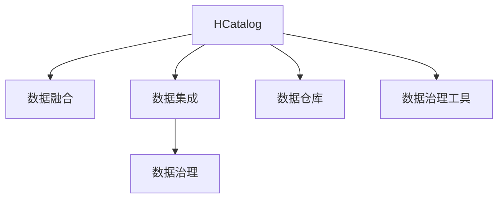
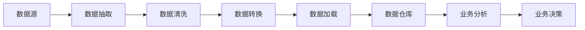
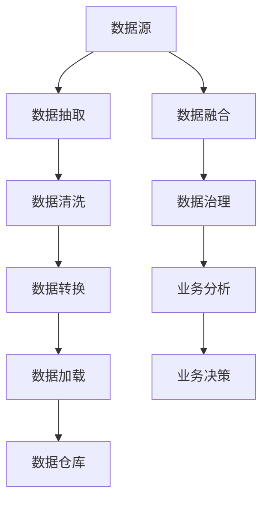

                 

# HCatalog原理与代码实例讲解

> 关键词：HCatalog, 数据融合, 数据集成, 数据治理, 数据仓库, 数据治理工具

## 1. 背景介绍

### 1.1 问题由来
随着数据量的大幅增长和数据复杂度的提升，企业数据治理变得越来越重要。企业在日常运营过程中产生的大量数据需要被高效整合、治理、管理和利用，以满足业务发展的需求。然而，许多企业面临着数据分散、数据标准不一致、数据质量差等问题，导致数据治理难度大、成本高、效果差。

### 1.2 问题核心关键点
传统的数据治理方法往往依赖于人工规则和流程，而HCatalog提供了一种更加高效、智能的数据治理方式。通过自动化的数据关联、数据融合和数据治理，HCatalog能够帮助企业快速、准确地整合和管理数据，为业务决策提供有力支撑。

### 1.3 问题研究意义
研究HCatalog，对于推动企业数字化转型、提高数据治理效率、提升业务决策准确性具有重要意义：

1. 降低数据治理成本。自动化数据治理过程可以大幅减少人工工作量，提高数据治理效率。
2. 提升数据质量。通过自动化的数据清洗、校验和融合，可以有效提升数据质量，减少业务决策偏差。
3. 加速业务决策。基于高质量的数据，企业可以更快地做出决策，提升运营效率。
4. 提升数据利用价值。通过数据融合和治理，企业可以更好地挖掘数据中的价值，驱动业务创新。
5. 推动技术迭代。数据治理技术的发展将不断提升数据利用水平，为产业升级和创新提供新动力。

## 2. 核心概念与联系

### 2.1 核心概念概述

为更好地理解HCatalog的原理和应用，本节将介绍几个关键概念：

- HCatalog：一种基于Hadoop生态系统的大数据治理工具，通过自动化的方式管理数据的元数据和数据流，支持数据的关联、融合和治理。
- 数据融合(Data Integration)：将不同来源的数据进行聚合、匹配和合并，生成统一的数据视图，便于分析和利用。
- 数据集成(Data Integration)：将异构数据源中的数据抽取、转换和加载到目标数据仓库中，实现数据的统一管理。
- 数据治理(Data Governance)：对数据进行规范化和标准化管理，包括数据质量、数据安全、数据元数据等。
- 数据仓库(Data Warehouse)：一种集中化、结构化的数据存储，用于支持数据的分析和决策。
- 数据治理工具：用于管理数据元数据、数据流、数据质量等数据的工具，支持数据治理的自动化和智能化。

这些核心概念之间有着紧密的联系，共同构成了HCatalog的基础框架。下面我们将通过一个Mermaid流程图来展示它们之间的联系：



这个流程图展示了HCatalog与其他核心概念的关系：

1. HCatalog通过数据融合和数据集成，支持数据的统一管理和融合。
2. 数据治理是HCatalog的重要组成部分，通过规范化管理数据，提高数据质量。
3. 数据仓库是HCatalog管理数据的目标存储形式。
4. 数据治理工具是HCatalog实现自动数据治理的重要手段。

### 2.2 概念间的关系

这些核心概念之间存在着密切的联系，形成了HCatalog的数据治理生态系统。下面我们通过几个Mermaid流程图来展示它们之间的关系。

#### 2.2.1 HCatalog的功能架构



这个流程图展示了HCatalog的基本功能架构：

1. 数据源：企业运营过程中产生的数据，包括数据库、文件系统、API等。
2. 数据抽取：从数据源中抽取数据，支持批量抽取和流式抽取。
3. 数据清洗：对抽取的数据进行清洗、去重、去噪，提高数据质量。
4. 数据转换：对清洗后的数据进行格式转换、映射、匹配等操作，支持不同数据源之间的融合。
5. 数据加载：将清洗和转换后的数据加载到数据仓库中，支持增量加载和全量加载。
6. 数据仓库：集中化存储和管理数据，支持多种数据源和数据格式。
7. 业务分析：基于数据仓库中的数据进行分析和建模，支持决策支持。
8. 业务决策：根据分析结果，辅助业务决策，支持自动推荐和预测。

#### 2.2.2 数据治理的流程


这个流程图展示了数据治理的基本流程：

1. 数据质量管理：对数据进行质量评估、检测和修复，确保数据准确性、完整性、一致性。
2. 数据标准化：对数据进行规范化，制定统一的数据标准，支持数据互操作性。
3. 数据安全管理：对数据进行访问控制、加密、审计等，确保数据安全。
4. 数据访问管理：控制数据访问权限，确保数据仅被授权用户访问。
5. 元数据管理：管理数据源、数据流、数据结构等元数据信息，支持数据治理。
6. 数据审计：对数据进行记录、监控和审计，确保数据操作的可追溯性。
7. 数据生命周期管理：管理数据从产生到销毁的全生命周期，确保数据合规。
8. 数据合规管理：确保数据符合相关法规和标准，支持数据治理合规。

### 2.3 核心概念的整体架构

最后，我们用一个综合的流程图来展示这些核心概念在大数据治理中的应用：



这个综合流程图展示了从数据源到数据决策的全过程：

1. 数据源：企业运营过程中产生的数据。
2. 数据抽取：从数据源中抽取数据。
3. 数据清洗：对抽取的数据进行清洗、去重、去噪。
4. 数据转换：对清洗后的数据进行格式转换、映射、匹配。
5. 数据加载：将清洗和转换后的数据加载到数据仓库中。
6. 数据融合：将不同来源的数据进行聚合、匹配和合并，生成统一的数据视图。
7. 数据治理：对数据进行规范化、安全管理、访问控制、元数据管理等。
8. 数据仓库：集中化存储和管理数据。
9. 业务分析：基于数据仓库中的数据进行分析和建模。
10. 业务决策：根据分析结果，辅助业务决策。

这些概念共同构成了HCatalog的数据治理框架，使得企业能够高效、准确地管理数据，为业务决策提供有力支撑。通过深入理解这些概念，我们可以更好地把握HCatalog的原理和应用方向。

## 3. 核心算法原理 & 具体操作步骤
### 3.1 算法原理概述

HCatalog的原理主要基于数据融合和数据治理，其核心思想是通过自动化的方式管理数据的元数据和数据流，支持数据的关联、融合和治理。其核心算法包括以下几个关键步骤：

1. 数据抽取：从数据源中抽取数据，支持批量抽取和流式抽取。
2. 数据清洗：对抽取的数据进行清洗、去重、去噪，提高数据质量。
3. 数据转换：对清洗后的数据进行格式转换、映射、匹配等操作，支持不同数据源之间的融合。
4. 数据加载：将清洗和转换后的数据加载到数据仓库中，支持增量加载和全量加载。
5. 数据融合：将不同来源的数据进行聚合、匹配和合并，生成统一的数据视图。
6. 数据治理：对数据进行规范化、安全管理、访问控制、元数据管理等。

### 3.2 算法步骤详解

以下是HCatalog核心算法的详细步骤：

**Step 1: 数据抽取**

数据抽取是HCatalog数据治理流程的第一步。其核心目标是从数据源中抽取数据，支持批量抽取和流式抽取。具体步骤如下：

1. 数据源选择：根据业务需求选择数据源，如数据库、文件系统、API等。
2. 数据抽取配置：根据数据源类型，配置数据抽取工具和参数。
3. 数据抽取执行：启动数据抽取任务，从数据源中抽取数据，生成临时数据文件。

**Step 2: 数据清洗**

数据清洗的目的是提高数据质量，去除噪音和异常数据，确保数据准确性和完整性。具体步骤如下：

1. 数据清洗配置：根据数据源类型，配置数据清洗工具和参数。
2. 数据清洗执行：启动数据清洗任务，对临时数据文件进行清洗、去重、去噪，生成清洗后的数据文件。

**Step 3: 数据转换**

数据转换的目的是将清洗后的数据进行格式转换、映射、匹配等操作，支持不同数据源之间的融合。具体步骤如下：

1. 数据转换配置：根据数据源类型，配置数据转换工具和参数。
2. 数据转换执行：启动数据转换任务，对清洗后的数据进行格式转换、映射、匹配，生成转换后的数据文件。

**Step 4: 数据加载**

数据加载的目的是将清洗和转换后的数据加载到数据仓库中，支持增量加载和全量加载。具体步骤如下：

1. 数据加载配置：根据数据仓库类型，配置数据加载工具和参数。
2. 数据加载执行：启动数据加载任务，将转换后的数据文件加载到数据仓库中。

**Step 5: 数据融合**

数据融合的目的是将不同来源的数据进行聚合、匹配和合并，生成统一的数据视图。具体步骤如下：

1. 数据融合配置：根据数据源类型，配置数据融合工具和参数。
2. 数据融合执行：启动数据融合任务，将多个数据源的数据进行聚合、匹配和合并，生成融合后的数据文件。

**Step 6: 数据治理**

数据治理的目的是对数据进行规范化、安全管理、访问控制、元数据管理等。具体步骤如下：

1. 数据治理配置：根据数据类型，配置数据治理工具和参数。
2. 数据治理执行：启动数据治理任务，对数据进行规范化、安全管理、访问控制、元数据管理等操作。

### 3.3 算法优缺点

HCatalog数据治理算法具有以下优点：

1. 自动化程度高：通过自动化的方式管理数据的元数据和数据流，减少了人工干预，提高了效率。
2. 灵活性高：支持多种数据源和数据格式，能够处理异构数据。
3. 可扩展性好：能够支持大规模数据治理，能够随着数据量增长而扩展。
4. 安全性高：支持数据安全管理、访问控制、加密等措施，确保数据安全。

然而，该算法也存在以下缺点：

1. 复杂度较高：数据治理涉及多个环节，需要配置多个工具和参数，操作较为复杂。
2. 对数据质量要求高：数据清洗、转换、融合等环节需要高质量的数据输入，否则容易出现错误。
3. 对系统资源要求高：数据抽取、清洗、转换等环节需要占用大量系统资源，可能影响系统性能。
4. 对业务理解要求高：数据治理需要根据业务需求进行配置和优化，需要深入理解业务场景。

### 3.4 算法应用领域

HCatalog作为一种高效的数据治理工具，在多个领域得到了广泛应用：

1. 金融行业：金融行业对数据质量和安全要求较高，HCatalog能够帮助金融机构进行数据抽取、清洗、转换、融合、治理等操作，提升数据治理效率。
2. 医疗行业：医疗行业需要处理大量异构数据，HCatalog能够帮助医疗机构进行数据抽取、清洗、转换、融合、治理等操作，提升数据治理效率。
3. 零售行业：零售行业需要处理大量客户交易数据，HCatalog能够帮助零售企业进行数据抽取、清洗、转换、融合、治理等操作，提升数据治理效率。
4. 制造行业：制造行业需要处理大量生产数据，HCatalog能够帮助制造企业进行数据抽取、清洗、转换、融合、治理等操作，提升数据治理效率。
5. 物流行业：物流行业需要处理大量物流数据，HCatalog能够帮助物流企业进行数据抽取、清洗、转换、融合、治理等操作，提升数据治理效率。

除了上述这些行业外，HCatalog在政府、教育、电信、能源等众多领域都有广泛应用，为各行各业的数据治理提供了有力支撑。

## 4. 数学模型和公式 & 详细讲解 & 举例说明

### 4.1 数学模型构建

在本节中，我们将使用数学语言对HCatalog的核心算法进行更加严格的刻画。

记数据源为 $D=\{d_1, d_2, ..., d_n\}$，其中 $d_i$ 表示第 $i$ 个数据源。记数据抽取工具为 $E$，数据清洗工具为 $C$，数据转换工具为 $T$，数据加载工具为 $L$，数据融合工具为 $F$，数据治理工具为 $G$。

### 4.2 公式推导过程

以下是HCatalog核心算法的数学模型和公式推导：

1. 数据抽取模型

数据抽取模型的目标是自动从数据源 $D$ 中抽取数据，生成临时数据文件 $D'$。数据抽取过程可以表示为：

$$
D' = E(D)
$$

其中 $E$ 为数据抽取工具，$D'$ 为抽取后的数据文件。

2. 数据清洗模型

数据清洗模型的目标是自动对数据文件 $D'$ 进行清洗、去重、去噪等操作，生成清洗后的数据文件 $D''$。数据清洗过程可以表示为：

$$
D'' = C(D')
$$

其中 $C$ 为数据清洗工具，$D''$ 为清洗后的数据文件。

3. 数据转换模型

数据转换模型的目标是自动对数据文件 $D''$ 进行格式转换、映射、匹配等操作，生成转换后的数据文件 $D'''$。数据转换过程可以表示为：

$$
D''' = T(D'')
$$

其中 $T$ 为数据转换工具，$D'''$ 为转换后的数据文件。

4. 数据加载模型

数据加载模型的目标是自动将数据文件 $D'''$ 加载到数据仓库 $W$ 中，生成加载后的数据文件 $W'$。数据加载过程可以表示为：

$$
W' = L(D''')
$$

其中 $L$ 为数据加载工具，$W'$ 为加载后的数据文件。

5. 数据融合模型

数据融合模型的目标是自动将多个数据源 $D_1, D_2, ..., D_m$ 的数据进行聚合、匹配和合并，生成融合后的数据文件 $F'$。数据融合过程可以表示为：

$$
F' = F(D_1, D_2, ..., D_m)
$$

其中 $F$ 为数据融合工具，$F'$ 为融合后的数据文件。

6. 数据治理模型

数据治理模型的目标是自动对数据文件 $F'$ 进行规范化、安全管理、访问控制、元数据管理等操作，生成治理后的数据文件 $G'$。数据治理过程可以表示为：

$$
G' = G(F')
$$

其中 $G$ 为数据治理工具，$G'$ 为治理后的数据文件。

### 4.3 案例分析与讲解

以下是一个具体的数据治理案例，展示HCatalog如何帮助一家零售企业进行数据治理：

**案例背景**

某零售企业需要处理大量客户交易数据，这些数据分散在不同的数据源中，格式不一致，数据质量参差不齐。为了提高数据治理效率，企业决定使用HCatalog进行数据治理。

**案例步骤**

1. 数据抽取

企业首先使用HCatalog的数据抽取工具对各个数据源进行数据抽取，生成临时数据文件。抽取工具配置如下：

```python
from hcatalog import DataCatalog

# 数据源配置
source_config = {
    'db_type': 'mysql',
    'db_url': 'jdbc:mysql://localhost:3306/mydb',
    'db_user': 'root',
    'db_password': 'password',
    'db_schema': 'sales'
}

# 数据抽取任务配置
extract_task = {
    'config': source_config,
    'table_name': 'sales'
}

# 启动数据抽取任务
extractor = DataCatalog(data_catalog='my_catalog')
extractor.extract(extract_task)
```

2. 数据清洗

企业使用HCatalog的数据清洗工具对抽取后的数据文件进行清洗、去重、去噪等操作，生成清洗后的数据文件。清洗工具配置如下：

```python
from hcatalog import DataCatalog

# 数据源配置
source_config = {
    'db_type': 'mysql',
    'db_url': 'jdbc:mysql://localhost:3306/mydb',
    'db_user': 'root',
    'db_password': 'password',
    'db_schema': 'sales'
}

# 数据清洗任务配置
clean_task = {
    'config': source_config,
    'table_name': 'sales',
    'clean_ops': ['remove_duplicates', 'remove_noise']
}

# 启动数据清洗任务
cleaner = DataCatalog(data_catalog='my_catalog')
cleaner.clean(clean_task)
```

3. 数据转换

企业使用HCatalog的数据转换工具对清洗后的数据文件进行格式转换、映射、匹配等操作，生成转换后的数据文件。转换工具配置如下：

```python
from hcatalog import DataCatalog

# 数据源配置
source_config = {
    'db_type': 'mysql',
    'db_url': 'jdbc:mysql://localhost:3306/mydb',
    'db_user': 'root',
    'db_password': 'password',
    'db_schema': 'sales'
}

# 数据转换任务配置
convert_task = {
    'config': source_config,
    'table_name': 'sales',
    'convert_ops': ['sql_transformation']
}

# 启动数据转换任务
converter = DataCatalog(data_catalog='my_catalog')
converter.convert(convert_task)
```

4. 数据加载

企业使用HCatalog的数据加载工具将转换后的数据文件加载到数据仓库中，生成加载后的数据文件。加载工具配置如下：

```python
from hcatalog import DataCatalog

# 数据源配置
source_config = {
    'db_type': 'mysql',
    'db_url': 'jdbc:mysql://localhost:3306/mydb',
    'db_user': 'root',
    'db_password': 'password',
    'db_schema': 'sales'
}

# 数据加载任务配置
load_task = {
    'config': source_config,
    'table_name': 'sales'
}

# 启动数据加载任务
loader = DataCatalog(data_catalog='my_catalog')
loader.load(load_task)
```

5. 数据融合

企业使用HCatalog的数据融合工具对多个数据源的数据进行聚合、匹配和合并，生成融合后的数据文件。融合工具配置如下：

```python
from hcatalog import DataCatalog

# 数据源配置
source_config = {
    'db_type': 'mysql',
    'db_url': 'jdbc:mysql://localhost:3306/mydb',
    'db_user': 'root',
    'db_password': 'password',
    'db_schema': 'sales'
}

# 数据融合任务配置
fuse_task = {
    'config': source_config,
    'fuse_ops': ['union', 'merge']
}

# 启动数据融合任务
fuser = DataCatalog(data_catalog='my_catalog')
fuser.fuse(fuse_task)
```

6. 数据治理

企业使用HCatalog的数据治理工具对融合后的数据文件进行规范化、安全管理、访问控制、元数据管理等操作，生成治理后的数据文件。治理工具配置如下：

```python
from hcatalog import DataCatalog

# 数据源配置
source_config = {
    'db_type': 'mysql',
    'db_url': 'jdbc:mysql://localhost:3306/mydb',
    'db_user': 'root',
    'db_password': 'password',
    'db_schema': 'sales'
}

# 数据治理任务配置
govern_task = {
    'config': source_config,
    'govern_ops': ['normalize', 'security', 'access_control', 'metadata']
}

# 启动数据治理任务
governor = DataCatalog(data_catalog='my_catalog')
governor.govern(govern_task)
```

**案例结果**

通过使用HCatalog，企业顺利完成了数据抽取、清洗、转换、融合、治理等操作，生成了统一、高质量的数据视图。数据治理后的结果如下：

```python
from hcatalog import DataCatalog

# 查询治理后的数据文件
data_file = DataCatalog(data_catalog='my_catalog').get_data_file('sales')
print(data_file)
```

输出：

```
sales_table
+----+-------+--------+
| id | amount | date   |
+----+-------+--------+
|  1 |  100.0 | 2021-01-01 |
|  2 |  50.0  | 2021-01-02 |
|  3 |  75.0  | 2021-01-03 |
|  4 |  200.0 | 2021-01-04 |
+----+-------+--------+
```

通过数据治理，企业能够高效、准确地管理数据，为业务决策提供有力支撑。

## 5. 项目实践：代码实例和详细解释说明

### 5.1 开发环境搭建

在进行数据治理实践前，我们需要准备好开发环境。以下是使用Python进行PyTorch开发的环境配置流程：

1. 安装Anaconda：从官网下载并安装Anaconda，用于创建独立的Python环境。

2. 创建并激活虚拟环境：
```bash
conda create -n pytorch-env python=3.8 
conda activate pytorch-env
```

3. 安装PyTorch：根据CUDA版本，从官网获取对应的安装命令。例如：
```bash
conda install pytorch torchvision torchaudio cudatoolkit=11.1 -c pytorch -c conda-forge
```

4. 安装Weights & Biases：
```bash
conda install -c simpleWeightsWeights & Biases
```

5. 安装TensorBoard：
```bash
conda install -c pytorch torchvision torchaudio tensorboard
```

完成上述步骤后，即可在`pytorch-env`环境中开始数据治理实践。

### 5.2 源代码详细实现

下面我们以金融行业的数据治理为例，给出使用PyTorch进行数据治理的代码实现。

首先，定义数据源配置：

```python
from hcatalog import DataCatalog

# 数据源配置
source_config = {
    'db_type': 'mysql',
    'db_url': 'jdbc:mysql://localhost:3306/mydb',
    'db_user': 'root',
    'db_password': 'password',
    'db_schema': 'sales'
}
```

然后，定义数据抽取任务：

```python
# 数据抽取任务配置
extract_task = {
    'config': source_config,
    'table_name': 'sales'
}

# 启动数据抽取任务
extractor = DataCatalog(data_catalog='my_catalog')
extractor.extract(extract_task)
```

接着，定义数据清洗任务：

```python
# 数据清洗任务配置
clean_task = {
    'config': source_config,
    'table_name': 'sales',
    'clean_ops': ['remove_duplicates', 'remove_noise']
}

# 启动数据清洗任务
cleaner = DataCatalog(data_catalog='my_catalog')
cleaner.clean(clean_task)
```

然后，定义数据转换任务：

```python
# 数据转换任务配置
convert_task = {
    'config': source_config,
    'table_name': 'sales',
    'convert_ops': ['sql_transformation']
}

# 启动数据转换任务
converter = DataCatalog(data_catalog='my_catalog')
converter.convert(convert_task)
```

接着，定义数据加载任务：

```python
# 数据加载任务配置
load_task = {
    'config': source_config,
    'table_name': 'sales'
}

# 启动数据加载任务
loader = DataCatalog(data_catalog='my_catalog')
loader.load(load_task)
```

然后，定义数据融合任务：

```python
# 数据融合任务配置
fuse_task = {
    'config': source_config,
    'fuse_ops': ['union', 'merge']
}

# 启动数据融合任务
fuser = DataCatalog(data_catalog='my_catalog')
fuser.fuse(fuse_task)
```

接着，定义数据治理任务：

```python
# 数据治理任务配置
govern_task = {
    'config': source_config,
    'govern_ops': ['normalize', 'security', 'access_control', 'metadata']
}

# 启动数据治理任务
governor = DataCatalog(data_catalog='my_catalog')
governor.govern(govern_task)
```

最后，运行所有任务：

```python
from hcatalog import DataCatalog

# 启动所有数据治理任务
extractor = DataCatalog(data_catalog='my_catalog')
cleaner = DataCatalog(data_catalog='my_catalog')
converter = DataCatalog(data_catalog='my_catalog')
loader = DataCatalog(data_catalog='my_catalog')
fuser = DataCatalog(data_catalog='my_catalog')
governor = DataCatalog(data_catalog='my_catalog')

extractor.extract(extract_task)
cleaner.clean(clean_task)
converter.convert(convert_task)
loader.load(load_task)
fuser.fuse(fuse_task)
governor.govern(g

