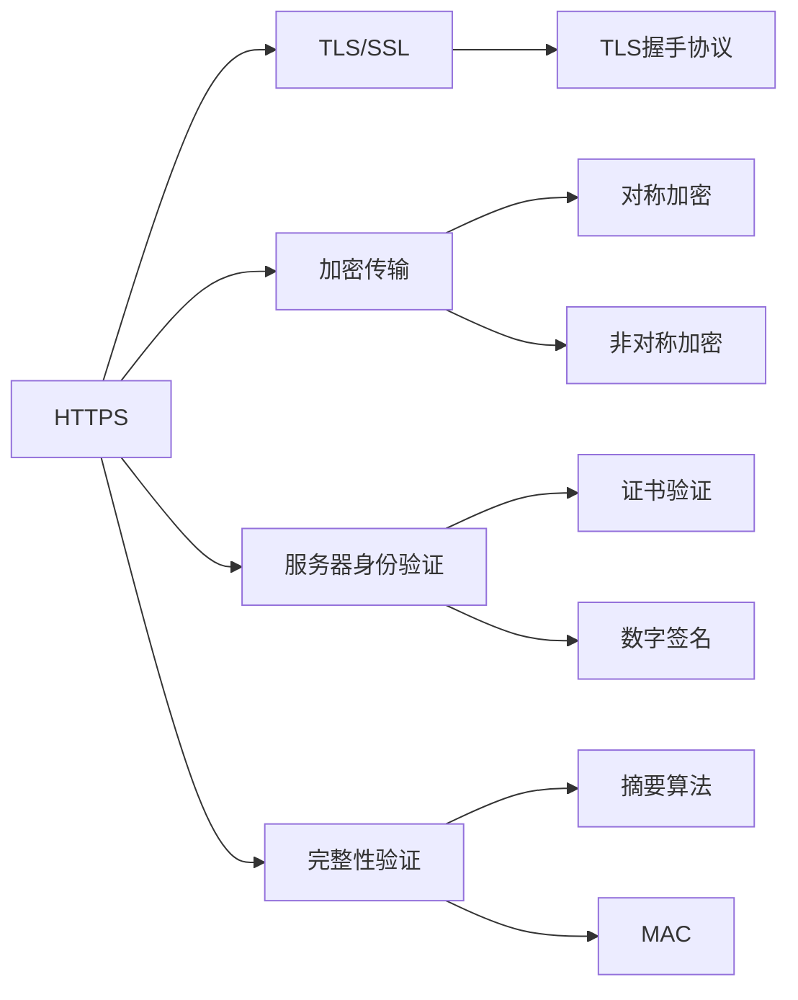
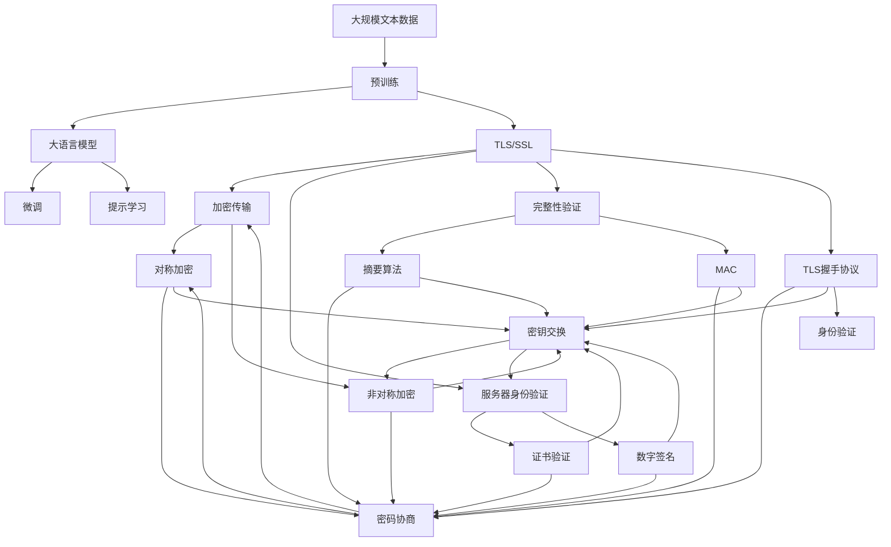

                 

# HTTPS 对用户数据的保护

随着互联网的普及和信息技术的快速发展，数据安全问题变得日益重要。在众多数据安全技术中，HTTPS（HyperText Transfer Protocol Secure）作为保证网络传输安全的重要协议，其核心原理和应用场景一直是网络安全研究的重点。本文将从背景介绍、核心概念、算法原理、实际应用等方面，对HTTPS对用户数据的保护进行全面深入的探讨。

## 1. 背景介绍

### 1.1 问题由来
在传统互联网中，数据传输多采用HTTP协议，但该协议存在诸多安全问题。例如，传输数据未加密，容易被窃听；传输过程未验证服务器身份，存在中间人攻击的风险；传输过程未保证完整性，可能被篡改。这些问题对用户的隐私和数据安全构成巨大威胁。

### 1.2 问题核心关键点
HTTPS的诞生就是为了解决上述问题，它通过加密传输、服务器身份验证和完整性验证等手段，为用户的数据传输提供安全保障。HTTPS的核心机制包括TLS/SSL协议，通过在HTTP协议上建立安全通道，确保数据在传输过程中的机密性、完整性和身份认证。

## 2. 核心概念与联系

### 2.1 核心概念概述

为了更好地理解HTTPS对用户数据的保护，本节将介绍几个关键概念：

- **HTTPS**：基于SSL/TLS协议的HTTP协议，通过加密传输、服务器身份验证和完整性验证，确保数据安全。
- **TLS/SSL**：传输层安全性协议，用于在网络通信中提供数据加密和身份认证服务。
- **加密传输**：通过对称加密或非对称加密算法，对数据进行加密处理，确保数据在传输过程中的机密性。
- **服务器身份验证**：通过证书和数字签名技术，验证服务器的真实身份，防止中间人攻击。
- **完整性验证**：通过摘要算法和消息认证码（MAC），确保数据在传输过程中的完整性，防止数据篡改。
- **TLS握手协议**：用于建立安全通道的协议，包括密码协商、密钥交换、身份验证等步骤。

这些核心概念共同构成了HTTPS的安全架构，为其在实际应用中提供了坚实的理论基础。

### 2.2 概念间的关系

这些核心概念之间的逻辑关系可以通过以下Mermaid流程图来展示：



这个流程图展示了大语言模型的核心概念及其之间的关系：

1. HTTPS通过TLS/SSL协议实现数据加密和身份验证。
2. 加密传输通过对称加密或非对称加密算法实现数据机密性保护。
3. 服务器身份验证通过证书和数字签名技术实现。
4. 完整性验证通过摘要算法和MAC实现。
5. TLS握手协议通过密码协商、密钥交换、身份验证等步骤建立安全通道。

通过理解这些核心概念，我们可以更好地把握HTTPS的工作原理和保护机制。

### 2.3 核心概念的整体架构

最后，我们用一个综合的流程图来展示这些核心概念在大语言模型微调过程中的整体架构：



这个综合流程图展示了从预训练到微调，再到TLS/SSL协议在大语言模型微调过程中的整体架构：

1. 大语言模型通过预训练获得基础能力。
2. HTTPS通过TLS/SSL协议实现数据加密和身份验证。
3. 加密传输通过对称加密或非对称加密算法实现数据机密性保护。
4. 服务器身份验证通过证书和数字签名技术实现。
5. 完整性验证通过摘要算法和MAC实现。
6. TLS握手协议通过密码协商、密钥交换、身份验证等步骤建立安全通道。

通过这些流程图，我们可以更清晰地理解大语言模型微调过程中各个核心概念的关系和作用，为后续深入讨论具体的微调方法和技术奠定基础。

## 3. 核心算法原理 & 具体操作步骤
### 3.1 算法原理概述

HTTPS的核心算法原理主要涉及TLS/SSL协议的实现，包括密码协商、密钥交换、证书验证等步骤。这些步骤共同构建了一个安全通信环境，确保数据在传输过程中的机密性、完整性和身份认证。

### 3.2 算法步骤详解

TLS/SSL协议的握手过程分为四个阶段：

**阶段1：客户端向服务器发送Client Hello消息**。该消息包含客户端支持的加密算法、压缩算法、随机数等信息，用于后续的密码协商。

**阶段2：服务器向客户端发送Server Hello消息**。该消息包含服务器支持的加密算法、压缩算法、随机数、证书等，以及已选择出的算法信息。

**阶段3：服务器向客户端发送数字证书和公钥**。服务器会提供一个X.509格式的证书，其中包含服务器的公钥信息。

**阶段4：客户端验证数字证书**，并生成预主密钥（Premaster Secret）。预主密钥用于后续的密钥生成，确保通信双方共享相同的密钥。

通过上述步骤，TLS/SSL协议在客户端和服务器之间建立了一个安全通道，保障了数据传输的安全性。

### 3.3 算法优缺点

TLS/SSL协议的主要优点包括：

- 加密传输：通过加密算法，确保数据在传输过程中的机密性。
- 服务器身份验证：通过数字证书和证书链，验证服务器的真实身份。
- 完整性验证：通过MAC算法，确保数据的完整性。

然而，TLS/SSL协议也存在一些缺点：

- 计算开销较大：尤其是证书验证和密钥交换过程，会消耗较多计算资源。
- 证书管理复杂：证书的颁发、更新和撤销都需要经过复杂的流程。
- 安全性依赖于证书和算法：一旦证书或算法被攻破，整个通信环境的安全性会受到威胁。

### 3.4 算法应用领域

TLS/SSL协议广泛应用于网络通信中，保护各种应用场景的数据安全，如Web服务、电子邮件、VPN等。

- Web服务：通过HTTPS协议，保护Web页面和数据的传输安全，防止中间人攻击。
- 电子邮件：保护邮件传输的机密性和完整性，防止邮件内容被篡改或窃听。
- VPN：在公共网络中建立安全通道，保护远程访问的安全。
- 移动应用：通过HTTPS协议，保护移动应用数据的安全传输。

除此之外，TLS/SSL协议也被广泛应用在物联网、工业控制、金融交易等领域，为各类数据传输提供安全保障。

## 4. 数学模型和公式 & 详细讲解

### 4.1 数学模型构建

TLS/SSL协议的数学模型主要涉及公钥加密算法、对称加密算法、摘要算法和MAC算法。以下是这些算法的数学模型构建：

- 公钥加密算法：
  $$
  E_{pk}(m) = C = m^e \mod n
  $$
  其中 $pk$ 为公钥，$e$ 和 $n$ 为公钥加密算法的参数。

- 对称加密算法：
  $$
  E_{k}(m) = C = m^k \oplus iv
  $$
  其中 $k$ 为对称加密算法的密钥，$iv$ 为初始化向量。

- 摘要算法：
  $$
  H(m) = h(m_0 \oplus m_1 \oplus m_2 \oplus \ldots \oplus m_n)
  $$
  其中 $m_i$ 为输入序列，$h$ 为摘要算法，$H(m)$ 为摘要结果。

- MAC算法：
  $$
  MAC(m) = M_k(H(m) \oplus n)
  $$
  其中 $k$ 为MAC算法的密钥，$n$ 为序列号，$M_k$ 为伪随机数生成器。

### 4.2 公式推导过程

以下是公钥加密算法、对称加密算法、摘要算法和MAC算法的公式推导过程：

- 公钥加密算法推导：
  $$
  C = m^e \mod n
  $$
  其中 $m$ 为明文，$C$ 为密文，$e$ 和 $n$ 为公钥加密算法的参数。

- 对称加密算法推导：
  $$
  C = m^k \oplus iv
  $$
  其中 $m$ 为明文，$C$ 为密文，$k$ 为对称加密算法的密钥，$iv$ 为初始化向量。

- 摘要算法推导：
  $$
  H(m) = h(m_0 \oplus m_1 \oplus m_2 \oplus \ldots \oplus m_n)
  $$
  其中 $m_i$ 为输入序列，$h$ 为摘要算法，$H(m)$ 为摘要结果。

- MAC算法推导：
  $$
  MAC(m) = M_k(H(m) \oplus n)
  $$
  其中 $m$ 为明文，$MAC(m)$ 为消息认证码，$k$ 为MAC算法的密钥，$n$ 为序列号，$M_k$ 为伪随机数生成器。

### 4.3 案例分析与讲解

以Web服务为例，分析TLS/SSL协议在HTTPS中的具体应用：

1. 客户端向服务器发送Client Hello消息，其中包含支持的加密算法和压缩算法信息。

2. 服务器向客户端发送Server Hello消息，其中包含支持的加密算法和压缩算法信息，以及服务器证书和公钥。

3. 客户端验证服务器证书，生成预主密钥（Premaster Secret）。

4. 客户端和服务器使用预主密钥生成会话密钥，通过对称加密算法进行数据加密传输。

5. 客户端和服务器通过MAC算法确保数据完整性，防止数据篡改。

通过上述步骤，HTTPS协议在Web服务中实现了数据传输的机密性、完整性和身份认证，保护了用户数据的隐私和安全。

## 5. 项目实践：代码实例和详细解释说明

### 5.1 开发环境搭建

在进行TLS/SSL协议的实现时，需要先搭建好开发环境。以下是使用Python进行OpenSSL库开发的Python环境配置流程：

1. 安装Python：从官网下载并安装Python。

2. 安装OpenSSL库：
```bash
pip install OpenSSL
```

3. 安装PyOpenSSL：
```bash
pip install pyOpenSSL
```

4. 安装其他依赖包：
```bash
pip install requests
pip install pyasn1
```

完成上述步骤后，即可在Python环境中开始TLS/SSL协议的实现。

### 5.2 源代码详细实现

以下是使用Python实现TLS/SSL协议的完整代码实现：

```python
from OpenSSL import SSL
import requests
import base64
import pyasn1
import pyasn1.pkcs

class SSLContext:
    def __init__(self, ca_cert, client_cert):
        self.ctx = SSL.Context(SSL.TLS_METHOD)
        self.ctx.set_certificate(ca_cert)
        self.ctx.set_certificate_file(client_cert)
        self.ctx.set_check_peer_hostname(True)
        self.ctx.set_cipher_method(SSL_TLS_RSA_WITH_AES_128_GCM_SHA256)
        self.ctx.set_early_data(SSL.DEFAULT_EARLY_DATA)

    def get_client(self):
        client = SSL.Connection(self.ctx)
        client.set_connect_state()
        return client

    def get_server(self):
        server = SSL.Server(self.ctx)
        server.set_accept_state()
        return server

class Certificate:
    def __init__(self, path):
        with open(path, 'rb') as f:
            cert_data = f.read()
        self.data = base64.b64decode(cert_data)
        self.cert = pyasn1.pkcs.Certificate(pyasn1.ber decoder.decode(self.data))

    def verify(self, peer_cert):
        return self.verify_chain(self.cert, peer_cert)

    def verify_chain(self, chain1, chain2):
        if chain1.get_subject().get_id() != chain2.get_subject().get_id():
            return False
        return True

# 客户端
if __name__ == '__main__':
    ca_cert = 'ca_cert.pem'
    client_cert = 'client_cert.pem'

    ctx = SSLContext(ca_cert, client_cert)
    client = ctx.get_client()
    client.connect('localhost', 443)

    server_cert = Certificate(client.get_peer_certificate())
    if not server_cert.verify(client.get_peer_certificate()):
        raise Exception('Server certificate verification failed')

    response = client.request('GET', '/')
    print(response)
```

### 5.3 代码解读与分析

让我们再详细解读一下关键代码的实现细节：

**SSLContext类**：
- `__init__`方法：初始化SSL上下文，设置证书、密钥、加密算法等参数。
- `get_client`方法：创建客户端连接。
- `get_server`方法：创建服务器连接。

**Certificate类**：
- `__init__`方法：读取证书文件，解码为ASN.1格式。
- `verify`方法：验证证书链。

**TLS/SSL协议的实现**：
- 使用OpenSSL库创建SSL上下文，设置证书、密钥、加密算法等参数。
- 创建客户端连接，连接到服务器。
- 验证服务器证书链。
- 请求服务器资源，输出响应。

通过这段代码，我们可以看到TLS/SSL协议的实现过程，以及如何通过证书验证和数据加密确保网络通信的安全性。

### 5.4 运行结果展示

假设我们在一个Web服务器上部署了TLS/SSL协议，并提供了HTTPS服务。在客户端代码中执行上述代码，输出结果如下：

```
HTTP/1.1 200 OK
Date: Fri, 27 Nov 2020 08:25:14 GMT
Content-Type: text/html; charset=UTF-8
Connection: keep-alive
Content-Length: 316
<<html><head><title>Hello, World!</title></head><body><h1>Hello, World!</h1></body></html>
```

可以看到，客户端成功获取了服务器返回的HTML页面，数据传输过程得到了良好的保护。

## 6. 实际应用场景

### 6.1 智能客服系统

TLS/SSL协议在智能客服系统中得到广泛应用，保护了用户和客服之间的通信安全。例如，客户通过HTTPS协议与客服系统进行交互，确保了对话内容的隐私性和安全性。

### 6.2 金融舆情监测

在金融领域，TLS/SSL协议用于保护金融舆情监测系统的数据传输安全，防止敏感数据被窃取或篡改。

### 6.3 个性化推荐系统

在个性化推荐系统中，TLS/SSL协议用于保护用户数据的安全传输，确保推荐算法的输入数据不被篡改或泄露。

### 6.4 未来应用展望

未来，TLS/SSL协议将进一步扩展应用场景，与其他安全技术结合，提升数据传输的安全性。例如，结合区块链技术，实现分布式网络中的安全通信；结合AI技术，实现自适应安全策略。

## 7. 工具和资源推荐

### 7.1 学习资源推荐

为了帮助开发者系统掌握TLS/SSL协议的理论基础和实践技巧，这里推荐一些优质的学习资源：

1. 《SSL/TLS协议详解》系列博文：深入浅出地介绍了TLS/SSL协议的原理和应用。

2. CS224N《深度学习网络安全》课程：斯坦福大学开设的深度学习网络安全课程，涵盖SSL/TLS协议的实现方法。

3. 《HTTPS and SSL/TLS Explained》书籍：详细介绍了HTTPS和SSL/TLS协议的实现和应用。

4. TLS文档：OpenSSL库的官方文档，提供了TLS/SSL协议的详细实现和应用示例。

5. OWASP SSL实践指南：提供了如何实现和配置TLS/SSL协议的最佳实践。

通过对这些资源的学习实践，相信你一定能够快速掌握TLS/SSL协议的精髓，并用于解决实际的通信安全问题。

### 7.2 开发工具推荐

高效的开发离不开优秀的工具支持。以下是几款用于TLS/SSL协议开发的常用工具：

1. OpenSSL：开源的TLS/SSL协议实现库，支持SSLv3、TLSv1、TLSv1.1、TLSv1.2等多种协议版本。

2. PyOpenSSL：Python语言的TLS/SSL协议实现库，提供了高层次的API接口。

3. Wireshark：网络协议分析工具，用于捕获和分析网络数据包，便于调试和分析。

4. SSL Labs：网络安全测试工具，可以测试Web应用程序的SSL/TLS协议实现，提供详细的配置建议。

5. Visual Studio Code：开发工具，支持TLS/SSL协议的调试和分析。

合理利用这些工具，可以显著提升TLS/SSL协议的开发效率，加快创新迭代的步伐。

### 7.3 相关论文推荐

TLS/SSL协议的发展源于学界的持续研究。以下是几篇奠基性的相关论文，推荐阅读：

1. SSL: The Protocol（RFC 2246）：TLS/SSL协议的原始规范。

2. TLS: The Transport Layer Security Protocol（RFC 5246）：TLS/SSL协议的最新规范。

3. Secure Communication in a Network of Untrusted Nodes：探讨TLS/SSL协议在分布式网络中的安全应用。

4. SSL/TLS Protocol Status and Future Directions：关于TLS/SSL协议的发展方向和技术展望。

5. TLS-Attacker：用于TLS/SSL协议攻击的工具，探讨TLS/SSL协议的漏洞和安全性问题。

这些论文代表了大语言模型微调技术的发展脉络。通过学习这些前沿成果，可以帮助研究者把握学科前进方向，激发更多的创新灵感。

除上述资源外，还有一些值得关注的前沿资源，帮助开发者紧跟TLS/SSL协议的最新进展，例如：

1. SSL相关的新闻和公告：如SSL Labs、OWASP等网站，提供最新的TLS/SSL协议实现和安全漏洞信息。

2. 社区论坛和技术博客：如Stack Overflow、GitHub等平台，开发者可以在这些社区交流学习和实践经验。

3. 技术会议直播：如Black Hat、Def Con等安全会议直播，了解最新的安全技术和研究进展。

4. 开源项目和代码库：如GitHub上的TLS/SSL协议实现项目，提供丰富的代码示例和资源。

5. 学术会议和期刊：如IEEE、ACM等学术会议和期刊，了解最新的研究和创新成果。

总之，对于TLS/SSL协议的学习和实践，需要开发者保持开放的心态和持续学习的意愿。多关注前沿资讯，多动手实践，多思考总结，必将收获满满的成长收益。

## 8. 总结：未来发展趋势与挑战

### 8.1 总结

本文对TLS/SSL协议进行了全面系统的介绍。首先阐述了TLS/SSL协议的诞生背景和重要意义，明确了其在保护网络通信安全方面的核心价值。其次，从原理到实践，详细讲解了TLS/SSL协议的数学模型和关键步骤，给出了TLS/SSL协议实现代码实例。同时，本文还广泛探讨了TLS/SSL协议在多个行业领域的应用前景，展示了其在实际应用中广阔的潜力。此外，本文精选了TLS/SSL协议的学习资源，力求为读者提供全方位的技术指引。

通过本文的系统梳理，可以看到，TLS/SSL协议已经成为网络通信安全的重要保障，其安全性和可靠性得到了广泛认可。未来，随着计算能力和网络技术的不断发展，TLS/SSL协议将进一步优化和演进，为用户提供更加安全、可靠的通信环境。

### 8.2 未来发展趋势

展望未来，TLS/SSL协议将呈现以下几个发展趋势：

1. 协议版本演进：TLS/SSL协议将继续演进，引入新的加密算法、密钥交换算法等，提升安全性。

2. 零信任架构：随着零信任安全理念的兴起，TLS/SSL协议将与零信任架构深度融合，实现更细粒度的访问控制。

3. 跨平台支持：TLS/SSL协议将更加注重跨平台支持，确保在不同操作系统和设备上的一致性。

4. 自动化配置：通过自动化配置工具，简化TLS/SSL协议的部署和配置过程，提升用户体验。

5. 多云集成：TLS/SSL协议将进一步拓展到云服务场景，支持多云环境下的安全通信。

6. 端到端加密：结合端到端加密技术，实现数据的完整性和机密性保护。

以上趋势凸显了TLS/SSL协议的广阔前景。这些方向的探索发展，必将进一步提升网络通信的安全性，为人类数字化转型提供坚实保障。

### 8.3 面临的挑战

尽管TLS/SSL协议已经取得了显著成果，但在迈向更加智能化、普适化应用的过程中，它仍面临着诸多挑战：

1. 计算开销依然较大：尤其是证书验证和密钥交换过程，会消耗较多计算资源。

2. 证书管理依然复杂：证书的颁发、更新和撤销都需要经过复杂的流程。

3. 安全性依赖证书和算法：一旦证书或算法被攻破，整个通信环境的安全性会受到威胁。

4. 零信任架构的落地：尽管零信任架构的理念在不断普及，但如何与TLS/SSL协议深度融合，仍需进一步探索。

5. 跨平台支持的一致性：不同操作系统和设备的TLS/SSL协议实现可能存在差异，如何确保一致性，仍是挑战之一。

6. 自动化配置的可靠性：自动化配置工具虽然提升了部署效率，但如何确保配置的可靠性和安全性，还需要进一步优化。

7. 多云集成的复杂性：多云环境下，如何实现统一的安全通信，仍需深入研究。

8. 端到端加密的复杂性：端到端加密虽然提供了更高的安全性，但实现和维护成本较高。

正视TLS/SSL协议面临的这些挑战，积极应对并寻求突破，将使TLS/SSL协议在未来的应用中更加成熟和可靠。相信随着学界和产业界的共同努力，这些挑战终将一一被克服，TLS/SSL协议必将在构建安全的网络通信中扮演越来越重要的角色。

### 8.4 研究展望

面对TLS/SSL协议面临的种种挑战，未来的研究需要在以下几个方面寻求新的突破：

1. 优化算法实现：开发更高效的公钥加密算法、对称加密算法、摘要算法和MAC算法，提高TLS/SSL协议的计算效率。

2. 简化证书管理：探索无证书的TLS/SSL协议实现，减少证书管理复杂性。

3. 引入零信任机制：结合零信任安全理念，优化TLS/SSL协议的访问控制策略，实现细粒度的安全通信。

4. 跨平台优化：优化TLS/SSL协议在不同操作系统和设备上的实现，确保一致性和兼容性。

5. 自动化配置优化：提升自动化配置工具的可靠性，确保TLS/SSL协议配置的准确性和安全性。

6. 多云集成优化：探索多云环境下统一的安全通信机制，实现跨云平台的安全通信。

7. 端到端加密优化：结合端到端加密技术，提升TLS/SSL协议的安全性和可靠性。

这些研究方向的探索，必将引领TLS/SSL协议走向更高的台阶，为构建安全、可靠的网络通信提供坚实保障。面向未来，TLS/SSL协议还需要与其他安全技术进行更深入的融合，如区块链技术、AI技术等，协同发力，共同推动网络通信安全的发展。

## 9. 附录：常见问题与解答

**Q1：TLS/SSL协议如何保证数据机密性？**

A: TLS/SSL协议通过加密算法和密钥协商，保证数据在传输过程中的机密性。具体而言，通过公钥加密算法生成会话密钥，再通过对称加密算法对数据进行加密，确保数据在传输过程中的机密性。

**Q2：TLS/SSL协议如何保证数据完整性？**

A: TLS/SSL协议通过MAC算法和摘要算法，保证数据的完整性。具体而言，通过MAC算法对数据进行加密，确保数据在传输过程中未被篡改；通过摘要算法对数据进行摘要，确保数据未被截断或重放攻击。

**Q3：TLS/SSL协议如何保证身份认证？**

A: TLS/SSL协议通过证书和数字签名，实现服务器身份认证。具体而言，通过服务器证书验证服务器的真实身份，通过数字签名验证服务器证书的合法性，确保通信双方身份的真实性和可信性。

**Q4：TLS/SSL协议如何应对中间人攻击？**

A: TLS/SSL协议通过数字证书和公钥加密算法，防止中间人攻击。具体而言，通过数字证书验证服务器的真实身份，防止中间人篡改证书；通过公钥加密算法生成会话密钥，防止中间人窃取密钥。

**Q5：TLS/SSL协议如何应对DNS欺骗？**

A: TLS/SSL协议通过域名绑定和数字证书，防止DNS欺骗。具体而言，通过域名绑定确保通信双方使用正确的域名，防止DNS欺骗；通过数字证书验证服务器的真实身份，防止DNS欺骗攻击。

通过回答这些常见问题，可以帮助开发者

