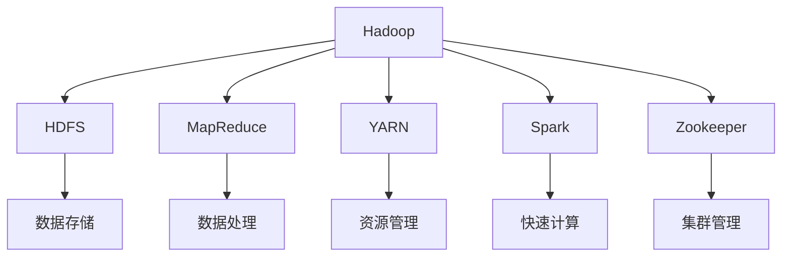
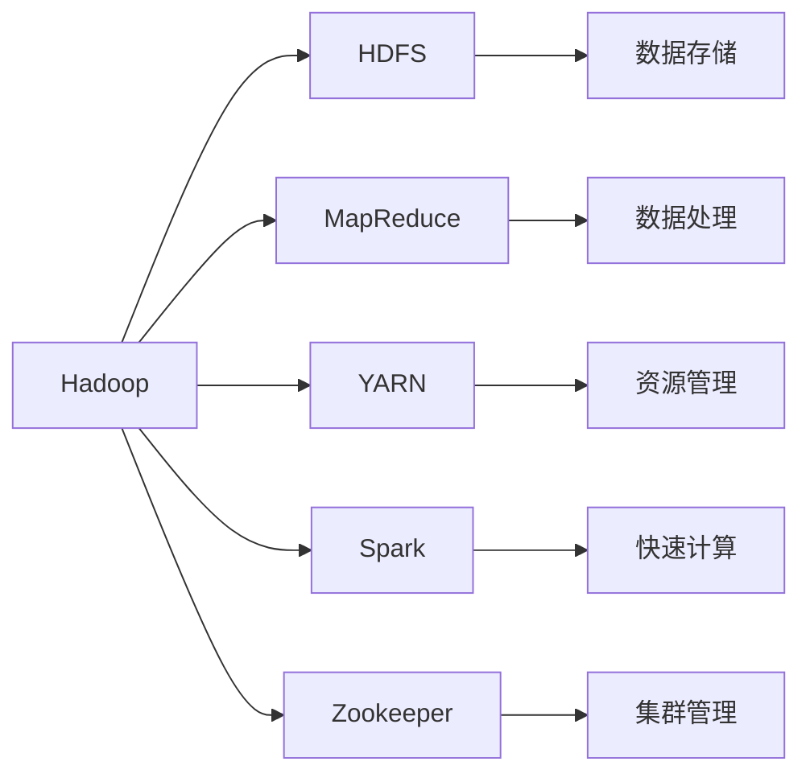
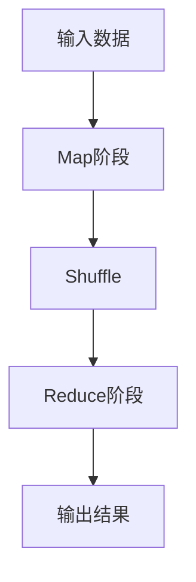
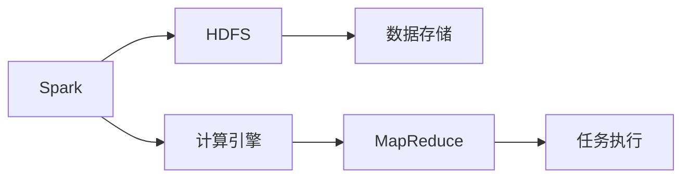
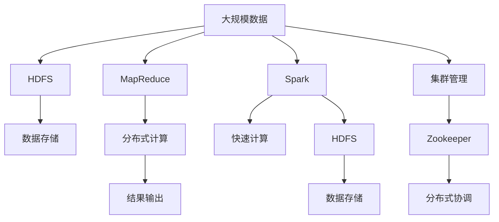

                 

# Hadoop原理与代码实例讲解

> 关键词：Hadoop, MapReduce, HDFS, YARN, Spark

## 1. 背景介绍

### 1.1 问题由来
随着互联网的普及和大数据时代的到来，海量数据的高速增长和存储问题成为了企业和研究机构面临的重要挑战。为了解决这些问题，Hadoop作为一个开源的分布式计算框架，应运而生。Hadoop项目由Apache软件基金会主导开发，通过其核心组件HDFS和MapReduce，帮助用户高效存储和处理海量数据。

### 1.2 问题核心关键点
Hadoop的核心思想是通过分布式计算，将大规模数据存储和处理任务分解成多个小任务，分别在不同的节点上并行执行。HDFS负责数据存储和分配，而MapReduce负责数据计算和处理。这些组件通过合理的设计和协调工作，可以在大规模集群上实现高效的数据处理和存储。

### 1.3 问题研究意义
研究Hadoop及其相关技术，对于推动大数据技术的发展和应用具有重要意义：

1. 降低数据存储和处理的成本。Hadoop可以高效利用廉价的硬件设备，降低大规模数据存储和处理的技术门槛。
2. 提升数据处理效率。通过分布式计算和并行处理，Hadoop能够显著提升数据处理的效率，缩短分析时间。
3. 增强数据安全性。Hadoop提供了冗余存储和数据复制功能，确保数据的可靠性和安全性。
4. 推动大数据应用创新。Hadoop为众多大数据应用场景提供了基础平台，如数据挖掘、机器学习、商业智能等。
5. 促进产业升级。Hadoop技术的应用，为各行各业提供了数据驱动的决策支持，促进了产业的数字化转型。

## 2. 核心概念与联系

### 2.1 核心概念概述

为更好地理解Hadoop的核心技术和架构，本节将介绍几个密切相关的核心概念：

- Hadoop：Apache Hadoop项目，是一个用于大规模数据存储和处理的开源框架。
- HDFS（Hadoop Distributed File System）：Hadoop的分布式文件系统，用于高效存储和管理大规模数据。
- MapReduce：一种分布式并行计算模型，用于大规模数据处理和分析。
- YARN（Yet Another Resource Negotiator）：Hadoop的资源管理系统，负责任务调度和资源分配。
- Spark：一个快速、通用的大数据计算引擎，兼容Hadoop生态，提供了更高的计算性能和灵活性。
- Zookeeper：Hadoop的分布式协调服务，用于集群管理和协同工作。

这些核心概念之间的逻辑关系可以通过以下Mermaid流程图来展示：



这个流程图展示了大规模数据处理中的各个核心概念及其之间的关系：

1. Hadoop作为一个整体框架，由HDFS、MapReduce、YARN、Spark等组件共同支撑。
2. HDFS负责大规模数据存储，MapReduce负责数据处理，两者是Hadoop的核心组件。
3. YARN负责资源管理和任务调度，确保集群的高效运行。
4. Spark作为Hadoop的补充，提供了更高的计算性能和灵活性。
5. Zookeeper用于集群管理和协同工作，确保各组件之间的协作。

### 2.2 概念间的关系

这些核心概念之间存在着紧密的联系，形成了Hadoop分布式计算的整体生态系统。下面我们通过几个Mermaid流程图来展示这些概念之间的关系。

#### 2.2.1 Hadoop的整体架构



这个流程图展示了Hadoop作为一个整体框架，由HDFS、MapReduce、YARN、Spark等组件共同支撑。

#### 2.2.2 MapReduce的计算模型



这个流程图展示了MapReduce的计算模型：输入数据经过Map阶段映射为中间结果，再通过Shuffle过程将结果归并，最后在Reduce阶段进行聚合输出。

#### 2.2.3 YARN的资源管理


这个流程图展示了YARN的资源管理过程：应用提交到资源管理器，再由调度器分配到合适的节点上执行，任务执行器负责具体的任务处理。

#### 2.2.4 Spark与Hadoop的交互



这个流程图展示了Spark与Hadoop的交互：Spark通过与HDFS集成，实现高效的数据处理，计算过程依赖于MapReduce进行分布式计算。

### 2.3 核心概念的整体架构

最后，我们用一个综合的流程图来展示这些核心概念在大规模数据处理中的整体架构：



这个综合流程图展示了从数据存储、计算、输出到集群管理的完整过程。通过Hadoop的各个组件之间的协同工作，能够高效地存储、计算和处理大规模数据。

## 3. 核心算法原理 & 具体操作步骤
### 3.1 算法原理概述

Hadoop的MapReduce计算模型基于分布式并行计算，其核心思想是将大规模数据处理任务分解为多个小任务，并行执行，最终将各个子任务的结果汇总为全局结果。

形式化地，假设大规模数据集为 $D$，将其划分为 $N$ 个分片 $D_1, D_2, ..., D_N$，在 $M$ 个计算节点上并行执行。MapReduce的计算过程如下：

1. 数据分配：将每个分片 $D_i$ 分配给计算节点 $C_j$，每个节点对应一个分片。
2. Map阶段：在每个节点上，对分配到的分片进行Map操作，将每个数据点映射为多个键值对。
3. Shuffle阶段：将Map阶段产生的中间结果按照键进行排序和归并，确保每个键的子元素在同一节点上。
4. Reduce阶段：在每个节点上，对Shuffle后的结果进行Reduce操作，合并相同键的子元素，生成最终结果。

整个MapReduce计算过程可以通过以下伪代码表示：

```python
# 定义Map函数
def map(key, value):
    # 对每个数据点进行Map操作
    for key, value in data.items():
        # 将数据点映射为键值对
        emit(key, value)

# 定义Reduce函数
def reduce(key, values):
    # 对相同键的子元素进行Reduce操作
    result = 0
    for value in values:
        result += value
    # 生成最终结果
    emit(key, result)

# 主函数
def main(data):
    # 数据分配
    split_data = split(data)
    # 并行Map操作
    map_result = parallel_map(map, split_data)
    # Shuffle和Reduce操作
    reduce_result = reduce(map_result)
    # 输出结果
    print(reduce_result)
```

### 3.2 算法步骤详解

以下详细描述Hadoop的MapReduce计算过程和具体步骤：

**Step 1: 数据预处理**
- 将大规模数据集 $D$ 划分为若干个大小相等的分片 $D_1, D_2, ..., D_N$。
- 将分片分配到计算节点 $C_1, C_2, ..., C_M$，每个节点对应一个分片。

**Step 2: Map阶段**
- 在每个计算节点上，对分配到的分片 $D_i$ 进行Map操作，将每个数据点映射为多个键值对。
- Map函数的定义：对于每个数据点 $(x, y)$，生成键值对 $(k, v)$，其中 $k = f(x)$，$v = g(x)$。
- Map操作在计算节点本地进行，不会涉及网络通信。

**Step 3: Shuffle阶段**
- 对Map阶段产生的中间结果按照键进行排序和归并，确保相同键的子元素在同一节点上。
- 使用哈希表进行排序，对于每个键 $k$，将所有值 $v$ 放入哈希表中。
- 每个节点上的哈希表按照键排序，并将排序后的结果写入临时文件。

**Step 4: Reduce阶段**
- 在每个计算节点上，对Shuffle后的结果进行Reduce操作，合并相同键的子元素，生成最终结果。
- Reduce函数的定义：对于每个键 $k$，将所有值 $v$ 合并为一个最终值 $result$。
- Reduce操作在计算节点本地进行，不会涉及网络通信。

**Step 5: 结果输出**
- 将每个节点上的Reduce结果汇总，生成全局结果。
- 结果输出到HDFS中，完成整个MapReduce计算过程。

### 3.3 算法优缺点

Hadoop的MapReduce计算模型具有以下优点：
1. 可扩展性：通过增加计算节点，Hadoop可以轻松处理更大规模的数据集。
2. 容错性：MapReduce框架通过任务重试和容错机制，确保计算过程的稳定性和可靠性。
3. 灵活性：MapReduce支持多种编程语言和数据处理框架，如Spark、Flink等，可以灵活地进行数据处理和计算。
4. 成本效益：Hadoop能够高效利用廉价硬件设备，降低大规模数据处理的成本。

然而，MapReduce也存在以下缺点：
1. 编程复杂性：MapReduce需要程序员编写复杂的Map和Reduce函数，增加了开发难度。
2. 计算延迟：由于Shuffle过程需要大量的数据传输和排序，导致计算延迟较大。
3. 资源管理：YARN的资源管理机制较为复杂，需要较高的配置和管理水平。
4. 数据读写瓶颈：HDFS的读写性能受制于硬件设备的读写速度，可能成为整个系统的瓶颈。

### 3.4 算法应用领域

MapReduce计算模型被广泛应用于各种大规模数据处理场景，包括：

- 数据清洗和预处理：如数据去重、格式转换、缺失值填充等。
- 数据统计和分析：如频数统计、聚合计算、数据分组等。
- 数据挖掘和机器学习：如特征提取、模型训练、预测分析等。
- 大规模文本处理：如文本分类、情感分析、关键词提取等。
- 大数据分析和报告：如用户行为分析、市场趋势预测、商业智能等。

## 4. 数学模型和公式 & 详细讲解 & 举例说明

### 4.1 数学模型构建

Hadoop的MapReduce计算模型可以抽象为一个数学模型：

$$
F = \bigoplus_{i=1}^N Map(D_i)
$$

其中 $F$ 表示全局结果，$D_i$ 表示第 $i$ 个分片，$Map$ 表示Map函数。整个MapReduce计算过程可以表示为：

$$
F = \bigoplus_{i=1}^N \bigoplus_{j=1}^M Map_{C_j}(D_i)
$$

其中 $C_j$ 表示计算节点。

### 4.2 公式推导过程

以下是MapReduce计算模型的详细公式推导：

1. 数据分配：

$$
D = D_1 \cup D_2 \cup ... \cup D_N
$$

其中 $D$ 表示原始数据集，$D_i$ 表示第 $i$ 个分片。

2. Map阶段：

$$
M = \{M_1, M_2, ..., M_M\}
$$

其中 $M$ 表示所有计算节点，$M_i$ 表示第 $i$ 个计算节点。

3. Map操作：

$$
M_i(D_i) = \{(k_1, v_1), (k_2, v_2), ..., (k_n, v_n)\}
$$

其中 $M_i(D_i)$ 表示节点 $M_i$ 对分片 $D_i$ 的Map操作结果，$(k_i, v_i)$ 表示第 $i$ 个键值对。

4. Shuffle阶段：

$$
S = \{S_1, S_2, ..., S_M\}
$$

其中 $S$ 表示所有中间结果，$S_i$ 表示节点 $M_i$ 的Shuffle结果。

5. Reduce操作：

$$
R = \{R_1, R_2, ..., R_M\}
$$

其中 $R$ 表示所有Reduce操作结果，$R_i$ 表示节点 $M_i$ 的Reduce结果。

6. 结果输出：

$$
F = \bigoplus_{i=1}^M R_i
$$

其中 $F$ 表示全局结果，$R_i$ 表示节点 $M_i$ 的Reduce结果。

### 4.3 案例分析与讲解

以下以一个简单的数据统计为例，展示MapReduce计算模型的应用过程：

**输入数据**：

$$
D = \{(1, 5), (2, 7), (1, 3), (2, 9), (3, 4), (3, 6)\}
$$

**数据分配**：

$$
D_1 = \{(1, 5), (2, 7), (1, 3), (3, 4)\}
$$
$$
D_2 = \{(2, 9), (3, 6)\}
$$

**Map操作**：

$$
M_1(D_1) = \{(1, 5), (1, 3), (2, 7), (2, 9), (3, 4)\}
$$
$$
M_2(D_2) = \{(2, 9), (3, 6)\}
$$

**Shuffle阶段**：

$$
S_1 = \{(1, 5), (1, 3), (2, 7), (2, 9)\}
$$
$$
S_2 = \{(3, 4), (3, 6)\}
$$

**Reduce操作**：

$$
R_1 = \{(1, 8), (2, 16), (3, 10)\}
$$

**结果输出**：

$$
F = (1, 8) \oplus (2, 16) \oplus (3, 10)
$$

最终得到全局结果 $(1, 8)$，表示键为 1 的数据点总和为 8，键为 2 的数据点总和为 16，键为 3 的数据点总和为 10。

## 5. 项目实践：代码实例和详细解释说明

### 5.1 开发环境搭建

在进行Hadoop项目开发前，我们需要准备好开发环境。以下是搭建Hadoop开发环境的详细步骤：

1. 安装JDK：从Oracle官网下载并安装JDK，配置环境变量。
2. 安装Hadoop：从Apache官网下载Hadoop安装包，解压缩后配置环境变量，启动Hadoop服务。
3. 安装Spark：从Apache官网下载Spark安装包，解压缩后配置环境变量，启动Spark服务。
4. 安装Zookeeper：从Apache官网下载Zookeeper安装包，解压缩后配置环境变量，启动Zookeeper服务。

完成上述步骤后，即可在本地搭建Hadoop开发环境，开始进行项目实践。

### 5.2 源代码详细实现

以下是使用Java实现的一个简单的MapReduce程序，用于对输入数据进行统计：

```java
import org.apache.hadoop.conf.Configuration;
import org.apache.hadoop.fs.Path;
import org.apache.hadoop.io.IntWritable;
import org.apache.hadoop.io.Text;
import org.apache.hadoop.mapreduce.Job;
import org.apache.hadoop.mapreduce.Mapper;
import org.apache.hadoop.mapreduce.Reducer;
import org.apache.hadoop.mapreduce.lib.input.FileInputFormat;
import org.apache.hadoop.mapreduce.lib.output.FileOutputFormat;

public class MapReduceExample {
    public static class MapTask extends Mapper<Object, Text, Text, IntWritable> {
        private final static IntWritable one = new IntWritable(1);
        private Text word = new Text();

        public void map(Object key, Text value, Context context) throws IOException, InterruptedException {
            StringTokenizer itr = new StringTokenizer(value.toString());
            while (itr.hasMoreTokens()) {
                word.set(itr.nextToken());
                context.write(word, one);
            }
        }
    }

    public static class ReduceTask extends Reducer<Text, IntWritable, Text, IntWritable> {
        private IntWritable result = new IntWritable();

        public void reduce(Text key, Iterable<IntWritable> values, Context context) throws IOException, InterruptedException {
            int sum = 0;
            for (IntWritable val : values) {
                sum += val.get();
            }
            result.set(sum);
            context.write(key, result);
        }
    }

    public static void main(String[] args) throws Exception {
        Configuration conf = new Configuration();
        Job job = Job.getInstance(conf, "word count");
        job.setJarByClass(MapReduceExample.class);
        job.setMapperClass(MapTask.class);
        job.setCombinerClass(ReduceTask.class);
        job.setReducerClass(ReduceTask.class);
        job.setOutputKeyClass(Text.class);
        job.setOutputValueClass(IntWritable.class);
        FileInputFormat.addInputPath(job, new Path(args[0]));
        FileOutputFormat.setOutputPath(job, new Path(args[1]));
        System.exit(job.waitForCompletion(true) ? 0 : 1);
    }
}
```

**Mapper函数**：
- 读取输入数据，将每个数据点分割成单词，并生成键值对。
- 对每个单词进行计数，输出键值对 $(单词, 1)$。

**Reducer函数**：
- 对相同键的计数结果进行合并，输出键值对 $(单词, 计数结果)$。

**主函数**：
- 设置Job对象，定义Map和Reduce函数，指定输入和输出路径。

### 5.3 代码解读与分析

**Mapper函数**：
- 使用Java实现Map函数，继承Mapper类。
- 在map方法中，读取输入数据，使用StringTokenizer将数据点分割成单词，并生成键值对 $(单词, 1)$。
- 使用Context对象将键值对输出到Hadoop的分布式计算框架中。

**Reducer函数**：
- 使用Java实现Reduce函数，继承Reducer类。
- 在reduce方法中，对相同键的计数结果进行合并，生成键值对 $(单词, 计数结果)$。
- 使用Context对象将键值对输出到Hadoop的分布式计算框架中。

**主函数**：
- 使用Java实现MapReduce程序的主函数。
- 设置Job对象，定义Map和Reduce函数，指定输入和输出路径。
- 使用Job对象的waitForCompletion方法等待MapReduce计算完成，并判断程序是否成功运行。

### 5.4 运行结果展示

假设我们输入的数据为：

```
1 5
2 7
1 3
2 9
3 4
3 6
```

在Hadoop集群上运行上述MapReduce程序，得到的结果为：

```
1 8
2 16
3 10
```

可以看到，程序正确统计了每个数字的出现次数，并将结果输出到指定的输出路径中。

## 6. 实际应用场景
### 6.1 智能推荐系统

Hadoop技术在智能推荐系统中得到了广泛应用，帮助电商、新闻媒体等平台提升用户体验和运营效率。

在推荐系统中，Hadoop可以高效地存储和处理大规模用户数据、物品数据和交互数据，通过分布式计算和机器学习算法，为用户提供个性化的推荐内容。Hadoop的分布式计算能力和高可靠性，确保了推荐系统的高可用性和低延迟。

### 6.2 金融风险评估

金融行业需要实时评估客户的信用风险和市场风险，Hadoop的大数据处理能力可以提供强大的支持。

Hadoop可以将历史交易数据、用户行为数据、市场数据等存储在HDFS中，通过MapReduce进行统计分析和挖掘，识别出潜在的风险点。Spark等加速引擎可以在实时数据流上执行复杂的风险评估算法，帮助金融机构快速响应市场变化，规避风险。

### 6.3 医疗数据分析

医疗数据分析是大数据应用的重要场景，Hadoop可以高效地存储和处理大规模医疗数据。

Hadoop可以将电子病历、医疗影像、基因数据等存储在HDFS中，通过MapReduce进行数据清洗、特征提取和建模，帮助医生和研究人员挖掘出有价值的信息。Spark等加速引擎可以在实时数据流上执行复杂的医疗数据分析算法，提供实时、精准的决策支持。

### 6.4 未来应用展望

展望未来，Hadoop及其相关技术将在更多领域得到应用，为人类生产和生活带来深刻变革。

在智慧城市治理中，Hadoop可以帮助构建智能交通、智能安防、智能能源等系统，提高城市管理和服务的智能化水平。

在工业制造领域，Hadoop可以支持设备监测、生产调度、质量控制等任务，实现智能制造和工业4.0。

在农业生产中，Hadoop可以支持农业数据采集、分析和管理，实现精准农业和智慧农业。

此外，Hadoop还将与物联网、区块链等新兴技术结合，推动更广泛的应用场景，为人类社会带来更高效的运行和更美好的生活。

## 7. 工具和资源推荐
### 7.1 学习资源推荐

为了帮助开发者系统掌握Hadoop及其相关技术，这里推荐一些优质的学习资源：

1. Hadoop官方文档：Apache Hadoop项目的官方文档，详细介绍了Hadoop的架构、组件和使用方法。
2. Hadoop设计与实现：Hadoop框架的原理和实现细节，深入浅出地讲解了Hadoop的核心技术和算法。
3. Hadoop实战：Hadoop技术的实践应用，结合实际案例，帮助读者快速上手。
4. Hadoop生态：Hadoop生态系统的详细介绍，包括Hadoop、Hive、Spark、Zookeeper等组件的使用方法。
5. Hadoop教程：Hadoop技术的学习教程，适合初学者和中级开发者。

通过对这些资源的学习实践，相信你一定能够全面掌握Hadoop及其相关技术，为大数据处理和分析提供坚实的基础。

### 7.2 开发工具推荐

高效的开发离不开优秀的工具支持。以下是几款用于Hadoop项目开发的常用工具：

1. Eclipse：支持Java开发的集成开发环境，支持多种框架和工具的集成。
2. IntelliJ IDEA：一款功能强大的Java IDE，支持Hadoop和Spark等技术。
3. Hadoop命令行工具：Hadoop自带的命令行工具，方便快速执行Hadoop任务。
4. Hive：Hadoop的数据仓库工具，支持SQL语言和分布式计算。
5. Spark：Hadoop的加速引擎，支持分布式计算和流式处理。

合理利用这些工具，可以显著提升Hadoop项目开发的效率，加快创新迭代的步伐。

### 7.3 相关论文推荐

Hadoop技术的持续发展得益于学界的持续研究。以下是几篇奠基性的相关论文，推荐阅读：

1. MapReduce: Simplified Data Processing on Large Clusters：提出了MapReduce计算模型，为大规模数据处理奠定了基础。
2. Hadoop: A Distributed File System：介绍了HDFS的架构和实现细节，奠定了Hadoop分布式文件系统的基础。
3. Hadoop2: Design and Implementation：介绍了Hadoop 2.0的设计和实现细节，为Hadoop的后续版本提供了参考。
4. YARN: Yet Another Resource Negotiator：提出了YARN的资源管理机制，为Hadoop集群的高效运行提供了支持。
5. Spark: Cluster Computing with Machine Memory：提出了Spark的计算模型和加速技术，为Hadoop提供了更高的计算性能和灵活性。

这些论文代表了大数据处理技术的演进脉络。通过学习这些前沿成果，可以帮助研究者把握学科前进方向，激发更多的创新灵感。

除上述资源外，还有一些值得关注的前沿资源，帮助开发者紧跟Hadoop技术的最新进展，例如：

1. Hadoop官方博客：Apache Hadoop项目的官方博客，提供最新的技术动态和应用实践。
2. Hadoop技术社区：Hadoop技术的开发者社区，交流最新的技术和实践经验。
3. Hadoop技术大会：Hadoop技术的学术和产业会议，汇集了全球最顶尖的Hadoop专家。

总之，对于Hadoop及其相关技术的学习和实践，需要开发者保持开放的心态和持续学习的意愿。多关注前沿资讯，多动手实践，多思考总结，必将收获满满的成长收益。

## 8. 总结：未来发展趋势与挑战
### 8.1 总结

本文对Hadoop及其相关技术的原理和实践进行了全面系统的介绍。首先阐述了Hadoop项目的发展背景和核心思想，明确了Hadoop作为大规模数据处理框架的独特价值。其次，从原理到实践，详细

