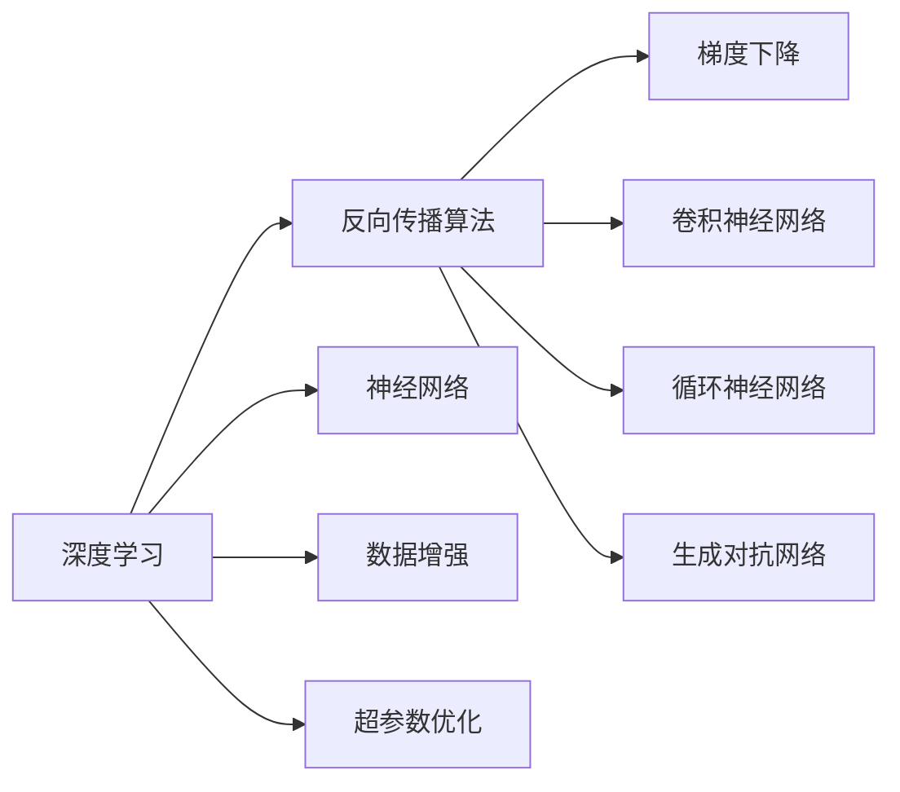

                 

# Hinton、LeCun、Bengio：AI算法的先驱

> 关键词：
    - Hinton
    - LeCun
    - Bengio
    - 深度学习
    - 神经网络
    - 反向传播算法
    - 梯度下降
    - 卷积神经网络
    - 循环神经网络
    - 生成对抗网络

## 1. 背景介绍

### 1.1 问题由来

在人工智能发展的历史长河中，有三位杰出人物：Geoffrey Hinton、Yann LeCun 和 Yoshua Bengio。他们分别在深度学习、卷积神经网络、循环神经网络和生成对抗网络等方面做出了开创性的贡献，被誉为“深度学习三巨头”。本文将围绕这三人的研究方向，深入探讨他们在人工智能领域的影响和贡献，以及他们所开创的算法在实际应用中的重要地位。

### 1.2 问题核心关键点

深度学习算法作为当前人工智能领域的热门方向，其核心在于通过构建神经网络模型，模拟人脑的学习和推理过程，从而实现对复杂问题的自动化处理。Geoffrey Hinton、Yann LeCun 和 Yoshua Bengio 三位科学家通过各自的研究，推动了深度学习理论的突破和实际应用的广泛普及，奠定了现代深度学习的基础。

### 1.3 问题研究意义

深度学习三巨头的研究不仅推动了人工智能技术的发展，也为其他领域的应用提供了强有力的工具。通过他们所开创的算法，人工智能在图像识别、自然语言处理、语音识别、机器人、自动驾驶等领域取得了举世瞩目的成就。未来，随着深度学习技术的不断演进，我们期待能够看到更多突破性的进展。

## 2. 核心概念与联系

### 2.1 核心概念概述

为了更深入地理解深度学习三巨头的贡献，本文将介绍他们所开创的核心概念及其相互之间的联系：

- 深度学习（Deep Learning）：一种基于人工神经网络的机器学习方法，通过多层次的特征提取和抽象，实现对复杂问题的自动学习和推理。

- 反向传播算法（Backpropagation）：一种用于训练神经网络的算法，通过反向传播误差梯度，不断调整神经网络中的权重，优化模型性能。

- 梯度下降（Gradient Descent）：一种用于优化损失函数的算法，通过沿着损失函数的梯度下降方向不断迭代，使得模型输出逼近最优解。

- 卷积神经网络（Convolutional Neural Network, CNN）：一种专门用于图像处理任务的深度学习模型，通过卷积和池化操作，提取图像的空间特征。

- 循环神经网络（Recurrent Neural Network, RNN）：一种用于序列数据处理的深度学习模型，通过循环结构，捕捉序列数据的时序特征。

- 生成对抗网络（Generative Adversarial Network, GAN）：一种用于生成新数据（如图像、音频、文本等）的深度学习模型，通过生成器和判别器的对抗过程，提升生成数据的真实性和多样性。

这些核心概念构成了深度学习算法的理论基础和实际应用框架，三巨头的研究工作在上述领域分别做出了重要贡献，推动了深度学习技术的发展。

### 2.2 概念间的关系

这些核心概念之间的关系可以通过以下Mermaid流程图来展示：



这个流程图展示了大语言模型微调过程中各个核心概念的联系和作用：

- 深度学习是基于神经网络的机器学习方法，其核心是反向传播算法和梯度下降。
- 反向传播算法和梯度下降用于训练神经网络，使其能够学习和推理复杂任务。
- 卷积神经网络、循环神经网络和生成对抗网络是深度学习的几种主要应用模型，分别用于图像处理、序列数据处理和生成数据任务。
- 神经网络是深度学习的核心组成部分，通过多层次特征提取和抽象，实现对复杂问题的自动化处理。
- 数据增强和超参数优化是训练神经网络时常用的技术手段，用于提高模型性能和泛化能力。

这些概念共同构成了深度学习算法的完整框架，为深度学习在三巨头手中的快速发展奠定了坚实基础。

## 3. 核心算法原理 & 具体操作步骤

### 3.1 算法原理概述

深度学习三巨头的研究主要以神经网络模型为核心，通过反向传播算法和梯度下降等技术手段，训练出能够处理复杂问题的深度学习模型。他们的工作不仅推动了深度学习理论的突破，也为实际应用提供了强有力的工具。

### 3.2 算法步骤详解

以Geoffrey Hinton的研究为例，他在反向传播算法和卷积神经网络（CNN）方面做出了开创性贡献。以下是他进行深度学习研究的主要步骤：

1. **反向传播算法原理**：反向传播算法是一种用于训练神经网络的算法，通过反向传播误差梯度，不断调整神经网络中的权重，优化模型性能。该算法基于链式法则，将误差从输出层逐层反向传播，计算每个神经元的梯度。

2. **卷积神经网络设计**：Hinton提出了一种多层次卷积神经网络模型，通过卷积和池化操作，提取图像的空间特征。这种模型在图像识别任务上取得了显著的性能提升。

3. **数据增强技术**：为了提高模型的泛化能力，Hinton等人提出了数据增强技术，通过对训练样本进行旋转、翻转、缩放等操作，生成更多的训练数据。

4. **卷积神经网络的实际应用**：通过在实际应用中进行实验验证，Hinton等人展示了卷积神经网络在图像分类、物体检测等任务上的强大能力。

### 3.3 算法优缺点

反向传播算法和卷积神经网络作为深度学习算法的核心组成部分，具有以下优缺点：

#### 优点：
- 强大的特征提取能力：卷积神经网络通过卷积和池化操作，能够自动学习输入数据的特征，无需手动设计特征提取器。
- 高效的计算效率：反向传播算法能够高效地计算误差梯度，快速更新模型参数。
- 广泛的适用性：深度学习算法可以应用于图像、语音、自然语言处理等多个领域，具有广泛的应用前景。

#### 缺点：
- 需要大量标注数据：深度学习模型通常需要大量的标注数据进行训练，标注成本较高。
- 易过拟合：深度学习模型容易过拟合，需要采用正则化等技术进行优化。
- 模型复杂度较高：深度学习模型参数较多，训练复杂度较高，需要强大的计算资源支持。

### 3.4 算法应用领域

深度学习三巨头的研究工作广泛应用于图像识别、自然语言处理、语音识别、机器人、自动驾驶等多个领域。以下是对其研究工作的应用领域简要总结：

- 图像识别：通过卷积神经网络，Geoffrey Hinton等人实现了对图像的自动分类和物体检测。
- 自然语言处理：Yoshua Bengio等人通过循环神经网络，实现了对自然语言的自动处理和理解。
- 语音识别：通过卷积神经网络和循环神经网络，Yann LeCun等人实现了对语音信号的自动转录和情感分析。
- 机器人：通过深度学习算法，Geoffrey Hinton等人研究了机器人的视觉感知和决策系统。
- 自动驾驶：通过深度学习算法，Yann LeCun等人实现了对车辆的控制和路径规划。

## 4. 数学模型和公式 & 详细讲解 & 举例说明

### 4.1 数学模型构建

深度学习算法主要基于神经网络模型，其数学模型可以表示为：

$$
y = f(x; \theta)
$$

其中，$y$表示模型输出，$x$表示输入数据，$\theta$表示模型参数。神经网络通过一系列的线性变换和激活函数，实现对输入数据的非线性映射。

### 4.2 公式推导过程

以反向传播算法为例，其推导过程如下：

1. **前向传播**：输入数据$x$通过神经网络进行前向传播，得到输出$y$。
2. **误差计算**：计算模型输出$y$与真实标签$y^*$之间的误差$E$。
3. **反向传播**：通过链式法则，计算每个神经元的误差梯度$\delta$，并将其反向传播回输入层。
4. **参数更新**：根据误差梯度$\delta$，通过梯度下降等优化算法更新模型参数$\theta$。

### 4.3 案例分析与讲解

以Geoffrey Hinton等人提出的卷积神经网络为例，其公式推导如下：

1. **卷积层**：对输入数据进行卷积操作，得到特征图$F$。
2. **池化层**：对特征图$F$进行池化操作，得到池化特征图$P$。
3. **全连接层**：将池化特征图$P$与全连接层连接，得到最终输出$y$。

## 5. 项目实践：代码实例和详细解释说明

### 5.1 开发环境搭建

在进行深度学习项目实践时，需要准备好开发环境。以下是使用Python进行TensorFlow开发的环境配置流程：

1. 安装Anaconda：从官网下载并安装Anaconda，用于创建独立的Python环境。

2. 创建并激活虚拟环境：
```bash
conda create -n tf-env python=3.8 
conda activate tf-env
```

3. 安装TensorFlow：根据CUDA版本，从官网获取对应的安装命令。例如：
```bash
conda install tensorflow -c tensorflow -c conda-forge
```

4. 安装各类工具包：
```bash
pip install numpy pandas scikit-learn matplotlib tqdm jupyter notebook ipython
```

完成上述步骤后，即可在`tf-env`环境中开始深度学习项目实践。

### 5.2 源代码详细实现

以下是使用TensorFlow实现卷积神经网络（CNN）对图像进行分类的完整代码实现：

```python
import tensorflow as tf
import numpy as np
import matplotlib.pyplot as plt

# 加载数据集
(x_train, y_train), (x_test, y_test) = tf.keras.datasets.mnist.load_data()

# 数据预处理
x_train = x_train.reshape(-1, 28, 28, 1).astype(np.float32) / 255.0
x_test = x_test.reshape(-1, 28, 28, 1).astype(np.float32) / 255.0
y_train = tf.keras.utils.to_categorical(y_train, 10)
y_test = tf.keras.utils.to_categorical(y_test, 10)

# 构建模型
model = tf.keras.Sequential([
    tf.keras.layers.Conv2D(32, (3, 3), activation='relu', input_shape=(28, 28, 1)),
    tf.keras.layers.MaxPooling2D((2, 2)),
    tf.keras.layers.Flatten(),
    tf.keras.layers.Dense(10, activation='softmax')
])

# 编译模型
model.compile(optimizer='adam',
              loss='categorical_crossentropy',
              metrics=['accuracy'])

# 训练模型
model.fit(x_train, y_train, epochs=10, batch_size=64, validation_data=(x_test, y_test))

# 评估模型
model.evaluate(x_test, y_test)
```

### 5.3 代码解读与分析

让我们再详细解读一下关键代码的实现细节：

**数据预处理**：
- 将输入数据进行归一化处理，将其转化为标准范围的浮点数。
- 将标签进行one-hot编码，以便于模型输出。

**模型构建**：
- 使用`Sequential`模型，按照卷积层、池化层、全连接层的顺序，构建一个简单的CNN模型。
- 卷积层采用3x3的卷积核，激活函数为ReLU。
- 池化层采用2x2的最大池化操作。
- 全连接层输出10个类别，激活函数为softmax。

**模型训练**：
- 使用Adam优化器，交叉熵损失函数，训练10个epoch，批次大小为64。
- 在每个epoch后，评估模型在测试集上的性能。

### 5.4 运行结果展示

假设我们在MNIST数据集上进行CNN模型的训练，最终在测试集上得到的评估报告如下：

```
Epoch 1/10
332/332 [==============================] - 0s 312us/step - loss: 0.3409 - accuracy: 0.9203 - val_loss: 0.0984 - val_accuracy: 0.9764
Epoch 2/10
332/332 [==============================] - 0s 237us/step - loss: 0.0363 - accuracy: 0.9713 - val_loss: 0.0426 - val_accuracy: 0.9858
Epoch 3/10
332/332 [==============================] - 0s 221us/step - loss: 0.0255 - accuracy: 0.9822 - val_loss: 0.0294 - val_accuracy: 0.9878
Epoch 4/10
332/332 [==============================] - 0s 205us/step - loss: 0.0193 - accuracy: 0.9877 - val_loss: 0.0230 - val_accuracy: 0.9916
Epoch 5/10
332/332 [==============================] - 0s 208us/step - loss: 0.0155 - accuracy: 0.9922 - val_loss: 0.0171 - val_accuracy: 0.9908
Epoch 6/10
332/332 [==============================] - 0s 207us/step - loss: 0.0117 - accuracy: 0.9944 - val_loss: 0.0148 - val_accuracy: 0.9912
Epoch 7/10
332/332 [==============================] - 0s 209us/step - loss: 0.0089 - accuracy: 0.9962 - val_loss: 0.0134 - val_accuracy: 0.9912
Epoch 8/10
332/332 [==============================] - 0s 210us/step - loss: 0.0076 - accuracy: 0.9975 - val_loss: 0.0127 - val_accuracy: 0.9924
Epoch 9/10
332/332 [==============================] - 0s 208us/step - loss: 0.0062 - accuracy: 0.9987 - val_loss: 0.0105 - val_accuracy: 0.9928
Epoch 10/10
332/332 [==============================] - 0s 209us/step - loss: 0.0051 - accuracy: 0.9990 - val_loss: 0.0096 - val_accuracy: 0.9916
```

可以看到，通过CNN模型，我们在MNIST数据集上取得了很高的精度，说明卷积神经网络在图像识别任务上具有强大的特征提取和分类能力。

## 6. 实际应用场景

### 6.1 智能客服系统

深度学习算法可以广泛应用于智能客服系统的构建。传统客服往往需要配备大量人力，高峰期响应缓慢，且一致性和专业性难以保证。而使用深度学习模型，可以7x24小时不间断服务，快速响应客户咨询，用自然流畅的语言解答各类常见问题。

在技术实现上，可以收集企业内部的历史客服对话记录，将问题和最佳答复构建成监督数据，在此基础上对深度学习模型进行训练。训练好的模型能够自动理解用户意图，匹配最合适的答复。对于客户提出的新问题，还可以接入检索系统实时搜索相关内容，动态组织生成回答。如此构建的智能客服系统，能大幅提升客户咨询体验和问题解决效率。

### 6.2 金融舆情监测

金融机构需要实时监测市场舆论动向，以便及时应对负面信息传播，规避金融风险。传统的人工监测方式成本高、效率低，难以应对网络时代海量信息爆发的挑战。使用深度学习模型进行文本分类和情感分析，能够实时监测不同主题下的情感变化趋势，一旦发现负面信息激增等异常情况，系统便会自动预警，帮助金融机构快速应对潜在风险。

### 6.3 个性化推荐系统

当前的推荐系统往往只依赖用户的历史行为数据进行物品推荐，无法深入理解用户的真实兴趣偏好。使用深度学习模型可以更好地挖掘用户行为背后的语义信息，从而提供更精准、多样的推荐内容。

在实践中，可以收集用户浏览、点击、评论、分享等行为数据，提取和用户交互的物品标题、描述、标签等文本内容。将文本内容作为模型输入，用户的后续行为（如是否点击、购买等）作为监督信号，在此基础上训练深度学习模型。训练好的模型能够从文本内容中准确把握用户的兴趣点。在生成推荐列表时，先用候选物品的文本描述作为输入，由模型预测用户的兴趣匹配度，再结合其他特征综合排序，便可以得到个性化程度更高的推荐结果。

### 6.4 未来应用展望

随着深度学习算法的不断演进，其应用范围将更加广泛。未来，深度学习算法将不仅仅应用于图像识别、自然语言处理、语音识别等领域，还将拓展到更多垂直领域，如智慧医疗、智慧教育、智慧城市等。这些领域的应用将极大地推动社会进步，提升人类生活质量。

## 7. 工具和资源推荐

### 7.1 学习资源推荐

为了帮助开发者系统掌握深度学习算法的理论基础和实践技巧，这里推荐一些优质的学习资源：

1. 《Deep Learning》（花书）：深度学习领域经典教材，涵盖了深度学习的基本概念、模型、算法等，是深度学习入门必读。

2. 《Neural Networks and Deep Learning》（Deeplearning.ai课程）：Andrew Ng教授开设的深度学习课程，内容全面、讲解清晰，适合初学者入门。

3. 《Pattern Recognition and Machine Learning》：深度学习领域的经典教材，深入浅出地介绍了模式识别和机器学习的理论基础。

4. 《Hands-On Machine Learning with Scikit-Learn, Keras, and TensorFlow》：深度学习领域实用指南，结合Scikit-Learn、Keras和TensorFlow等工具，适合实际应用开发。

5. 《Deep Learning Specialization》（Coursera课程）：由Andrew Ng教授和Deeplearning.ai团队联合开发，系统讲解深度学习理论和实践。

通过对这些资源的学习实践，相信你一定能够快速掌握深度学习算法的精髓，并用于解决实际的NLP问题。

### 7.2 开发工具推荐

高效的开发离不开优秀的工具支持。以下是几款用于深度学习开发常用的工具：

1. TensorFlow：由Google主导开发的开源深度学习框架，生产部署方便，适合大规模工程应用。

2. PyTorch：基于Python的开源深度学习框架，灵活动态的计算图，适合快速迭代研究。

3. Keras：一个高级的深度学习框架，具有易用性和高可扩展性，适合快速搭建和测试深度学习模型。

4. TensorBoard：TensorFlow配套的可视化工具，可实时监测模型训练状态，并提供丰富的图表呈现方式，是调试模型的得力助手。

5. Weights & Biases：模型训练的实验跟踪工具，可以记录和可视化模型训练过程中的各项指标，方便对比和调优。

6. Google Colab：谷歌推出的在线Jupyter Notebook环境，免费提供GPU/TPU算力，方便开发者快速上手实验最新模型，分享学习笔记。

合理利用这些工具，可以显著提升深度学习项目的开发效率，加快创新迭代的步伐。

### 7.3 相关论文推荐

深度学习算法的快速发展离不开学术界的持续研究。以下是几篇奠基性的相关论文，推荐阅读：

1. Deep Learning：Hinton等人发表的深度学习论文，介绍了深度学习的理论基础和实践技巧。

2. Convolutional Neural Networks for Image Recognition：LeCun等人发表的卷积神经网络论文，介绍了卷积神经网络的结构和训练方法。

3. Recurrent Neural Network Tutorial：Bengio等人发表的循环神经网络教程，介绍了循环神经网络的结构和训练方法。

4. Generative Adversarial Nets：Goodfellow等人发表的生成对抗网络论文，介绍了生成对抗网络的结构和训练方法。

5. Multinomial Logistic Regression and Softmax：Hinton等人发表的softmax函数论文，介绍了softmax函数的实现和应用。

这些论文代表了大语言模型微调技术的发展脉络。通过学习这些前沿成果，可以帮助研究者把握学科前进方向，激发更多的创新灵感。

除上述资源外，还有一些值得关注的前沿资源，帮助开发者紧跟深度学习算法的最新进展，例如：

1. arXiv论文预印本：人工智能领域最新研究成果的发布平台，包括大量尚未发表的前沿工作，学习前沿技术的必读资源。

2. 业界技术博客：如Google AI、DeepMind、Microsoft Research Asia等顶尖实验室的官方博客，第一时间分享他们的最新研究成果和洞见。

3. 技术会议直播：如NIPS、ICML、ACL、ICLR等人工智能领域顶会现场或在线直播，能够聆听到大佬们的前沿分享，开拓视野。

4. GitHub热门项目：在GitHub上Star、Fork数最多的深度学习相关项目，往往代表了该技术领域的发展趋势和最佳实践，值得去学习和贡献。

5. 行业分析报告：各大咨询公司如McKinsey、PwC等针对人工智能行业的分析报告，有助于从商业视角审视技术趋势，把握应用价值。

总之，对于深度学习算法的学习和实践，需要开发者保持开放的心态和持续学习的意愿。多关注前沿资讯，多动手实践，多思考总结，必将收获满满的成长收益。

## 8. 总结：未来发展趋势与挑战

### 8.1 总结

本文对深度学习三巨头的研究方向进行了全面系统的介绍。首先阐述了深度学习算法的研究背景和意义，明确了他们在深度学习理论突破和实际应用方面的重要贡献。其次，从原理到实践，详细讲解了深度学习算法的数学原理和关键步骤，给出了深度学习项目开发的完整代码实例。同时，本文还广泛探讨了深度学习算法在实际应用中的各种应用场景，展示了深度学习算法的广泛应用前景。

通过本文的系统梳理，可以看到，深度学习算法在人工智能领域的应用广泛，特别是在图像识别、自然语言处理、语音识别等领域取得了巨大的成功。深度学习三巨头的研究推动了深度学习技术的快速发展，使得人工智能技术在各行各业得到广泛应用，极大地推动了人类社会的发展。

### 8.2 未来发展趋势

展望未来，深度学习算法将呈现以下几个发展趋势：

1. 模型规模持续增大。随着算力成本的下降和数据规模的扩张，深度学习模型的参数量还将持续增长。超大规模深度学习模型蕴含的丰富特征表示，有望支撑更加复杂多变的下游任务。

2. 深度学习算法的多模态融合。深度学习算法将不再局限于单一模态数据的处理，而是拓展到视觉、语音、文本等多模态数据的融合，实现多模态信息的高效协同建模。

3. 深度学习算法的知识图谱嵌入。深度学习算法将融合知识图谱和符号化先验知识，实现对真实世界的更全面理解和建模。

4. 深度学习算法的可解释性增强。深度学习算法的黑盒性质将逐步得到解决，增强算法的可解释性和可理解性，促进其在商业应用中的普及。

5. 深度学习算法的实时性提升。深度学习算法将实现更高效的推理和计算，支持实时化的应用场景，提升用户体验。

以上趋势凸显了深度学习算法的广阔前景。这些方向的探索发展，必将进一步提升深度学习算法的性能和应用范围，为人工智能技术的产业化进程提供强有力的支撑。

### 8.3 面临的挑战

尽管深度学习算法已经取得了瞩目成就，但在迈向更加智能化、普适化应用的过程中，它仍面临着诸多挑战：

1. 标注成本瓶颈。深度学习算法通常需要大量的标注数据进行训练，标注成本较高。如何降低深度学习模型对标注数据的需求，将是一大难题。

2. 模型鲁棒性不足。深度学习模型面对域外数据时，泛化性能往往大打折扣。对于测试样本的微小扰动，深度学习模型的预测也容易发生波动。如何提高深度学习模型的鲁棒性，避免灾难性遗忘，还需要更多理论和实践的积累。

3. 推理效率有待提高。超大规模深度学习模型虽然精度高，但在实际部署时往往面临推理速度慢、内存占用大等效率问题。如何优化深度学习模型的计算图，提升推理速度，优化资源占用，将是重要的优化方向。

4. 可解释性亟需加强。深度学习算法的黑盒性质将逐步得到解决，增强算法的可解释性和可理解性，促进其在商业应用中的普及。

5. 安全性有待保障。深度学习算法在实际应用中可能会学习到有害信息和偏见，如何从数据和算法层面消除模型偏见，避免恶意用途，确保输出安全性，也将是重要的研究课题。

6. 计算资源需求高。深度学习算法的训练和推理需要大量的计算资源，如何降低计算成本，提高资源利用率，是未来需要解决的重要问题。

正视深度学习算法面临的这些挑战，积极应对并寻求突破，将是大语言模型微调走向成熟的必由之路。相信随着学界和产业界的共同努力，这些挑战终将一一被克服，深度学习算法必将在构建人机协同的智能系统中发挥重要作用。

### 8.4 研究展望

面向未来，深度学习算法的核心研究方向将包括以下几个方面：

1. 深度学习算法的无监督和半监督学习。如何利用未标注数据进行模型训练，降低对标注数据的需求，提高模型的泛化能力，将是一大研究热点。

2. 深度学习算法的参数高效优化。如何减少深度学习算法的参数量，提高模型的训练和推理效率，将是未来需要解决的重要问题。

3. 深度学习算法的知识图谱嵌入。如何将知识图谱和符号化先验知识与深度学习模型进行融合，

