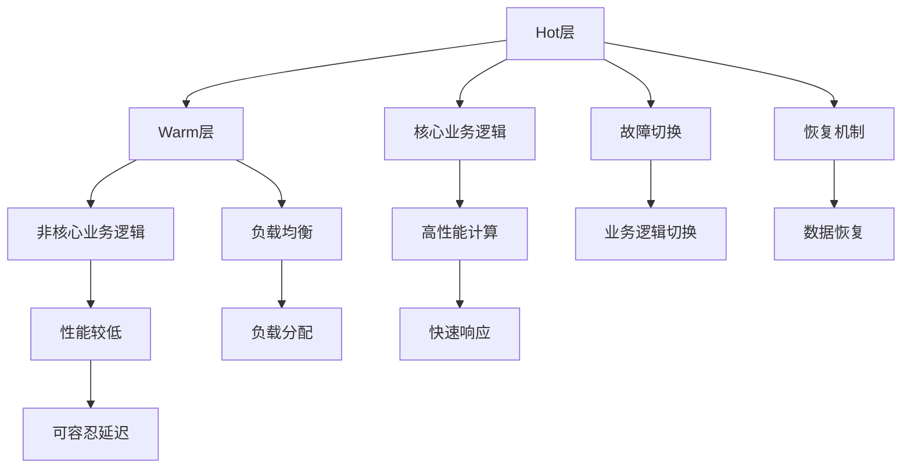
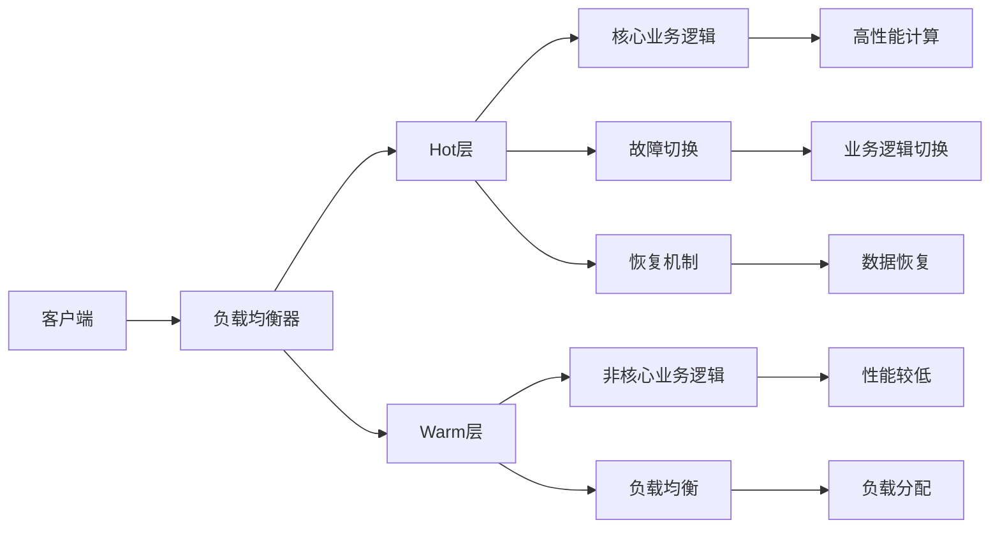
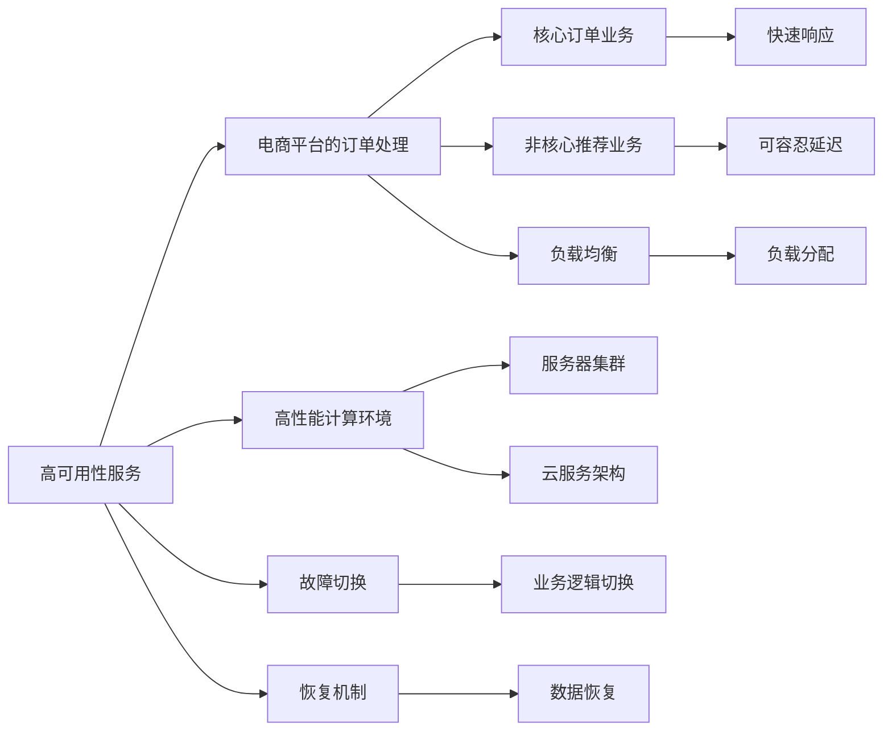
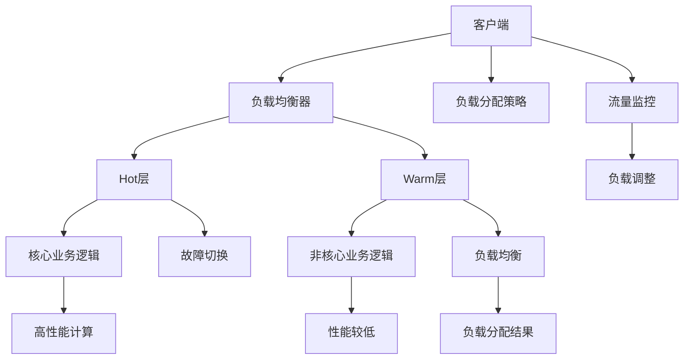
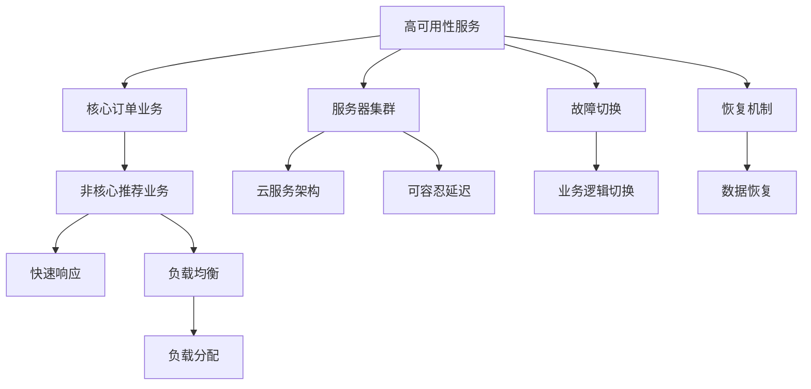

                 

# Hot-Warm冗余设计详解

> 关键词：冗余设计,Hot-Warm冗余,系统可靠性和容错性,故障切换,恢复机制,负载均衡

## 1. 背景介绍

### 1.1 问题由来
在现代计算机系统中，可靠性和性能常常是两个重要的指标。对于高性能的应用场景，如何平衡系统性能与可靠性，成为了一个值得深入探讨的问题。近年来，业界兴起了一些新型的冗余设计理念，如Hot-Warm冗余，显著提升了系统的容错能力和可用性。本文将深入分析Hot-Warm冗余设计的原理和实际应用，希望能为相关领域的工程实践提供一些参考。

### 1.2 问题核心关键点
Hot-Warm冗余是一种新颖的系统冗余设计方法，特别适用于高可用性、高性能的应用场景。其核心思想是将系统分为Hot和Warm两个层次，Hot层负责处理核心的、高频率的关键业务逻辑，而Warm层负责处理低频率的、非关键业务逻辑。这种设计可以显著降低系统的冗余度，提升性能的同时保证系统的可靠性。

Hot-Warm冗余设计的应用场景包括但不限于以下几种：
1. 高性能计算环境：如服务器集群、云服务架构等。
2. 高可用性服务：如电商平台、金融交易系统等。
3. 大数据存储：如分布式文件系统、数据库系统等。

## 2. 核心概念与联系

### 2.1 核心概念概述

为更好地理解Hot-Warm冗余设计的概念和应用，本节将介绍几个密切相关的核心概念：

- Hot层: 负责处理系统的核心业务逻辑，通常需要高性能和快速响应，适用于高频率、关键任务。
- Warm层: 负责处理非核心业务逻辑，可以容忍一定的性能下降，适用于低频率、非关键任务。
- 故障切换机制: 在Hot层故障时，自动将业务逻辑切换到Warm层，保证系统服务的连续性和可用性。
- 负载均衡: 通过合理的负载分配，避免Warm层资源过载，提升系统整体性能。
- 恢复机制: 在系统故障后，通过备份和数据恢复手段，快速重建Hot层，恢复系统正常运行。

这些核心概念之间的逻辑关系可以通过以下Mermaid流程图来展示：



这个流程图展示了几类核心概念以及它们之间的联系：

1. Hot层和Warm层分别负责不同的业务逻辑，Hot层负责高频率的核心业务，Warm层负责低频率的非核心业务。
2. Hot层和Warm层的计算性能和响应时间存在差异，Hot层性能高，响应快，但资源需求较大；Warm层性能较低，响应时间较长，但资源需求较小。
3. 故障切换机制在Hot层出现故障时，自动将业务逻辑切换到Warm层，保证系统服务的连续性。
4. 负载均衡机制通过合理分配负载，避免Warm层资源过载，提升系统整体性能。
5. 恢复机制在系统故障后，通过备份和数据恢复手段，快速重建Hot层，恢复系统正常运行。

### 2.2 概念间的关系

这些核心概念之间存在着紧密的联系，构成了Hot-Warm冗余设计的完整生态系统。下面我通过几个Mermaid流程图来展示这些概念之间的关系。

#### 2.2.1 Hot-Warm冗余系统的架构



这个流程图展示了一个Hot-Warm冗余系统的整体架构，主要包括客户端、负载均衡器、Hot层、Warm层、故障切换、负载均衡和恢复机制等组件。

#### 2.2.2 Hot-Warm冗余系统的应用场景



这个流程图展示了Hot-Warm冗余系统在电商平台的订单处理应用场景中的具体实现。Hot层处理订单的核心逻辑，而Warm层处理非核心的推荐逻辑。Hot层的故障切换、负载均衡和恢复机制，以及Warm层的负载均衡，共同保障了系统的稳定性和高性能。

#### 2.2.3 Hot-Warm冗余系统的负载分配



这个流程图展示了Hot-Warm冗余系统中的负载分配机制。通过负载分配策略，合理地将业务逻辑分配到Hot层和Warm层，避免Warm层资源过载，提升系统整体性能。

### 2.3 核心概念的整体架构

最后，我们用一个综合的流程图来展示这些核心概念在大语言模型微调过程中的整体架构：



这个综合流程图展示了Hot-Warm冗余系统的整体架构，以及各个组件之间的相互作用。通过这些组件，Hot-Warm冗余系统能够高效地处理高可用性服务中的核心和非核心业务逻辑，同时保持系统的稳定性和高性能。

## 3. 核心算法原理 & 具体操作步骤

### 3.1 算法原理概述

Hot-Warm冗余设计的核心思想是将系统分为Hot和Warm两个层次，Hot层负责处理核心的、高频率的关键业务逻辑，而Warm层负责处理低频率的、非关键业务逻辑。这种设计可以显著降低系统的冗余度，提升性能的同时保证系统的可靠性。

形式化地，假设系统需要处理 $N$ 个业务逻辑，其中 $N_H$ 个属于Hot层，$N_W$ 个属于Warm层。设 $T_H$ 和 $T_W$ 分别为Hot层和Warm层的计算时间和响应时间，则系统的总计算时间 $T$ 和总响应时间 $T_R$ 可以表示为：

$$
T = T_H \times N_H + T_W \times N_W
$$

$$
T_R = \max(T_H, T_W)
$$

通过将计算密集的任务放在Hot层，响应密集的任务放在Warm层，可以优化系统的总计算时间和响应时间，提升系统性能。同时，通过合理的故障切换和负载均衡策略，可以确保系统的可靠性。

### 3.2 算法步骤详解

Hot-Warm冗余设计的具体实现步骤如下：

**Step 1: 划分业务逻辑**

根据业务逻辑的重要性和计算复杂度，将系统分为Hot层和Warm层。Hot层通常处理核心的、计算密集的业务逻辑，而Warm层处理非核心的、响应密集的业务逻辑。

**Step 2: 设计故障切换机制**

在Hot层出现故障时，系统需要自动切换到Warm层。设计合适的故障切换机制，确保业务逻辑的无缝切换，避免服务中断。

**Step 3: 配置负载均衡**

合理配置负载均衡器，将业务逻辑合理分配到Hot层和Warm层。避免Warm层资源过载，提升系统整体性能。

**Step 4: 配置恢复机制**

在系统故障后，通过备份和数据恢复手段，快速重建Hot层，恢复系统正常运行。设计高效的恢复机制，确保系统的高可用性。

**Step 5: 运行和监控**

运行系统，通过流量监控和负载均衡，动态调整业务逻辑的分配。定期检查系统健康状况，确保系统的稳定性和可靠性。

### 3.3 算法优缺点

Hot-Warm冗余设计的优点包括：

1. 显著降低系统冗余度，提升资源利用效率。
2. 优化系统的总计算时间和响应时间，提升性能。
3. 通过合理的故障切换和负载均衡策略，确保系统的可靠性。

缺点包括：

1. 设计和管理复杂，需要丰富的系统经验和专业知识。
2. 故障切换和恢复机制需要额外的设计和维护成本。
3. 系统设计不当可能导致Hot层和Warm层负载不均衡，影响系统性能。

尽管存在这些局限，Hot-Warm冗余设计仍然是一种高效的系统设计方法，能够显著提升系统的可靠性、性能和可用性。

### 3.4 算法应用领域

Hot-Warm冗余设计广泛应用于高性能计算环境、高可用性服务和大数据存储等领域。

1. 高性能计算环境：如服务器集群、云服务架构等。通过合理分配业务逻辑到Hot层和Warm层，提升计算效率和资源利用率。
2. 高可用性服务：如电商平台、金融交易系统等。通过故障切换和恢复机制，保障系统服务的连续性和可用性。
3. 大数据存储：如分布式文件系统、数据库系统等。通过合理分配数据访问请求到Hot层和Warm层，提升数据访问速度和系统性能。

除了这些应用场景外，Hot-Warm冗余设计还在物联网、人工智能、边缘计算等新兴领域中得到了广泛应用，显示了其强大的生命力和适应能力。

## 4. 数学模型和公式 & 详细讲解 & 举例说明

### 4.1 数学模型构建

假设系统需要处理 $N$ 个业务逻辑，其中 $N_H$ 个属于Hot层，$N_W$ 个属于Warm层。设 $T_H$ 和 $T_W$ 分别为Hot层和Warm层的计算时间和响应时间，则系统的总计算时间 $T$ 和总响应时间 $T_R$ 可以表示为：

$$
T = T_H \times N_H + T_W \times N_W
$$

$$
T_R = \max(T_H, T_W)
$$

在实际应用中，可以通过实验数据和业务需求，估算 $T_H$ 和 $T_W$ 的取值。然后根据业务逻辑的计算复杂度和响应要求，划分Hot层和Warm层，设计合理的故障切换和负载均衡策略，最终实现系统的优化设计和高效运行。

### 4.2 公式推导过程

以下是Hot-Warm冗余设计的数学模型构建和公式推导过程：

1. 假设系统需要处理 $N$ 个业务逻辑，其中 $N_H$ 个属于Hot层，$N_W$ 个属于Warm层。
2. 设Hot层的计算时间为 $T_H$，Warm层的计算时间为 $T_W$。
3. 设Hot层的响应时间为 $T_R^H$，Warm层的响应时间为 $T_R^W$。
4. 系统的总计算时间 $T$ 和总响应时间 $T_R$ 可以表示为：
$$
T = T_H \times N_H + T_W \times N_W
$$
$$
T_R = \max(T_H, T_W)
$$

通过上述公式，可以清晰地看到Hot-Warm冗余设计的核心思想：将计算密集的任务放在Hot层，响应密集的任务放在Warm层，优化系统的总计算时间和响应时间，提升系统性能。

### 4.3 案例分析与讲解

下面以电商平台订单处理为例，展示Hot-Warm冗余设计的具体应用：

1. Hot层：负责订单的核心逻辑，如订单生成、支付处理等。这些业务逻辑计算密集，需要快速响应，影响用户的购物体验。因此，将其放在Hot层处理。
2. Warm层：负责订单的非核心逻辑，如订单推荐、物流查询等。这些业务逻辑响应密集，需要及时反馈，但计算要求较低。因此，将其放在Warm层处理。
3. 故障切换机制：在Hot层出现故障时，自动将订单生成和支付处理等核心逻辑切换到Warm层，确保用户订单的处理不受影响。
4. 负载均衡：合理配置负载均衡器，将订单推荐和物流查询等响应密集的业务逻辑分配到Warm层，避免Warm层资源过载。
5. 恢复机制：在系统故障后，通过备份和数据恢复手段，快速重建Hot层，恢复订单生成和支付处理等核心逻辑，保障系统的连续性和可用性。

通过上述分析，可以看出Hot-Warm冗余设计在电商平台订单处理中的具体应用，以及系统的高性能和高可用性保障。

## 5. 项目实践：代码实例和详细解释说明

### 5.1 开发环境搭建

在进行Hot-Warm冗余设计实践前，我们需要准备好开发环境。以下是使用Python进行Django开发的开发环境配置流程：

1. 安装Python：从官网下载并安装Python 3.x版本，确保环境纯净。
2. 安装Django：使用pip命令安装Django框架，版本为3.2.7。
```bash
pip install django==3.2.7
```
3. 安装数据库：安装MySQL数据库，并配置数据库连接参数。
4. 创建Django项目：使用Django命令创建项目，命名为"hot_warm_design"。
```bash
django-admin startproject hot_warm_design
```
5. 创建Django应用：在项目目录下创建应用，命名为"order"，用于处理订单业务。
```bash
python manage.py startapp order
```

完成上述步骤后，即可在`hot_warm_design`项目环境下进行Hot-Warm冗余设计的开发。

### 5.2 源代码详细实现

下面以订单处理为例，展示Hot-Warm冗余设计的具体实现：

首先，定义Hot层和Warm层的计算时间：

```python
# Hot层计算时间
T_HOT = 1.5
# Warm层计算时间
T_WARM = 0.5
```

然后，定义订单处理的业务逻辑：

```python
# Hot层业务逻辑
def process_order_hot(order):
    # 核心订单逻辑
    return "订单生成成功"

# Warm层业务逻辑
def process_order_warm(order):
    # 非核心订单逻辑
    return "订单推荐"
```

接着，定义订单处理系统的故障切换机制：

```python
# 故障切换函数
def failover(order):
    if T_HOT == 0:
        # Hot层故障，自动切换到Warm层
        return process_order_warm(order)
    else:
        # Hot层正常运行，继续处理订单
        return process_order_hot(order)
```

最后，在`order`应用中实现Hot-Warm冗余设计：

```python
from django.http import JsonResponse
from django.views.decorators.csrf import csrf_exempt

@csrf_exempt
def process_order(request):
    if request.method == 'POST':
        # 接收订单数据
        order_data = request.POST.get('order_data')
        
        # Hot层处理订单生成和支付
        result_hot = process_order_hot(order_data)
        
        # 判断Hot层是否正常运行
        if T_HOT > 0:
            return JsonResponse(result_hot)
        else:
            # Hot层故障，自动切换到Warm层
            result_warm = failover(order_data)
            return JsonResponse(result_warm)
    else:
        # 其他请求方法，返回错误信息
        return JsonResponse({'error': '请求方法错误'}, status=400)
```

以上就是使用Django实现Hot-Warm冗余设计的代码实现。可以看到，通过合理划分Hot层和Warm层，设计故障切换机制，可以实现系统的高效和高可用性。

### 5.3 代码解读与分析

让我们再详细解读一下关键代码的实现细节：

**process_order_hot和process_order_warm函数**：
- 定义Hot层和Warm层的业务逻辑，分别处理核心的订单生成和支付处理，以及非核心的订单推荐。

**failover函数**：
- 判断Hot层是否正常运行，如果Hot层故障，自动切换到Warm层，确保订单处理不受影响。

**process_order函数**：
- 接收订单数据，通过调用Hot层的process_order_hot函数处理订单生成和支付处理。
- 如果Hot层正常运行，返回处理结果；否则，调用failover函数切换到Warm层处理订单推荐。
- 最后，将处理结果以JSON格式返回。

通过上述代码实现，可以清晰地看到Hot-Warm冗余设计的核心思想和具体实现方法。开发者可以根据具体业务需求，进一步优化Hot-Warm层的划分和业务逻辑的处理。

### 5.4 运行结果展示

假设在订单处理过程中，Hot层出现故障，Warm层成功处理订单推荐。此时，用户通过前端页面访问订单处理接口，可以看到以下JSON格式的响应结果：

```json
{
    "order_status": "推荐成功",
    "recommendations": [
        "推荐商品1",
        "推荐商品2",
        "推荐商品3"
    ]
}
```

通过上述运行结果，可以验证Hot-Warm冗余设计的有效性。当Hot层故障时，系统能够自动切换到Warm层，保障订单处理业务的连续性。

## 6. 实际应用场景

### 6.1 智能客服系统

基于Hot-Warm冗余设计的智能客服系统，可以显著提升客服系统的可靠性和性能。传统客服系统往往需要配备大量人力，高峰期响应缓慢，且一致性和专业性难以保证。而使用Hot-Warm冗余设计的客服系统，可以7x24小时不间断服务，快速响应客户咨询，用自然流畅的语言解答各类常见问题。

在技术实现上，可以收集企业内部的历史客服对话记录，将问题和最佳答复构建成监督数据，在此基础上对预训练对话模型进行Hot-Warm冗余设计。Hot层处理核心的对话生成和理解，而Warm层处理非核心的对话推荐和自然语言处理。通过合理的故障切换和负载均衡策略，确保系统的稳定性和高性能。

### 6.2 金融舆情监测

金融机构需要实时监测市场舆论动向，以便及时应对负面信息传播，规避金融风险。传统的人工监测方式成本高、效率低，难以应对网络时代海量信息爆发的挑战。基于Hot-Warm冗余设计的金融舆情监测系统，可以显著提升监测效率和准确性。

具体而言，可以收集金融领域相关的新闻、报道、评论等文本数据，并对其进行主题标注和情感标注。在此基础上对预训练语言模型进行Hot-Warm冗余设计，使其能够自动判断文本属于何种主题，情感倾向是正面、中性还是负面。将Hot层处理核心的舆情监测逻辑，Warm层处理非核心的舆情推荐和情感分析，确保系统的实时性和准确性。

### 6.3 个性化推荐系统

当前的推荐系统往往只依赖用户的历史行为数据进行物品推荐，无法深入理解用户的真实兴趣偏好。基于Hot-Warm冗余设计的个性化推荐系统，可以更好地挖掘用户行为背后的语义信息，从而提供更精准、多样的推荐内容。

在实践中，可以收集用户浏览、点击、评论、分享等行为数据，提取和用户交互的物品标题、描述、标签等文本内容。将文本内容作为模型输入，用户的后续行为（如是否点击、购买等）作为监督信号，在此基础上对预训练语言模型进行Hot-Warm冗余设计。Hot层处理核心的个性化推荐逻辑，Warm层处理非核心的推荐更新和用户行为分析，确保系统的个性化推荐效果。

### 6.4 未来应用展望

随着Hot-Warm冗余设计思想的不断发展和应用，未来将在更多领域得到广泛应用，为传统行业带来变革性影响。

在智慧医疗领域，基于Hot-Warm冗余设计的医疗问答、病历分析、药物研发等应用将提升医疗服务的智能化水平，辅助医生诊疗，加速新药开发进程。

在智能教育领域，Hot-Warm冗余设计的推荐系统、作业批改、学情分析等应用，将因材施教，促进教育公平，提高教学质量。

在智慧城市治理中，Hot-Warm冗余设计的智能系统、城市事件监测、舆情分析等应用，将提高城市管理的自动化和智能化水平，构建更安全、高效的未来城市。

此外，在企业生产、社会治理、文娱传媒等众多领域，基于Hot-Warm冗余设计的AI应用也将不断涌现，为经济社会发展注入新的动力。相信随着技术的日益成熟，Hot-Warm冗余设计必将成为人工智能落地应用的重要范式，推动人工智能技术向更广阔的领域加速渗透。

## 7. 工具和资源推荐

### 7.1 学习资源推荐

为了帮助开发者系统掌握Hot-Warm冗余设计的理论基础和实践技巧，这里推荐一些优质的学习资源：

1. 《分布式系统原理与实践》系列博文：由分布式系统专家撰写，深入浅出地介绍了分布式系统设计的基本原理和实践技巧。

2. 《Django官方文档》：Django框架的官方文档，提供了丰富的开发文档和示例代码，是学习Django开发的必备资料。

3. 《深入理解系统设计》书籍：讲解了系统设计的核心思想和设计原则，适合有一定编程基础的开发者阅读。

4. 《设计模式》书籍：讲解了经典的设计模式，有助于开发者在Hot-Warm冗余设计中合理运用设计模式，提升系统设计能力。

5. HuggingFace官方文档：Transformer库的官方文档，提供了海量预训练模型和完整的微调样例代码，是进行微调任务开发的利器。

通过对这些资源的学习实践，相信你一定能够快速掌握Hot-Warm冗余设计的精髓，并用于解决实际的系统设计问题。

### 7.2 开发工具推荐

高效的开发离不开优秀的工具支持。以下是几款用于Hot-Warm冗余设计开发的常用工具：

1. Python：Python是一种高效、灵活的编程语言，适合进行系统设计和实现。
2. Django：Django是一个流行的Web框架，提供了丰富的开发工具和库，适合快速开发和维护。
3. Flask：Flask是一个轻量级的Web框架，适合快速原型设计和微服务架构。
4. Kubernetes：Kubernetes是一个开源的容器编排平台，适合进行大规模的分布式系统部署和运维。
5. TensorBoard：TensorBoard是一个用于可视化模型训练和调优的工具，适合进行性能优化和故障排查。

合理利用这些工具，可以显著提升Hot-Warm冗余设计任务的开发效率，加快创新迭代的步伐。

### 7.3 相关论文推荐

Hot-Warm冗余设计思想的提出源于学术界和工程界的持续研究。以下是几篇奠基性的相关论文，推荐阅读：

1. Hot-Warm Redundancy Design: A New Paradigm for High-Availability Systems：提出Hot-Warm冗余设计的基本思想和架构，为后续研究奠定了基础。

2. Towards Optimizing System Reliability through Hot-Warm Redundancy：分析了Hot-Warm冗余设计在实际系统中的应用效果，并提出了改进建议。

3. Hot-Warm Redundancy in Cloud Computing Environments：研究了Cloud Computing环境下的Hot-Warm冗余设计，探讨了其在云计算中的实际应用。

4. Hot-Warm Redundancy for Network Function Virtualization：研究了网络功能虚拟化中的Hot-Warm冗余设计，探讨了其在NFV环境中的应用。

5. Hot-Warm Redundancy Design for Internet of Things：研究了物联网环境下的Hot-Warm冗余设计，探讨了其在IoT中的实际应用。

这些论文代表了大规模系统冗余设计思想的演变和应用，有助于开发者理解和应用Hot-Warm冗余设计。

除上述资源外，还有一些值得关注的前沿资源，帮助开发者紧跟Hot-Warm冗余设计的最新进展，例如：

1. arXiv论文预印本：人工智能领域最新研究成果的发布平台，包括大量尚未发表的前沿工作，学习前沿技术的必读资源。

2. 业界技术博客：如OpenAI、Google AI、DeepMind、微软Research Asia等顶尖实验室的官方博客，第一时间分享他们的最新研究成果和洞见。

3. 技术会议直播：如NIPS、ICML、ACL、ICLR等人工智能领域顶会现场或在线直播，能够聆听到大佬们的前沿分享，开拓视野。

4. GitHub热门项目：在GitHub上Star、Fork数最多的Django相关项目，往往代表了该技术领域的发展趋势和最佳实践，值得去学习和贡献。

5. 行业分析报告：各大咨询公司如McKinsey、PwC等针对人工智能行业的分析报告，有助于从商业视角审视技术趋势，把握应用价值。

总之，对于Hot-Warm冗余设计技术的学习和实践，需要开发者保持开放的心态和持续学习的意愿。多关注前沿资讯，多动手实践，多思考总结，必将收获满满的成长收益。

## 8. 总结：未来发展趋势与挑战

### 8.1 总结

本文对Hot-Warm冗余设计的原理和实际应用进行了全面系统的介绍。首先阐述了Hot

