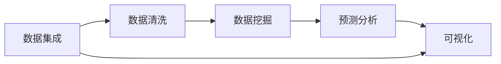

                 

## 1. 背景介绍

在数字化时代，数据的智能洞察（Insight）已经成为各行各业提升效率、降低成本、增强竞争力的关键工具。无论是在制造、教育、金融、医疗还是军事领域，智能洞察都能发挥其独特的价值。本文将深入探讨Insight在这些领域中的应用，揭示其背后的核心概念和原理，以及如何通过优化算法和技术手段，实现高效、精准的洞察。

## 2. 核心概念与联系

### 2.1 核心概念概述

智能洞察（Insight）指的是通过对数据进行深入分析、挖掘和理解，发现潜在的模式、趋势和关联，从而为决策提供依据。在这个过程中，数据是基础，而分析方法和技术是关键。Insight不仅可以帮助企业优化运营，提高生产效率，还可以促进教育个性化、金融风险控制、医疗精准诊断等。

为了更好地理解Insight的核心概念和架构，我们首先需要了解以下几个关键点：

- **数据集成（Data Integration）**：不同来源的数据需要进行整合，确保数据的完整性和一致性。
- **数据清洗（Data Cleaning）**：去除数据中的噪声和错误，确保数据的质量。
- **数据挖掘（Data Mining）**：从大量数据中提取有价值的信息和知识。
- **预测分析（Predictive Analytics）**：基于历史数据预测未来趋势。
- **可视化（Visualization）**：通过图表和报告呈现分析结果，帮助用户理解和决策。

### 2.2 核心概念间的关系

这些核心概念之间的关系可以通过以下Mermaid流程图来展示：



这个流程图展示了Insight实现的一般流程：从数据集成开始，依次进行数据清洗、数据挖掘、预测分析和可视化。各个环节相互依赖，共同作用于最终的分析结果。

## 3. 核心算法原理 & 具体操作步骤

### 3.1 算法原理概述

Insight的算法原理主要涉及数据挖掘和预测分析。数据挖掘是指从数据中提取模式和知识的过程，包括聚类、分类、关联规则挖掘等。预测分析则是指基于历史数据，使用统计模型或机器学习模型预测未来趋势。这些算法通常基于以下几种原理：

- **统计学原理**：基于概率和统计模型，对数据进行分析和预测。
- **机器学习原理**：通过训练模型，学习数据中的规律和模式，并进行预测。
- **深度学习原理**：使用神经网络模型，从大规模数据中自动提取特征和模式。

### 3.2 算法步骤详解

#### 数据预处理

1. **数据清洗**：去除重复、缺失和异常值，确保数据质量。
2. **数据转换**：对数据进行归一化、标准化处理，使其适合算法处理。
3. **特征选择**：选择对分析目标有帮助的特征。

#### 数据挖掘

1. **聚类分析**：将数据分为不同的组别，发现数据中的自然分组。
2. **分类分析**：将数据分为不同的类别，用于分类预测。
3. **关联规则挖掘**：发现变量之间的关联关系，用于关联预测。

#### 预测分析

1. **时间序列分析**：分析时间序列数据，预测未来趋势。
2. **回归分析**：基于变量之间的关系，预测连续值。
3. **分类预测**：基于训练数据，预测离散值。

#### 可视化

1. **数据可视化**：通过图表和报告呈现分析结果，帮助用户理解和决策。

### 3.3 算法优缺点

#### 优点

- **高效性**：自动化处理大量数据，减少人工干预。
- **准确性**：基于科学方法和技术，提高分析的准确性。
- **灵活性**：适用于多种数据类型和分析目标。

#### 缺点

- **数据依赖性**：需要高质量的数据，否则结果可能不准确。
- **算法复杂性**：算法实现复杂，需要专业知识。
- **可解释性**：部分算法模型难以解释，可能存在"黑箱"问题。

### 3.4 算法应用领域

Insight在多个领域都有广泛应用：

- **制造**：通过预测设备故障、优化生产计划，提升制造效率。
- **教育**：个性化学习路径推荐，提高教育质量。
- **金融**：风险控制、欺诈检测，保障金融安全。
- **医疗**：精准诊断、药物研发，提升医疗服务。
- **军事**：情报分析、战术优化，增强军事能力。

## 4. 数学模型和公式 & 详细讲解 & 举例说明

### 4.1 数学模型构建

Insight的数学模型构建主要基于统计学和机器学习的原理。以回归分析为例，我们首先定义一个线性回归模型：

$$ y = \beta_0 + \beta_1 x_1 + \beta_2 x_2 + \ldots + \beta_n x_n + \epsilon $$

其中，$y$ 是预测目标，$x_i$ 是输入特征，$\beta_i$ 是特征系数，$\epsilon$ 是误差项。通过最小化预测误差，求解$\beta_i$。

### 4.2 公式推导过程

线性回归的推导过程如下：

1. **模型假设**：假设误差项$\epsilon$服从正态分布，且与$x_i$无关。
2. **代价函数**：定义代价函数（损失函数），衡量预测值与真实值之间的差异。
3. **求解过程**：使用梯度下降法或其他优化算法，求解代价函数的最小值。
4. **模型评估**：使用均方误差（MSE）或决定系数（R²）等指标，评估模型性能。

### 4.3 案例分析与讲解

以制造业为例，假设我们有一组历史生产数据，包含机器运行时间、温度、湿度等特征，以及对应的产量。我们使用线性回归模型预测产量，步骤如下：

1. **数据预处理**：清洗、转换数据，去除异常值。
2. **模型训练**：选择特征$x_1, x_2, \ldots, x_n$，使用梯度下降法求解$\beta_i$。
3. **模型预测**：输入新的生产数据，预测产量。
4. **模型评估**：计算预测误差，评估模型性能。

## 5. 项目实践：代码实例和详细解释说明

### 5.1 开发环境搭建

1. **Python环境**：安装Python 3.x，推荐使用Anaconda。
2. **数据处理库**：安装Pandas、NumPy、Scikit-learn等。
3. **机器学习库**：安装Scikit-learn、TensorFlow、Keras等。
4. **可视化库**：安装Matplotlib、Seaborn、Plotly等。

### 5.2 源代码详细实现

以下是一个简单的线性回归模型代码示例：

```python
import numpy as np
from sklearn.linear_model import LinearRegression

# 准备数据
X = np.array([[1, 2, 3], [4, 5, 6], [7, 8, 9]])
y = np.array([2, 4, 6])

# 训练模型
model = LinearRegression()
model.fit(X, y)

# 预测新数据
X_new = np.array([[10, 20, 30]])
y_pred = model.predict(X_new)

print(y_pred)
```

### 5.3 代码解读与分析

代码中，我们使用了Scikit-learn库的LinearRegression模型。首先定义了一个二维数组X和y，表示输入特征和目标变量。然后实例化LinearRegression模型，使用fit方法训练模型。最后，使用predict方法预测新数据的输出。

## 6. 实际应用场景

### 6.1 制造

在制造领域，Insight可以帮助企业优化生产流程，降低成本，提高效率。例如：

- **设备维护**：通过预测设备故障，提前进行维护，避免停机损失。
- **生产调度**：基于历史数据，优化生产计划，提高生产效率。
- **质量控制**：分析产品质量数据，识别缺陷来源，改进生产工艺。

### 6.2 教育

在教育领域，Insight可以帮助个性化教育，提高教育质量和效率。例如：

- **学习路径推荐**：根据学生的学习情况和兴趣，推荐个性化的学习路径。
- **学习效果评估**：分析学生学习数据，评估学习效果，提供反馈。
- **教师教学改进**：分析课堂教学数据，优化教学方法。

### 6.3 金融

在金融领域，Insight可以帮助风险控制和欺诈检测，保障金融安全。例如：

- **信用评分**：基于历史交易数据，预测客户信用风险，制定信贷策略。
- **欺诈检测**：分析交易数据，识别异常行为，防止欺诈。
- **投资策略**：分析市场数据，预测股票、债券等资产价格，优化投资策略。

### 6.4 医疗

在医疗领域，Insight可以帮助精准诊断、药物研发，提升医疗服务。例如：

- **疾病预测**：分析患者历史数据，预测疾病风险，制定预防策略。
- **治疗方案优化**：分析治疗数据，优化治疗方案，提高治疗效果。
- **药物研发**：分析临床试验数据，发现潜在药物，加速研发进程。

### 6.5 军事

在军事领域，Insight可以帮助情报分析、战术优化，增强军事能力。例如：

- **情报分析**：分析敌对国家的情报数据，识别威胁。
- **作战计划优化**：基于历史数据，优化作战计划，提升作战效率。
- **装备维护**：预测装备故障，提前进行维护，保障作战能力。

## 7. 工具和资源推荐

### 7.1 学习资源推荐

1. **《Python数据科学手册》**：详细介绍了Python在数据科学中的应用，包括数据清洗、分析、可视化等。
2. **《统计学习方法》**：介绍统计学习的基本原理和算法。
3. **《机器学习实战》**：通过实例介绍机器学习模型的实现和应用。
4. **《深度学习》**：介绍深度学习的基本原理和模型。
5. **Kaggle竞赛**：通过参加Kaggle竞赛，学习和应用各种数据分析和机器学习技术。

### 7.2 开发工具推荐

1. **Jupyter Notebook**：交互式数据分析和代码编写工具。
2. **Tableau**：数据可视化工具，支持多种数据源和可视化方法。
3. **Power BI**：商业智能工具，支持大数据分析和可视化。
4. **Azure Machine Learning**：云端机器学习平台，支持模型训练、部署和管理。
5. **Google Cloud AI Platform**：云端AI平台，支持模型训练、部署和管理。

### 7.3 相关论文推荐

1. **《深度学习》**：Ian Goodfellow等著，全面介绍深度学习的基本原理和应用。
2. **《统计学习方法》**：李航著，介绍统计学习的基本原理和算法。
3. **《机器学习实战》**：Peter Harrington著，通过实例介绍机器学习模型的实现和应用。
4. **《Python数据科学手册》**：Jake VanderPlas著，详细介绍了Python在数据科学中的应用。
5. **《TensorFlow实战Google深度学习框架》**：Tom Hope等著，介绍TensorFlow的基本原理和应用。

## 8. 总结：未来发展趋势与挑战

### 8.1 研究成果总结

Insight在各个领域的应用已经取得了显著成果，提升了企业的运营效率、教育质量、金融安全、医疗服务和军事能力。通过数据挖掘和预测分析，帮助企业发现潜在的模式和趋势，做出更明智的决策。

### 8.2 未来发展趋势

未来，Insight将在以下几个方向取得进一步发展：

- **大数据分析**：随着数据量的增长，Insight将处理更多数据，发现更深的模式和趋势。
- **自动化分析**：通过自动化分析工具，减少人工干预，提高分析效率。
- **跨领域应用**：Insight将拓展到更多领域，如智能交通、智能城市等。
- **智能决策**：结合人工智能技术，实现更智能、更精准的决策。

### 8.3 面临的挑战

Insight在应用过程中也面临一些挑战：

- **数据质量**：高质量的数据是Insight的基础，数据清洗和预处理工作量较大。
- **算法复杂性**：部分算法模型难以解释，可能存在"黑箱"问题。
- **计算资源**：处理大规模数据需要高性能计算资源，成本较高。

### 8.4 研究展望

为了应对这些挑战，未来的研究将聚焦以下几个方向：

- **数据质量提升**：开发更高效的数据清洗和预处理方法。
- **算法透明性**：研究更可解释的算法模型，提高算法的透明性。
- **资源优化**：优化算法和模型，减少计算资源消耗。
- **跨领域应用**：拓展Insight的应用领域，实现跨领域的智能化。

## 9. 附录：常见问题与解答

**Q1：Insight是否适用于所有数据类型？**

A: Insight适用于多种数据类型，包括结构化数据（如表格数据）和非结构化数据（如文本、图像）。不同类型的数据需要采用不同的处理方法，但基本思路是相似的。

**Q2：Insight是否需要高质量的数据？**

A: Insight的效果很大程度上依赖于数据的质量。数据清洗和预处理是Insight的关键步骤，需要去除噪声和错误，确保数据的一致性和完整性。

**Q3：Insight是否可以处理实时数据？**

A: Insight可以处理实时数据，通过流式数据处理技术，实现对实时数据的分析和预测。实时数据需要特殊处理，但基本原理和流程与批处理数据相似。

**Q4：Insight在应用过程中需要注意哪些问题？**

A: 在应用过程中，需要注意以下几点：
- 数据隐私：确保数据隐私和安全，避免泄露敏感信息。
- 数据更新：定期更新数据，确保分析结果的时效性。
- 模型维护：定期维护和更新模型，避免模型失效。

**Q5：Insight的未来发展方向是什么？**

A: Insight的未来发展方向包括：
- 更高效的数据处理技术，提高数据清洗和预处理的效率。
- 更可解释的算法模型，提高算法的透明性和可解释性。
- 更广泛的应用领域，拓展Insight在更多行业的应用。

---

作者：禅与计算机程序设计艺术 / Zen and the Art of Computer Programming

