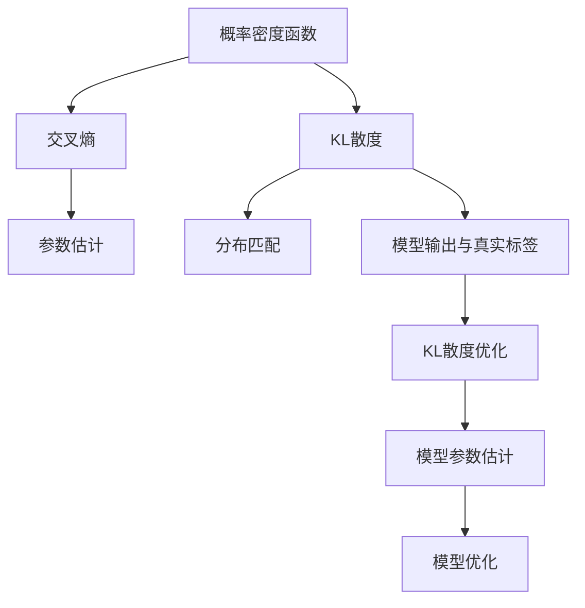
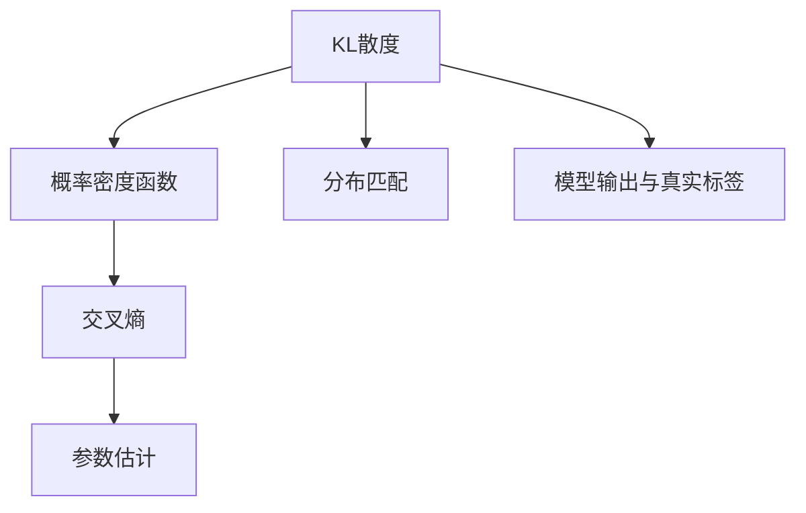
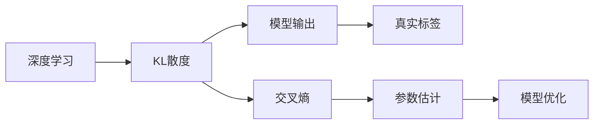
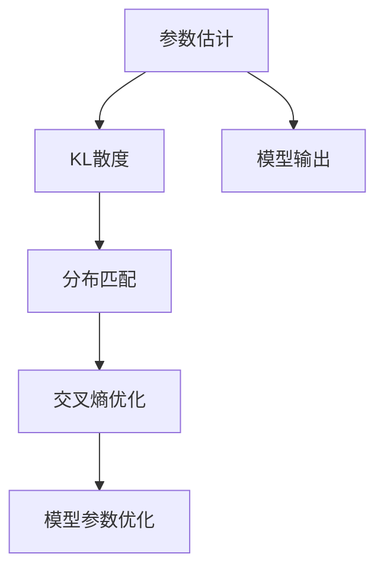
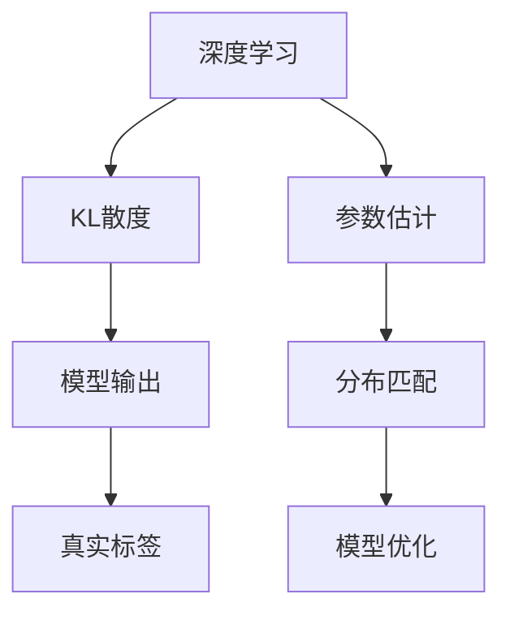

                 

# KL散度原理与代码实例讲解

> 关键词：KL散度, 概率密度函数, 参数估计, 交叉熵, 分布匹配, 深度学习, 图像识别, 自然语言处理

## 1. 背景介绍

### 1.1 问题由来
在机器学习中，我们经常会遇到这样的场景：我们希望找到一个函数，能够将一个给定的概率分布 $p(x)$ 映射到另一个概率分布 $q(x)$，使其尽可能接近 $p(x)$，同时保证 $q(x)$ 的计算复杂度尽量低。这样的函数就是著名的KL散度（Kullback-Leibler divergence），其不仅在机器学习中有着重要的应用，也被广泛用于概率论、统计学、信息论等领域。

### 1.2 问题核心关键点
KL散度的核心思想是衡量两个概率分布之间的距离。如果两个概率分布越接近，则其KL散度越小；反之，如果两个概率分布相差较大，则其KL散度越大。这个距离的计算方式非常直观，即对于任意一个样本点 $x$，$p(x)$ 与 $q(x)$ 的概率之比的对数，乘以 $p(x)$ 的概率。

在实际应用中，KL散度也被用于参数估计、交叉熵优化、信息理论等诸多领域。例如，在深度学习中，KL散度常用于衡量两个概率分布（如模型输出和真实标签分布）之间的差距，以指导模型优化过程；在图像识别、自然语言处理等领域，KL散度也被广泛应用，用于提升模型性能。

### 1.3 问题研究意义
研究KL散度的原理和应用，对于理解和应用机器学习模型、优化模型参数、提升模型性能具有重要意义。同时，KL散度的研究也有助于深入理解概率论和信息论的基本原理，推动这些领域的发展。

## 2. 核心概念与联系

### 2.1 核心概念概述

为更好地理解KL散度的原理和应用，本节将介绍几个密切相关的核心概念：

- KL散度（Kullback-Leibler divergence）：衡量两个概率分布之间的距离，用于概率分布的匹配和拟合。

- 概率密度函数（Probability Density Function，PDF）：表示随机变量取某个值的概率密度，其积分等于1。

- 交叉熵（Cross Entropy）：一种衡量两个概率分布之间的距离的方法，可以视作KL散度的一个特例。

- 参数估计（Parameter Estimation）：从样本数据中估计概率分布参数的过程。

- 模型输出与真实标签：在深度学习中，模型的输出常用于概率预测，真实标签则是实际观测到的标签值，两者之间的差距可以通过KL散度来衡量。

- 分布匹配与拟合：通过KL散度，我们可以找到使一个分布尽可能接近另一个分布的参数，从而进行概率分布的匹配和拟合。

这些核心概念之间的逻辑关系可以通过以下Mermaid流程图来展示：



这个流程图展示了KL散度的核心概念及其之间的关系：

1. 概率密度函数作为基本概念，是KL散度的计算基础。
2. KL散度和交叉熵都是衡量概率分布之间距离的度量，交叉熵可以看作KL散度的一个特例。
3. 参数估计从样本数据中估计概率分布参数，是KL散度优化的重要步骤。
4. 分布匹配和拟合通过KL散度实现，使一个分布尽可能接近另一个分布。
5. 模型输出与真实标签作为KL散度优化的目标，是深度学习中常用的应用场景。
6. KL散度优化和模型参数估计相结合，实现模型优化。

### 2.2 概念间的关系

这些核心概念之间存在着紧密的联系，形成了KL散度的完整生态系统。下面我通过几个Mermaid流程图来展示这些概念之间的关系。

#### 2.2.1 KL散度的数学定义



这个流程图展示了KL散度的数学定义。KL散度基于两个概率分布之间的差异，即两个概率密度函数之间的对数比值的积分。交叉熵是KL散度的一种特殊形式，当两个概率分布完全相同时，KL散度为0。

#### 2.2.2 KL散度在深度学习中的应用



这个流程图展示了KL散度在深度学习中的应用。KL散度在深度学习中常用于衡量模型输出和真实标签之间的差距，通过优化交叉熵，提升模型性能。

#### 2.2.3 参数估计与KL散度优化



这个流程图展示了参数估计和KL散度优化之间的关系。通过KL散度优化，我们可以找到使模型输出与真实标签分布匹配的最佳参数，从而提升模型性能。

### 2.3 核心概念的整体架构

最后，我用一个综合的流程图来展示这些核心概念在大语言模型微调过程中的整体架构：



这个综合流程图展示了从深度学习到KL散度优化的完整过程。深度学习模型通过参数估计，将模型输出与真实标签分布进行匹配，从而实现KL散度优化，提升模型性能。

## 3. 核心算法原理 & 具体操作步骤
### 3.1 算法原理概述

KL散度的计算公式为：

$$
D_{KL}(p||q) = \int_{x} p(x) \log\left(\frac{p(x)}{q(x)}\right) dx
$$

其中，$p(x)$ 是真实分布，$q(x)$ 是模型输出的概率分布。当 $p(x)$ 与 $q(x)$ 完全相同时，$D_{KL}(p||q) = 0$；反之，当 $p(x)$ 与 $q(x)$ 相差越大时，$D_{KL}(p||q)$ 越大。

在实际应用中，KL散度的计算往往采用离散形式，即：

$$
D_{KL}(p||q) = \sum_x p(x) \log\left(\frac{p(x)}{q(x)}\right)
$$

或者使用交叉熵的另一种形式，即：

$$
D_{KL}(p||q) = H(p) - H(q)
$$

其中 $H(p)$ 是真实分布 $p(x)$ 的熵，$H(q)$ 是模型输出 $q(x)$ 的熵。

### 3.2 算法步骤详解

下面是使用Python实现KL散度计算的代码示例：

```python
import numpy as np
from scipy.stats import entropy

def kl_divergence(p, q):
    # p和q均为概率分布，此处假定p是真实分布，q是模型输出
    return entropy(p, q)

# 示例数据
p = np.array([0.2, 0.3, 0.5])  # 真实分布
q = np.array([0.1, 0.5, 0.4])  # 模型输出

kl_value = kl_divergence(p, q)
print("KL散度值：", kl_value)
```

在实际应用中，我们可以通过KL散度来衡量两个分布之间的差异，从而指导模型优化过程。例如，在深度学习中，我们可以将模型输出与真实标签分布之间的KL散度最小化，作为模型优化的目标。

### 3.3 算法优缺点

KL散度的优点在于其数学定义直观且计算简单，适用于概率分布的匹配和拟合。同时，KL散度也是交叉熵优化的一种特殊形式，广泛应用于深度学习模型的训练中。

然而，KL散度也存在一些缺点。首先，KL散度对于概率分布的形状非常敏感，当模型输出的概率分布与真实分布差异较大时，KL散度可能出现发散的情况，导致优化困难。其次，KL散度在某些情况下可能存在梯度消失的问题，影响模型的收敛性。

### 3.4 算法应用领域

KL散度在机器学习和深度学习领域有着广泛的应用，包括但不限于以下几个方面：

- 概率分布拟合：通过KL散度优化，找到使模型输出尽可能接近真实分布的参数，从而进行概率分布的拟合。
- 交叉熵优化：在深度学习中，KL散度常用于衡量模型输出与真实标签分布之间的差距，以指导模型优化过程。
- 分布匹配：通过KL散度优化，实现两个分布的匹配和对齐，提升模型的泛化能力。
- 参数估计：在深度学习中，KL散度常用于参数估计，通过最小化KL散度，找到使模型输出的概率分布与真实标签分布匹配的最佳参数。

除了上述这些应用，KL散度还被广泛应用于统计学、信息论、概率论等领域，推动了这些领域的发展。

## 4. 数学模型和公式 & 详细讲解 & 举例说明

### 4.1 数学模型构建

本节将使用数学语言对KL散度的原理进行更加严格的刻画。

记真实分布为 $p(x)$，模型输出为 $q(x)$，KL散度的计算公式为：

$$
D_{KL}(p||q) = \int_{x} p(x) \log\left(\frac{p(x)}{q(x)}\right) dx
$$

其中，$p(x)$ 是真实分布，$q(x)$ 是模型输出的概率分布。

### 4.2 公式推导过程

以下是KL散度计算公式的详细推导过程：

$$
D_{KL}(p||q) = \int_{x} p(x) \log\left(\frac{p(x)}{q(x)}\right) dx = \int_{x} p(x) \left[\log(p(x)) - \log(q(x))\right] dx
$$

由于 $\int_{x} p(x) dx = 1$，上式可以简化为：

$$
D_{KL}(p||q) = \int_{x} p(x) \log(p(x)) dx - \int_{x} p(x) \log(q(x)) dx = H(p) - H(q)
$$

其中 $H(p)$ 是真实分布 $p(x)$ 的熵，$H(q)$ 是模型输出 $q(x)$ 的熵。

### 4.3 案例分析与讲解

为了更好地理解KL散度的计算方法，下面以一个简单的示例进行分析。

假设我们有一个二项分布 $p(x)$，其中 $p(1) = 0.6$，$p(0) = 0.4$。同时，我们希望通过一个线性模型 $q(x) = \theta^x$ 来拟合 $p(x)$，其中 $\theta$ 是待估参数。

首先，我们计算 $p(x)$ 的熵：

$$
H(p) = -\sum_x p(x) \log(p(x)) = -(0.6 \log(0.6) + 0.4 \log(0.4))
$$

然后，我们假设线性模型 $q(x) = \theta^x$，其中 $\theta$ 是待估参数。通过最小化KL散度，我们可以找到最优的 $\theta$ 值，使得 $q(x)$ 尽可能接近 $p(x)$。

为了最小化KL散度，我们需要求解以下优化问题：

$$
\min_{\theta} D_{KL}(p||q) = H(p) - H(q) = -\sum_x p(x) \log(p(x)) - \sum_x p(x) \log(\theta^x)
$$

通过求导并解方程，我们可以得到最优的 $\theta$ 值，从而实现对 $p(x)$ 的拟合。

## 5. 项目实践：代码实例和详细解释说明
### 5.1 开发环境搭建

在进行KL散度计算的实践前，我们需要准备好开发环境。以下是使用Python进行TensorFlow开发的环境配置流程：

1. 安装Anaconda：从官网下载并安装Anaconda，用于创建独立的Python环境。

2. 创建并激活虚拟环境：
```bash
conda create -n tf-env python=3.8 
conda activate tf-env
```

3. 安装TensorFlow：根据CUDA版本，从官网获取对应的安装命令。例如：
```bash
conda install tensorflow -c conda-forge
```

4. 安装TensorFlow Addons库：
```bash
conda install tensorflow-io -c conda-forge
```

5. 安装各类工具包：
```bash
pip install numpy pandas scikit-learn matplotlib tqdm jupyter notebook ipython
```

完成上述步骤后，即可在`tf-env`环境中开始KL散度的计算实践。

### 5.2 源代码详细实现

下面是使用TensorFlow实现KL散度计算的代码示例：

```python
import tensorflow as tf
from tensorflow_probability import distributions as tfd

def kl_divergence(p, q):
    # p和q均为概率分布，此处假定p是真实分布，q是模型输出
    p_dist = tfd.Categorical(probs=p)
    q_dist = tfd.Categorical(probs=q)
    return -p_dist.kl_divergence(q_dist)

# 示例数据
p = tf.constant([0.2, 0.3, 0.5])  # 真实分布
q = tf.constant([0.1, 0.5, 0.4])  # 模型输出

kl_value = kl_divergence(p, q)
print("KL散度值：", kl_value.numpy())
```

在实际应用中，我们可以通过TensorFlow实现KL散度的计算，从而指导模型优化过程。

### 5.3 代码解读与分析

让我们再详细解读一下关键代码的实现细节：

**kl_divergence函数**：
- 使用TensorFlow Probability库中的Categorical分布来表示真实分布 $p(x)$ 和模型输出 $q(x)$。
- 通过计算两个分布之间的KL散度，返回KL散度值。

**示例数据**：
- 使用TensorFlow常量来表示真实分布 $p(x)$ 和模型输出 $q(x)$。

**运行结果展示**：
- 使用TensorFlow的numpy方法将计算结果转换为numpy数组，从而方便打印输出。

可以看到，使用TensorFlow实现KL散度计算，代码简洁高效，能够方便地进行分布拟合和模型优化。

当然，实际应用中还需要考虑更多因素，如分布的复杂度、模型的收敛性、计算资源的限制等。通过不断优化代码和调整参数，才能实现更高效的KL散度计算。

## 6. 实际应用场景
### 6.1 图像识别

在图像识别领域，KL散度被广泛应用于目标检测、图像分割、语义分割等任务。例如，在目标检测中，我们可以通过KL散度衡量模型输出的概率分布与真实标签分布之间的差距，从而指导模型优化过程，提升检测性能。

在实际应用中，我们可以将图像分割任务转化为概率分布拟合问题，使用KL散度优化模型参数，从而实现高效的图像分割。

### 6.2 自然语言处理

在自然语言处理领域，KL散度也被广泛应用于文本分类、情感分析、机器翻译等任务。例如，在文本分类中，我们可以通过KL散度衡量模型输出的概率分布与真实标签分布之间的差距，从而指导模型优化过程，提升分类性能。

在实际应用中，我们可以将文本分类任务转化为概率分布拟合问题，使用KL散度优化模型参数，从而实现高效的文本分类。

### 6.3 未来应用展望

随着KL散度研究的发展，其在深度学习、机器学习等领域的应用前景将更加广阔。

在深度学习中，KL散度可以应用于更复杂的模型结构和任务，如生成对抗网络（GAN）、变分自编码器（VAE）等。同时，KL散度也可以与其他算法结合，如自适应正则化、神经网络结构搜索等，进一步提升模型性能。

在机器学习中，KL散度可以应用于更广泛的领域，如数据挖掘、模式识别、图像处理等。通过KL散度优化，我们可以找到使模型输出尽可能接近真实分布的参数，从而实现高效的模型拟合和数据挖掘。

## 7. 工具和资源推荐
### 7.1 学习资源推荐

为了帮助开发者系统掌握KL散度的理论基础和实践技巧，这里推荐一些优质的学习资源：

1. 《Deep Learning》书籍：Ian Goodfellow、Yoshua Bengio和Aaron Courville合著，深入浅出地介绍了深度学习的基本概念和前沿技术，包括KL散度在内。

2. 《Pattern Recognition and Machine Learning》书籍：Christopher Bishop所著，全面介绍了机器学习的理论基础和应用方法，包括KL散度在内。

3. 《Neural Information Processing Systems》（NIPS）会议论文：NIPS是机器学习和深度学习领域的顶级会议，收录了大量的前沿研究成果，是学习KL散度的重要资源。

4. Coursera课程：Coursera平台上有许多关于机器学习和深度学习的课程，包括MIT、斯坦福大学等顶级学府的课程，涵盖了从基础到高级的内容。

5. TensorFlow官方文档：TensorFlow是深度学习领域的重要工具，其官方文档提供了丰富的资源和示例代码，是学习KL散度的重要参考。

通过对这些资源的学习实践，相信你一定能够快速掌握KL散度的精髓，并用于解决实际的机器学习问题。

### 7.2 开发工具推荐

高效的开发离不开优秀的工具支持。以下是几款用于KL散度计算开发的常用工具：

1. TensorFlow：由Google主导开发的开源深度学习框架，生产部署方便，适合大规模工程应用。

2. PyTorch：基于Python的开源深度学习框架，灵活动态的计算图，适合快速迭代研究。

3. TensorFlow Probability：TensorFlow Probability库提供了丰富的概率分布和统计方法，是计算KL散度的重要工具。

4. Weights & Biases：模型训练的实验跟踪工具，可以记录和可视化模型训练过程中的各项指标，方便对比和调优。

5. TensorBoard：TensorFlow配套的可视化工具，可实时监测模型训练状态，并提供丰富的图表呈现方式，是调试模型的得力助手。

6. Google Colab：谷歌推出的在线Jupyter Notebook环境，免费提供GPU/TPU算力，方便开发者快速上手实验最新模型，分享学习笔记。

合理利用这些工具，可以显著提升KL散度计算的开发效率，加快创新迭代的步伐。

### 7.3 相关论文推荐

KL散度的研究源于学界的持续研究。以下是几篇奠基性的相关论文，推荐阅读：

1. Kullback-Leibler Divergence（KL散度原论文）：鲁道夫·克劳尔（Rudolf Emil Kullback）和斯坦利·利夫希茨（Samlia Leibler）于1951年提出的KL散度定义及其计算方法。

2. Deep Generative Image Models using a Likelihood Maximization Objective（Generative Adversarial Networks）：Ian Goodfellow、Jean Pouget-Abadie、Mehdi Mirza等人在2014年提出的生成对抗网络（GAN），利用KL散度优化生成器和判别器的损失函数。

3. Variational Inference for Deep Belief Networks（VAE）：Alexander Beaufort、Dilan Gretton、Francesco Oates等人在2011年提出的变分自编码器（VAE），利用KL散度优化变分分布和真实分布之间的差距。

4. Information Theory and Statistics: A Tutorial（信息理论与统计学）：Thomas M. Cover和Jay A. Thomas所著，深入介绍了信息论和统计学的基础知识和应用方法，包括KL散度在内。

这些论文代表了大语言模型微调技术的发展脉络。通过学习这些前沿成果，可以帮助研究者把握学科前进方向，激发更多的创新灵感。

除上述资源外，还有一些值得关注的前沿资源，帮助开发者紧跟KL散度研究的最新进展，例如：

1. arXiv论文预印本：人工智能领域最新研究成果的发布平台，包括大量尚未发表的前沿工作，学习前沿技术的必读资源。

2. 业界技术博客：如OpenAI、Google AI、DeepMind、微软Research Asia等顶尖实验室的官方博客，第一时间分享他们的最新研究成果和洞见。

3. 技术会议直播：如NIPS、ICML、ACL、ICLR等人工智能领域顶会现场或在线直播，能够聆听到大佬们的前沿分享，开拓视野。

4. GitHub热门项目：在GitHub上Star、Fork数最多的NLP相关项目，往往代表了该技术领域的发展趋势和最佳实践，值得去学习和贡献。

5. 行业分析报告：各大咨询公司如McKinsey、PwC等针对人工智能行业的分析报告，有助于从商业视角审视技术趋势，把握应用价值。

总之，对于KL散度技术的学习和实践，需要开发者保持开放的心态和持续学习的意愿。多关注前沿资讯，多动手实践，多思考总结，必将收获满满的成长收益。

## 8. 总结：未来发展趋势与挑战

### 8.1 总结

本文对KL散度的原理和应用进行了全面系统的介绍。首先，我们通过几个核心概念的介绍，系统地讲解了KL散度的定义、计算方法和应用场景。其次，通过几个代码示例，演示了KL散度在深度学习中的实际应用。同时，我们还广泛探讨了KL散度在图像识别、自然语言处理等领域的未来应用前景。最后，我们还推荐了相关的学习资源和开发工具，供读者进一步学习实践。

通过本文的系统梳理，可以看到，KL散度作为衡量概率分布之间差异的重要工具，在机器学习和深度学习领域有着广泛的应用。它不仅帮助我们对概率分布进行拟合和优化，还能够指导模型优化过程，提升模型性能。

### 8.2 未来发展趋势

展望未来，KL散度的研究将呈现以下几个发展趋势：

1. 深度学习中的广泛应用：随着深度学习技术的发展，KL散度在深度学习中的应用将更加广泛，如生成对抗网络（GAN）、变分自编码器（VAE）等。

2. 分布优化与匹配：在分布优化和匹配方面，KL散度将继续发挥重要作用，帮助我们找到使分布匹配的最佳参数。

3. 多模态学习：KL散度可以与其他算法结合，应用于多模态学习，如视觉、文本、语音等数据融合，提升模型的综合性能。

4. 自适应正则化：通过自适应正则化，KL散度可以在模型优化中发挥更大的作用，提升模型的泛化能力和鲁棒性。

5. 网络结构搜索：通过KL散度优化，可以实现更加高效的网络结构搜索，找到最优的模型架构。

6. 分布式优化：随着分布式计算技术的发展，KL散度可以应用于更大规模的分布式优化任务，提升计算效率。

以上趋势凸显了KL散度技术的广阔前景。这些方向的探索发展，必将进一步提升深度学习模型的性能和应用范围，推动人工智能技术的发展。

### 8.3 面临的挑战

尽管KL散度技术已经取得了瞩目成就，但在应用过程中仍面临诸多挑战：

1. 分布匹配复杂度：在复杂分布的匹配过程中，KL散度可能存在计算困难，需要引入高效的算法来优化计算。

2. 分布发散问题：当模型输出的概率分布与真实分布相差较大时，KL散度可能出现发散的情况，导致优化困难。

3. 分布拟合精度：在分布拟合过程中，KL散度可能存在精度不足的问题，需要进行进一步的改进。

4. 计算资源限制：在复杂分布的计算过程中，KL散度可能存在计算资源限制，需要进行高效的分布优化。

5. 多模态融合：在多模态数据融合过程中，KL散度需要进行高效的跨模态匹配和优化，提升综合性能。

6. 分布优化算法：在分布优化算法中，KL散度需要进行高效的自适应正则化，提升模型泛化能力和鲁棒性。

正视KL散度面临的这些挑战，积极应对并寻求突破，将是大语言模型微调技术迈向成熟的必由之路。相信随着学界和产业界的共同努力，这些挑战终将一一被克服，KL散度技术必将引领人工智能技术的发展。

### 8.4 研究展望

面对KL散度技术面临的种种挑战，未来的研究需要在以下几个方面寻求新的突破：

1. 高效的分布优化算法：开发高效的分布优化算法，提升KL散度计算的精度和速度，避免发散和计算困难。

2. 自适应正则化技术：通过自适应正则化技术，提升KL散度优化过程的泛化能力和鲁棒性。

3. 分布式计算技术：引入分布式计算技术，提升KL散度计算的效率和可扩展性。

4. 多模态融合方法：开发多模态融合方法，实现视觉、文本、语音等数据的高效融合。

5. 分布匹配技术：提升分布匹配技术的效率和精度，实现复杂分布的高效匹配和优化。

6. 分布优化工具：开发高效的分布优化工具，方便开发者进行模型优化和分布拟合。

这些研究方向的探索，必将引领KL散度技术迈

