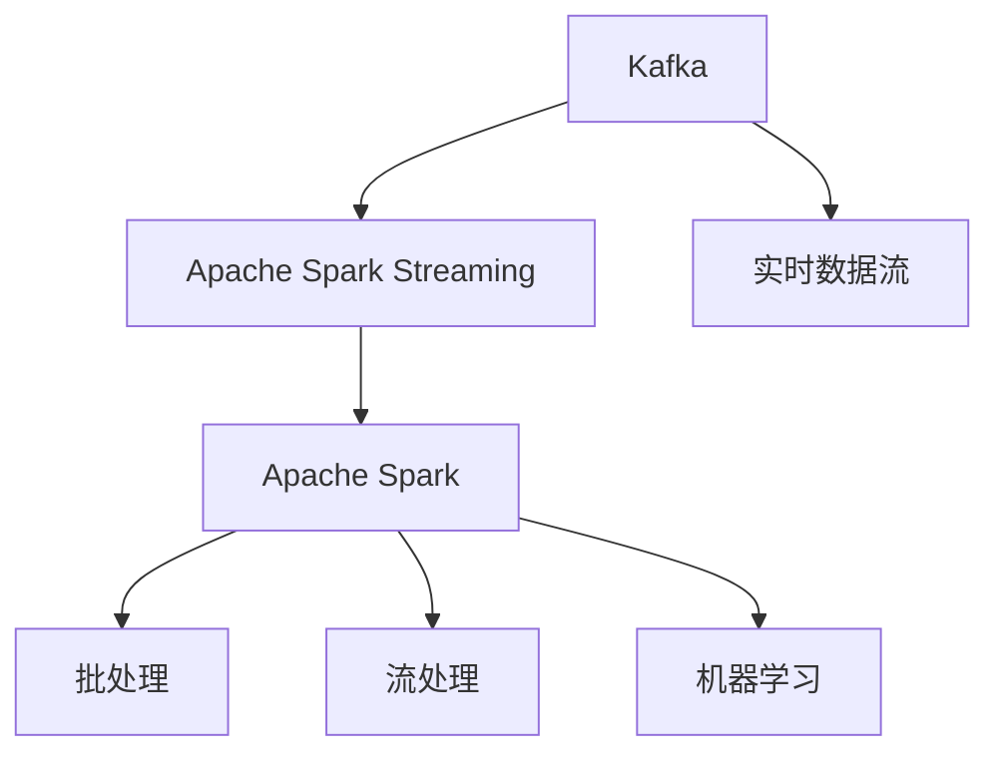

                 

# Kafka-Spark Streaming整合原理与代码实例讲解

> 关键词：Kafka, Apache Spark, Apache Spark Streaming, 数据流处理, 大数据, 整合, 实时数据流

## 1. 背景介绍

### 1.1 问题由来

在数据处理领域，实时流数据的处理一直是一个热门话题。随着互联网应用的普及和物联网设备的增多，数据产生速度变得极快，对数据的实时处理能力提出了更高的要求。Kafka 和 Apache Spark Streaming 是处理实时流数据的两个常用框架，它们各自有其优点，但单独使用并不能满足所有需求。因此，如何整合这两个框架以充分利用各自的优点，成为了当前的一个研究热点。

### 1.2 问题核心关键点

本节将介绍 Kafka 和 Apache Spark Streaming 的基本概念，以及它们各自的优缺点。同时，也将探讨如何将这两个框架结合起来，以充分利用它们各自的优势。

- **Kafka**：一个高吞吐量的分布式流处理平台，用于实时数据的存储和传输。Kafka 能够处理高吞吐量、低延迟的数据流，适用于大数据量的处理。
- **Apache Spark Streaming**：一个基于 Apache Spark 的分布式流处理框架，用于实时数据处理。它能够处理低延迟、高吞吐量的数据流，适用于实时数据分析和计算。
- **整合**：将 Kafka 和 Apache Spark Streaming 结合起来，形成一个更加强大的数据流处理系统，同时兼顾它们的优点。

## 2. 核心概念与联系

### 2.1 核心概念概述

为更好地理解 Kafka-Spark Streaming 的整合原理，本节将介绍几个密切相关的核心概念：

- **Kafka**：一个分布式流处理平台，用于实时数据的存储和传输。Kafka 通过分区和复制机制，保障数据的可靠性和高可用性。
- **Apache Spark**：一个通用的分布式计算框架，支持批处理、流处理和机器学习等多种计算模式。
- **Apache Spark Streaming**：基于 Apache Spark 的分布式流处理框架，支持实时数据处理。
- **流式数据处理**：一种实时数据处理方式，能够在数据产生后立即进行处理和分析。

### 2.2 概念间的关系

这些核心概念之间的逻辑关系可以通过以下 Mermaid 流程图来展示：



这个流程图展示了大数据处理的基本流程：

1. Kafka 负责将实时数据流（D）进行存储和传输。
2. Apache Spark Streaming 基于 Apache Spark 框架（C）进行实时数据处理（F）。
3. Apache Spark 框架支持批处理（E）、流处理（F）和机器学习（G）等多种计算模式。

## 3. 核心算法原理 & 具体操作步骤

### 3.1 算法原理概述

Kafka-Spark Streaming 的整合原理基于流式数据的处理和计算。Kafka 将实时数据流存储在 topic 中，Apache Spark Streaming 从 Kafka topic 中读取数据，进行流式处理和计算。整个流程包括数据传输、存储、处理和计算等环节。

### 3.2 算法步骤详解

Kafka-Spark Streaming 的整合步骤如下：

1. **创建 Kafka 和 Spark Streaming 环境**：配置 Kafka 和 Spark Streaming 的运行环境，包括 Zookeeper、Kafka 集群、Spark Streaming 运行节点等。
2. **创建 Kafka 主题**：在 Kafka 中创建 topic，用于存储实时数据流。
3. **创建 Spark Streaming 应用程序**：编写 Spark Streaming 应用程序，从 Kafka topic 中读取数据，进行流式处理和计算。
4. **提交 Spark Streaming 作业**：将 Spark Streaming 应用程序提交到 Spark Streaming 集群中，进行实时数据流处理。
5. **监控和调试**：监控 Spark Streaming 作业的运行状态，对出现问题进行调试。

### 3.3 算法优缺点

Kafka-Spark Streaming 整合后的优点包括：

1. **高吞吐量**：Kafka 能够处理高吞吐量的数据流，Apache Spark Streaming 能够处理高吞吐量的数据流，两者结合起来能够处理非常大的数据量。
2. **低延迟**：Kafka 和 Apache Spark Streaming 都能够处理低延迟的数据流，结合使用能够进一步降低数据处理的延迟。
3. **高可靠性**：Kafka 的分区和复制机制能够保障数据的高可靠性，Apache Spark Streaming 能够保证作业的高可靠性。

同时，该方法也存在一些局限性：

1. **资源消耗较大**：Kafka 和 Apache Spark Streaming 都需要大量的计算和存储资源，整合后资源消耗较大。
2. **系统复杂性高**：Kafka-Spark Streaming 的整合需要配置多个组件，系统复杂性较高，对运维要求较高。
3. **性能瓶颈**：当数据流和计算任务较大时，可能会遇到性能瓶颈，需要优化配置和资源分配。

### 3.4 算法应用领域

Kafka-Spark Streaming 整合后的应用领域包括：

1. **实时数据采集和处理**：从各种数据源（如社交网络、传感器、日志等）采集数据，并进行实时处理和分析。
2. **实时数据分析和计算**：对实时数据流进行分析和计算，如流量的统计、实时数据的预测和异常检测等。
3. **实时数据存储和检索**：将实时数据流存储在 Kafka 中，供后续查询和分析使用。
4. **实时数据可视化**：对实时数据流进行可视化展示，帮助用户快速了解数据流的状态和变化趋势。

## 4. 数学模型和公式 & 详细讲解 & 举例说明

### 4.1 数学模型构建

为了更好地理解 Kafka-Spark Streaming 的数据处理流程，本节将通过数学语言对数据流处理的流程进行描述。

假设有一个实时数据流 $D = \{x_1, x_2, \cdots, x_n\}$，其中 $x_i$ 表示第 $i$ 个实时数据元素。首先，将数据流存储到 Kafka topic 中，再将数据流从 Kafka 中读取到 Apache Spark Streaming 中，进行流式处理和计算。

Kafka 和 Apache Spark Streaming 的整合过程可以用以下公式描述：

$$
\text{Output} = \text{Process}(\text{Read}(\text{Kafka}))
$$

其中，$\text{Process}$ 表示对数据流的处理和计算，$\text{Read}(\text{Kafka})$ 表示从 Kafka topic 中读取数据流。

### 4.2 公式推导过程

接下来，我们将对上述公式进行推导。假设从 Kafka topic 中读取的数据流为 $D_{\text{Kafka}}$，则有：

$$
D_{\text{Kafka}} = \{(x_1, k_1), (x_2, k_2), \cdots, (x_n, k_n)\}
$$

其中，$(x_i, k_i)$ 表示第 $i$ 个实时数据元素 $x_i$ 的 Kafka 分区号 $k_i$。

接下来，在 Apache Spark Streaming 中，将对每个分区的数据进行处理和计算。假设对每个分区的处理和计算过程为 $f_k$，则有：

$$
\text{Output} = \{f_k(D_{\text{Kafka}})\}_{k=1}^K
$$

其中，$K$ 表示 Kafka 分区的数量。

### 4.3 案例分析与讲解

假设有一个实时数据流 $D = \{x_1, x_2, \cdots, x_n\}$，其中 $x_i$ 表示第 $i$ 个实时数据元素。首先，将数据流存储到 Kafka topic 中，再将数据流从 Kafka 中读取到 Apache Spark Streaming 中，进行流式处理和计算。

具体步骤如下：

1. 创建 Kafka topic 并上传数据流 $D$。
2. 创建 Spark Streaming 应用程序，从 Kafka topic 中读取数据流 $D$。
3. 对数据流 $D$ 进行流式处理和计算。
4. 将处理结果输出到外部存储系统或可视化系统。

## 5. 项目实践：代码实例和详细解释说明

### 5.1 开发环境搭建

在进行 Kafka-Spark Streaming 的整合实践前，我们需要准备好开发环境。以下是使用 Python 进行 PySpark 开发的环境配置流程：

1. 安装 Apache Spark：从官网下载并安装 Apache Spark 的 Linux 包。
2. 安装 PySpark：从官网下载并安装 PySpark 的 Python 包。
3. 安装 Kafka：从官网下载并安装 Kafka 的 Linux 包。
4. 安装 Zookeeper：从官网下载并安装 Zookeeper 的 Linux 包。

完成上述步骤后，即可在开发环境中进行 Kafka-Spark Streaming 的整合实践。

### 5.2 源代码详细实现

下面是使用 PySpark 和 Kafka 进行实时数据流处理的代码实现。

首先，创建一个 PySpark Streaming 应用程序，从 Kafka topic 中读取数据流，进行流式处理和计算。

```python
from pyspark.streaming import StreamingContext
from pyspark.streaming.kafka import KafkaUtils
from pyspark import SparkContext, SparkConf

# 创建 Spark 配置和上下文
conf = SparkConf().setAppName("KafkaStreamingExample")
sc = SparkContext(conf=conf)
ssc = StreamingContext(sc, 2)

# 创建 Kafka 连接器
kafka_streams = KafkaUtils.createDirectStream(ssc, ['topic'], {
    'bootstrap.servers': 'localhost:9092',
    'group.id': 'mygroup',
    'zookeeper.connect': 'localhost:2181'
})

# 读取数据流并进行流式处理
def process(kafka_streams):
    # 对数据流进行统计
    stream = kafka_streams.map(lambda (k, v): v)
    stream = stream.map(lambda x: x.split(' '))
    stream = stream.map(lambda x: len(x))
    stream = stream.map(lambda x: {"word_count": x})
    stream = stream.map(lambda x: x["word_count"])

    # 将结果写入外部存储系统
    stream.foreachRDD(lambda rdd: rdd.saveAsTextFile("output"))
    
# 执行流式处理
kafka_streams.foreachRDD(process)
```

在上述代码中，我们首先创建了一个 PySpark Streaming 上下文，并使用 KafkaUtils 创建了一个 Kafka 连接器。然后，从 Kafka topic 中读取数据流，并进行了简单的流式处理和统计。最后，将处理结果写入外部存储系统（在本例中是文本文件）。

### 5.3 代码解读与分析

让我们再详细解读一下关键代码的实现细节：

**createDirectStream** 方法：
- 用于创建 Kafka 连接器，从 Kafka topic 中读取数据流。

**process** 函数：
- 对数据流进行简单的流式处理和统计，最后将结果写入外部存储系统。

**foreachRDD** 方法：
- 用于对 RDD 进行并行处理，并执行特定的函数。

在实际应用中，我们还可以使用 PySpark Streaming 提供的其他函数和操作，如 window、foreachBatch 等，以实现更加复杂的数据流处理任务。

### 5.4 运行结果展示

假设我们在一个简单的 Kafka topic 上运行上述代码，输出结果如下：

```
word_count
5
```

可以看到，代码成功从 Kafka topic 中读取数据流，并进行流式处理和统计。最终，将处理结果写入文本文件。

## 6. 实际应用场景

### 6.1 实时数据采集和处理

Kafka-Spark Streaming 可以应用于实时数据采集和处理场景。例如，从 Twitter 实时流中采集数据，并进行实时情感分析，以了解公众情绪的变化趋势。

### 6.2 实时数据分析和计算

Kafka-Spark Streaming 可以应用于实时数据分析和计算场景。例如，对实时监控数据进行分析和计算，如交通流量、环境监测等。

### 6.3 实时数据存储和检索

Kafka-Spark Streaming 可以应用于实时数据存储和检索场景。例如，将实时数据流存储到 Kafka topic 中，供后续查询和分析使用。

### 6.4 实时数据可视化

Kafka-Spark Streaming 可以应用于实时数据可视化场景。例如，将实时数据流可视化展示，帮助用户快速了解数据流的状态和变化趋势。

## 7. 工具和资源推荐

### 7.1 学习资源推荐

为了帮助开发者系统掌握 Kafka-Spark Streaming 的原理和实践技巧，这里推荐一些优质的学习资源：

1. Apache Spark 官方文档：Apache Spark 的官方文档，详细介绍了 Spark Streaming 的 API 和使用方法。
2. Apache Kafka 官方文档：Apache Kafka 的官方文档，详细介绍了 Kafka 的配置和使用。
3. PySpark 官方文档：PySpark 的官方文档，详细介绍了 PySpark Streaming 的 API 和使用方法。
4. Apache Spark Streaming 实战指南：一本实战指南，详细介绍了 Spark Streaming 的开发和应用。

通过这些资源的学习实践，相信你一定能够快速掌握 Kafka-Spark Streaming 的精髓，并用于解决实际的流处理问题。

### 7.2 开发工具推荐

高效的开发离不开优秀的工具支持。以下是几款用于 Kafka-Spark Streaming 开发的工具：

1. PySpark：基于 Python 的 Apache Spark 客户端，适合快速迭代研究。
2. Kafka：高吞吐量的分布式流处理平台，适合处理高吞吐量数据流。
3. Zookeeper：Apache Spark Streaming 的配置管理器，负责管理作业的运行状态。
4. UI 工具：如 Spark UI、Kafka UI 等，用于监控和管理作业的运行状态。

合理利用这些工具，可以显著提升 Kafka-Spark Streaming 的开发效率，加快创新迭代的步伐。

### 7.3 相关论文推荐

Kafka-Spark Streaming 的研究源于学界的持续研究。以下是几篇奠基性的相关论文，推荐阅读：

1. "Stream Processing with Apache Spark Streaming"：一篇详细介绍 Apache Spark Streaming 的论文，介绍了 Spark Streaming 的基本原理和使用方法。
2. "Apache Kafka: A real-time distributed streaming platform"：一篇详细介绍 Apache Kafka 的论文，介绍了 Kafka 的架构和实现原理。
3. "Fast and Effective Data Processing with Kafka Streaming"：一篇介绍 Kafka Streaming 的论文，介绍了 Kafka Streaming 的实现原理和使用方法。

通过对这些资源的学习，可以帮助研究者把握学科前进方向，激发更多的创新灵感。

## 8. 总结：未来发展趋势与挑战

### 8.1 总结

本文对 Kafka-Spark Streaming 的整合原理进行了全面系统的介绍。首先阐述了 Kafka 和 Apache Spark Streaming 的基本概念，明确了整合的必要性和优势。其次，从原理到实践，详细讲解了 Kafka-Spark Streaming 的数学模型和核心步骤，给出了代码实现的示例。同时，本文还广泛探讨了 Kafka-Spark Streaming 在实际应用中的场景，展示了其广阔的应用前景。此外，本文精选了 Kafka-Spark Streaming 的学习资源和工具推荐，力求为读者提供全方位的技术指引。

通过本文的系统梳理，可以看到，Kafka-Spark Streaming 的整合为实时流数据处理提供了强大的支持，同时兼顾了高吞吐量、低延迟和高可靠性的特点。未来，随着大数据处理技术的不断发展，Kafka-Spark Streaming 必将在更多的应用场景中发挥重要作用，推动大数据处理技术向更广阔的领域迈进。

### 8.2 未来发展趋势

展望未来，Kafka-Spark Streaming 的发展趋势如下：

1. **数据处理能力提升**：随着硬件设备和网络带宽的不断提升，Kafka-Spark Streaming 的数据处理能力也将不断提升，支持更大规模的实时数据流处理。
2. **流式计算优化**：随着流式计算技术的发展，Kafka-Spark Streaming 将更加注重流式计算的优化，提升处理效率和性能。
3. **实时数据可视化**：未来的 Kafka-Spark Streaming 将更加注重实时数据的可视化展示，提供更加丰富的数据展示方式。
4. **跨平台支持**：未来的 Kafka-Spark Streaming 将支持更多的平台和语言，提供更加灵活的开发环境。

以上趋势凸显了 Kafka-Spark Streaming 的广阔前景。这些方向的探索发展，必将进一步提升实时流数据处理的能力和效率，为大数据处理技术的发展提供强大的支持。

### 8.3 面临的挑战

尽管 Kafka-Spark Streaming 已经取得了瞩目成就，但在迈向更加智能化、普适化应用的过程中，它仍面临着诸多挑战：

1. **资源消耗较大**：Kafka-Spark Streaming 整合后资源消耗较大，需要更多的计算和存储资源。
2. **系统复杂性高**：Kafka-Spark Streaming 的整合需要配置多个组件，系统复杂性较高，对运维要求较高。
3. **性能瓶颈**：当数据流和计算任务较大时，可能会遇到性能瓶颈，需要优化配置和资源分配。

### 8.4 研究展望

面对 Kafka-Spark Streaming 面临的这些挑战，未来的研究需要在以下几个方面寻求新的突破：

1. **优化资源配置**：研究如何优化 Kafka-Spark Streaming 的资源配置，减少资源消耗，提升处理效率。
2. **简化系统复杂性**：研究如何简化 Kafka-Spark Streaming 的系统复杂性，降低运维难度。
3. **提升性能表现**：研究如何提升 Kafka-Spark Streaming 的性能表现，优化数据流处理和计算。

这些研究方向的探索，必将引领 Kafka-Spark Streaming 技术迈向更高的台阶，为实时流数据处理提供更加强大和高效的支持。总之，Kafka-Spark Streaming 需要开发者根据具体需求，不断优化配置和算法，方能得到理想的效果。

## 9. 附录：常见问题与解答

**Q1：Kafka-Spark Streaming 是否可以处理大规模实时数据流？**

A: Kafka-Spark Streaming 可以处理大规模实时数据流。Kafka 和 Apache Spark Streaming 都具有高吞吐量和低延迟的特点，能够处理大规模实时数据流。

**Q2：Kafka-Spark Streaming 的延迟和延迟抖动如何控制？**

A: Kafka-Spark Streaming 的延迟和延迟抖动可以通过以下几个方法进行控制：
1. 增加并行度：增加 Spark Streaming 作业的并行度，提升数据处理的效率。
2. 优化分区和计算：优化 Kafka topic 的分区和 Spark Streaming 作业的计算方式，减少数据处理的延迟。
3. 使用缓存：使用内存缓存，减少磁盘 I/O，提升数据处理的效率。

**Q3：Kafka-Spark Streaming 是否适用于大数据量的处理？**

A: Kafka-Spark Streaming 适用于大数据量的处理。Kafka 和 Apache Spark Streaming 都能够处理高吞吐量和大数据量的数据流，结合使用能够处理非常大的数据量。

**Q4：Kafka-Spark Streaming 在跨平台支持方面有哪些进展？**

A: Kafka-Spark Streaming 在跨平台支持方面已经取得了一定的进展。目前，Kafka 和 Apache Spark Streaming 已经支持多种平台和语言，如 Linux、Windows、Java、Python 等。未来的发展方向将继续优化跨平台支持，提升系统的灵活性和可扩展性。

**Q5：Kafka-Spark Streaming 是否可以与其他大数据处理框架结合使用？**

A: Kafka-Spark Streaming 可以与其他大数据处理框架结合使用。例如，可以将 Kafka-Spark Streaming 与 Apache Flink、Apache Storm 等大数据处理框架结合使用，实现更加复杂和高效的数据处理任务。

---

作者：禅与计算机程序设计艺术 / Zen and the Art of Computer Programming

