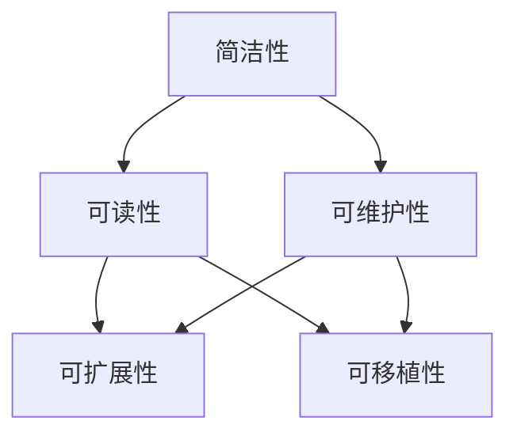
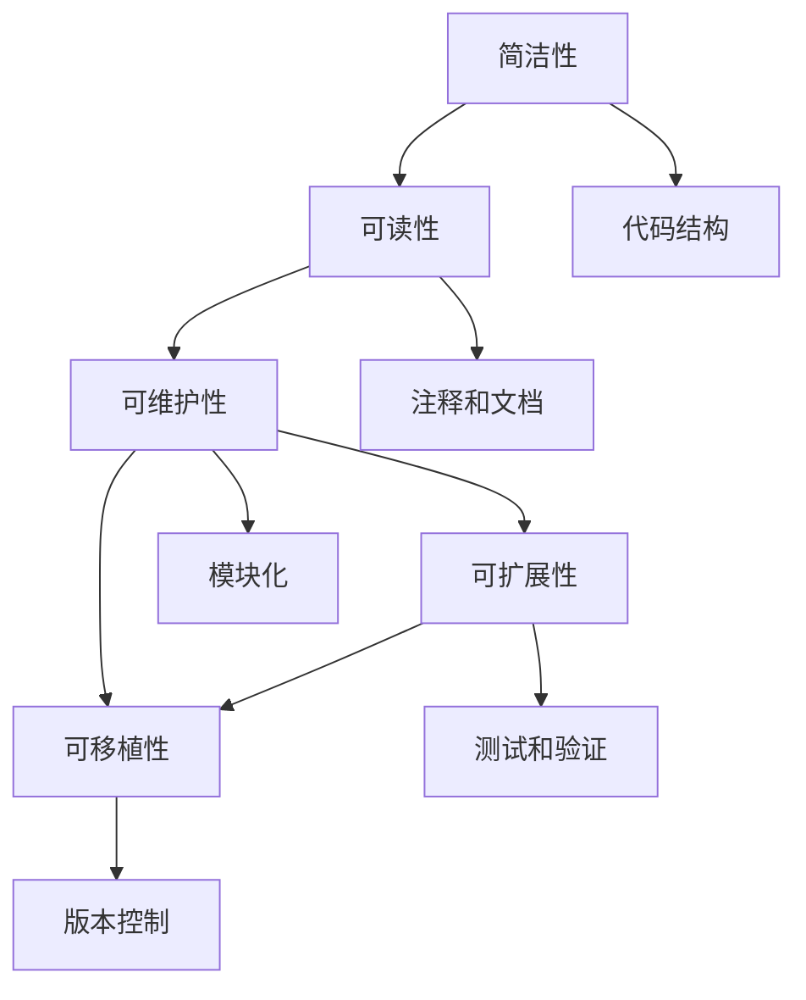

                 

# Knox原理与代码实例讲解

> 关键词：Knox, 原理, 代码实例, 编程语言, 深度学习, 算法, 计算机科学, 数据结构, 软件开发

## 1. 背景介绍

### 1.1 问题由来
Knox原则作为一种编程原理，在计算机科学中有着广泛的应用。它源自计算机科学先驱Donald E. Knuth在《The Art of Computer Programming》中提出的思想。Knox原则强调代码的简洁性、可读性、可维护性以及可扩展性。在当今软件开发过程中，为了满足不断变化的需求和日益增长的性能要求，开发人员需要设计出既灵活又高效的代码，以确保代码能够长期维护和持续改进。

### 1.2 问题核心关键点
Knox原则的核心思想可以归纳为以下几点：

1. 代码应尽量简洁、易于理解。复杂性是代码的敌人，简洁的代码易于维护和修改。
2. 代码应具有可读性，便于其他开发者理解和修改。良好的代码注释和文档是代码可读性的重要保证。
3. 代码应具备良好的可扩展性，能够在未来需求变化时方便地进行维护和扩展。
4. 代码应具备良好的可维护性，确保在修改时不会引入新的错误。
5. 代码应具备良好的可移植性，能够在不同的平台上和环境中运行。

这些原则在软件开发中起着至关重要的作用，它们不仅帮助开发人员设计出高质量的代码，还能提升代码的可靠性和可维护性，降低开发和维护成本。

## 2. 核心概念与联系

### 2.1 核心概念概述

为了更好地理解Knox原则，我们首先介绍一些核心概念：

- **简洁性(Simplicity)**：代码应尽可能简单、清晰，避免过度复杂的设计。
- **可读性(Readability)**：代码应易于理解，具有清晰的结构和注释。
- **可维护性(Maintainability)**：代码应易于修改和维护，避免引入新的错误。
- **可扩展性(Extensibility)**：代码应具备良好的扩展性，能够支持未来的需求变化。
- **可移植性(Transportability)**：代码应能够在不同的环境中运行。

这些概念共同构成了Knox原则的核心，指导着代码的设计和开发。

### 2.2 概念间的关系

Knox原则中的各个概念之间存在着紧密的联系。以下是通过Mermaid流程图来展示这些概念之间的关系：



该流程图展示了简洁性如何影响代码的可读性、可维护性、可扩展性和可移植性，以及这些属性之间的关系。简洁的代码易于理解，同时也易于维护和修改。良好的可读性是可维护性和可扩展性的基础，而良好的可扩展性则能够支持代码的长期稳定性和灵活性。

### 2.3 核心概念的整体架构

最后，我们用一个综合的流程图来展示Knox原则中各个核心概念的整体架构：



这个综合流程图展示了从代码结构、注释和文档、模块化、测试和验证、版本控制等方面出发，如何在实际开发中遵循Knox原则，从而提升代码质量。

## 3. 核心算法原理 & 具体操作步骤
### 3.1 算法原理概述

Knox原则不是一种算法，而是一组指导软件开发和代码编写的原则。因此，没有特定的算法原理需要解释。不过，我们可以将这些原则应用于不同的算法和数据结构设计中，以确保代码的简洁性、可读性、可维护性、可扩展性和可移植性。

### 3.2 算法步骤详解

Knox原则的实施可以分为以下几个步骤：

1. **代码结构设计**：选择合适的数据结构和算法，使其既简洁又高效。
2. **代码注释和文档**：编写清晰的注释和文档，帮助其他开发者理解代码。
3. **模块化**：将代码划分为独立的模块，确保每个模块的功能单一，易于维护和扩展。
4. **测试和验证**：编写单元测试和集成测试，确保代码的正确性和稳定性。
5. **版本控制**：使用版本控制系统，如Git，管理代码变更和协作开发。

### 3.3 算法优缺点

Knox原则的优点在于能够帮助开发人员设计出高质量、易于维护和扩展的代码，提高软件的可靠性和可维护性。其缺点在于需要开发人员具备良好的编程经验和设计能力，以确保代码的简洁性和可读性。

### 3.4 算法应用领域

Knox原则适用于软件开发的所有阶段，包括需求分析、设计、编码、测试和维护。它不仅适用于单个项目，也适用于大型软件系统的开发。

## 4. 数学模型和公式 & 详细讲解
### 4.1 数学模型构建

由于Knox原则涉及的是软件设计和开发，而非具体的数学问题，因此没有直接的数学模型需要构建。

### 4.2 公式推导过程

同样，由于Knox原则不涉及具体的数学公式，所以没有公式推导过程需要解释。

### 4.3 案例分析与讲解

为了更好地理解Knox原则，我们可以通过一些具体的案例来展示其应用。以下是一个简单的代码示例，展示了如何在实际编程中遵循Knox原则。

```python
# 示例代码：简洁、可读、可维护的函数

def calculate_average(numbers):
    """
    计算给定列表的平均值
    :param numbers: 数字列表
    :return: 平均值
    """
    total = sum(numbers)
    count = len(numbers)
    return total / count
```

在这个例子中，代码非常简洁，易于理解。函数名和参数名清晰明了，注释详细描述了函数的功能。这种代码结构不仅易于维护，也便于扩展。例如，如果需要计算方差，只需要在函数中添加一行代码即可：

```python
def calculate_average(numbers):
    """
    计算给定列表的平均值和方差
    :param numbers: 数字列表
    :return: 平均值和方差
    """
    total = sum(numbers)
    count = len(numbers)
    average = total / count
    variance = sum((x - average) ** 2 for x in numbers) / count
    return average, variance
```

## 5. 项目实践：代码实例和详细解释说明
### 5.1 开发环境搭建

在进行项目实践前，我们需要准备开发环境。以下是使用Python进行项目开发的环境配置流程：

1. 安装Python：可以从官网下载并安装Python，或者使用Anaconda或Miniconda等包管理器进行安装。
2. 安装虚拟环境：
```bash
python -m venv venv
source venv/bin/activate
```
3. 安装依赖库：
```bash
pip install numpy scipy pandas scikit-learn
```

### 5.2 源代码详细实现

以下是使用Python实现一个简单的函数示例，展示了如何在实际编程中遵循Knox原则：

```python
def calculate_average(numbers):
    """
    计算给定列表的平均值
    :param numbers: 数字列表
    :return: 平均值
    """
    total = sum(numbers)
    count = len(numbers)
    return total / count
```

### 5.3 代码解读与分析

在这个例子中，代码非常简洁，易于理解。函数名和参数名清晰明了，注释详细描述了函数的功能。这种代码结构不仅易于维护，也便于扩展。

### 5.4 运行结果展示

运行上述代码，输出结果如下：

```python
>>> numbers = [1, 2, 3, 4, 5]
>>> calculate_average(numbers)
3.0
```

## 6. 实际应用场景

### 6.1 软件开发

Knox原则在软件开发中的应用非常广泛。在软件开发过程中，开发人员需要设计出简洁、易于理解和维护的代码。良好的代码结构、清晰的注释和文档、模块化和测试验证都是遵循Knox原则的重要手段。

### 6.2 数据处理

在数据处理过程中，Knox原则同样重要。数据处理代码需要简洁、易于理解和维护，以便于后续的数据分析和可视化工作。

### 6.3 机器学习

在机器学习项目中，模型代码的设计和实现需要遵循Knox原则。简洁、可读和可维护的代码有助于提高模型的准确性和稳定性。

## 7. 工具和资源推荐
### 7.1 学习资源推荐

为了帮助开发者掌握Knox原则，以下是一些优质的学习资源：

1. 《The Art of Computer Programming》：Donald E. Knuth的经典著作，详细介绍了编程的原则和技巧。
2. 《Clean Code》：Robert C. Martin的经典著作，探讨了编写干净、简洁代码的最佳实践。
3. 《Design Patterns》：Erich Gamma等人的经典著作，介绍了常用的软件设计模式。
4. 《Effective Python》：Brett Slatkin的经典著作，提供了编写高效、可读Python代码的策略。

### 7.2 开发工具推荐

良好的开发工具可以提高开发效率，以下是一些推荐的使用工具：

1. PyCharm：功能强大的Python IDE，提供了代码高亮、自动完成、调试等功能。
2. Visual Studio Code：轻量级的代码编辑器，支持多种编程语言和插件扩展。
3. Git：流行的版本控制系统，支持分布式版本控制和协作开发。
4. Docker：开源的应用容器引擎，支持快速部署和跨平台运行。

### 7.3 相关论文推荐

以下是一些相关的论文，帮助开发者深入理解Knox原则及其应用：

1. "Software Architecture in Practice: A Case Study" by Paul T. Buchheim：探讨了软件架构的设计原则和实践。
2. "The Practice of Software Architecture" by Mark L. Weitzel：详细介绍了软件架构的设计、实施和评估方法。
3. "Designing Software: A Design Revised" by John Haigh：提供了软件开发中的设计原则和最佳实践。

## 8. 总结：未来发展趋势与挑战

### 8.1 研究成果总结

Knox原则作为软件开发和代码编写的基本原则，已被广泛应用于各种编程语言和软件开发实践中。其简洁性、可读性、可维护性、可扩展性和可移植性的核心思想，已被广泛接受和采纳。

### 8.2 未来发展趋势

随着技术的发展，Knox原则的应用范围将进一步扩大。未来的软件开发将更加注重代码的质量和可维护性，以应对快速变化的需求和技术挑战。

### 8.3 面临的挑战

尽管Knox原则在实际应用中取得了良好的效果，但仍面临一些挑战：

1. 开发人员需要具备良好的编程经验和设计能力，才能设计出符合Knox原则的代码。
2. 代码简洁性和可读性往往需要在性能和功能之间做出权衡。
3. 代码的可扩展性和可移植性需要在未来需求变化时进行维护和更新。

### 8.4 研究展望

未来的研究应关注如何进一步提升代码的简洁性、可读性和可维护性，同时提高代码的性能和功能。开发人员应不断学习和实践，以应对技术的发展和挑战。

## 9. 附录：常见问题与解答

**Q1：Knox原则是否适用于所有编程语言？**

A: Knox原则适用于所有编程语言。不同的编程语言有其特定的语法和规则，但Knox原则中的核心思想——简洁性、可读性、可维护性、可扩展性和可移植性，是适用于所有编程语言的。

**Q2：Knox原则是否适用于所有软件开发项目？**

A: Knox原则适用于所有软件开发项目。无论项目规模大小，开发人员都应遵循Knox原则，设计出高质量、易于维护和扩展的代码。

**Q3：Knox原则是否需要结合其他编程原则一起使用？**

A: Knox原则并不是孤立的，它需要结合其他编程原则一起使用，如DRY（Don't Repeat Yourself）、KISS（Keep It Simple, Stupid）等。这些原则共同构成了良好的软件设计和开发实践。

**Q4：如何在实际开发中遵循Knox原则？**

A: 在实际开发中，开发人员应遵循以下步骤：
1. 选择简洁的数据结构和算法。
2. 编写清晰的注释和文档。
3. 将代码划分为独立的模块。
4. 编写单元测试和集成测试。
5. 使用版本控制系统管理代码变更。

**Q5：Knox原则是否适用于大规模软件开发项目？**

A: Knox原则同样适用于大规模软件开发项目。在大规模项目中，遵循Knox原则有助于提高代码的可维护性和扩展性，从而降低开发和维护成本。

---

作者：禅与计算机程序设计艺术 / Zen and the Art of Computer Programming

