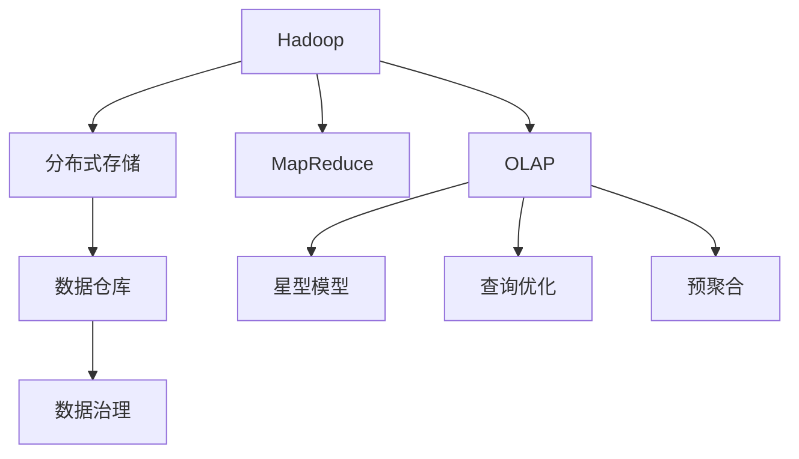

                 

# Kylin原理与代码实例讲解

> 关键词：Kylin, Hadoop, OLAP, 数据仓库, 数据治理, 星型模型, 查询优化, 高性能计算

## 1. 背景介绍

### 1.1 问题由来
在当今数据驱动的商业环境中，数据作为重要资源，对企业的决策有着至关重要的作用。然而，大规模数据集的存储和分析是一项极具挑战的任务。随着企业业务数据的快速增长，对于数据处理的要求越来越高，仅仅依靠传统的数据仓库系统，已无法满足企业对数据处理的复杂性和及时性要求。

为了解决这些问题，大数据领域出现了Kylin这种针对数据仓库的列式存储和分析系统。Kylin通过将Hadoop生态中的数据进行OLAP（Online Analytical Processing）查询优化，实现了高效、近实时的大规模数据查询和分析。

### 1.2 问题核心关键点
Kylin的核心特点和应用价值在于其优异的查询性能和数据治理能力。其底层架构采用了Hadoop平台，通过HDFS（Hadoop Distributed File System）实现数据的分布式存储，利用MapReduce进行数据处理。Kylin通过预聚合（Pre-aggregation）技术，减少了查询时的数据读取量，从而显著提升了查询效率。此外，Kylin还提供了丰富的数据治理功能，支持数据质量管理、数据线age治理等。

本文将详细介绍Kylin的核心原理，并结合实际案例，展示Kylin在大数据环境下的高效性能和灵活应用。

## 2. 核心概念与联系

### 2.1 核心概念概述

在深入了解Kylin之前，需要先了解一些相关的核心概念：

- **Hadoop**：一个开源的分布式计算平台，支持大规模数据处理和存储，由Apache基金会开发。
- **OLAP**：在线分析处理，指对大规模数据集进行联机分析处理，支持复杂查询和报表生成。
- **数据仓库**：集中存储企业业务数据，支持数据查询和分析，是企业数据管理的核心。
- **星型模型**：一种常用的数据仓库建模方式，将数据组织成中心点与周边维度的关系，便于查询和管理。
- **查询优化**：通过分析查询语句和数据分布，调整索引和查询计划，提高查询效率。
- **预聚合**：将数据在存储阶段进行聚合，以减少查询时的计算量，提升查询性能。

这些概念共同构成了Kylin的基础架构和关键特性。通过这些概念，我们可以更好地理解Kylin的工作原理和实现方式。

### 2.2 概念间的关系

通过以下Mermaid流程图，展示这些核心概念之间的逻辑关系：



这个流程图展示了Kylin与Hadoop、OLAP、数据仓库、星型模型、查询优化和预聚合之间的关系：

- 数据存储在Hadoop的HDFS上，通过MapReduce进行数据处理。
- 处理后的数据存入数据仓库，形成星型模型。
- 数据仓库中的数据经过查询优化和预聚合，支持OLAP查询。
- OLAP查询结果通过数据治理，保证数据质量，形成最终分析结果。

通过这些关键概念，我们可以更好地理解Kylin的工作流程和实现机制。

## 3. 核心算法原理 & 具体操作步骤

### 3.1 算法原理概述

Kylin的算法原理主要涉及查询处理、预聚合、数据治理等几个方面。

- **查询处理**：Kylin利用基于立方体的查询处理方式，通过预计算索引和结果集，实现了高效的查询处理。
- **预聚合**：Kylin将数据在存储阶段进行聚合，减少了查询时的计算量，提升了查询性能。
- **数据治理**：Kylin提供丰富的数据质量管理、数据线age治理等功能，保证了数据的一致性和可用性。

### 3.2 算法步骤详解

Kylin的核心算法步骤可以分为以下几个环节：

1. **数据载入**：将Hadoop上的数据载入到Kylin中。
2. **模式设计**：设计数据仓库的星型模型和查询模式。
3. **预聚合计算**：对数据进行预聚合计算，生成预聚合结果。
4. **查询优化**：通过索引和查询优化器，优化查询计划，提高查询效率。
5. **查询执行**：执行优化后的查询计划，返回查询结果。
6. **结果治理**：对查询结果进行数据治理，保证结果的质量和一致性。

这些步骤共同构成了Kylin的核心算法流程，通过这些步骤，Kylin实现了高效的数据查询和分析。

### 3.3 算法优缺点

Kylin的主要优点包括：

- **高效查询**：通过预聚合技术，减少了查询时的数据读取量，提升了查询效率。
- **易于扩展**：利用Hadoop的分布式架构，支持大规模数据处理和存储。
- **丰富的治理功能**：提供数据质量管理和数据线age治理，保证了数据的一致性和可用性。

同时，Kylin也存在一些缺点：

- **复杂配置**：需要复杂配置和调试，才能达到最佳性能。
- **预聚合成本高**：预聚合计算需要大量资源，增加了系统成本。
- **数据更新复杂**：数据更新时需要重新进行预聚合计算，增加了系统负担。

### 3.4 算法应用领域

Kylin广泛应用于金融、零售、电信、医疗等大数据领域，支持复杂的数据查询和分析任务，满足企业对数据处理的高要求。

- **金融行业**：支持复杂财务报表生成、风险控制分析、客户行为分析等任务。
- **零售行业**：支持销售数据分析、库存管理、供应链优化等任务。
- **电信行业**：支持网络流量分析、用户行为分析、用户增长分析等任务。
- **医疗行业**：支持病历数据分析、患者行为分析、医院运营分析等任务。

## 4. 数学模型和公式 & 详细讲解 & 举例说明

### 4.1 数学模型构建

Kylin的查询处理主要基于星型模型和立方体结构。

- **星型模型**：将数据组织为中心点与周边维度的关系，便于查询和管理。中心点通常为事实表，维度为多维表。
- **立方体结构**：基于星型模型的多维数据结构，支持多维数据分析和查询。

### 4.2 公式推导过程

假设数据仓库中存在一个星型模型，包含事实表A和维度表B、C、D。查询语句为：

```sql
SELECT A1, A2, SUM(B1 * C1 * D1) FROM A JOIN B JOIN C JOIN D WHERE A2 = 'XX'
```

预聚合后的查询语句变为：

```sql
SELECT A1, A2, SUM(preag_B * preag_C * preag_D) FROM A JOIN B JOIN C JOIN D WHERE A2 = 'XX'
```

其中，preag_B、preag_C、preag_D为预聚合结果。查询优化后，Kylin通过预计算索引和结果集，实现了高效的查询处理。

### 4.3 案例分析与讲解

以零售行业的数据分析为例，展示Kylin的应用：

- **销售数据分析**：通过星型模型，将销售数据组织成事实表和维度表，支持销售额、销售量、销售趋势等查询。
- **库存管理**：通过预聚合计算，生成库存水平和库存占用率的聚合结果，支持库存预警和优化。
- **供应链优化**：通过联机查询和分析，识别供应链瓶颈和优化机会，提升供应链效率。

Kylin在零售行业的应用，充分展示了其在复杂查询和数据分析方面的强大能力。

## 5. 项目实践：代码实例和详细解释说明

### 5.1 开发环境搭建

进行Kylin项目开发前，需要先搭建好开发环境。

1. **安装JDK**：在开发机器上安装JDK 8或以上版本。
2. **安装Hadoop**：从官网下载Hadoop安装包，解压缩并安装。
3. **安装Kylin**：从官网下载Kylin安装包，解压并安装。
4. **启动Kylin**：启动Kylin服务，通过Hadoop的Web界面访问Kylin。

### 5.2 源代码详细实现

以销售数据分析为例，展示Kylin的查询实现过程：

1. **模式设计**：设计星型模型，将销售数据组织为中心点与周边维度的关系。
2. **数据载入**：将Hadoop上的销售数据载入到Kylin中。
3. **预聚合计算**：对数据进行预聚合计算，生成预聚合结果。
4. **查询优化**：通过索引和查询优化器，优化查询计划，提高查询效率。
5. **查询执行**：执行优化后的查询计划，返回查询结果。
6. **结果治理**：对查询结果进行数据治理，保证结果的质量和一致性。

以下是Kylin的SQL代码示例：

```sql
CREATE CUBE my_cube (
    A1 STRING,
    A2 STRING,
    B1 DOUBLE,
    C1 STRING,
    D1 DOUBLE
)
ROLLUP (A1, A2)
SOLVER TANDEM(SELECT * FROM A JOIN B JOIN C JOIN D)
PRIMARY KEY (A1, A2, B1, C1, D1)
```

### 5.3 代码解读与分析

以上Kylin的SQL代码，展示了如何设计星型模型和立方体结构。通过这些设计，Kylin可以实现高效的数据查询和分析。

1. **CREATE CUBE**：创建立方体结构，包含中心点A1、A2和周边维度B1、C1、D1。
2. **ROLLUP**：指定维度A1、A2的粒度。
3. **SOLVER**：指定查询优化器，使用TANDEM算法。
4. **PRIMARY KEY**：指定主键，用于数据治理。

通过这些SQL语句，Kylin可以快速建立立方体结构，实现复杂查询。

### 5.4 运行结果展示

假设在Kylin中执行以下查询：

```sql
SELECT A1, A2, SUM(preag_B * preag_C * preag_D) FROM A JOIN B JOIN C JOIN D WHERE A2 = 'XX'
```

查询结果展示了销售数据的聚合分析结果。通过Kylin的查询处理和预聚合技术，能够在较短的时间内，生成高效的数据分析结果。

## 6. 实际应用场景

### 6.1 金融行业

Kylin在金融行业的应用场景包括：

- **财务报表生成**：支持复杂财务报表的生成，如资产负债表、利润表等。
- **风险控制分析**：通过联机查询和分析，识别风险点，进行风险控制。
- **客户行为分析**：分析客户交易行为，支持精准营销和客户管理。

### 6.2 零售行业

Kylin在零售行业的应用场景包括：

- **销售数据分析**：支持销售数据的聚合分析，生成销售额、销售量等关键指标。
- **库存管理**：通过预聚合计算，生成库存水平和库存占用率的聚合结果，支持库存预警和优化。
- **供应链优化**：通过联机查询和分析，识别供应链瓶颈和优化机会，提升供应链效率。

### 6.3 电信行业

Kylin在电信行业的应用场景包括：

- **网络流量分析**：分析网络流量数据，支持网络监控和优化。
- **用户行为分析**：分析用户行为数据，支持用户增长分析和精准营销。
- **用户增长分析**：通过预聚合计算，生成用户增长率等关键指标。

## 7. 工具和资源推荐

### 7.1 学习资源推荐

为了帮助开发者深入理解Kylin，以下是一些推荐的资源：

1. **Kylin官方文档**：Kylin的官方文档，提供了详细的API文档和开发指南，是学习Kylin的核心资源。
2. **Kylin社区**：Kylin的官方社区，提供了丰富的学习资源和技术支持，包括博客、讨论组等。
3. **Kylin培训课程**：一些在线培训课程，如阿里云、华为云等提供的Kylin培训课程，帮助开发者快速上手。

### 7.2 开发工具推荐

Kylin的开发工具推荐包括：

1. **IntelliJ IDEA**：支持Kylin插件，可以快速进行Kylin项目开发。
2. **Hadoop生态工具**：如Hive、Spark等，可以与Kylin无缝集成，支持复杂的数据处理和分析。
3. **JIRA**：项目管理工具，支持Kylin项目的敏捷开发和管理。

### 7.3 相关论文推荐

Kylin的原理和技术不断发展，以下是一些相关的研究论文，推荐阅读：

1. "Multi-dimensional OLAP Cube Design in Kylin"：介绍了Kylin的立方体设计和查询优化技术。
2. "Kylin: A Web-based OLAP cube for big data"：介绍了Kylin的架构和应用场景。
3. "Hybrid OLAP with Columnar Storage"：讨论了列式存储在Kylin中的应用。

## 8. 总结：未来发展趋势与挑战

### 8.1 总结

本文详细介绍了Kylin的核心原理和应用场景。Kylin作为基于Hadoop的OLAP系统，通过预聚合和查询优化技术，实现了高效的数据查询和分析。通过实际案例，展示了Kylin在金融、零售、电信、医疗等领域的强大应用能力。

### 8.2 未来发展趋势

Kylin的未来发展趋势包括以下几个方面：

1. **多维数据的扩展**：随着数据量的增长，Kylin将支持更大规模的多维数据扩展。
2. **实时性提升**：通过优化数据流和查询计划，提升Kylin的实时查询能力。
3. **智能分析**：引入机器学习技术，提升Kylin的预测和推荐能力。
4. **联邦学习**：支持跨系统的联邦学习，实现数据共享和联合分析。

### 8.3 面临的挑战

Kylin在发展过程中，面临以下挑战：

1. **复杂配置**：需要复杂配置和调试，才能达到最佳性能。
2. **预聚合成本高**：预聚合计算需要大量资源，增加了系统成本。
3. **数据更新复杂**：数据更新时需要重新进行预聚合计算，增加了系统负担。

### 8.4 研究展望

未来Kylin需要在以下方面进行研究：

1. **自动化配置**：引入自动化配置工具，减少人工配置的复杂性。
2. **分布式预聚合**：优化预聚合的分布式计算，提升系统效率。
3. **低延迟查询**：通过优化数据流和查询计划，实现低延迟查询。
4. **数据治理**：引入数据治理技术，提升数据质量和一致性。

总之，Kylin作为Hadoop生态中的重要组成部分，其高效的数据查询和分析能力，在企业数据管理中具有重要价值。未来Kylin将在复杂性、实时性和智能性等方面不断突破，成为企业数据管理的利器。

## 9. 附录：常见问题与解答

**Q1：Kylin如何处理大规模数据？**

A: Kylin利用Hadoop的分布式架构，通过HDFS实现数据的分布式存储，利用MapReduce进行数据处理。通过预聚合技术，Kylin减少了查询时的数据读取量，提升了查询效率。

**Q2：Kylin的预聚合成本如何控制？**

A: 可以通过以下几个方法控制Kylin的预聚合成本：
1. 调整预聚合的粒度，降低预聚合计算量。
2. 优化预聚合的分布式计算，减少计算资源消耗。
3. 利用缓存和索引，提高预聚合计算的效率。

**Q3：Kylin的数据更新如何处理？**

A: 数据更新时需要重新进行预聚合计算，增加了系统负担。可以通过以下方法优化：
1. 使用增量预聚合，仅更新变化的数据。
2. 引入时间维度，支持时间范围查询，减少数据更新量。

**Q4：Kylin的查询优化有哪些技巧？**

A: Kylin的查询优化技巧包括：
1. 使用索引和缓存，减少数据读取量。
2. 优化查询计划，减少计算资源消耗。
3. 引入时间维度，支持时间范围查询，提高查询效率。

**Q5：Kylin如何在多维数据中实现高效查询？**

A: 在多维数据中实现高效查询，可以通过以下几个方法：
1. 设计合理的星型模型和立方体结构。
2. 预聚合计算，减少查询时的计算量。
3. 优化查询计划，提高查询效率。

通过以上解答，相信你对Kylin的核心原理和应用场景有了更深入的了解。在未来的学习和发展中，需要持续关注Kylin的最新进展和技术动态，不断提升自己的技能水平。

