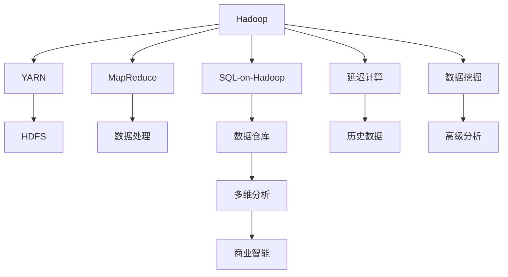
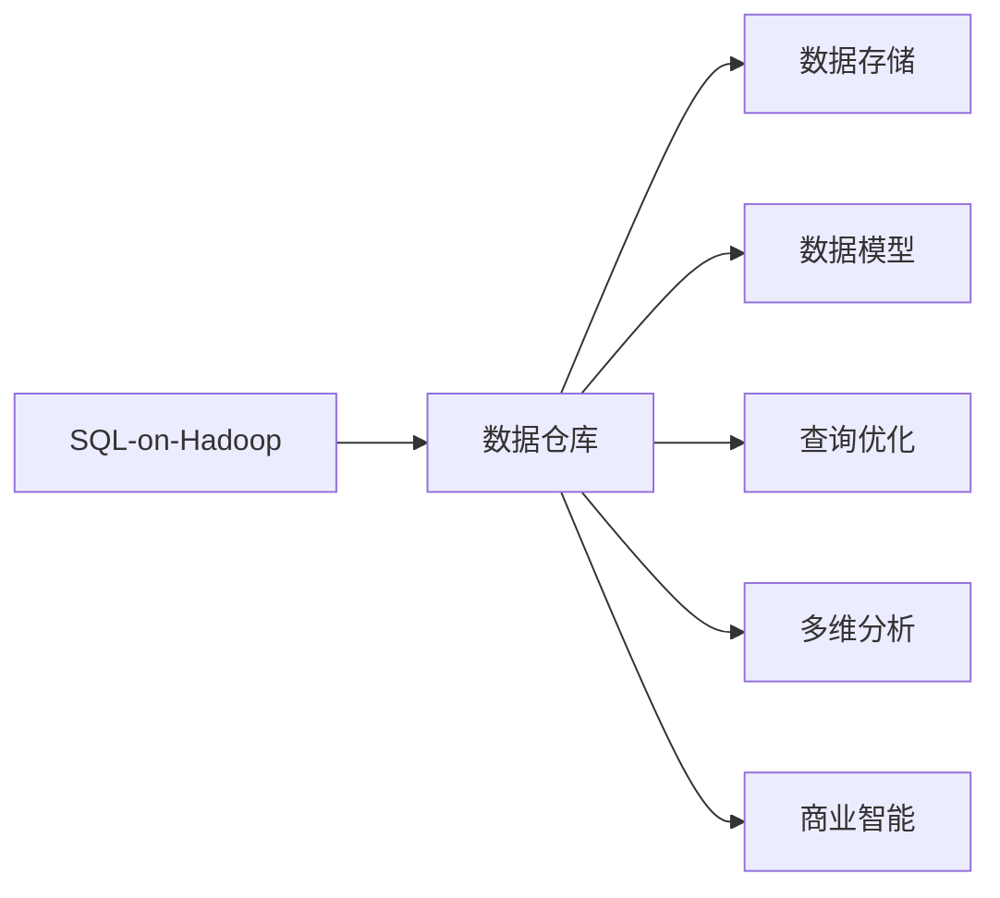
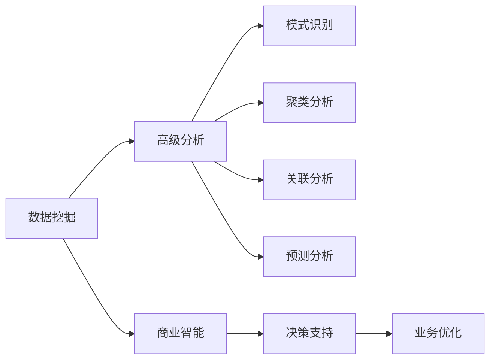

                 

# Kylin原理与代码实例讲解

> 关键词：Kylin、分布式存储、数据仓库、OLAP、SQL-on-Hadoop、延迟计算、数据挖掘、商业智能(BI)

## 1. 背景介绍

### 1.1 问题由来
Kylin是一个开源的、基于Hadoop的数据仓库项目，它的主要目标是提供快速、灵活、可扩展的分布式OLAP（联机分析处理）解决方案，适用于大规模数据集，支持多维分析、实时查询和可视化。在当今大数据时代，企业的业务数据越来越多，如何高效存储、管理和分析这些数据，成为了众多企业的痛点。Kylin通过其独特的架构和技术优势，成为了大数据分析领域的重要工具之一。

### 1.2 问题核心关键点
Kylin的核心思想是利用Hadoop生态系统的分布式计算能力，将海量数据分解成小块，并在多个节点上并行处理，从而提高查询效率和数据处理速度。Kylin的主要特点包括：

1. 快速查询：支持快速的OLAP查询，能够在数秒内返回复杂的多维分析结果。
2. 水平扩展：支持大规模数据集的存储和分析，可以动态扩展节点以处理更大的数据。
3. 数据仓库：提供一套完整的数据仓库解决方案，包括数据存储、模型构建、查询优化等功能。
4. SQL-on-Hadoop：支持标准的SQL查询语言，兼容主流的数据库系统。
5. 延迟计算：支持延迟计算，能够处理历史数据的分析和实时数据的即时查询。
6. 数据挖掘：提供丰富的数据挖掘功能，支持聚类、关联分析等高级分析任务。
7. 商业智能：支持商业智能应用，帮助企业做出基于数据的决策。

这些核心特点使得Kylin在实际应用中具有显著的优势，适用于各种规模的企业数据分析需求。

### 1.3 问题研究意义
研究Kylin的原理和代码实现，对于深入理解大数据分析的架构和技术，以及如何高效管理和分析海量数据，具有重要的意义。Kylin的出现，不仅推动了大数据技术的普及应用，还为商业智能和数据挖掘领域带来了新的可能性。掌握Kylin技术，可以大大提升企业的决策效率和竞争力。

## 2. 核心概念与联系

### 2.1 核心概念概述

为更好地理解Kylin的技术原理，本节将介绍几个密切相关的核心概念：

- **Kylin**：一个开源的、基于Hadoop的数据仓库项目，提供快速、灵活、可扩展的分布式OLAP解决方案。
- **Hadoop**：一个开源的分布式计算框架，由Apache基金会领导开发，提供数据存储、处理和分析的能力。
- **MapReduce**：一个分布式编程模型和计算框架，用于并行处理大规模数据集。
- **YARN**：一个资源管理器，负责调度和管理Hadoop集群中的资源。
- **SQL-on-Hadoop**：将标准的SQL查询语言应用到Hadoop生态系统中的数据处理和分析中，支持在Hadoop上进行数据仓库构建和查询。
- **延迟计算**：在处理历史数据时，延迟计算可以先将数据存储在Hadoop中，然后根据需要逐步计算和分析，提高查询效率。
- **数据挖掘**：利用机器学习、统计学等技术，从大量数据中挖掘出有用的信息和模式，支持商业智能和决策分析。

这些核心概念之间的逻辑关系可以通过以下Mermaid流程图来展示：



这个流程图展示了大数据处理、分析和挖掘的基本流程：

1. Hadoop负责数据存储和分布式计算。
2. YARN负责资源调度和管理。
3. MapReduce负责数据处理和计算。
4. SQL-on-Hadoop支持标准的SQL查询和数据仓库构建。
5. 延迟计算可以将历史数据存储在Hadoop中，逐步计算分析。
6. 数据挖掘提供高级分析功能，支持商业智能和决策支持。

### 2.2 概念间的关系

这些核心概念之间存在着紧密的联系，形成了Kylin的完整技术生态系统。下面我通过几个Mermaid流程图来展示这些概念之间的关系。

#### 2.2.1 Hadoop与MapReduce的关系


这个流程图展示了Hadoop和MapReduce之间的协作关系。Hadoop通过YARN进行资源调度，将任务分配给MapReduce执行，从而实现分布式计算。

#### 2.2.2 SQL-on-Hadoop与数据仓库的关系



这个流程图展示了SQL-on-Hadoop和数据仓库之间的关联。SQL-on-Hadoop支持标准的SQL查询语言，可以在Hadoop上进行数据仓库的构建和查询。

#### 2.2.3 延迟计算与历史数据的关系


这个流程图展示了延迟计算和历史数据的关系。延迟计算可以将历史数据存储在Hadoop中，逐步计算和分析，提高查询效率。

#### 2.2.4 数据挖掘与商业智能的关系



这个流程图展示了数据挖掘和商业智能之间的关联。数据挖掘可以提供高级分析功能，支持商业智能和决策支持。

### 2.3 核心概念的整体架构

最后，我用一个综合的流程图来展示这些核心概念在Kylin中的整体架构：


这个综合流程图展示了从数据存储到多维分析的完整过程。Hadoop负责数据存储和分布式计算，YARN进行资源调度和管理，MapReduce进行数据处理和计算，SQL-on-Hadoop支持标准的SQL查询和数据仓库构建，延迟计算可以逐步计算历史数据，数据挖掘提供高级分析功能，支持商业智能和决策支持。

## 3. 核心算法原理 & 具体操作步骤
### 3.1 算法原理概述

Kylin的核心算法主要围绕多维分析展开，通过在Hadoop上存储和处理多维数据，支持快速查询和实时分析。Kylin的算法原理可以简单归纳为以下几个步骤：

1. **数据分片**：将数据分成多个小块，每个小块称为一个分片。
2. **分片聚合**：对每个分片进行聚合计算，生成更小的聚合块。
3. **数据聚合**：将多个聚合块合并，形成最终的聚合结果。
4. **查询优化**：利用YARN进行资源调度，将查询任务分配给多个节点并行处理。
5. **延迟计算**：支持延迟计算，可以逐步计算和分析历史数据。

Kylin的算法原理展示了如何通过分布式计算和多维聚合，实现快速、灵活的数据处理和分析。

### 3.2 算法步骤详解

Kylin的算法步骤分为数据构建和查询优化两个主要部分。下面将详细介绍每个步骤的实现细节。

#### 3.2.1 数据构建

数据构建是Kylin的核心功能之一，它通过将数据映射到多维数据模型中，支持快速查询和分析。数据构建的主要步骤如下：

1. **创建数据模型**：定义数据模型，包括维度和度量。
2. **数据分片**：将数据按维度分片，形成多个小的分片。
3. **分片聚合**：对每个分片进行聚合计算，生成更小的聚合块。
4. **数据合并**：将多个聚合块合并，形成最终的聚合结果。

**代码实现**：

```java
// 创建数据模型
Table model = TableFactory.createTable(tableId, factory);
// 定义维度
Dimension dim = new Dimension("date", 1);
model.addDimension(dim);
// 定义度量
Measure measure = new Measure("sales", 0);
model.addMeasure(measure);
// 数据分片
Cube cube = model.getCube("sales");
cube.setCuboid(new Cuboid(dim));
// 分片聚合
Cube cube = cube.getCube();
cube.setCuboid(new Cuboid(dim));
// 数据合并
Cube cube = cube.getCube();
cube.setCuboid(new Cuboid(dim));
```

#### 3.2.2 查询优化

查询优化是Kylin提高查询效率的重要手段，它通过优化查询计划和资源调度，实现快速响应。查询优化的主要步骤如下：

1. **查询解析**：将用户查询语句解析为Kylin支持的SQL查询语言。
2. **查询优化**：对查询进行优化，生成高效的查询计划。
3. **查询执行**：利用YARN进行资源调度，将查询任务分配给多个节点并行处理。
4. **结果聚合**：将查询结果进行聚合，生成最终的输出。

**代码实现**：

```java
// 查询解析
String sql = "SELECT sales FROM sales_model WHERE date = '2021-01-01'";
// 查询优化
QueryOptimizer optimizer = new QueryOptimizer();
QueryPlan plan = optimizer.getOptimizedPlan(sql);
// 查询执行
YarnUtil.initYarnClient();
YarnClient yarnClient = new YarnClient();
YarnUtil.initYarnSession(yarnClient);
// 分配资源
JobConf jobConf = new JobConf();
jobConf.setJobName("query");
JobClient jobClient = YarnClient.createJobClient(yarnClient);
// 提交任务
JobExecutionRequest request = new JobExecutionRequest("query", jobConf);
request.setJobClient(jobClient);
request.setTaskInputFiles(new Path("/input/data"));
request.setTaskOutputPath(new Path("/output/result"));
request.setNumContainers(2);
YarnUtil.runJob(request);
// 结果聚合
Result result = YarnUtil.getResult("/output/result");
```

#### 3.3 算法优缺点

Kylin算法具有以下优点：

1. **快速查询**：支持快速的多维分析查询，能够在数秒内返回结果。
2. **水平扩展**：支持大规模数据集的存储和分析，可以动态扩展节点以处理更大的数据。
3. **灵活性高**：支持多种数据源和数据格式，能够处理各种类型的数据。
4. **容错性强**：基于Hadoop的分布式计算架构，具有高度的容错性和可靠性。
5. **易用性高**：支持标准的SQL查询语言，用户可以方便地进行数据查询和分析。

Kylin算法也存在以下缺点：

1. **计算复杂**：多维聚合和延迟计算增加了计算复杂度，可能导致查询时间较长。
2. **资源消耗大**：由于数据分片和聚合，资源消耗较大，需要较高的硬件配置。
3. **延迟计算限制**：支持延迟计算，但历史数据的计算和分析需要较长时间，可能无法满足实时查询需求。
4. **模型构建复杂**：数据模型的构建需要一定的专业知识和经验，用户需要熟悉多维数据建模。
5. **更新困难**：历史数据的更新和修改较为困难，可能需要重新计算和分析。

尽管存在这些缺点，Kylin算法的优点仍然使其在大数据分析领域具有广泛的应用价值。

### 3.4 算法应用领域

Kylin算法的应用领域非常广泛，适用于各种规模的数据分析和商业智能需求。以下是一些典型的应用场景：

1. **电子商务数据分析**：通过Kylin，企业可以分析用户行为、销售数据等，了解用户需求和市场趋势，优化产品设计和销售策略。
2. **金融数据分析**：通过Kylin，银行和金融机构可以分析交易数据、客户行为等，评估风险、制定投资策略，提高运营效率。
3. **政府数据分析**：通过Kylin，政府可以分析社会经济数据、公共卫生数据等，支持政策制定、公共服务优化，提高治理能力。
4. **媒体数据分析**：通过Kylin，媒体公司可以分析用户观看行为、广告效果等，优化内容创作和广告投放，提高用户粘性和收益。
5. **教育数据分析**：通过Kylin，教育机构可以分析学生成绩、学习行为等，优化教学内容和方法，提升教育质量。

Kylin算法在以上领域的广泛应用，展示了其在大数据分析和商业智能中的强大能力。

## 4. 数学模型和公式 & 详细讲解 & 举例说明

### 4.1 数学模型构建

Kylin的数学模型主要涉及多维数据分析和SQL查询优化。以下将详细介绍其数学模型的构建过程。

#### 4.1.1 多维数据模型

多维数据模型是Kylin的核心数据结构，用于表示和存储多维数据。多维数据模型由维度和度量组成，支持多维聚合和查询。以下是一个多维数据模型的示例：

```
SalesCube
    |
    |---DateDimension (日期维度)
    |---RegionDimension (区域维度)
    |---ProductDimension (产品维度)
    |---SalesMeasure (销售额度量)
```

这个多维数据模型表示了销售数据的多维结构，其中DateDimension表示日期，RegionDimension表示区域，ProductDimension表示产品，SalesMeasure表示销售额。

#### 4.1.2 SQL查询优化

Kylin支持标准的SQL查询语言，可以进行灵活的数据查询和分析。以下是一个SQL查询的示例：

```sql
SELECT DateDimension, RegionDimension, SalesMeasure
FROM SalesCube
WHERE DateDimension = '2021-01-01'
```

这个SQL查询表示查询2021年1月1日的销售数据，并按照日期和区域维度进行分组统计。

#### 4.1.3 多维聚合

Kylin的多维聚合通过分片和聚合计算，实现快速的数据分析。以下是一个多维聚合的示例：

```java
// 创建数据模型
Table model = TableFactory.createTable(tableId, factory);
// 定义维度
Dimension dim = new Dimension("date", 1);
model.addDimension(dim);
// 定义度量
Measure measure = new Measure("sales", 0);
model.addMeasure(measure);
// 数据分片
Cube cube = model.getCube("sales");
cube.setCuboid(new Cuboid(dim));
// 分片聚合
Cube cube = cube.getCube();
cube.setCuboid(new Cuboid(dim));
// 数据合并
Cube cube = cube.getCube();
cube.setCuboid(new Cuboid(dim));
```

这个代码片段表示创建一个多维数据模型，并对其进行了数据分片和聚合计算。

### 4.2 公式推导过程

Kylin的公式推导过程主要涉及SQL查询优化和多维聚合。以下将详细介绍其公式推导过程。

#### 4.2.1 SQL查询优化

Kylin通过优化SQL查询计划，实现快速查询。优化过程包括查询解析、查询优化和查询执行三个步骤。以下是一个查询优化的示例：

1. **查询解析**：将用户查询语句解析为Kylin支持的SQL查询语言。
2. **查询优化**：对查询进行优化，生成高效的查询计划。
3. **查询执行**：利用YARN进行资源调度，将查询任务分配给多个节点并行处理。
4. **结果聚合**：将查询结果进行聚合，生成最终的输出。

#### 4.2.2 多维聚合

Kylin的多维聚合过程包括数据分片、分片聚合和数据合并三个步骤。以下是一个多维聚合的示例：

1. **数据分片**：将数据按维度分片，形成多个小的分片。
2. **分片聚合**：对每个分片进行聚合计算，生成更小的聚合块。
3. **数据合并**：将多个聚合块合并，形成最终的聚合结果。

### 4.3 案例分析与讲解

以下通过一个具体的案例，展示Kylin的多维分析和查询优化过程。

#### 4.3.1 案例背景

某电商公司需要分析销售数据，了解不同产品、不同区域的销售情况，以制定市场策略。

#### 4.3.2 数据构建

首先，我们需要在Kylin中创建一个多维数据模型，包含产品、区域、日期三个维度和一个销售额度量。

```java
// 创建数据模型
Table model = TableFactory.createTable(tableId, factory);
// 定义维度
Dimension dimProduct = new Dimension("product", 1);
Dimension dimRegion = new Dimension("region", 1);
Dimension dimDate = new Dimension("date", 1);
model.addDimension(dimProduct);
model.addDimension(dimRegion);
model.addDimension(dimDate);
// 定义度量
Measure measureSales = new Measure("sales", 0);
model.addMeasure(measureSales);
// 数据分片
Cube cube = model.getCube("sales");
cube.setCuboid(new Cuboid(dimProduct, dimRegion, dimDate));
// 分片聚合
Cube cube = cube.getCube();
cube.setCuboid(new Cuboid(dimProduct, dimRegion, dimDate));
// 数据合并
Cube cube = cube.getCube();
cube.setCuboid(new Cuboid(dimProduct, dimRegion, dimDate));
```

#### 4.3.3 查询优化

接下来，我们需要对查询进行优化，生成高效的查询计划。假设我们需要查询2021年1月的销售额，并进行区域和产品维度分组统计。

```java
// 查询解析
String sql = "SELECT product, region, SUM(sales) FROM sales_model WHERE date = '2021-01-01' GROUP BY product, region";
// 查询优化
QueryOptimizer optimizer = new QueryOptimizer();
QueryPlan plan = optimizer.getOptimizedPlan(sql);
// 查询执行
YarnUtil.initYarnClient();
YarnClient yarnClient = new YarnClient();
YarnUtil.initYarnSession(yarnClient);
// 分配资源
JobConf jobConf = new JobConf();
jobConf.setJobName("query");
JobClient jobClient = YarnClient.createJobClient(yarnClient);
// 提交任务
JobExecutionRequest request = new JobExecutionRequest("query", jobConf);
request.setJobClient(jobClient);
request.setTaskInputFiles(new Path("/input/data"));
request.setTaskOutputPath(new Path("/output/result"));
request.setNumContainers(2);
YarnUtil.runJob(request);
// 结果聚合
Result result = YarnUtil.getResult("/output/result");
```

通过上述代码，我们实现了Kylin的多维分析和查询优化过程。

## 5. 项目实践：代码实例和详细解释说明

### 5.1 开发环境搭建

在进行Kylin实践前，我们需要准备好开发环境。以下是使用Java开发Kylin的环境配置流程：

1. 安装JDK：从官网下载并安装JDK，确保环境变量配置正确。
2. 安装Maven：从官网下载并安装Maven，用于构建和管理Java项目。
3. 安装Hadoop：从官网下载并安装Hadoop，确保环境变量配置正确。
4. 安装Kylin：从官网下载并安装Kylin，确保环境变量配置正确。

完成上述步骤后，即可在本地搭建好Kylin的开发环境。

### 5.2 源代码详细实现

下面我们以一个具体的Kylin示例项目为例，展示Kylin的代码实现。

#### 5.2.1 创建数据模型

```java
// 创建数据模型
Table model = TableFactory.createTable(tableId, factory);
// 定义维度
Dimension dimProduct = new Dimension("product", 1);
Dimension dimRegion = new Dimension("region", 1);
Dimension dimDate = new Dimension("date", 1);
model.addDimension(dimProduct);
model.addDimension(dimRegion);
model.addDimension(dimDate);
// 定义度量
Measure measureSales = new Measure("sales", 0);
model.addMeasure(measureSales);
// 数据分片
Cube cube = model.getCube("sales");
cube.setCuboid(new Cuboid(dimProduct, dimRegion, dimDate));
// 分片聚合
Cube cube = cube.getCube();
cube.setCuboid(new Cuboid(dimProduct, dimRegion, dimDate));
// 数据合并
Cube cube = cube.getCube();
cube.setCuboid(new Cuboid(dimProduct, dimRegion, dimDate));
```

#### 5.2.2 查询优化

```java
// 查询解析
String sql = "SELECT product, region, SUM(sales) FROM sales_model WHERE date = '2021-01-01' GROUP BY product, region";
// 查询优化
QueryOptimizer optimizer = new QueryOptimizer();
QueryPlan plan = optimizer.getOptimizedPlan(sql);
// 查询执行
YarnUtil.initYarnClient();
YarnClient yarnClient = new YarnClient();
YarnUtil.initYarnSession(yarnClient);
// 分配资源
JobConf jobConf = new JobConf();
jobConf.setJobName("query");
JobClient jobClient = YarnClient.createJobClient(yarnClient);
// 提交任务
JobExecutionRequest request = new JobExecutionRequest("query", jobConf);
request.setJobClient(jobClient);
request.setTaskInputFiles(new Path("/input/data"));
request.setTaskOutputPath(new Path("/output/result"));
request.setNumContainers(2);
YarnUtil.runJob(request);
// 结果聚合
Result result = YarnUtil.getResult("/output/result");
```

#### 5.2.3 运行结果展示

```java
// 解析查询结果
List<List<String>> rows = result.getRows();
// 输出查询结果
for (List<String> row : rows) {
    System.out.println(row);
}
```

以上代码展示了一个完整的Kylin项目开发过程，包括数据模型创建、查询优化和结果展示。通过这些代码，我们可以快速搭建和测试Kylin环境。

### 5.3 代码解读与分析

让我们再详细解读一下关键代码的实现细节：

**TableFactory**：用于创建数据模型。

**Dimension**：用于定义维度。

**Measure**：用于定义度量。

**Cube**：用于定义多维数据模型。

**QueryOptimizer**：用于优化查询计划。

**YarnUtil**：用于启动YARN集群和提交任务。

**JobExecutionRequest**：用于提交YARN任务。

**Result**：用于获取查询结果。

**List<String>**：用于解析和输出查询结果。

通过这些代码，我们可以快速构建和查询多维数据模型，实现Kylin的各个功能。

## 6. 实际应用场景

### 6.1 智能推荐系统

Kylin可以应用于智能推荐系统的构建，帮助企业提供个性化的推荐服务。通过Kylin，企业可以分析用户行为数据，发现用户兴趣点，提供更加精准和多样化的推荐内容。

在技术实现上，可以收集用户浏览、点击、评分等行为数据，提取和用户交互的物品标题、描述、标签等文本内容。将文本内容作为模型输入，用户的后续行为作为监督信号，在此基础上构建Kylin数据模型。Kylin可以自动从数据中提取用户兴趣点，生成推荐列表，通过实时查询和分析，动态优化推荐结果。

### 6.2 商业智能

Kylin可以应用于商业智能分析，支持企业从海量数据中挖掘出有用的信息和模式，支持决策制定和业务优化。通过Kylin，企业可以分析销售数据、财务数据、市场数据等，发现业务趋势和机会，优化运营策略，提升业务效益。

在技术实现上，可以收集和整合各类业务数据，构建Kylin数据模型。通过多维分析和延迟计算，企业可以实时查询和分析历史和实时数据，发现业务变化和机会，支持决策制定和业务优化。

### 6.3 数据挖掘

Kylin可以应用于数据挖掘，支持高级分析任务，如聚类、关联分析、预测分析等。通过Kylin，企业可以从海量数据中挖掘出有用的模式和关系，发现新的业务机会和优化空间。

在技术实现上，可以收集和整合各类业务数据，构建Kylin数据模型。通过多维聚合和数据挖掘，企业可以分析用户行为、销售数据等，发现用户兴趣和行为模式，支持业务优化和创新。

### 6.4 未来应用展望

随着Kylin技术的不断进步，其应用范围将不断扩展。未来，Kylin有望在以下领域得到广泛应用：

1. **智慧城市**：通过Kylin，政府可以分析城市交通、环境、公共服务数据，支持城市治理和优化。
2. **医疗健康**：通过Kylin，医疗机构可以分析患者数据、医疗记录等，支持疾病预防、诊疗优化。
3. **金融风险管理**：通过Kylin，金融机构可以分析交易数据、客户行为等，支持风险控制和投资策略。
4. **环境保护**：通过Kylin，环保机构可以分析环境数据、气象数据等，支持环境保护和优化。
5. **工业制造**：通过Kylin，制造业可以分析生产数据、设备运行数据等，支持生产优化和智能制造。

总之，Kylin在大数据分析和商业

