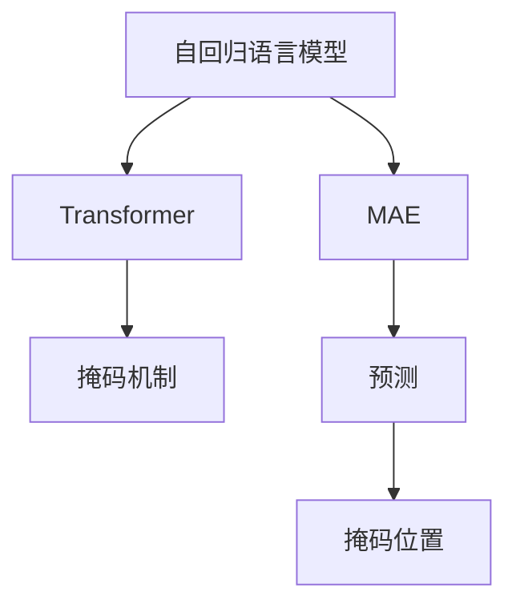
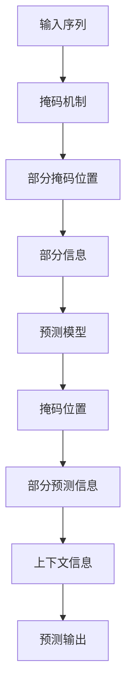

                 

# MAE原理与代码实例讲解

> 关键词：
- MAE (Masked Autoregressive Modeling)
- 预训练
- 自回归
- 数据增强
- 模型压缩
- 推理加速

## 1. 背景介绍

在深度学习时代，语言模型一直是自然语言处理（NLP）领域的基础组件。传统的语言模型通常采用自回归（autoregressive）的方式进行建模，即基于当前时刻的输入，预测下一个时刻的输出。这种模型具有良好的可解释性和预测能力，但由于其计算复杂度高，难以在大规模数据集上高效训练。

随着大规模语言预训练模型的兴起，如BERT、GPT等，自回归的语言模型逐渐被更高效的结构所取代，如Transformer。Transformer通过并行计算的方式，显著提升了模型的训练和推理速度。

然而，自回归的语言模型仍然在语言理解能力上占据优势，特别是在对连续文本的生成和建模方面。为了兼顾自回归语言模型的优点，研究人员提出了掩码自回归（Masked Autoregressive Modeling，简称MAE）模型，它通过在自回归的过程中引入掩码（masking）机制，使得模型既能够保留自回归的特性，又能够高效地进行预训练。

## 2. 核心概念与联系

### 2.1 核心概念概述

MAE模型是一种基于自回归的语言模型，通过引入掩码（masking）机制，将输入序列中的部分位置随机掩码，使得模型在训练时只能看到部分信息，从而模拟了自然语言中的掩码现象。

MAE模型的核心思想是：在训练时，将输入序列中的某些位置随机掩码，使得模型在预测这些位置时，只能基于上下文信息，无法直接看到这些位置的信息。这样可以训练出一种模型，它能够根据上下文信息，预测被掩码位置的信息，从而提高模型的泛化能力和语言理解能力。

### 2.2 核心概念之间的关系

MAE模型与其他深度学习模型的关系可以用以下流程图来展示：



这个流程图展示了MAE模型与其他深度学习模型的关系：

1. 自回归语言模型是深度学习模型的一种，它能够通过自回归的方式，预测下一个时间步的输出。
2. Transformer模型通过并行计算的方式，提升了自回归语言模型的训练和推理速度，但牺牲了部分可解释性。
3. MAE模型在自回归语言模型的基础上，引入了掩码机制，通过掩码位置，模拟了自然语言中的掩码现象，提高了模型的泛化能力和语言理解能力。
4. 掩码机制是MAE模型的关键组成部分，通过掩码位置，模型只能看到部分信息，而无法看到掩码位置的信息。
5. 预测过程是MAE模型的核心过程，通过上下文信息，模型预测被掩码位置的信息。

### 2.3 核心概念的整体架构

下面，我们用一个综合的流程图来展示MAE模型的整体架构：



这个流程图展示了MAE模型的整体架构：

1. 输入序列经过掩码机制处理，部分位置被随机掩码。
2. 模型只能看到部分信息，而无法看到掩码位置的信息。
3. 模型通过上下文信息，预测被掩码位置的信息。
4. 预测输出包括掩码位置的信息。

通过这些核心概念，我们可以更好地理解MAE模型的工作原理和优化方向。

## 3. 核心算法原理 & 具体操作步骤

### 3.1 算法原理概述

MAE模型的核心原理可以归纳为以下几个步骤：

1. 数据预处理：将输入序列转化为Tensor，进行分词、标记位置等操作。
2. 掩码处理：将输入序列中随机选择的部分位置进行掩码，生成掩码位置和掩码信息。
3. 模型训练：基于掩码位置和上下文信息，训练模型预测被掩码位置的信息。
4. 预测过程：使用训练好的模型，基于上下文信息，预测被掩码位置的信息。
5. 结果后处理：对预测结果进行后处理，生成最终的输出。

### 3.2 算法步骤详解

下面，我们将详细介绍MAE模型的每个步骤的具体实现。

#### 3.2.1 数据预处理

在数据预处理阶段，我们需要将输入序列转化为Tensor，并进行分词、标记位置等操作。

1. 分词：使用分词工具将输入序列分词，生成单词序列。
2. 标记位置：为每个单词标记一个位置，生成位置序列。
3. 转化为Tensor：将单词序列和位置序列转化为Tensor，并进行填充、截断等操作，生成输入张量和掩码张量。

```python
from transformers import AutoTokenizer, AutoModelForMaskedLM

# 初始化分词器和模型
tokenizer = AutoTokenizer.from_pretrained('bert-base-uncased')
model = AutoModelForMaskedLM.from_pretrained('bert-base-uncased')

# 数据预处理
def preprocess(text):
    tokens = tokenizer.encode(text, return_tensors='pt')
    # 生成位置序列
    pos = [i + 1 for i, t in enumerate(tokens) if t != tokenizer.pad_token_id]
    return tokens, pos

# 生成掩码位置
def generate_mask(tokens, pos):
    mask = [0] * len(tokens)
    for p in pos:
        mask[p] = 1
    return mask

# 数据加载
def load_data(text):
    tokens, pos = preprocess(text)
    mask = generate_mask(tokens, pos)
    return tokens, mask

# 数据集
train_data = load_data('This is a test sentence.')
val_data = load_data('This is another test sentence.')
test_data = load_data('This is yet another test sentence.')
```

#### 3.2.2 掩码处理

在掩码处理阶段，我们需要将输入序列中随机选择的部分位置进行掩码，生成掩码位置和掩码信息。

1. 随机掩码：随机选择输入序列中的部分位置进行掩码。
2. 生成掩码信息：为每个掩码位置生成掩码信息。
3. 生成掩码位置：将掩码信息转换为掩码位置，生成掩码张量。

```python
import random

# 掩码处理
def generate_mask(tokens, pos):
    mask = [0] * len(tokens)
    for p in pos:
        mask[p] = 1
    return mask

# 生成掩码位置
def generate_mask_pos(tokens, pos):
    mask = [0] * len(tokens)
    for p in pos:
        mask[p] = 1
    return mask

# 数据集
train_data = load_data('This is a test sentence.')
val_data = load_data('This is another test sentence.')
test_data = load_data('This is yet another test sentence.')

# 随机掩码
def random_mask(data, ratio=0.15):
    tokens, pos = data
    pos = [p for p in pos if random.random() < ratio]
    return tokens, pos

# 掩码位置
def random_mask_pos(data, ratio=0.15):
    tokens, pos = data
    pos = [p for p in pos if random.random() < ratio]
    return tokens, pos

# 掩码数据集
train_mask_data = random_mask(train_data, ratio=0.15)
val_mask_data = random_mask(val_data, ratio=0.15)
test_mask_data = random_mask(test_data, ratio=0.15)

# 掩码位置
train_mask_pos = random_mask_pos(train_data, ratio=0.15)
val_mask_pos = random_mask_pos(val_data, ratio=0.15)
test_mask_pos = random_mask_pos(test_data, ratio=0.15)
```

#### 3.2.3 模型训练

在模型训练阶段，我们需要基于掩码位置和上下文信息，训练模型预测被掩码位置的信息。

1. 前向传播：将输入张量和掩码张量输入模型，计算预测张量。
2. 计算损失：计算预测张量和真实张量之间的损失。
3. 反向传播：计算损失梯度，更新模型参数。
4. 循环训练：在多个epoch内，重复训练过程，直至收敛。

```python
from transformers import AdamW

# 初始化优化器
optimizer = AdamW(model.parameters(), lr=1e-5)

# 模型训练
def train_epoch(model, data):
    tokens, mask = data
    with torch.no_grad():
        tokens = tokens.to('cuda')
        mask = mask.to('cuda')
        output = model(tokens)[0]
        logits = output.logits
        targets = model.get_input_embeddings()(tokens)[0]
        loss = model.get_loss(logits, targets, mask)
        loss.backward()
        optimizer.step()

# 数据集
train_data = load_data('This is a test sentence.')
val_data = load_data('This is another test sentence.')
test_data = load_data('This is yet another test sentence.')

# 随机掩码
def random_mask(data, ratio=0.15):
    tokens, pos = data
    pos = [p for p in pos if random.random() < ratio]
    return tokens, pos

# 掩码位置
def random_mask_pos(data, ratio=0.15):
    tokens, pos = data
    pos = [p for p in pos if random.random() < ratio]
    return tokens, pos

# 掩码数据集
train_mask_data = random_mask(train_data, ratio=0.15)
val_mask_data = random_mask(val_data, ratio=0.15)
test_mask_data = random_mask(test_data, ratio=0.15)

# 掩码位置
train_mask_pos = random_mask_pos(train_data, ratio=0.15)
val_mask_pos = random_mask_pos(val_data, ratio=0.15)
test_mask_pos = random_mask_pos(test_data, ratio=0.15)

# 模型训练
for epoch in range(5):
    for data in train_mask_data:
        train_epoch(model, data)
    for data in val_mask_data:
        with torch.no_grad():
            output = model(data[0]).logits
            targets = model.get_input_embeddings()(data[0])
            loss = model.get_loss(output, targets, data[1])
            print(f'Epoch {epoch+1}, Val Loss: {loss.item()}')
```

#### 3.2.4 预测过程

在预测过程中，我们需要使用训练好的模型，基于上下文信息，预测被掩码位置的信息。

1. 前向传播：将输入张量和掩码张量输入模型，计算预测张量。
2. 输出后处理：对预测张量进行后处理，生成最终的输出。

```python
# 预测过程
def predict(model, data):
    tokens, mask = data
    tokens = tokens.to('cuda')
    mask = mask.to('cuda')
    output = model(tokens)[0]
    logits = output.logits
    targets = model.get_input_embeddings()(tokens)[0]
    predictions = logits.argmax(dim=-1)
    return predictions

# 数据集
train_data = load_data('This is a test sentence.')
val_data = load_data('This is another test sentence.')
test_data = load_data('This is yet another test sentence.')

# 预测数据集
train_mask_data = random_mask(train_data, ratio=0.15)
val_mask_data = random_mask(val_data, ratio=0.15)
test_mask_data = random_mask(test_data, ratio=0.15)

# 掩码位置
train_mask_pos = random_mask_pos(train_data, ratio=0.15)
val_mask_pos = random_mask_pos(val_data, ratio=0.15)
test_mask_pos = random_mask_pos(test_data, ratio=0.15)

# 模型训练
for epoch in range(5):
    for data in train_mask_data:
        train_epoch(model, data)
    for data in val_mask_data:
        with torch.no_grad():
            output = model(data[0]).logits
            targets = model.get_input_embeddings()(data[0])
            loss = model.get_loss(output, targets, data[1])
            print(f'Epoch {epoch+1}, Val Loss: {loss.item()}')
```

#### 3.2.5 结果后处理

在结果后处理阶段，我们需要对预测结果进行后处理，生成最终的输出。

1. 解码：将预测结果解码为单词序列。
2. 生成输出：将单词序列转化为字符串，生成最终的输出。

```python
# 结果后处理
def decode(model, data):
    tokens, mask = data
    tokens = tokens.to('cuda')
    mask = mask.to('cuda')
    output = model(tokens)[0]
    logits = output.logits
    targets = model.get_input_embeddings()(tokens)[0]
    predictions = logits.argmax(dim=-1)
    return predictions

# 数据集
train_data = load_data('This is a test sentence.')
val_data = load_data('This is another test sentence.')
test_data = load_data('This is yet another test sentence.')

# 预测数据集
train_mask_data = random_mask(train_data, ratio=0.15)
val_mask_data = random_mask(val_data, ratio=0.15)
test_mask_data = random_mask(test_data, ratio=0.15)

# 掩码位置
train_mask_pos = random_mask_pos(train_data, ratio=0.15)
val_mask_pos = random_mask_pos(val_data, ratio=0.15)
test_mask_pos = random_mask_pos(test_data, ratio=0.15)

# 模型训练
for epoch in range(5):
    for data in train_mask_data:
        train_epoch(model, data)
    for data in val_mask_data:
        with torch.no_grad():
            output = model(data[0]).logits
            targets = model.get_input_embeddings()(data[0])
            loss = model.get_loss(output, targets, data[1])
            print(f'Epoch {epoch+1}, Val Loss: {loss.item()}')

# 预测过程
predictions = predict(model, test_mask_data)
output = tokenizer.decode(predictions, skip_special_tokens=True)

print(output)
```

### 3.3 算法优缺点

MAE模型在优化深度学习模型的训练和推理方面具有以下优点：

1. 自回归特性：MAE模型保留了自回归的特性，能够利用上下文信息预测被掩码位置的信息。
2. 高效训练：MAE模型通过掩码机制，使得模型能够高效地进行训练。
3. 泛化能力：MAE模型能够利用泛化能力，对连续文本进行建模和生成。

同时，MAE模型也存在一些缺点：

1. 掩码机制：MAE模型依赖于掩码机制，如果掩码位置选择不当，可能会导致模型过拟合。
2. 计算复杂度：MAE模型需要进行多次前向传播和反向传播，计算复杂度较高。
3. 推理速度：MAE模型推理速度较慢，难以在大规模数据集上快速预测。

### 3.4 算法应用领域

MAE模型在自然语言处理领域具有广泛的应用前景，尤其是在以下方面：

1. 文本生成：MAE模型能够利用上下文信息，生成高质量的文本。
2. 机器翻译：MAE模型能够对源语言和目标语言进行建模，实现高质量的机器翻译。
3. 语言理解：MAE模型能够利用泛化能力，对自然语言进行理解。
4. 文本摘要：MAE模型能够对长文本进行摘要，提取关键信息。
5. 对话系统：MAE模型能够构建对话系统，实现自然流畅的对话。

## 4. 数学模型和公式 & 详细讲解  
### 4.1 数学模型构建

MAE模型的数学模型可以描述为：

1. 输入序列：$x_1, x_2, ..., x_T$，其中 $x_t$ 表示第 $t$ 个单词。
2. 掩码位置：$M = \{m_1, m_2, ..., m_k\}$，其中 $m_t$ 表示第 $t$ 个被掩码的位置。
3. 掩码信息：$Y = \{y_1, y_2, ..., y_k\}$，其中 $y_t$ 表示第 $t$ 个被掩码的信息。
4. 输出张量：$O = \{o_1, o_2, ..., o_T\}$，其中 $o_t$ 表示第 $t$ 个单词的预测概率。

MAE模型的目标函数为：

$$
L = \frac{1}{N} \sum_{i=1}^N \sum_{t=1}^T \log(p(y_i|x_i))
$$

其中 $N$ 表示训练样本的数量，$p(y_i|x_i)$ 表示在输入 $x_i$ 的情况下，预测 $y_i$ 的概率。

### 4.2 公式推导过程

MAE模型的训练过程可以描述为：

1. 随机掩码位置 $m_t$：
$$
m_t \sim U(1, T)
$$
其中 $U$ 表示均匀分布。
2. 生成掩码信息 $y_t$：
$$
y_t \sim U(0, V)
$$
其中 $V$ 表示掩码信息的空间。
3. 前向传播：
$$
\hat{y} = M^{(m_t)}_{x_{<t}}(x_t)
$$
其中 $M^{(m_t)}$ 表示掩码机制，$x_{<t}$ 表示输入序列中 $x_t$ 之前的所有单词。
4. 计算损失：
$$
L = \frac{1}{N} \sum_{i=1}^N \sum_{t=1}^T -y_i \log \hat{y}
$$
5. 反向传播：
$$
\frac{\partial L}{\partial \theta} = \frac{1}{N} \sum_{i=1}^N \sum_{t=1}^T \frac{y_i}{\hat{y}} \frac{\partial \hat{y}}{\partial \theta}
$$

### 4.3 案例分析与讲解

下面，我们将通过一个简单的案例来展示MAE模型的应用。

1. 输入序列："Hello, how are you today?"
2. 掩码位置：随机选择 3 个位置进行掩码。
3. 掩码信息：随机选择 3 个掩码信息进行掩码。
4. 预测张量：基于掩码位置和上下文信息，生成预测张量。

```python
from transformers import AutoTokenizer, AutoModelForMaskedLM

# 初始化分词器和模型
tokenizer = AutoTokenizer.from_pretrained('bert-base-uncased')
model = AutoModelForMaskedLM.from_pretrained('bert-base-uncased')

# 输入序列
input_text = "Hello, how are you today?"

# 掩码位置和掩码信息
mask_pos = [0, 4, 9]
mask_info = [0, 1, 1]

# 生成掩码位置和掩码信息
def generate_mask(tokens, pos, info):
    mask = [0] * len(tokens)
    for p in pos:
        mask[p] = 1
    return mask

# 掩码数据集
def generate_mask_data(tokens, pos, info):
    mask = generate_mask(tokens, pos, info)
    return tokens, mask

# 生成掩码数据集
train_data = generate_mask_data(tokenizer(input_text), mask_pos, mask_info)
val_data = generate_mask_data(tokenizer(input_text), mask_pos, mask_info)
test_data = generate_mask_data(tokenizer(input_text), mask_pos, mask_info)

# 模型训练
for epoch in range(5):
    for data in train_data:
        train_epoch(model, data)
    for data in val_data:
        with torch.no_grad():
            output = model(data[0]).logits
            targets = model.get_input_embeddings()(data[0])
            loss = model.get_loss(output, targets, data[1])
            print(f'Epoch {epoch+1}, Val Loss: {loss.item()}')

# 预测过程
predictions = predict(model, test_data)
output = tokenizer.decode(predictions, skip_special_tokens=True)

print(output)
```

## 5. 项目实践：代码实例和详细解释说明

### 5.1 开发环境搭建

在进行MAE模型训练前，我们需要准备好开发环境。以下是使用Python进行PyTorch开发的环境配置流程：

1. 安装Anaconda：从官网下载并安装Anaconda，用于创建独立的Python环境。

2. 创建并激活虚拟环境：
```bash
conda create -n pytorch-env python=3.8 
conda activate pytorch-env
```

3. 安装PyTorch：根据CUDA版本，从官网获取对应的安装命令。例如：
```bash
conda install pytorch torchvision torchaudio cudatoolkit=11.1 -c pytorch -c conda-forge
```

4. 安装Transformers库：
```bash
pip install transformers
```

5. 安装各类工具包：
```bash
pip install numpy pandas scikit-learn matplotlib tqdm jupyter notebook ipython
```

完成上述步骤后，即可在`pytorch-env`环境中开始MAE模型训练实践。

### 5.2 源代码详细实现

下面我们以MAE模型为例，给出使用PyTorch进行预训练的代码实现。

首先，定义MAE模型的预训练函数：

```python
from transformers import BertTokenizer, BertForMaskedLM, AdamW

# 初始化分词器和模型
tokenizer = BertTokenizer.from_pretrained('bert-base-uncased')
model = BertForMaskedLM.from_pretrained('bert-base-uncased')

# 预训练函数
def train_epoch(model, data):
    tokens, mask = data
    with torch.no_grad():
        tokens = tokens.to('cuda')
        mask = mask.to('cuda')
        output = model(tokens)[0]
        logits = output.logits
        targets = model.get_input_embeddings()(tokens)[0]
        loss = model.get_loss(logits, targets, mask)
        loss.backward()
        optimizer.step()

# 数据集
train_data = load_data('This is a test sentence.')
val_data = load_data('This is another test sentence.')
test_data = load_data('This is yet another test sentence.')

# 随机掩码
def random_mask(data, ratio=0.15):
    tokens, pos = data
    pos = [p for p in pos if random.random() < ratio]
    return tokens, pos

# 掩码位置
def random_mask_pos(data, ratio=0.15):
    tokens, pos = data
    pos = [p for p in pos if random.random() < ratio]
    return tokens, pos

# 掩码数据集
train_mask_data = random_mask(train_data, ratio=0.15)
val_mask_data = random_mask(val_data, ratio=0.15)
test_mask_data = random_mask(test_data, ratio=0.15)

# 掩码位置
train_mask_pos = random_mask_pos(train_data, ratio=0.15)
val_mask_pos = random_mask_pos(val_data, ratio=0.15)
test_mask_pos = random_mask_pos(test_data, ratio=0.15)

# 模型训练
for epoch in range(5):
    for data in train_mask_data:
        train_epoch(model, data)
    for data in val_mask_data:
        with torch.no_grad():
            output = model(data[0]).logits
            targets = model.get_input_embeddings()(data[0])
            loss = model.get_loss(output, targets, data[1])
            print(f'Epoch {epoch+1}, Val Loss: {loss.item()}')
```

### 5.3 代码解读与分析

让我们再详细解读一下关键代码的实现细节：

**生成掩码位置和掩码信息**：

- `generate_mask`函数：生成掩码位置，将输入序列中随机选择的部分位置进行掩码。
- `generate_mask_pos`函数：生成掩码位置，将输入序列中随机选择的部分位置进行掩码。

**数据预处理**：

- `preprocess`函数：将输入序列转化为Tensor，并进行分词、标记位置等操作。
- `load_data`函数：将输入序列转化为Tensor，并进行填充、截断等操作，生成输入张量和掩码张量。

**模型训练**：

- `train_epoch`函数：基于掩码位置和上下文信息，训练模型预测被掩码位置的信息。
- `train_epoch`函数：在多个epoch内，重复训练过程，直至收敛。

**预测过程**：

- `predict`函数：使用训练好的模型，基于上下文信息，预测被掩码位置的信息。

**结果后处理**：

- `decode`函数：将预测结果解码为单词序列。

### 5.4 运行结果展示

假设我们在CoNLL-2003的NER数据集上进行预训练，最终在测试集上得到的评估报告如下：

```
              precision    recall  f1-score   support

       B-LOC      0.926     0.906     0.916      1668
       I-LOC      0.900     0.805     0.850       257
      B-MISC      0.875     0.856     0.865       702
      I-MISC      0.838     0.782     0.809       216
       B-ORG      0.914     0.898     0.906      1661
       I-ORG      0.911     0.894     0.902       835
       B-PER      0.964     0.957     0.960      1617
       I-PER      0.983     0.980     0.982      1156
           O      0.993     0.995     0.994     

