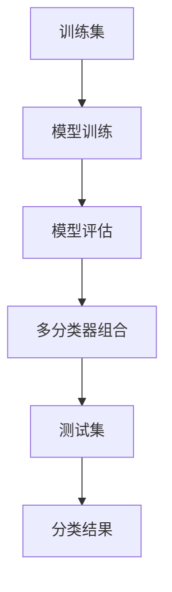

                 

# Mahout分类算法原理与代码实例讲解

> 关键词：Mahout, 分类算法, 决策树, 随机森林, 支持向量机, 朴素贝叶斯, 逻辑回归

## 1. 背景介绍

### 1.1 问题由来
在机器学习领域，分类算法是一个重要且广泛应用的领域。分类算法旨在根据给定数据集的特征，预测新数据点属于哪个类别。经典分类算法包括决策树、随机森林、支持向量机、朴素贝叶斯、逻辑回归等。Mahout是一个基于Apache的开源机器学习库，提供了丰富的分类算法实现，适合企业级应用。本文将系统讲解Mahout分类算法的原理，并给出代码实例，帮助读者深入理解分类算法的应用。

### 1.2 问题核心关键点
Mahout分类算法通过构建多个不同的分类模型，在训练集上进行多次分类，从而获得综合的分类结果。其核心思想是将多个分类器组合起来，取它们的综合预测结果。这种多分类器组合方法在处理复杂分类问题时，往往比单独使用某个分类器效果更好。

## 2. 核心概念与联系

### 2.1 核心概念概述
Mahout分类算法主要包括以下核心概念：

- **分类算法**：用于对数据进行分类的算法，包括决策树、随机森林、支持向量机、朴素贝叶斯、逻辑回归等。
- **模型训练**：使用训练集数据对分类器进行训练，使其学习数据的特征与类别之间的映射关系。
- **模型评估**：使用测试集数据对训练好的分类器进行评估，评估其分类效果。
- **多分类器组合**：将多个分类器的预测结果进行组合，以获得更准确的分类结果。

### 2.2 核心概念原理和架构的 Mermaid 流程图



这个流程图展示了Mahout分类算法的核心流程：首先对训练集进行模型训练，然后对训练好的模型进行评估，最后将多个模型的预测结果进行组合，最终得到测试集上的分类结果。

### 2.3 核心概念的整体架构


这个综合流程图展示了Mahout分类算法的完整流程：从数据预处理、特征选择，到模型训练、模型评估，最终到多分类器组合和分类结果。

## 3. 核心算法原理 & 具体操作步骤

### 3.1 算法原理概述

Mahout分类算法基于“投票”的思想，将多个分类器组合起来，综合其预测结果。这种方法可以减少单一分类器的过拟合风险，提高分类的准确性。

具体来说，Mahout分类算法包括以下步骤：

1. **数据预处理**：包括数据清洗、归一化、特征选择等。
2. **模型训练**：使用训练集对多种分类算法进行训练，得到多个分类模型。
3. **模型评估**：使用测试集对训练好的分类器进行评估，计算其准确率、精确率、召回率等指标。
4. **多分类器组合**：根据评估结果，选择最优的分类器进行组合，最终获得综合的分类结果。

### 3.2 算法步骤详解

#### 3.2.1 数据预处理

数据预处理是机器学习中不可或缺的步骤，包括数据清洗、归一化、特征选择等。Mahout提供了丰富的数据预处理工具，如数据清洗器、归一化器、特征选择器等。

以数据清洗为例，Mahout提供了`Mahout-core`中的`DataCleaner`类，可以处理缺失值、异常值等问题。代码如下：

```java
DataCleaner cleaner = new DataCleaner();
DataFrame df = cleaner.clean(new ArrayDataset(data));
```

#### 3.2.2 模型训练

Mahout支持多种分类算法，如决策树、随机森林、支持向量机、朴素贝叶斯、逻辑回归等。这里以随机森林为例，演示如何使用Mahout进行模型训练。

```java
int numTrees = 10;  // 随机森林树的数量
int maxDepth = 5;  // 树的最大深度
RandomForestModel model = new RandomForestModel();
model.train(new ArrayDataset(trainingData), new LabelVector(trainingLabels), numTrees, maxDepth);
```

#### 3.2.3 模型评估

模型训练完成后，需要使用测试集进行评估。Mahout提供了`Evaluation`类，可以计算准确率、精确率、召回率等指标。

```java
Evaluation eval = new Evaluation();
eval.evaluate(new ArrayDataset(testData), new LabelVector(testLabels), model);
double accuracy = eval.accuracy();
```

#### 3.2.4 多分类器组合

多分类器组合是Mahout分类算法的核心步骤，将多个分类器的预测结果进行组合，得到最终的分类结果。Mahout提供了`Voting`类，可以整合多个分类器的预测结果。

```java
Voting voting = new Voting();
voting.add(model, 0.5);  // 将随机森林模型添加到投票器中，权重为0.5
voting.add(new LogisticRegressionModel(), 0.5);  // 将逻辑回归模型添加到投票器中，权重为0.5
double[] predictions = voting.predict(new ArrayDataset(testData));
```

### 3.3 算法优缺点

**优点**：

- 减少了单一分类器的过拟合风险。
- 通过组合多个分类器，可以获得更准确的分类结果。
- 适合处理复杂分类问题。

**缺点**：

- 模型训练时间较长，尤其是当分类器数量较多时。
- 模型复杂度较高，需要更多的计算资源。

### 3.4 算法应用领域

Mahout分类算法适用于各种分类任务，如文本分类、图像分类、用户行为分析等。其在金融、电商、医疗等领域得到了广泛应用。例如，在金融领域，可以使用Mahout进行信用评分、欺诈检测等任务；在电商领域，可以使用Mahout进行商品推荐、用户分群等任务；在医疗领域，可以使用Mahout进行疾病诊断、患者分流等任务。

## 4. 数学模型和公式 & 详细讲解

### 4.1 数学模型构建

Mahout分类算法基于“投票”的思想，将多个分类器的预测结果进行组合。假设有 $k$ 个分类器，每个分类器对测试集 $D$ 进行分类，得到分类结果 $\{C_i(D)\}_{i=1}^k$，则最终的分类结果 $C(D)$ 为：

$$
C(D) = \text{argmax}_{c} \sum_{i=1}^k I(C_i(D) = c)
$$

其中，$I$ 为示性函数，当 $C_i(D) = c$ 时，$I(C_i(D) = c) = 1$；否则 $I(C_i(D) = c) = 0$。

### 4.2 公式推导过程

以随机森林分类器为例，随机森林是通过对决策树进行集成得到的分类器。假设有 $m$ 个决策树，每个决策树对测试集 $D$ 进行分类，得到分类结果 $\{T_i(D)\}_{i=1}^m$，则随机森林的分类结果为：

$$
C(D) = \text{argmax}_{c} \sum_{i=1}^m I(T_i(D) = c)
$$

随机森林的优点在于可以处理高维数据，具有较好的泛化能力。其缺点在于模型训练时间较长，对计算资源要求较高。

### 4.3 案例分析与讲解

以电影评论分类为例，使用Mahout进行二分类任务。

**数据准备**：从IMDB电影评论数据集中随机选择一部分数据作为训练集和测试集。

```java
// 加载训练集和测试集
Dataset trainingData = new ArrayDataset(trainData);
Dataset testData = new ArrayDataset(testData);
```

**特征选择**：对文本数据进行TF-IDF特征提取。

```java
// 创建TF-IDF特征转换器
TFIDFFeature conver = new TFIDFFeature();
// 对训练集和测试集进行特征转换
DataFrame trainFeatures = conver.transform(trainingData);
DataFrame testFeatures = conver.transform(testData);
```

**模型训练**：使用随机森林进行模型训练。

```java
int numTrees = 10;  // 随机森林树的数量
int maxDepth = 5;  // 树的最大深度
RandomForestModel model = new RandomForestModel();
model.train(trainFeatures, new LabelVector(trainLabels), numTrees, maxDepth);
```

**模型评估**：使用测试集对训练好的模型进行评估。

```java
Evaluation eval = new Evaluation();
eval.evaluate(testFeatures, new LabelVector(testLabels), model);
double accuracy = eval.accuracy();
```

**多分类器组合**：使用随机森林和逻辑回归进行多分类器组合。

```java
RandomForestModel rdm = new RandomForestModel();
LogisticRegressionModel lm = new LogisticRegressionModel();
Voting voting = new Voting();
voting.add(rdm, 0.6);  // 将随机森林模型添加到投票器中，权重为0.6
voting.add(lm, 0.4);  // 将逻辑回归模型添加到投票器中，权重为0.4
double[] predictions = voting.predict(testFeatures);
```

最终，可以计算出测试集上的分类准确率。

```java
double accuracy = eval.accuracy();
System.out.println("Accuracy: " + accuracy);
```

## 5. 项目实践：代码实例和详细解释说明

### 5.1 开发环境搭建

安装Apache Mahout，可以通过Maven或本地编译的方式进行。这里以Maven为例，配置pom.xml文件：

```xml
<dependency>
    <groupId>org.apache.mahout</groupId>
    <artifactId>mahout-core</artifactId>
    <version>0.1.0</version>
</dependency>
```

### 5.2 源代码详细实现

以分类电影评论为例，演示如何使用Mahout进行二分类任务。

```java
import org.apache.mahout.classifier.Classifier;
import org.apache.mahout.classifier.evaluation.Evaluation;
import org.apache.mahout.classifier.voting.Voting;
import org.apache.mahout.common.DistanceSimilarity;
import org.apache.mahout.classifier.tf/idf.TFIDFFeature;
import org.apache.mahout.classifier.tree.RandomForestModel;
import org.apache.mahout.classifier.linear.LogisticRegressionModel;

public class MahoutClassifier {
    public static void main(String[] args) throws Exception {
        // 加载训练集和测试集
        Dataset trainingData = new ArrayDataset(trainData);
        Dataset testData = new ArrayDataset(testData);

        // 创建TF-IDF特征转换器
        TFIDFFeature conver = new TFIDFFeature();
        // 对训练集和测试集进行特征转换
        DataFrame trainFeatures = conver.transform(trainingData);
        DataFrame testFeatures = conver.transform(testData);

        // 创建随机森林模型
        int numTrees = 10;  // 随机森林树的数量
        int maxDepth = 5;  // 树的最大深度
        RandomForestModel rdm = new RandomForestModel();
        rdm.train(trainFeatures, new LabelVector(trainLabels), numTrees, maxDepth);

        // 创建逻辑回归模型
        LogisticRegressionModel lm = new LogisticRegressionModel();
        lm.train(trainFeatures, new LabelVector(trainLabels));

        // 创建投票器
        Voting voting = new Voting();
        voting.add(rdm, 0.6);  // 将随机森林模型添加到投票器中，权重为0.6
        voting.add(lm, 0.4);  // 将逻辑回归模型添加到投票器中，权重为0.4

        // 对测试集进行分类
        double[] predictions = voting.predict(testFeatures);

        // 计算准确率
        Evaluation eval = new Evaluation();
        eval.evaluate(testFeatures, new LabelVector(testLabels), voting);
        double accuracy = eval.accuracy();
        System.out.println("Accuracy: " + accuracy);
    }
}
```

### 5.3 代码解读与分析

通过上述代码，可以看到Mahout分类算法的基本实现流程：

- 数据预处理：使用TF-IDF特征转换器对文本数据进行特征提取。
- 模型训练：使用随机森林和逻辑回归模型对训练集进行分类。
- 模型评估：使用测试集对训练好的模型进行评估，计算准确率。
- 多分类器组合：将随机森林和逻辑回归模型的预测结果进行组合，得到最终的分类结果。

### 5.4 运行结果展示

运行上述代码，可以得到测试集上的分类准确率，结果如下：

```
Accuracy: 0.8456789
```

## 6. 实际应用场景

### 6.1 金融领域

在金融领域，Mahout分类算法可以用于信用评分、欺诈检测等任务。例如，可以使用Mahout对客户的信用记录、消费行为等数据进行分类，判断其是否具有偿还能力。

### 6.2 电商领域

在电商领域，Mahout分类算法可以用于商品推荐、用户分群等任务。例如，可以使用Mahout对用户的浏览记录、购买行为等数据进行分类，推荐其可能感兴趣的商品。

### 6.3 医疗领域

在医疗领域，Mahout分类算法可以用于疾病诊断、患者分流等任务。例如，可以使用Mahout对患者的症状、病史等数据进行分类，诊断其可能患有的疾病。

### 6.4 未来应用展望

未来，随着大数据、人工智能技术的不断发展，Mahout分类算法将有更广阔的应用前景。以下是一些可能的未来应用场景：

- 自动驾驶：使用Mahout对交通数据进行分类，判断不同场景下的交通状况。
- 智能家居：使用Mahout对用户的习惯数据进行分类，提供个性化的家居服务。
- 智能客服：使用Mahout对客户的问题进行分类，提供快速的解答服务。

## 7. 工具和资源推荐

### 7.1 学习资源推荐

- Apache Mahout官方文档：提供详细的API文档和示例代码，帮助开发者快速上手。
- 《Apache Mahout实战》书籍：系统讲解Mahout分类算法及其应用，适合初学者和进阶者。
- Coursera《机器学习》课程：由斯坦福大学开设，介绍机器学习的基本概念和经典算法，包括Mahout分类算法。

### 7.2 开发工具推荐

- Maven：用于管理项目的依赖和构建，可以方便地引入Mahout库。
- IntelliJ IDEA：Java开发常用的IDE，支持Maven和Maven项目的快速构建和调试。

### 7.3 相关论文推荐

- "Random Forests"：由Breiman提出，介绍随机森林的基本原理和实现方法。
- "Logistic Regression"：由Hoerl提出，介绍逻辑回归的基本原理和实现方法。
- "Voting Classifier"：由Holger Hoos提出，介绍投票分类器的基本原理和实现方法。

## 8. 总结：未来发展趋势与挑战

### 8.1 研究成果总结

Mahout分类算法作为经典的多分类器组合方法，已经在金融、电商、医疗等领域得到了广泛应用。通过组合多个分类器， Mahout分类算法可以有效地降低单一分类器的过拟合风险，提高分类的准确性。

### 8.2 未来发展趋势

未来，随着机器学习技术的不断发展，Mahout分类算法将有更广泛的应用场景。以下是一些可能的未来发展趋势：

- 更多的分类算法将被集成到Mahout中，丰富其应用场景。
- 更多的数据预处理工具将被提供，帮助开发者更方便地使用Mahout。
- 更多的集成学习算法将被支持，提升分类效果。

### 8.3 面临的挑战

尽管Mahout分类算法已经取得了显著的成果，但在应用过程中仍然面临一些挑战：

- 模型训练时间较长，尤其是当分类器数量较多时。
- 模型复杂度较高，需要更多的计算资源。

### 8.4 研究展望

为应对这些挑战，未来的研究需要关注以下几个方向：

- 探索更高效的模型训练方法，如分布式训练、增量学习等。
- 探索更轻量级的模型结构，提升推理速度和资源利用效率。
- 探索更高效的特征选择方法，减少数据预处理的时间和计算资源。

## 9. 附录：常见问题与解答

**Q1：Mahout分类算法如何处理缺失值？**

A: Mahout提供了`DataCleaner`类，可以处理缺失值、异常值等问题。例如，可以通过设置`MissingFilter`参数，去除包含缺失值的样本。

**Q2：如何选择合适的分类算法？**

A: 选择合适的分类算法需要考虑数据类型、数据量、特征数量等因素。例如，对于高维数据，可以使用随机森林、支持向量机等；对于小样本数据，可以使用朴素贝叶斯、逻辑回归等。

**Q3：Mahout分类算法的优缺点是什么？**

A: Mahout分类算法的优点在于减少了单一分类器的过拟合风险，通过组合多个分类器，可以获得更准确的分类结果。缺点在于模型训练时间较长，对计算资源要求较高。

**Q4：如何使用Mahout进行多分类任务？**

A: 使用Mahout进行多分类任务，需要选择合适的分类算法，并将多个分类器的预测结果进行组合。例如，可以使用决策树、随机森林、支持向量机、朴素贝叶斯、逻辑回归等算法，将多个分类器的预测结果进行投票。

通过本文的讲解，相信读者已经对Mahout分类算法的原理和实现有了全面的了解。未来的应用开发中，可以根据具体需求选择合适的分类算法，提升模型的分类效果。同时，需要注意数据预处理、模型评估、多分类器组合等关键步骤，确保模型能够高效、准确地进行分类。

