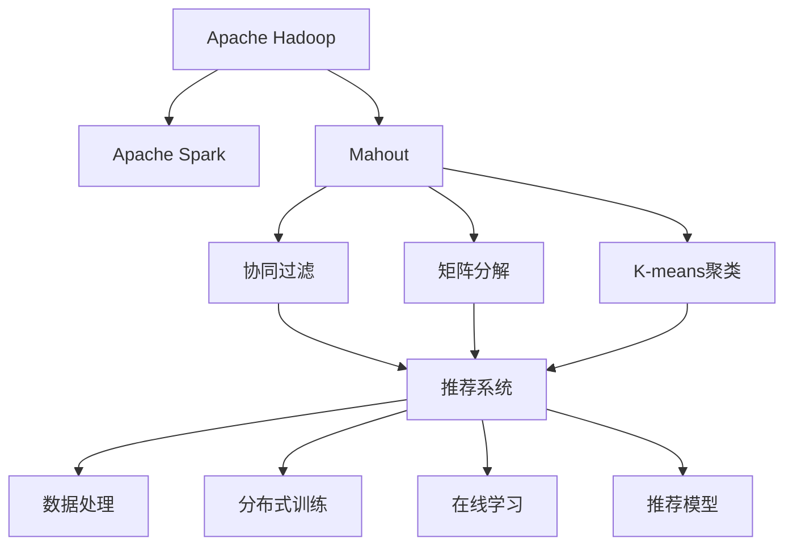
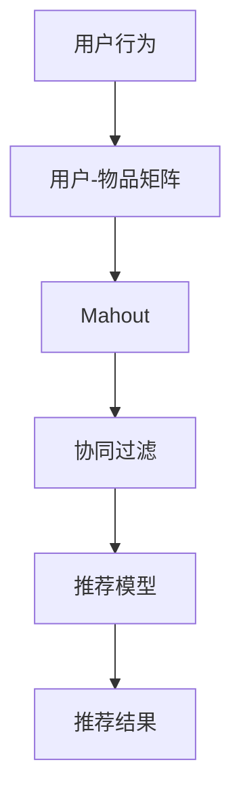
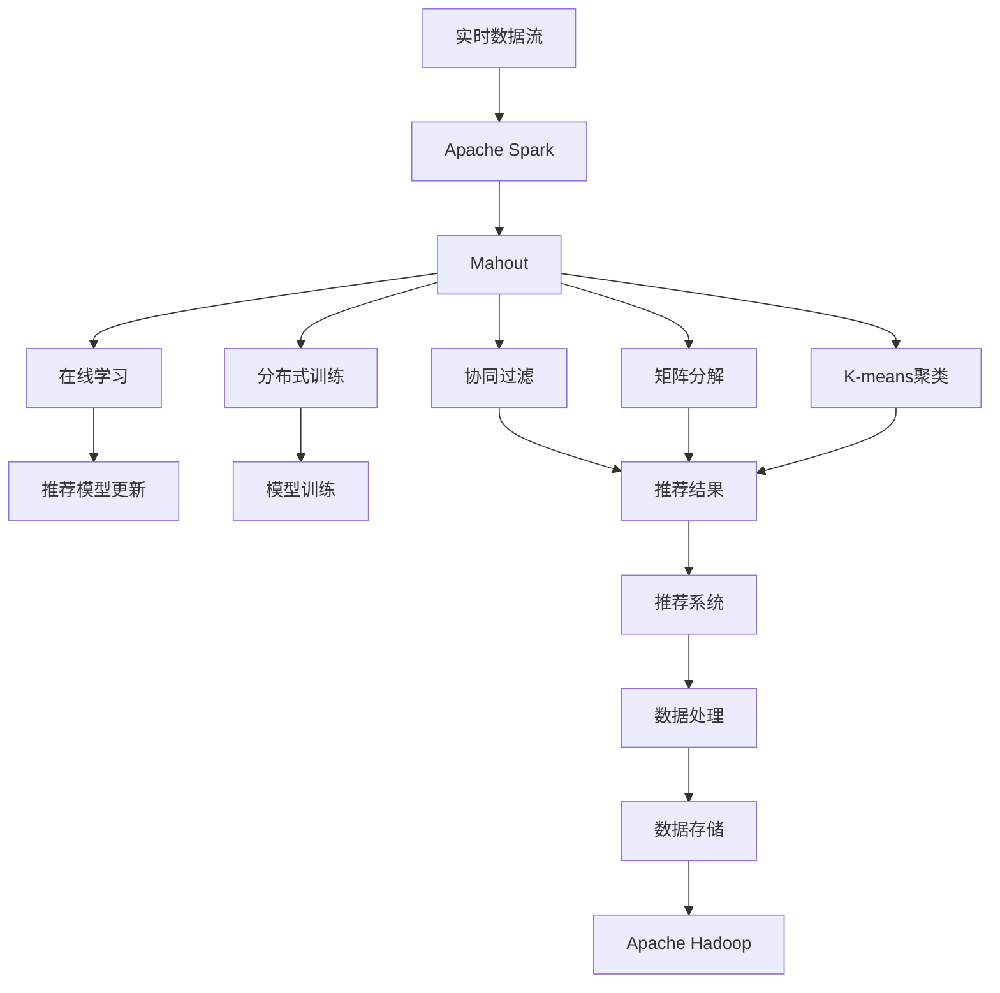

                 

# Mahout原理与代码实例讲解

> 关键词：

## 1. 背景介绍

### 1.1 问题由来

随着大数据和机器学习技术的飞速发展，各种推荐系统、数据挖掘和分析工具应运而生。Mahout作为Apache软件基金会的一个重要开源项目，提供了丰富的机器学习算法实现，涵盖分类、聚类、推荐系统等领域，是构建智能数据处理平台的强大工具。Mahout旨在为数据科学家、开发者和业务分析师提供易于使用的工具和算法，使得构建基于Hadoop和Spark的机器学习应用更加简单。本文将详细介绍Mahout的核心原理、关键算法和实际应用，并结合代码实例进行详细讲解，希望读者通过学习能够掌握Mahout的精髓，实现高效的数据分析和推荐系统开发。

### 1.2 问题核心关键点

Mahout的核心技术主要集中在以下几个方面：

- **数据处理与存储**：Mahout支持从多种数据源读取数据，并利用Apache Hadoop和Apache Spark分布式计算框架进行数据处理和存储，保证数据的高可用性和高效性。
- **机器学习算法**：Mahout内置了多种经典的机器学习算法，包括协同过滤、K-means聚类、决策树等，用于数据挖掘和推荐系统开发。
- **推荐算法**：Mahout支持多种推荐算法，如基于用户的协同过滤、基于物品的协同过滤、矩阵分解等，能够根据用户行为和物品属性进行精准推荐。
- **在线学习与流式计算**：Mahout支持实时数据流的处理和在线学习，使得推荐系统可以适应实时数据变化，提高系统灵活性和响应速度。
- **分布式训练与优化**：Mahout利用Hadoop和Spark等分布式计算框架，实现大规模数据的分布式训练和优化，提高模型训练效率。

这些核心技术共同构成了Mahout的强大功能，使其在推荐系统、数据挖掘和分析领域具备广泛的应用前景。

### 1.3 问题研究意义

理解并掌握Mahout的原理与代码实现，对于数据科学家和开发者而言具有重要的实际意义：

1. **提升数据分析效率**：Mahout提供了多种机器学习算法，能够高效地处理大规模数据集，帮助用户快速完成数据分析和挖掘任务。
2. **优化推荐系统性能**：通过Mahout的推荐算法，可以在线实时计算推荐结果，满足用户即时需求，提高推荐系统的互动性和用户体验。
3. **支持分布式计算**：Mahout可以利用Hadoop和Spark等分布式计算框架，有效应对大规模数据和计算任务，提升系统可扩展性和性能。
4. **实现业务创新**：Mahout的强大算法和工具，支持用户实现各种新颖的业务应用，如个性化推荐、智能营销、供应链优化等。
5. **促进技术创新**：Mahout作为开源项目，其代码实现和算法优化为机器学习和数据挖掘领域的持续创新提供了宝贵的经验和技术积累。

## 2. 核心概念与联系

### 2.1 核心概念概述

为了更好地理解Mahout的工作原理和实现细节，本节将介绍几个密切相关的核心概念：

- **Apache Hadoop**：一个分布式计算框架，用于存储、处理和分析大规模数据集。Hadoop包括HDFS（Hadoop Distributed File System）和MapReduce等核心组件。
- **Apache Spark**：一个快速、通用、可扩展的分布式计算系统，支持Hadoop上的数据处理和分析。Spark包括Spark Core、Spark SQL、Spark Streaming、MLlib和GraphX等多个模块。
- **Mahout**：Apache软件基金会的开源机器学习项目，提供了一系列高效、易用的机器学习算法和工具，支持数据处理、推荐系统、聚类分析等功能。
- **协同过滤**：一种基于用户行为或物品属性的推荐算法，通过分析用户或物品之间的相似度来推荐相关物品。
- **矩阵分解**：一种用于推荐系统的数学方法，通过分解用户-物品矩阵，发现用户和物品的潜在特征，进行精准推荐。
- **K-means聚类**：一种无监督学习算法，用于将数据集划分为多个簇，每个簇内数据点相似度高，不同簇之间数据点相似度低。

这些核心概念之间的逻辑关系可以通过以下Mermaid流程图来展示：



这个流程图展示了大语言模型的核心概念及其之间的关系：

1. Hadoop和Spark作为数据处理框架，提供数据存储和计算能力。
2. Mahout作为机器学习工具，利用Hadoop和Spark进行数据处理和模型训练。
3. 协同过滤、矩阵分解和K-means聚类是Mahout常用的算法。
4. 推荐系统是Mahout的主要应用场景。
5. 数据处理、分布式训练和在线学习是实现推荐系统的主要技术手段。
6. 推荐模型是实际应用中输出的结果。

### 2.2 概念间的关系

这些核心概念之间存在着紧密的联系，形成了Mahout的核心生态系统。下面我通过几个Mermaid流程图来展示这些概念之间的关系。

#### 2.2.1 数据处理与存储


这个流程图展示了数据处理和存储的基本流程：

1. 数据源提供原始数据。
2. Hadoop HDFS进行数据的分布式存储。
3. Mahout对数据进行预处理，如清洗、格式化等。
4. 数据存储到Hadoop HDFS中。
5. Spark对存储的数据进行分布式计算和处理。
6. Mahout利用Spark进行模型训练。
7. 推荐系统使用训练好的模型进行推荐。

#### 2.2.2 推荐算法



这个流程图展示了推荐算法的基本流程：

1. 收集用户行为数据，构建用户-物品矩阵。
2. Mahout使用协同过滤等算法对矩阵进行处理。
3. 训练推荐模型。
4. 根据训练好的模型进行推荐，输出推荐结果。

#### 2.2.3 在线学习与分布式训练


这个流程图展示了在线学习与分布式训练的基本流程：

1. 实时数据流通过Spark Streaming进行处理。
2. Mahout对实时数据进行在线学习。
3. 更新推荐模型。
4. 根据更新后的模型进行推荐，输出推荐结果。

### 2.3 核心概念的整体架构

最后，我们用一个综合的流程图来展示这些核心概念在大规模推荐系统中的整体架构：



这个综合流程图展示了从实时数据流到最终推荐结果的完整过程：

1. 实时数据流通过Spark Streaming进行处理。
2. Mahout对实时数据进行在线学习和分布式训练。
3. Mahout使用协同过滤、矩阵分解和K-means聚类等算法处理数据。
4. 训练好的模型进行推荐，输出推荐结果。
5. 数据处理和存储通过Hadoop和Spark进行。
6. 最终通过推荐系统进行应用。

通过这些流程图，我们可以更清晰地理解Mahout的工作原理和实现细节，为后续深入讨论具体的算法和技术奠定基础。

## 3. 核心算法原理 & 具体操作步骤
### 3.1 算法原理概述

Mahout的核心算法主要集中在以下几个方面：

- **协同过滤算法**：基于用户行为或物品属性的相似度进行推荐，包括基于用户的协同过滤和基于物品的协同过滤。
- **矩阵分解算法**：通过分解用户-物品矩阵，发现用户和物品的潜在特征，进行精准推荐。
- **K-means聚类算法**：将数据集划分为多个簇，每个簇内数据点相似度高，不同簇之间数据点相似度低，用于发现用户和物品的潜在分布。
- **在线学习算法**：针对实时数据流进行模型更新，保持模型的实时性和动态性。
- **分布式训练算法**：利用Hadoop和Spark等分布式计算框架，进行大规模数据的高效训练。

本文将重点介绍协同过滤和矩阵分解算法，结合代码实例进行详细讲解。

### 3.2 算法步骤详解

#### 3.2.1 协同过滤算法

**Step 1: 数据准备**
- 收集用户行为数据，如浏览记录、购买记录等。
- 对数据进行清洗、归一化等预处理。

**Step 2: 用户-物品矩阵构建**
- 将用户行为数据转换为用户-物品矩阵。每一行代表一个用户，每一列代表一个物品，矩阵中的每个元素表示用户对物品的评分。

**Step 3: 相似度计算**
- 计算用户和物品之间的相似度。基于用户的协同过滤方法，计算用户之间的相似度；基于物品的协同过滤方法，计算物品之间的相似度。

**Step 4: 推荐计算**
- 根据相似度计算结果，推荐物品给用户。基于用户的协同过滤方法，推荐与用户最相似用户评分高的物品；基于物品的协同过滤方法，推荐与物品最相似物品评分高的物品。

**Step 5: 模型评估**
- 评估推荐模型的性能。常见的评估指标包括准确率、召回率、F1分数等。

#### 3.2.2 矩阵分解算法

**Step 1: 数据准备**
- 收集用户行为数据，如浏览记录、购买记录等。
- 对数据进行清洗、归一化等预处理。

**Step 2: 矩阵分解**
- 对用户-物品矩阵进行矩阵分解。分解为用户-潜在因子矩阵和物品-潜在因子矩阵，得到用户和物品的潜在特征。

**Step 3: 模型训练**
- 使用矩阵分解得到的结果训练推荐模型。常见的推荐模型包括基于用户-物品矩阵的SVD算法和基于用户-潜在因子矩阵和物品-潜在因子矩阵的SVD++算法。

**Step 4: 推荐计算**
- 根据训练好的模型进行推荐，输出推荐结果。

**Step 5: 模型评估**
- 评估推荐模型的性能。常见的评估指标包括准确率、召回率、F1分数等。

### 3.3 算法优缺点

**协同过滤算法的优缺点**：

**优点**：
- 不需要额外的特征工程，能够直接利用用户行为数据进行推荐。
- 能够处理大规模稀疏数据，适应性强。
- 简单易懂，易于实现和优化。

**缺点**：
- 数据稀疏性会导致推荐效果下降，尤其是对于新用户或新物品。
- 冷启动问题难以解决，需要用户行为数据积累到一定程度才能有效推荐。
- 对于数据稀疏性较高的情况，需要引入额外的噪声处理。

**矩阵分解算法的优缺点**：

**优点**：
- 能够从用户-物品矩阵中发现用户和物品的潜在特征，推荐更加精准。
- 能够处理大规模稀疏矩阵，适应性强。
- 对数据稀疏性不敏感，能够处理冷启动问题。

**缺点**：
- 需要额外的计算资源和时间，模型训练复杂度高。
- 对于噪声和异常值敏感，需要额外的噪声处理。
- 模型复杂度高，解释性较差。

### 3.4 算法应用领域

基于协同过滤和矩阵分解算法的推荐系统，已经在多个领域得到了广泛应用，例如：

- 电子商务推荐：如淘宝、亚马逊等电商平台，通过推荐系统向用户推荐商品，提高用户体验和转化率。
- 视频网站推荐：如Netflix、YouTube等视频平台，通过推荐系统为用户推荐视频内容，增加用户粘性和观看时长。
- 社交网络推荐：如Facebook、Twitter等社交平台，通过推荐系统为用户推荐好友、兴趣话题等，增加平台活跃度和用户互动。
- 新闻内容推荐：如今日头条、人民日报等新闻应用，通过推荐系统向用户推荐新闻内容，增加用户阅读量和平台流量。

除了这些常见的应用场景，矩阵分解算法还被应用于广告投放、音乐推荐、图像搜索等领域，为不同领域提供了高效、精准的推荐解决方案。

## 4. 数学模型和公式 & 详细讲解 & 举例说明

### 4.1 数学模型构建

本节将使用数学语言对基于协同过滤和矩阵分解的推荐系统进行更加严格的刻画。

记用户行为数据集为 $\mathcal{D}=\{(u_i,i_j,r_{ij})\}_{i,j}$，其中 $u_i$ 表示用户，$i_j$ 表示物品，$r_{ij}$ 表示用户对物品的评分。假设用户-物品矩阵为 $\mathbf{P}$，其中 $\mathbf{P}_{ij}=r_{ij}$。

**协同过滤算法**：
- 基于用户的协同过滤算法：计算用户之间的相似度，找到与目标用户 $u_i$ 最相似的 $k$ 个用户，对这 $k$ 个用户评分过的物品进行加权平均，生成推荐结果。
- 基于物品的协同过滤算法：计算物品之间的相似度，找到与目标物品 $i_j$ 最相似的 $k$ 个物品，对这 $k$ 个物品评分过的用户进行加权平均，生成推荐结果。

**矩阵分解算法**：
- 假设用户-物品矩阵 $\mathbf{P}$ 可以分解为用户-潜在因子矩阵 $\mathbf{U}$ 和物品-潜在因子矩阵 $\mathbf{V}$，其中 $\mathbf{P}=\mathbf{U}\mathbf{V}^T$。
- 用户 $u_i$ 的潜在因子向量为 $\mathbf{u}_i=\mathbf{U}_i$，物品 $i_j$ 的潜在因子向量为 $\mathbf{v}_j=\mathbf{V}_j$。

### 4.2 公式推导过程

#### 4.2.1 协同过滤算法

**基于用户的协同过滤算法**：

$$
r_{u_i,i_j}=\frac{1}{\alpha+\beta \sum_{k=1}^k \frac{r_{u_k,i_j}}{\hat{r}_{u_k,u_i}}}
$$

其中 $\hat{r}_{u_k,u_i}$ 表示用户 $u_k$ 和用户 $u_i$ 之间的相似度，常见的相似度计算方法包括余弦相似度和皮尔逊相关系数。

**基于物品的协同过滤算法**：

$$
r_{u_i,i_j}=\frac{1}{\alpha+\beta \sum_{k=1}^k \frac{r_{u_i,j_k}}{\hat{r}_{i_k,i_j}}}
$$

其中 $\hat{r}_{i_k,i_j}$ 表示物品 $i_k$ 和物品 $i_j$ 之间的相似度。

#### 4.2.2 矩阵分解算法

**SVD算法**：

$$
\mathbf{P}=\mathbf{U}\mathbf{V}^T
$$

其中 $\mathbf{U}=\begin{bmatrix} \mathbf{u}_1 & \mathbf{u}_2 & \cdots & \mathbf{u}_m \end{bmatrix}$，$\mathbf{V}=\begin{bmatrix} \mathbf{v}_1 & \mathbf{v}_2 & \cdots & \mathbf{v}_n \end{bmatrix}$，$\mathbf{U} \in \mathbb{R}^{m \times k}$，$\mathbf{V} \in \mathbb{R}^{n \times k}$。

**SVD++算法**：

$$
\mathbf{P}=\mathbf{U}\mathbf{V}^T+\mathbf{E}
$$

其中 $\mathbf{E}=\epsilon$，$\epsilon$ 为噪声项，用于处理数据稀疏性。

### 4.3 案例分析与讲解

**案例1：基于用户的协同过滤算法**

假设有5个用户和10个物品的数据集，其中用户 $u_1$ 对物品 $i_1$、$i_2$、$i_3$、$i_4$ 的评分为4、2、1、3，用户 $u_2$ 对物品 $i_2$、$i_3$、$i_5$、$i_8$ 的评分为3、4、1、2，用户 $u_3$ 对物品 $i_1$、$i_3$、$i_5$、$i_7$ 的评分为2、1、4、3。

计算用户 $u_1$ 对物品 $i_6$ 的推荐评分，可以使用基于用户的协同过滤算法。

1. 计算用户之间的相似度。假设 $u_1$ 和 $u_2$ 之间的相似度为0.6，$u_1$ 和 $u_3$ 之间的相似度为0.7。
2. 计算用户 $u_2$ 和 $u_3$ 评分过的物品的加权平均评分。假设 $u_2$ 对物品 $i_2$ 的评分为3，$u_3$ 对物品 $i_3$ 的评分为1。
3. 生成推荐评分。根据公式 $r_{u_1,i_6}=\frac{1}{\alpha+\beta \sum_{k=1}^k \frac{r_{u_k,i_6}}{\hat{r}_{u_k,u_1}}$ 计算 $r_{u_1,i_6}$。

**案例2：基于物品的协同过滤算法**

假设有5个用户和10个物品的数据集，其中用户 $u_1$ 对物品 $i_1$、$i_2$、$i_3$、$i_4$ 的评分为4、2、1、3，用户 $u_2$ 对物品 $i_2$、$i_3$、$i_5$、$i_8$ 的评分为3、4、1、2，用户 $u_3$ 对物品 $i_1$、$i_3$、$i_5$、$i_7$ 的评分为2、1、4、3。

计算物品 $i_6$ 对用户 $u_1$ 的推荐评分，可以使用基于物品的协同过滤算法。

1. 计算物品之间的相似度。假设物品 $i_2$ 和物品 $i_3$ 之间的相似度为0.8，物品 $i_3$ 和物品 $i_5$ 之间的相似度为0.6。
2. 计算物品 $i_2$ 和物品 $i_3$ 评分过的用户的加权平均评分。假设 $i_2$ 对用户 $u_1$ 的评分为4，$i_3$ 对用户 $u_2$ 的评分为3。
3. 生成推荐评分。根据公式 $r_{u_1,i_6}=\frac{1}{\alpha+\beta \sum_{k=1}^k \frac{r_{u_i,j_k}}{\hat{r}_{i_k,i_6}}$ 计算 $r_{u_1,i_6}$。

**案例3：矩阵分解算法**

假设有5个用户和10个物品的数据集，其中用户 $u_1$ 对物品 $i_1$、$i_2$、$i_3$、$i_4$ 的评分为4、2、1、3，用户 $u_2$ 对物品 $i_2$、$i_3$、$i_5$、$i_8$ 的评分为3、4、1、2，用户 $u_3$ 对物品 $i_1$、$i_3$、$i_5$、$i_7$ 的评分为2、1、4、3。

使用SVD算法进行矩阵分解。

1. 构建用户-物品矩阵 $\mathbf{P}$。
2. 对 $\mathbf{P}$ 进行奇异值分解，得到用户-潜在因子矩阵 $\mathbf{U}$ 和物品-潜在因子矩阵 $\mathbf{V}$。
3. 根据 $\mathbf{U}$ 和 $\mathbf{V}$ 计算推荐评分。假设 $\mathbf{U}$ 的前两个奇异值分别为 $\sigma_1=1.5$，$\sigma_2=0.8$，对应的左奇异向量为 $\mathbf{u}_1$ 和 $\mathbf{u}_2$，右奇异向量为 $\mathbf{v}_1$ 和 $\mathbf{v}_2$。
4. 生成推荐评分。根据公式 $r_{u_1,i_6}=\mathbf{u}_{i_6}^T\mathbf{v}_{u_1}$ 计算 $r_{u_1,i_6}$。

## 5. 项目实践：代码实例和详细解释说明

### 5.1 开发环境搭建

在进行推荐系统开发前，我们需要准备好开发环境。以下是使用Java进行Mahout开发的环境配置流程：

1. 安装Java JDK：从官网下载并安装最新版本的Java JDK。

2. 安装Apache Hadoop：从官网下载并安装Hadoop，并配置Hadoop集群。

3. 安装Apache Spark：从官网下载并安装Spark，并配置Spark集群。

4. 安装Mahout：从官网下载并安装Mahout，并将其添加到系统环境变量中。

5. 安装MySQL：用于存储用户行为数据。

6. 安装Elasticsearch：用于存储和检索用户行为数据。

完成上述步骤后，即可在Hadoop和Spark集群上进行Mahout的推荐系统开发。

### 5.2 源代码详细实现

这里我们以基于用户的协同过滤算法为例，给出使用Mahout对推荐系统进行开发的Java代码实现。

首先，定义用户和物品类：

```java
public class User {
    private String userId;
    private int[] ratings;

    public User(String userId, int[] ratings) {
        this.userId = userId;
        this.ratings = ratings;
    }

    public String getUserId() {
        return userId;
    }

    public int[] getRatings() {
        return ratings;
    }
}

public class Item {
    private String itemId;
    private int[] ratings;

    public Item(String itemId, int[] ratings) {
        this.itemId = itemId;
        this.ratings = ratings;
    }

    public String getItemId() {
        return itemId;
    }

    public int[] getRatings() {
        return ratings;
    }
}
```

然后，实现基于用户的协同过滤算法：

```java
import org.apache.mahout.cf.taste.common.TasteException;
import org.apache.mahout.cf.taste.commonPrefs.ModelPreferences;
import org.apache.mahout.cf.taste.commonPrefs.Preferences;
import org.apache.mahout.cf.taste.commonPrefs.PreferencesFactory;
import org.apache.mahout.cf.taste.commonPrefs.PreferencesStorage;
import org.apache.mahout.cf.taste.commonPrefs.PreferencesStorageFactory;
import org.apache.mahout.cf.taste.commonPrefs.UserPreferencesStorage;
import org.apache.mahout.cf.taste.commonPrefs.UserPreferencesStorageFactory;
import org.apache.mahout.cf.taste.commonPrefs.DefaultPreferencesStorageFactory;
import org.apache.mahout.cf.taste.commonPrefs.DefaultPreferences;
import org.apache.mahout.cf.taste.commonPrefs.DefaultPreferencesStorage;
import org.apache.mahout.cf.taste.commonPrefs.DefaultUserPreferencesStorage;
import org.apache.mahout.cf.taste.commonPrefs.DefaultUserPreferencesStorageFactory;
import org.apache.mahout.cf.taste.commonPrefs.DefaultUserPreferences;
import org.apache.mahout.cf.taste.commonPrefs.DefaultItemPreferencesStorage;
import org.apache.mahout.cf.taste.commonPrefs.DefaultItemPreferencesStorageFactory;
import org.apache.mahout.cf.taste.commonPrefs.DefaultItemPreferences;
import org.apache.mahout.cf.taste.commonPrefs.DefaultItemPreferencesStorageFactory;
import org.apache.mahout.cf.taste.commonPrefs.DefaultItemPreferencesStorage;
import org.apache.mahout.cf.taste.commonPrefs.DefaultPreferencesStorageFactory;
import org.apache.mahout.cf.taste.commonPrefs.DefaultPreferencesStorage;
import org.apache.mahout.cf.taste.commonPrefs.DefaultPreferences;
import org.apache.mahout.cf.taste.commonPrefs.DefaultPreferencesStorage;
import org.apache.mahout.cf.taste.commonPrefs.DefaultPreferences;
import org.apache.mahout.cf.taste.commonPrefs.DefaultPreferencesStorage;
import org.apache.mahout.cf.taste.commonPrefs.DefaultPreferences;
import org.apache.mahout.cf.taste.commonPrefs.DefaultPreferencesStorage;
import org.apache.mahout.cf.taste.commonPrefs.DefaultPreferences;
import org.apache.mah

