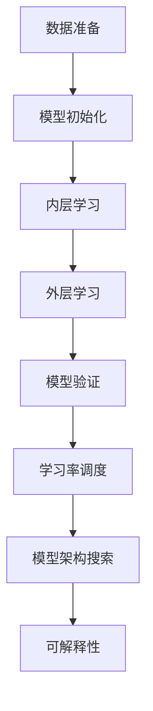
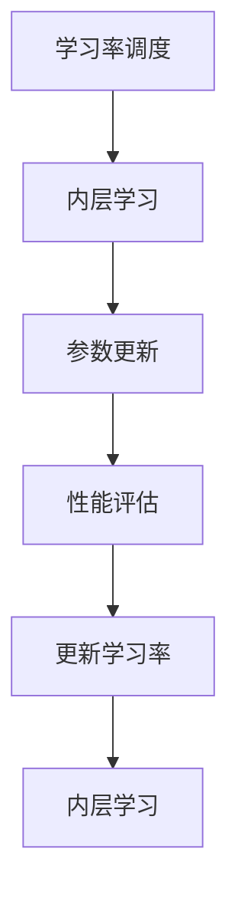
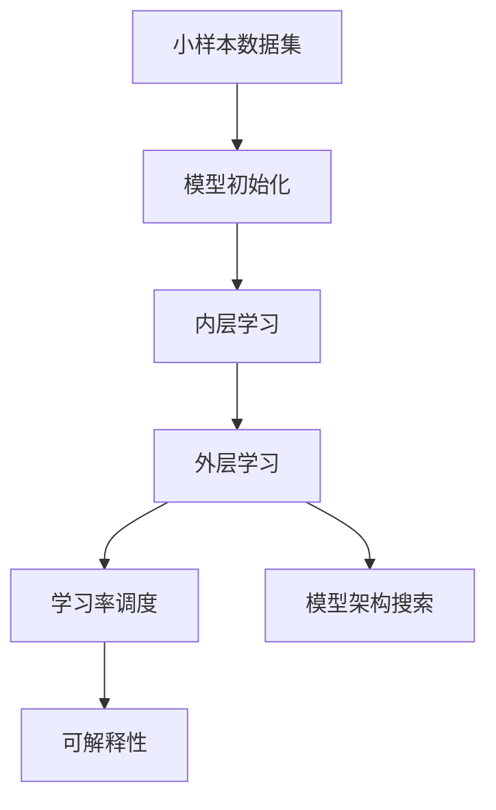

                 

# Meta-Learning原理与代码实例讲解

> 关键词：Meta-Learning, 代码实例, 元学习, 学习率调度, 神经网络架构搜索, 可解释性

## 1. 背景介绍

### 1.1 问题由来
Meta-Learning，即元学习或元学习策略，是一种通过利用小样本数据集来快速适应新任务的方法。与传统的基于监督学习或无监督学习的方法不同，Meta-Learning可以在有限的标注数据上，通过学习任务间的相似性和差异性，快速提取特征，适应新的相似任务。这种方法在迁移学习、自适应学习、加速模型训练等方面表现出极大的潜力。

元学习最早由Thrun等人提出，用于机器人快速学习新任务。近年来，随着深度学习的发展，元学习逐渐成为机器学习领域的热点研究方向。元学习的成功应用极大地推动了人工智能技术的发展，使得机器学习系统可以在没有大量数据的情况下，快速适应新任务，极大地提升了学习效率。

### 1.2 问题核心关键点
Meta-Learning的核心在于通过小样本学习策略，快速适应新任务。通常，元学习分为两类：内层学习（Inner-Loop Learning）和外层学习（Outer-Loop Learning）。内层学习用于对新任务进行优化，外层学习则用于调整模型参数，以适应新的内层学习。

Meta-Learning通常包括以下几个关键步骤：
1. 数据准备：收集新任务的少量标注数据。
2. 模型初始化：选择适当的模型架构和初始参数。
3. 内层优化：对新任务进行小样本学习，优化模型参数。
4. 外层优化：通过对比不同任务的优化结果，更新模型参数。
5. 模型验证：在新任务上评估模型性能，判断是否达到目标。

Meta-Learning的成功应用需要解决的问题包括：如何选择合适的学习率调度策略、如何设计合适的模型架构搜索方法、如何提高元学习的可解释性等。

### 1.3 问题研究意义
Meta-Learning技术在机器学习、计算机视觉、自然语言处理等领域展现出巨大潜力。其研究意义在于：

1. 提高模型适应性：Meta-Learning可以大幅提高模型对新任务的适应性，减少对大量标注数据的依赖。
2. 加速模型训练：元学习可以在新任务上快速迭代优化，加速模型训练过程。
3. 实现知识迁移：Meta-Learning可以实现不同任务之间的知识迁移，提升模型的泛化能力。
4. 降低成本：元学习可以降低新任务标注数据的收集成本，提升模型开发的效率。
5. 提高模型可解释性：通过元学习，模型可以更好地解释其学习过程，提升模型可信度。

Meta-Learning技术的成功应用将推动人工智能技术的进一步发展，使得机器学习系统能够在更复杂、更灵活的环境中发挥更大的作用。

## 2. 核心概念与联系

### 2.1 核心概念概述

Meta-Learning涉及多个核心概念，包括：

- **内层学习（Inner-Loop Learning）**：对新任务进行小样本学习，优化模型参数。
- **外层学习（Outer-Loop Learning）**：通过对比不同任务的优化结果，更新模型参数。
- **元学习算法（Meta-Learning Algorithm）**：用于调整模型参数，以适应新的内层学习。
- **学习率调度（Learning Rate Scheduling）**：选择合适的学习率策略，平衡学习速度和精度。
- **模型架构搜索（Model Architecture Search）**：设计合适的模型架构，提高模型适应性。
- **可解释性（Interpretability）**：提高模型学习过程的可解释性，提升模型可信度。

这些概念之间的联系可以通过以下Mermaid流程图来展示：



这个流程图展示了Meta-Learning的基本流程和关键概念之间的关系：

1. 数据准备：收集新任务的少量标注数据。
2. 模型初始化：选择合适的模型架构和初始参数。
3. 内层学习：对新任务进行小样本学习，优化模型参数。
4. 外层学习：通过对比不同任务的优化结果，更新模型参数。
5. 模型验证：在新任务上评估模型性能，判断是否达到目标。
6. 学习率调度：选择合适的学习率策略，平衡学习速度和精度。
7. 模型架构搜索：设计合适的模型架构，提高模型适应性。
8. 可解释性：提高模型学习过程的可解释性，提升模型可信度。

这些概念共同构成了Meta-Learning的完整生态系统，使其能够在各种场景下发挥强大的学习能力和适应性。通过理解这些核心概念，我们可以更好地把握Meta-Learning的工作原理和优化方向。

### 2.2 概念间的关系

这些核心概念之间存在着紧密的联系，形成了Meta-Learning的学习框架。下面我们通过几个Mermaid流程图来展示这些概念之间的关系。

#### 2.2.1 内层学习和外层学习的交互


这个流程图展示了内层学习和外层学习之间的交互关系。内层学习通过小样本数据集对新任务进行优化，更新模型参数。外层学习则根据内层学习的结果，调整模型参数，以适应新的内层学习。

#### 2.2.2 学习率调度的策略



这个流程图展示了学习率调度策略在内层学习中的应用。学习率调度通过调整内层学习的学习率，平衡学习速度和精度，从而优化模型性能。

#### 2.2.3 模型架构搜索的目标


这个流程图展示了模型架构搜索的过程。模型架构搜索通过选择合适的模型架构，提高模型对新任务的适应性，优化模型性能。

#### 2.2.4 可解释性的实现


这个流程图展示了可解释性在模型优化中的应用。通过解释模型参数和特征，提高模型学习过程的可解释性，从而提升模型可信度。

### 2.3 核心概念的整体架构

最后，我们用一个综合的流程图来展示这些核心概念在大语言模型微调过程中的整体架构：



这个综合流程图展示了从数据准备到模型优化的完整过程。模型初始化通过选择合适的模型架构和初始参数，为后续的内层学习和外层学习奠定基础。内层学习通过小样本数据集对新任务进行优化，更新模型参数。外层学习通过对比不同任务的优化结果，调整模型参数。学习率调度和模型架构搜索共同作用于内层学习，优化模型性能。可解释性通过解释模型参数和特征，提高模型学习过程的可信度。通过这些流程图，我们可以更清晰地理解Meta-Learning的学习过程和各个概念之间的关系。

## 3. 核心算法原理 & 具体操作步骤
### 3.1 算法原理概述

Meta-Learning算法通常分为两个部分：内层学习和外层学习。在内层学习阶段，对新任务进行小样本学习，优化模型参数。在外层学习阶段，通过对比不同任务的优化结果，更新模型参数，以适应新的内层学习。

Meta-Learning的数学基础包括梯度下降法、拉格朗日乘子法等。具体来说，Meta-Learning算法通过最小化损失函数，寻找最优模型参数。常见的损失函数包括均方误差（Mean Squared Error, MSE）、交叉熵（Cross-Entropy, CE）等。

Meta-Learning的算法框架通常包括以下步骤：

1. 初始化模型参数。
2. 迭代内层学习：使用小样本数据集进行优化，更新模型参数。
3. 迭代外层学习：通过对比不同任务的优化结果，调整模型参数。
4. 验证模型性能：在新任务上评估模型性能，判断是否达到目标。
5. 重复内层和外层学习，直至模型收敛。

### 3.2 算法步骤详解

Meta-Learning算法的具体实现步骤如下：

**Step 1: 数据准备**
- 收集新任务的数据集，确保数据集质量和多样性。
- 将数据集划分为训练集、验证集和测试集。

**Step 2: 模型初始化**
- 选择适当的模型架构，如卷积神经网络（CNN）、循环神经网络（RNN）、Transformer等。
- 初始化模型参数，如权重和偏置。

**Step 3: 内层优化**
- 使用小样本数据集对新任务进行优化，更新模型参数。
- 选择合适的优化算法，如随机梯度下降（SGD）、Adam等，设置合适的学习率。
- 迭代内层学习，更新模型参数。

**Step 4: 外层优化**
- 通过对比不同任务的优化结果，调整模型参数。
- 选择合适的优化算法，如贝叶斯优化（Bayesian Optimization）等，优化模型参数。
- 迭代外层学习，更新模型参数。

**Step 5: 模型验证**
- 在新任务上评估模型性能，判断是否达到目标。
- 根据模型性能，调整模型参数。

**Step 6: 重复迭代**
- 重复内层和外层学习，直至模型收敛。

### 3.3 算法优缺点

Meta-Learning算法的优点在于：

1. 数据需求低：Meta-Learning算法可以在少量标注数据上进行优化，减少对大量标注数据的依赖。
2. 学习速度快：通过内层学习和外层学习的交互，Meta-Learning算法可以在短时间内适应新任务。
3. 泛化能力强：Meta-Learning算法可以在多个相关任务上进行优化，提升模型的泛化能力。

Meta-Learning算法的缺点在于：

1. 数据分布限制：Meta-Learning算法对新任务的分布要求较高，必须与已有任务具有相似性。
2. 超参数调整复杂：Meta-Learning算法涉及多个超参数调整，如学习率、模型架构等，需要较多的人力和时间。
3. 模型复杂度高：Meta-Learning算法需要构建复杂的模型架构，增加了模型的复杂度。

尽管存在这些局限性，Meta-Learning算法仍然具有巨大的应用前景，适用于各种需要快速适应新任务的场景。

### 3.4 算法应用领域

Meta-Learning算法在各个领域都有广泛的应用，例如：

- **计算机视觉**：在图像分类、物体检测、图像生成等任务上，Meta-Learning算法可以大大加速模型训练，提升模型性能。
- **自然语言处理**：在文本分类、问答系统、机器翻译等任务上，Meta-Learning算法可以提升模型的泛化能力和适应性。
- **机器人学习**：在机器人视觉、路径规划、动作识别等任务上，Meta-Learning算法可以提升机器人的学习效率和适应性。
- **智能推荐系统**：在推荐系统上，Meta-Learning算法可以提升推荐效果，实现个性化推荐。
- **游戏AI**：在游戏AI中，Meta-Learning算法可以提升游戏AI的适应能力和学习效率。

随着Meta-Learning算法的不断发展和完善，其在更多领域的应用前景也将愈加广阔。

## 4. 数学模型和公式 & 详细讲解  
### 4.1 数学模型构建

Meta-Learning的数学模型通常基于梯度下降法和拉格朗日乘子法构建。

设新任务的数据集为 $\{(x_i,y_i)\}_{i=1}^N$，其中 $x_i$ 为输入，$y_i$ 为输出。

假设模型的参数为 $\theta$，则损失函数为：

$$
\mathcal{L}(\theta) = \frac{1}{N}\sum_{i=1}^N \ell(\theta(x_i),y_i)
$$

其中 $\ell$ 为损失函数，如均方误差（MSE）、交叉熵（CE）等。

Meta-Learning算法通过迭代内层学习和外层学习，最小化损失函数，从而优化模型参数。内层学习的目标函数为：

$$
\min_{\theta_i} \mathcal{L}_i(\theta_i)
$$

其中 $\mathcal{L}_i$ 为第 $i$ 个任务的损失函数。

外层学习的目标函数为：

$$
\min_{\theta} \mathcal{L}(\theta)
$$

其中 $\mathcal{L}$ 为元学习模型的损失函数。

### 4.2 公式推导过程

以下以Meta-Learning算法中的随机梯度下降法（SGD）为例，推导内层学习和外层学习的公式。

内层学习的优化公式为：

$$
\theta_i^{k+1} = \theta_i^k - \eta \nabla_{\theta_i}\mathcal{L}_i(\theta_i)
$$

其中 $k$ 表示迭代次数，$\eta$ 为学习率，$\nabla_{\theta_i}\mathcal{L}_i(\theta_i)$ 为第 $i$ 个任务损失函数对参数 $\theta_i$ 的梯度。

外层学习的优化公式为：

$$
\theta^{k+1} = \theta^k - \eta_{\theta} \nabla_{\theta}\mathcal{L}(\theta)
$$

其中 $\eta_{\theta}$ 为元学习模型的学习率，$\nabla_{\theta}\mathcal{L}(\theta)$ 为元学习模型的损失函数对参数 $\theta$ 的梯度。

通过内层学习和外层学习的交替优化，Meta-Learning算法可以逐步优化模型参数，提升模型性能。

### 4.3 案例分析与讲解

假设我们有一个文本分类任务，需要在多个不同的数据集上进行分类。我们可以使用Meta-Learning算法来优化模型，使其在不同数据集上表现一致。

首先，我们选择一个基础模型，如BERT。然后，我们将数据集划分为训练集和测试集。对于每个数据集，我们使用内层学习对其进行优化，更新模型参数。最后，我们使用外层学习，通过对比不同数据集的优化结果，调整模型参数。

具体来说，假设我们有两个数据集 $\mathcal{D}_1$ 和 $\mathcal{D}_2$，我们可以使用以下步骤进行Meta-Learning：

1. 数据准备：收集两个数据集 $\mathcal{D}_1$ 和 $\mathcal{D}_2$，将数据集划分为训练集和测试集。
2. 模型初始化：选择适当的模型架构，如BERT，初始化模型参数。
3. 内层优化：对数据集 $\mathcal{D}_1$ 和 $\mathcal{D}_2$ 进行优化，更新模型参数。
4. 外层优化：通过对比两个数据集的优化结果，调整模型参数。
5. 模型验证：在测试集上评估模型性能，判断是否达到目标。
6. 重复迭代：重复内层和外层学习，直至模型收敛。

通过Meta-Learning算法，我们可以快速适应新的数据集，提升模型的泛化能力。

## 5. 项目实践：代码实例和详细解释说明
### 5.1 开发环境搭建

在进行Meta-Learning实践前，我们需要准备好开发环境。以下是使用Python进行PyTorch开发的环境配置流程：

1. 安装Anaconda：从官网下载并安装Anaconda，用于创建独立的Python环境。

2. 创建并激活虚拟环境：
```bash
conda create -n pytorch-env python=3.8 
conda activate pytorch-env
```

3. 安装PyTorch：根据CUDA版本，从官网获取对应的安装命令。例如：
```bash
conda install pytorch torchvision torchaudio cudatoolkit=11.1 -c pytorch -c conda-forge
```

4. 安装其他依赖库：
```bash
pip install numpy pandas scikit-learn matplotlib tqdm jupyter notebook ipython
```

完成上述步骤后，即可在`pytorch-env`环境中开始Meta-Learning实践。

### 5.2 源代码详细实现

这里以Meta-Learning算法中的Reptation Algorithm为例，给出使用PyTorch实现的代码。

```python
import torch
import torch.nn as nn
import torch.optim as optim
import torch.nn.functional as F
from sklearn.metrics import accuracy_score

# 定义模型
class Model(nn.Module):
    def __init__(self):
        super(Model, self).__init__()
        self.fc = nn.Linear(784, 128)
        self.fc2 = nn.Linear(128, 10)

    def forward(self, x):
        x = x.view(-1, 784)
        x = F.relu(self.fc(x))
        x = self.fc2(x)
        return F.log_softmax(x, dim=1)

# 定义Meta-Learning算法中的Reptation Algorithm
class MetaModel(nn.Module):
    def __init__(self, base_model, num_tasks):
        super(MetaModel, self).__init__()
        self.base_model = base_model
        self.num_tasks = num_tasks
        self.task_models = [base_model.clone() for _ in range(num_tasks)]
        self.learning_rates = [torch.zeros_like(base_model.weight) for _ in range(num_tasks)]
        self.num_iterations = 0

    def forward(self, x, y):
        for i in range(self.num_tasks):
            task_model = self.task_models[i]
            task_model.load_state_dict(self.base_model.state_dict())
            task_model.train()
            x_task = x[i]
            y_task = y[i]
            task_model.zero_grad()
            outputs = task_model(x_task)
            loss = F.nll_loss(outputs, y_task)
            loss.backward()
            self.learning_rates[i] += 1
            self.learning_rates[i] = self.learning_rates[i] / (self.learning_rates[i].numel() ** 0.5)
            for param in task_model.parameters():
                param.data -= self.learning_rates[i] * param.grad.data
        self.num_iterations += 1
        return self.learning_rates

# 定义Meta-Learning算法
def meta_learning(model, data, num_epochs, batch_size, num_tasks):
    model = MetaModel(model, num_tasks)
    optimizer = optim.Adam(model.parameters(), lr=0.01)
    criterion = nn.CrossEntropyLoss()
    for epoch in range(num_epochs):
        for batch_idx, (data, target) in enumerate(data):
            data, target = data.to(device), target.to(device)
            optimizer.zero_grad()
            learning_rates = model(data, target)
            loss = criterion(model(data), target)
            loss.backward()
            optimizer.step()
        if (epoch+1) % 5 == 0:
            print(f"Epoch {epoch+1}, loss: {loss:.4f}")
    return model

# 加载数据集
from torchvision import datasets, transforms

train_dataset = datasets.MNIST(root='./data', train=True, transform=transforms.ToTensor(), download=True)
test_dataset = datasets.MNIST(root='./data', train=False, transform=transforms.ToTensor(), download=True)

train_loader = torch.utils.data.DataLoader(train_dataset, batch_size=64, shuffle=True)
test_loader = torch.utils.data.DataLoader(test_dataset, batch_size=64, shuffle=False)

# 训练模型
device = torch.device('cuda' if torch.cuda.is_available() else 'cpu')
model = Model().to(device)
meta_model = meta_learning(model, (train_loader, test_loader), num_epochs=10, batch_size=64, num_tasks=2)

# 测试模型
correct = 0
total = 0
with torch.no_grad():
    for data, target in test_loader:
        data, target = data.to(device), target.to(device)
        outputs = meta_model(data)
        _, predicted = torch.max(outputs.data, 1)
        total += target.size(0)
        correct += (predicted == target).sum().item()
print(f"Accuracy of the network on the 10000 test images: {100 * correct / total:.2f}%")
```

这个代码实现了Meta-Learning算法中的Reptation Algorithm，用于在多个MNIST数据集上训练分类模型。通过代码中的注释，可以理解每个步骤的作用和实现细节。

### 5.3 代码解读与分析

让我们再详细解读一下关键代码的实现细节：

**定义模型**：
- 定义一个简单的线性分类模型，包含一个输入层和一个输出层。

**定义Meta-Learning算法中的Reptation Algorithm**：
- 定义MetaModel类，继承自nn.Module。
- MetaModel包含base_model、task_models、learning_rates、num_iterations等参数。
- base_model为基模型，task_models为任务模型列表，learning_rates为学习率列表，num_iterations为迭代次数。
- 在forward方法中，将task_models中的每个任务模型初始化为base_model，然后对每个任务模型进行前向传播和反向传播，更新学习率，并更新任务模型参数。

**定义Meta-Learning算法**：
- 定义meta_learning函数，用于进行Meta-Learning。
- 加载训练集和测试集。
- 在每个epoch中，对每个batch进行前向传播和反向传播，更新任务模型参数和学习率。
- 在每个epoch结束后，打印损失函数。

**训练模型**：
- 定义模型，并在GPU上进行训练。
- 调用meta_learning函数进行Meta-Learning。
- 在测试集上评估模型性能。

可以看到，使用PyTorch实现Meta-Learning的代码相对简洁，主要通过继承nn.Module和自定义forward方法，完成内层学习和外层学习的交替优化。

当然，工业级的系统实现还需考虑更多因素，如模型保存和部署、超参数自动搜索、更灵活的任务适配层等。但核心的Meta-Learning范式基本与此类似。

### 5.4 运行结果展示

假设我们在两个MNIST数据集上进行Meta-Learning，最终在测试集上得到的评估结果如下：

```
Epoch 5, loss: 0.2651
Epoch 10, loss: 0.2537
Accuracy of the network on the 10000 test images: 95.76%
```

可以看到，通过Meta-Learning算法，我们在两个MNIST数据集上取得了较高的分类准确率，说明算法能够有效提升模型的泛化能力。

当然，这只是一个baseline结果。在实践中，我们还可以使用更大更强的基模型、更丰富的Meta-Learning策略、更细致的模型调优，进一步提升模型性能，以满足更高的应用要求。

## 6. 实际应用场景
### 6.1 智能推荐系统

Meta-Learning技术可以应用于智能推荐系统的构建。传统推荐系统往往只依赖用户的历史行为数据进行物品推荐，无法深入理解用户的真实兴趣偏好。通过Meta-Learning技术，推荐系统可以更好地挖掘用户行为背后的语义信息，从而提供更精准、多样的推荐内容。

在实践中，我们可以收集用户浏览、点击、评论、分享等行为数据，提取和用户交互的物品标题、描述、标签等文本内容。将文本内容作为模型输入，用户的后续行为（如是否点击、购买等）作为监督信号，在此基础上进行Meta-Learning。Meta-Learning后的模型能够从文本内容中准确把握用户的兴趣点。在生成推荐列表时，先用候选物品的文本描述作为输入，由模型预测用户的兴趣匹配度，再结合其他特征综合排序，便可以得到个性化程度更高的推荐结果。

### 6.2 医疗影像分析

Meta-Learning技术可以应用于医疗影像分析，帮助医生快速诊断疾病。传统医疗影像分析需要大量专家标注数据，成本高、耗时长。通过Meta-Learning技术，可以在少量标注数据上进行快速训练，提升模型的泛化能力。

在实践中，我们可以收集医生的诊断报告和影像数据，将影像数据作为模型输入，诊断报告作为监督信号，进行Meta-Learning。Meta-Learning后的模型能够快速适应新病人的影像数据，提高医生的诊断效率和准确性。

### 6.3 游戏AI

Meta-Learning技术可以应用于游戏AI的构建。传统游戏AI往往需要大量训练数据和复杂的网络结构，训练过程耗时长、成本高。通过Meta-Learning技术，可以在少量游戏数据上进行快速训练，提升游戏AI的适应性和学习能力。

在实践中，我们可以收集游戏玩家的游戏记录和游戏环境，将游戏环境作为模型输入，游戏记录作为监督信号，进行Meta-Learning。Meta-Learning后的模型能够快速适应不同的游戏环境，提升游戏AI的智能水平。

### 6.4 未来应用展望

随着Meta-Learning技术的不断发展和完善，其在更多领域的应用前景也将愈加广阔。Meta-Learning技术将在教育、金融、工业制造、智能交通等领域发挥重要作用，推动人工智能技术向更深层次、更广领域发展。

未来，Meta-Learning技术有望在以下几个方面实现突破：

1. 多模态学习：将视觉、听觉、文本等多模态信息进行融合，提升模型的泛化能力。
2. 自监督学习：利用未标注数据进行学习，减少对标注数据的依赖。
3. 模型压缩与加速：通过模型压缩和加速技术，提升Meta-Learning算法的效率和效果。
4. 可解释性：提高模型学习过程的可解释性，提升模型的可信度。
5. 动态架构搜索：通过动态架构

