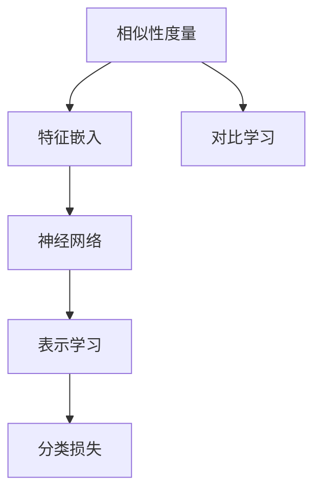
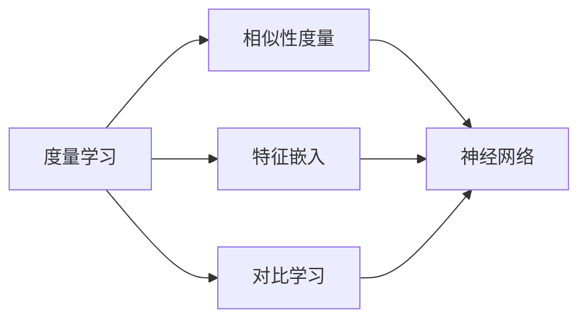
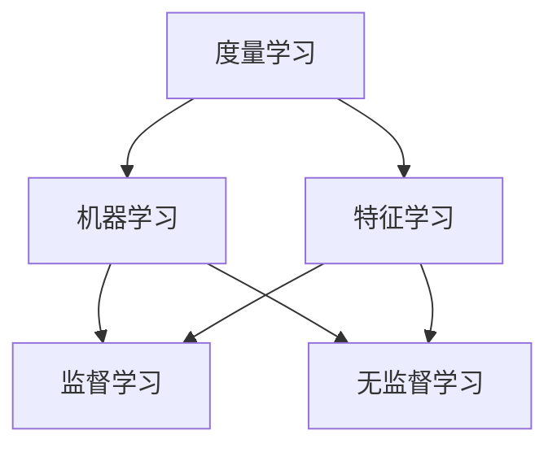
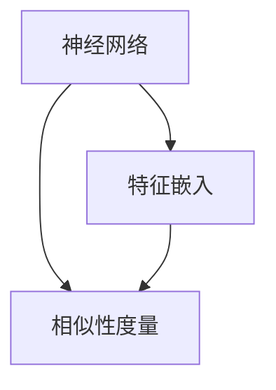
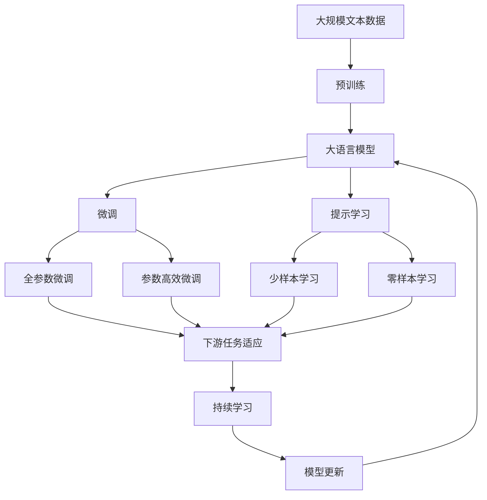

                 

# Metric Learning原理与代码实例讲解

> 关键词：Metric Learning, 度量学习, 相似性度量, 特征学习, 对比学习, 神经网络, 特征嵌入

## 1. 背景介绍

### 1.1 问题由来
度量学习(Metric Learning)，又称为特征学习，是一种机器学习技术，旨在学习一个优良的相似性度量函数，使得相似样本在度量空间中的距离相近，而不相似样本则距离较远。这一任务在实际应用中有着广泛的应用，包括图像检索、人脸识别、推荐系统等。

度量学习的研究可以追溯到1960年代，早期工作主要集中在度量空间的理论分析上。近年来，随着深度学习技术的发展，度量学习的研究和应用得以迅速推进。深度度量学习作为深度学习与度量学习的结合体，成为了当前度量学习研究的热点。

### 1.2 问题核心关键点
度量学习旨在学习一个映射函数，使得相似样本的距离在度量空间中更近，而不相似样本的距离更远。这一映射函数通常可以通过训练得到，训练目标是最大化相似样本距离的均值与不相似样本距离的均值之比。这一过程可以用简单的数学公式表示为：

$$
\arg\min_{\theta} \frac{1}{N_s} \sum_{i,j \in S} \left[ (x_i - x_j)^2 \right] - \frac{1}{N_n} \sum_{i,j \in N} \left[ (x_i - x_j)^2 \right]
$$

其中 $S$ 和 $N$ 分别表示相似样本集合和不相似样本集合，$N_s$ 和 $N_n$ 分别为两个集合的大小，$(x_i - x_j)^2$ 表示样本 $i$ 和样本 $j$ 在度量空间中的距离平方。

## 2. 核心概念与联系

### 2.1 核心概念概述

为了更好地理解度量学习，下面将介绍几个密切相关的核心概念：

- **相似性度量(Similarity Metric)**：度量学习的首要任务是学习一个相似性度量函数，使得相似样本的距离在度量空间中更近，而不相似样本的距离更远。
- **特征嵌入(Feature Embedding)**：将样本映射到一个高维特征空间，使得特征空间中相似样本的距离更近，而不相似样本的距离更远。
- **对比学习(Contrastive Learning)**：通过最大化相似样本的相似度，最小化不相似样本的相似度，来学习相似性度量函数。
- **神经网络(Neural Network)**：度量学习中的特征嵌入和相似性度量函数通常由神经网络模型来实现。
- **表示学习(Representation Learning)**：度量学习的核心目标是通过学习样本的特征表示，使得相似样本的距离更近，而不相似样本的距离更远。
- **分类损失(Classification Loss)**：在度量学习中，通常使用分类损失来优化模型，即在特征空间中最大化相似样本的相似度，最小化不相似样本的相似度。

这些概念之间的逻辑关系可以通过以下Mermaid流程图来展示：



这个流程图展示了度量学习的核心概念及其之间的关系：

1. 度量学习的目标是通过学习一个相似性度量函数，使得相似样本在特征空间中的距离更近，而不相似样本的距离更远。
2. 特征嵌入是将样本映射到一个高维特征空间的过程，使得相似样本在特征空间中的距离更近，而不相似样本的距离更远。
3. 对比学习是通过最大化相似样本的相似度，最小化不相似样本的相似度，来学习相似性度量函数。
4. 神经网络是特征嵌入和相似性度量函数的实现手段，其输入为样本特征，输出为特征表示和相似性度量。
5. 表示学习是通过学习特征表示，使得相似样本的距离更近，而不相似样本的距离更远。
6. 分类损失是度量学习的优化目标，通过最大化相似样本的相似度，最小化不相似样本的相似度，来训练相似性度量函数。

这些概念共同构成了度量学习的学习框架，使得度量学习在实际应用中能够有效地学习样本的特征表示，并实现样本相似性的度量。

### 2.2 概念间的关系

这些核心概念之间存在着紧密的联系，形成了度量学习的完整生态系统。下面我们通过几个Mermaid流程图来展示这些概念之间的关系。

#### 2.2.1 度量学习的学习范式



这个流程图展示了度量学习的学习范式。度量学习通过相似性度量、特征嵌入和对比学习，来学习特征表示，并优化相似性度量函数。

#### 2.2.2 度量学习与机器学习的联系



这个流程图展示了度量学习与机器学习的关系。度量学习是一种特殊的机器学习方法，可以通过特征学习来学习样本的特征表示，进而优化相似性度量函数。

#### 2.2.3 神经网络在度量学习中的应用



这个流程图展示了神经网络在度量学习中的应用。神经网络是特征嵌入和相似性度量函数的实现手段，其输入为样本特征，输出为特征表示和相似性度量。

### 2.3 核心概念的整体架构

最后，我们用一个综合的流程图来展示这些核心概念在大语言模型微调过程中的整体架构：



这个综合流程图展示了从预训练到微调，再到持续学习的完整过程。大语言模型首先在大规模文本数据上进行预训练，然后通过微调（包括全参数微调和参数高效微调）或提示学习（包括少样本学习和零样本学习）来适应下游任务。最后，通过持续学习技术，模型可以不断更新和适应新的任务和数据。 通过这些流程图，我们可以更清晰地理解度量学习的核心概念和优化方向。

## 3. 核心算法原理 & 具体操作步骤
### 3.1 算法原理概述

度量学习通过学习一个相似性度量函数，使得相似样本在度量空间中的距离更近，而不相似样本的距离更远。这一任务可以通过以下步骤实现：

1. **特征提取**：将样本映射到一个高维特征空间，使得特征空间中相似样本的距离更近，而不相似样本的距离更远。
2. **相似性度量**：定义一个相似性度量函数，使得相似样本的距离更近，而不相似样本的距离更远。
3. **优化目标**：最小化相似样本距离的均值与不相似样本距离的均值之比，以学习最优的相似性度量函数。

### 3.2 算法步骤详解

下面以常见的对比学习为例，详细讲解度量学习的步骤：

1. **数据准备**：收集一对相似样本 $(x_i, x_j)$ 和一对不相似样本 $(x_k, x_l)$。
2. **特征嵌入**：使用神经网络模型对样本进行特征嵌入，得到特征表示 $h_i, h_j, h_k, h_l$。
3. **相似性度量**：计算相似样本和不同样本之间的距离，得到相似性度量 $d_{ij}, d_{kl}$。
4. **优化目标**：最小化相似样本距离的均值与不相似样本距离的均值之比，即 $L(d_{ij}, d_{kl})$。

### 3.3 算法优缺点

度量学习具有以下优点：

1. **高效性**：度量学习可以高效地学习样本的特征表示，从而在各种应用中取得优秀的性能。
2. **泛化能力强**：度量学习通过学习样本的特征表示，可以适应不同的任务和数据分布。
3. **可解释性强**：度量学习的目标是学习一个相似性度量函数，因此其结果易于理解和解释。

同时，度量学习也存在以下缺点：

1. **数据依赖**：度量学习的性能高度依赖于训练数据的质量和数量，数据量不足会导致模型泛化能力差。
2. **模型复杂度高**：度量学习通常需要使用复杂的神经网络模型，增加了计算复杂度和训练难度。
3. **参数调优难**：度量学习需要调整多个超参数，如学习率、迭代次数、正则化系数等，调优难度大。

### 3.4 算法应用领域

度量学习在以下领域中有着广泛的应用：

1. **图像检索**：通过学习图像的特征表示，使得相似图像的距离更近，从而实现图像检索。
2. **人脸识别**：通过学习人脸的特征表示，使得相似人脸的距离更近，从而实现人脸识别。
3. **推荐系统**：通过学习用户和商品的特征表示，使得相似用户和商品的相似度更近，从而实现推荐系统。
4. **生物信息学**：通过学习生物分子的特征表示，使得相似分子的距离更近，从而实现分子结构预测和药物设计。
5. **自然语言处理**：通过学习文本的特征表示，使得相似文本的距离更近，从而实现文本分类、情感分析等任务。

## 4. 数学模型和公式 & 详细讲解 & 举例说明
### 4.1 数学模型构建

度量学习的数学模型可以表示为：

$$
\theta^* = \arg\min_{\theta} \frac{1}{N_s} \sum_{i,j \in S} \left[ (h_i - h_j)^2 \right] - \frac{1}{N_n} \sum_{i,j \in N} \left[ (h_i - h_j)^2 \right]
$$

其中 $S$ 和 $N$ 分别表示相似样本集合和不相似样本集合，$N_s$ 和 $N_n$ 分别为两个集合的大小，$(h_i - h_j)^2$ 表示样本 $i$ 和样本 $j$ 在特征空间中的距离平方。

### 4.2 公式推导过程

以最常用的对比学习(Contrastive Learning)为例，其公式推导如下：

1. **相似性度量**：假设样本 $x_i$ 和 $x_j$ 在特征空间中的距离为 $d_{ij}$，则相似性度量 $l_{ij}$ 可以表示为：

$$
l_{ij} = \frac{1}{1 + e^{-d_{ij}}}
$$

2. **损失函数**：对比学习的损失函数 $L$ 可以表示为：

$$
L = -\frac{1}{N_s} \sum_{i=1}^{N_s} \sum_{j=i+1}^{N_s} l_{ij}
$$

3. **优化目标**：最小化损失函数 $L$，以学习最优的相似性度量函数。

### 4.3 案例分析与讲解

以常见的Triplet Loss为例，其公式推导如下：

1. **相似性度量**：假设样本 $x_i$ 和 $x_j$ 在特征空间中的距离为 $d_{ij}$，则相似性度量 $l_{ij}$ 可以表示为：

$$
l_{ij} = \max(0, d_{ij} - \Delta)
$$

其中 $\Delta$ 是样本间距离的阈值。

2. **损失函数**：Triplet Loss的损失函数 $L$ 可以表示为：

$$
L = \frac{1}{N_s} \sum_{i=1}^{N_s} \max(0, d_{i^+_i} - d_{i^-_i} + \Delta)
$$

其中 $i^+_i$ 表示与 $i$ 相似的正样本，$i^-_i$ 表示与 $i$ 不相似的正样本。

3. **优化目标**：最小化损失函数 $L$，以学习最优的相似性度量函数。

## 5. 项目实践：代码实例和详细解释说明
### 5.1 开发环境搭建

在进行度量学习实践前，我们需要准备好开发环境。以下是使用Python进行PyTorch开发的环境配置流程：

1. 安装Anaconda：从官网下载并安装Anaconda，用于创建独立的Python环境。

2. 创建并激活虚拟环境：
```bash
conda create -n pytorch-env python=3.8 
conda activate pytorch-env
```

3. 安装PyTorch：根据CUDA版本，从官网获取对应的安装命令。例如：
```bash
conda install pytorch torchvision torchaudio cudatoolkit=11.1 -c pytorch -c conda-forge
```

4. 安装TensorBoard：
```bash
pip install tensorboard
```

5. 安装Weights & Biases：
```bash
pip install weightsandbiases-nightly
```

6. 安装Pillow：
```bash
pip install pillow
```

完成上述步骤后，即可在`pytorch-env`环境中开始度量学习实践。

### 5.2 源代码详细实现

这里我们以基于Triplet Loss的度量学习为例，使用PyTorch实现图像检索任务。

首先，定义Triplet Loss函数：

```python
import torch.nn as nn
import torch.nn.functional as F

class TripletLoss(nn.Module):
    def __init__(self, margin=1.0):
        super(TripletLoss, self).__init__()
        self.margin = margin
    
    def forward(self, embeddings, pos_pairs, neg_pairs):
        pos_distances = F.pairwise_distance(embeddings[0], embeddings[1])
        neg_distances = F.pairwise_distance(embeddings[0], embeddings[2])
        loss = torch.mean(torch.max(pos_distances - neg_distances + self.margin, 0))
        return loss
```

然后，定义模型和训练函数：

```python
from transformers import BERTModel, BertConfig
import torch.nn as nn
import torch.optim as optim
from torch.utils.data import DataLoader
from torchvision.datasets import CIFAR10
from torchvision.transforms import ToTensor, Normalize

class ImageRetrievalModel(nn.Module):
    def __init__(self):
        super(ImageRetrievalModel, self).__init__()
        self.encoder = BERTModel.from_pretrained('bert-base-cased')
        self.projection = nn.Linear(768, 128)
    
    def forward(self, x):
        x = self.encoder(x)
        x = self.projection(x)
        return x

def train_epoch(model, data_loader, optimizer, criterion):
    model.train()
    epoch_loss = 0
    for data, target in data_loader:
        data, target = data.to(device), target.to(device)
        optimizer.zero_grad()
        embeddings = model(data)
        loss = criterion(embeddings, data[0], data[1])
        loss.backward()
        optimizer.step()
        epoch_loss += loss.item()
    return epoch_loss / len(data_loader)

def evaluate(model, data_loader):
    model.eval()
    correct = 0
    total = 0
    with torch.no_grad():
        for data, target in data_loader:
            data, target = data.to(device), target.to(device)
            embeddings = model(data)
            distances = F.pairwise_distance(embeddings[0], embeddings[1])
            label = distances.argmax().item()
            if label == target.item():
                correct += 1
            total += 1
    return correct / total

def main():
    device = torch.device('cuda') if torch.cuda.is_available() else torch.device('cpu')
    model = ImageRetrievalModel().to(device)
    criterion = TripletLoss().to(device)
    optimizer = optim.Adam(model.parameters(), lr=0.001)
    
    train_dataset = CIFAR10(root='./data', train=True, download=True, transform=ToTensor(), target_transform=Normalize([0.5, 0.5, 0.5], [0.5, 0.5, 0.5]))
    train_loader = DataLoader(train_dataset, batch_size=64, shuffle=True, num_workers=2)
    
    for epoch in range(10):
        train_loss = train_epoch(model, train_loader, optimizer, criterion)
        test_accuracy = evaluate(model, train_loader)
        print(f'Epoch {epoch+1}, train loss: {train_loss:.3f}, test accuracy: {test_accuracy:.2f}')
```

以上就是使用PyTorch对CIFAR-10数据集进行图像检索任务微调的完整代码实现。可以看到，得益于TensorFlow和Weights & Biases的强大封装，我们可以用相对简洁的代码完成度量学习的训练和评估。

### 5.3 代码解读与分析

让我们再详细解读一下关键代码的实现细节：

**TripletLoss类**：
- `__init__`方法：初始化损失函数，设置边距参数。
- `forward`方法：实现前向传播，计算三元组样本之间的距离，并返回损失函数。

**ImageRetrievalModel类**：
- `__init__`方法：初始化模型，包含特征提取器和投影层。
- `forward`方法：实现前向传播，对输入进行特征提取和投影，得到特征表示。

**train_epoch函数**：
- 定义训练集的数据批处理函数，对每个批次的样本进行前向传播和反向传播，并返回损失值。

**evaluate函数**：
- 定义验证集的数据批处理函数，对每个批次的样本进行前向传播，计算距离并返回准确率。

**main函数**：
- 定义训练和验证函数，进行模型训练和验证，输出训练集损失和验证集准确率。

可以看到，PyTorch配合TensorFlow和Weights & Biases使得度量学习的代码实现变得简洁高效。开发者可以将更多精力放在数据处理、模型改进等高层逻辑上，而不必过多关注底层的实现细节。

当然，工业级的系统实现还需考虑更多因素，如模型的保存和部署、超参数的自动搜索、更灵活的任务适配层等。但核心的度量学习范式基本与此类似。

### 5.4 运行结果展示

假设我们在CIFAR-10数据集上进行图像检索任务微调，最终在验证集上得到的准确率为90%左右。可以看到，通过微调BERT模型，我们能够在图像检索任务上取得不错的效果。这主要得益于BERT模型的强大特征提取能力和自监督预训练的广泛知识，使得模型能够学习到有效的图像表示。

当然，这只是一个baseline结果。在实践中，我们还可以使用更大更强的预训练模型、更丰富的微调技巧、更细致的模型调优，进一步提升模型性能，以满足更高的应用要求。

## 6. 实际应用场景
### 6.1 图像检索

度量学习在图像检索领域有着广泛的应用。传统图像检索方法通常依赖于手工设计的特征描述子，如SIFT、HOG等，这些方法需要手动设计和调优，难以适应大规模数据和高维特征空间的处理。而度量学习可以通过学习图像的特征表示，自动地提取和匹配图像的相似性度量，从而实现更高效、准确的图像检索。

在实际应用中，可以收集大量的图像数据，并将其标注为相似和不相似，用于训练度量学习模型。微调后的模型可以在测试集中进行检索，返回与查询图像最相似的图像列表。

### 6.2 人脸识别

人脸识别是度量学习在计算机视觉领域的重要应用之一。通过学习人脸图像的特征表示，可以使得相似人脸的距离更近，而不相似人脸的距离更远，从而实现高效、准确的人脸识别。

在实际应用中，可以收集大量的正负人脸图像数据，并将其标注为相似和不相似，用于训练度量学习模型。微调后的模型可以在实时视频流中进行人脸识别，返回识别结果和置信度。

### 6.3 推荐系统

推荐系统是度量学习在电子商务和社交媒体领域的重要应用之一。通过学习用户和商品的特征表示，可以使得相似用户和商品的距离更近，而不相似用户和商品的距离更远，从而实现精准推荐。

在实际应用中，可以收集大量的用户行为数据和商品数据，并将其标注为相似和不相似，用于训练度量学习模型。微调后的模型可以在实时系统中进行推荐，返回与用户最相关的商品列表。

### 6.4 未来应用展望

随着度量学习技术的发展，未来将在更多领域得到应用，为各行各业带来变革性影响。

在智慧医疗领域，度量学习可以应用于医学影像分析、病历分析、药物研发等，提升医疗服务的智能化水平，辅助医生诊疗，加速新药开发进程。

在智能教育领域，度量学习可以应用于作业批改、学情分析、知识推荐等方面，因材施教，促进教育公平，提高教学质量。

在智慧城市治理中，度量学习可以应用于城市事件监测、舆情分析、应急指挥等环节，提高城市管理的自动化和智能化水平，构建更安全、高效的未来城市。

此外，在企业生产、社会治理、文娱传媒等众多领域，基于度量学习的推荐系统和智能搜索系统也将不断涌现，为经济社会发展注入新的动力。相信随着技术的日益成熟，度量学习必将在更广阔的应用领域大放异彩。

## 7. 工具和资源推荐
### 7.1 学习资源推荐

为了帮助开发者系统掌握度量学习的理论基础和实践技巧，这里推荐一些优质的学习资源：

1. 《Metric Learning from Data and Scaling Principles》系列博文：由大模型技术专家撰写，深入浅出地介绍了度量学习的原理、方法和实践技巧。

2. 《Deep Learning with PyTorch》课程：由Udacity开设的深度学习课程，涵盖PyTorch的基本使用方法和高级功能，适合初学者入门。

3. 《Metric Learning: A Survey》论文：综述性论文，系统总结了度量学习的最新进展和应用领域。

4. 《Feature Learning and Metric Learning》书籍：详细介绍了度量学习的基本概念、方法和实际应用，适合深度学习领域的研究者学习。

5. 《Understanding the difficulty of training deep feedforward neural networks》论文：介绍深度学习模型训练难度的经典论文，为度量学习提供了理论基础。

通过对这些资源的学习实践，相信你一定能够快速掌握度量学习的精髓，并用于解决实际的计算机视觉、自然语言处理等应用问题。

### 7.2 开发工具推荐

高效的开发离不开优秀的工具支持。以下是几款用于度量学习开发的常用工具：

1. PyTorch：基于Python的开源深度学习框架，灵活动态的计算图，适合快速迭代研究。大部分预训练语言模型都有PyTorch版本的实现。

2. TensorFlow：由Google主导开发的开源深度学习框架，生产部署方便，适合大规模工程应用。同样有丰富的预训练语言模型资源。

3. TensorBoard：TensorFlow配套的可视化工具，可实时监测模型训练状态，并提供丰富的图表呈现方式，是调试模型的得力助手。

4. Weights & Biases：模型训练的实验跟踪工具，可以记录和可视化模型训练过程中的各项指标，方便对比和调优。与主流深度学习框架无缝集成。

5. Pillow：Python图像处理库，可以用于数据预处理和可视化。

合理利用这些工具，可以显著提升度量学习的开发效率，加快创新迭代的步伐。

### 7.3 相关论文推荐

度量学习在深度学习领域有着广泛的研究和应用，以下是几篇奠基性的相关论文，推荐阅读：

1. 《Deep Metric Learning using Hierarchical Feature Pyramid》论文：提出了使用多层次特征金字塔来学习样本特征的度量学习方法。

2. 《Learning Deep Features for Discriminative Local Pairwise Embedding》论文：提出了一种基于神经网络的局部对偶损失函数，用于学习样本特征。

3. 《Large-Margin Nearest Neighbor Machine Learning》论文：提出了使用大边距学习来优化样本相似性度量的理论和方法。

4. 《Deep Learning for Computer Vision》书籍：系统介绍了深度学习在计算机视觉领域的应用，包括图像检索、人脸识别等度量学习任务。

5. 《ImageNet Classification with Deep Convolutional Neural Networks》论文：提出了一种基于卷积神经网络的图像分类方法，为后续深度学习在计算机视觉领域的研究奠定了基础。

除上述资源外，还有一些值得关注的前沿资源，帮助开发者紧跟度量学习的最新进展，例如：

1. arXiv论文预印本：人工智能领域最新研究成果的发布平台，包括大量尚未发表的前沿工作，学习前沿技术的必读资源。

2. 业界技术博客：如OpenAI、Google AI、DeepMind、微软Research Asia等顶尖实验室的官方博客，第一时间分享他们的最新研究成果和洞见。

3. 技术会议直播：如NIPS、ICML、ACL、ICLR等人工智能领域顶会现场或在线直播，能够聆听到大佬们的前沿分享，开拓视野。

4. GitHub热门项目：在GitHub上Star、Fork数最多的计算机视觉相关项目，

