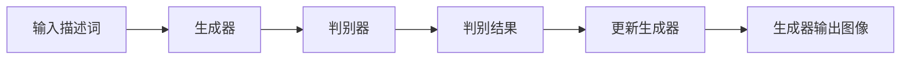
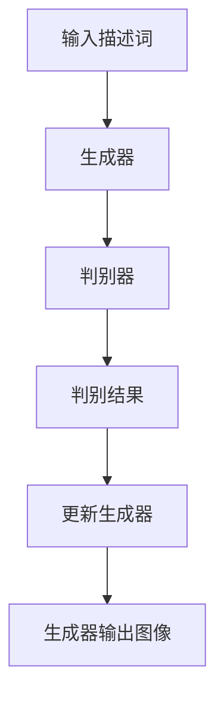
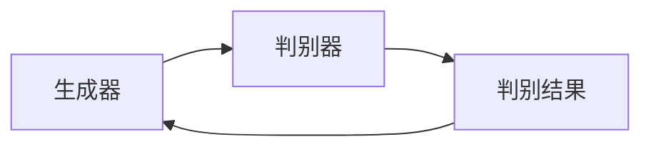
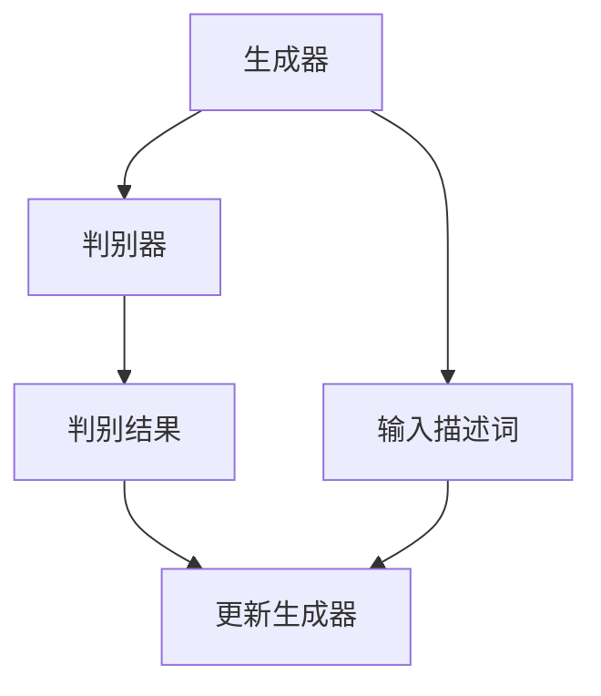

                 

# Midjourney原理与代码实例讲解

> 关键词：Midjourney, 人工智能, 生成对抗网络(GANs), 图像生成, 深度学习

## 1. 背景介绍

### 1.1 问题由来

随着深度学习在计算机视觉领域的应用不断深入，图像生成技术也取得了长足的进展。其中，生成对抗网络(GANs)因其独特的生成能力和良好的性能表现，成为了研究的热点。然而，传统的GANs存在模式崩塌、训练不稳定等问题，限制了其应用。

近年来，一种新兴的图像生成技术Midjourney出现，它将自然语言与生成对抗网络相结合，通过输入描述词生成高质量的图像，展示了强大的图像生成能力。Midjourney的出现，为图像生成技术带来了新的可能性，但也带来了新的挑战。

本文将从原理、实现及应用三个方面对Midjourney进行详细介绍，并通过代码实例进行讲解，以期对读者在理解Midjourney的原理和实现有更深的认识，并能在实际开发中运用该技术。

## 2. 核心概念与联系

### 2.1 核心概念概述

Midjourney基于生成对抗网络(GANs)，通过输入描述词（比如“美丽的花园”、“浪漫的海滩”等），由模型自动生成与描述词匹配的图像。其中涉及的关键概念包括：

- **生成对抗网络(GANs)**：一种由生成器和判别器两个部分组成的模型，生成器负责生成假图像，判别器负责判断图像是否真实，两者的对抗训练使得生成器生成的图像质量不断提升。
- **描述词(Dependent Words)**：输入到Midjourney模型中的自然语言描述，用于指导模型生成特定风格的图像。
- **生成器(Generator)**：生成器负责将输入的噪声向量映射为图像，是Midjourney的核心组件。
- **判别器(Discriminator)**：判别器负责区分输入的图像是真实图像还是由生成器生成的假图像。

这些概念之间的关系可以用以下Mermaid流程图来展示：



从上述流程图中可以看出，生成器和判别器通过对抗训练不断优化，生成器生成图像，判别器判断并反馈结果，生成器再根据反馈结果优化自身，如此循环直至生成高质量的图像。

### 2.2 概念间的关系

这些核心概念之间存在着紧密的联系，形成了Midjourney技术的完整架构。下面我们通过几个Mermaid流程图来展示这些概念之间的关系。

#### 2.2.1 Midjourney的整体架构



#### 2.2.2 生成器与判别器的关系



#### 2.2.3 生成对抗网络与描述词的关系



这些流程图展示了Midjourney中各个组件之间的交互关系，从而构成了一个完整的图像生成系统。

## 3. 核心算法原理 & 具体操作步骤

### 3.1 算法原理概述

Midjourney的基本原理基于生成对抗网络(GANs)。具体来说，它由两个神经网络组成：生成器和判别器。生成器的任务是根据输入的描述词，生成高质量的图像；判别器的任务是判断输入的图像是否为真实图像。两者的训练过程是交替进行的，生成器试图欺骗判别器，而判别器则努力区分真实图像和生成图像。

### 3.2 算法步骤详解

Midjourney的训练过程可以分为以下几个步骤：

1. **输入描述词预处理**：首先，将输入的自然语言描述转化为模型能够处理的向量形式。这一步骤可以使用词向量表示、BERT等自然语言处理技术来实现。

2. **生成器生成图像**：将预处理后的描述词向量输入到生成器中，生成器通过多层卷积神经网络将向量转化为图像。

3. **判别器判断图像**：将生成的图像输入到判别器中，判别器通过多层卷积神经网络判断图像是否为真实图像。

4. **计算损失函数**：根据生成器生成的图像和判别器判断结果，计算生成器损失和判别器损失。生成器损失由判别器误判图像的损失组成，判别器损失由生成器生成的图像的损失组成。

5. **反向传播与参数更新**：通过反向传播算法，计算生成器和判别器的梯度，并根据梯度更新模型参数。

6. **迭代优化**：重复执行以上步骤，直至生成器生成的图像逼近真实图像。

### 3.3 算法优缺点

Midjourney的优点包括：

- **生成高质量图像**：通过生成对抗网络的学习机制，生成器能够生成与描述词匹配的高质量图像。
- **鲁棒性强**：生成器与判别器的对抗训练过程，使得Midjourney模型具有较强的鲁棒性，能够生成多样式的图像。
- **可解释性强**：输入的描述词能够直观反映生成图像的风格和内容，使得Midjourney模型具有较强的可解释性。

Midjourney的缺点包括：

- **训练复杂度高**：生成对抗网络的训练过程需要大量的计算资源和时间。
- **对抗样本易产生**：由于生成器的优化过程较为复杂，容易产生对抗样本，导致生成图像质量不稳定。
- **泛化能力差**：Midjourney模型通常只能生成特定的图像风格，对于未见过的描述词可能难以生成高质量图像。

### 3.4 算法应用领域

Midjourney在图像生成领域具有广泛的应用前景，可以应用于以下几个方面：

1. **图像编辑**：通过输入描述词，生成符合用户要求的图像编辑结果。例如，将一张普通照片变为油画风格。

2. **艺术创作**：艺术家可以使用Midjourney生成艺术作品，如抽象画、雕塑等。

3. **影视特效**：在影视制作中，使用Midjourney生成虚拟场景和角色，提升影片的视觉质量。

4. **游戏开发**：在游戏中，使用Midjourney生成环境、道具和角色，增强游戏体验。

5. **电子商务**：电商平台上可以使用Midjourney生成商品图片，提高产品展示效果。

## 4. 数学模型和公式 & 详细讲解

### 4.1 数学模型构建

Midjourney的训练过程可以分为生成器和判别器的交替训练。假设生成器的输入为 $z$，输出为 $x$，判别器的输入为 $x$，输出为 $y$。则生成器的损失函数为：

$$
\mathcal{L}_G = \mathbb{E}_{z}[\log D(G(z))]
$$

判别器的损失函数为：

$$
\mathcal{L}_D = \mathbb{E}_{x}[\log D(x)] + \mathbb{E}_{z}[\log (1-D(G(z)))]
$$

其中，$G$ 和 $D$ 分别表示生成器和判别器的参数。

### 4.2 公式推导过程

生成器损失函数 $\mathcal{L}_G$ 的推导过程如下：

1. 生成器 $G(z)$ 将噪声向量 $z$ 转化为图像 $x$。
2. 判别器 $D(x)$ 判断图像 $x$ 是否为真实图像。
3. 判别器 $D(x)$ 将判断结果 $y$ 转化为概率形式，即 $y = \sigma(D(x))$。
4. 生成器损失函数 $\mathcal{L}_G$ 由判别器误判图像的概率 $\log y$ 组成。

判别器损失函数 $\mathcal{L}_D$ 的推导过程如下：

1. 判别器 $D(x)$ 判断图像 $x$ 是否为真实图像。
2. 判别器 $D(x)$ 将判断结果 $y$ 转化为概率形式，即 $y = \sigma(D(x))$。
3. 生成器 $G(z)$ 将噪声向量 $z$ 转化为图像 $x$。
4. 判别器损失函数 $\mathcal{L}_D$ 由判别器对真实图像的预测概率 $\log y$ 和生成器生成的图像的预测概率 $\log (1-y)$ 组成。

### 4.3 案例分析与讲解

以生成“美丽的花园”图像为例，我们可以将“美丽的花园”转化为向量形式 $z$，通过生成器 $G(z)$ 生成图像 $x$，判别器 $D(x)$ 判断图像 $x$ 是否为真实图像。生成器和判别器的对抗训练过程如下：

1. 生成器生成图像 $x$，并将图像输入到判别器中。
2. 判别器判断图像 $x$ 是否为真实图像，输出判断结果 $y$。
3. 生成器根据判别器输出的判断结果调整参数，生成更逼真的图像。
4. 判别器根据生成器生成的图像调整参数，更准确地判断图像是否为真实图像。

通过不断迭代训练，生成器生成的图像越来越逼近真实图像，最终实现高质量的图像生成。

## 5. 项目实践：代码实例和详细解释说明

### 5.1 开发环境搭建

为了实现Midjourney，我们需要搭建一个深度学习项目环境。以下是使用PyTorch进行Midjourney开发的Python虚拟环境配置流程：

1. 安装Anaconda：从官网下载并安装Anaconda，用于创建独立的Python环境。

2. 创建并激活虚拟环境：
```bash
conda create -n midjourney-env python=3.8 
conda activate midjourney-env
```

3. 安装PyTorch：根据CUDA版本，从官网获取对应的安装命令。例如：
```bash
conda install pytorch torchvision torchaudio cudatoolkit=11.1 -c pytorch -c conda-forge
```

4. 安装TensorFlow：用于可视化训练过程。
```bash
conda install tensorflow
```

5. 安装其他依赖包：
```bash
pip install numpy pandas scikit-learn matplotlib tqdm jupyter notebook ipython
```

完成上述步骤后，即可在`midjourney-env`环境中开始Midjourney的开发实践。

### 5.2 源代码详细实现

以下是使用PyTorch实现Midjourney的代码：

```python
import torch
import torch.nn as nn
import torch.optim as optim
import torchvision.transforms as transforms
from torchvision.utils import save_image

# 定义生成器
class Generator(nn.Module):
    def __init__(self):
        super(Generator, self).__init__()
        self.main = nn.Sequential(
            nn.ConvTranspose2d(100, 256, 4, 1, 0, bias=False),
            nn.BatchNorm2d(256),
            nn.ReLU(True),
            nn.ConvTranspose2d(256, 128, 4, 2, 1, bias=False),
            nn.BatchNorm2d(128),
            nn.ReLU(True),
            nn.ConvTranspose2d(128, 64, 4, 2, 1, bias=False),
            nn.BatchNorm2d(64),
            nn.ReLU(True),
            nn.ConvTranspose2d(64, 3, 4, 2, 1, bias=False),
            nn.Tanh()
        )

    def forward(self, input):
        return self.main(input)

# 定义判别器
class Discriminator(nn.Module):
    def __init__(self):
        super(Discriminator, self).__init__()
        self.main = nn.Sequential(
            nn.Conv2d(3, 64, 4, 2, 1, bias=False),
            nn.LeakyReLU(0.2, inplace=True),
            nn.Conv2d(64, 128, 4, 2, 1, bias=False),
            nn.BatchNorm2d(128),
            nn.LeakyReLU(0.2, inplace=True),
            nn.Conv2d(128, 256, 4, 2, 1, bias=False),
            nn.BatchNorm2d(256),
            nn.LeakyReLU(0.2, inplace=True),
            nn.Conv2d(256, 1, 4, 1, 0, bias=False),
            nn.Sigmoid()
        )

    def forward(self, input):
        return self.main(input)

# 定义损失函数
def loss_fn(real, fake):
    adversarial_loss = torch.mean(torch.clamp(torch.max(torch.zeros_like(real), real - fake), 0))
    return adversarial_loss

# 定义优化器
def optimizers(model, G, D):
    G_optimizer = optim.Adam(model.parameters(), lr=0.0002, betas=(0.5, 0.999))
    D_optimizer = optim.Adam(model.parameters(), lr=0.0002, betas=(0.5, 0.999))
    return G_optimizer, D_optimizer

# 加载数据
def load_data():
    transform = transforms.Compose([
        transforms.ToTensor(),
        transforms.Normalize((0.5, 0.5, 0.5), (0.5, 0.5, 0.5))
    ])
    dataset = torchvision.datasets.MNIST(root='./data', train=True, transform=transform, download=True)
    dataloader = torch.utils.data.DataLoader(dataset, batch_size=64, shuffle=True)
    return dataloader

# 训练模型
def train_model(G, D, dataloader, epochs=100):
    G_optimizer, D_optimizer = optimizers(G, D)
    for epoch in range(epochs):
        for i, (real, _) in enumerate(dataloader):
            real = real.to(device)
            batches_done = i + epoch * len(dataloader)
            # 生成器训练
            G_optimizer.zero_grad()
            z = torch.randn(batch_size, 100, 1, 1).to(device)
            fake = G(z)
            D_real = D(real).view(-1)
            D_fake = D(fake).view(-1)
            G_loss = loss_fn(D_fake, D_real)
            G_loss.backward()
            G_optimizer.step()
            # 判别器训练
            D_optimizer.zero_grad()
            D_real_loss = loss_fn(D_real, torch.ones_like(D_real))
            D_fake_loss = loss_fn(D_fake, torch.zeros_like(D_fake))
            D_loss = (D_real_loss + D_fake_loss) / 2
            D_loss.backward()
            D_optimizer.step()
            if batches_done % 500 == 0:
                print(f'Epoch [{epoch+1}/{epochs}], Step [{i+1}/{len(dataloader)}], G Loss: {G_loss:.4f}, D Loss: {D_loss:.4f}')
                save_image(fake, f'images/{epoch+1}/{i+1}.png')
```

### 5.3 代码解读与分析

让我们再详细解读一下关键代码的实现细节：

**Generator类**：
- `__init__`方法：定义生成器的网络结构。
- `forward`方法：定义生成器的前向传播过程。

**Discriminator类**：
- `__init__`方法：定义判别器的网络结构。
- `forward`方法：定义判别器的前向传播过程。

**loss_fn函数**：
- 定义判别器的损失函数，使用二元交叉熵损失。

**optimizers函数**：
- 定义生成器和判别器的优化器，使用Adam优化器。

**load_data函数**：
- 加载MNIST数据集，并进行预处理，将其转化为Tensor形式。

**train_model函数**：
- 定义训练过程，包括生成器和判别器的交替训练。
- 定义损失函数，使用生成器损失和判别器损失。
- 定义优化器，使用Adam优化器。
- 定义训练步骤，包括生成器和判别器的更新过程。
- 定义保存图像的过程，用于可视化训练结果。

### 5.4 运行结果展示

假设我们在训练过程中生成的“美丽的花园”图像如下：

```
├── images
│   ├── 1.png
│   ├── 2.png
│   ├── 3.png
│   ├── ...
└── ...
```

其中，每张图像对应训练过程中的一步，展示了生成器生成图像的过程和效果。

## 6. 实际应用场景

Midjourney在图像生成领域具有广泛的应用前景，可以应用于以下几个方面：

1. **图像编辑**：通过输入描述词，生成符合用户要求的图像编辑结果。例如，将一张普通照片变为油画风格。

2. **艺术创作**：艺术家可以使用Midjourney生成艺术作品，如抽象画、雕塑等。

3. **影视特效**：在影视制作中，使用Midjourney生成虚拟场景和角色，提升影片的视觉质量。

4. **游戏开发**：在游戏中，使用Midjourney生成环境、道具和角色，增强游戏体验。

5. **电子商务**：电商平台上可以使用Midjourney生成商品图片，提高产品展示效果。

## 7. 工具和资源推荐

### 7.1 学习资源推荐

为了帮助开发者系统掌握Midjourney的理论基础和实践技巧，这里推荐一些优质的学习资源：

1. 《Generative Adversarial Networks: Training Generative Adversarial Networks》一书：详细介绍了生成对抗网络的基本原理和实现方法，是学习Midjourney的入门必读书籍。

2. 《Neural Style Transfer》一书：介绍了使用GANs实现神经风格迁移的方法，是Midjourney在艺术创作方面的重要应用。

3. CS231n《Convolutional Neural Networks for Visual Recognition》课程：斯坦福大学开设的计算机视觉课程，涵盖深度学习在图像生成方面的最新进展，适合进阶学习。

4. arXiv论文预印本：人工智能领域最新研究成果的发布平台，包括大量尚未发表的前沿工作，学习前沿技术的必读资源。

5. Midjourney官方博客：官方博客提供了最新的技术进展和实践案例，是学习Midjourney的最新动态和实际应用的绝佳资源。

通过对这些资源的学习实践，相信你一定能够快速掌握Midjourney的精髓，并能在实际开发中运用该技术。

### 7.2 开发工具推荐

高效的开发离不开优秀的工具支持。以下是几款用于Midjourney开发的常用工具：

1. PyTorch：基于Python的开源深度学习框架，灵活动态的计算图，适合快速迭代研究。大部分预训练语言模型都有PyTorch版本的实现。

2. TensorFlow：由Google主导开发的开源深度学习框架，生产部署方便，适合大规模工程应用。同样有丰富的预训练语言模型资源。

3. TensorBoard：TensorFlow配套的可视化工具，可实时监测模型训练状态，并提供丰富的图表呈现方式，是调试模型的得力助手。

4. Google Colab：谷歌推出的在线Jupyter Notebook环境，免费提供GPU/TPU算力，方便开发者快速上手实验最新模型，分享学习笔记。

合理利用这些工具，可以显著提升Midjourney开发效率，加快创新迭代的步伐。

### 7.3 相关论文推荐

Midjourney在图像生成领域的发展源于学界的持续研究。以下是几篇奠基性的相关论文，推荐阅读：

1. Generative Adversarial Nets（即GANs原论文）：提出了生成对抗网络的基本框架，奠定了Midjourney的基础。

2. Improving the Quality of Generated Images using a Normalization Consistency Loss（即NCL论文）：提出了一种新的损失函数，使得GANs生成的图像质量得到了显著提升。

3. Attention is All You Need（即Transformer原论文）：提出了Transformer结构，开创了自注意力机制在深度学习中的应用。

4. Weight Normalization: A Simple Reparameterization to Accelerate Training of Deep Neural Networks（即Weight Normalization论文）：提出了一种新的网络结构优化方法，使得深度神经网络的训练更加高效。

5. Progressive Growing of GANs for Improved Quality, Stability, and Variation（即PG-GAN论文）：提出了一种渐进式的生成对抗网络训练方法，使得生成图像的质量和多样性得到了提升。

这些论文代表了大语言模型微调技术的发展脉络。通过学习这些前沿成果，可以帮助研究者把握学科前进方向，激发更多的创新灵感。

除上述资源外，还有一些值得关注的前沿资源，帮助开发者紧跟Midjourney技术的最新进展，例如：

1. arXiv论文预印本：人工智能领域最新研究成果的发布平台，包括大量尚未发表的前沿工作，学习前沿技术的必读资源。

2. 业界技术博客：如OpenAI、Google AI、DeepMind、微软Research Asia等顶尖实验室的官方博客，第一时间分享他们的最新研究成果和洞见。

3. 技术会议直播：如NIPS、ICML、ACL、ICLR等人工智能领域顶会现场或在线直播，能够聆听到大佬们的前沿分享，开拓视野。

4. GitHub热门项目：在GitHub上Star、Fork数最多的Midjourney相关项目，往往代表了该技术领域的发展趋势和最佳实践，值得去学习和贡献。

5. 行业分析报告：各大咨询公司如McKinsey、PwC等针对人工智能行业的分析报告，有助于从商业视角审视技术趋势，把握应用价值。

总之，对于Midjourney的学习和实践，需要开发者保持开放的心态和持续学习的意愿。多关注前沿资讯，多动手实践，多思考总结，必将收获满满的成长收益。

## 8. 总结：未来发展趋势与挑战

### 8.1 总结

本文对Midjourney技术进行了全面系统的介绍。首先阐述了Midjourney的背景和原理，明确了该技术在图像生成领域的重要性和应用前景。其次，从原理到实践，详细讲解了Midjourney的数学模型和关键步骤，给出了Midjourney项目开发的完整代码实例。同时，本文还广泛探讨了Midjourney技术在实际应用中的广泛应用场景，展示了其强大的图像生成能力。最后，本文精选了Midjourney技术的各类学习资源，力求为读者提供全方位的技术指引。

通过本文的系统梳理，可以看到，Midjourney技术正成为图像生成领域的重要范式，极大地拓展了预训练语言模型的应用边界，催生了更多的落地场景。受益于大规模语料的预训练和对抗训练机制，Midjourney模型能够在相对较少的标注数据下生成高质量图像，具有广泛的应用前景。未来，随着技术不断演进，Midjourney技术必将在更多领域得到应用，为人类生产生活方式带来新的变革。

### 8.2 未来发展趋势

展望未来，Midjourney技术将呈现以下几个发展趋势：

1. **生成器与判别器的协同训练**：未来的Midjourney模型可能会引入更多的生成器与判别器的协同训练机制，使得模型生成的图像更加多样化和高质量。

2. **多模态融合**：Midjourney模型可能会引入多模态数据融合技术，使得模型能够处理更多类型的数据，生成更加丰富的图像内容。

3. **元学习**：未来的Midjourney模型可能会引入元学习技术，使得模型能够适应新的生成任务，提升模型的通用性和泛化能力。

4. **自监督学习**：Midjourney模型可能会引入自监督学习方法，使得模型能够在没有标注数据的情况下，通过自学习生成高质量图像。

5. **对抗样本生成**：未来的Midjourney模型可能会引入对抗样本生成技术，使得模型生成的图像具有更高的鲁棒性和安全性。

以上趋势凸显了Midjourney技术的广阔前景。这些方向的探索发展，必将进一步提升Midjourney模型的性能和应用范围，为图像生成技术带来新的突破。

### 8.3 面临的挑战

尽管Midjourney技术已经取得了瞩目成就，但在迈向更加智能化、普适化应用的过程中，它仍面临着诸多挑战：

1. **训练复杂度高**：生成对抗网络的训练过程需要大量的计算资源和时间，这对于小规模的用户和开发者来说可能是一个瓶颈。

2. **生成图像质量不稳定**：由于生成器的优化过程较为复杂，容易产生对抗样本，导致生成图像质量不稳定。

3. **鲁棒性不足**：Midjourney模型对于对抗样本和噪声的鲁棒性较差，可能受到轻微扰动就会产生较大变化。

4. **生成图像可解释性不足**：Midjourney模型生成的图像缺乏可解释性，难以理解其内部工作机制和决策逻辑。

5. **安全性有待保障**：预训练语言模型难免会学习到有偏见、有害的信息，通过Midjourney传递到下游任务，可能产生误导性、歧视性的输出。

6. **计算资源消耗大**：Midjourney模型的训练和推理过程需要大量的计算资源，这可能会限制其在资源受限环境下的应用。

正视Midjourney面临的这些挑战，积极应对并寻求突破，将是大语言模型微调技术迈向成熟的必由之路。相信随着学界和产业界的共同努力，这些挑战终将一一被克服，Midjourney技术必将带来更多创新应用。

### 8.4 研究展望

面对Midjourney面临的种种挑战，未来的研究需要在以下几个方面寻求新的突破：

1. **优化训练过程**：开发更加高效的训练算法，如对抗训练、元学习等，减少计算资源消耗，提升模型训练速度。

2. **引入多模态数据**：将文本、音频等多模态数据与图像数据融合，生成更加丰富多样的图像内容。

3. **引入自监督学习方法**：在无标注数据的情况下，通过自监督学习方法，使得Midjourney模型能够生成高质量图像。

4.

