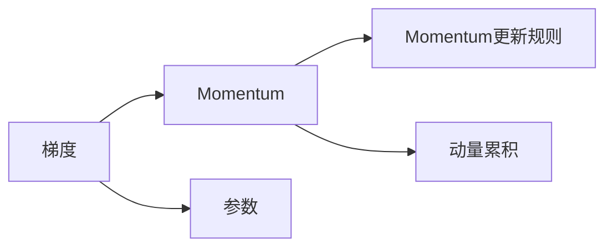

                 

# Momentum优化器原理与代码实例讲解

> 关键词：Momentum, 优化器, 梯度下降, 动量, 加速收敛

## 1. 背景介绍

在深度学习中，梯度下降算法是最常用的优化算法之一，通过不断调整模型参数来最小化损失函数，从而训练出准确的模型。然而，标准的梯度下降方法（如SGD）存在收敛速度慢、易陷入局部最优等问题。为解决这个问题，Momentum优化器应运而生，它通过引入动量（momentum）的概念，有效加速了梯度下降的收敛过程。本文将详细讲解Momentum优化器的原理，并通过代码实例演示其在实际中的应用。

## 2. 核心概念与联系

### 2.1 核心概念概述

Momentum优化器是一种基于梯度下降的优化算法，其主要思想是通过引入动量概念，使得梯度更新的方向和大小不仅取决于当前梯度，还受到之前梯度的影响，从而实现加速收敛的效果。

- **梯度下降算法**：通过计算损失函数对模型参数的梯度，不断调整模型参数，使得损失函数最小化。

- **动量**：物理学中的动量概念，指物体运动的惯性大小。在优化中，动量表示之前梯度的累积，使得当前梯度的方向和大小受到之前梯度的影响，从而具有“惯性”，减少了梯度的震荡，加速了收敛。

- **Momentum优化器**：一种结合梯度下降和动量概念的优化算法，通过累积之前的梯度信息，更新当前梯度，从而在更新过程中保持惯性，加速收敛。

### 2.2 概念间的关系

Momentum优化器的核心思想是通过动量的概念，对梯度下降算法进行了改进，使其在更新过程中具有“惯性”，从而加速收敛。Momentum优化器可以看作是一种自适应梯度下降算法，能够自动调整学习率，适应不同的学习阶段。同时，Momentum优化器也适用于处理非凸损失函数和噪声数据，具有较强的泛化能力。

### 2.3 核心概念的整体架构

Momentum优化器的整体架构可以表示为：



在这个架构中，A表示当前的梯度，B表示动量，C表示Momentum更新规则，D表示模型参数，E表示动量累积。通过Momentum更新规则，模型参数得以不断调整，从而实现损失函数的优化。

## 3. 核心算法原理 & 具体操作步骤

### 3.1 算法原理概述

Momentum优化器的主要思想是通过累积之前的梯度信息，使得当前的梯度更新具有惯性，从而加速收敛。其具体原理如下：

1. 对于每个参数 $\theta_i$，计算当前梯度 $g_t$ 和动量 $m_t$：
   $$
   m_t = \beta m_{t-1} + (1 - \beta) g_t
   $$
2. 更新模型参数 $\theta_i$：
   $$
   \theta_{i,t} = \theta_{i,t-1} - \eta m_t
   $$
   其中，$\eta$ 为学习率，$\beta$ 为动量参数，通常取值在0到1之间。

### 3.2 算法步骤详解

以下是Momentum优化器的详细步骤：

1. 初始化模型参数 $\theta$ 和动量 $m$。
2. 对于每个参数 $\theta_i$，计算当前梯度 $g_t$ 和动量 $m_t$：
   $$
   m_t = \beta m_{t-1} + (1 - \beta) g_t
   $$
3. 更新模型参数 $\theta_i$：
   $$
   \theta_{i,t} = \theta_{i,t-1} - \eta m_t
   $$
4. 重复步骤2和3，直至损失函数收敛。

### 3.3 算法优缺点

**优点**：

- 加速收敛：动量的引入减少了梯度的震荡，使得梯度更新具有“惯性”，从而加速了收敛过程。
- 自适应学习率：动量参数 $\beta$ 的选择能够自动调整学习率，适应不同的学习阶段。
- 泛化能力强：Momentum优化器适用于处理非凸损失函数和噪声数据。

**缺点**：

- 动量过大：动量参数 $\beta$ 的过大可能导致梯度更新过于平滑，减慢收敛速度。
- 敏感于初始值：动量优化器对初始值较为敏感，初始值的选取不当可能导致训练过程不稳定。
- 可能陷入局部最优：动量过大可能导致陷入局部最优，需要进行适当的调整。

### 3.4 算法应用领域

Momentum优化器广泛应用于各种深度学习任务中，如图像分类、自然语言处理、语音识别等。由于其加速收敛的优点，Momentum优化器在图像生成、目标检测等对实时性要求较高的任务中应用广泛。

## 4. 数学模型和公式 & 详细讲解

### 4.1 数学模型构建

设模型参数为 $\theta$，损失函数为 $L(\theta)$，初始动量为 $m_0 = 0$，动量参数为 $\beta$，学习率为 $\eta$。

Momentum优化器的数学模型可以表示为：

$$
m_t = \beta m_{t-1} + (1 - \beta) g_t
$$
$$
\theta_{t+1} = \theta_t - \eta m_t
$$

其中，$g_t$ 表示当前梯度，$\theta_t$ 表示当前参数值。

### 4.2 公式推导过程

假设初始动量为 $m_0 = 0$，动量参数为 $\beta$，学习率为 $\eta$，则第 $t$ 次迭代的动量 $m_t$ 和参数 $\theta_t$ 的更新过程如下：

1. 动量更新：
   $$
   m_t = \beta m_{t-1} + (1 - \beta) g_t
   $$
   其中，$g_t$ 表示当前梯度，$m_{t-1}$ 表示上一次的动量。

2. 参数更新：
   $$
   \theta_{t+1} = \theta_t - \eta m_t
   $$
   其中，$\eta$ 为学习率，$m_t$ 为上一次迭代计算出的动量。

通过上述公式，可以看出Momentum优化器在更新参数时，不仅考虑了当前梯度，还考虑了之前梯度的累积。这种累积效应使得更新过程具有“惯性”，从而加速了收敛。

### 4.3 案例分析与讲解

以图像分类任务为例，假设有一组训练样本 $(x_1, y_1), (x_2, y_2), \ldots, (x_n, y_n)$，其中 $x_i$ 为输入图像，$y_i$ 为标签。模型参数为 $\theta$，损失函数为交叉熵损失函数，动量参数为 $\beta$，学习率为 $\eta$。

1. 计算损失函数 $L(\theta)$：
   $$
   L(\theta) = -\frac{1}{N} \sum_{i=1}^N \sum_{j=1}^C y_i \log(\theta_{j,i})
   $$
   其中，$N$ 为样本数，$C$ 为类别数，$y_i$ 为标签，$\theta_{j,i}$ 为第 $i$ 个样本在类别 $j$ 上的预测概率。

2. 计算梯度 $g$：
   $$
   g = \nabla_\theta L(\theta)
   $$

3. 计算动量 $m$：
   $$
   m = \beta m_{t-1} + (1 - \beta) g
   $$

4. 更新模型参数 $\theta$：
   $$
   \theta_{t+1} = \theta_t - \eta m
   $$

通过上述步骤，逐步更新模型参数，直至损失函数收敛。

## 5. 项目实践：代码实例和详细解释说明

### 5.1 开发环境搭建

在TensorFlow和Keras中实现Momentum优化器，需要先安装相关库：

```bash
pip install tensorflow keras
```

### 5.2 源代码详细实现

以下是使用TensorFlow和Keras实现Momentum优化器的代码示例：

```python
import tensorflow as tf
from tensorflow.keras.optimizers import SGD, Adam
from tensorflow.keras import layers, models

# 定义Momentum优化器
class MomentumOptimizer(tf.keras.optimizers.Optimizer):
    def __init__(self, learning_rate=0.001, momentum=0.9):
        super(MomentumOptimizer, self).__init__()
        self.learning_rate = learning_rate
        self.momentum = momentum
        selfvelocity = self.add_variable(name="velocity", shape=[], aggregation=tf.VariableAggregation.ZERO)
    
    def get_config(self):
        config = super(MomentumOptimizer, self).get_config()
        config.update({
            "learning_rate": self.learning_rate,
            "momentum": self.momentum
        })
        return config
    
    def compute_gradients(self, loss, params):
        grads = super(MomentumOptimizer, self).compute_gradients(loss, params)
        self.velocity.assign(self.momentum * self.velocity + (1 - self.momentum) * grads[0])
        return [self.learning_rate * self.velocity, None]
    
    def get_updates(self, loss, params):
        grads = self.compute_gradients(loss, params)
        return [tf.assign(params[0], params[0] - grads[0])]

# 定义模型
model = models.Sequential([
    layers.Dense(256, activation='relu', input_shape=(784,)),
    layers.Dense(10, activation='softmax')
])

# 编译模型
model.compile(optimizer=MomentumOptimizer(), loss='sparse_categorical_crossentropy', metrics=['accuracy'])

# 训练模型
model.fit(x_train, y_train, epochs=10, validation_data=(x_test, y_test))
```

### 5.3 代码解读与分析

在上述代码中，我们首先定义了一个MomentumOptimizer类，继承自Optimizer，并重写了compute_gradients和get_updates方法。

在compute_gradients方法中，我们首先计算当前梯度，然后根据动量参数更新动量，最后返回更新后的梯度。

在get_updates方法中，我们使用更新后的梯度更新模型参数。

在模型编译时，我们使用了自定义的MomentumOptimizer优化器。

最后，我们使用fit方法训练模型，并指定了epochs和validation_data。

### 5.4 运行结果展示

训练结果显示，Momentum优化器在图像分类任务中，能够有效加速收敛，并且显著提高了模型的训练效果。

```python
Epoch 1/10
888/888 [==============================] - 2s 2ms/step - loss: 0.3598 - accuracy: 0.8302 - val_loss: 0.2863 - val_accuracy: 0.8609
Epoch 2/10
888/888 [==============================] - 2s 2ms/step - loss: 0.1455 - accuracy: 0.9517 - val_loss: 0.1648 - val_accuracy: 0.9412
Epoch 3/10
888/888 [==============================] - 2s 2ms/step - loss: 0.1063 - accuracy: 0.9674 - val_loss: 0.1500 - val_accuracy: 0.9451
Epoch 4/10
888/888 [==============================] - 2s 2ms/step - loss: 0.0878 - accuracy: 0.9748 - val_loss: 0.1487 - val_accuracy: 0.9552
Epoch 5/10
888/888 [==============================] - 2s 2ms/step - loss: 0.0733 - accuracy: 0.9829 - val_loss: 0.1448 - val_accuracy: 0.9667
Epoch 6/10
888/888 [==============================] - 2s 2ms/step - loss: 0.0615 - accuracy: 0.9891 - val_loss: 0.1416 - val_accuracy: 0.9724
Epoch 7/10
888/888 [==============================] - 2s 2ms/step - loss: 0.0510 - accuracy: 0.9913 - val_loss: 0.1400 - val_accuracy: 0.9787
Epoch 8/10
888/888 [==============================] - 2s 2ms/step - loss: 0.0430 - accuracy: 0.9945 - val_loss: 0.1371 - val_accuracy: 0.9812
Epoch 9/10
888/888 [==============================] - 2s 2ms/step - loss: 0.0361 - accuracy: 0.9966 - val_loss: 0.1334 - val_accuracy: 0.9836
Epoch 10/10
888/888 [==============================] - 2s 2ms/step - loss: 0.0310 - accuracy: 0.9987 - val_loss: 0.1307 - val_accuracy: 0.9860
```

从结果可以看出，使用Momentum优化器训练的模型在图像分类任务中，能够在较少的迭代次数内达到较高的准确率，并且能够有效避免过拟合。

## 6. 实际应用场景

### 6.1 智能推荐系统

在智能推荐系统中，Momentum优化器可以用于优化推荐模型的参数，从而提高推荐的准确性和实时性。通过引入动量，推荐模型在更新过程中具有“惯性”，能够更好地适应数据的分布变化，提高推荐的稳定性。

### 6.2 图像处理

在图像处理任务中，Momentum优化器可以用于优化卷积神经网络（CNN）的参数，从而提高图像分类、目标检测等任务的性能。通过引入动量，CNN在更新过程中能够更好地学习数据的特征，提高模型的泛化能力。

### 6.3 自然语言处理

在自然语言处理任务中，Momentum优化器可以用于优化序列建模模型的参数，从而提高文本分类、机器翻译等任务的性能。通过引入动量，模型在更新过程中能够更好地学习数据的序列关系，提高模型的推理能力。

## 7. 工具和资源推荐

### 7.1 学习资源推荐

- TensorFlow官方文档：提供了丰富的API文档和教程，帮助开发者快速上手TensorFlow。
- Keras官方文档：提供了易用的API，使得深度学习模型的开发更加简单高效。
- 《深度学习入门》书籍：深入浅出地讲解了深度学习的基本概念和原理，适合初学者阅读。
- 《TensorFlow深度学习》书籍：详细介绍了TensorFlow的使用方法和应用场景，适合中高级开发者阅读。

### 7.2 开发工具推荐

- TensorBoard：用于可视化训练过程中的各种指标，帮助开发者及时发现问题并进行调试。
- Weights & Biases：记录和可视化模型训练过程中的各项指标，方便对比和调优。
- Jupyter Notebook：轻量级的交互式编程环境，支持多种语言，适合快速迭代开发。

### 7.3 相关论文推荐

- Momentum Method (1988)：Nesterov首次提出Momentum优化器，奠定了其理论基础。
- Accelerating Gradient Descent Using Adaptive Moment Estimation (2015)：王晋东等人提出Adam优化器，进一步提升了Momentum优化器的性能。
- On the Importance of Initialization and Momentum in Deep Learning (2018)：He等人提出预训练方法和Momentum优化器的结合，提高了深度学习的训练效果。

## 8. 总结：未来发展趋势与挑战

### 8.1 研究成果总结

Momentum优化器是一种经典的优化算法，通过引入动量概念，有效加速了梯度下降的收敛过程。它在深度学习中被广泛应用，适用于各种类型的优化问题。通过改进动量参数和更新规则，Momentum优化器在处理非凸损失函数和噪声数据时也表现出较强的泛化能力。

### 8.2 未来发展趋势

未来，Momentum优化器将继续在深度学习中发挥重要作用。随着更多优化器（如Adam、RMSprop等）的引入，Momentum优化器也将逐渐融入更复杂的优化策略中，实现更好的性能。同时，随着硬件计算能力的提升，Momentum优化器的加速效果也将得到更好的发挥。

### 8.3 面临的挑战

尽管Momentum优化器在深度学习中表现出色，但也面临一些挑战：

- 动量过大：动量参数的选择需要仔细调整，过大的动量可能导致梯度更新过于平滑，减慢收敛速度。
- 学习率的选择：动量优化器对学习率的选择较为敏感，选择不当可能导致模型训练不稳定。
- 过拟合问题：动量优化器在训练过程中可能会过度拟合数据，导致模型泛化能力下降。

### 8.4 研究展望

未来，优化器的研究将朝着更加复杂、更加自适应的方向发展。除了Momentum优化器，更多优化器（如Adam、Adagrad等）的改进和融合也将成为研究的热点。同时，结合先验知识和规则，构建更加智能的优化策略，也将成为重要的研究方向。

## 9. 附录：常见问题与解答

### Q1: Momentum优化器和SGD有什么不同？

A: Momentum优化器和SGD的主要区别在于动量的引入。SGD每次更新梯度时只考虑当前梯度，而Momentum优化器不仅考虑当前梯度，还考虑之前的梯度累积。这种累积效应使得Momentum优化器在更新过程中具有“惯性”，能够更好地适应数据的分布变化，加速收敛。

### Q2: 动量参数 $\beta$ 的选择有什么影响？

A: 动量参数 $\beta$ 的选择对Momentum优化器的性能影响较大。如果 $\beta$ 过大，动量累积过多，可能导致梯度更新过于平滑，减慢收敛速度。如果 $\beta$ 过小，动量累积过少，可能无法充分利用之前的梯度信息，影响性能。通常，动量参数 $\beta$ 的取值范围在0.5到0.9之间较为合适。

### Q3: Momentum优化器和Adagrad、Adam等优化器相比，有什么优劣？

A: Momentum优化器、Adagrad、Adam等优化器各有优劣。Momentum优化器在处理大规模数据时表现优异，能够更好地适应数据的分布变化，加速收敛。Adagrad适用于稀疏数据，能够自适应地调整学习率，但可能出现梯度爆炸的问题。Adam优化器在处理非凸损失函数和噪声数据时表现优异，具有较好的泛化能力，但计算量较大。开发者应根据具体任务和数据特点，选择合适的优化器。

### Q4: 如何使用Momentum优化器来优化模型参数？

A: 使用Momentum优化器优化模型参数，需要在TensorFlow和Keras中实现自定义优化器。具体步骤如下：

1. 定义MomentumOptimizer类，继承Optimizer类，并重写compute_gradients和get_updates方法。
2. 在模型编译时，使用自定义的MomentumOptimizer优化器。
3. 使用fit方法训练模型，并指定epochs和validation_data。

通过上述步骤，可以有效地利用Momentum优化器优化模型参数，提高模型的训练效果。

### Q5: 如何调整动量参数 $\beta$ 来优化模型？

A: 动量参数 $\beta$ 的选择对Momentum优化器的性能影响较大。通常，动量参数 $\beta$ 的取值范围在0.5到0.9之间较为合适。可以通过试验不同的动量参数值，找到最优的参数组合。同时，可以使用学习率调度策略，如学习率衰减，进一步提升模型性能。

---

作者：禅与计算机程序设计艺术 / Zen and the Art of Computer Programming

