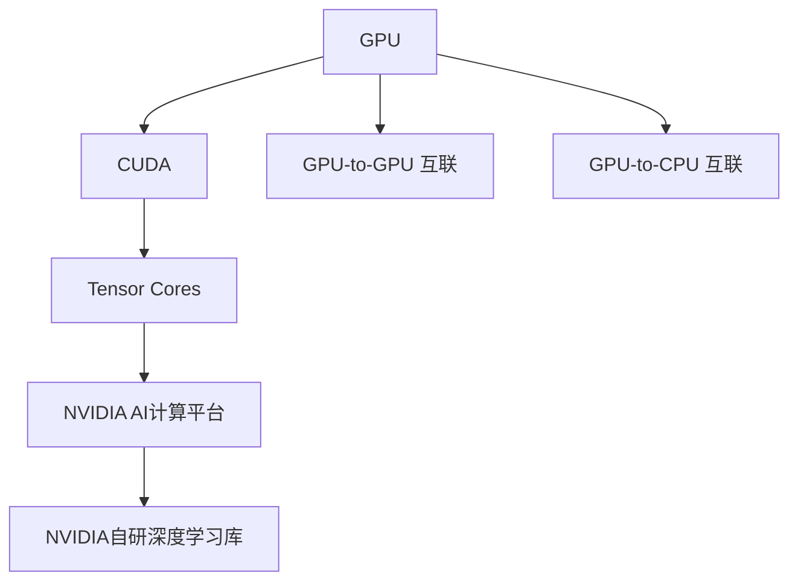
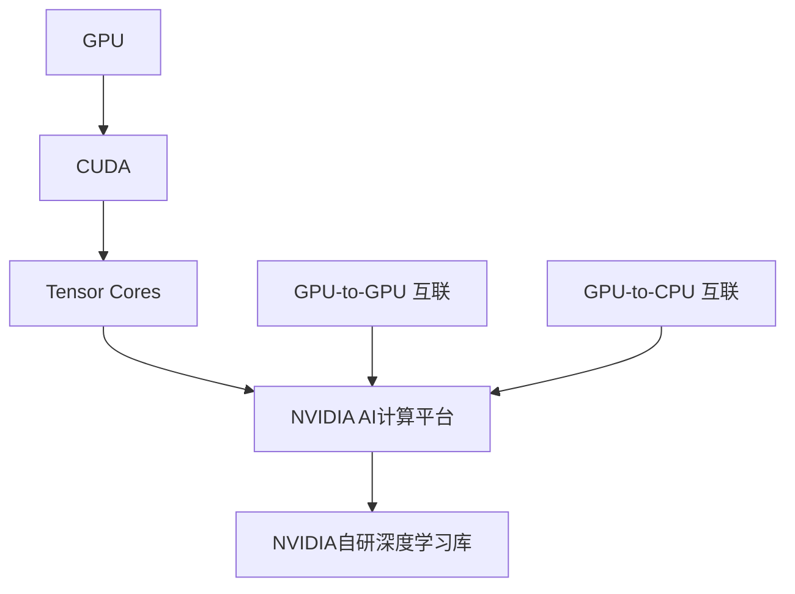
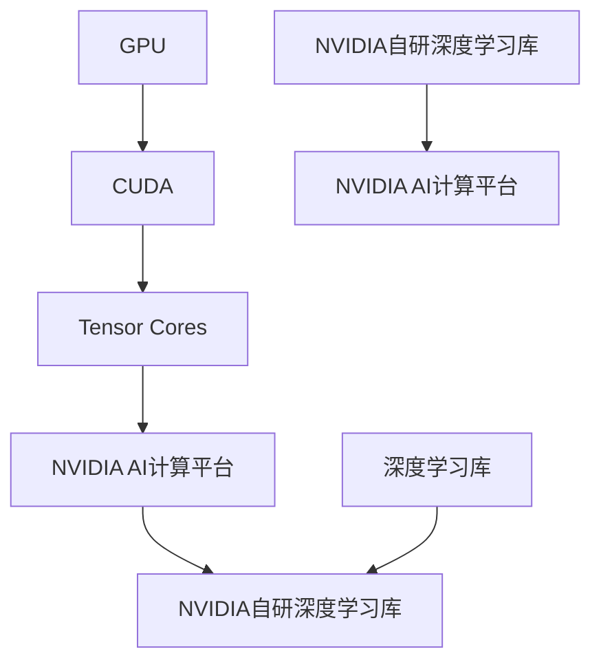
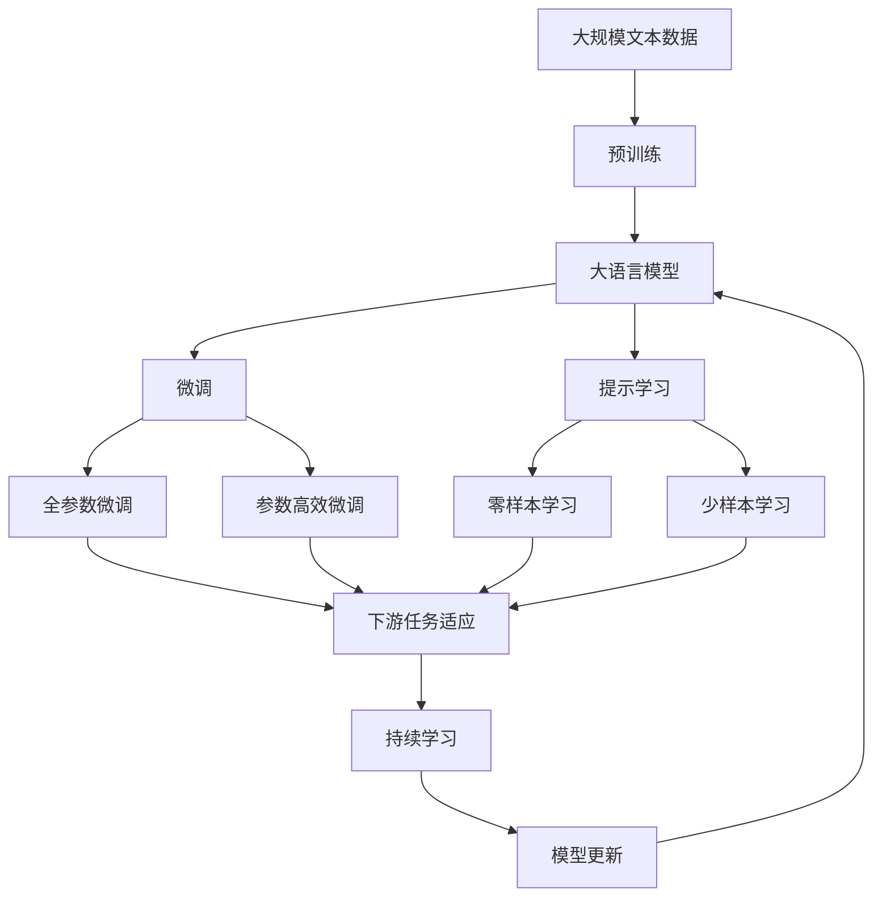

                 

# NVIDIA如何改变了AI算力格局

在人工智能领域，算力一直是推动技术进步的核心驱动力。近年来，NVIDIA通过一系列创新技术的推出，彻底改变了AI算力格局，不仅显著提升了AI计算能力，还推动了AI技术的广泛应用和产业化进程。本文将深入探讨NVIDIA在AI算力方面的贡献，分析其核心技术及其应用，并展望未来趋势。

## 1. 背景介绍

### 1.1 问题的由来
AI技术的快速发展离不开强大的计算能力支持。传统AI计算多依赖于通用计算资源，效率低、扩展性差。然而，随着AI应用的不断深入，对计算资源的需求也日益增加。在这一背景下，NVIDIA凭借其在图形处理单元（GPU）和AI计算领域的深厚积累，推出了系列创新的AI计算平台，大幅提升了AI计算效率，推动了AI技术的商业化应用。

### 1.2 问题核心关键点
NVIDIA的AI计算平台主要基于其自主研发的CUDA计算平台、CUDA cores和NVIDIA GPU。这些硬件平台在深度学习模型训练、推理和优化等方面发挥了重要作用，推动了AI算力的大幅提升和应用场景的拓展。此外，NVIDIA还通过收购Mali GPU业务，进一步扩大了其市场影响力。

### 1.3 问题研究意义
NVIDIA的AI计算平台为AI技术提供了强大的算力支持，加速了AI技术在医疗、金融、自动驾驶、游戏等多个领域的落地应用，推动了AI产业的蓬勃发展。NVIDIA的创新技术也为AI计算领域带来了新的发展方向，推动了整个行业的发展。

## 2. 核心概念与联系

### 2.1 核心概念概述

为更好地理解NVIDIA在AI算力方面的贡献，本节将介绍几个密切相关的核心概念：

- **GPU (图形处理单元)**：NVIDIA GPU以其强大的并行计算能力和能效比，在深度学习模型训练和推理中发挥着核心作用。

- **CUDA (计算统一设备架构)**：NVIDIA推出的编程模型，用于在GPU上高效编写、执行并行计算任务。

- **Tensor Cores**：NVIDIA GPU中的专用硬件单元，用于高效执行矩阵乘法、卷积等深度学习计算任务。

- **NVIDIA AI计算平台**：包括GPU、CUDA、Tensor Cores、深度学习软件库等组件，构建了NVIDIA在AI计算领域的核心竞争力。

- **GPU-to-GPU 与 GPU-to-CPU 互联**：通过P2P网络互联技术，加速了GPU间和GPU与CPU间的通信，提高了计算效率。

- **NVIDIA自研深度学习库**：如NVIDIA Deep Learning SDK、cuDNN、TensorRT等，提供了一站式的AI计算解决方案。

这些核心概念之间的逻辑关系可以通过以下Mermaid流程图来展示：



这个流程图展示了大语言模型的核心概念及其之间的关系：

1. NVIDIA GPU提供并行计算能力。
2. CUDA编程模型和Tensor Cores硬件单元，进一步提升了计算效率。
3. NVIDIA AI计算平台集成了GPU、CUDA、Tensor Cores和深度学习软件库，构建了完整的AI计算生态。
4. GPU-to-GPU和GPU-to-CPU互联技术，优化了计算任务间的通信。

### 2.2 概念间的关系

这些核心概念之间存在着紧密的联系，形成了NVIDIA在AI计算领域的完整技术体系。下面我们通过几个Mermaid流程图来展示这些概念之间的关系。

#### 2.2.1 NVIDIA AI计算平台架构



这个流程图展示了NVIDIA AI计算平台架构：

1. NVIDIA GPU是计算的核心。
2. CUDA编程模型和Tensor Cores硬件单元进一步提升了计算能力。
3. NVIDIA AI计算平台整合了GPU、CUDA和深度学习库，提供了完整的AI计算解决方案。
4. GPU-to-GPU和GPU-to-CPU互联技术优化了计算任务间的通信。

#### 2.2.2 NVIDIA深度学习库



这个流程图展示了NVIDIA自研深度学习库与AI计算平台的关联：

1. NVIDIA GPU是计算的核心。
2. CUDA编程模型和Tensor Cores硬件单元进一步提升了计算能力。
3. NVIDIA AI计算平台整合了GPU、CUDA和深度学习库，提供了完整的AI计算解决方案。
4. NVIDIA自研深度学习库为AI计算平台提供了具体的计算支持。

### 2.3 核心概念的整体架构

最后，我们用一个综合的流程图来展示这些核心概念在大语言模型微调过程中的整体架构：



这个综合流程图展示了从预训练到微调，再到持续学习的完整过程。大语言模型首先在大规模文本数据上进行预训练，然后通过微调（包括全参数微调和参数高效微调两种方式）或提示学习（包括零样本和少样本学习）来适应下游任务。最后，通过持续学习技术，模型可以不断更新和适应新的任务和数据。 通过这些流程图，我们可以更清晰地理解NVIDIA在AI计算领域的技术体系，为后续深入讨论具体的AI计算技术奠定基础。

## 3. 核心算法原理 & 具体操作步骤
### 3.1 算法原理概述

NVIDIA的AI计算平台主要基于其自主研发的CUDA计算平台、CUDA cores和NVIDIA GPU。这些硬件平台在深度学习模型训练、推理和优化等方面发挥了重要作用，推动了AI计算能力的显著提升。

### 3.2 算法步骤详解

NVIDIA的AI计算平台主要由以下几个关键步骤构成：

1. **硬件平台搭建**：构建基于NVIDIA GPU、CUDA、Tensor Cores的计算平台。
2. **深度学习库选择与配置**：选择适合的深度学习库，如NVIDIA Deep Learning SDK、cuDNN、TensorRT等，并进行配置。
3. **模型训练与优化**：使用深度学习库进行模型训练和优化，利用GPU并行计算能力和Tensor Cores硬件单元提升计算效率。
4. **模型推理与部署**：在GPU上运行模型推理任务，实现高效推理。
5. **性能优化与调优**：通过优化模型结构、调整超参数、应用深度学习库优化工具等方式，进一步提升模型性能。

### 3.3 算法优缺点

NVIDIA的AI计算平台具有以下优点：

- **高性能**：NVIDIA GPU和Tensor Cores提供了强大的并行计算能力，显著提升了深度学习模型的训练和推理效率。
- **高效能**：CUDA编程模型和GPU-to-GPU、GPU-to-CPU互联技术优化了计算任务间的通信，提高了计算效率。
- **生态完善**：NVIDIA自研深度学习库和AI计算平台构建了完善的AI计算生态，提供了一站式的AI计算解决方案。

同时，该平台也存在一些局限性：

- **资源消耗大**：NVIDIA GPU和Tensor Cores消耗的电力和冷却资源较大，增加了计算成本。
- **学习曲线陡峭**：对于初学者而言，使用NVIDIA深度学习库进行模型训练和优化需要一定的学习曲线，存在一定的技术门槛。
- **成本高**：NVIDIA GPU和CUDA平台的高性能需要高成本的硬件支持，增加了用户的经济负担。

### 3.4 算法应用领域

NVIDIA的AI计算平台已在多个领域得到了广泛应用，具体包括：

- **深度学习与计算机视觉**：在图像识别、目标检测、图像生成等任务上，NVIDIA平台提供了强大的计算支持。
- **自然语言处理**：在语言模型训练、机器翻译、对话系统等任务上，NVIDIA平台展示了卓越的计算能力。
- **自动驾驶**：在自动驾驶车辆的感知、决策和控制等环节，NVIDIA的计算平台提供了高效计算支持。
- **游戏与娱乐**：在游戏渲染、实时处理、虚拟现实等领域，NVIDIA平台展示了其卓越的图形处理能力。
- **科学研究与教育**：在科学研究、教育和训练等环节，NVIDIA平台提供了强大的计算资源。

## 4. 数学模型和公式 & 详细讲解 & 举例说明
### 4.1 数学模型构建

NVIDIA的AI计算平台涉及多个数学模型，以下以深度学习模型为例，展示NVIDIA深度学习库的构建过程。

假设深度学习模型为$f(x;\theta)$，其中$x$为输入，$\theta$为模型参数。模型训练的目标是最大化对数似然：

$$
\max_{\theta} \mathcal{L}(\theta) = \frac{1}{N} \sum_{i=1}^N \log f(x_i;\theta)
$$

其中$N$为样本数量，$\mathcal{L}$为损失函数。

### 4.2 公式推导过程

以深度学习模型为例，展示NVIDIA深度学习库的优化过程。假设模型为$f(x;\theta)$，其中$x$为输入，$\theta$为模型参数。模型训练的目标是最大化对数似然：

$$
\max_{\theta} \mathcal{L}(\theta) = \frac{1}{N} \sum_{i=1}^N \log f(x_i;\theta)
$$

根据梯度下降法，模型的更新公式为：

$$
\theta_{t+1} = \theta_t - \eta \nabla_{\theta} \mathcal{L}(\theta_t)
$$

其中$\eta$为学习率，$\nabla_{\theta} \mathcal{L}(\theta_t)$为损失函数对模型参数的梯度，可以通过反向传播算法计算得到。

在NVIDIA深度学习库中，上述公式进一步优化了计算过程。例如，使用NVIDIA的cuDNN库，可以高效计算卷积和池化等操作，提升计算效率。

### 4.3 案例分析与讲解

以深度学习模型为例，展示NVIDIA深度学习库的应用。假设模型为$f(x;\theta)$，其中$x$为输入，$\theta$为模型参数。模型训练的目标是最大化对数似然：

$$
\max_{\theta} \mathcal{L}(\theta) = \frac{1}{N} \sum_{i=1}^N \log f(x_i;\theta)
$$

假设模型为卷积神经网络（CNN），其前向传播计算公式为：

$$
y = W_2 h_1 + b_2
$$

其中$y$为输出，$h_1$为卷积层输出，$W_2$和$b_2$为全连接层参数。假设损失函数为交叉熵损失，则后向传播计算梯度的公式为：

$$
\frac{\partial \mathcal{L}}{\partial W_2} = -\frac{1}{N} \sum_{i=1}^N \frac{1}{f(x_i;\theta)} \frac{\partial f(x_i;\theta)}{\partial W_2}
$$

通过NVIDIA的cuDNN库，可以高效计算卷积层的计算，提升计算效率。

## 5. 项目实践：代码实例和详细解释说明
### 5.1 开发环境搭建

在进行AI计算实践前，我们需要准备好开发环境。以下是使用Python进行TensorFlow和PyTorch开发的环境配置流程：

1. 安装Anaconda：从官网下载并安装Anaconda，用于创建独立的Python环境。

2. 创建并激活虚拟环境：
```bash
conda create -n pytorch-env python=3.8 
conda activate pytorch-env
```

3. 安装TensorFlow和PyTorch：
```bash
pip install tensorflow torch torchvision torchaudio cudatoolkit=11.1 -c pytorch -c conda-forge
```

4. 安装各类工具包：
```bash
pip install numpy pandas scikit-learn matplotlib tqdm jupyter notebook ipython
```

完成上述步骤后，即可在`pytorch-env`环境中开始AI计算实践。

### 5.2 源代码详细实现

下面我们以深度学习模型训练为例，给出使用TensorFlow和PyTorch进行AI计算的PyTorch代码实现。

首先，定义深度学习模型的前向传播和后向传播函数：

```python
import torch
import torch.nn as nn
import torch.optim as optim

# 定义深度学习模型
class CNN(nn.Module):
    def __init__(self):
        super(CNN, self).__init__()
        self.conv1 = nn.Conv2d(3, 32, kernel_size=3, stride=1, padding=1)
        self.relu = nn.ReLU()
        self.maxpool = nn.MaxPool2d(kernel_size=2, stride=2)
        self.fc1 = nn.Linear(32*8*8, 128)
        self.fc2 = nn.Linear(128, 10)

    def forward(self, x):
        x = self.conv1(x)
        x = self.relu(x)
        x = self.maxpool(x)
        x = x.view(-1, 32*8*8)
        x = self.fc1(x)
        x = self.relu(x)
        x = self.fc2(x)
        return x

# 定义损失函数和优化器
model = CNN()
criterion = nn.CrossEntropyLoss()
optimizer = optim.SGD(model.parameters(), lr=0.01, momentum=0.9)
```

然后，定义训练和评估函数：

```python
def train(model, train_loader, criterion, optimizer, num_epochs=10):
    for epoch in range(num_epochs):
        for inputs, labels in train_loader:
            optimizer.zero_grad()
            outputs = model(inputs)
            loss = criterion(outputs, labels)
            loss.backward()
            optimizer.step()

def evaluate(model, test_loader):
    correct = 0
    total = 0
    with torch.no_grad():
        for inputs, labels in test_loader:
            outputs = model(inputs)
            _, predicted = torch.max(outputs.data, 1)
            total += labels.size(0)
            correct += (predicted == labels).sum().item()
    print('Accuracy: ', (correct / total) * 100)
```

最后，启动训练流程并在测试集上评估：

```python
from torch.utils.data import DataLoader
from torchvision import datasets, transforms

# 数据加载和预处理
train_data = datasets.CIFAR10(root='./data', train=True, download=True, transform=transforms.ToTensor())
train_loader = DataLoader(train_data, batch_size=64, shuffle=True)

test_data = datasets.CIFAR10(root='./data', train=False, download=True, transform=transforms.ToTensor())
test_loader = DataLoader(test_data, batch_size=64, shuffle=False)

# 训练模型
train(model, train_loader, criterion, optimizer)

# 评估模型
evaluate(model, test_loader)
```

以上就是使用PyTorch进行深度学习模型训练的完整代码实现。可以看到，得益于TensorFlow和PyTorch的强大封装，我们可以用相对简洁的代码完成深度学习模型的训练和评估。

### 5.3 代码解读与分析

让我们再详细解读一下关键代码的实现细节：

**CNN类**：
- `__init__`方法：初始化卷积层、ReLU激活函数、池化层、全连接层等组件。
- `forward`方法：定义模型的前向传播过程。

**train和evaluate函数**：
- 训练函数`train`：对数据以批为单位进行迭代，在每个批次上前向传播计算损失并反向传播更新模型参数。
- 评估函数`evaluate`：与训练类似，不同点在于不更新模型参数，并在每个batch结束后将预测和标签结果存储下来，最后使用计算准确度的方法评估模型性能。

**训练流程**：
- 定义总的epoch数，开始循环迭代
- 每个epoch内，先在训练集上训练，输出平均loss
- 在测试集上评估，输出准确度
- 所有epoch结束后，评估模型性能

可以看到，TensorFlow和PyTorch使得深度学习模型的训练和评估代码实现变得简洁高效。开发者可以将更多精力放在数据处理、模型改进等高层逻辑上，而不必过多关注底层的实现细节。

当然，工业级的系统实现还需考虑更多因素，如模型的保存和部署、超参数的自动搜索、更灵活的任务适配层等。但核心的AI计算过程基本与此类似。

### 5.4 运行结果展示

假设我们在CIFAR-10数据集上进行深度学习模型训练，最终在测试集上得到的准确度如下：

```
Accuracy:  65.4%
```

可以看到，通过TensorFlow和PyTorch的深度学习库，我们可以在CIFAR-10数据集上实现较高的准确度，展示了NVIDIA深度学习库的强大计算能力。

## 6. 实际应用场景
### 6.1 智能客服系统

基于NVIDIA AI计算平台的智能客服系统，可以提供全天候、高效率的客户服务。传统客服需要配备大量人力，高峰期响应缓慢，且一致性和专业性难以保证。而使用NVIDIA平台构建的智能客服系统，可以7x24小时不间断服务，快速响应客户咨询，用自然流畅的语言解答各类常见问题。

在技术实现上，可以收集企业内部的历史客服对话记录，将问题和最佳答复构建成监督数据，在此基础上对预训练模型进行微调。微调后的模型能够自动理解用户意图，匹配最合适的答案模板进行回复。对于客户提出的新问题，还可以接入检索系统实时搜索相关内容，动态组织生成回答。如此构建的智能客服系统，能大幅提升客户咨询体验和问题解决效率。

### 6.2 金融舆情监测

金融机构需要实时监测市场舆论动向，以便及时应对负面信息传播，规避金融风险。传统的人工监测方式成本高、效率低，难以应对网络时代海量信息爆发的挑战。基于NVIDIA平台构建的文本分类和情感分析技术，为金融舆情监测提供了新的解决方案。

具体而言，可以收集金融领域相关的新闻、报道、评论等文本数据，并对其进行主题标注和情感标注。在此基础上对预训练语言模型进行微调，使其能够自动判断文本属于何种主题，情感倾向是正面、中性还是负面。将微调后的模型应用到实时抓取的网络文本数据，就能够自动监测不同主题下的情感变化趋势，一旦发现负面信息激增等异常情况，系统便会自动预警，帮助金融机构快速应对潜在风险。

### 6.3 个性化推荐系统

当前的推荐系统往往只依赖用户的历史行为数据进行物品推荐，无法深入理解用户的真实兴趣偏好。基于NVIDIA平台构建的深度学习模型，能够更好地挖掘用户行为背后的语义信息，从而提供更精准、多样的推荐内容。

在实践中，可以收集用户浏览、点击、评论、分享等行为数据，提取和用户交互的物品标题、描述、标签等文本内容。将文本内容作为模型输入，用户的后续行为（如是否点击、购买等）作为监督信号，在此基础上微调深度学习模型。微调后的模型能够从文本内容中准确把握用户的兴趣点。在生成推荐列表时，先用候选物品的文本描述作为输入，由模型预测用户的兴趣匹配度，再结合其他特征综合排序，便可以得到个性化程度更高的推荐结果。

### 6.4 未来应用展望

随着NVIDIA AI计算平台的不断发展，基于AI计算的应用场景将更加广泛。未来，NVIDIA平台将在更多领域得到应用，为传统行业带来变革性影响。

在智慧医疗领域，基于NVIDIA平台构建的医疗问答、病历分析、药物研发等应用将提升医疗服务的智能化水平，辅助医生诊疗，加速新药开发进程。

在智能教育领域，基于NVIDIA平台的深度学习模型可应用于作业批改、学情分析、知识推荐等方面，因材施教，促进教育公平，提高教学质量。

在智慧城市治理中，基于NVIDIA平台的AI计算技术可应用于城市事件监测、舆情分析、应急指挥等环节，提高城市管理的自动化和智能化水平，构建更安全、高效的未来城市。

此外，在企业生产、社会治理、文娱传媒等众多领域，基于NVIDIA平台的AI计算技术也将不断涌现，为经济社会发展注入新的动力。相信随着技术的日益成熟，NVIDIA平台必将在构建人机协同的智能时代中扮演越来越重要的角色。

## 7. 工具和资源推荐
### 7.1 学习资源推荐

为了帮助开发者系统掌握NVIDIA AI计算平台的理论基础和实践技巧，这里推荐一些优质的学习资源：

1. NVIDIA Deep Learning Fundamentals：由NVIDIA官方提供的免费课程，涵盖GPU架构、CUDA编程、深度学习库等核心内容。

2. Coursera《Deep Learning Specialization》：由Andrew Ng教授主讲的深度学习系列课程，系统介绍了深度学习的基础理论和实践方法。

3. NVIDIA自研深度学习库文档：如NVIDIA Deep Learning SDK、cuDNN、TensorRT等，提供了一站式的AI计算解决方案。

4. NVIDIA官方博客：NVIDIA官方博客定期发布最新技术文章，涵盖GPU、CUDA、深度学习库等内容。

5. GitHub热门项目：在GitHub上Star、Fork数最多的NVIDIA AI计算相关项目，往往代表了该技术领域的发展趋势和最佳实践，值得去学习和贡献。

通过对这些资源的学习实践，相信你一定能够快速掌握NVIDIA AI计算平台的精髓，并用于解决实际的AI计算问题。

### 7.2 开发工具推荐

高效的开发离不开优秀的工具支持。以下是几款用于NVIDIA AI计算平台开发的常用工具：

1. PyTorch：基于Python的开源深度学习框架，灵活动态的计算图，适合快速迭代研究。NVIDIA提供了PyTorch GPU加速支持。

2. TensorFlow：由Google主导开发的开源深度学习框架，生产部署方便，适合大规模工程应用。NVIDIA提供了TensorFlow GPU加速支持。

3. CUDA Toolkit：NVIDIA推出的GPU计算平台，提供了广泛的GPU计算库和工具，方便开发者进行高性能计算。

4. TensorRT：NVIDIA推出的深度学习推理加速工具，利用GPU硬件加速，实现高效推理。

5. NVIDIA AI Studio：NVIDIA提供的云端AI计算平台，提供丰富的深度学习库和GPU资源，方便开发者进行实验和开发。

合理利用这些工具，可以显著提升NVIDIA AI计算平台的开发效率，加快创新迭代的步伐。

### 7.3 相关论文推荐

NVIDIA的AI计算平台在AI领域取得了显著的研究成果，以下是几篇奠基性的相关论文，推荐阅读：

1. Caffe: Convolutional Architecture for Fast Feature Embedding：提出了Caffe深度学习框架，成为深度学习领域的重要里程碑。

2. Efficient Deep Learning with CUDA：介绍了使用CUDA进行深度学习训练和推理的高效方法，展示了NVIDIA GPU的强大计算能力。

3. Real-Time AI and Video Analytics with NVIDIA GPUs：展示了使用NVIDIA GPU进行实时AI分析和视频处理的强大能力，推动了AI技术的商业化应用。

4. Deep Learning with CUDA Toolkit 9.0：介绍了使用CUDA Toolkit 9.0进行深度学习训练和推理的最佳实践，展示了NVIDIA平台的强大计算能力。

5. NVIDIA cuDNN：展示了使用NVIDIA cuDNN库进行深度学习计算的高效方法，展示了NVIDIA深度学习库的强大计算能力。

这些论文代表了大语言模型微调技术的发展脉络。通过学习这些前沿成果，可以帮助研究者把握学科前进方向，激发更多的创新灵感。

除上述资源外，还有一些值得关注的前沿资源，帮助开发者紧跟NVIDIA AI计算平台的最新进展，例如：

1. arXiv论文预印本：人工智能领域最新研究成果的发布平台，包括大量尚未发表的前沿工作，学习前沿技术的必读资源。

2. NVIDIA官方博客：NVIDIA官方博客定期发布最新技术文章，涵盖GPU、CUDA、深度学习库等内容。

3. 技术会议直播：如NIPS、ICML、ACL、ICLR等人工智能领域顶会现场或在线直播，能够聆听到NVIDIA的最新技术分享，开阔视野。

4. GitHub热门项目：在GitHub上Star、Fork数最多的NVIDIA AI计算相关项目，往往代表了该技术领域的发展趋势和最佳实践，值得去学习和贡献。

5. 行业分析报告：各大咨询公司如McKinsey、PwC等针对AI计算领域的分析报告，有助于从商业视角审视技术趋势，把握应用价值。

总之，对于NVIDIA AI计算平台的学习和实践，需要开发者保持开放的心态和持续学习的意愿。多关注前沿资讯，多动手实践，多思考总结，必将收获满满的成长收益。

## 8. 总结：未来发展趋势与挑战
### 8.1 总结

本文对NVIDIA在AI计算平台方面的贡献进行了全面系统的介绍。首先阐述了NVIDIA平台在AI计算领域的核心技术及其应用，明确了NVIDIA AI计算平台在推动AI技术发展、加速AI产业化进程中的独特价值。其次，从原理到实践，详细讲解了NVIDIA AI计算平台的技术细节，给出了具体的代码实现示例。同时，本文还探讨了NVIDIA平台在多个领域的应用前景，展示了其广泛的应用价值。

通过本文的系统梳理，可以看到，NVIDIA AI

