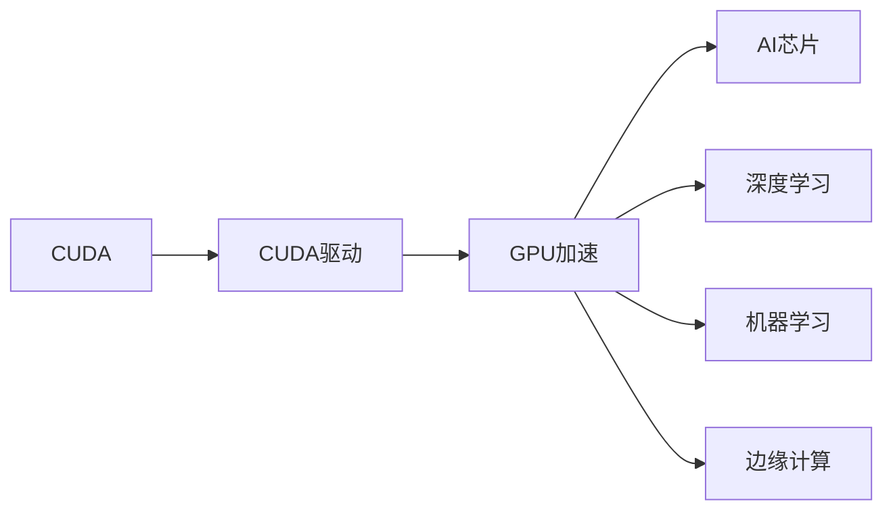

                 

# NVIDIA的GPU革命与AI算力提升

## 1. 背景介绍

在过去的十年里，AI算力从云平台逐渐向边缘计算转移，云计算和数据中心生态逐渐向GPU加速转变。NVIDIA的CUDA和CUDA驱动确保了每个系统都能在计算机视觉、语音识别、自然语言处理和机器学习等AI领域内使用GPU加速。本文将从NVIDIA的GPU驱动和架构入手，探讨GPU在AI中的革命性作用，以及AI技术如何驱动数据中心和企业业务向前发展。

## 2. 核心概念与联系

### 2.1 核心概念概述

- **CUDA**：NVIDIA的计算统一设备架构(CUDA)允许开发者使用C++编写高性能GPU加速程序，简化了GPU并行编程。

- **NVIDIA CUDA驱动**：CUDA驱动负责提供GPU与主系统之间的通信接口，加速GPU数据传输和处理。

- **TPU**：Tensor Processing Unit，由Google设计，用于专门加速TensorFlow模型的训练和推理。

- **GPU加速**：利用GPU的并行计算能力，提高AI训练和推理的速度和性能。

- **AI芯片**：专为AI优化设计的芯片，如NVIDIA的Tesla系列GPU和Google的TPU。

- **深度学习**：通过神经网络进行训练，从大量数据中提取特征的AI技术。

- **机器学习**：使用算法分析数据，从中学习并生成预测模型的AI技术。

- **边缘计算**：数据在本地处理和存储，而不是集中式数据中心。

### 2.2 核心概念间的联系

这些核心概念之间存在密切的联系，它们共同构成了NVIDIA的GPU驱动和架构。

- CUDA和CUDA驱动是硬件与软件的桥梁，实现了GPU与主系统之间的通信和数据传输。
- TPU和AI芯片是为了优化AI计算性能而设计的专用硬件。
- GPU加速是利用并行计算提升AI训练和推理性能的核心技术。
- 深度学习和机器学习是AI技术的重要应用方向。
- 边缘计算利用本地计算资源，减少了数据传输的时间和成本。

通过这些关键概念，可以更好地理解NVIDIA在AI技术中的贡献和影响。

### 2.3 核心概念的整体架构

以下是核心概念之间的整体架构：



## 3. 核心算法原理 & 具体操作步骤
### 3.1 算法原理概述

GPU加速的核心算法原理是并行计算。与CPU相比，GPU具有更多的处理单元，能够同时处理大量数据，适用于高并发计算任务。深度学习模型通常包含大量参数，计算量大，适合在GPU上进行加速训练和推理。

### 3.2 算法步骤详解

1. **数据准备**：将原始数据转换为GPU可以处理的格式，通常需要将数据分块，每个块在GPU上独立处理。

2. **模型加载**：使用CUDA驱动将深度学习模型加载到GPU上，并进行必要的调整，如设置计算图、定义损失函数等。

3. **模型训练**：在GPU上进行前向传播和反向传播，更新模型参数，直到达到预设的收敛条件。

4. **模型推理**：将训练好的模型加载到GPU上，使用GPU加速进行推理计算，返回预测结果。

### 3.3 算法优缺点

**优点**：
- 速度快：GPU的并行计算能力大大提升了深度学习模型的训练和推理速度。
- 精度高：GPU能处理更复杂的计算任务，提升了模型的精度。

**缺点**：
- 成本高：高性能GPU价格昂贵，维护成本高。
- 复杂度高：编程难度大，需要具备较高的并行编程技能。
- 扩展性差：GPU加速的扩展性不如CPU，增加了硬件管理的复杂性。

### 3.4 算法应用领域

GPU加速在多个领域得到广泛应用，包括计算机视觉、语音识别、自然语言处理和机器学习等。以下是几个典型的应用场景：

- **计算机视觉**：图像识别、物体检测、图像分割等任务。
- **语音识别**：语音转文本、情感分析、语音合成等。
- **自然语言处理**：机器翻译、情感分析、问答系统等。
- **机器学习**：模型训练、数据增强、特征提取等。

## 4. 数学模型和公式 & 详细讲解  
### 4.1 数学模型构建

假设我们有一个深度学习模型，其结构为 $M = (W_1, W_2, ..., W_n)$，其中 $W_i$ 为第 $i$ 层的权重矩阵。使用CUDA加速后，模型在GPU上并行运行。

### 4.2 公式推导过程

以下是深度学习模型在GPU上的前向传播计算公式：

$$
z_i = W_i \cdot a_{i-1} + b_i
$$

其中，$z_i$ 为第 $i$ 层的输入，$a_{i-1}$ 为第 $i-1$ 层的输出，$b_i$ 为第 $i$ 层的偏置项。

### 4.3 案例分析与讲解

假设我们有一个简单的线性模型 $M = W \cdot x + b$，其中 $x$ 为输入向量，$W$ 和 $b$ 为权重和偏置项。在GPU上，模型的前向传播计算公式为：

$$
z = W \cdot x + b
$$

其中 $z$ 为模型的输出。在GPU上，可以使用CUDA核函数加速计算。

## 5. 项目实践：代码实例和详细解释说明
### 5.1 开发环境搭建

以下是使用NVIDIA CUDA开发环境的步骤：

1. **安装CUDA**：从NVIDIA官网下载并安装CUDA驱动和SDK。
2. **安装CUDA驱动**：确保CUDA驱动与NVIDIA GPU兼容。
3. **安装CUDA库**：使用CMake生成Makefile，构建编译深度学习模型的代码。
4. **编写CUDA代码**：使用CUDA核函数编写GPU加速代码。
5. **调试和优化**：使用NVIDIA Visual Profiler调试并优化CUDA代码。

### 5.2 源代码详细实现

以下是一个简单的线性模型在GPU上的实现代码：

```c++
__global__ void compute_kernel(int n, float* input, float* output, float* weights, float* biases) {
    int index = blockIdx.x * blockDim.x + threadIdx.x;
    if (index < n) {
        float z = 0;
        for (int i = 0; i < input_size; i++) {
            z += weights[i] * input[index * input_size + i];
        }
        output[index] = z + biases[index];
    }
}

void train_model(float* input, float* output, float* weights, float* biases) {
    dim3 block(32, 32);
    dim3 grid((input_size + blockDim.x - 1) / blockDim.x);
    compute_kernel<<<grid, block>>>(input_size, input, output, weights, biases);
}

void inference(float* input, float* output, float* weights, float* biases) {
    dim3 block(32, 32);
    dim3 grid((input_size + blockDim.x - 1) / blockDim.x);
    compute_kernel<<<grid, block>>>(input_size, input, output, weights, biases);
}
```

### 5.3 代码解读与分析

在上述代码中，`compute_kernel`函数为GPU加速函数，`train_model`和`inference`函数为在GPU上调用`compute_kernel`的接口。`dim3`定义了块大小和网格大小，`<<<grid, block>>>`表示在GPU上并行运行。

## 6. 实际应用场景
### 6.1 数据中心

在大数据中心中，GPU加速被广泛应用于深度学习模型的训练和推理。例如，在Google的TensorFlow中，模型可以在TPU上高效训练。NVIDIA的Tesla GPU也被广泛应用于数据中心，加速深度学习模型的训练和推理。

### 6.2 边缘计算

边缘计算中，GPU加速可以降低数据传输延迟，提高实时性。例如，在自动驾驶系统中，GPU加速可以实时处理摄像头图像，进行物体检测和跟踪。

### 6.3 医疗影像分析

在医疗影像分析中，GPU加速可以处理大规模的医学图像数据，提高诊断的准确性和速度。例如，在CT和MRI图像分析中，GPU加速可以提取出关键的特征点，辅助医生进行诊断。

## 7. 工具和资源推荐
### 7.1 学习资源推荐

1. **《深度学习与GPU加速》**：本书系统介绍了GPU加速在深度学习中的作用，并提供了大量GPU编程示例。
2. **NVIDIA CUDA文档**：NVIDIA官方提供的CUDA文档，包含丰富的API和示例代码。
3. **Google TPU文档**：Google官方提供的TPU文档，包含TPU的架构和使用指南。
4. **NVIDIA Visual Profiler**：NVIDIA提供的GPU性能分析工具，帮助开发者优化代码。
5. **Caffe2**：Facebook开发的深度学习框架，支持CUDA和TPU加速。

### 7.2 开发工具推荐

1. **NVIDIA CUDA Toolkit**：NVIDIA提供的CUDA开发环境，包含CUDA驱动、CUDA库和开发工具。
2. **Google Cloud TPU**：Google提供的TPU云服务，支持大规模深度学习模型的训练和推理。
3. **NVIDIA Tesla GPU**：高性能GPU，支持深度学习模型的加速训练和推理。
4. **PyTorch**：Facebook开发的深度学习框架，支持CUDA加速。
5. **TensorFlow**：Google开发的深度学习框架，支持TPU加速。

### 7.3 相关论文推荐

1. **CUDA加速深度学习**：由NVIDIA发布的学术论文，介绍了CUDA加速在深度学习中的作用和应用。
2. **TPU加速深度学习**：由Google发布的学术论文，介绍了TPU加速在深度学习中的作用和应用。
3. **GPU加速计算机视觉**：由NVIDIA发布的学术论文，介绍了GPU加速在计算机视觉中的应用。

## 8. 总结：未来发展趋势与挑战
### 8.1 研究成果总结

NVIDIA的GPU驱动和架构在AI算力提升中发挥了重要作用。CUDA和CUDA驱动提供了高性能的并行计算能力，GPU加速使得深度学习模型的训练和推理速度大幅提升。TPU和AI芯片进一步优化了AI计算性能，加速了AI技术在各个领域的应用。

### 8.2 未来发展趋势

未来，AI算力将继续向边缘计算和物联网方向扩展。边缘计算将结合GPU和AI芯片，实现更快速、更高效的计算能力。AI芯片将更加专业化，针对特定应用场景进行优化。同时，AI技术将进一步融入企业和数据中心，提升业务效率和竞争力。

### 8.3 面临的挑战

NVIDIA的GPU驱动和架构在AI算力提升中仍面临一些挑战。高性能GPU价格昂贵，增加了企业的硬件成本。GPU编程难度较大，需要具备较高的并行编程技能。AI芯片的扩展性较差，增加了硬件管理的复杂性。

### 8.4 研究展望

未来的研究需要解决GPU编程的复杂性和硬件管理的挑战。同时，需要探索更多的AI芯片和边缘计算解决方案，提升AI算力的扩展性和灵活性。

## 9. 附录：常见问题与解答

**Q1：GPU加速和CPU加速的区别是什么？**

A：GPU加速利用并行计算能力，能处理大量数据和复杂计算任务。CPU加速更适合处理串行任务和控制任务。

**Q2：CUDA和CUDA驱动是什么关系？**

A：CUDA是NVIDIA的计算统一设备架构，CUDA驱动提供GPU与主系统之间的通信接口，加速GPU数据传输和处理。

**Q3：NVIDIA的TPU是什么？**

A：NVIDIA的TPU是专为深度学习优化设计的硬件，可以加速TensorFlow模型的训练和推理。

**Q4：如何提高GPU加速的性能？**

A：可以使用CUDA核函数优化并行计算，使用CUDA库优化内存管理，使用NVIDIA Visual Profiler进行性能分析。

**Q5：NVIDIA的Tesla GPU有哪些优点？**

A：NVIDIA的Tesla GPU具有高性能、高可靠性、高可扩展性，支持大规模深度学习模型的训练和推理。

**Q6：边缘计算和数据中心计算有什么区别？**

A：边缘计算在本地处理数据，减少了数据传输的时间和成本。数据中心计算需要集中式数据中心，数据传输开销较大。

**Q7：NVIDIA的GPU驱动和架构的优势是什么？**

A：GPU驱动和架构提供了高性能的并行计算能力，支持大规模深度学习模型的训练和推理，加速了AI技术在各个领域的应用。

---

作者：禅与计算机程序设计艺术 / Zen and the Art of Computer Programming

