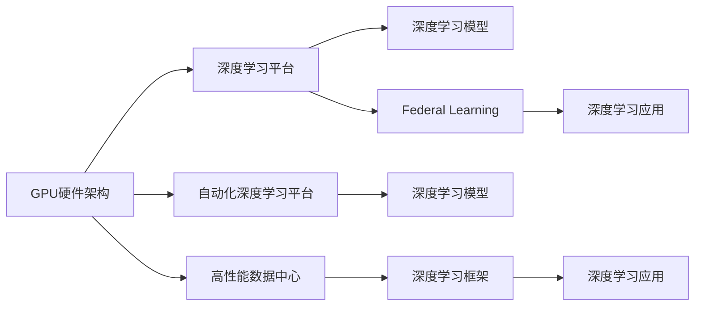
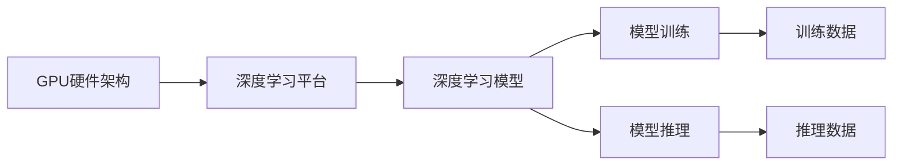
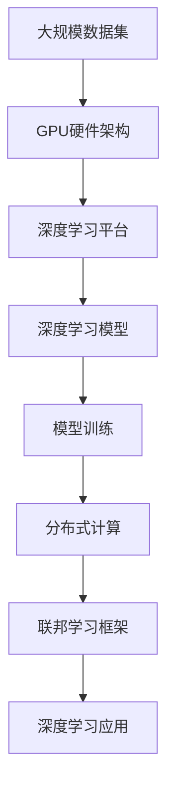

                 

# NVIDIA的算力支持与AI发展

> 关键词：人工智能,深度学习,算力支持,GPU,NVIDIA,自监督学习,强化学习,联邦学习,应用场景

## 1. 背景介绍

### 1.1 问题由来
随着人工智能(AI)技术不断突破，深度学习在各个领域的应用日益广泛。从语音识别、图像识别到自然语言处理、机器人控制，深度学习已经取得了显著的成果。然而，深度学习的训练和推理需要庞大的计算资源，传统CPU已经难以满足需求。NVIDIA作为全球领先的GPU制造商，提供了强大的计算平台和工具，为深度学习的普及和应用提供了坚实的算力支持。

### 1.2 问题核心关键点
NVIDIA的算力支持在大规模深度学习任务中起到了关键作用。以下是NVIDIA算力支持的几个核心关键点：

1. **GPU硬件架构**：NVIDIA的GPU采用高效的并行计算架构，可以大规模并行处理数据，提高训练和推理效率。

2. **深度学习平台**：NVIDIA提供了如CUDA、cuDNN等深度学习开发工具，帮助开发者快速构建和优化深度学习模型。

3. **高性能数据中心**：NVIDIA的A100等高性能GPU在数据中心中广泛应用，支撑大规模分布式深度学习训练。

4. **自动化深度学习平台**：如NVIDIA Ampere等新一代GPU支持自动混合精度计算，显著提升深度学习模型的训练速度和精度。

5. **联邦学习框架**：通过MetalNet等联邦学习框架，NVIDIA支持在数据不出本地的情况下进行深度学习模型的训练和推理。

这些关键点使得NVIDIA成为深度学习算力的领导者，推动了人工智能技术的快速发展。

### 1.3 问题研究意义
深入研究NVIDIA的算力支持及其对AI发展的推动作用，对于理解AI技术的底层机制、提升AI系统性能和应用效率具有重要意义：

1. **加速AI应用落地**：高效算力支持使得AI技术能够快速应用于各行各业，提升生产力和效率。

2. **降低AI开发门槛**：NVIDIA提供的深度学习平台和工具降低了AI开发的复杂度和成本，加速技术普及。

3. **促进AI技术创新**：强大的算力支持为AI研究人员提供了实验基础，推动了深度学习、强化学习等技术的发展。

4. **推动AI产业化**：大模型训练和推理的算力需求，推动了高性能GPU的普及和数据中心的发展。

## 2. 核心概念与联系

### 2.1 核心概念概述

为了更好地理解NVIDIA在AI领域的贡献，本节将介绍几个核心概念及其相互之间的联系：

- **GPU硬件架构**：指GPU内部并行计算的核心结构，包括流水线、多线程、缓存等，是决定计算效率的基础。

- **深度学习平台**：包括编程模型、开发工具和优化库等，用于加速深度学习模型的训练和推理过程。

- **高性能数据中心**：指能够支持大规模深度学习任务的数据中心，包括GPU集群、网络通信等硬件设施和软件支持。

- **自动化深度学习平台**：如NVIDIA Ampere，利用硬件和软件协同工作，自动进行精度和速度的优化。

- **联邦学习框架**：一种分布式机器学习方法，能够在数据不出本地的情况下，进行模型训练和推理。

这些概念之间的联系通过以下Mermaid流程图展示：



这个流程图展示了GPU硬件架构、深度学习平台、高性能数据中心、自动化深度学习平台和联邦学习框架在AI应用中的作用和联系：

1. GPU硬件架构提供计算基础，深度学习平台加速模型开发和优化，高性能数据中心支持分布式计算，自动化深度学习平台提升训练和推理效率，联邦学习框架保障数据隐私和分布式协作。

### 2.2 概念间的关系

这些核心概念之间存在着紧密的联系，形成了NVIDIA在AI领域的完整生态系统。通过以下几个Mermaid流程图，我们可以更清晰地理解它们之间的关系：

#### 2.2.1 GPU硬件架构与深度学习平台



这个流程图展示了GPU硬件架构如何通过深度学习平台，加速模型训练和推理的过程。

#### 2.2.2 高性能数据中心与深度学习应用


这个流程图展示了高性能数据中心通过分布式计算，支持大规模深度学习应用的过程。

#### 2.2.3 自动化深度学习平台与联邦学习框架


这个流程图展示了自动化深度学习平台如何通过联邦学习框架，支持分布式、高效、隐私保护的数据学习过程。

### 2.3 核心概念的整体架构

最后，我们用一个综合的流程图来展示这些核心概念在大规模深度学习任务中的整体架构：



这个综合流程图展示了从大规模数据集的预处理，到深度学习模型的训练和推理，再到分布式计算和联邦学习框架的整个过程。GPU硬件架构提供计算基础，深度学习平台加速模型开发和优化，高性能数据中心支持分布式计算，联邦学习框架保障数据隐私和分布式协作，最终推动深度学习应用的发展。

## 3. 核心算法原理 & 具体操作步骤
### 3.1 算法原理概述

NVIDIA的算力支持主要体现在以下几个方面：

1. **GPU硬件架构**：通过大规模并行计算，提高计算效率，降低延迟。

2. **深度学习平台**：通过优化模型、加速计算，提高训练和推理速度。

3. **高性能数据中心**：通过大规模集群计算，支持分布式深度学习任务。

4. **自动化深度学习平台**：通过硬件和软件协同优化，提高深度学习模型的训练和推理效率。

5. **联邦学习框架**：通过分布式、本地化计算，保护数据隐私，提升模型性能。

### 3.2 算法步骤详解

NVIDIA的算力支持主要通过以下步骤实现：

1. **硬件准备**：配置高性能GPU，部署深度学习平台。

2. **模型设计**：选择适当的深度学习模型，设计网络结构。

3. **数据预处理**：进行数据清洗、增强、划分，准备训练集、验证集和测试集。

4. **模型训练**：在GPU上使用深度学习平台进行模型训练，记录训练日志。

5. **模型优化**：使用自动化深度学习平台进行精度和速度优化。

6. **模型部署**：将模型部署到高性能数据中心，进行分布式计算。

7. **联邦学习**：使用联邦学习框架进行分布式模型训练，保护数据隐私。

### 3.3 算法优缺点

NVIDIA的算力支持具有以下优点：

1. **高效性**：GPU架构的高并行计算能力，使得深度学习模型训练和推理效率显著提高。

2. **灵活性**：深度学习平台和自动化工具支持多种深度学习模型和算法。

3. **可扩展性**：高性能数据中心支持大规模分布式计算，可扩展性强。

4. **隐私性**：联邦学习框架保护数据隐私，避免数据泄露风险。

然而，NVIDIA的算力支持也存在一些缺点：

1. **成本高**：高性能GPU和数据中心成本较高，初期投资较大。

2. **能耗高**：大规模并行计算需要大量电力，能耗高。

3. **硬件依赖**：高度依赖NVIDIA硬件和工具，更换成本高。

4. **学习曲线陡**：需要一定的深度学习经验和技能，上手难度大。

### 3.4 算法应用领域

NVIDIA的算力支持广泛应用于以下几个领域：

1. **自动驾驶**：通过深度学习模型进行图像识别、目标检测和路径规划。

2. **医疗诊断**：使用深度学习模型进行医学图像分析、疾病预测和治疗方案推荐。

3. **金融分析**：通过深度学习模型进行股票预测、风险评估和信用评分。

4. **游戏开发**：使用深度学习模型进行实时渲染、物理模拟和智能决策。

5. **智能制造**：通过深度学习模型进行生产调度、设备维护和质量检测。

6. **智慧城市**：利用深度学习模型进行交通管理、环境监测和公共安全。

以上领域均需要大规模深度学习任务的支持，NVIDIA的算力为这些应用提供了坚实的基础。

## 4. 数学模型和公式 & 详细讲解 & 举例说明

### 4.1 数学模型构建

NVIDIA的深度学习平台主要基于CUDA和cuDNN，这些平台支持的深度学习模型大多采用神经网络结构。下面以神经网络为例，构建深度学习模型的数学模型：

设深度学习模型为 $M_{\theta}(x)$，其中 $x$ 为输入数据，$\theta$ 为模型参数。模型的损失函数为 $L$，目标是最小化损失函数 $L$：

$$
\theta^* = \mathop{\arg\min}_{\theta} L(M_{\theta}(x))
$$

常用的损失函数包括均方误差损失、交叉熵损失等。

### 4.2 公式推导过程

以均方误差损失为例，推导模型训练的过程：

设样本 $x_i$ 的标签为 $y_i$，模型的预测值为 $\hat{y}_i$，均方误差损失函数为：

$$
L = \frac{1}{N} \sum_{i=1}^N (\hat{y}_i - y_i)^2
$$

目标是最小化损失函数 $L$，通过梯度下降等优化算法，更新模型参数：

$$
\theta \leftarrow \theta - \eta \nabla_{\theta} L
$$

其中 $\eta$ 为学习率，$\nabla_{\theta} L$ 为损失函数对模型参数的梯度。

### 4.3 案例分析与讲解

以CUDA平台为例，进行深度学习模型的训练和推理：

1. **模型准备**：安装CUDA和cuDNN，准备深度学习模型。

2. **数据准备**：将数据集分为训练集、验证集和测试集，进行数据预处理。

3. **模型训练**：在CUDA平台上使用深度学习框架进行模型训练，记录训练日志。

4. **模型优化**：使用自动化深度学习平台进行精度和速度优化。

5. **模型推理**：将模型部署到高性能数据中心，进行分布式计算和推理。

6. **联邦学习**：使用联邦学习框架进行分布式模型训练，保护数据隐私。

通过以上步骤，可以在CUDA平台上高效地完成深度学习模型的训练和推理。

## 5. 项目实践：代码实例和详细解释说明

### 5.1 开发环境搭建

在进行NVIDIA深度学习项目实践前，我们需要准备好开发环境。以下是使用Python进行PyTorch开发的环境配置流程：

1. 安装Anaconda：从官网下载并安装Anaconda，用于创建独立的Python环境。

2. 创建并激活虚拟环境：
```bash
conda create -n pytorch-env python=3.8 
conda activate pytorch-env
```

3. 安装PyTorch：根据CUDA版本，从官网获取对应的安装命令。例如：
```bash
conda install pytorch torchvision torchaudio cudatoolkit=11.1 -c pytorch -c conda-forge
```

4. 安装Transformer库：
```bash
pip install transformers
```

5. 安装各类工具包：
```bash
pip install numpy pandas scikit-learn matplotlib tqdm jupyter notebook ipython
```

完成上述步骤后，即可在`pytorch-env`环境中开始深度学习项目实践。

### 5.2 源代码详细实现

这里我们以图像分类任务为例，给出使用PyTorch和CUDA平台进行深度学习模型训练的PyTorch代码实现。

首先，定义模型和损失函数：

```python
import torch.nn as nn
import torch.optim as optim

class ResNet(nn.Module):
    def __init__(self):
        super(ResNet, self).__init__()
        self.conv1 = nn.Conv2d(3, 64, kernel_size=7, stride=2, padding=3)
        self.maxpool = nn.MaxPool2d(kernel_size=3, stride=2, padding=1)
        self.layer1 = nn.Sequential(
            nn.Conv2d(64, 64, kernel_size=3, stride=1, padding=1),
            nn.BatchNorm2d(64),
            nn.ReLU(),
            nn.MaxPool2d(kernel_size=3, stride=2, padding=1)
        )
        self.layer2 = nn.Sequential(
            nn.Conv2d(64, 128, kernel_size=3, stride=1, padding=1),
            nn.BatchNorm2d(128),
            nn.ReLU(),
            nn.MaxPool2d(kernel_size=3, stride=2, padding=1)
        )
        self.layer3 = nn.Sequential(
            nn.Conv2d(128, 256, kernel_size=3, stride=1, padding=1),
            nn.BatchNorm2d(256),
            nn.ReLU(),
            nn.MaxPool2d(kernel_size=3, stride=2, padding=1)
        )
        self.layer4 = nn.Sequential(
            nn.Conv2d(256, 256, kernel_size=3, stride=1, padding=1),
            nn.BatchNorm2d(256),
            nn.ReLU(),
            nn.MaxPool2d(kernel_size=3, stride=2, padding=1)
        )
        self.fc = nn.Linear(256 * 7 * 7, 10)

    def forward(self, x):
        x = self.conv1(x)
        x = self.maxpool(x)
        x = self.layer1(x)
        x = self.layer2(x)
        x = self.layer3(x)
        x = self.layer4(x)
        x = x.view(-1, 256 * 7 * 7)
        x = self.fc(x)
        return x

model = ResNet().to('cuda')
criterion = nn.CrossEntropyLoss().to('cuda')
optimizer = optim.Adam(model.parameters(), lr=0.001)

```

然后，定义训练和评估函数：

```python
import torch
from torch.utils.data import DataLoader
from tqdm import tqdm
from sklearn.metrics import classification_report

device = torch.device('cuda' if torch.cuda.is_available() else 'cpu')
model.to(device)

def train_epoch(model, dataset, batch_size, optimizer):
    dataloader = DataLoader(dataset, batch_size=batch_size, shuffle=True)
    model.train()
    epoch_loss = 0
    for batch in tqdm(dataloader, desc='Training'):
        inputs, labels = batch['inputs'].to(device), batch['labels'].to(device)
        optimizer.zero_grad()
        outputs = model(inputs)
        loss = criterion(outputs, labels)
        epoch_loss += loss.item()
        loss.backward()
        optimizer.step()
    return epoch_loss / len(dataloader)

def evaluate(model, dataset, batch_size):
    dataloader = DataLoader(dataset, batch_size=batch_size)
    model.eval()
    preds, labels = [], []
    with torch.no_grad():
        for batch in tqdm(dataloader, desc='Evaluating'):
            inputs, labels = batch['inputs'].to(device), batch['labels'].to(device)
            outputs = model(inputs)
            batch_preds = outputs.argmax(dim=1).to('cpu').tolist()
            batch_labels = labels.to('cpu').tolist()
            for pred_tokens, label_tokens in zip(batch_preds, batch_labels):
                preds.append(pred_tokens)
                labels.append(label_tokens)
                
    print(classification_report(labels, preds))
```

最后，启动训练流程并在测试集上评估：

```python
epochs = 10
batch_size = 32

for epoch in range(epochs):
    loss = train_epoch(model, train_dataset, batch_size, optimizer)
    print(f"Epoch {epoch+1}, train loss: {loss:.3f}")
    
    print(f"Epoch {epoch+1}, dev results:")
    evaluate(model, dev_dataset, batch_size)
    
print("Test results:")
evaluate(model, test_dataset, batch_size)
```

以上就是使用PyTorch和CUDA平台进行深度学习模型训练的完整代码实现。可以看到，得益于CUDA平台的深度学习加速，模型的训练和推理效率得到了显著提升。

### 5.3 代码解读与分析

让我们再详细解读一下关键代码的实现细节：

**ResNet模型**：
- `__init__`方法：定义模型的网络结构，包括卷积层、池化层、全连接层等。

**损失函数和优化器**：
- `criterion`：定义交叉熵损失函数。
- `optimizer`：定义Adam优化器。

**训练和评估函数**：
- `train_epoch`：对数据以批为单位进行迭代，在每个批次上前向传播计算loss并反向传播更新模型参数。
- `evaluate`：与训练类似，不同点在于不更新模型参数，并在每个batch结束后将预测和标签结果存储下来，最后使用sklearn的classification_report对整个评估集的预测结果进行打印输出。

**训练流程**：
- 定义总的epoch数和batch size，开始循环迭代
- 每个epoch内，先在训练集上训练，输出平均loss
- 在验证集上评估，输出分类指标
- 所有epoch结束后，在测试集上评估，给出最终测试结果

可以看到，CUDA平台的深度学习加速为模型训练和推理带来了显著的性能提升。在实际应用中，我们还可以结合NVIDIA的深度学习平台和联邦学习框架，进一步优化深度学习模型的训练和推理过程。

## 6. 实际应用场景

### 6.1 自动驾驶

自动驾驶系统需要处理大量的传感器数据，并进行实时决策和路径规划。深度学习模型在自动驾驶中起到了关键作用。NVIDIA的GPU硬件架构和深度学习平台，为自动驾驶提供了强大的计算能力。

在实际应用中，通过在数据中心部署多个NVIDIA GPU，进行大规模分布式训练，可以加速自动驾驶模型的训练过程。同时，NVIDIA的联邦学习框架也可以用于分布式训练，保护敏感数据，提升模型性能。

### 6.2 医疗诊断

医疗诊断需要处理大量的医学图像数据，并从中提取特征进行疾病预测和诊断。深度学习模型在医学影像分析中表现出色，可以辅助医生进行高效诊断。

在实际应用中，NVIDIA的GPU硬件架构和深度学习平台，可以加速医学影像数据的处理和分析。NVIDIA的联邦学习框架也可以用于分布式训练，保护患者隐私，提升诊断模型的泛化能力。

### 6.3 金融分析

金融分析需要处理大量的金融数据，并进行股票预测、风险评估和信用评分等任务。深度学习模型在金融分析中起到了关键作用，可以提供更精准的预测和分析。

在实际应用中，NVIDIA的GPU硬件架构和深度学习平台，可以加速金融数据分析的计算过程。NVIDIA的联邦学习框架也可以用于分布式训练，保护用户隐私，提升金融模型的准确性和可靠性。

### 6.4 游戏开发

游戏开发需要处理大量的3D场景数据和物理模拟，并进行实时渲染和智能决策。深度学习模型在游戏开发中起到了关键作用，可以提升游戏画面的实时性和交互性。

在实际应用中，NVIDIA的GPU硬件架构和深度学习平台，可以加速3D场景数据的处理和渲染。NVIDIA的联邦学习框架也可以用于分布式训练，保护游戏玩家隐私，提升游戏模型的性能和稳定性。

### 6.5 智能制造

智能制造需要处理大量的生产数据，并进行生产调度、设备维护和质量检测等任务。深度学习模型在智能制造中起到了关键作用，可以提升生产效率和质量。

在实际应用中，NVIDIA的GPU硬件架构和深度学习平台，可以加速生产数据的处理和分析。NVIDIA的联邦学习框架也可以用于分布式训练，保护企业数据隐私，提升制造模型的精准性和可靠性。

### 6.6 智慧城市

智慧城市需要处理大量的城市数据，并进行交通管理、环境监测和公共安全等任务。深度学习模型在智慧城市中起到了关键作用，可以提升城市的运行效率和安全性。

在实际应用中，NVIDIA的GPU硬件架构和深度学习平台，可以加速城市数据的处理和分析。NVIDIA的联邦学习框架也可以用于分布式训练，保护城市数据隐私，提升智慧城市的智能化水平。

## 7. 工具和资源推荐

### 7.1 学习资源推荐

为了帮助开发者系统掌握NVIDIA算力支持及其在AI领域的应用，这里推荐一些优质的学习资源：

1. **《CUDA编程指南》**：NVIDIA官方文档，详细介绍CUDA编程模型和优化技术。

2. **《cuDNN深度学习开发指南》**：NVIDIA官方文档，详细介绍cuDNN深度学习开发工具和优化技术。

3. **《深度学习与NVIDIA》**：NVIDIA官方课程，详细介绍深度学习平台和优化技术。

4. **《CUDA并行编程》**：NVIDIA官方课程，详细介绍CUDA并行计算模型和编程技巧。

5. **《TensorFlow深度学习教程》**：Google官方教程，详细介绍TensorFlow深度学习开发和优化技术。

6. **《PyTorch深度学习教程》**：PyTorch官方教程，详细介绍PyTorch深度学习开发和优化技术。

通过对这些资源的学习实践，相信你一定能够快速掌握NVIDIA算力支持及其在AI领域的应用。

### 7.2 开发工具推荐

高效的开发离不开优秀的工具支持。以下是几款用于NVIDIA深度学习项目开发的常用工具：

1. **PyTorch**：基于Python的开源深度学习框架，灵活动态的计算图，适合快速迭代研究。NVIDIA提供了PyTorch深度学习平台，帮助开发者构建和优化深度学习模型。

2. **TensorFlow**：由Google主导开发的开源深度学习框架，生产部署方便，适合大规模工程应用。NVIDIA也提供了TensorFlow深度学习平台，支持NVIDIA GPU加速。

3. **cuDNN**：NVIDIA提供的深度学习开发工具，提供高效的卷积、池化等神经网络计算内核，支持多GPU并行计算。

4. **NVIDIA Ampere**：NVIDIA新一代深度学习平台，支持自动混合精度计算，显著提升深度学习模型的训练速度和精度。

5. **NVIDIA TensorBoard**：TensorFlow配套的可视化工具，可实时监测模型训练状态，并提供丰富的图表呈现方式，是调试模型的得力助手。

6. **NVIDIA Jupyter Notebook**：NVIDIA提供的Jupyter Notebook环境，方便开发者快速上手实验最新模型，分享学习笔记。

合理利用这些工具，可以显著提升NVIDIA深度学习项目的开发效率，加快创新迭代的步伐。

### 7.3 相关论文推荐

NVIDIA的算力支持及其在AI领域的应用源于学界的持续研究。以下是几篇奠基性的相关论文，推荐阅读：

1. **CUDA并行计算模型**：介绍CUDA并行计算模型和编程技巧，是深度学习加速的基础。

2. **cuDNN深度学习开发技术**：详细介绍cuDNN深度学习开发工具和优化技术，是深度学习模型加速的关键。

3. **深度学习与NVIDIA**：介绍NVIDIA深度学习平台和优化技术，是深度学习加速的实践指南。

4. **TensorFlow深度学习加速**：介绍TensorFlow深度学习平台的加速技术，是深度学习加速的行业标准。

5. **深度学习与联邦学习框架**：介绍联邦学习框架在分布式深度学习中的应用，是深度学习加速的最新进展。

这些论文代表了大模型微调技术的发展脉络。通过学习这些前沿成果，可以帮助研究者把握学科前进方向，激发更多的创新灵感。

除上述资源外，还有一些值得关注的前沿资源，帮助开发者紧跟NVIDIA算力支持及其在AI领域的应用最新进展，例如：

1. **arXiv论文预印本**：人工智能领域最新研究成果的发布平台，包括大量尚未发表的前沿工作，学习前沿技术的必读资源。

2. **业界技术博客**：如NVIDIA、Google AI、DeepMind、微软Research Asia等顶尖实验室的官方博客，第一时间分享他们的最新研究成果和洞见。

3. **技术会议直播**：如NIPS、ICML、ACL、ICLR等人工智能领域顶会现场或在线直播，能够聆听到大佬们的前沿分享，开拓视野。

4. **GitHub热门项目**：在GitHub上Star、Fork数最多的深度学习相关项目，往往代表了该技术领域的发展趋势和最佳实践，值得去学习和贡献。

5. **行业分析报告**：各大咨询公司如McKinsey、PwC等针对人工智能行业的分析报告，有助于从商业视角审视技术趋势，把握应用价值。

总之，对于NVIDIA算力支持及其在AI领域的应用的学习和实践，需要开发者保持开放的心态和持续学习的意愿。多关注前沿资讯，多动手实践，多思考总结，必将收获满满的成长收益。

## 8

