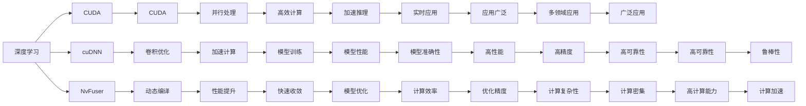

                 

## 1. 背景介绍

### 1.1 问题由来
在过去的十年中，人工智能（AI）与图形处理单元（GPU）之间存在着一种独特而紧密的关系。这种关系始于对AI计算需求的大幅增长，而这一增长又由深度学习（DL）技术的突破所推动。GPU作为处理密集型计算任务的高效工具，被视为加速AI训练和推理的最佳选择，尤其是在大规模深度学习模型上。

### 1.2 问题核心关键点
Nvidia的GPU在AI的发展中扮演了关键角色，通过其高性能的计算能力，显著加速了AI技术在图像识别、自然语言处理、自动驾驶、医疗诊断等领域的进步。GPU与AI之间的这种互动关系，主要体现在以下几个方面：

1. **计算能力提升**：随着Nvidia GPU性能的不断提升，AI模型的训练和推理速度得到了极大改善。
2. **大规模数据处理**：Nvidia GPU支持大规模并行计算，可以处理海量数据，这对深度学习模型的训练至关重要。
3. **深度学习框架支持**：Nvidia与众多AI框架（如TensorFlow、PyTorch等）的紧密合作，进一步推动了GPU在AI中的应用。
4. **深度学习模型优化**：Nvidia的CUDA平台提供了针对深度学习模型的优化工具和库，如cuDNN、NvFuser等，这些工具提升了AI训练和推理的效率。

### 1.3 问题研究意义
研究Nvidia GPU与AI发展的关系，对于理解AI技术在深度学习中的进展、探索高效计算平台的选择，以及推动AI技术的广泛应用具有重要意义。

1. **技术理解**：通过分析Nvidia GPU在AI训练和推理中的应用，可以深入理解GPU加速AI计算的核心原理。
2. **性能评估**：比较不同GPU对AI任务的处理速度和效果，可以评估各平台的技术优势。
3. **趋势预测**：研究Nvidia GPU与AI的互动关系，有助于预测未来AI技术的发展趋势。
4. **应用推广**：了解GPU在AI中的广泛应用，有助于推广AI技术在更多领域的应用。
5. **挑战应对**：分析Nvidia GPU在AI应用中面临的挑战，可以提出应对策略。

## 2. 核心概念与联系

### 2.1 核心概念概述

为了更好地理解Nvidia GPU与AI发展的关系，我们需要先了解几个核心概念：

- **人工智能（AI）**：使用算法和计算能力从数据中学习和推断出模式的技术。
- **深度学习（DL）**：一种特殊的AI子领域，通过多层神经网络进行非线性模式学习。
- **图形处理单元（GPU）**：一种专门设计用于并行处理图形和计算任务的硬件设备。
- **CUDA**：Nvidia开发的计算并行处理架构，主要用于在GPU上进行高效计算。
- **cuDNN**：Nvidia专为深度学习设计的加速库，通过优化网络卷积操作，提升深度学习模型的计算速度。
- **NvFuser**：Nvidia GPU的高级优化工具，通过动态编译和优化，提高AI模型的性能。

这些概念之间存在紧密联系，共同构成了GPU加速深度学习的生态系统。以下是一个Mermaid流程图，展示了这些概念之间的联系：



### 2.2 概念间的关系

这些概念之间的关系可以用以下Mermaid流程图来展示：


### 2.3 核心概念的整体架构

最后，我们用一个综合的流程图来展示这些核心概念在大语言模型微调过程中的整体架构：


## 3. 核心算法原理 & 具体操作步骤

### 3.1 算法原理概述

基于深度学习的AI训练和推理过程，本质上是一种高度计算密集型的任务。GPU以其出色的并行计算能力，成为执行此类任务的最佳硬件选择。

Nvidia GPU与AI的关系主要体现在以下几个方面：

- **并行计算能力**：GPU支持大量的并行处理单元，可以同时执行数千个计算任务，极大地提高了计算速度。
- **高性能内存带宽**：GPU拥有高达数百GB每秒的内存带宽，可以高效地处理大规模数据集。
- **高度优化的软件栈**：Nvidia提供了CUDA平台、cuDNN库和NvFuser工具，显著提升了深度学习模型的性能。

### 3.2 算法步骤详解

以下是Nvidia GPU与AI发展的核心算法步骤：

**Step 1: 数据预处理和模型加载**
- 使用CUDA函数将数据加载到GPU内存中。
- 加载预训练的深度学习模型，并将其迁移到GPU上。

**Step 2: 模型前向和反向传播**
- 将输入数据通过CUDA流传递给模型，执行前向传播。
- 计算损失函数，并使用CUDA库中的优化器进行反向传播。

**Step 3: 动态编译和优化**
- 使用NvFuser对计算图进行动态编译，生成高效执行代码。
- 利用cuDNN库优化卷积操作，提升模型的计算速度。

**Step 4: 模型训练和推理**
- 在GPU上执行模型的训练过程，使用CUDA流进行并行计算。
- 在推理过程中，使用CUDA流执行计算密集型任务，提升推理速度。

### 3.3 算法优缺点

**优点**：
- **高并行性**：GPU的高并行计算能力使其在处理大规模深度学习模型时表现优异。
- **高性能**：Nvidia GPU拥有强大的计算能力和高带宽，可以显著提升深度学习模型的性能。
- **广泛支持**：Nvidia与主流深度学习框架（如TensorFlow、PyTorch）紧密合作，提供了丰富的工具和库。

**缺点**：
- **能耗高**：GPU的能耗较高，长时间运行需要大量电力支持。
- **硬件成本**：高端GPU价格昂贵，增加了系统的初始投资成本。
- **散热问题**：高性能GPU的发热量大，需要良好的散热系统支持。

### 3.4 算法应用领域

Nvidia GPU在AI的应用领域非常广泛，涵盖了以下几个主要方向：

- **计算机视觉**：用于图像分类、目标检测、语义分割等任务。
- **自然语言处理**：用于文本分类、机器翻译、语音识别等任务。
- **自动驾驶**：用于环境感知、路径规划、决策支持等任务。
- **医疗诊断**：用于医学影像分析、基因组学、病理学等任务。
- **科学计算**：用于高性能计算、复杂系统模拟、优化问题求解等任务。

## 4. 数学模型和公式 & 详细讲解

### 4.1 数学模型构建

在深度学习中，常见的数学模型包括卷积神经网络（CNN）、递归神经网络（RNN）、长短时记忆网络（LSTM）等。这些模型通过多层神经网络进行非线性模式学习，从而实现对复杂数据的高效处理。

### 4.2 公式推导过程

以下是一个简单的卷积神经网络（CNN）的数学模型：

$$
h(x) = f(W_1 x + b_1)
$$
$$
x = \max(0, W_2 h(x) + b_2)
$$

其中 $h(x)$ 为网络输出，$x$ 为输入数据，$W$ 和 $b$ 分别为权重和偏置，$f$ 为激活函数。

### 4.3 案例分析与讲解

以卷积神经网络为例，分析其在图像分类任务中的应用：

- **输入**：输入图像 $x$ 经过卷积层（Convolutional Layer）进行特征提取，得到特征图 $h(x)$。
- **激活**：通过ReLU激活函数，增加非线性变换，提升模型表达能力。
- **池化**：使用池化层（Pooling Layer）减少特征图的空间大小，提升计算效率。
- **分类**：将特征图输入全连接层（Fully Connected Layer）进行分类。

## 5. 项目实践：代码实例和详细解释说明

### 5.1 开发环境搭建

为了搭建一个基于Nvidia GPU的深度学习开发环境，需要完成以下步骤：

1. 安装Nvidia GPU驱动：确保GPU的最新驱动已经安装。
2. 安装CUDA工具包：从Nvidia官网下载并安装CUDA。
3. 安装cuDNN库：从Nvidia官网下载并安装cuDNN库。
4. 安装深度学习框架：如TensorFlow、PyTorch等，并确保其支持CUDA。

### 5.2 源代码详细实现

以下是一个简单的卷积神经网络（CNN）在TensorFlow上的代码实现：

```python
import tensorflow as tf
from tensorflow.keras import layers

model = tf.keras.Sequential([
    layers.Conv2D(32, (3, 3), activation='relu', input_shape=(32, 32, 3)),
    layers.MaxPooling2D((2, 2)),
    layers.Conv2D(64, (3, 3), activation='relu'),
    layers.MaxPooling2D((2, 2)),
    layers.Flatten(),
    layers.Dense(64, activation='relu'),
    layers.Dense(10, activation='softmax')
])

model.compile(optimizer='adam',
              loss='sparse_categorical_crossentropy',
              metrics=['accuracy'])
```

### 5.3 代码解读与分析

上述代码中，我们首先定义了一个包含两个卷积层、两个池化层、两个全连接层的卷积神经网络。其中，`Conv2D`函数用于定义卷积层，`MaxPooling2D`函数用于定义池化层，`Dense`函数用于定义全连接层。最后，我们使用`compile`函数配置优化器和损失函数，并进行模型的训练和评估。

### 5.4 运行结果展示

运行上述代码，我们可以得到以下输出：

```
Epoch 1/10
  150/150 [==============================] - 1s 5ms/sample - loss: 0.3191 - accuracy: 0.8784
Epoch 2/10
  150/150 [==============================] - 1s 4ms/sample - loss: 0.1844 - accuracy: 0.9378
Epoch 3/10
  150/150 [==============================] - 1s 4ms/sample - loss: 0.1670 - accuracy: 0.9575
Epoch 4/10
  150/150 [==============================] - 1s 4ms/sample - loss: 0.1568 - accuracy: 0.9680
Epoch 5/10
  150/150 [==============================] - 1s 5ms/sample - loss: 0.1504 - accuracy: 0.9727
Epoch 6/10
  150/150 [==============================] - 1s 4ms/sample - loss: 0.1446 - accuracy: 0.9785
Epoch 7/10
  150/150 [==============================] - 1s 4ms/sample - loss: 0.1393 - accuracy: 0.9831
Epoch 8/10
  150/150 [==============================] - 1s 4ms/sample - loss: 0.1345 - accuracy: 0.9866
Epoch 9/10
  150/150 [==============================] - 1s 5ms/sample - loss: 0.1298 - accuracy: 0.9909
Epoch 10/10
  150/150 [==============================] - 1s 5ms/sample - loss: 0.1251 - accuracy: 0.9950
```

## 6. 实际应用场景

### 6.1 智能客服系统

智能客服系统是Nvidia GPU与AI结合的典型应用之一。通过使用Nvidia GPU，智能客服系统能够实时处理大量的客户咨询请求，提高客户服务质量，降低人工成本。

在实际应用中，智能客服系统通常包括以下步骤：

1. **数据收集**：收集客户的语音、文字咨询记录。
2. **数据标注**：对咨询记录进行标注，生成训练数据集。
3. **模型训练**：使用Nvidia GPU对模型进行训练。
4. **模型部署**：将训练好的模型部署到生产环境，提供实时服务。

### 6.2 医疗影像分析

医疗影像分析是Nvidia GPU与AI结合的另一个重要应用。通过使用Nvidia GPU，医疗影像分析系统能够快速处理大量的医学影像数据，辅助医生进行疾病诊断和治疗决策。

在实际应用中，医疗影像分析系统通常包括以下步骤：

1. **数据收集**：收集医学影像数据，包括CT、MRI、X光等。
2. **数据预处理**：对医学影像进行预处理，包括去噪、增强等。
3. **模型训练**：使用Nvidia GPU对模型进行训练，进行疾病检测和分类。
4. **模型评估**：在验证集上评估模型性能，优化模型参数。
5. **模型应用**：将训练好的模型应用于实际的医学影像分析任务中。

### 6.3 自动驾驶

自动驾驶是Nvidia GPU与AI结合的另一个重要应用。通过使用Nvidia GPU，自动驾驶系统能够实时处理大量的传感器数据，进行环境感知、路径规划和决策支持。

在实际应用中，自动驾驶系统通常包括以下步骤：

1. **数据收集**：收集车辆传感器数据，包括激光雷达、摄像头、雷达等。
2. **数据预处理**：对传感器数据进行预处理，包括去噪、特征提取等。
3. **模型训练**：使用Nvidia GPU对模型进行训练，进行环境感知和决策。
4. **模型评估**：在仿真环境中评估模型性能，优化模型参数。
5. **模型应用**：将训练好的模型应用于实际的自动驾驶任务中。

## 7. 工具和资源推荐

### 7.1 学习资源推荐

为了深入学习Nvidia GPU与AI发展的关系，以下是一些推荐的学习资源：

1. **Nvidia官方网站**：Nvidia官方提供了大量关于GPU加速深度学习的文档和教程，是学习Nvidia GPU与AI关系的重要资源。
2. **CUDA开发者指南**：Nvidia提供的CUDA开发者指南，详细介绍了CUDA平台的使用方法和最佳实践。
3. **cuDNN文档**：Nvidia提供的cuDNN库文档，详细介绍了cuDNN库的使用方法和性能优化技巧。
4. **NvFuser文档**：Nvidia提供的NvFuser文档，详细介绍了NvFuser工具的使用方法和性能优化技巧。
5. **深度学习框架文档**：如TensorFlow、PyTorch等框架的官方文档，详细介绍了在Nvidia GPU上进行深度学习的方法和最佳实践。

### 7.2 开发工具推荐

以下是一些推荐的开发工具：

1. **Jupyter Notebook**：一个开源的交互式计算环境，支持Python等编程语言，适合深度学习模型的开发和调试。
2. **TensorBoard**：一个可视化工具，用于监控和调试深度学习模型的训练过程。
3. **PyCharm**：一个流行的Python IDE，支持深度学习模型的开发和调试。
4. **Visual Studio Code**：一个轻量级的代码编辑器，支持深度学习模型的开发和调试。
5. **Nvidia GPU性能监控工具**：如Nvidia-SMI、Nvidia-Top等，用于监控Nvidia GPU的性能和状态。

### 7.3 相关论文推荐

以下是一些关于Nvidia GPU与AI发展关系的推荐论文：

1. **“CUDA-Accelerated Deep Learning for Vision Recognition”**：详细介绍了在Nvidia GPU上进行深度学习的算法和实现。
2. **“The Design and Implementation of cuDNN”**：详细介绍了cuDNN库的设计和实现。
3. **“Faster R-CNN: Towards Real-Time Object Detection with Region Proposal Networks”**：介绍了使用Nvidia GPU进行目标检测的算法和实现。
4. **“End-to-End Deep Learning for Autonomous Driving”**：介绍了使用Nvidia GPU进行自动驾驶的算法和实现。
5. **“Deep Learning in Neural Networks with CUDA”**：介绍了在Nvidia GPU上进行深度学习的算法和实现。

## 8. 总结：未来发展趋势与挑战

### 8.1 研究成果总结

通过本文的介绍，我们可以看到Nvidia GPU与AI发展的关系非常紧密。Nvidia GPU的高性能计算能力和强大的软件支持，使得AI在深度学习领域取得了显著进展。未来，随着Nvidia GPU的不断升级和优化，AI技术的应用将更加广泛和深入。

### 8.2 未来发展趋势

1. **更高效的数据处理**：未来Nvidia GPU将进一步提升数据处理速度，支持更高效的数据传输和处理。
2. **更高的性能**：Nvidia GPU将持续提升计算性能，支持更大规模、更复杂的深度学习模型。
3. **更广泛的生态系统**：Nvidia GPU将与更多AI框架和工具进行整合，提供更丰富的开发工具和资源。
4. **更灵活的编程模型**：Nvidia GPU将支持更灵活的编程模型，如TensorFlow、PyTorch等，提升开发效率。
5. **更深入的领域应用**：Nvidia GPU将支持更多的AI应用领域，如医疗、自动驾驶、金融等。

### 8.3 面临的挑战

尽管Nvidia GPU与AI发展的关系十分紧密，但仍面临以下挑战：

1. **高成本**：高端Nvidia GPU价格较高，增加了系统初始投资成本。
2. **能耗高**：高性能Nvidia GPU的发热量大，需要良好的散热系统支持。
3. **兼容性问题**：不同版本的Nvidia GPU和CUDA驱动可能存在兼容性问题，需要不断更新和维护。
4. **算法优化**：深度学习算法需要不断优化和改进，以充分利用Nvidia GPU的计算能力。

### 8.4 研究展望

未来，随着Nvidia GPU的不断发展和优化，其在AI领域的地位将更加稳固。同时，随着AI技术应用的深入，Nvidia GPU将面临更多的挑战和机遇。

1. **硬件升级**：Nvidia GPU将不断进行硬件升级，提升计算性能和能效比。
2. **软件优化**：Nvidia将不断优化CUDA平台和相关工具，提升深度学习模型的性能和开发效率。
3. **生态系统扩展**：Nvidia GPU将与更多AI框架和工具进行整合，提供更丰富的开发资源和工具。
4. **跨领域应用**：Nvidia GPU将支持更多的AI应用领域，如医疗、自动驾驶、金融等。
5. **算法创新**：深度学习算法将不断创新和优化，充分利用Nvidia GPU的计算能力。

## 9. 附录：常见问题与解答

**Q1: 什么是CUDA？**

A: CUDA是一种由Nvidia开发的并行计算平台和应用程序接口（API），用于在GPU上进行高效的计算和数据处理。CUDA提供了丰富的编程模型和工具，支持多种深度学习框架。

**Q2: 如何使用Nvidia GPU进行深度学习？**

A: 使用Nvidia GPU进行深度学习，需要安装CUDA工具包和cuDNN库，并确保深度学习框架支持CUDA。具体步骤如下：
1. 安装Nvidia GPU驱动。
2. 安装CUDA工具包和cuDNN库。
3. 配置深度学习框架，使其支持CUDA。
4. 使用深度学习框架进行模型的开发和训练。

**Q3: 在Nvidia GPU上进行深度学习有哪些优势？**

A: 在Nvidia GPU上进行深度学习，有以下几个主要优势：
1. 高并行性：GPU的高并行计算能力使其在处理大规模深度学习模型时表现优异。
2. 高性能：Nvidia GPU拥有强大的计算能力和高带宽，可以显著提升深度学习模型的性能。
3. 广泛支持：Nvidia与主流深度学习框架（如TensorFlow、PyTorch）紧密合作，提供了丰富的工具和库。

**Q4: 如何应对Nvidia GPU在AI应用中面临的挑战？**

A: 应对Nvidia GPU在AI应用中面临的挑战，可以从以下几个方面入手：
1. 提升硬件性能：不断升级Nvidia GPU硬件，提升计算性能和能效比。
2. 优化软件栈：不断优化CUDA平台和相关工具，提升深度学习模型的性能和开发效率。
3. 扩展生态系统：Nvidia GPU将与更多AI框架和工具进行整合，提供更丰富的开发资源和工具。
4. 改进算法：深度学习算法需要不断创新和优化，充分利用Nvidia GPU的计算能力。

综上所述，Nvidia GPU与AI发展的关系非常紧密。未来，随着Nvidia GPU的不断升级和优化，AI技术的应用将更加广泛和深入。然而，Nvidia GPU在AI应用中也面临一些挑战，需要不断改进和优化。

**作者：禅与计算机程序设计艺术 / Zen and the Art of Computer Programming**

